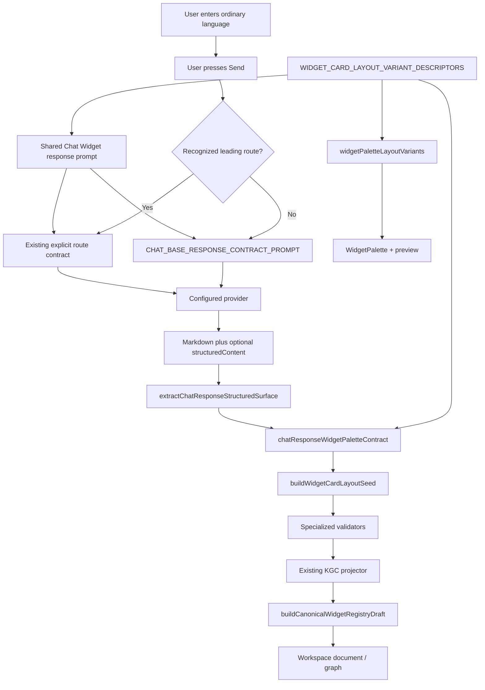

# Design Document

## Overview

Knowgrph already supports natural-language invocation through ordinary no-slash FloatingPanel Chat
submission. `FloatingPanelChatComposer` captures the text, `buildChatSubmitRequestContext` selects
`CHAT_BASE_RESPONSE_CONTRACT_PROMPT`, and the configured provider receives the user message. The
feature therefore does not need a lexical invocation detector or a second suggestion surface.

The implementation target is the response side of that existing path. When an LLM returns
`response.structuredContent.widgets`, a record may select one of the four canonical Props Panel
Widget Card layouts with `layoutVariantId`. The shared Chat adapter resolves that ID from
`WIDGET_CARD_LAYOUT_VARIANT_DESCRIPTORS`, applies `buildWidgetCardLayoutSeed`, and then lets the
existing structured-response extractor and KGC projector continue unchanged.

This design removes the transferred draft's proposed resolver, suggestion UI, confidence
thresholds, auto-apply semantics, and detection-input truncation. Those concepts duplicate the
existing LLM submit path and do not answer the browser comments about response-contract reuse.

### Design principles

- **Existing submit path.** Natural language remains a normal user message to the configured LLM.
- **Canonical descriptor owner.** The palette and Chat prompt derive the four Widget Card layouts
  from one descriptor array.
- **Canonical seed owner.** Drag/drop, Chat, and Probe-Tree reuse
  `buildWidgetCardLayoutSeed`.
- **One response projector.** Structured nodes continue through the existing extractor, registry
  builder, and KGC frontmatter projector.
- **User-owned send.** No model call or graph mutation occurs before Send.
- **Fail safe.** Unknown layout IDs receive no canonical seed and are never fuzzy-matched.
- **Dev only.** No release, Prod, or Cloudflare behavior is part of the implementation.

## Current Repository Grounding

| Concern | Current owner | Contract to preserve or extend |
| --- | --- | --- |
| Composer sigil menu | `canvas/src/features/chat/floatingPanelChat/FloatingPanelChatComposer.tsx` | `/`, `#`, `@` editing stays trigger-driven. |
| Explicit route parsing | `canvas/src/features/chat/chatRuntimeInvocationQuery.ts` | Leading route is metadata; provider receives the remaining query. |
| Response-contract selection | `canvas/src/features/chat/floatingPanelChat/floatingPanelChatSubmitProfile.ts` | No-slash selects `plain`; recognized routes may select `kgc`. |
| Submit context | `canvas/src/features/chat/floatingPanelChat/floatingPanelChatSubmitRequest.ts` | Plain requests use `CHAT_BASE_RESPONSE_CONTRACT_PROMPT`. |
| Generic LLM response schema | `canvas/src/features/chat/chatBaseResponseContractPrompt.ts` | Markdown plus optional `response.structuredContent`. |
| KGC LLM response schema | `canvas/src/features/chat/chatBaseKgcResponseContractPrompt.ts` | Full KGC response with the same Widget layout fragment. |
| Structured extraction | `canvas/src/features/chat/chatResponseStructuredContent.ts` | `extractChatResponseStructuredSurface` normalizes LLM and MCP envelopes. |
| Chat Widget adapter | `canvas/src/features/chat/chatResponseWidgetPaletteContract.ts` | Own canonical layout application plus generic identity/handle defaults. |
| Workspace projection | `canvas/src/features/chat/chatResponseStructuredContentProjector.ts` | Registry/frontmatter/flow projection remains idempotent. |
| Registry drafts | `canvas/src/features/storyboard-widget-manager/registryTemplates.ts` | `buildCanonicalWidgetRegistryDraft` owns fields, ports, and schema mappings. |
| Props registry input | `canvas/src/features/toolbar/FloatingPropsPanel.tsx` | Read `effectiveWidgetRegistry`; do not rebuild it locally. |
| Palette filtering | `isPropsPanelWidgetPaletteEntry` in `registryTemplates.ts` | Shared enabled-entry eligibility. |
| Palette layout rows | `canvas/src/features/toolbar/widgetPaletteLayoutVariants.ts` | Map canonical descriptors plus other eligible registry shapes. |
| Palette UI | `WidgetPalette.tsx` and `WidgetPaletteCardLayoutPreview.tsx` | Props Panel remains the only visible palette/preview owner. |
| Descriptor and seed SSOT | `canvas/src/lib/storyboardWidget/widgetCardLayoutVariants.ts` | Own the four IDs, descriptors, and property seeds. |
| Drag/drop seed application | `useStoryboardWidgetDropBridge.ts` | Manual layout selection applies the canonical seed. |
| Probe-Tree semantics | `canvas/src/features/chat/probeTreeStructuredResponseContract.ts` | Reuse Type 2 seed; retain specialized semantic validation. |

### Existing Props Panel path

```text
effectiveWidgetRegistry
  -> filter(isPropsPanelWidgetPaletteEntry)
  -> listWidgetPaletteLayoutVariants(entries, aspectRatio)
  -> WidgetPaletteCardLayoutPreview
  -> drag payload layoutVariantId
  -> buildWidgetCardLayoutSeed(layoutVariantId)
  -> graph node
```

### Existing Chat response path

```text
assistant Markdown / response.structuredContent / MCP result
  -> extractChatResponseStructuredSurface
  -> projectChatResponseStructuredSurfaceIntoKgcFrontmatter
  -> buildCanonicalWidgetRegistryDraft
  -> flow nodes + edges + document Widget registry
```

The feature joins these paths by making the four canonical layout descriptors and seeds available
inside the existing Chat extractor.

## Scope and Non-Goals

### In scope

- Add descriptor metadata beside the existing four canonical Widget Card layout IDs.
- Make the Props Panel palette map those shared descriptors instead of recreating four records.
- Add a shared Chat response-contract fragment generated from the descriptor array.
- Define canonical `layoutVariantId` for `response.structuredContent.widgets`.
- Resolve the layout and seed before generic Chat node inference.
- Move generic Chat Widget identity/form/handle defaults into one focused adapter.
- Reuse the Probe-Tree Type 2 seed in its specialized response normalizer.
- Preserve existing extractor/projector/finalize/workspace-apply ownership.

### Out of scope

- A local lexical/NLP invocation resolver.
- Confidence scores, ranking thresholds, or auto-apply.
- A natural-language suggestion popover.
- Changes to the `/`, `#`, or `@` composer menus.
- Dynamic serialization of every effective/custom registry entry to the LLM.
- A Widget palette rendered inside Chat messages.
- Calling the imperative drag/drop/add-node bridge from Chat.
- Provider selection, credential storage, or token-pricing changes.
- Canvas geometry authored by the model.
- Prod, release, Cloudflare, or cross-repository publication.

## Architecture



### Ownership rule

Chat owns only the adapter that applies a provider-selected canonical Widget Card layout to a
structured record. It does not own palette rows, previews, Widget seeds, registry schemas, drag/drop
mutation, or KGC projection.

## Detailed Design

### 1. Keep no-slash submission unchanged

`buildChatSubmitRequestContext` already derives:

```typescript
const userQuery = readLastUserMessageContent(nextMessages, assistantMessageId)
const responseContract = resolveChatSubmitResponseContract({
  chatStorageTarget,
  userQuery,
})
```

For a no-slash request:

- `responseContract` remains `plain`.
- The first system message remains `CHAT_BASE_RESPONSE_CONTRACT_PROMPT`.
- `resolveChatRuntimeInvocationProviderMessageText(userMessage)` returns the existing
  submit-time-trimmed query because no leading route exists.
- The user still selects the provider/model in Settings and explicitly presses Send.

No pre-submit resolver, confidence score, suggestion insertion, or input truncation is added.

Explicit invocation requests continue to use `resolveChatRuntimeInvocationQuery`,
`resolveChatSubmitResponseContract`, and the current route-specific system prompts. A route token is
never a layout ID.

### 2. Extend the canonical Widget Card descriptor owner

`widgetCardLayoutVariants.ts` already owns:

- `WIDGET_CARD_TYPE_ZERO_LAYOUT_ID`
- `PROBE_TREE_TYPE_ONE_LAYOUT_ID`
- `PROBE_TREE_TYPE_TWO_LAYOUT_ID`
- `RICH_MEDIA_DELIVERABLES_LAYOUT_ID`
- `readWidgetCardLayoutVariantId`
- `buildWidgetCardLayoutSeed`

Add descriptor metadata beside those IDs:

```typescript
export type WidgetCardLayoutVariantDescriptor = {
  id: WidgetCardLayoutVariantId
  label: string
  layoutKind: 'card-media' | 'card-output' | 'card-multi-select'
  nodeTypeId: typeof FLOW_TEXT_GENERATION_NODE_TYPE_ID
  widgetTypeId: 'default'
  formId: 'textGeneration'
}

export const WIDGET_CARD_LAYOUT_VARIANT_DESCRIPTORS:
  readonly WidgetCardLayoutVariantDescriptor[]
```

Canonical order:

1. `widget-card-type-0` — Widget Card Type 0 — `card-media`
2. `probe-tree-type-1` — Probe-Tree Type 1 — `card-output`
3. `probe-tree-type-2` — Probe-Tree Type 2 — `card-multi-select`
4. `rich-media-deliverables` — Deliverables Widget Card — `card-output`

All four use `TextGeneration/default/textGeneration`. Descriptor lookup is exact ID only.
`readWidgetCardLayoutVariantId` delegates to descriptor lookup so validation and metadata cannot
drift.

### 3. Reuse descriptors in Props Panel palette rows

`listWidgetPaletteLayoutVariants` retains its current responsibilities:

- Filter enabled entries.
- Exclude consolidated image/video generators.
- Remove legacy Widget Card aliases.
- Deduplicate registry shapes.
- Put the canonical Widget Card first.
- Put Rich Media next, then remaining eligible registry entries.
- Carry the current `16:9` or `9:16` preview aspect ratio.

For the canonical Widget Card entry, replace four locally authored objects with:

```typescript
WIDGET_CARD_LAYOUT_VARIANT_DESCRIPTORS.map(descriptor => ({
  id: descriptor.id,
  label: descriptor.label,
  entry,
  aspectRatio,
  layoutKind: descriptor.layoutKind,
}))
```

The file stays in `features/toolbar` because it also owns palette-specific ordering and custom
registry layout rows. The canonical four-record vocabulary moves upstream into
`widgetCardLayoutVariants.ts`; no duplicate descriptor array or compatibility alias remains.

### 4. Generate one Chat Widget response-contract fragment

Add a focused Chat adapter:

```text
canvas/src/features/chat/chatResponseWidgetPaletteContract.ts
```

It imports `WIDGET_CARD_LAYOUT_VARIANT_DESCRIPTORS` and generates:

```text
FloatingPanel Props Panel Widgets response contract:
- Canonical Widget Card layoutVariantId values, in palette order:
  widget-card-type-0, probe-tree-type-1, probe-tree-type-2,
  rich-media-deliverables.
- A widgets record may declare one canonical layoutVariantId plus request-specific semantic fields.
- The shared extractor supplies TextGeneration/default/textGeneration identity and the palette seed.
- Request-specific label/prompt/summary and valid selection content may override seed placeholders.
- The runtime discards authored identity, handles, runtime configuration, credentials, and geometry.
- Keep Rich Media output in panels or media records.
```

The prompt string is assembled from the descriptor array, so the source code does not repeat the
four IDs/labels.

Both base prompt modules import and include
`CHAT_RESPONSE_WIDGET_PALETTE_CONTRACT_PROMPT` exactly once. This is a static structural contract;
the implementation does not serialize the live `effectiveWidgetRegistry` into every request.

### 5. Provider structured-content shape

Canonical Widget Card example:

```yaml
response:
  structuredContent:
    widgets:
      - id: generated-card
        layoutVariantId: widget-card-type-0
        label: Request-specific card
        prompt: Request-specific prompt
        summary: Request-specific summary
        output: ""
```

Rules:

- `layoutVariantId` is the canonical field.
- The value must exactly match one descriptor ID.
- The provider supplies semantic content, not registry fields, ports, mappings, timestamps, drag
  state, credentials, or canvas geometry.
- The provider omits `nodeTypeId`, `widgetTypeId`, and `formId` for canonical layout-backed records.
- Ordinary prose may omit structured content entirely.
- Neutral Rich Media remains in `panels` or `media`, using the existing `RichMediaPanel` contract.
- Image/video generator palette aliases are not reintroduced through Chat.

### 6. Apply the descriptor and seed before generic inference

The Chat adapter exposes a canonical layout resolution:

```typescript
export type ResolvedChatResponseWidgetPaletteLayout = {
  descriptor: WidgetCardLayoutVariantDescriptor
  seedLabel: string
  seedProperties: Record<string, unknown>
}
export function applyChatResponseWidgetPaletteLayout(
  authoredRecord: Record<string, unknown>,
  role: ChatResponseStructuredRole, source: ChatResponseStructuredSource,
): {
  record: Record<string, unknown>
  layout: ResolvedChatResponseWidgetPaletteLayout | null
  probeTreeValidatorInputs: Record<string, unknown>
}
```
Algorithm:

1. Read and trim canonical `layoutVariantId`.
2. Resolve with `readWidgetCardLayoutVariantDescriptor`.
3. Accept layouts only for `widgets` or an exact Type 2 `cards` record; otherwise return `layout: null`.
4. Build the canonical seed with `buildWidgetCardLayoutSeed(descriptor.id)`.
5. Retain the semantic/meta allowlist; stage lineage/depth/action/context only when an internal caller
   marks an exact, direct literal MCP envelope trusted; embedded/near-match text stays provider-owned.
6. Merge the seed with those safe fields; Type 2 output stays empty and user-owned.
7. Return the descriptor and seed metadata for structural projection.

There is no label matching, partial-ID matching, or fallback layout selection.

### 7. Single-source Chat identity and handle defaults

`chatResponseStructuredContent.ts` currently carries a large local block for:

- Known Widget node types.
- Form ID inference.
- Widget type defaults.
- Source/target handle defaults.

Move that block into `chatResponseWidgetPaletteContract.ts` with focused exports:

```typescript
inferChatResponseWidgetNodeTypeId(...)
resolveChatResponseWidgetProjection(...)
toChatResponseWidgetSeedProperties(...)
```

Resolution precedence:

1. A valid canonical layout descriptor owns `nodeTypeId`, `widgetTypeId`, and `formId`.
2. Without a canonical layout, retain the current generic authored-field and role inference.
3. Canonical layouts force registry-owned handles; explicit handles remain valid only for neutral
   structured records.
4. Existing node-type defaults supply missing handles.

`chatResponseStructuredContent.ts` calls the adapter with the structured role after merging
typed/plain record properties and before Probe-Tree detection/node projection. Layout metadata keys
are structural and are not copied as arbitrary provider properties.

### 8. Seed and semantic merge precedence

For a canonical layout-backed record:

1. Descriptor identity is authoritative.
2. Shared seed properties establish layout defaults.
3. Allowlisted provider-authored semantic fields override seed placeholders.
4. Generic Chat structured metadata is added.
5. Specialized validators enforce their runtime-owned fields.
6. Existing Rich Media/table normalization runs.

Provider-authored identity cannot override step 1. Runtime-owned credentials, endpoints, model
configuration, registry ports/schema mappings, timestamps, media endpoints, and renderer geometry
are never accepted from a canonical response record.

The `layoutVariantId` need not become a second renderer switch. Visible behavior derives from the
seeded canonical properties and registry identity.

### 9. Reuse the Probe-Tree Type 2 seed

`probeTreeStructuredResponseContract.ts` currently validates request-specific Probe-Tree semantics.
Keep that validator, but replace repeated structural Type 2 defaults with:

```typescript
const layoutSeed = buildWidgetCardLayoutSeed(PROBE_TREE_TYPE_TWO_LAYOUT_ID)

return {
  ...layoutSeed?.properties,
  selectionOptions,
  contextAnchors,
  // request-specific and runtime-owned Probe-Tree fields
}
```

The shared seed owns:

- `cardTypeLabel`
- `probeTreeTypeLabel`
- `probeTreeCardVariant`
- `selectionMode`
- `allowOther`
- default title/prompt/summary/output/tags

The specialized contract then owns the actual question, rationale, evidence, options, lineage,
depth, action, status, invocation metadata, and empty user-owned output. The shared seed does not
replace provider-authored question/options with generic placeholders.

### 10. Preserve the existing extractor and projector

`extractChatResponseStructuredSurface(assistantText)` remains the public parser. It still accepts:

- Fenced YAML/JSON rooted at `response.structuredContent`.
- Literal MCP `result.structuredContent`.
- Embedded structured text.
- Existing roles: widgets, panels, cards, media, tables, and nodes.

The extractor delegates layout/inference details to the Chat adapter but retains:

- Record collection.
- IDs.
- semantic fields.
- edge normalization/inference.
- table, geospatial, and Rich Media normalization.
- bounded node counts.

After extraction:

```typescript
projectChatResponseStructuredSurfaceIntoKgcFrontmatter({
  frontmatter,
  surface,
})
```

continues to:

- Call `buildCanonicalWidgetRegistryDraft`.
- De-duplicate registry entries by canonical shape.
- Append Widget bundle node references.
- Avoid duplicate projected nodes and edges.
- Delegate node/edge YAML to `buildChatResponseSurfaceFlowPatch`.

No second frontmatter projector, Chat-local registry serializer, or imperative add-node call is
introduced.

### 11. Keep Chat and Props Panel presentation separate

`FloatingPanelChatMessageContent` continues to render readable assistant text, invocation chips,
workspace links, and inline media. It does not render `WidgetPalette` or
`WidgetPaletteCardLayoutPreview`.

The existing workspace path normalizes and projects the response, imports the saved document/graph,
then lets Props Panel read store-owned `effectiveWidgetRegistry`; `WidgetPalette` remains the visible
palette owner.

This keeps Chat as the request/answer surface and Props Panel → Widgets as the palette surface.

## Correctness Properties

### Property 1: No-slash provider-text preservation

For any no-slash submitted message, adding the Widget response contract does not alter the
provider-facing user message after the existing submit-time trim.

**Validates:** Requirements 1.1–1.5

### Property 2: Explicit-route preservation

For any recognized leading route and remaining query, route selection and provider-facing remaining
query are identical before and after this feature.

**Validates:** Requirements 2.1–2.5

### Property 3: Descriptor/palette/prompt parity

For every entry and index in `WIDGET_CARD_LAYOUT_VARIANT_DESCRIPTORS`, the Props Panel canonical
Widget Card layouts and the Chat prompt expose the same ID and label in the same order.

**Validates:** Requirements 3.1–3.6

### Property 4: Canonical seed parity

For each of the four canonical layout IDs, Chat normalization and drag/drop seed construction use
the same `buildWidgetCardLayoutSeed` label/properties before request-specific content.

**Validates:** Requirements 4.1–4.7, 8.6

### Property 5: Semantic override with structural identity protection

For any valid canonical layout record, safe request-specific semantic fields override seed
placeholders, while provider-authored identity, handles, credentials, configuration, registry/schema,
timestamp, media-endpoint, or geometry fields cannot change runtime-owned structure.

**Validates:** Requirements 4.2–4.5, 5.1–5.6

### Property 6: Probe-Tree Type 2 parity

For any valid provider-authored Probe-Tree response card, Type 2 structure equals the shared seed,
semantic fields survive, and runtime lineage/action is derived; only a trusted literal-MCP call may retain it.

**Validates:** Requirements 7.1–7.4

### Property 7: Projection idempotence

Projecting the same normalized surface twice produces the same registry signatures, Widget bundle
references, nodes, edges, phases, and subgraphs as projecting it once.

**Validates:** Requirements 6.1–6.6

### Property 8: Unknown layout non-selection

For any blank or unknown layout ID, no canonical descriptor or seed is selected, no fuzzy/label
fallback occurs, and readable assistant content remains available.

**Validates:** Requirements 9.1–9.5

## Error Handling

- **Blank/unknown layout ID:** Return `layout: null`; do not apply a canonical seed or claim palette
  identity.
- **Unknown layout plus otherwise valid neutral record:** Continue the established neutral
  structured-content path without calling it a canonical Widget Card.
- **Conflicting provider identity:** Canonical descriptor identity wins for a valid layout. The
  shared prompt tells the provider not to repeat those fields.
- **Missing seed:** Treat the canonical layout as unresolved; do not synthesize seed properties.
- **Malformed structured content:** Preserve the existing extractor's safe parse failure and show
  assistant text.
- **Partial record failure:** Do not re-call the provider solely to repair layout metadata.
- **Rich Media content:** Keep it on `panels`/`media` and existing Rich Media normalization.

## Testing Strategy

### Focused tests

Add or extend focused tests for:

- No-slash provider message equality after the existing trim.
- Explicit route/provider remaining-query equality.
- Descriptor, palette, and shared prompt exact order/parity.
- All four canonical layouts selecting their shared seeds.
- Provider semantic overrides with adversarial identity/port/config/credential/geometry stripping.
- Unknown layout non-selection and no fuzzy aliasing.
- Probe-Tree Type 2 seed parity.
- Trusted literal-MCP retention, forged/embedded rejection, and cross-role layout rejection.
- Repeat extraction determinism and projector idempotence.

Use the repo's existing registered `canvas/src/tests/ci.ts` harness and bounded test filters. Do not
run an indefinite full-codebase suite for this focused feature.

### Existing regression families

- `floatingPanelChatNoSlashInvocationContract.test.ts`
  - No-slash selects `CHAT_BASE_RESPONSE_CONTRACT_PROMPT`.
  - Provider-facing no-slash text stays clean.
  - Explicit invocation routing remains metadata.
- `flowWidgetPaletteContract.test.ts`
  - Palette IDs, labels, order, filtering, and aspect variants stay canonical.
- `floatingPropsPanelWidgetPalette.test.tsx`
  - Update the stale assertion to expect the five visible layout rows:
    Widget Card Type 0, Probe-Tree Type 1, Probe-Tree Type 2, Deliverables Widget Card, and Rich
    Media Panel.
  - Do not expect hidden registry metadata such as `default/textGeneration`.
- `flowWidgetOutputRichMediaReuse.test.ts`
  - Props Panel consumes `effectiveWidgetRegistry` and does not rebuild locally.
- `chatResponseContractPrompt.test.ts`
  - Both response prompts include the same imported Widget contract fragment once.
- `chatResponseMcpStructuredContentContract.test.ts`
  - Structured extraction, canonical seeds, registry projection, and literal MCP behavior remain
    renderable.
- `probeTreeStructuredResponseContract.test.ts`
  - Type 2 structure comes from the shared seed without weakening semantic validation.

### Idempotence assertions

The projector regression should prove more than node/edge counts:

- Byte-equal direct double projection versus single projection when the first result is supplied as
  the second input.
- Unique `(nodeTypeId, widgetTypeId, formId)` registry signatures.
- Unique registry IDs.
- Unique `widget_bundle.graph.nodes_ref`.
- One copy of each projected node, edge, phase, and structured-response subgraph.
- Stable node/edge IDs and ordering across repeated extraction.

### Local browser acceptance

After focused source tests pass, a Dev-only browser check may verify:

1. Submit a no-slash natural-language request through the existing Chat composer.
2. Confirm the provider request did not gain an inferred `/`, `#`, or `@` token.
3. Use a deterministic/mock structured response with one canonical `layoutVariantId`.
4. Confirm the projected node has the same seed as its Props Panel Widget Card layout.
5. Confirm Props Panel remains the only Widget palette and Chat remains a text/answer surface.

This specification does not authorize a live paid-provider call, browser run during spec editing,
Prod verification, or deployment.

## Migration and Cleanup

- Do not create the obsolete lexical resolver or invocation suggestion surface.
- Keep `widgetPaletteLayoutVariants.ts`; replace only its duplicated four canonical layout records
  with `WIDGET_CARD_LAYOUT_VARIANT_DESCRIPTORS`.
- Keep `WidgetPalette` and `WidgetPaletteCardLayoutPreview` as UI owners.
- Reuse `buildWidgetCardLayoutSeed`; do not add a Chat seed table.
- Move the generic Chat Widget identity/handle block into the focused Chat adapter and remove the
  original duplicate block.
- Extend the existing extractor and prompts; do not add a parallel response pipeline.
- No `tasks.md` is required by this specification update. Create implementation task planning only
  when the repository's Kiro workflow explicitly requests it.
