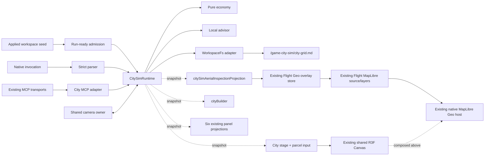
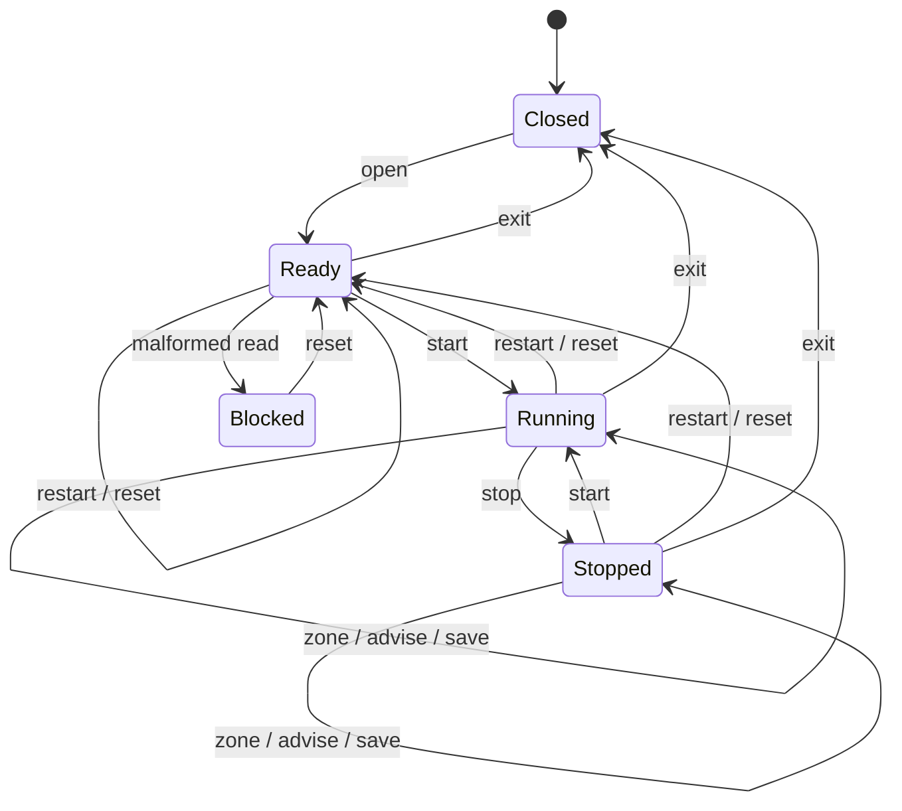

# Design Document

## 1. Design authority

`requirements.md` is normative. This design assigns each requirement to one
repository-native owner and deliberately keeps rendering, simulation,
persistence, invocation, and projections separate.

The City Simulation is one browser-local runtime with four adapters:

1. a read-only scene subtree and parcel input inside the shared R3F Canvas,
   composed above the existing native MapLibre Geo host;
2. a City Builder view plus compact projections in six existing
   FloatingPanel views; and
3. a City-owned aerial adapter that reuses the current authored XR spatial
   profile/environment and existing Flight projector to publish a deterministic
   stopped aircraft and route through the shared Geo overlay owner; and
4. WorkspaceFs and MCP adapters that delegate to the same runtime operations.

No adapter owns a second city state, map, Canvas, map source/layer family, or
Flight gameplay runtime.

## 2. Owner map

| Owner | Responsibility | Must not own |
|---|---|---|
| `CitySimRuntime` | Committed snapshot, lifecycle fencing, operation dispatch, subscribers | Canvas, files, panel-local copies |
| `citySimEconomy` | Pure tick transition and safe-integer validation | Timers, rendering, persistence |
| `citySimCodec` | Canonical KGC plus CSV serialize/parse | WorkspaceFs access |
| `citySimPersistence` | One-path WorkspaceFs write/read-back | Serialization rules, autosave |
| `citySimAdvisor` | Two-round deterministic proposal loop | Model calls, automatic zoning |
| `citySimInvocation` | Strict native grammar parse | Runtime mutation |
| `CitySimStage` | Instanced read-only scene subtree and parcel hit testing | Economy mutation, `<Canvas>` |
| `citySimAerialInspectionProjection` | Derive one `stopped` overlay from City state plus the current authored XR spatial profile/environment through the existing Flight projector | Flight lifecycle, controls, readiness, MapLibre layers |
| Existing Flight Geo overlay store | Publish/read one aerial snapshot via `gympgrph/src/flightGeoOverlay.ts` | City state, Flight gameplay activation |
| Existing Flight MapLibre projection | Apply the shared source/layer ids via `gympgrph/src/flightGeoOverlayMapLibre.ts` | A second map, duplicate source/layers |
| Existing native MapLibre Geo host | Geographic background below the City R3F stage | City state, a City-owned map |
| `CitySimCameraRuntime` | Save/apply/restore shared camera framing | A second camera catalog |
| `CitySimFloatingPanelView` | Complete City Builder controls and status | Duplicate runtime state |
| `CitySimPanelProjection` | Six contextual projections from one snapshot | Surface-specific city stores |
| `citySimMcpRuntime` | Exactly two MCP registrations and approval delegation | A second dispatcher or route |
| `CitySimRunReadyDemoRuntime` | Source identity admission after bootstrap readiness | Environment-preselected proof |

## 3. Runtime topology



Admission is gated on Source Files bootstrap readiness. The applied document's
`run_ready_demo.id` is authoritative; known identity/path disagreement is a
typed rejection. Admission requests Surface Mode `geo-xr`; it does not invoke
the Flight source identity or open the Flight Runtime.

## 4. State model

```ts
type CityZone = "unzoned" | "residential" | "commercial" | "industrial";
type CityRunState = "closed" | "ready" | "running" | "stopped" | "blocked";

interface CityParcel {
  id: string; // rNNcNN
  row: number;
  column: number;
  zone: CityZone;
  landValueCents: number;
  population: number;
  pollution: number;
}

interface CitySnapshot {
  schemaId: "knowgrph-city-grid/v1";
  cityName: string;
  tick: number;
  treasuryCents: number;
  taxRateBasisPoints: number;
  runState: CityRunState;
  parcels: readonly CityParcel[];
  selectedParcelId: string | null;
  clarifyPending: boolean;
  persistenceStatus: "not-loaded" | "loaded" | "saving" | "saved" | "blocked";
  lastResult: CityOperationResult | null;
  revision: number;
}
```

Every numeric field is a safe integer. Parcel arrays are stored and emitted in
ascending parcel-id order. Runtime publication uses immutable snapshots and a
monotonic revision.

### Authored default seed

The workspace seed describes a 4 by 4 row-major grid:

- treasury: `100000` cents;
- tax rate: `1000` basis points;
- tick: `0`;
- four authored zones (`r00c00` residential, `r00c01` commercial,
  `r01c00` industrial, remaining parcels unzoned);
- all starting population, pollution, and land values are explicit in the
  seed's CSV fixture.

The same values must be represented in the runtime default factory. A focused
test compares runtime serialization with the seed fixture to prevent drift.

## 5. Deterministic economy

`advanceCityTick(snapshot)` is pure. It clones parcel values, applies v1
coefficients in stable parcel-id order, calculates aggregates, validates the
candidate, and returns either the complete next snapshot or a typed failure
with the original snapshot.

Per parcel:

| Zone | Population delta | Land-value delta | Pollution delta |
|---|---:|---:|---:|
| unzoned | 0 | 0 cents | 0 |
| residential | +2 | +200 cents | 0 |
| commercial | +1 | +100 cents | 0 |
| industrial | 0 | -50 cents | +1 |

After the parcel pass:

```text
taxRevenueCents =
  floor(totalPopulation * taxRateBasisPoints / 100)

treasuryDeltaCents =
  taxRevenueCents
  + 300 * commercialCount
  + 500 * industrialCount
  - 100 * zonedCount
```

`tick` increments by one only in the accepted candidate. Any unsafe integer,
invalid parcel, duplicate id, or invalid coefficient aborts the complete tick.
The fixed-step scheduler requests one tick each 1000 ms while running. A
generation token fences queued callbacks after Stop, Restart, Reset, or Exit.
Rendering never advances the scheduler.

## 6. Lifecycle and mutual exclusion



On Open, the runtime captures the prior surface and R3F camera before it changes
anything. It asks the existing gameplay-surface coordinator to exit another
exclusive overlay, activates `geo-xr`, retains the existing native MapLibre
host, mounts the City Stage above it, and applies city framing. The shared
`CanvasViewport` geospatial publisher then projects the current authored XR
spatial profile/environment as a stopped aerial snapshot. City never opens
Flight gameplay or borrows a Flight readiness signal. If City entry fails, its
surface/camera lifecycle rolls back to the captured owners.

On Exit, it fences the timer, releases its Flight Geo overlay publication
through the existing owner, unmounts the City Stage, restores the captured R3F
camera, restores the captured panel/surface once, and clears only
session-transient selection/advisor state. The committed in-memory snapshot
remains inspectable until a later Open, Reset, or valid document load.

## 7. Geo+XR, shared Canvas, and camera

`CitySimStage` is imported by the existing gameplay-overlay owner and returns a
React Three Fiber group. It never imports or creates `Canvas`.

The existing native MapLibre host remains mounted as the Geo background. The
shared R3F Canvas remains the only R3F owner and is visually composed above the
map. City creates no map, map source, map layer, or Canvas. In particular, City
must use the stable source/layer ids and application functions already owned by
`flightGeoOverlayMapLibre.ts`; alias ids and City-specific copies are forbidden.

The stage contains:

- one instanced parcel mesh;
- one instanced building mesh for zoned parcels;
- a selection indicator;
- pointer hit testing that dispatches a normalized selection action.

Parcel hit testing remains on the City R3F stage. The MapLibre host is a
read-only geographic background for City and does not become a parcel-input
owner.

City source identity remains part of the broader native-XR catalog, but it is
not an XR physics-runtime owner. `isXrPhysicsRuntimeRunReadyDemoActive`
admits only the dedicated physics and Flight sources. `ThreeGraph` excludes
the authored/native graph before deriving scene authority whenever the City
stage is active, preventing the retained Singapore physics environment from
sharing the orthographic City camera.

The shared WebGL Canvas sits inside `ThreeCanvasMediaFigure`. While City is
active, this semantic `figure` has an accessible City-stage name, a
`figcaption`, and the marker-only result of
`resolveMediaPreviewSelectableDataAttr(true)`. It installs no capture handler,
so parcel pointer input continues to reach React Three Fiber. The marker and
City semantics disappear when City is inactive; the stable wrapper remains
presentational so changing modes does not remount the renderer.

Instance matrices are updated only when snapshot revision changes. After
`setMatrixAt`, the stage marks `instanceMatrix.needsUpdate = true`. Color
updates likewise mark `instanceColor.needsUpdate = true`.

`projectCitySimAerialInspectionToGeospatialOverlay` is a pure adapter from City
active/WebGL admission plus the current selected authored XR spatial
profile/environment to one `FlightGeoOverlaySnapshot`. It reuses
`projectFlightSimToGeospatialOverlay`, keeps the inherited profile and
environment as the visual revision identity, fixes the camera to Survey/Fixed
Follow, and pins phase `stopped`, run id `0`, tick `0`, and ready-frame request
`null`. City tick/revision changes therefore do not restart MapLibre bootstrap
or move the aircraft. The shared `CanvasViewport` geospatial publisher writes
the result through `setFlightGeoOverlay`; MapLibre renders it through
`applyFlightGeoOverlayToMap` and the existing Flight Geo source/layers. The
pure City adapter calls no Flight lifecycle, mission-advance, control, or
readiness API. The shared publisher retains its normal Flight subscriptions for
publication arbitration; this does not activate Flight gameplay or readiness.

The camera adapter constructs a mode-scoped orthographic camera, installs it
through the existing React Three Fiber camera setter, and preserves the
previous camera reference. Resize updates `left`, `right`, `top`, and `bottom`
before `updateProjectionMatrix()`. It does not replace MapLibre's camera owner.
Exit reinstalls the captured R3F reference exactly once.

HUD metrics live in FloatingPanel HTML, not a second scene or renderer.

## 8. FloatingPanel composition

`CitySimPanelProjection` accepts one discriminated surface id and derives all
content from `useCitySimSnapshot()`:

| Existing view | Projection | Allowed action |
|---|---|---|
| Media | zone palette and authored procedural appearance | Open City Builder |
| Animation | tick, fixed-step state, last committed revision | Start or Stop |
| Motion Control | normalized input source and selected parcel | Focus selection |
| Game Mode | exclusive overlay state and economy summary | Enter or Exit city |
| Flight Sim | read-only City aerial inspection summary | Handoff to City Builder; never open Flight |
| Camera | orthographic framing and restoration target | Apply city framing |

These projections are composed by the shared FloatingPanel route wrapper rather
than patched into six feature implementations. This preserves existing surface
ownership and prevents dependency cycles.

`cityBuilder` contains the full status, lifecycle buttons, parcel selector,
three zone buttons, advisor trigger, proposal/tie result, save result, and Exit.
All buttons dispatch one City Runtime operation and render typed failures.

## 9. Input contract

Pointer, keyboard, and touch adapters produce:

```ts
interface CityInputSnapshot {
  source: "pointer" | "keyboard" | "touch";
  selectParcelId: string | null;
  requestedZone: Exclude<CityZone, "unzoned"> | null;
  sequence: number;
}
```

The runtime consumes a copied snapshot when it queues an action. Later browser
events cannot mutate an already queued input. All three sources use the same
selection and zoning dispatcher.

## 10. Persistence contract

The sole path is `/game-city-sim/city-grid.md`. The codec emits:

```markdown
---
schema_id: knowgrph-city-grid/v1
city_name: Civic Seed
tick: 0
treasury_cents: 100000
tax_rate_basis_points: 1000
---

parcel_id,row,column,zone,land_value_cents,population,pollution
r00c00,0,0,residential,10000,10,0
```

Canonical rules:

1. frontmatter keys use the order shown;
2. one blank line separates frontmatter and CSV;
3. CSV columns use the order shown;
4. rows sort by parcel id;
5. integers use base-10 text with no separators;
6. line endings are LF and the file ends with one newline.

Open checks the path. Missing uses the authored default. Valid bytes become the
session start snapshot. Malformed bytes are retained in a blocked record and
are never rewritten automatically.

Save serializes the committed snapshot, writes through existing WorkspaceFs,
reads the same path back, compares bytes, parses the read-back, and compares
the parsed semantic snapshot. Only then does it publish `saved`. Reset selects
the authored default in memory but deliberately leaves path bytes untouched.

## 11. Advisor

The Advisor is a pure local harness:

1. **generate**: create valid parcel/zone candidates in stable order;
2. **select**: score candidates from committed land value, zone balance, and
   immediate v1 economy delta;
3. **clarify**: if the top-two score gap is below epsilon, return proposals
   with `clarify_required: true` and do not zone;
4. **evolve**: deterministically adjust at most once and rescore.

The loop is capped at two rounds. If the tie remains, the returned recommended
candidate is the one with greater current land value, then smaller parcel id.
It remains a recommendation; only a later explicit Zone operation mutates the
grid.

Every call emits one cost record with model `none`, token counts `0`, cache
hits `0`, and estimated cost `0`. There is no enrichment branch in this
increment.

## 12. Invocation and MCP

Native grammar:

```text
/game.city @canvas #civic operation=<operation>
  [parcel=<rNNcNN>] [type=<residential|commercial|industrial>]
  [scope=<parcel|district>]
```

The parser tokenizes once, rejects duplicates and unknown keys, then checks
operation-specific arguments. It returns data or a typed error; it never calls
the runtime.

MCP schema `knowgrph-city-sim-mcp/v1` registers exactly:

- `knowgrph.inspect_local_city_sim`: immutable snapshot;
- `knowgrph.control_local_city_sim`: approval-gated structured operation.

Both native and MCP control converge on `dispatchCityOperation`. MCP adds no
route and reuses the existing discovery/control transports.

## 13. Failure behavior

| Failure | Result |
|---|---|
| Source identity conflict | Reject activation; prior surface unchanged |
| Geo+XR, MapLibre, or scene entry unavailable | Reject Open; restore prior surface/camera through the City lifecycle |
| Superseded Geo claim rollback fails | Return typed `surface-restoration-failed`; never report successful Exit |
| Invalid parcel, zone, scope, or invocation | Typed error; snapshot unchanged |
| Unsafe tick candidate | Abort whole tick; scheduler stops with local error |
| Malformed City Document | Preserve bytes; block Start/Restart |
| Workspace write/read mismatch | Report save failure; committed state remains |
| Advisor tie | Clarify result only; no automatic zoning |
| Competing gameplay surface | Exit through shared lifecycle before entry |

Errors are visible in City Builder and retained in `lastResult`; no error path
silently repairs a file or mutates a partially computed snapshot.

## 14. Verification design

Focused source proof:

- pure economy coefficient, atomicity, and replay tests;
- codec canonical bytes, malformed preservation, and round-trip tests;
- parser accept/reject and single-effect tests;
- advisor bound/tie/no-mutation tests;
- runtime timer fencing, save/read-back, and surface restoration tests;
- static Geo+XR, shared-Canvas, no-duplicate-map/layer, and exact-two-MCP
  registration tests;
- City aerial projection tests for deterministic route/aircraft, permanent
  `stopped` phase, overlay owner reuse, Flight gameplay inactivity, and no
  Flight readiness claim;
- FloatingPanel routing/projection ownership tests;
- seed/default-fixture drift test.

Neutral browser proof:

1. launch the exact candidate without a city environment selector;
2. clear persisted workspace state and confirm city inactive;
3. open Explorer -> Source Files after bootstrap readiness;
4. apply the authored seed;
5. assert Surface Mode `geo-xr`, `cityBuilder`, the existing native MapLibre
   map, the existing shared R3F Canvas, City Stage/parcel input above Geo, and
   authored starting metrics;
6. zone a parcel, run one tick, stop, and verify no further tick;
7. save and verify read-back success at the canonical path;
8. visit Media, Animation, Motion Control, Game Mode, Flight Sim, and Camera,
   confirming one shared revision and the specified projection;
9. assert the deterministic route and stopped aircraft use the existing Flight
   Geo source/layers, with no duplicate map/source/layer/Canvas, Flight gameplay,
   or Flight readiness;
10. exit and verify the aerial publication clears and the prior surface/camera
    restore exactly once;
11. repeat from neutral state and compare initial serialized bytes and aerial
    projection.

The seed remains `proof-pending` until the focused suite and this browser proof
pass at the exact candidate SHA. Protected integration and release are
subsequent independent gates.
