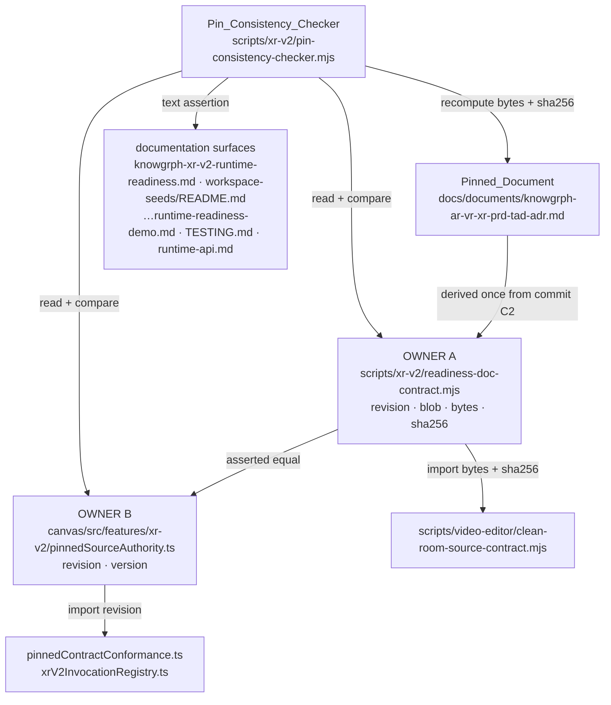
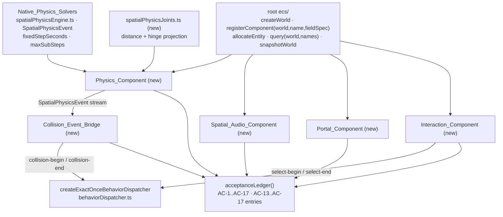

# Design Document

## Overview

Four separable jobs in one ordered lane:

1. **Unblock** — move the uncommitted v3.0.0 `Pinned_Document` bytes out of canonical `main` into one admitted task lane, fast-forward canonical `main`, then advance the `Pin_Triple` across the nine-surface `Pin_Surface_Set` so `verifyXrV2ReadinessDocumentation` stops throwing on byte drift.
2. **Reconcile** — correct ADR-11's false premise against the enforced `Rapier_Independence_Boundary`, restate ADR-1/5/6/7/8/9 against their real in-repo owners, close the rung drift — as **one editorial batch**, so the document is byte-pinned exactly once.
3. **Widen** — extend the acceptance ledger from AC-1..AC-12 to AC-1..AC-17 across its three surfaces, and evolve the conformance validator from a frozen `partial` literal to a derived verdict without opening a tamper window.
4. **Build** — add the five absent Feature C owners on the root `ecs/` workspace and the existing native solvers, with a `fast-check` property suite.

Deploy boundary is Dev-only; every gate added here is zero model calls and zero paid calls; all paths are repository-relative or `$GITHUB_ROOT`-relative. Two structural facts drive every sequencing decision. The `Pin_Triple` carries a Git revision and blob SHA, so it derives **only from a committed revision** — Requirement 1 → Requirement 3 is a hard data dependency. And the `Pinned_Document` is byte-pinned, so **any** ADR or matrix edit invalidates the triple: Requirement 5's edits and Requirement 3's advance must converge on one final document commit rather than chasing each other (see [Convergence plan](#convergence-plan-requirements-5--3)).

### Requirement traceability

| Req | Owning component / procedure | Verification command |
|---|---|---|
| 1 | `Canonical_Restoration_Procedure` + `OverlapPreservationReceipt` validator | `git -C "$KNOWGRPH_ROOT" status --short --branch` |
| 2 | ADR-11 investigation procedure → editorial batch C2 | `npm run native-physics:check`, `npm run game-flight-sim:runtime-ready` |
| 3 | `scripts/xr-v2/readiness-doc-contract.mjs` (Owner A) + `canvas/src/features/xr-v2/pinnedSourceAuthority.ts` (Owner B) | `npm run xr-v2:source-ready`, `xr-v2:review-candidate`, `xr-v2:review-ready` |
| 4 | `Pin_Consistency_Checker` — `scripts/xr-v2/pin-consistency-checker.mjs` (new) | `node scripts/xr-v2/pin-consistency-checker.mjs --json` |
| 5 | Editorial batch on `Pinned_Document` Part III + Part VII | `npm run xr-v2:source-ready` (marker set) |
| 6 | `Evidence_Document` frontmatter + `scripts/xr-v2/rung-vocabulary-check.mjs` (new) | `node scripts/xr-v2/rung-vocabulary-check.mjs` |
| 7 | `pinnedContractConformance.ts` v2 envelope + `XrV2RuntimeObservationRecord` | `npm run xr-v2:unit`, `npm run xr-v2:pbt` |
| 8 | `scripts/xr-v2/acceptance-ledger-authority.mjs` (new single owner) | `node scripts/xr-v2/check-ledger-agreement.mjs` |
| 9 | `canvas/src/features/physics/spatialPhysicsJoints.ts`, `canvas/src/features/xr-v2/physicsComponent.ts` | `npm run native-physics:check`, `npm run xr-v2:pbt` |
| 10 | `canvas/src/features/xr-v2/collisionEventBridge.ts` | `npm run xr-v2:unit`, `npm run xr-v2:pbt` |
| 11 | `canvas/src/features/xr-v2/spatialAudioComponent.ts` | `npm run xr-v2:unit`, `npm run xr-v2:pbt` |
| 12 | `canvas/src/features/xr-v2/portalComponent.ts` | `npm run xr-v2:unit`; `test:smoke:xr-v2:browser` readback |
| 13 | `canvas/src/features/xr-v2/interactionComponent.ts` | `npm run xr-v2:unit`, `npm run xr-v2:pbt` |
| 14 | `canvas/src/features/xr-v2/__pbt__/`, `scripts/__pbt__/` | `npm run xr-v2:pbt` |
| 15 | `tasks.md` ordering + checker `blocked-uncommitted` state | `npm run xr-v2:review-ready` |
| 16 | `ReadinessClaim` validator inside `rung-vocabulary-check.mjs` | `node scripts/xr-v2/rung-vocabulary-check.mjs --claims` |

## Architecture

### Pin-authority topology

Nine surfaces each carry their own literal today. This collapses to **two owning modules** (one per workspace boundary) plus four documentation surfaces covered by text assertion, with one checker proving agreement.



Rejected alternative: one JSON SSOT imported by both workspaces. `canvas/tsconfig` roots exclude `scripts/`, so that needs a widened `rootDir` or a build step for a value a plain Node script must read. Two owners with an asserted equality is cheaper and keeps both consumers dependency-free. Answers open question 5.

### Feature C simulation layer



Both new dispatch consumers route through the **existing** dispatcher. That needs one additive change to a closed union in `behaviorDispatcher.ts`: `BehaviorTrigger` and its `TRIGGERS` set gain `'collision-begin'`, `'collision-end'`, `'select-begin'`, `'select-end'`. No parallel dispatch path is created (Requirements 10.2, 13.6).

## Components and Interfaces

### Pin_Triple owners

Owner A keeps its four existing exports and becomes the sole script-side literal holder; `scripts/video-editor/clean-room-source-contract.mjs` drops its literals and re-exports Owner A's under its current names, so its public API is unchanged. Owner B is new and holds the revision plus version label — the sole canvas-side literal:

```ts
// canvas/src/features/xr-v2/pinnedSourceAuthority.ts
export const XR_V2_PINNED_SOURCE_REVISION = '<40-hex>' as const
export const XR_V2_PINNED_SOURCE_VERSION = '3.0.0' as const
```

`pinnedContractConformance.ts` re-exports `XR_V2_PINNED_SOURCE_REVISION`; `xrV2InvocationRegistry.ts` imports it. Per Requirement 4.4 the revision then has two literal holders (A, B) and blob/bytes/sha256 have one (A) — Requirement 4.5 leaves those single holders in place.

### Pin_Consistency_Checker

New, repository-owned, `node:fs` + `node:crypto` + `git cat-file` only.

```ts
type PinTriple = Readonly<{ revision: string; blob: string; bytes: number; sha256: string; version: string }>
type PinSurfaceKind = 'module-owner' | 'module-consumer' | 'documentation'
type PinSurfaceReading = Readonly<{ path: string; kind: PinSurfaceKind; observed: Partial<PinTriple>; missing: readonly (keyof PinTriple)[] }>
type PinDisagreement = Readonly<{ path: string; member: keyof PinTriple; expected: string | number; observed: string | number | null }>
type PinConsistencyReport = Readonly<{
  schema: 'knowgrph-xr-v2-pin-consistency/v1'
  status: 'agreed' | 'disagreed' | 'blocked-uncommitted'
  expected: PinTriple | null
  surfaces: readonly PinSurfaceReading[]
  workingTree: Readonly<{ bytes: number; sha256: string; matchesExpected: boolean }>
  disagreements: readonly PinDisagreement[]
}>
export function readPinSurfaces(repositoryRoot: string): readonly PinSurfaceReading[]
export function derivePinTriple(repositoryRoot: string, revision: string): PinTriple
export function checkPinConsistency(repositoryRoot: string): PinConsistencyReport
```

`expected` comes from Owner A; every other surface is compared against it. `status: 'blocked-uncommitted'` applies when the working-tree digest differs from `expected.sha256` **and** `git status --porcelain` reports the path modified — the checker then writes nothing and exits non-zero (Requirements 3.2, 4.3). `surfaces` always holds exactly one reading per configured surface, so the report is complete regardless of read order (Requirements 4.1, 14.9). Documentation surfaces match by literal substring, including the `107,090`-style prose byte count and surface 7's immutable GitHub blob URL (Requirement 4.6). The checker is invoked from `scripts/run-xr-v2-source-smoke.mjs`, so it runs inside `xr-v2:source-ready`, `xr-v2:review-candidate`, and `xr-v2:review-ready` (Requirement 4.7).

### Evolved conformance validator (tamper-preserving migration)

The current validator is load-bearing tamper machinery: it pins `overall === 'partial'`, all eight observations to `'not-observed'`, and twelve ledger entries to exact equality. It is not loosened in place. The migration adds a **second schema** and keeps v1 frozen.

```ts
export const XR_V2_PINNED_CONFORMANCE_SCHEMA_V2 = 'knowgrph-xr-v2-pinned-contract-conformance/v2' as const
export type XrV2ObservationState = 'not-observed' | 'observed' | 'deferred-hardware' | 'deferred-external'
export type XrV2RuntimeObservationRecord = Readonly<{
  state: XrV2ObservationState
  evidenceArtifactPath: string | null   // repository-relative; required unless not-observed
  reason: string
}>
export type XrV2PinnedConformanceEvidenceV2 = Readonly<{
  schema: typeof XR_V2_PINNED_CONFORMANCE_SCHEMA_V2
  pinnedSourceRevision: typeof XR_V2_PINNED_SOURCE_REVISION
  contractVersion: typeof XR_V2_CONTRACT_VERSION
  overall: 'partial' | 'deterministic-complete'
  deterministic: XrV2PinnedDeterministicEvidence
  runtimeObservations: Readonly<Record<XrV2PinnedRuntimeObservation, XrV2RuntimeObservationRecord>>
  acceptanceCriteria: readonly XrV2PinnedCriterionEvidence[]   // exactly 17
}>
// dispatches on candidate.schema; v1 path unchanged
export function validateXrV2PinnedContractConformanceEvidence(candidate: unknown): XrV2PinnedConformanceValidationResult
```

Four invariants keep the tamper contract closed. **v1 stays byte-identical** — still requiring `overall: 'partial'`, all eight observations as the bare string `'not-observed'`, and the exact twelve-entry ledger; v2 fields cannot relax v1 because unknown keys fail `hasExactKeys`. **`overall` is recomputed, never trusted** — v2 derives `deterministic-complete` iff every ledger entry has non-empty `deterministicEvidence` and empty `blockedBy`, and rejects a mismatched declared value with `invalid-authority`; that is what makes Requirement 7.5 safe, since forging the verdict would require forging every ledger entry, which exact-ledger equality already forbids. **Every admitted observation names an artifact** — `state !== 'not-observed'` with an empty, absent, absolute, or `~`-prefixed path returns `runtime-observation-overreach` (Requirements 7.2, 7.6, and 15.7 at the envelope boundary). **Ledger identity is fixed** — entries 1..12 keep identifiers, order, and expected evidence tuples; 13..17 are appended (Requirement 7.7). Note that `deterministic-complete` asserts only unblocked deterministic evidence per criterion; it is not a rung claim and is deliberately not spelled `runtime-ready`, which is a forbidden marker string in the evidence documents.

Required negative tests: v1-with-observed-value; v2 with mismatched declared `overall`; v2 with an admitted state and null artifact path; v2 with 12 entries; v2 with a reordered ledger. All five must be rejected.

### Widened 17-entry ledger across three surfaces

One new `.mjs` owner holds the sequence and expected tuples:

```js
// scripts/xr-v2/acceptance-ledger-authority.mjs
export const XR_V2_CRITERION_IDS = Object.freeze(Array.from({ length: 17 }, (_, i) => `AC-${i + 1}`))
export const XR_V2_EXPECTED_LEDGER = Object.freeze([ /* 17 × [criterion, deterministicEvidence[], blockedBy[]] */ ])
export function formatLedgerDisagreement(surfacePath, index, expected, observed) { /* … */ }
```

`scripts/xr-v2/browser-smoke-contract.mjs` replaces its inline `expectedCriteria` array with the import (Requirement 8.2). `scripts/workspace-seed-authority.mjs` replaces `Array.from({ length: 12 }, …)` with `XR_V2_CRITERION_IDS` and changes its message to `acceptance_criteria=exact AC-1..AC-17 ledger` (Requirement 8.3). `pinnedContractConformance.ts` keeps deriving `CRITERION_IDS` locally (no cross-workspace import); `scripts/xr-v2/check-ledger-agreement.mjs` loads it through `tsx` — the mechanism `xr-v2:unit` already uses — and deep-compares `acceptanceLedger()` against `XR_V2_EXPECTED_LEDGER`, naming the disagreeing surface path and criterion on failure (Requirements 8.4, 8.5).

New entries and their observation keys:

| Criterion | Deterministic evidence keys | New observation key |
|---|---|---|
| AC-11 (unblocked here) | `trackInventoryRoundTrip` | `trackPreservingContainerMux` |
| AC-13 | `jointLimitsRespected`, `analyticStepMatched` | — |
| AC-14 | `collisionExactOnce`, `collisionUnboundNoop` | — |
| AC-15 | `spatialAudioMonotonic` | `mountedSpatialAudioGraph` |
| AC-16 | `portalCeilingRespected`, `portalSelfTargetRejected` | `stencilPortalPixelIsolation` |
| AC-17 | `interactionSourceParity` | `handTrackingInputSource` |

### Physics_Component and joints

`canvas/src/features/physics/spatialPhysicsJoints.ts` adds the joint layer the native solvers lack, as a post-step projection over solver output. Its path and content carry no `rapier` substring (Requirements 2.6, 9.6).

```ts
export type SpatialJointKind = 'distance' | 'hinge'
export type SpatialJointLimit = Readonly<{ lower: number; upper: number }>
export type SpatialJointSpec = Readonly<{
  id: string; kind: SpatialJointKind; bodyIds: readonly [string, string]
  anchor: SpatialVector; axis?: SpatialVector          // axis: hinge only
  limit: SpatialJointLimit                             // distance: metres · hinge: radians
  stiffness?: number                                   // 0..1 projection strength, default 1
}>
export type SpatialJointViolation = Readonly<{ jointId: string; tick: number; measured: number; limit: SpatialJointLimit }>
export type SpatialJointProjection = Readonly<{ bodies: readonly SpatialBodySnapshot[]; violations: readonly SpatialJointViolation[] }>
export function validateSpatialJointSpec(spec: SpatialJointSpec): SpatialJointSpec  // throws
export function projectSpatialJoints(bodies: readonly SpatialBodySnapshot[], joints: readonly SpatialJointSpec[], tick: number): SpatialJointProjection
```

`validateSpatialJointSpec` throws `SpatialJointConfigurationError` when `limit.lower > limit.upper`, when a bound is non-finite, or when `bodyIds[0] === bodyIds[1]` (Requirement 9.4). `projectSpatialJoints` is idempotent: re-projecting a satisfied body set returns an equal set and no violations. The ECS-facing owner:

```ts
// canvas/src/features/xr-v2/physicsComponent.ts
export const XR_V2_PHYSICS_COMPONENT_NAME = 'XrPhysicsBody' as const
export const XR_V2_PHYSICS_COMPONENT_FIELDS = Object.freeze({   // ecs/ fieldSpec
  bodyId: 'string', motion: 'string', mass: 'float64',
  positionX: 'float64', positionY: 'float64', positionZ: 'float64',
  velocityX: 'float64', velocityY: 'float64', velocityZ: 'float64',
})   // registered via registerComponent(world, XR_V2_PHYSICS_COMPONENT_NAME, fields)
export type XrV2PhysicsComponentConfig = Readonly<{
  fixedStepSeconds: number; maxSubSteps: number; gravity: SpatialVector
  bodies: readonly SpatialBodySpec[]; colliders: readonly SpatialColliderSpec[]; joints: readonly SpatialJointSpec[]
}>
export type XrV2PhysicsAdvance = Readonly<{
  result: SpatialAdvanceResult; bodies: readonly SpatialBodySnapshot[]
  events: readonly SpatialPhysicsEvent[]; violations: readonly SpatialJointViolation[]
}>
export function createXrV2PhysicsComponent(config: XrV2PhysicsComponentConfig): Readonly<{
  registerInto(world: unknown): void            // ecs/ registerComponent + allocateEntity
  advance(elapsedSeconds: number): XrV2PhysicsAdvance
  dispose(): void
}>
```

Attachment uses the real root `ecs/` API — `registerComponent`, `allocateEntity`, `query(world, componentNames)` — not `defineComponent` / `addComponent` (Requirement 9.1).

### Collision_Event_Bridge

`SpatialPhysicsEvent` is the only contact source (Requirement 10.6). The dispatcher matches a single `sourceEntityId` and requires `event.revision === current + 1`, so the bridge owns both the pair→entity binding and the revision counter.

```ts
export type XrV2ContactPairBinding = Readonly<{ colliderIds: readonly [string, string]; sourceEntityId: number }>
export type XrV2CollisionBridgeDispatch = Readonly<{
  eventId: string                                    // `${kind}:${a}|${b}:${tick}` with a,b lexically sorted
  kind: 'collision-begin' | 'collision-end'
  colliderIds: readonly [string, string]
  status: BehaviorDispatchResult['status'] | 'unbound'
  invokedActionIds: readonly string[]
}>
export function createXrV2CollisionEventBridge(input: Readonly<{
  dispatcher: ExactOnceBehaviorDispatcher
  bindings: readonly XrV2ContactPairBinding[]
}>): Readonly<{ route(events: readonly SpatialPhysicsEvent[]): readonly XrV2CollisionBridgeDispatch[]; seenEventIds(): readonly string[] }>
```

Collider pairs are order-normalised by lexical sort, so `(a,b)` and `(b,a)` are one pair, and exactly one `collision-begin` and one `collision-end` is emitted per pair per contact interval (Requirements 10.1, 10.5). New identities get `revision = dispatcher.getRevision() + 1`; a replayed identity is re-submitted at its already-consumed revision, so the dispatcher returns `'stale'` and invokes nothing (Requirement 10.4) — replay staleness falls out of the existing dispatcher rather than a second mechanism. An unbound pair still yields a record with `status: 'unbound'` and zero invoked actions (Requirement 10.3). `sensor-began` / `sensor-ended` map to the dispatcher's existing `proximity-enter` / `proximity-exit`.

### Spatial_Audio_Component

```ts
export type XrV2SpatialAudioConfig = Readonly<{
  entityId: number; sourcePosition: SpatialVector; listenerPosition: SpatialVector
  referenceDistance: number; maxDistance: number; rolloffFactor: number
}>
export type XrV2SpatialAudioReading = Readonly<{ gain: number; pan: number }>
export type XrV2SpatialAudioDiagnostic = Readonly<{
  state: 'idle' | 'active' | 'silent-fallback' | 'released'
  unsupportedCapability: 'positional-audio-unavailable' | null
  createdNodeCount: number; releasedNodeCount: number
}>
export function computeXrV2SpatialAudioReading(config: XrV2SpatialAudioConfig): XrV2SpatialAudioReading  // pure core
export function createXrV2SpatialAudioComponent(input: Readonly<{
  audioContextFactory: () => AudioContext | null      // injected; null ⇒ silent fallback
}>): Readonly<{
  activateFromUserAction(config: XrV2SpatialAudioConfig): XrV2SpatialAudioDiagnostic
  update(config: XrV2SpatialAudioConfig): XrV2SpatialAudioReading
  release(reason: 'detach' | 'hidden' | 'pagehide' | 'unmount'): XrV2SpatialAudioDiagnostic
  diagnostic(): XrV2SpatialAudioDiagnostic
}>
```

The pure core uses the inverse-distance model matching `PannerNode`'s `'inverse'` rolloff, so gain is non-increasing in distance and pan is monotone in bearing (Requirements 11.2, 11.3). The browser graph is `AudioContext → PannerNode → GainNode → destination`, created only inside `activateFromUserAction` (Requirement 11.4). `release` is idempotent and is wired to entity detach, `visibilitychange` (hidden), `pagehide`, and unmount; `createdNodeCount` equals `releasedNodeCount` after any release ordering. With no `createPanner` available the state becomes `'silent-fallback'`, the diagnostic records the unsupported capability, and no user-facing notification is raised (Requirement 11.5). Samples are same-origin `ArrayBuffer`s; the module imports no fetch/XHR path (Requirement 11.6).

### Portal_Component

```ts
export type XrV2PortalConfig = Readonly<{
  portalId: string; sceneId: string; targetSceneId: string; maskEntityId: number; targetCameraId: string
}>
export type XrV2PortalRenderPlan = Readonly<{
  schema: 'knowgrph-xr-v2-portal-plan/v1'
  stencilRequired: true
  rendered: readonly Readonly<{ portalId: string; stencilRef: number; renderTargetId: string }>[]
  deferredCount: number
  unsupported: 'stencil-buffer-disabled' | null
  nestedPortalsSupported: false
}>
export function validateXrV2PortalConfig(config: XrV2PortalConfig): XrV2PortalConfig  // throws
export function planXrV2PortalRender(input: Readonly<{
  contextAttributes: Readonly<{ stencil: boolean }>
  visiblePortals: readonly XrV2PortalConfig[]
  visiblePortalCeiling: number
}>): XrV2PortalRenderPlan
```

ADR-12's stencil mask plus second render-target pass is expressed as a plan object so pass ordering is unit-testable without a GPU (Requirement 12.1). `rendered.length <= visiblePortalCeiling` and `rendered.length + deferredCount === visiblePortals.length` for every input (Requirement 12.4). `validateXrV2PortalConfig` throws `XrV2PortalConfigurationError` when `targetSceneId === sceneId` (Requirement 12.5). With `stencil: false` the plan is empty and `unsupported: 'stencil-buffer-disabled'` (Requirement 12.3) — note `canvas/src/features/htmlViewer/runtimeTemplate.ts` requests `stencil: false` today, so portal mounts need a stencil-enabled context; that plus the nested-portal exclusion are recorded in owner documentation (Requirement 12.6).

### Interaction_Component

```ts
export type XrV2InputSourceKind = 'pointer' | 'touch' | 'hand-tracking'
export type XrV2InteractionEventKind = 'hover-enter' | 'hover-exit' | 'select-begin' | 'select-end'
export type XrV2InteractionInput = Readonly<{
  sourceId: string                    // per-source identity, e.g. 'pointer:1', 'hand:left'
  sourceKind: XrV2InputSourceKind; targetEntityId: number | null; selecting: boolean
}>
export type XrV2InteractionEvent = Readonly<{
  kind: XrV2InteractionEventKind; sourceId: string; sourceKind: XrV2InputSourceKind; entityId: number
}>
export type XrV2InteractionDiagnostic = Readonly<{ kind: 'unresolved-target'; sourceId: string; targetEntityId: number }>
export function createXrV2InteractionComponent(input: Readonly<{
  resolveEntity: (entityId: number) => boolean        // backed by ecs/ listWorldEntityIds
  dispatcher: ExactOnceBehaviorDispatcher
}>): Readonly<{
  apply(inputs: readonly XrV2InteractionInput[]): Readonly<{
    events: readonly XrV2InteractionEvent[]; diagnostics: readonly XrV2InteractionDiagnostic[]
  }>
  activeHovers(): readonly Readonly<{ sourceId: string; entityId: number }>[]
}>
```

The emitted sequence is a function of the abstract input script only — `sourceKind` rides in the payload but never changes control flow (Requirement 13.2). Hover state is keyed by `sourceId`, so two sources on one entity yield two hover states and two independent `hover-exit` events (Requirements 13.3, 13.4). An unresolved `targetEntityId` is discarded with a diagnostic and no state mutation (Requirement 13.5). `select-begin` / `select-end` forward to the injected dispatcher (Requirement 13.6).

## Canonical_Restoration_Procedure

Operator-run, ordered, fail-closed; every command repository-owned and resolved from `$GITHUB_ROOT`. Canonical `main` is currently **dirty and behind `origin/main` by 1**, so the runbook covers both the byte transfer and the fast-forward.

**Step 0 — record the preservation subject.** Before touching Git state, record the working-tree byte length and digest of `docs/documents/knowgrph-ar-vr-xr-prd-tad-adr.md`: `107090` bytes, sha256 `8f0839fea7a30b9714ab7d8a46ffb1073fa54144257ee746977f96ae7969b12f`. These are the values Requirement 1.1 gates on. **Step 1 — discover and fetch.**

```sh
export GITHUB_ROOT="$(cd "$(git -C agentic-canvas-os rev-parse --show-toplevel)/.." && pwd)"
export AGENTIC_CANVAS_OS_ROOT="$GITHUB_ROOT/agentic-canvas-os"
export KNOWGRPH_ROOT="$GITHUB_ROOT/knowgrph"
git -C "$AGENTIC_CANVAS_OS_ROOT" fetch --prune origin
git -C "$KNOWGRPH_ROOT" fetch --prune origin
git -C "$KNOWGRPH_ROOT" worktree list --porcelain -z
git -C "$KNOWGRPH_ROOT" status --short --branch
```

**Step 2 — record retained overlap.** The dirty canonical path is post-baseline authored state. It binds to an Overlap Preservation Receipt and stays byte-for-byte in place; never deleted, stashed, ignore-masked, relocated, or adopted (Requirement 1.3).

**Step 3 — admit and provision the task lane**, detached at fetched `origin/main`:

```sh
node "$AGENTIC_CANVAS_OS_ROOT/scripts/device-branch.mjs" start \
  "xr-v2-runtime-readiness-advance" --session="$AGENTIC_SESSION_ID" \
  --repository="$KNOWGRPH_ROOT" --provision --worktree="$TASK_WORKTREE" \
  --write-scope-manifest="<external-manifest.json>" \
  --cloud-authority="<external-cloud-claim-result.json>" \
  --target-repository="<owner/repository>" --json
```

**Step 4 — transfer the bytes.** Copy the exact preserved content into the admitted task worktree at the same repository-relative path, then re-verify byte length and sha256 against Step 0. Any mismatch halts.

**Step 5 — commit the preservation anchor** in the task lane, containing the `107,090`-byte content unmodified. This is the proof artifact for Requirement 1.1 and is **not** the commit the pin targets.

**Step 6 — clear canonical `main` and fast-forward.**

```sh
git -C "$KNOWGRPH_ROOT" status --short --branch
npm --prefix "$KNOWGRPH_ROOT" run dev:latest
```

`dev:latest` fetches every canonical source, runs its two-phase safety check, and applies `git merge --ff-only` only when every main source is clean with `HEAD` an ancestor of the fetched ref. If tracked canonical bytes need reconciling against a protected descendant, the `canonical:main:fast-forward-equivalence` receipt path applies; it creates no commit, stash, branch, pull request, or deployment.

**Step 7 — heartbeat and record.** Renew the lease before the 30-minute TTL, then emit the receipt.

```ts
type OverlapPreservationReceipt = Readonly<{
  schema: 'knowgrph-xr-v2-overlap-preservation/v1'
  preservedPath: string                  // repository-relative
  observedBytes: number                  // 107090
  observedSha256: string                 // 8f0839fe…
  physicalOwningWorktree: string         // $GITHUB_ROOT-relative
  semanticScope: string; writerSession: string; leaseEpoch: number
  branch: string                         // agent/<device>/<semantic-scope>
  fenceRevision: string                  // 40-hex claim commit
  pullRequest: string
  preservationCommit: string             // 40-hex Step 5 commit
  canonicalStatusAfter: 'clean-equal-origin-main'
  grantedAuthority: 'none'               // never release / prod / cloudflare / force-push
}>
```

Fail-closed conditions: any field absent or blank; observed bytes or digest unequal to Step 0; `canonicalStatusAfter` not clean-equal; more than one worktree claiming the scope; an expired lease; an overlapping live cloud claim. Each halts and reports the attempted operation as a blocking failure with source, Prod mirror, and Cloudflare state unchanged (Requirements 1.3, 1.5, 1.6).

## ADR-11 investigation procedure

Requirement 2.1 needs a **read-derived** finding, so the procedure is specified without presupposing its outcome.

**What to read**, recording exact path and heading for each: `docs/documents/knowgrph-game-fps-prd-tad.md` (its `## Architecture Decisions` section); `docs/documents/knowgrph-native-physics-engines-prd-tad.md` (outcome and engine-selection sections); `scripts/check-game-fps-readiness.mjs` and `scripts/check-game-flight-sim-readiness.mjs` (the enforced dependency posture those documents are gated against).

**What counts as evidence.** Branch B (no third-party WASM engine selected) needs a quoted decision line in one of the two documents that either names an in-repo owner or explicitly disclaims an external physics runtime. Branch A (an engine *is* selected) needs a quoted decision line naming that package as the chosen engine for the FPS/MMORPG line. No physics decision in either document counts as Branch B with a stated "no cross-document selection found" reason.

**Branch B edit** (Requirement 2.2): restate ADR-11's Decision to `canvas/src/features/physics/spatialPhysicsEngine.ts`, `canvas/src/features/physics/planarPhysicsEngine.ts`, and this increment's `spatialPhysicsJoints.ts`; delete the `Reference implementation: Rapier …` line; delete the sentence asserting the engine is "already the standing choice elsewhere in the codebase per ADR-10"; invert Alternatives so the in-repo option is chosen, citing `Rapier_Independence_Boundary` and `scripts/check-game-flight-sim-readiness.mjs` as the enforcement reason; set `**Status**: Accepted (amended)` and add `**Amended-on**: .kiro/specs/xr-v2-runtime-readiness-advance` (Requirement 2.4). Joints and articulation limits become explicit new in-repo scope, since the native solvers have none today.

**Branch A edit** (Requirement 2.3): amend nothing. Open a gate-exception review naming `scripts/lib/rapier-independence-boundary.mjs`, `scripts/check-game-flight-sim-readiness.mjs`, and the affected targets (`native-physics:check`, `game-flight-sim:runtime-ready`, `canvas` `test:native-physics`). Both documents stay unamended and Requirements 8–13 stay blocked until that review decides.

**Either branch** records the ADR-10 cross-document action-item state, naming the custom root `ecs/` workspace as the in-repo scene model and marking the FPS/MMORPG amendment performed or unperformed (Requirement 2.7). *Design-time read, not the recorded finding:* `docs/documents/knowgrph-game-fps-prd-tad.md` heading `### ADR-2: Own minimal physics and weapon math in-repo` explicitly disclaims any external physics runtime or compatible API. That indicates Branch B, but the finding must be re-derived and cited during execution rather than inherited from this note.

## Convergence plan (Requirements 5 + 3)

The document is byte-pinned, so every ADR edit invalidates the triple. The plan gives the document **exactly two commits in the lane** and pins the second.

| Order | Action | Touches Pinned_Document? | Triple computed? |
|---|---|---|---|
| C1 | Preservation anchor (Step 5), exact `107,090` bytes | yes | no |
| C2 | **One editorial batch**: ADR-11 (R2), ADR-1/5/6/7/8/9 (R5.1–R5.4), Part VII retirement + risk statement (R5.5, R5.6), Readiness Gap Matrix rung rows (R16.1–R16.3) | yes | no |
| — | Derive `PinTriple` from C2: `git rev-parse C2`, `git rev-parse C2:<path>`, byte length, sha256 | no | **yes** |
| C3 | Write the triple into Owner A, Owner B, and the four documentation surfaces; retire duplicated literals into imports | no | no |
| — | `node scripts/xr-v2/pin-consistency-checker.mjs --json` ⇒ `status: 'agreed'` | no | verify |
| C4 | Ledger widening (R8), validator v2 (R7), rung reconciliation (R6) | no | no |

Why this order: ADR-2/3/4 must stay byte-identical (Requirement 5.7), so C2 is verified by section-hash comparison against C1 rather than a whole-file diff. Nothing between C2 and C3 may touch the document — if it does, the checker reports `blocked-uncommitted` or `workingTree.matchesExpected: false` and C3 is rejected (Requirements 3.2, 4.3). Requirement 3.1's "revision produced by Requirement 1" resolves to **C2**, the last document-touching commit in the lane Requirement 1 admitted; C1 exists solely to prove byte-for-byte preservation and the pin never targets it. C4 is separate because ledger and validator changes do not affect the triple, which keeps C3 reviewable as a pure value change.

Convergence proof is `status: 'agreed'` plus green `xr-v2:source-ready`, `xr-v2:review-candidate`, and `xr-v2:review-ready` (Requirements 3.3, 3.6, 3.7).

### Rung-vocabulary pinch

`local_rung` must be a closed-vocabulary member (Requirement 6.1), but the literal `local_rung: "runtime-ready"` is in `FORBIDDEN_MISLEADING_MARKERS`, checked against the evidence documents (Requirement 6.5). Resolution: set `local_rung: "dev-proven"` — a closed-vocabulary member, not a forbidden marker, and the correct ceiling while any observation is deferred (Requirement 16.2). The `browser-demo-ready` evidence state moves to a new non-rung field `evidence_state: "browser-demo-observed"` in the `Evidence_Document` and to a non-rung Notes cell in `docs/workspace-seeds/README.md` (Requirement 6.2).

Validator scope (Requirement 6.3): `scripts/check-storage-docs-runtime.mjs` is **not** extended — its `documentPaths` and `conformanceDocumentPaths` belong to the storage-docs workstream and widening them would make this spec a co-owner of an unrelated gate. `scripts/xr-v2/rung-vocabulary-check.mjs` applies the identical closed set over the XR document family instead, invoked from `xr-v2:source-ready`. Answers open question 7.

## Data Models

`PinTriple`, `PinSurfaceReading`, `PinConsistencyReport`, `OverlapPreservationReceipt`, `XrV2RuntimeObservationRecord`, `SpatialJointSpec`, `XrV2PortalConfig`, and `XrV2InteractionEvent` are declared above; the remainder:

```ts
type XrV2PinnedCriterionId = 'AC-1' | /* … */ | 'AC-17'
type XrV2PinnedCriterionEvidence = Readonly<{
  criterion: XrV2PinnedCriterionId
  status: 'deterministic-proven' | 'partial'
  deterministicEvidence: readonly string[]
  blockedBy: readonly XrV2PinnedRuntimeObservation[]   // widened by 3 Feature C keys
}>
type XrV2ObservationClassification = Readonly<{        // Requirement 7.1
  schema: 'knowgrph-xr-v2-observation-classification/v1'
  entries: Readonly<Record<XrV2PinnedRuntimeObservation, Readonly<{
    state: XrV2ObservationState
    reason: string
    evidenceArtifactPath: string                       // repository-relative, non-empty
    requiredEnvironment: string | null                 // non-null iff state starts with 'deferred-'
  }>>>
}>
type ReadinessClaim = Readonly<{                       // Requirements 16.4, 16.5
  workstream: string
  localRung: 'undocumented' | 'spec-complete' | 'dev-proven' | 'runtime-ready' | 'production-verified'
  deliveredRung: ReadinessClaim['localRung']
  evidenceArtifactPath: string                         // non-empty
  producingCommand: string                             // non-empty
}>
```

Classification decisions carried into the ledger:

| Observation key | State | Reason / required environment |
|---|---|---|
| `liveDepthModel` | `observed` | Depth Anything V2 Small already pinned same-origin (rev `4472b736…`, 19,126,267 bytes, `local_files_only: true`) |
| `referenceFrameBudget` | `deferred-hardware` | Timed capture on a mid-tier mobile GPU |
| `physicalDeviceMatrix`, `progressiveViewerMatrix` | `deferred-hardware` | An iOS-class device plus an Android-class immersive headset |
| `mountedEcsRendering` | `observed` | Playwright mount of `XrV2MountedAuthoringScene.tsx` |
| `compiledShaderMeshRender` | `observed` | Playwright mount + compiled-material render assertion |
| `trackPreservingContainerMux` | `observed` | `muxXrV2EncodedTracksToWebm` → `inspectXrV2WebmContainer` round trip |
| `connectedPreviewTransport` | `deferred-external` | Two connected browser sessions |
| `mountedSpatialAudioGraph` | `deferred-external` | A real `AudioContext` after a user gesture |
| `stencilPortalPixelIsolation` | `observed` | Playwright `readPixels` inside and outside the mask |
| `handTrackingInputSource` | `deferred-hardware` | A hand-tracking-capable headset |

AC-11 moves from zero deterministic evidence to `trackInventoryRoundTrip`, which is what Requirement 7.4 asks for and what makes the derived verdict meaningful.

## Error Handling

| Owner | Failure mode | Report | Default |
|---|---|---|---|
| Restoration procedure | digest/byte mismatch after transfer; forbidden op | blocking failure naming the attempted operation | halt; bytes untouched, no receipt |
| `Pin_Consistency_Checker` | uncommitted pinned bytes | `status: 'blocked-uncommitted'`, exit 1 | no surface writes |
| `Pin_Consistency_Checker` | member disagreement / missing member | `status: 'disagreed'`, exit 1, `disagreements[]` names path, member, expected, observed | fail closed |
| `check-ledger-agreement.mjs` | criterion set differs | exit 1 naming surface path + criterion id | fail closed |
| validator v1 / v2 | v1 relaxation attempt; v2 declared `overall` ≠ derived | existing v1 reasons; `invalid-authority` | reject |
| validator v2 | admitted state with empty, absolute, or `~` path | `runtime-observation-overreach` | reject |
| `validateSpatialJointSpec` | `lower > upper`, non-finite bound, self-pair | `SpatialJointConfigurationError` | throw before any step |
| `projectSpatialJoints` | limit exceeded after projection | `violations[]` with tick + measured value | report; caller decides |
| `Collision_Event_Bridge` | replayed identity / unbound pair | `status: 'stale'` / `'unbound'`, zero actions | event still recorded |
| `Spatial_Audio_Component` | no positional-audio capability; double release | `state: 'silent-fallback'` + diagnostic; idempotent release with equal counts | scene renderable, no notification, no throw |
| `Portal_Component` | `stencil: false`; self-target; over ceiling | `unsupported: 'stencil-buffer-disabled'` + empty plan; `XrV2PortalConfigurationError`; `deferredCount` | primary scene only / reject config / bounded render |
| `Interaction_Component` | unresolved target entity | `unresolved-target` diagnostic | discard event, no state change |
| `rung-vocabulary-check.mjs` | out-of-vocabulary rung; claim missing artifact or command | exit 1 naming document path and offending value | fail closed |

## Testing Strategy

**Unit tests** (`canvas/src/features/xr-v2/__tests__/`, `scripts/__tests__/`) cover what properties cannot express: the analytic rigid-body reference position after N steps (9.5), the stencil-disabled branch, the silent-audio-fallback branch, portal pass ordering, the five validator negative cases, and the ADR/document marker assertions. Deliberately thin — input-space coverage belongs to the property suite.

**Integration / gate tests** run each existing target once and record the result: `xr-v2:source-ready`, `xr-v2:review-candidate`, `xr-v2:review-ready`, `native-physics:check`, `game-flight-sim:runtime-ready`, `ecs:test`, `workspace-seeds:authority`.

**Browser smoke** uses the installed `playwright 1.60.0` through the existing `canvas` `test:smoke:xr-v2:browser` launcher: mounted ECS render, compiled-material mesh render, WebM playback in a `<video>` element, and a portal `readPixels` comparison at one inside-mask and one outside-mask sample point for a reference camera. AC-16's pixel isolation is INTEGRATION, not a property.

**Property suite** uses the root devDependency `fast-check 3.23.2` — no new dependency, no hand-rolled generator framework. Layout mirrors the existing `ecs/__pbt__/` convention: `canvas/src/features/xr-v2/__pbt__/*.pbt.test.ts` through `tsx`, plus `scripts/__pbt__/*.pbt.test.mjs`. New target `xr-v2:pbt` runs both and chains into `xr-v2:review-candidate`. Rules: minimum 100 runs per property (`fc.assert(fc.property(…), { numRuns: 100 })`); each test tagged `// Feature: xr-v2-runtime-readiness-advance, Property {n}: {property text}`; one property ⇒ exactly one property-based test; a suite-level setup installs throwing `fetch` / `XMLHttpRequest` stubs and a throwing `AudioContext` factory so any generated case attempting a network or paid call fails loudly (Requirement 14.10). Every property below is cheap, deterministic, and in-memory — none needs a mounted browser, because mounted evidence lives in the browser-smoke lane and hardware-dependent evidence stays a deferred observation rather than becoming a flaky property.

## Correctness Properties

*A property is a characteristic or behavior that should hold true across all valid executions of a system — essentially, a formal statement about what the system should do. Properties serve as the bridge between human-readable specifications and machine-verifiable correctness guarantees.*

### Property 1: Capability tier resolution is total and closed
*For any* generated device-feature matrix (entry mode, immersive mode, platform allowance, depth availability), resolution returns exactly one member of `XR_V2_CAPABILITY_TIERS` and never throws.
**Validates: Requirements 14.1**

### Property 2: Negative platform constraints exclude immersive tiers
*For any* generated capability input carrying the `ios-webxr-unavailable` constraint, the resolved tier is neither `webxr-ar` nor `webxr-vr`.
**Validates: Requirements 14.2**

### Property 3: Progressive-viewer chains terminate at flat fallback within bound
*For any* generated valid capability decision, the plan's last attempt tier is `flat-fallback` and the attempt count is at most `XR_V2_MAX_PROGRESSIVE_VIEWER_ATTEMPTS`.
**Validates: Requirements 14.3**

### Property 4: Behavior dispatch invokes each wired action exactly once
*For any* generated dispatch sequence over a generated behavior graph, including arbitrary replays of the same event identity and revision, each wired action is invoked exactly once per accepted event, replays report `stale`, and unbound events invoke zero actions.
**Validates: Requirements 14.4, 10.2, 10.3, 10.4**

### Property 5: Particle count never exceeds the configured ceiling
*For any* generated emitter rate, lifetime, ceiling, and advance-step sequence, the observed particle count at every step is at most the ceiling.
**Validates: Requirements 14.5**

### Property 6: ECS component queries are duplicate-free and exact
*For any* generated set of entities and component registrations — including `XrPhysicsBody` — a component-type query returns each carrying entity exactly once and no non-carrying entity.
**Validates: Requirements 14.6, 9.1**

### Property 7: Container muxing preserves tracks and round-trips
*For any* generated encoded-track set within the declared mux limits, the muxed container's inventory preserves input track count and codec identity, and inspecting then re-muxing and re-inspecting yields an equivalent track inventory.
**Validates: Requirements 14.7, 7.4**

### Property 8: Joints keep constrained motion within declared limits
*For any* generated valid joint configuration, constant-force sequence, and step count, the constrained relative measure stays within `[limit.lower, limit.upper]` at every tick; and *for any* generated limit pair with `lower > upper` the configuration is rejected with a typed error.
**Validates: Requirements 14.8, 9.3, 9.4**

### Property 9: The pin surface set agrees on one triple, in any read order
*For any* generated surface-content set and *for any* permutation of read order, the checker reports `agreed` exactly when every surface's carried members equal the owning module's triple, otherwise `disagreed` naming every disagreeing surface path with its expected and observed value; the report always holds exactly one reading per configured surface.
**Validates: Requirements 14.9, 3.3, 3.7, 4.1, 4.2**

### Property 10: Interaction events are source-invariant and per-source scoped
*For any* generated abstract interaction script replayed under each input-source kind, the emitted event sequence is identical modulo source identity; and *for any* generated multi-source interleaving, the active hover set equals the set of sources currently targeting an entity and each source emits exactly one `hover-exit` per `hover-enter`.
**Validates: Requirements 13.2, 13.3, 13.4, 13.5**

### Property 11: Runtime-observation admission requires a named artifact
*For any* generated v2 evidence envelope, the validator accepts it exactly when every observation value is a member of the widened state enum and every non-`not-observed` state carries a non-empty repository-relative evidence artifact path; otherwise it reports `runtime-observation-overreach`.
**Validates: Requirements 7.1, 7.2, 7.6**

### Property 12: The overall verdict is derived, not declared
*For any* generated acceptance ledger, the accepted `overall` equals `deterministic-complete` exactly when every entry carries non-empty deterministic evidence and an empty `blockedBy` list, independent of every observation classification; any envelope whose declared value differs is rejected.
**Validates: Requirements 7.5**

### Property 13: The three ledger surfaces accept and reject identically
*For any* generated candidate acceptance ledger, the conformance module, browser smoke contract, and workspace seed authority reach the same verdict; and *for any* single-surface mutation the agreement check exits non-zero naming that surface path and criterion identifier.
**Validates: Requirements 8.4, 8.5**

### Property 14: Rung and claim records are complete and capped
*For any* generated readiness claim, the validator accepts it exactly when both rung values are closed-vocabulary members and the evidence artifact path and producing command are non-empty; and *for any* generated observation classification containing a deferred state, the derived delivered rung is never above `dev-proven`.
**Validates: Requirements 6.4, 16.1, 16.2, 16.4, 16.5**

### Property 15: Spatial audio attenuation and panning are monotone
*For any* generated increasing distance sequence at fixed bearing, computed gain is non-increasing; and *for any* generated bearing sweep at fixed distance, computed pan is monotone in one direction.
**Validates: Requirements 11.2, 11.3**

### Property 16: Portal rendering respects its ceiling and accounts for every instance
*For any* generated visible-portal set and ceiling, the rendered count is at most the ceiling and rendered plus deferred equals the visible count; and *for any* generated config whose target scene equals its own scene, validation rejects it with a typed error.
**Validates: Requirements 12.4, 12.5**

### Property 17: Forbidden-marker and machine-path detectors are exact
*For any* generated source text, the Rapier package and implementation-marker detectors flag exactly the texts containing the forbidden token at any offset or casing; and *for any* generated path-bearing text, the machine-path detector flags exactly the home-directory-absolute ones.
**Validates: Requirements 2.6, 9.6, 15.7**

## TCO and token economics

Every gate added here is pure filesystem, Git-metadata, or in-memory computation: `pin-consistency-checker.mjs`, `check-ledger-agreement.mjs`, `rung-vocabulary-check.mjs`, the unit suite, and the property suite. Enforcement points: no new runtime or dev dependency (`fast-check 3.23.2` and `playwright 1.60.0` are installed, and the depth model is already pinned same-origin with `local_files_only: true` and `remoteFallbackAllowed: false`); the property suite installs throwing `fetch` / `XMLHttpRequest` stubs so a generated case reaching the network fails the run (Requirement 14.10); the checkers import only `node:fs`, `node:crypto`, `node:path`, and `node:child_process` for `git cat-file`, with a unit test asserting their import graph contains no network or model client; and the Dev-only boundary means no Prod mirror, no Cloudflare, no release authority, and no workstream recorded as `production-verified` (Requirement 16.3). Monthly incremental TCO $0.00; token cost $0.00 — no model call appears in any gate.

## Open questions

Closed by this design:

| # | Question | Answer |
|---|---|---|
| 5 | Which module owns the `Pin_Triple`? | Two owners, one per workspace boundary: `readiness-doc-contract.mjs` (all four members) and `pinnedSourceAuthority.ts` (revision, version). A single JSON SSOT is rejected on `rootDir` grounds. |
| 7 | Who owns the rung-vocabulary extension? | Not the storage-docs validator. A new XR-family-scoped `scripts/xr-v2/rung-vocabulary-check.mjs` keeps ownership local. |
| 8 | New evidence document for AC-13..AC-17, or extend the existing one? | Extend the existing `Evidence_Document`; its 600-line ceiling is enforced by `readiness-doc-contract.mjs` and the Feature C rows fit as five ledger lines plus one classification table. |

Still open, carried into `tasks.md`:

| # | Question | Why design cannot close it |
|---|---|---|
| 1 | Which device produces `physicalDeviceMatrix`, and is it available? | Hardware inventory fact. Recorded as `deferred-hardware`; if a device appears the classification changes with no code change. |
| 2 | Frame-time fallback threshold; tunable or constant? | Product parameter open in the `Pinned_Document`. Already externalised as `frameBudgetMs` + `consecutiveBudgetBreaches`, so it is a configuration choice, not a design one. |
| 3 | Live-preview latency ceiling for AC-12 | Needs a measurement from two connected sessions, which is the `deferred-external` observation itself. |
| 4 | Fixed timestep for AC-13 | `fixedStepSeconds` is threaded through configuration; the value needs a frame-budget measurement on target hardware. |
| 6 | Does the ADR-10 FPS/MMORPG amendment land here or separately? | Depends on the Requirement 2.1 finding. Branch B makes it a one-line matrix note here; Branch A makes it a separate gate-exception spec. |
