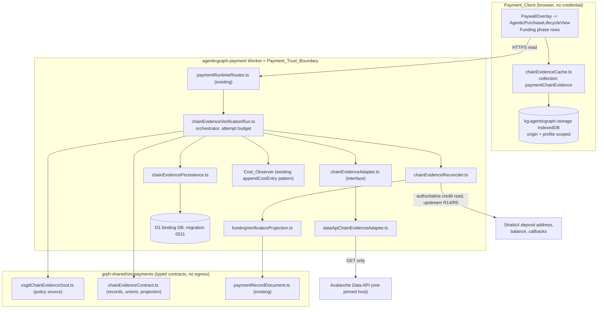
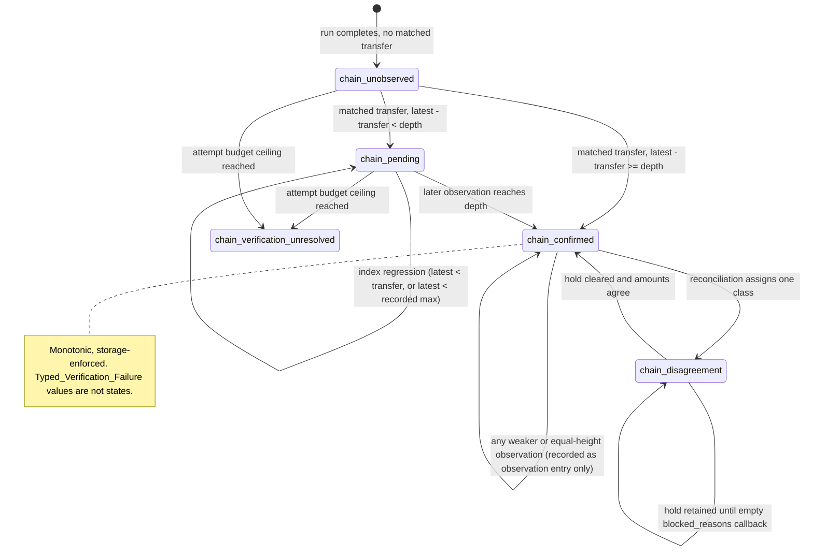

# Design Document

## Overview

The accepted upstream Funding gate believes provider credit; it cannot observe the chain. This design adds one typed
read-only chain-evidence boundary inside the existing `agenticgraph-payment` Worker, one hosted adapter over it, one
confirmation policy, one reconciliation rule, and one read-only funding-state projection that upstream Discovery,
Issuance, and Execution gates consume as a precondition. Nothing signs, broadcasts, approves, or spends, and no new
Worker, store, proxy tier, or chain write path appears: the boundary reuses the existing `DB` binding and migrations,
browser-local storage, record document, readiness command, and cost ledger.

### Repository grounding (verified, not assumed)

| Reused owner | Found at | How this design uses it |
|---|---|---|
| Payment_Trust_Boundary Worker | `cloudflare/workers/agenticgraph-payment/index.ts`: route predicate plus handler pairs (`isPaymentRuntimeRoute` / `handlePaymentRuntimeRoute`), `readDb(env)` from `../shared/d1`, env typed `Record<string, unknown> & { DB }` | One new module set behind the existing runtime route handler; no new route family or env access pattern |
| D1 binding, migrations, cost ledger | `wrangler.toml` binding `DB`, `migrations_dir = ../../d1/migrations`, latest `0010_agenticgraph_agentic_purchase_lifecycle.sql`; `payment_cost_entries` (0009) with `appendCostEntry` / `listCostEntries` in `paymentRuntimePersistence.ts` | One new migration `0011_xsgd_chain_evidence.sql`; the cost ledger is extended, not forked, by a chain-scoped table with the same field vocabulary |
| Chain tuple and record document | `AGENTIC_PURCHASE_AVALANCHE_NETWORK` in `agenticPurchaseRuntimeContract.ts` already holds `{ asset: 'xsgd', network: 'avalanche-c-chain', chainId: 43_114 }`; `paymentRecordDocument.ts` is JSONL with canonical sort, exact-key entry validation, byte-identical re-serialization | Chain id read from the existing constant, never re-declared; chain reference added as one always-present nested key inside the exact-key set |
| Readiness gate | `payment:runtime:readiness` -> `scripts/check-agenticgraph-payments-readiness.mjs` -> `scripts/lib/agenticgraph-payments-readiness.mjs` `gates` map, digest-bound local VCC in `scripts/lib/agenticgraph-payments-local-vcc.mjs`, manifest `scripts/agenticgraph-payments-readiness-properties.json` | Two new statuses inside the existing `gates` map and manifest; no new command |
| Browser-local storage and funding surface | `canvas/src/lib/storage/agenticgraphStorageDb.ts`, IndexedDB database `kg:agenticgraph-storage` with collections including `paymentIntentQueue` and `paymentReceiptDocuments`; `AgenticPurchaseLifecycleView.tsx` inside `PaywallOverlay.tsx` | One new collection `paymentChainEvidence`, origin and profile scoping from IndexedDB itself; projection rows render inside the existing funding phase item, no second surface |
| Test tooling and semantic keys | `node --test`, `fast-check@3.23.2`, `numRuns: 100` in `grph-shared/__tests__/payment-record-document.test.mjs`, worker suites via `node --import tsx --test`; `buildAgenticCommerceSemanticKey` in `agenticCommerceSemanticKey.ts` | Same runner, library, and iteration floor; the semantic-key helper builds cache and observation keys |

Two absences are stated rather than designed around. **No funding verification source module exists**: nothing owns
chain id plus token contract plus decimals plus confirmation depth plus attempt budget today, so this design creates
exactly one (`xsgdChainEvidenceSsot.ts`). **No chain-evidence adapter exists**: the closest code,
`agenticCommerceIntegrations.confirmWeb3Transfer` reached from `agenticCommerceOnchainRoutes.ts`, confirms a
caller-supplied hash on a different chain through `BASE_RPC_URL` for the accepted ACP/x402 rail, so it is neither
extended nor forked here; this boundary discovers the transfer itself and accepts no caller-supplied hash.

### Authority and Scope

| Concern | Owner |
|---|---|
| Paywall surface, lifecycle identifier, phase projection, cancellation | agenticgraph-payments R13 |
| Trust boundary, secret custody, rail selection, buyer product authority, data minimization | agenticgraph-payments R1, R2, R12 |
| Provider event authentication and replay-safe settlement; record document, parser, printer, round trip | agenticgraph-payments R5, R7 |
| Funding tuple validation, signer authority, funding reservation, provider credit gate | agenticgraph-payments R14 |
| Discovery, disposable-card issuance and Approval_Gate, execution | agenticgraph-payments R15, R16, R17 |
| Chain_Evidence_Adapter boundary and its hosted read adapter | This design, R1 |
| XSGD balance and transfer verification on chain `43114` | This design, R2 |
| Confirmation policy and monotonic confirmed state | This design, R3 |
| Chain-versus-provider reconciliation and disagreement classes | This design, R4 |
| Attempt budget, typed stopped state, offline evidence cache, funding-state projection, readiness statuses, cost observation | This design, R5-R9 |

## Architecture

### Component structure inside the existing Worker



The only external caller is `dataApiChainEvidenceAdapter`, and only from inside the Worker. The client reads the
projection over the existing HTTPS route or, offline, from its own cache; no adapter symbol is importable from it.

### Verification run sequence

```mermaid
sequenceDiagram
  participant R as Route handler
  participant V as Verification run
  participant S as SSOT policy
  participant C as Cost_Observer
  participant A as Data_API_Adapter
  participant P as StraitsX credit (upstream)
  participant D as D1 (0011)
  R->>V: run(lifecycleId, watchedAddress, approvedBaseUnits, range)
  V->>S: resolve policy (chain, contract, decimals, depth, budget, deadlines)
  alt any required input absent
    S-->>V: absent input names
    V-->>R: disabled / token_policy_missing / finality_policy_missing (zero egress)
  else policy complete
    V->>C: cost entry (attempt 1) written before dispatch
    V->>A: listErc20 balances (contract filter)
    A-->>V: balance base units + block height
    V->>C: complete entry (status class, elapsed ms, bytes); one entry per later attempt too
    V->>A: listErc20 transfers (startBlock inclusive, endBlock exclusive)
    A-->>V: transfer page(s), nextPageToken
    V->>A: latest indexed block (once per run)
    A-->>V: block number
    V->>V: match transfer, compare depth, classify Evidence_State
    V->>D: append observation entry, then upsert confirmed state (monotonic guard)
    V->>P: read authoritative credit (upstream owner)
    V->>V: reconcile -> agreement or one Disagreement_Class
    V->>D: append disagreement record (idempotent) when applicable
    V-->>R: Funding_Verification_Projection (read-only)
  end
```

### Evidence_State machine



Only `chain_confirmed` plus agreement plus a `fresh` label opens a downstream gate; `chain_verification_unresolved` is a local stopped state, never a Provider_Terminal_State.

## Components and Interfaces

### The single policy source

`grph-shared/src/payments/xsgdChainEvidenceSsot.ts` is the one repository-owned funding verification source. Every
value below is required, has no default, is never accepted from a caller, cached record, or adapter response, and fails closed by name when absent.

```ts
export type XsgdChainEvidencePolicy = Readonly<{
  adapterId: string; apiHost: string; apiVersion: string  // implementation + pinned pair (OQ-31)
  readKeyPresent: boolean                                 // value never leaves secret storage (OQ-26)
  chainId: 43_114                                         // from AGENTIC_PURCHASE_AVALANCHE_NETWORK
  tokenContract: string; tokenDecimals: number            // OQ-30; decimals a non-negative integer
  confirmationDepthBlocks: number                         // >= 1 (OQ-27)
  maxAdapterRequests: number; maxPages: number; maxRunSeconds: number
  requestDeadlineMs: number
  retryMinDelayMs: number; retryMaxDelayMs: number; retryJitterMs: number
  defaultCooldownSeconds: number
  maxEvidenceAgeBlocks: number; maxCacheEntries: number
  maxCostEntriesPerLifecycle: number; costEntryRetentionSeconds: number
}>
export type XsgdChainEvidencePolicyResolution =
  | Readonly<{ ok: true; policy: XsgdChainEvidencePolicy }>
  | Readonly<{ ok: false
      failure: 'chain_verification_disabled' | 'chain_token_policy_missing' | 'chain_finality_policy_missing'
      absentInputs: readonly string[] }>                  // every offending input, by name
export const resolveXsgdChainEvidencePolicy: (
  env: Record<string, unknown>) => XsgdChainEvidencePolicyResolution
```

### Boundary types

```ts
export type ChainEvidenceRequest = Readonly<{
  chainId: number; tokenContract: string; watchedAddress: string
  startBlock: number; endBlock: number    // start inclusive, end exclusive, end > start
  attemptIndex: number
}>
export type EvidenceState =
  | 'chain_unobserved' | 'chain_pending' | 'chain_confirmed'
  | 'chain_disagreement' | 'chain_verification_unresolved'
export type TypedVerificationFailure = Readonly<{
  failure:
    | 'chain_verification_disabled' | 'chain_token_policy_missing'
    | 'chain_finality_policy_missing' | 'chain_evidence_malformed'
    | 'chain_request_invalid' | 'chain_request_timeout' | 'chain_transport_failed'
    | 'chain_rate_limited' | 'chain_client_error' | 'chain_server_error'
    | 'chain_storage_unavailable' | 'chain_cost_write_failed'
  attemptIndex: number
  offendingInputs: readonly string[]      // field or policy names only
  retryNotBeforeMs: number | null         // rate-limit cool-down floor
}>                                        // carries no EvidenceState field
export type MatchedTransfer = Readonly<{
  transactionHash: string; transferBlockNumber: number
  valueBaseUnits: string                  // decimal string, compared as bigint
}>
export type ChainEvidenceRecord = Readonly<{
  chainId: number; tokenContract: string; watchedAddress: string
  balanceBaseUnits: string; balanceBlockHeight: number; tokenDecimals: number
  matchedTransfers: readonly MatchedTransfer[]
  observationBlockHeight: number
  observationTime: string                 // canonical ISO-8601, set at the boundary
  evidenceState: EvidenceState; attemptCount: number
}>
export type ChainEvidenceResult =
  | Readonly<{ ok: true; record: ChainEvidenceRecord }>
  | Readonly<{ ok: false; error: TypedVerificationFailure }>
export type ChainEvidenceAdapter = Readonly<{
  adapterId: string
  readErc20Balance: (r: ChainEvidenceRequest) => Promise<ChainEvidenceResult>
  readErc20Transfers: (r: ChainEvidenceRequest, pageToken: string | null)
    => Promise<ChainEvidenceResult & { nextPageToken?: string | null }>
  readLatestIndexedBlock: (chainId: number) => Promise<
    Readonly<{ ok: true; blockNumber: number }>
    | Readonly<{ ok: false; error: TypedVerificationFailure }>>
}>                                        // read verbs only; no signer, key, or submit path
export const createDataApiChainEvidenceAdapter: (args: Readonly<{
  policy: XsgdChainEvidencePolicy
  readKey: string                         // from Worker secret storage only
  fetchImpl: typeof fetch; now: () => number
}>) => ChainEvidenceAdapter

// Confirmation, budget, reconciliation, cache, projection, and cost entries share the same typed spine.
export type ConfirmationPolicy = Readonly<{
  depthBlocks: number
  classify: (a: Readonly<{ transferBlockNumber: number
    latestIndexedBlockNumber: number; highestRecordedIndexedHeight: number }>)
    => 'chain_pending' | 'chain_confirmed' | 'index_regression'
}>
export type AttemptBudget = Readonly<{
  maxRequests: number; maxPages: number; maxRunSeconds: number
  consumedRequests: number; consumedPages: number; elapsedSeconds: number
  reachedCeiling: 'requests' | 'pages' | 'run_seconds' | null
}>
export type DisagreementClass =
  | 'provider_hold' | 'provider_status_conflict'
  | 'chain_amount_under_credit' | 'chain_amount_over_credit'
  | 'provider_credit_missing' | 'chain_evidence_missing'
// precedence is exactly the declaration order above; at most one per comparison

export type ReconciliationResult = Readonly<{
  lifecycleId: string; agreement: boolean
  disagreementClass: DisagreementClass | null
  gateOpen: boolean                       // true only when agreement is true
  observationBlockHeight: number
  chainValueBaseUnits: string | null; providerCreditBaseUnits: string | null
  transactionHash: string | null; providerCreditRef: string | null
}>
export type Reconciler = Readonly<{
  reconcile: (a: Readonly<{
    evidence: ChainEvidenceRecord | null
    providerCredit: Readonly<{ creditBaseUnits: string | null; creditRef: string | null
      callbackStatus: 'pending' | 'completed' | 'failed' | null; blockedReasonCount: number }>
    budget: AttemptBudget
  }>) => ReconciliationResult
}>                                        // pure; order of the two inputs is irrelevant
export type EvidenceFreshnessLabel = 'fresh' | 'stale' | 'expired'
export type FundingVerificationProjection = Readonly<{
  lifecycleId: string; evidenceState: EvidenceState
  providerCreditState: 'credited' | 'held' | 'absent' | 'failed'
  observationBlockHeight: number | null; evidenceObservationTime: string | null
  evidenceFreshness: EvidenceFreshnessLabel; agreement: boolean
}>                                        // exactly seven read-only fields; no write, adapter, card, or spend member
export const buildFundingVerificationProjection: (a: Readonly<{
  evidence: ChainEvidenceRecord | null; reconciliation: ReconciliationResult | null
  latestIndexedBlockNumber: number | null
  policy: XsgdChainEvidencePolicy; fundingPhaseClosed: boolean
}>) => FundingVerificationProjection      // no clock, no random, no ambient read
export type EvidenceCache = Readonly<{
  read: (k: EvidenceCacheKey) => Promise<ChainEvidenceRecord | null>
  write: (r: ChainEvidenceRecord) => Promise<Readonly<{ ok: true; replaced: boolean }>
    | Readonly<{ ok: false; error: TypedVerificationFailure }>>
  evictUnparseable: (id: string) => Promise<void>
}>
export type ChainCostEntry = Readonly<{
  id: string; lifecycleId: string; adapterId: string
  operation: 'list_erc20_balances' | 'list_erc20_transfers' | 'latest_indexed_block'
  attemptIndex: number; chainId: number
  statusClass: '2xx' | '4xx' | '429' | '5xx' | 'transport' | 'timeout' | 'unobserved' | null
  elapsedMs: number | null; responseBytes: number | null
  modelCallCount: 0; createdAt: string
}>                                        // no address, customer id, key, or error body
```

## Data Models

### D1 additions - `cloudflare/d1/migrations/0011_xsgd_chain_evidence.sql`

```sql
CREATE TABLE IF NOT EXISTS payment_chain_evidence_observations (
  id TEXT PRIMARY KEY, lifecycle_id TEXT NOT NULL,
  semantic_key TEXT NOT NULL,                 -- buildAgenticCommerceSemanticKey over the observation tuple
  chain_id INTEGER NOT NULL CHECK (chain_id = 43114), token_contract TEXT NOT NULL,
  watched_address_digest TEXT NOT NULL,       -- digest, never the address
  transaction_hash TEXT, transfer_block_number INTEGER CHECK (transfer_block_number >= 0),
  observation_block_height INTEGER NOT NULL CHECK (observation_block_height >= 0),
  balance_base_units TEXT NOT NULL,
  evidence_state TEXT NOT NULL CHECK (evidence_state IN ('chain_unobserved','chain_pending',
    'chain_confirmed','chain_disagreement','chain_verification_unresolved')),
  attempt_count INTEGER NOT NULL CHECK (attempt_count >= 0), observed_at TEXT NOT NULL,
  UNIQUE (lifecycle_id, semantic_key),        -- P1: replay writes collide, never duplicate
  FOREIGN KEY (lifecycle_id) REFERENCES payment_purchase_lifecycles(lifecycle_id)
);
CREATE INDEX IF NOT EXISTS idx_chain_evidence_obs_lifecycle_height
  ON payment_chain_evidence_observations(lifecycle_id, observation_block_height);

CREATE TABLE IF NOT EXISTS payment_chain_confirmed_funding (
  lifecycle_id TEXT PRIMARY KEY,              -- exactly one confirmed state per lifecycle (R3.7)
  chain_id INTEGER NOT NULL CHECK (chain_id = 43114), token_contract TEXT NOT NULL,
  transaction_hash TEXT NOT NULL,
  transfer_block_number INTEGER NOT NULL CHECK (transfer_block_number >= 0),
  observation_block_height INTEGER NOT NULL CHECK (observation_block_height >= 0),
  highest_indexed_height INTEGER NOT NULL CHECK (highest_indexed_height >= 0),
  value_base_units TEXT NOT NULL, confirmed_at TEXT NOT NULL,
  UNIQUE (chain_id, token_contract, transaction_hash),
  FOREIGN KEY (lifecycle_id) REFERENCES payment_purchase_lifecycles(lifecycle_id)
);

CREATE TABLE IF NOT EXISTS payment_chain_disagreements (
  id TEXT PRIMARY KEY, lifecycle_id TEXT NOT NULL,
  semantic_key TEXT NOT NULL,                 -- observation + provider-read pair
  disagreement_class TEXT NOT NULL CHECK (disagreement_class IN ('provider_hold',
    'provider_status_conflict','chain_amount_under_credit','chain_amount_over_credit',
    'provider_credit_missing','chain_evidence_missing')),
  observation_block_height INTEGER NOT NULL CHECK (observation_block_height >= 0),
  chain_value_base_units TEXT, provider_credit_base_units TEXT,
  transaction_hash TEXT, provider_credit_ref TEXT, created_at TEXT NOT NULL,
  UNIQUE (lifecycle_id, semantic_key),        -- re-reconciling creates no duplicate (R4.7)
  FOREIGN KEY (lifecycle_id) REFERENCES payment_purchase_lifecycles(lifecycle_id)
);

CREATE TABLE IF NOT EXISTS payment_chain_cost_entries (
  id TEXT PRIMARY KEY, lifecycle_id TEXT NOT NULL, adapter_id TEXT NOT NULL,
  operation TEXT NOT NULL, attempt_index INTEGER NOT NULL CHECK (attempt_index >= 1),
  chain_id INTEGER NOT NULL,
  status_class TEXT,                          -- NULL until completion; reconciled to 'unobserved'
  elapsed_ms INTEGER CHECK (elapsed_ms >= 0), response_bytes INTEGER CHECK (response_bytes >= 0),
  model_call_count INTEGER NOT NULL DEFAULT 0 CHECK (model_call_count = 0),
  created_at TEXT NOT NULL,
  UNIQUE (lifecycle_id, adapter_id, operation, attempt_index)   -- one entry per request (R9.1)
);
CREATE INDEX IF NOT EXISTS idx_chain_cost_entries_lifecycle_created
  ON payment_chain_cost_entries(lifecycle_id, created_at);
```

Monotonic confirmation (P3) is enforced by storage, not only by code: the confirmed row is written with a guarded
statement that can only move forward.

```sql
INSERT INTO payment_chain_confirmed_funding (...) VALUES (...)
ON CONFLICT(lifecycle_id) DO UPDATE SET
  observation_block_height = MAX(excluded.observation_block_height, observation_block_height),
  highest_indexed_height   = MAX(excluded.highest_indexed_height, highest_indexed_height)
WHERE excluded.observation_block_height > payment_chain_confirmed_funding.observation_block_height;
```

Nothing deletes or downgrades a confirmed row: there is no `DELETE` and no `evidence_state` column on the confirmed
table, so a weaker later observation has nowhere to write except the observations table. Replay idempotence (P1)
rests on the two `UNIQUE (lifecycle_id, semantic_key)` constraints with `ON CONFLICT DO NOTHING`, matching the
existing `agenticPurchaseSafetyPersistence` reservation pattern.

### Browser-local Evidence_Cache

One new collection `paymentChainEvidence` in the existing `kg:agenticgraph-storage` database. Origin and profile scoping
is inherited from IndexedDB, the existing mechanism for `paymentIntentQueue`: no origin field is stored, and an entry
written under one origin or profile is structurally unreadable from another.

```ts
export type EvidenceCacheKey = Readonly<{ chainId: number; tokenContract: string
  watchedAddress: string; observationBlockHeight: number }>
export type KgChainEvidenceRecord = Readonly<{
  id: string   // buildAgenticCommerceSemanticKey('chainEvidence', [chainId, tokenContract, watchedAddress, height])
  record: ChainEvidenceRecord; updatedAtMs: number
}>
```

A differing watched address produces a different key, so rotation creates a distinct entry rather than a replacement
(OQ-34). A strictly greater observation height replaces the prior entry for the same first three key parts; an equal
height with any conflicting field is discarded. Eviction at `maxCacheEntries` removes non-confirmed entries
oldest-first, and only then confirmed entries.

### Record document projection

`paymentRecordDocument.ts` validates entries by an exact key set, so an optional key would break the round trip. The
chain reference is therefore one **always-present** key whose value is `null` when there is no evidence:

```ts
chain_evidence: null | {
  chain_id: number; token_contract: string; transaction_hash: string
  transfer_block_number: number; observation_block_height: number
  evidence_state: EvidenceState
}
```

Exactly those six fields; no watched address, provider customer identifier, or read key. `toDocumentEntry` emits the
key in fixed position, `fromDocumentEntry` adds it to `expectedKeys` and validates the nested key set with the same
exactness, and the canonical sort is unchanged, so `serialize(parse(document))` stays byte-identical (P4) under the
agenticgraph-payments R7 contract that this design cites rather than redefines.

## Error Handling

Every row is fail-closed: no path synthesizes a confirmation claim or mutates a confirmed record.

| Trigger | Typed result | Attempt_Budget | Downstream gates | Left unchanged |
|---|---|---|---|---|
| Policy input absent (adapter id, host/version pin, read key, deadline) | `chain_verification_disabled` + named inputs | untouched, zero egress | stay closed | every upstream gate, every record |
| Chain id, contract, or decimals absent/malformed; depth absent, non-integer, or below 1 | `chain_token_policy_missing` or `chain_finality_policy_missing` + named inputs | untouched, zero egress | stay closed | all records |
| Request field missing, non-integer/negative height, end <= start | `chain_request_invalid` + field names | **no** entry consumed | stay closed | all records, cache |
| Response missing a required field or out of domain | `chain_evidence_malformed` | one entry consumed | stay closed | confirmed state, cache |
| `429` with a parsable `retry-after` / `ratelimit-reset`, or with an absent or unparsable header | `chain_rate_limited` recording the header condition; `retryNotBeforeMs` = reported seconds, else the source cool-down | run stops, ceiling reported | stay closed | confirmed state, cache |
| `400`, `401`, `403`, `404` | `chain_client_error` classified from `message`, `error`, `statusCode` | one entry, no in-run retry | stay closed | confirmed state, cache |
| `500`, `502`, `503` | `chain_server_error`, retried with delay in `[retryMinDelayMs, retryMaxDelayMs]` plus jitter, increasing per retry | every retry consumes an entry | stay closed | confirmed state, cache |
| Statusless transport failure (connect, DNS); per-request deadline elapsed | `chain_transport_failed` or `chain_request_timeout` | exactly one entry consumed each | stay closed | most recent cached record, confirmed state |
| Any ceiling reached; latest-height read fails, absent, or non-integer | `chain_verification_unresolved` + reached ceiling, consumed counts, last height | run ends, or one entry consumed for a failed height read | stay closed | recorded `chain_confirmed`, cache |
| Latest height below transfer height or below recorded max | `chain_pending` with both heights, recorded as a separate observation | one entry consumed | stay closed | confirmed state |
| Browser storage quota exhausted; cache entry unparseable | `chain_storage_unavailable` naming the tuple, or the entry evicted and reported absent as `chain_unobserved` | untouched, zero egress | stay closed | every prior and every other entry, boundary-returned state |
| Pre-dispatch cost write fails | `chain_cost_write_failed`, run stops before any further request | attempt not dispatched | stay closed | every recorded record |
| Cost entry never completed | completed as `unobserved` on the next run | one entry, counted | stay closed | every record; no confirmation derived |

## Correctness Properties

*A property is a characteristic or behavior that should hold true across all valid executions of a system: a formal
statement about what the system should do, bridging human-readable specification and machine-verifiable guarantee.*
The ten properties below are owned by the requirements document; each gets exactly one property-based test.

### Property 1: Replay-safe verification
*For any* chain and provider state, verifying twice yields an equal record and creates no additional observation,
disagreement, cost entry, adapter request, or reservation (worker suite). **Validates: Requirements 1.1, 7.1**
### Property 2: Deterministic projection
*For any* evidence, credit state, policy, and phase-closed flag, two projections serialize byte-identically with
clock and random stubbed to throw (shared suite). **Validates: Requirements 7.4**
### Property 3: Monotonic confirmation
*For any* observation sequence with regressions, reordering, and duplicates, a confirmed record stays confirmed, no
confirmed field is replaced, and later observations land as separate entries. **Validates: Requirements 3.6, 3.7, 3.8, 3.9**
### Property 4: Receipt round-trip
*For any* valid record document containing a chain reference, parse then serialize is byte-identical (shared suite).
**Validates: Requirements 6.4, 6.5**
### Property 5: Bounded attempts
*For any* adapter failure sequence, consumed requests, pages, and seconds never exceed the source ceilings and the
run ends in `chain_verification_unresolved` or a typed failure. **Validates: Requirements 5.1, 5.2, 5.3, 5.5, 5.6, 5.7, 5.9**
### Property 6: Zero egress when unavailable
*For any* unconfigured policy or offline cache read, the external request count is zero (worker and canvas suites).
**Validates: Requirements 1.6, 6.3**
### Property 7: Half-open range exactness
*For any* block range split at any interior height, each matching transfer is counted exactly once (shared suite).
**Validates: Requirements 2.3**
### Property 8: Token identity independence
*For any* entry whose contract differs from the expected contract, no name, symbol, price, or reputation value matches,
and a balance with no matched inbound transfer stays `chain_unobserved`. **Validates: Requirements 2.4, 2.9**
### Property 9: Confluence of evidence order
*For any* chain observation and provider credit read, applying them in either order yields an equal reconciliation
result (shared suite). **Validates: Requirements 4.1**
### Property 10: No spend authority
*For any* projection instance, the key set is exactly the seven documented fields and no reachable operation authorizes
spend, issues a card, or writes to a provider. **Validates: Requirements 7.1, 7.2, 7.5**

Six consolidated properties from the prework reflection cover the remaining input-sensitive criteria: fail-closed
admission over generated subsets of required inputs (R1.6, R1.8, R1.9, R2.1, R2.7, R2.8, R3.2); the confirmation
threshold over `(transferHeight, latestHeight, depth)` triples including depth-1/depth/depth+1 (R3.4, R3.5);
disagreement precedence over overlapping conditions (R4.2-R4.10); rate-limit cool-down over generated header values
(R5.4, R5.8); the cost ledger over generated run sequences (R9.1, R9.2, R9.7-R9.9); canary absence over adapter error
payloads (R8.9, R9.4). Non-property criteria become smoke checks for read-only adapter surface, client-bundle
unreachability, no second worker/store/write path, and no mirror or deployment mutation (R1.2, R1.3, R1.7, R9.6),
plus example tests for header placement (R1.5), 375-pixel rendering with an accessible name per row and no
aria-hidden selectable structure (R7.6), planted key bindings (R8.4), and blocked-gate reporting (R8.6).

## Testing Strategy

Same tooling as the existing payment suites: `node --test`, `fast-check@3.23.2`, `{ numRuns: 100 }`. Shared contract
tests live in `grph-shared/__tests__/*.test.mjs`; Worker tests in
`cloudflare/workers/agenticgraph-payment/__tests__/*.test.ts` under `node --import tsx --test`; rendering tests in the
canvas unit runner. Each property test carries the tag comment `Feature: xsgd-onchain-verification, Property {n}:
{statement}`. Both new suites join the existing `AGENTICGRAPH_PAYMENTS_LOCAL_VCC_SUITES` allowlist and
`scripts/agenticgraph-payments-readiness-properties.json`, so the digest-bound attestation covers them; no new command.

Fixtures are checked-in JSON matching published response shapes, with synthetic addresses and hashes and a placeholder
contract; the adapter takes `fetchImpl` and `now`, so tests inject a fixture transport and a deterministic clock and
need no network and no credentials. The set implied by the Verifiable Completion Conditions: matching, over-amount,
under-amount, same-symbol different-contract, outbound, and empty-range transfers; decimals absent / non-integer /
mismatched; depth-1, depth, depth+1; latest-height failure, absent, non-integer, regressed below transfer height,
regressed below recorded max; `429` with and without a parsable header; `400`, `401`, `403`, `404`; `500`, `502`,
`503`; connect failure, DNS failure, deadline elapse; page-token chains over-budget, repeating, and expired; provider
credit equal / absent / over / under, callback `pending` / `completed` / `failed`, and non-empty then empty
`blocked_reasons`. A second fixture-backed adapter proves boundary substitutability (R1.4).

Zero-egress and canary checks: a transport stub that throws on any invocation asserts a request count of zero on the
disabled-policy and offline paths; a canary set (read key, watched address, provider customer id, KYC field) is
embedded in fixture error bodies and stack traces, and one assertion sweeps logs, projections, cost entries, returned
failures, readiness output, and client bundle output for every canary. Commands:
`npm run payment:runtime:readiness`; `npm run payment:local:vcc`; `npm run test --workspace=grph-shared`;
`node --import tsx --test cloudflare/workers/agenticgraph-payment/__tests__/chain-evidence-*.test.ts`;
`npm -C canvas run test:ci:unit -- payments.chainEvidence`; `npm run payment:d1:migrate:local`.

## Design Decisions and Rationale

Figures are at launch scale (40 runs per month), infrastructure and operations only; metered plan cost is variable
observability cost outside these rows (OQ-29).

**ADR-V1: One typed adapter boundary with a single hosted implementation.** *Alternatives*: a self-hosted AvalancheGo
node or archive RPC; a custom indexer; direct provider calls with no boundary. *Why*: a node or indexer turns a $0.00
fixed-cost architecture into a provisioned one (roughly $10-$40 per month plus patching, disk growth, reindexing) to
answer a read a hosted index already answers, and stretches TTV from minutes to days; no boundary hard-wires one
vendor into the funding gate. The interface keeps the FOSS path (AvalancheGo) as a later drop-in, zero model calls.

**ADR-V2: Hosted indexed read rather than C-Chain RPC.** *Alternatives*: public JSON-RPC (`eth_getLogs` scans plus a
balance call); a paid RPC provider. *Why*: range transfer discovery on raw RPC means writing and bounding our own log
scanning and pagination, and public endpoints publish no availability commitment; the indexed path answers the same
question in three requests, metered per request rather than fixed. Tradeoff: unpublished indexing latency and reorg
semantics (OQ-27, OQ-28), precisely why `chain_unobserved` never asserts absence.

**ADR-V3: Storage-enforced monotonic confirmation.** *Alternatives*: compare-in-code before writing; an event-sourced
log replayed on read. *Why*: an application-layer guard is one refactor away from being bypassed by a second write
path, and a replayed log adds read cost plus a projection to keep correct. A guarded upsert with no state column and
no delete path costs one migration, adds no infrastructure or token cost, and holds for any writer.

**ADR-V4: Source-owned policy values with fail-closed absence, no defaults.** *Alternatives*: sensible defaults (a
depth constant, a retry count); caller-supplied values. *Why*: two values are genuinely unknown today (contract
address OQ-30, safe depth OQ-27). A default converts an open question into an invisible assumption that can confirm
funding against the wrong token or too shallow a depth, and a caller value would let a request weaken its own
verification; fail-closed absence keeps the unknown visible in readiness output.

**ADR-V5: Extend the existing readiness gate instead of adding a command.** *Alternatives*: a new
`chain:verification:readiness` command; a JSON manifest claim. *Why*: a second command splits the operator surface,
duplicates digest binding, and drifts; an editable manifest claim is not evidence and the existing evaluator already
rejects it. Extension keeps one command, one exit-code contract, and one digest at zero added TCO and token cost.

**ADR-V6: Treat chain data as evidence, not authority.** *Alternatives*: trust provider credit (today's behavior);
trust chain evidence alone. *Why*: each source has a failure mode the other detects, since a provider hold or status
conflict is invisible on chain while an indexed read can lag or regress. Requiring agreement turns a silent mismatch
into one of six named classes that keeps gates closed, for one extra read per run.

## Requirements Traceability

| Item | Components | Data models | Tests |
|---|---|---|---|
| R1 Adapter boundary | `chainEvidenceAdapter.ts`, `dataApiChainEvidenceAdapter.ts`, `xsgdChainEvidenceSsot.ts` | none | P1, P6, admission property, smoke checks (R1.2, R1.3, R1.7), header example |
| R2 Balance and transfer verification | `chainEvidenceVerificationRun.ts`, adapter, SSOT | observations table | P7, P8, admission property, malformed/decimals edge cases |
| R3 Confirmation and monotonicity | `ConfirmationPolicy`, `chainEvidencePersistence.ts` | confirmed table guarded upsert, observations table | P3, confirmation-threshold property, depth-boundary fixtures |
| R4 Reconciliation | `chainEvidenceReconciler.ts` | disagreements table | P9, precedence property, callback fixtures |
| R5 Bounded attempts | `AttemptBudget`, verification run, adapter retry path | cost entries table | P5, rate-limit cool-down property, pagination fixtures |
| R6 Offline cache and receipt | `chainEvidenceCache.ts`, `paymentRecordDocument.ts` | `paymentChainEvidence` collection, `chain_evidence` document key | P4, P6, cache eviction property, quota edge case |
| R7 Funding projection | `fundingVerificationProjection.ts`, `AgenticPurchaseLifecycleView.tsx` | projection type, freshness inputs | P2, P10, freshness threshold property, 375 px accessibility example |
| R8 Readiness reporting; R9 cost, minimization, zero model calls | `scripts/lib/agenticgraph-payments-readiness.mjs` gates extension, local VCC allowlist, `Cost_Observer` chain entries, verification run | source-evidence digest binding, cost entries table with `model_call_count = 0` | readiness-derivation, digest-drift, exit-code, cost-ledger, canary-absence, and zero-model-call properties; planted-key example; mirror smoke check |
| P1, P3, P5 | verification run, confirmation policy, `AttemptBudget`, persistence | both `UNIQUE (lifecycle_id, semantic_key)` constraints, guarded upsert with no delete path, cost entries | worker replay, monotonicity, and bounded-attempts properties |
| P2, P10, P4 | projection builder and type, record serializer and parser | projection type, `chain_evidence` exact key | shared determinism, field-set, reachability, and round-trip properties |
| P6, P7, P8, P9 | policy resolution, evidence cache, transfer matcher, reconciler | `paymentChainEvidence` collection, observations and disagreements tables | worker and canvas zero-egress, range-split, token-identity, and confluence properties |

## Open Questions Carried Into Design

| OQ | Constraint on this design | Stays fail-closed until resolved |
|---|---|---|
| OQ-26 Data API authentication | A read key is required; the design never attempts an unauthenticated read | `readKeyPresent` false returns `chain_verification_disabled` with zero egress |
| OQ-27 Reorg and finality semantics | No finality guarantee is published, so depth is policy, not derived | `confirmationDepthBlocks` absent returns `chain_finality_policy_missing`; confirmed rows are never downgraded |
| OQ-28 Indexing latency | No published bound between block production and index availability | `chain_unobserved` asserts nothing about the chain; the attempt budget is the only stop condition |
| OQ-29 Plan quotas | Numeric rate policy is unpublished | Budget ceilings and cool-down come from the source; the verification cost metric stays open |
| OQ-30 XSGD contract on C-Chain | No published address, so no literal appears anywhere in this design | `tokenContract` absent returns `chain_token_policy_missing` with zero egress |
| OQ-31 Host and version pinning | Two hosts appear in the published examples; equivalence is unconfirmed | `apiHost` and `apiVersion` absent returns `chain_verification_disabled`; every request targets the pinned pair |
| OQ-32 Sandbox chain evidence; OQ-33 relationship to upstream OQ-18 | The deposit-address operation is production-only, and settlement movement may also need a chain reference | `Proof_Complete_Verification_Status` stays false and fixtures prove logic, never funding; no settlement path is designed here, so the boundary is extended later rather than duplicated |
| OQ-34 Deposit-address rotation | Stability per account and token is unconfirmed | A differing watched address creates a distinct cache entry and a distinct observation key, never a replacement |

Two items constrain implementation most. **OQ-30**: with no published XSGD contract address on C-Chain, the
verification path cannot leave `chain_token_policy_missing` in any environment until an operator supplies the address
to the source module. **OQ-27 with OQ-28**: with no published reorg, finality, or indexing-latency semantics,
confirmation depth stays an operator policy value and `chain_unobserved` can never be read as absence. Until they
resolve, `Adapter_Admission_Status` may be true while `Proof_Complete_Verification_Status` stays false and every
downstream lifecycle gate stays closed.

Licensing compliance: provider documentation cited by the requirements document was paraphrased and summarized, with
no verbatim reproduction beyond short field and header names. Sources are cited inline in `requirements.md` under
Source References; this design adds no new external source.
