# Implementation Plan

## Overview

Build the read-only chain-evidence boundary bottom-up: typed contract and policy source first, then storage and pure
logic, then the adapter and orchestrator, then reconciliation, projection, cache, surface, readiness, and cost
bounds, ending with route wiring and the full verification command set.

`requirements.md` is normative and `design.md` owns every structural decision; this plan only sequences the work
those two documents already specify. Language is TypeScript for source, `.mjs` for shared and script test suites,
matching the existing payment owners.

Standing rules for every task below:

- No signer, key material, broadcast path, transaction submission, approval, or spend authority is introduced.
- No second Worker, second payment store, new persistent store, proxy tier, or chain write path is added.
- No new readiness command is added; the existing `payment:runtime:readiness` gate is extended.
- No policy literal (contract address, host, quota, depth, retry count, deadline) is hardcoded in source or tests;
  every value resolves from `xsgdChainEvidenceSsot.ts`, and tests build their own explicit policy objects.
- Fixtures use synthetic addresses and hashes and a placeholder contract, so no test needs network or credentials.
- Property test files carry the tag comment `Feature: xsgd-onchain-verification, Property {n}: {statement}`.
- Dev authoring only: no Prod mirror edit and no Cloudflare deployment step appears in this plan.

Sub-tasks marked `*` are test tasks and may be skipped for a faster first pass; every other sub-task is required.

## Tasks

- [x] 1. Typed chain-evidence contract and the single policy source

  - [x] 1.1 Create the typed contract module
    - Create `grph-shared/src/payments/chainEvidenceContract.ts` with the design's exact type spine:
      `ChainEvidenceRequest`, `EvidenceState`, `TypedVerificationFailure`, `MatchedTransfer`,
      `ChainEvidenceRecord`, `ChainEvidenceResult`, `ChainEvidenceAdapter`, `ConfirmationPolicy`, `AttemptBudget`,
      `DisagreementClass`, `ReconciliationResult`, `Reconciler`, `EvidenceFreshnessLabel`,
      `FundingVerificationProjection`, `EvidenceCache`, `EvidenceCacheKey`, `ChainCostEntry`.
    - Every record type `Readonly`; the adapter type exposes read verbs only and carries no key, signer, or submit
      member; `TypedVerificationFailure` carries no `EvidenceState` field.
    - Add the pure `validateChainEvidenceRequest` guard: names each missing field, rejects non-integer or negative
      heights and an end height at or below its start height, and returns `chain_request_invalid` with the offending
      field names and no budget consumption.
    - _Requirements: 1.1, 1.2, 1.8, 1.9_

  - [x] 1.2 Create the funding verification policy source
    - Create `grph-shared/src/payments/xsgdChainEvidenceSsot.ts` exporting `resolveXsgdChainEvidencePolicy(env)`.
    - All 22 policy values required, no defaults, never read from a caller, a cached record, or an adapter response.
    - Chain id comes from the existing `AGENTIC_PURCHASE_AVALANCHE_NETWORK` constant in
      `agenticPurchaseRuntimeContract.ts`; it is not re-declared.
    - Absence resolves to one of `chain_verification_disabled`, `chain_token_policy_missing`, or
      `chain_finality_policy_missing`, each with every offending input named and zero external requests.
    - The read key is reported only as a presence flag; its value never leaves secret storage.
    - _Requirements: 1.4, 1.6, 2.1, 2.7, 3.1, 3.2, 5.1, 6.9, 7.7, 9.9_

  - [ ]* 1.3 Write the fail-closed admission property test
    - Create `grph-shared/__tests__/chain-evidence-policy.test.mjs` with `fast-check` at `{ numRuns: 100 }`.
    - **Consolidated fail-closed admission property**: for any generated subset of required policy inputs and any
      generated request, an incomplete policy or an invalid request yields a named typed failure, names every
      offending input, and makes no `EvidenceState` claim.
    - **Validates: Requirements 1.6, 1.8, 1.9, 2.1, 2.7, 2.8, 3.2**

  - [ ]* 1.4 Write unit tests for override rejection and field naming
    - Reject a caller-supplied or response-supplied chain id, token contract, decimals, or confirmation depth.
    - Reject a watched address that is malformed, equals the expected token contract, or carries blockchain and token
      attributes that do not resolve to the source-owned chain id and XSGD token.
    - Assert zero external requests on every rejection path.
    - _Requirements: 1.8, 2.1, 2.2, 2.8, 3.1_

- [x] 2. D1 migration 0011 and the persistence owner

  - [x] 2.1 Create the migration
    - Create `cloudflare/d1/migrations/0011_xsgd_chain_evidence.sql` with the four tables exactly as designed:
      `payment_chain_evidence_observations`, `payment_chain_confirmed_funding`, `payment_chain_disagreements`,
      `payment_chain_cost_entries`, plus the two designed indexes.
    - Both `UNIQUE (lifecycle_id, semantic_key)` constraints, the confirmed-table
      `UNIQUE (chain_id, token_contract, transaction_hash)`, the cost-entry
      `UNIQUE (lifecycle_id, adapter_id, operation, attempt_index)`, every `CHECK`, and the
      `model_call_count = 0` constraint.
    - No `evidence_state` column and no `DELETE` path on the confirmed table.
    - _Requirements: 3.6, 3.7, 4.7, 9.1_

  - [x] 2.2 Create the persistence owner
    - Create `cloudflare/workers/agentic-graph-payment/chainEvidencePersistence.ts` reading the binding through the
      existing `readDb(env)` helper.
    - `appendChainEvidenceObservation` with `ON CONFLICT DO NOTHING`; observation and disagreement semantic keys built
      with the existing `buildAgenticCommerceSemanticKey`; the watched address stored only as a digest.
    - `upsertConfirmedChainFunding` using the designed guarded monotonic statement, so heights only move forward and
      a weaker later observation can only land in the observations table.
    - `readHighestIndexedHeight`, `appendChainDisagreement` (idempotent on the unique key),
      `appendChainCostEntry` and `completeChainCostEntry` following the `appendCostEntry` vocabulary in
      `paymentRuntimePersistence.ts`.
    - Every storage failure returns `chain_storage_unavailable` and mutates nothing.
    - _Requirements: 3.6, 3.7, 3.8, 3.9, 4.7, 9.1, 9.7_

  - [ ]* 2.3 Write the monotonic confirmation property test
    - Create `cloudflare/workers/agentic-graph-payment/__tests__/chain-evidence-persistence.test.ts`
      (`node --import tsx --test`, `fast-check` at `{ numRuns: 100 }`).
    - **Property 3: Monotonic confirmation** — for any observation sequence with regressions, reordering, and
      duplicates, a confirmed record stays confirmed, no confirmed field is replaced, later observations land as
      separate entries, and a second transaction hash adds no second confirmed funding state.
    - **Validates: Requirements 3.6, 3.7, 3.8, 3.9**

  - [ ]* 2.4 Write the replay-safe verification property test
    - Same worker suite file family; new file `__tests__/chain-evidence-replay.test.ts`.
    - **Property 1: Replay-safe verification** — for any chain and provider state, writing identical evidence twice
      yields an equal record and creates no additional observation, disagreement, or cost entry row.
    - **Validates: Requirements 1.1, 7.1**

  - [ ]* 2.5 Write unit tests for the storage-unavailable path
    - A failing write returns `chain_storage_unavailable`, leaves every prior row unchanged, and derives no
      confirmation claim.
    - _Requirements: 3.8, 9.2_

- [x] 3. Confirmation policy and the transfer matcher

  - [x] 3.1 Add the confirmation policy
    - Extend `grph-shared/src/payments/chainEvidenceContract.ts` with `createConfirmationPolicy(policy)` whose
      `classify` compares heights as integer block numbers and returns `chain_pending`, `chain_confirmed`, or
      `index_regression`, reading depth only from the resolved policy.
    - Regression is returned when the latest indexed height is below the matched transfer height or below the highest
      recorded indexed height, with both heights carried.
    - _Requirements: 3.1, 3.4, 3.5, 3.9_

  - [x] 3.2 Add the transfer matcher
    - Extend the same module with `matchInboundXsgdTransfers`: match only on contract equality against the
      source-owned expected contract, destination equality against the normalized watched address, and value as
      integer base units compared with `bigint` at or above the approved amount.
    - Each transfer evaluated independently, never summed; `startBlock` inclusive and `endBlock` exclusive; name,
      symbol, logo, price, spam-filter, and reputation fields ignored for identity.
    - Decimals absent, non-integer, or differing from the source value returns `chain_evidence_malformed` with no
      rescaling, decimals conversion, or floating-point arithmetic.
    - A balance with no matched inbound transfer stays `chain_unobserved` with its recorded balance height.
    - _Requirements: 2.3, 2.4, 2.5, 2.6, 2.9_

  - [ ]* 3.3 Write the half-open range exactness property test
    - Create `grph-shared/__tests__/chain-evidence-matcher.test.mjs`.
    - **Property 7: Half-open range exactness** — for any block range split at any interior height, each matching
      transfer is counted exactly once.
    - **Validates: Requirements 2.3**

  - [ ]* 3.4 Write the token identity independence property test
    - Same shared suite file.
    - **Property 8: Token identity independence** — for any entry whose contract differs from the expected contract,
      no name, symbol, price, or reputation value produces a match, and a balance with no matched inbound transfer
      stays `chain_unobserved`.
    - **Validates: Requirements 2.4, 2.9**

  - [ ]* 3.5 Write the confirmation threshold property test
    - **Confirmation threshold property** — over generated `(transferHeight, latestHeight, depth)` triples including
      depth-1, depth, and depth+1, classification is `chain_pending` below depth and `chain_confirmed` at or above.
    - **Validates: Requirements 3.4, 3.5**

  - [ ]* 3.6 Write unit tests for the matcher fixture matrix
    - Matching, over-amount, under-amount, same-symbol different-contract, outbound, and empty-range transfers mark
      only the matching and over-amount cases observed.
    - Decimals absent, non-integer, and mismatched each return `chain_evidence_malformed` with no state claim.
    - _Requirements: 2.4, 2.5, 2.6_

- [~] 4. Checkpoint - shared contract, policy, storage, and pure logic
  - Ensure all tests pass, ask the user if questions arise.

- [ ] 5. Adapter boundary, fixture transport, and the hosted implementation

  - [x] 5.1 Create the adapter interface module
    - Create `cloudflare/workers/agentic-graph-payment/chainEvidenceAdapter.ts` re-exporting the boundary types and
      exposing `readErc20Balance`, `readErc20Transfers`, and `readLatestIndexedBlock` only.
    - Request admission runs through `validateChainEvidenceRequest` before any dispatch, consuming no budget entry.
    - _Requirements: 1.1, 1.2, 1.3, 1.8_

  - [x] 5.2 Create the fixture set
    - Create `cloudflare/workers/agentic-graph-payment/__tests__/fixtures/chain-evidence/` as checked-in JSON matching the
      published response shapes, with synthetic addresses and hashes and a placeholder contract.
    - Cover: matching, over-amount, under-amount, same-symbol different-contract, outbound, and empty-range
      transfers; decimals absent, non-integer, mismatched; depth-1, depth, depth+1; latest-height failure, absent,
      non-integer, regressed below transfer height, regressed below recorded max; `429` with and without a parsable
      header; `400`, `401`, `403`, `404`; `500`, `502`, `503`; connect failure, DNS failure, deadline elapse;
      page-token chains over-budget, repeating, expired; provider credit equal, absent, over, under; callback
      `pending`, `completed`, `failed`; non-empty then empty `blocked_reasons`.
    - Embed the canary set (read key, watched address, provider customer id, KYC field) inside error bodies and stack
      traces so later sweeps have something to find.
    - _Requirements: 2.5, 2.6, 3.3, 4.5, 5.4, 5.5, 5.6, 5.7, 5.8, 5.9, 9.4_

  - [~] 5.3 Implement the Data API adapter
    - Create `cloudflare/workers/agentic-graph-payment/dataApiChainEvidenceAdapter.ts` via
      `createDataApiChainEvidenceAdapter({ policy, readKey, fetchImpl, now })`.
    - Every request targets the single source-pinned host and API version; the read key is sent only in the
      `x-glacier-api-key` header from Worker secret storage and appears in no log, failure, or record.
    - Balance read filtered by contract address; transfer read treats `startBlock` inclusive and `endBlock`
      exclusive; latest indexed block read exposed as its own verb.
    - Outbound requests carry only chain id, watched address, token contract filter, and block range.
    - Classify results into `chain_rate_limited` (recording whether the header parsed, with `retryNotBeforeMs` from
      the reported seconds or the source cool-down), `chain_client_error`, `chain_server_error`,
      `chain_transport_failed`, `chain_request_timeout` on deadline elapse, and `chain_evidence_malformed` for a
      missing or out-of-domain field; no result carries an `EvidenceState`.
    - _Requirements: 1.4, 1.5, 1.9, 1.10, 2.3, 5.4, 5.5, 5.6, 5.8, 5.9, 9.4, 9.5_

  - [ ]* 5.4 Write the zero-egress property test (worker half)
    - Create `cloudflare/workers/agentic-graph-payment/__tests__/chain-evidence-adapter.test.ts` with a transport stub
      that throws on any invocation.
    - **Property 6: Zero egress when unavailable** — for any unconfigured policy or rejected request, the external
      request count is zero.
    - **Validates: Requirements 1.6**

  - [ ]* 5.5 Write unit tests for transport behavior and substitutability
    - Header placement and permitted-parameter-only assertions; a deadline-elapse fixture is abandoned, returns a
      typed timeout, and counts exactly one attempt.
    - A second fixture-backed adapter satisfies the same request and result types with no boundary change.
    - _Requirements: 1.4, 1.5, 1.10, 9.5_

- [ ] 6. Verification run orchestrator and attempt budget

  - [~] 6.1 Implement the orchestrator
    - Create `cloudflare/workers/agentic-graph-payment/chainEvidenceVerificationRun.ts`: resolve policy first and return
      the named disabled or policy-missing failure with zero egress before any dispatch.
    - Write the pre-dispatch cost entry before each request leaves the boundary; a failed cost write returns
      `chain_cost_write_failed` and stops the run before any further request.
    - Track `AttemptBudget` requests, pages, and wall-clock seconds; report the reached ceiling, consumed counts, and
      last observation height with `chain_verification_unresolved`, which opens no gate and is neither confirmation
      nor a provider terminal state.
    - Retry `5xx` within budget with an increasing delay inside the source-owned minimum, maximum, and jitter range;
      no in-run retry for `4xx`; stop the run on `429` and honor the recorded cool-down floor.
    - Follow `nextPageToken` only within the page and wall-clock ceilings, inside the documented validity window, and
      never a token already followed; stop at `chain_verification_unresolved` otherwise.
    - Read the latest indexed block once per run; a failed, absent, or non-integer height returns
      `chain_verification_unresolved` leaving any confirmed state unchanged, and a regressed height returns
      `chain_pending` with both heights recorded as a separate observation.
    - Persist observations and the guarded confirmed upsert through `chainEvidencePersistence.ts`, and complete each
      cost entry with status class, elapsed milliseconds, and response bytes.
    - _Requirements: 1.6, 1.10, 2.6, 2.9, 3.3, 3.8, 3.9, 5.1, 5.2, 5.3, 5.6, 5.7, 9.1, 9.2, 9.7_

  - [ ]* 6.2 Write the bounded attempts property test
    - Create `cloudflare/workers/agentic-graph-payment/__tests__/chain-evidence-verification-run.test.ts`.
    - **Property 5: Bounded attempts** — for any adapter failure sequence, consumed requests, pages, and seconds
      never exceed the source ceilings and the run ends in `chain_verification_unresolved` or a typed failure.
    - **Validates: Requirements 5.1, 5.2, 5.3, 5.5, 5.6, 5.7, 5.9**

  - [ ]* 6.3 Write the rate-limit cool-down property test
    - **Rate-limit cool-down property** — over generated `retry-after` and `ratelimit-reset` header values, a
      parsable non-negative integer sets the wait to at least the reported seconds and an absent or unparsable value
      sets it to at least the source-owned default cool-down, in both cases stopping the run.
    - **Validates: Requirements 5.4, 5.8**

  - [ ]* 6.4 Write unit tests for pagination and failure classes
    - Over-budget, repeating, and expired page-token chains each stop at a typed state.
    - `400`, `401`, `403`, `404` return classified failures with no in-run retry; `500`, `502`, `503` retry inside the
      configured delay range; connect failure, DNS failure, and deadline elapse each consume exactly one attempt and
      leave cached evidence unchanged.
    - _Requirements: 5.5, 5.6, 5.7, 5.9_

- [ ] 7. Reconciler with the six-class precedence order

  - [~] 7.1 Implement the reconciler
    - Create `cloudflare/workers/agentic-graph-payment/chainEvidenceReconciler.ts` as a pure comparison keyed on
      lifecycle identifier, chain id, expected contract, watched address, and approved base units.
    - Agreement only when evidence is `chain_confirmed` and provider credit equals the approved amount; agreement is
      the only gate-opening result, and it records the transaction hash, credit reference, and observation height.
    - Assign at most one class per comparison in the fixed order `provider_hold`, `provider_status_conflict`,
      `chain_amount_under_credit`, `chain_amount_over_credit`, `provider_credit_missing`, `chain_evidence_missing`.
    - Treat callback fields as untrusted candidate evidence requiring an independent chain observation; retain
      `provider_hold` over confirmed evidence until a later authenticated callback reports empty `blocked_reasons`.
    - Withhold agreement with no class assigned while credit is present and evidence is `chain_pending` inside the
      budget; record every disagreement idempotently through `appendChainDisagreement` with zero chain transactions,
      zero return transfers, and zero provider writes.
    - _Requirements: 4.1, 4.2, 4.3, 4.4, 4.5, 4.6, 4.7, 4.8, 4.9, 4.10_

  - [ ]* 7.2 Write the confluence property test
    - Create `grph-shared/__tests__/chain-evidence-reconciler.test.mjs`.
    - **Property 9: Confluence of evidence order** — for any chain observation and provider credit read, applying
      them in either order yields an equal reconciliation result.
    - **Validates: Requirements 4.1**

  - [ ]* 7.3 Write the disagreement precedence property test
    - **Disagreement precedence property** — over generated overlapping conditions, exactly one class is assigned and
      it is the earliest applicable class in the declared order, with every gate kept closed.
    - **Validates: Requirements 4.2, 4.3, 4.4, 4.6, 4.8, 4.9, 4.10**

  - [ ]* 7.4 Write unit tests for callback fixtures and write absence
    - `pending`, `completed`, and `failed` callbacks; a callback alone never produces agreement; a hold persists over
      confirmed evidence until empty `blocked_reasons`; re-reconciling the same pair creates no duplicate row.
    - _Requirements: 4.5, 4.6, 4.7, 4.10_

- [~] 8. Checkpoint - adapter, run, and reconciliation
  - Ensure all tests pass, ask the user if questions arise.

- [ ] 9. Funding-state projection and the record document chain reference

  - [~] 9.1 Implement the projection builder
    - Create `cloudflare/workers/agentic-graph-payment/fundingVerificationProjection.ts` exporting
      `buildFundingVerificationProjection` over exactly the seven designed read-only fields.
    - Values derive only from supplied evidence, credit state, and policy: no wall-clock read, no random source, no
      ambient state, no write path, no adapter entry point, no card reference, no spend member.
    - Freshness is `fresh` while latest height minus observation height is at or below the source-owned maximum
      evidence age, `stale` beyond it, `expired` once the funding phase has closed, always reported with the recorded
      observation height and time.
    - A missing observation height or an absent or non-positive maximum evidence age yields `chain_unobserved`, keeps
      the downstream gates closed, and discards no recorded evidence.
    - _Requirements: 7.1, 7.2, 7.3, 7.4, 7.5, 7.7, 7.8_

  - [ ]* 9.2 Write the deterministic projection property test
    - Create `grph-shared/__tests__/chain-evidence-projection.test.mjs` with clock and random stubbed to throw.
    - **Property 2: Deterministic projection** — for any evidence, credit state, policy, and phase-closed flag, two
      projections serialize byte-identically.
    - **Validates: Requirements 7.4**

  - [ ]* 9.3 Write the no-spend-authority property test
    - **Property 10: No spend authority** — for any projection instance the key set is exactly the seven documented
      fields and no reachable operation authorizes spend, issues a card, or writes to a provider.
    - **Validates: Requirements 7.1, 7.2, 7.5**

  - [x] 9.4 Add the `chain_evidence` document key
    - Modify `grph-shared/src/payments/paymentRecordDocument.ts` to add `chain_evidence` as one always-present key
      inside the exact-key set, valued `null` when there is no evidence and otherwise carrying exactly chain id,
      token contract, transaction hash, transfer block number, observation block height, and Evidence_State.
    - Emit the key in fixed position, add it to `expectedKeys`, validate the nested key set with the same exactness,
      and leave the canonical sort unchanged so re-serialization stays byte-identical.
    - No watched address, provider customer identifier, or read key enters the projection.
    - _Requirements: 6.4, 6.5, 7.9_

  - [ ]* 9.5 Write the receipt round-trip property test
    - Extend `grph-shared/__tests__/payment-record-document.test.mjs`.
    - **Property 4: Receipt round-trip** — for any valid record document containing a chain reference, parse then
      serialize is byte-identical.
    - **Validates: Requirements 6.4, 6.5**

  - [ ]* 9.6 Write unit tests for freshness thresholds and gate closure
    - Observation ages at, one block past, and far past the maximum label `fresh`, `stale`, `stale`; a read after the
      funding phase closes labels `expired`.
    - Every non-confirmed, non-agreeing, stale, or expired projection keeps the Discovery, Issuance, and Execution
      gates closed; a serialized projection parses back identically with zero model calls.
    - _Requirements: 7.3, 7.7, 7.8, 7.9_

- [x] 10. Browser-local evidence cache

  - [x] 10.1 Register the cache collection
    - Modify `canvas/src/lib/storage/agentic-graph-storage-db.ts` to add the `paymentChainEvidence` collection to the
      existing `kg:agentic-graph-storage` database, alongside `paymentIntentQueue`, with no origin field stored.
    - _Requirements: 6.1_

  - [x] 10.2 Implement the cache owner
    - Create `canvas/src/lib/storage/chainEvidenceCache.ts` implementing `read`, `write`, and `evictUnparseable`.
    - Entry ids come from `buildAgenticCommerceSemanticKey` over chain id, token contract, watched address, and
      observation block height; a differing watched address creates a distinct entry, never a replacement.
    - A strictly greater observation height replaces the prior entry for the same first three key parts; an equal
      height with any conflicting field is discarded, leaving the stored entry unchanged.
    - Eviction at the source-owned maximum entry count removes non-confirmed entries oldest-first and only then
      confirmed entries; a quota-exhausted write returns `chain_storage_unavailable` naming the tuple and preserves
      every prior entry and the boundary-returned state.
    - An entry missing an observation height, an observation time, or a key component is reported absent as
      `chain_unobserved`; an unparseable entry is evicted, reported absent, and leaves every other entry intact.
    - _Requirements: 6.1, 6.2, 6.6, 6.7, 6.8, 6.9_

  - [ ]* 10.3 Write the cache invalidation and eviction property test
    - Create `canvas/src/lib/storage/__tests__/payments.chainEvidence.test.ts`.
    - **Cache eviction property** — over generated write sequences, at most one entry exists per tuple, heights only
      move forward, and no confirmed entry is evicted while a non-confirmed entry remains.
    - **Validates: Requirements 6.2, 6.9**

  - [ ]* 10.4 Write the zero-egress property test (canvas half)
    - **Property 6: Zero egress when unavailable** — for any offline cache read, the external request count is zero
      and the read is labeled with its observation height and time.
    - **Validates: Requirements 6.3**

  - [ ]* 10.5 Write unit tests for the cache failure paths
    - Simulated quota exhaustion, unparseable entry eviction, missing height or time, and cross-profile
      unreadability, each recording zero external requests.
    - _Requirements: 6.1, 6.6, 6.7, 6.8_

- [ ] 11. Funding-phase projection rows

  - [~] 11.1 Render the projection inside the existing funding phase
    - Modify `canvas/src/.../AgenticPurchaseLifecycleView.tsx` to render Evidence_State, provider credit state,
      observation block height, observation time, freshness label, and agreement as rows inside the existing funding
      phase item; no second surface, no new overlay.
    - Read the projection from the existing runtime route or, offline, from `chainEvidenceCache.ts`.
    - Each row carries an accessible name on the semantic element that owns it, with no selectable visual structure
      hidden as `aria-hidden` decoration.
    - _Requirements: 7.3, 7.6, 7.7, 7.8_

  - [ ]* 11.2 Write rendering tests for the projection rows
    - Every Evidence_State renders at a 375 by 812 CSS-pixel viewport with no horizontal overflow, inside the
      existing paywall funding phase, with an accessible name asserted per row.
    - _Requirements: 7.6_

- [ ] 12. Readiness statuses, manifest, and local VCC registration

  - [~] 12.1 Extend the readiness gate
    - Modify `scripts/lib/agentic-graph-payments-readiness.mjs` to add two statuses inside the existing `gates` map:
      adapter admission and proof-complete verification, neither derived from the other.
    - Admission is true only when adapter id, chain id, expected contract, decimals, confirmation depth, and both
      budget ceilings are present and parseable in the policy source.
    - Proof-complete is true only for a confirmed, agreeing, byte-identically round-tripped record bound to the
      current source-evidence digest; a digest mismatch reports the named stale result distinct from true and false;
      an editable manifest claim or caller-authored JSON cannot set it true.
    - Read-only checks, zero writes, zero external requests, every missing input named, upstream blocked funding
      gates reported as blocked, and Evidence_State, observation height, and attempt count reported with no watched
      address, provider customer identifier, or key value.
    - Exit non-zero for false admission, a stale proof result, a key-binding failure, or any missing required input.
    - _Requirements: 8.1, 8.2, 8.3, 8.4, 8.5, 8.6, 8.7, 8.8, 8.9_

  - [~] 12.2 Register the new suites and manifest entries
    - Add both new suites to `AGENTIC_OS_PAYMENTS_LOCAL_VCC_SUITES` in `scripts/lib/agentic-graph-payments-local-vcc.mjs`
      and the matching entries to `scripts/agentic-graph-payments-readiness-properties.json`, so the digest-bound
      attestation covers them. No new command is added.
    - _Requirements: 8.3, 8.7_

  - [ ]* 12.3 Write the readiness derivation and digest-drift property test
    - Create `scripts/__tests__/agentic-graph-payments-chain-readiness.test.mjs`.
    - **Readiness derivation property** — over generated policy and record states, admission and proof-complete are
      independently derived, a changed source digest yields the stale result, and the exit code is non-zero for
      exactly the designated failing conditions.
    - **Validates: Requirements 8.1, 8.2, 8.3, 8.7, 8.8**

  - [ ]* 12.4 Write unit tests for planted key bindings and reported output
    - A planted key name or value in visible vars, bundle output, local storage, or a URL fails the gate and changes
      no configuration, while documentation naming a credential without a value passes.
    - Reported output carries Evidence_State, observation height, and attempt count and no canary.
    - _Requirements: 8.4, 8.6, 8.9_

- [ ] 13. Cost ledger bounds, canary absence, and zero model calls

  - [~] 13.1 Implement retention bounds and unobserved completion
    - Extend `chainEvidencePersistence.ts` with count-per-lifecycle and retention-age bounds read from the policy
      source, discarding oldest-first without altering any evidence row.
    - Extend `chainEvidenceVerificationRun.ts` so a cost entry carrying no status class when a later run for the same
      lifecycle begins is completed as `unobserved`, counted against the budget, and yields no confirmation claim.
    - _Requirements: 9.7, 9.8, 9.9_

  - [ ]* 13.2 Write the cost ledger property test
    - Create `cloudflare/workers/agentic-graph-payment/__tests__/chain-evidence-cost-ledger.test.ts`.
    - **Cost ledger property** — over generated run sequences, exactly one entry exists per adapter request, a failed
      pre-dispatch write stops the run before the next request, stored entries stay within the count and age bounds,
      and discarded entries leave every evidence row unchanged.
    - **Validates: Requirements 9.1, 9.2, 9.7, 9.8, 9.9**

  - [ ]* 13.3 Write the canary-absence and zero-model-call property test
    - **Canary absence property** — over generated adapter error payloads and stack traces, one sweep asserts that
      the read key, watched address, provider customer identifier, and KYC canaries appear in no log, client
      snapshot, record projection, cost entry, returned failure, readiness output, or client bundle output, and that
      the recorded run carries zero model calls.
    - **Validates: Requirements 8.9, 9.3, 9.4**

- [ ] 14. Route wiring and full verification

  - [~] 14.1 Wire the verification run behind the existing route dispatch
    - Modify `cloudflare/workers/agentic-graph-payment/paymentRuntimeRoutes.ts` to expose one read-only path through the
      existing route-predicate and handler pair reached from `index.ts`, returning the funding verification
      projection and reading the binding through `readDb(env)`.
    - No new route family, no new env access pattern, no adapter symbol reachable from client bundle output.
    - _Requirements: 1.3, 1.7, 7.1, 7.9_

  - [ ]* 14.2 Write the boundary smoke checks
    - Focused checks that the adapter surface exposes read verbs only with zero signing, key-material, or
      transaction-submission symbols reachable from it; that no adapter implementation is reachable from client
      bundle output; that the change set adds no second Worker, store, persistent store, or write path; and that no
      production mirror path or Cloudflare deployment target is touched.
    - _Requirements: 1.2, 1.3, 1.7, 9.6_

  - [~] 14.3 Run the verification command set
    - `npm run payment:d1:migrate:local`
    - `npm run test --workspace=grph-shared`
    - `node --import tsx --test cloudflare/workers/agentic-graph-payment/__tests__/chain-evidence-*.test.ts`
    - `npm -C canvas run test:ci:unit -- payments.chainEvidence`
    - `npm run payment:local:vcc`
    - `npm run payment:runtime:readiness`
    - Expect admission true and proof-complete false while OQ-26, OQ-27, OQ-30, and OQ-31 remain open; that outcome
      is the designed fail-closed result, not a defect.
    - _Requirements: 8.5, 8.8, 9.6_

- [~] 15. Final checkpoint - ensure all tests pass
  - Ensure all tests pass, ask the user if questions arise.

## Notes

- Sub-tasks marked `*` are test tasks and can be skipped for a faster first pass.
- Every task cites the specific numbered acceptance criteria it implements, for traceability back to
  `requirements.md`.
- Properties P1 through P10 are owned by `requirements.md`; each gets exactly one property-based test, with P6
  asserted in both the worker and canvas suites as the design specifies.
- Six consolidated properties cover the remaining input-sensitive criteria: fail-closed admission (1.3), confirmation
  threshold (3.5), disagreement precedence (7.3), rate-limit cool-down (6.3), readiness derivation (12.3), and the
  cost ledger plus canary absence (13.2, 13.3).
- Until the open questions on the token contract, confirmation depth, authentication, and host pinning resolve, the
  verification path stays fail-closed and every downstream lifecycle gate stays closed.

## Task Dependency Graph

```mermaid
flowchart LR
  subgraph W0["Wave 0"]
    T11["1.1 contract types"]
    T21["2.1 migration 0011"]
    T101["10.1 cache collection"]
  end
  subgraph W1["Wave 1"]
    T12["1.2 policy source"]
    T22["2.2 persistence"]
    T31["3.1 confirmation policy"]
    T52["5.2 fixtures"]
    T94["9.4 chain_evidence key"]
  end
  subgraph W2["Wave 2"]
    T13["1.3* admission P"]
    T14["1.4* overrides"]
    T23["2.3* P3"]
    T24["2.4* P1"]
    T25["2.5* storage"]
    T32["3.2 matcher"]
    T51["5.1 adapter iface"]
    T102["10.2 cache owner"]
    T95["9.5* P4"]
  end
  subgraph W3["Wave 3"]
    T33["3.3* P7"]
    T34["3.4* P8"]
    T35["3.5* threshold"]
    T36["3.6* matrix"]
    T53["5.3 data api adapter"]
    T71["7.1 reconciler"]
    T91["9.1 projection"]
    T103["10.3* eviction P"]
    T104["10.4* P6 canvas"]
    T105["10.5* cache units"]
  end
  subgraph W4["Wave 4"]
    T54["5.4* P6 worker"]
    T55["5.5* transport"]
    T61["6.1 orchestrator"]
    T72["7.2* P9"]
    T73["7.3* precedence"]
    T74["7.4* callbacks"]
    T92["9.2* P2"]
    T93["9.3* P10"]
    T96["9.6* freshness"]
    T111["11.1 projection rows"]
    T121["12.1 readiness"]
  end
  subgraph W5["Wave 5"]
    T62["6.2* P5"]
    T63["6.3* cool-down"]
    T64["6.4* pagination"]
    T112["11.2* rendering"]
    T122["12.2 vcc + manifest"]
    T131["13.1 retention"]
    T141["14.1 route wiring"]
  end
  subgraph W6["Wave 6"]
    T123["12.3* readiness P"]
    T124["12.4* key canaries"]
    T132["13.2* cost ledger P"]
    T133["13.3* canary P"]
    T142["14.2* smoke"]
  end
  subgraph W7["Wave 7"]
    T143["14.3 command set"]
  end
  W0 --> W1 --> W2 --> W3 --> W4 --> W5 --> W6 --> W7
```



```json
{
  "waves": [
    { "id": 0, "tasks": ["1.1", "2.1", "10.1"] },
    { "id": 1, "tasks": ["1.2", "2.2", "3.1", "5.2", "9.4"] },
    { "id": 2, "tasks": ["1.3", "1.4", "2.3", "2.4", "2.5", "3.2", "5.1", "9.5", "10.2"] },
    { "id": 3, "tasks": ["3.3", "3.4", "3.5", "3.6", "5.3", "7.1", "9.1", "10.3", "10.4", "10.5"] },
    { "id": 4, "tasks": ["5.4", "5.5", "6.1", "7.2", "7.3", "7.4", "9.2", "9.3", "9.6", "11.1", "12.1"] },
    { "id": 5, "tasks": ["6.2", "6.3", "6.4", "11.2", "12.2", "13.1", "14.1"] },
    { "id": 6, "tasks": ["12.3", "12.4", "13.2", "13.3", "14.2"] },
    { "id": 7, "tasks": ["14.3"] }
  ]
}
```
