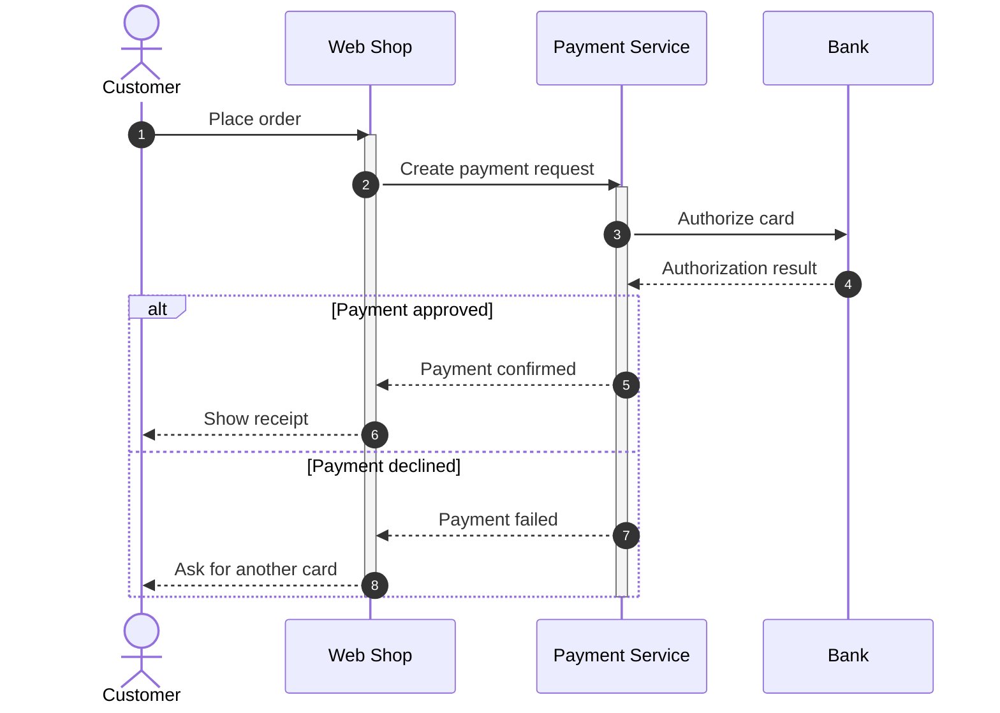

# Order payment sequence rehearsal

Four participants, eight authored messages, two activations, and alternative payment outcomes. Playback defaults to the approved outcome; choose the declined outcome to rehearse its six steps. Each message lasts one rehearsal second. This document executes no payment or network request.

## Review

Open this local document. Compare Sequence Diagram and Sequence Diagram (Mermaid), select either outcome, and use the shared Timeline to play, pause, seek, step, and reset. Source order and event identity stay the same across the canvas and inspector.
