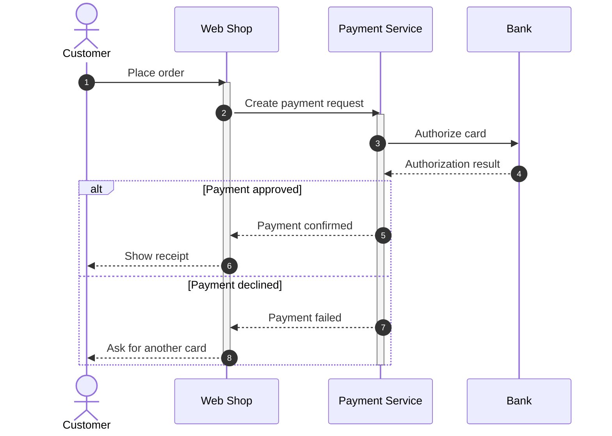

# Order payment sequence rehearsal

Four participants, eight authored messages, two activations, and alternative payment outcomes. Playback defaults to the approved outcome; choose the declined outcome to rehearse its six steps. Each message lasts one rehearsal second. This document executes no payment or network request.

## Review in two minutes

1. Open this file using the workspace's local file import/open action. Its frontmatter
   selects the notation view, Timeline and sequence inspector.
2. In **Canvas View Mode → 2D Renderer**, choose **Sequence Diagram**. Use
   **Connections** to inspect numbered messages between participants; compare **Lifelines**.
3. Select **3. Authorize card**. The inspector should show Payment Service → Bank,
   call, and the message's source line. Timeline should seek to **2.0 s** and highlight
   the same event on the sender and receiver tracks. The message has no authored
   protocol prefix, so do not describe it as a measured network request.
4. Play, pause, use Previous/Next, and scrub. At 1×, the approved outcome lasts
   **6 seconds**. Switch to **Sequence Diagram (Mermaid)** while paused and verify
   that the current event and position are retained.
5. Choose **Payment declined** in **Outcome 1**. The playhead resets and pauses;
   this outcome also lasts **6 seconds**, with source ordinals **1, 2, 3, 4, 7, 8**.
   At **4.0 s**, event **7. Payment failed** is current; at **5.0 s**, event
   **8. Ask for another card** is current. Eight authored messages do not mean
   eight steps in one run. Selecting an event from another outcome selects that branch.
6. Reset, return to the approved outcome, then save and reopen. Verify authored
   source rather than assuming the transient branch choice/playhead is persisted.

## Expected correspondence

| Playback interval | Approved source event | Declined source event |
|---|---|---|
| 0–1 s | 1 · Place order | 1 · Place order |
| 1–2 s | 2 · Create payment request | 2 · Create payment request |
| 2–3 s | 3 · Authorize card | 3 · Authorize card |
| 3–4 s | 4 · Authorization result | 4 · Authorization result |
| 4–5 s | 5 · Payment confirmed | 7 · Payment failed |
| 5–6 s | 6 · Show receipt | 8 · Ask for another card |

Intervals include their start and exclude their end. At 6.0 s the last message
remains selected and all played messages are complete. Selecting a message pauses
at its start. The diagram and inspector retain both alternatives; Timeline contains
the chosen outcome. Participant track selection is distinct from message selection.

## Review boundaries

This is deterministic authored rehearsal. The bank, payment and shop participants
are labels, and playback makes no service calls. No card details or credentials
belong in the source. Seconds express the local rehearsal clock, not measured latency.
This example covers calls, replies, activations and alternatives; async arrows,
notes and repeated messages have separate owner tests. Parallel blocks, loops,
custom delays and live trace execution are outside the supported grammar.

For keyboard review, Tab to a message/mark and press Enter or Space. Participant
bars support Left/Right and Home/End. Check narrow viewport containment and reduced
motion separately. Full offline save/reopen requires installed app assets and its
own disconnected browser check; local parsing alone does not prove that result.
