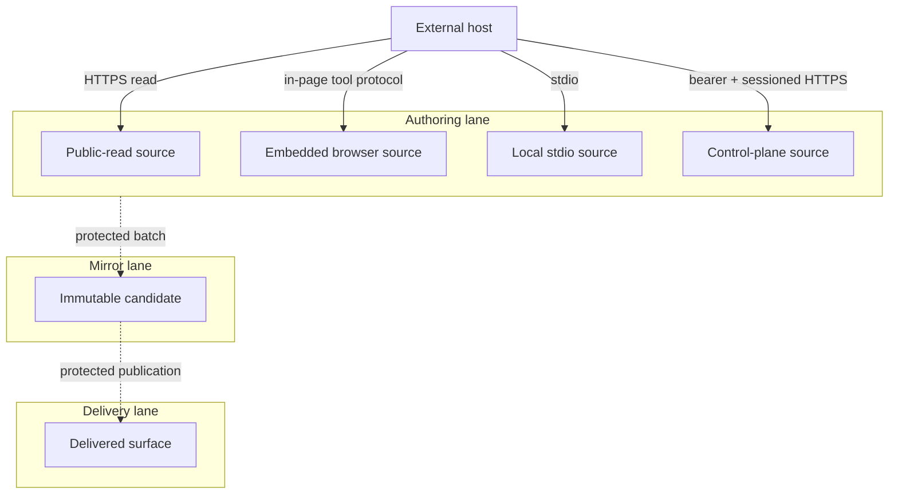

# Agent-Ready Runtime and Validation Companion

## Authority

The parent owns product requirements and the source surface matrix. This companion owns only the
runtime topology, source-owner inventory, validation hosts, and delivery boundaries. Exact endpoint,
command, binding, tag, and tool identities remain in their canonical Invocation Registers; this
companion does not redeclare them.

The local rung is `spec-complete` because VCCs are stated without satisfying local Evidence
References. The delivered rung is `undocumented` because no mirror or delivery Evidence Reference
or operator instruction is attached.

## Architecture

An external host selects a transport by trust boundary:

1. a public-read transport exposes only read/discovery capabilities;
2. an embedded browser transport exposes page-local inspection and guarded controls;
3. a local stdio transport exposes the broadest configuration-gated catalog;
4. a separate control-plane transport owns bearer-authenticated, session-aware orchestration.

No surface inherits another surface's catalog, credentials, delivery result, or readiness rung.

## Topology: Agent-ready transports v2 — 2026-07-30

| Node | Role | Type | Lane | Connects to | Connection | Data residency |
|---|---|---|---|---|---|---|
| Host | Consumer | tool-protocol-capable client | Authoring | selected transport | stdio or HTTPS/session | host device |
| Public-read source | Gateway | read-only function source | Authoring | published source owners | HTTPS JSON-RPC | request memory/source store |
| Embedded source | Gateway | browser runtime | Authoring | page-local stores/controls | in-page tool protocol | browser memory/local stores |
| Local source | Gateway | stdio process | Authoring | local executors | stdio/in-process | operator device |
| Control-plane source | Gateway | protected edge-function source | Authoring | bounded remote executors | bearer + sessioned HTTPS | configured control-plane region |
| Mirror | Store | immutable candidate | Mirror | Delivery | protected batch | mirror artifact store |
| Delivery | Gateway | optional reachable runtime | Delivery | external host | HTTPS/session | declared delivery region |

**Version note**: v2 replaces a delivery-shaped diagram and removes endpoint/tool declarations that
belong to the install contract's sole endpoint Invocation Register and a non-owning capability catalog.

## Reference implementation: agentic-graph source matrix

| Surface | Source owner | Contract | Local rung | Delivered rung |
|---|---|---|---|---|
| Pages HTTP MCP | `cloudflare/pages/agentic-graph-agent-ready.mjs` | exactly 7 read-only tools | `spec-complete` | `undocumented` |
| App WebMCP | `canvas/src/features/agent-ready/webMcpRuntime.ts` plus shared contract | exactly 42 tools: 30 read-only and 12 guarded controls | `spec-complete` | `undocumented` |
| Local stdio MCP | `mcp/server.js`, `mcp/local-tool-contract.js` | broad descriptor/executor catalog; configuration-gated per tool | `spec-complete` | `undocumented` |
| Control-plane MCP | `cloudflare/workers/agentic-graph-mcp/tool-registry.mjs` | separate 10-tool registry | `spec-complete` | `undocumented` |
| Source materialization | `canvas/src/features/source-files/` and parser owners | source-backed workspace/canvas path | `spec-complete` | `undocumented` |
| Release controller | `.github/workflows/release.yml` | exact candidate, protected approval, verification | `spec-complete` | `undocumented` |

Source presence is not a delivery claim. The release workflow does not deploy the separate
control-plane Worker.

### Runtime contracts

| Contract | End state | Failure behavior |
|---|---|---|
| Public-read | only the seven owned read tools are described and invoked | unsupported/mutating request rejected |
| Embedded | current 42-tool contract is registered page-locally | unsupported page capability returns typed unavailable state |
| Local stdio | descriptor and executor availability are reported separately | missing adapter/credential fails closed |
| Control-plane | ten-tool registry is protected by bearer authorization and MCP session semantics | missing runtime secret yields unavailable; invalid bearer yields unauthorized |
| Structured content | validated content reaches the existing source/workspace/canvas owner | invalid content never bypasses parsing/validation |

### VCC and Evidence Reference register

| VCC | End state | Named check | Constraint | Recorded result | Local rung | Delivered rung |
|---|---|---|---|---|---|---|
| VCC-AR-1 | Pages contract reports exactly seven read-only tools | `npm run agent-ready:check` | zero spend-bearing public-read tools | not recorded for this revision | `spec-complete` | `undocumented` |
| VCC-AR-2 | browser contract reports exactly 42 tools split 30/12 | `npm test` | controls remain page-local and guarded | not recorded | `spec-complete` | `undocumented` |
| VCC-AR-3 | Worker registry reports exactly ten tools and bearer/session tests pass | `npm run runtime:test` | no delivery inference | not recorded | `spec-complete` | `undocumented` |
| VCC-AR-4 | valid structured content uses the existing workspace/canvas apply path | `npm test` | no second graph pipeline | not recorded | `spec-complete` | `undocumented` |
| VCC-AR-5 | exact delivered revision and surface pass live verification | protected release receipt | source checks cannot satisfy it | not recorded | `spec-complete` | `undocumented` |

### Guardrails

- No public-read mutation or paid path.
- No browser credential persistence.
- No claim that local, browser, read, and control-plane catalogs are equal.
- No delivery claim from source files, generated mirror files, or remembered URLs.
- No local SuperAgent delivery claim without a separately owned route and live evidence.
- No direct Authoring-to-Delivery mutation.

### Deploy Boundary Register

| Boundary | From lane | To lane | Evidence Reference | Operator instruction | Rollback statement/check | State |
|---|---|---|---|---|---|---|
| `AGENT-SOURCE-TO-MIRROR` | Authoring | Mirror | candidate check result `not recorded` | `none` | discard candidate; rerun source/count/contract checks | `closed` |
| `AGENT-MIRROR-TO-DELIVERY` | Mirror | Delivery | exact live result `not recorded` | `none` | restore prior approved revision; rerun live discovery/session checks | `closed` |

### Companion references

- Parent: `docs/documents/agentic-graph-agent-ready-prd-tad-adr-mvp-gtm.md`
- Source-owner appendix: `docs/documents/agentic-graph-agent-ready-prd-tad-adr-mvp-gtm.companion.md`
- Install/Invocation authority: `docs/documents/agentic-graph-mcp-install-contract.md`
- Delivery verification: `docs/agentic-graph-post-deploy-verification-checklist.md`

## Planning continuity — reference implementation

This size/ownership companion consumes `PLAN-AGENTIC-GRAPH-AGENT-READY-PRD-TAD-ADR-MVP-GTM@1.28.1` with [the five-role owner](agentic-graph-agent-ready-prd-tad-adr-mvp-gtm.md#planning-revision--reference-implementation). Requirements, architecture and decisions remain in their linked owners; MVP and GTM consume them. Historical source checks retain their recorded revision, environment and coverage; this documentation revision renews no readiness, experience rating or paid-demand evidence.
