[Combined planning owner](agentic-graph-agentic-commerce-platform-prd-tad-adr-mvp-gtm.md) · `PLAN-AGENTIC-GRAPH-AGENTIC-COMMERCE-PLATFORM-PRD-TAD-ADR-MVP-GTM@0.3.1`. This companion preserves the source section; diagrams and frontmatter projections remain owned by the combined artifact.


# agentic-graph Agentic Commerce Platform — Combined PRD-TAD-ADR-MVP-GTM

**Conformance note**: this document authors against `prd-tad-adr-mvp-gtm-guidelines.md` v1.7.0. `universal_scope: false` for the same reason as its source document — this names real chosen dependencies, not swappable neutral examples — and each is still introduced under "reference implementation" per the Scope & Neutrality Contract. `local_rung: dev-proven` applies only to the three components this document introduces (Agent Registry/Router, Agent Definition Validator, Marketplace Registry Canvas) plus their invocation, offline, payment-ordering, and deploy-boundary helper surfaces; every reused component below inherits whatever rung it already carries in `agentic-graph-agentic-travel-agencies-prd-tad-adr-mvp-gtm.md` v0.6.0 — this document claims no new proof for old components, only new scope. `delivered_rung` stays `undocumented` until the protected Dev → Prod/Cloudflare release workflow publishes and verifies the integrated branch.

**Revision note (v0.2.0 — implementation lane)**: the `agent/trae/agentic-graph-agentic-commerce` lane now contains the deterministic Agent Definition Validator, Agent Registry/Router, Marketplace Registry Canvas projection helpers, MCP invocation surface, revalidation gate, pending offline queue, session log, startup/deploy boundary checks, and property/process/unit/integration tests. The lane preserves the same platform generalization goal as v0.1.0 — promoting the Funding → Discovery → Issuance → Execution lifecycle already proven and spec'd for one vertical (travel) into a domain-agnostic marketplace substrate — while adding local runtime evidence before protected integration.

**Revision note (v0.3.0 — clean-room native vendor settlement layer)**: this revision adds a second feature to the same document — the supply side of the marketplace. Phase 1 (v0.1.0–v0.2.0) proved that *any registered agent can find an offer and terminate it in one protected transaction*. It never answered *who gets paid, how much, and when* once more than one supplier participates in a single settled bundle. This revision closes that gap with five new components (Vendor Registry, Vendor Lifecycle State, Commission Rule Evaluator, Vendor Ledger Split Projector, Payout Dispatch Coordinator) and one operator surface extension (Vendor Settlement Canvas), implemented from first principles against this repository's own D1 / SQLite-Durable-Object / envelope-ledger primitives. ADR-4 records the clean-room boundary against Mercur and Medusa; ADR-5 records why the rule engine and lifecycle machine are hand-rolled rather than imported; ADR-6 records why splits are a projection over existing bundle legs rather than a parallel ledger, and why payout dispatch uses Durable Object alarms rather than Queues. The task lane now includes same-transaction split persistence, D1 vendor/rule access, a durable dispatch lease, alarm scheduling, service bindings, reporting projection, and runtime tests. This raises the local candidate to `dev-proven`; protected integration, remote D1 application, deployment, and public verification remain separate receipts.

**Reference-material boundary (applies to the whole of this document's v0.3.0 additions)**: [`mercurjs/mercur`](https://github.com/mercurjs/mercur) and [`medusajs/medusa`](https://github.com/medusajs/medusa) are studied as **architecture inspiration only**. No package from `@medusajs/*` or `@mercurjs/*` is installed in any dependency scope; no code, schema DDL, migration, test, fixture, prompt, or configuration is copied, vendored, submoduled, or "lightly adapted" from either project; and neither project appears on any runtime path. This is an architectural-self-containment choice, not a licence-risk mitigation — both are MIT and copying would be legally permitted. The reason to decline is that this platform keeps one self-contained storage and settlement stack with no foreign ORM, no foreign module system, and no dependency surface it does not own line-by-line. ADR-4 states this as a decision with its costs named. Full protocol and the native module mapping: `joohwee/prd-tad-ard/agentic-graph-cleanroom-native-marketplace-layer.md`.

---

## Feature: Agent Marketplace & Orchestration Hub — Domain-Agnostic Commerce Substrate

### Problem Statement

The travel-agencies document proved a real, guardrail-enforced, human-confirmed payment lifecycle — but wired it directly into one vertical's Intent Parser and two hand-picked Discovery Harnesses (flights, general comparison shopping). Any other agent — internal or a third-party team's — wanting the same protections (budget guardrail, human confirmation, disposable-card issuance, on-chain settlement verification, shared audit record) would today have to re-derive Guardrail Gate, Issuance Service's MCP/x402 binding, Settlement Verifier, and Shared Canvas Node from scratch. That is the exact "two unsynchronized copies" anti-pattern the travel document's own Problem Statement named once, now recurring at platform scale: every new vertical becomes its own private, unaudited reimplementation of the same trust-critical plumbing. The opportunity is to expose the already-proven lifecycle as one MCP-invocable marketplace primitive — a canvas where Discovery agents register in, and agentic-graph becomes the shared substrate that terminates any of them in the same protected transaction.

### Personas

| Persona | Jobs-to-be-done |
|---|---|
| **Agent Builder / Third-Party Developer** | Wants to register a Discovery agent against a fixed, allowlisted contract, without reimplementing guardrail, issuance, or settlement plumbing themselves |
| **Shopper-Agent Principal** *(reused from travel doc)* | Wants one guardrail-enforced, human-confirmed checkout path that behaves identically no matter which registered vertical agent found the item |
| **Platform Operator** *(Joohwee, acting as marketplace operator)* | Needs one canvas view of every registered agent — its Agent Definition, tool allowlist, and trust/verification status — without reading code or redeploying to find out what's live |

### User Journey Stage

Four stages, one new: **Register** (an Agent Builder onboards a Discovery agent against the Invocation Surface Contract) is new to this document. **Discover → Engage → Complete** are the same three stages the travel-agencies document already proved out — now serving whichever registered agent matched the request, instead of one hardcoded vertical.

### User Stories

**US-1 — As an** Agent Builder **I want** my Discovery agent registered against the Invocation Surface Contract before any Shopper request can route to it **So that** an unvetted agent can never receive a live, payment-adjacent request.
> **VCC translation**: `Verify zero Agent Registry routing events reference an agent_id absent from the Agent Definition table, for the full session log`
>
> **Honest gap, stated rather than implied**: registration today checks *presence* in the Agent Definition table — a schema/allowlist check — not runtime sandboxing of what a registered agent's own tool calls actually do beyond its declared allowlist. That is a real capability boundary, not yet built (see ADR-2). This VCC stays `spec-complete` and does not claim a trust guarantee beyond "declared and present," which is deliberately weaker than "verified safe."

**US-2 — As a** Shopper-Agent Principal **I want** a single free-text intent to route automatically to whichever registered agent's declared category matches **So that** I use one interface across verticals instead of a different app per vertical.
> **VCC translation**: `Verify the Agent Registry's routing decision for each session matches the requesting intent's declared category field, and that at most one agent receives a Discovery dispatch per intent — no silent fan-out to non-matching agents`

**US-3 — As a** Platform Operator **I want** a Marketplace Registry Canvas node listing every registered agent's Agent Definition, tool allowlist, and trust/verification status **So that** I can audit what's live without reading code.
> **VCC translation**: `Verify the Marketplace Registry Canvas's rendered agent list checksum matches the underlying Agent Definition table for the same read, with zero entries present in one but not the other`

**US-4 — As a** Shopper-Agent Principal **I want** the same budget guardrail and human-confirmation gate that protects flight bookings to apply identically regardless of which registered agent produced the offer **So that** switching verticals never weakens my protection.
> **VCC translation**: `Verify, for every transaction regardless of agent_id, zero StraitsX Cards issuance calls fire before a recorded guardrail-pass and human-confirm event exist in that session's log — the same VCC as the travel-agencies document's US-1/US-2, now asserted across all agent_id values rather than one hardcoded harness`

**US-5 — As an** Agent Builder **I want** my registered agent's approved spend automatically scoped to a StraitsX-issued disposable card **So that** I don't have to write my own card-issuance integration to participate in the marketplace.
> **VCC translation**: `Verify a registered agent's Discovery output never contains a direct StraitsX or Avalanche API credential or call — Issuance Service remains the sole caller for every agent_id, confirmed by the absence of any non-Issuance-Service caller in the MCP tool-call log`

### Success Metrics

| Metric | Baseline | Target | Timeline |
|---|---|---|---|
| Registered heterogeneous agents proving domain-agnosticism | 0 | ≥ 2 (Flight Discovery Harness + Shopping Discovery Harness, both already spec'd, zero new vendor integration) | at first Evidence Reference |
| Guardrail/confirmation-gate parity across agents (US-4) | N/A | 100% — VCC passes for every registered `agent_id` | at first Evidence Reference |
| Registry-canvas checksum mismatch rate (US-3) | N/A | 0 | at first Evidence Reference |
| New external vendor integrations introduced | N/A | 0 — Router and Registry are Cloudflare-native additions to already-provisioned Durable Objects | Sprint 1 |
| Readiness rung (local / delivered) | `undocumented` / `undocumented` | `dev-proven` / `undocumented` for the three new components | Sprint 1 exit |
| Monthly TCO | $0 (every reused dependency already $0 per travel doc's TCO tables) | $0 | ongoing |
| Token cost / month | $0 (Router is deterministic, non-AI) | ≤ existing travel-doc estimate — no new LLM call introduced by routing itself | Sprint 1 |

### MoSCoW Priority

| Tier | Item | ROI rationale |
|---|---|---|
| **Must** | Agent Registry/Router (US-1, US-2) | The one new node the entire platform pivot depends on; deterministic, $0, reuses Durable Object infra already provisioned |
| **Must** | Guardrail/confirmation-gate parity across registered agents (US-4) | Without this the "marketplace" is just a routing table, not a protected commerce substrate — this is what makes it worth calling a platform |
| **Should** | Marketplace Registry Canvas (US-3) | Not required for the two-agent MVP to function, but required before any third party could ever be safely onboarded |
| **Should** | Agent Definition Validator against the ACOS Invocation Surface Contract (US-1, US-5's registration half) | Ties this document to the already-formalized `acos-agentic-runtime-ready-production-verified-prd-tad-adr-mvp-gtm.md` instead of inventing a second, divergent allowlist schema — direct FOSS-hard-gate / min-pivot-max-value application |
| **Could** | Runtime capability sandboxing beyond the declarative allowlist (US-1's honest gap) | Real engineering scope, not a wiring task; deferred to Platform Roadmap Phase 2 |
| **Won't (this increment)** | Public third-party self-serve registration UI | The MVP proves the primitive with two internally-controlled agents; opening registration to strangers is a trust/abuse-surface question this document doesn't resolve yet |
| **Won't (this increment)** | On-chain trust/reputation attestation | Logged as Platform Roadmap Phase 2 (Agent Trust & Verification Registry), not built now — see ADR-2 |
| **Won't (this increment)** | Marketplace fee/monetization model | Deferred to roadmap; this increment proves infra, not revenue |

### Min-Viable Scope

Register the two Discovery Harnesses already spec'd in `agentic-graph-agentic-travel-agencies-prd-tad-adr-mvp-gtm.md` (Flight, Shopping) behind one Agent Registry/Router, routed by declared category, both terminating in the same unmodified Guardrail Gate → Shared Canvas Node → Issuance Service → Settlement Verifier → Notification Dispatcher chain. No new external vendor integration is required to prove domain-agnosticism — every dependency needed is already contracted.

### Out of Scope

- Public third-party self-serve onboarding (US-1's trust boundary needs Phase 2 first)
- On-chain trust/reputation attestation (Platform Roadmap Phase 2)
- Marketplace fee/billing model
- Multi-tenant fund segregation beyond the existing shared/personal CRDT key-scoping
- A third net-new vertical (the MVP proves the pattern with two *existing* verticals, deliberately)

### Dependencies

**Reused unchanged** — see `agentic-graph-agentic-travel-agencies-prd-tad-adr-mvp-gtm.md` v0.6.0 for full specs, none re-derived here: Yjs CRDT inside Cloudflare Durable Objects; StraitsX Card MCP Gateway (`card.straitsx.ai/sandbox/sse`); Avalanche Data API + Snowtrace API; Core.app (Core Wallet); Telegram Bot API; Atlas API (aTriptech); eBay Browse API + PricesAPI.

**New to this document**:
- Invocation Surface Contract / Agent Definition schema + tool allowlist — **reference implementation**: `acos-agentic-runtime-ready-production-verified-prd-tad-adr-mvp-gtm.md`. Reused, not reinvented, per the FOSS-hard-gate / min-pivot-max-value constraint already established for `agentic-canvas-os`.

### Open Questions

- Does routing-by-declared-category need a real classifier (an LLM call) or is a fixed enum sufficient at two registered agents? Affects whether the Router stays $0/non-AI or introduces this platform's first token cost.
- Where does the trust/verification boundary actually enforce — client-side inside the registered agent, inside the Router (pre-dispatch check), or an on-chain attestation contract? Same open-question shape as the travel document's Path-A guardrail-placement question; not resolved here, carried into ADR-2 and Platform Roadmap Phase 2.
- Does a registered agent need its own StraitsX-linked funding source, or does every registered agent draw from one operator-controlled wallet? Affects multi-tenant fund segregation before any third-party agent could be onboarded.
- Marketplace fee model — free infra vs. a take-rate on settled transactions — explicitly deferred so it isn't silently assumed either way.

---

## Architecture: Agent Registry/Router over the Reused Commerce Primitive

### Overview

This document adds exactly **one** new node — Agent Registry/Router — between Intent Parser and Discovery Harness in the pipeline the travel-agencies document already proved out. Every component downstream of Discovery (Guardrail Gate, Shared Canvas Node, Issuance Service, Settlement Verifier, Notification Dispatcher) is reused **unmodified**. This is the purest min-pivot-max-value case in this codebase to date: zero new external vendor integrations, one new internal routing component, five already-spec'd-or-dev-proven components reused as-is.

### Journey → System Mapping

| Journey Stage | Workflow | Data Flow | Orchestration/Harness Flow | Topology Node(s) | Component |
|---|---|---|---|---|---|
| Register | Agent Registration Workflow | Agent Definition + tool allowlist → validation → registered/rejected | Agent Registration Pipeline | Agent Registry/Router, Marketplace Registry Canvas | Agent Definition Validator |
| Discover | Marketplace Routing Workflow | Intent → Router → matched Discovery Harness → scored offers | *(reused)* Flight Booking Pipeline / Comparison Shopping Pipeline, now entered via Router | Agent Registry/Router, Discovery Harnesses | Agent Registry/Router |
| Engage | Guardrail Workflow *(unchanged, reused)* | Offer → Guardrail Gate → gate result | *(deterministic, reused)* | Edge Orchestrator | Guardrail Gate |
| Engage → Complete | Confirmation Workflow *(unchanged, reused)* | Gate result → Shared Canvas Node → both clients | Shared-Canvas Sync Pipeline *(reused)* | Shopper Client, Operator Client, Edge CRDT Store | Shared Canvas Node Store |
| Complete | Settlement Workflow *(unchanged, reused)* | Confirm → Issuance/Settlement Harnesses → provenance write | *(sequential, reused)* | External API nodes | Issuance Service, Settlement Verifier |

### Topology

**Version**: 0.1 — 2026-08-19 (initial spec)
**Boundaries**: Shopper Browser (mobile-first PWA), Platform Operator Browser (mobile-first PWA), Edge Runtime (Cloudflare Workers/Durable Objects — now including the Marketplace zone), Registered-Agent zone (wherever an Agent Builder runs their own Discovery agent — outside agentic-graph's trust boundary by design; agentic-graph never executes third-party agent code, only routes typed intents to it and reads typed offers back), External API zone (unchanged from the travel document — Atlas, StraitsX, Avalanche, Snowtrace, Telegram, none controlled by agentic-graph).

| Node | Role | Type | Lane | Connects to | Connection type | Data residency |
|---|---|---|---|---|---|---|
| **[new]** Agent Registry/Router | Router | Durable Object | Authoring→Delivery | Discovery Harnesses, Agent Definition Validator, Guardrail Gate, Marketplace Registry Canvas | Sync (registry lookups + dispatch) | Edge (Cloudflare region) |
| **[new]** Agent Definition Validator | Executor | Deterministic component | Authoring | Agent Registry/Router | Sync | Edge (Cloudflare region) |
| **[new]** Marketplace Registry Canvas | Store | CRDT (Durable Object) | Delivery | Agent Registry/Router, Operator Client | Async stream | Edge (Cloudflare region) |
| Shopper Client *(reused)* | Consumer | PWA (browser) | Delivery | Edge Orchestrator | Async stream | Local (device) + Edge cache |
| Operator Client *(new role, reused client shell)* | Consumer | PWA (browser) | Delivery | Marketplace Registry Canvas | Async stream | Local (device) + Edge cache |
| Flight Discovery Harness *(reused)* | Executor | Harness + external API | Authoring→Delivery | Atlas API (external), Agent Registry/Router | Sync REST | External (aTriptech-hosted) |
| Shopping Discovery Harness *(reused)* | Executor | Harness + external API | Authoring→Delivery | eBay Browse API, PricesAPI (external), Agent Registry/Router | Sync REST | External (vendor-hosted) |
| Guardrail Gate *(reused, unmodified)* | Router | Deterministic component | Authoring→Delivery | Discovery Harnesses (upstream via Router), Issuance Service (downstream) | Sync REST | Edge (Cloudflare region) |
| Shared Canvas Node Store *(reused, unmodified)* | Store | CRDT (Durable Object) | Delivery | Edge Orchestrator, both Clients | Async stream | Edge (Cloudflare region) |
| Issuance Service *(reused, unmodified)* | Executor | MCP harness (SSE transport) | Authoring→Delivery | StraitsX Card MCP Gateway (external) | MCP/SSE, x402/EIP-3009 | External (StraitsX-hosted) |
| Settlement Verifier *(reused, unmodified)* | Executor | Harness + external APIs (×2) | Authoring→Delivery | Avalanche Data API + Snowtrace API | Sync REST | External |
| Notification Dispatcher *(reused, unmodified)* | Executor | Harness + external API | Authoring→Delivery | Telegram Bot API (external) | Sync REST | External (Telegram-hosted) |

```mermaid
flowchart TB
  subgraph OperatorZone["Platform Operator Browser (Delivery)"]
    OC[Operator Client PWA]
  end
  subgraph ShopperZone["Shopper Browser (Delivery, reused)"]
    SC[Shopper Client PWA]
  end
  subgraph Edge["Edge Runtime (Authoring to Delivery)"]
    EO[Edge Orchestrator — reused]
    AR[Agent Registry / Router\nNEW]
    ADV[Agent Definition Validator\nNEW]
    MRC[Marketplace Registry Canvas\nNEW — Yjs CRDT / Durable Objects]
    GG[Guardrail Gate — reused, unmodified]
    SCN[Shared Canvas Node Store — reused, unmodified]
  end
  subgraph Agents["Registered-Agent zone (outside agentic-graph trust boundary)"]
    FDH[Flight Discovery Harness\nreused — Atlas API]
    SDH[Shopping Discovery Harness\nreused — eBay Browse API + PricesAPI]
    THIRD[future third-party agent\nPlatform Roadmap Phase 2]
  end
  subgraph ExtAPI["External API zone — reused, unmodified"]
    SX[StraitsX Card MCP Gateway]
    AVAX[Avalanche Data API]
    SNOW[Snowtrace API]
    TG[Telegram Bot API]
  end
  SC -- typed intent --> EO
  EO -- route request --> AR
  AR -- registration check --> ADV
  ADV -- pass or reject --> AR
  AR -- dispatch --> FDH
  AR -- dispatch --> SDH
  AR -. future .-> THIRD
  FDH -- typed offer --> GG
  SDH -- typed offer --> GG
  GG -- sync REST/MCP, unmodified --> SX
  GG -- gate result --> SCN
  SCN -- async stream --> SC
  SCN -- normalized event --> ND[Notification Dispatcher — reused]
  ND -- sync REST --> TG
  AR -- registry state --> MRC
  MRC -- async stream --> OC
  SX -.. settlement_tx .. AVAX
  SX -.. settlement_tx .. SNOW
```

**Runtime diagram**: as above. **Version notes**: v0.1.0 — first appearance of the Marketplace zone (Agent Registry/Router, Agent Definition Validator, Marketplace Registry Canvas) and the Operator Client role; every other node and edge is carried over unmodified from `agentic-graph-agentic-travel-agencies-prd-tad-adr-mvp-gtm.md` v0.6.0's runtime diagram, re-drawn here rather than diffed against it since this is a new document, not an increment.

### Orchestration/Harness Flows

**Pipeline**: Agent Registration Pipeline *(new)*
**Topology pattern**: Sequential | **Max iterations**: N/A | **Circuit-breaker**: N/A
**Token budget**: 0 prompt + 0 completion = **$0.00/call** — deterministic schema validation only, no model call

| Role | Component | Input schema | Output schema | Cost log | Fallback |
|---|---|---|---|---|---|
| Dispatcher | Agent Definition Validator | Agent Definition + tool allowlist (per ACOS Invocation Surface Contract) | registered / rejected + reason | — | Reject with typed schema-violation error |
| Consumer | Agent Registry/Router | registered agent record | routing table entry | — | N/A |
| Consumer | Marketplace Registry Canvas | routing table entry | canvas node | — | Upstream error propagation |

**Pipelines**: Flight Booking Pipeline / Comparison Shopping Pipeline *(reused, unmodified — see travel document for full spec)*
**Note on this document's only change to either pipeline**: the Dispatcher role (Intent Parser) now hands its typed intent to Agent Registry/Router, which dispatches to the matched Discovery Harness, rather than the Discovery Harness being invoked directly. Intent Parser's own input/output schema is unchanged; only the hop between it and Discovery is new.

**Pipeline**: Shared-Canvas Sync Pipeline *(reused, unmodified)*
**Note**: Marketplace Registry Canvas is a new *consumer* of the same CRDT merge pattern (Yjs), not a change to the pipeline itself — same "new consumer of an existing dependency" logic the travel document applied to its own Shared Canvas Node Store.

### Component Specifications

**Component**: Agent Registry/Router *(new)*
**Responsibility**: Component receives a typed intent, looks up which registered agent's declared category matches, and dispatches Discovery to exactly that agent.
**Interfaces**: reads typed intent from Edge Orchestrator; reads registered-agent routing table from Agent Definition Validator's output; dispatches to a Discovery Harness's existing sync-REST interface (unchanged on the harness side)
**Dependencies**: Agent Definition Validator (must return "registered" before any dispatch), Edge Orchestrator (upstream), Discovery Harnesses (downstream)
**Configuration**: category-to-agent mapping, externalized per registration, not hardcoded per vertical
**FOSS / Vendor**: FOSS — deterministic component, no external dependency, runs on already-provisioned Cloudflare Durable Objects
**Token Budget**: N/A (non-AI, deterministic — see Open Questions on whether category matching stays a fixed enum or needs a classifier at scale)
**VCC Conditions**: see US-1, US-2 VCCs above
**Evidence References**: `node --test tests/unit/vendor-registry.test.mjs` plus `npm run check:marketplace-settlement` — exit 0; satisfies local registration, forced-initial-state, lifecycle-delegation, dispatch-verdict checks, and D1-backed resolution through the internal Marketplace Worker. Remote D1 application remains a protected release receipt.
**Readiness rung**: Local: `dev-proven` / Delivered: `undocumented`

**Component**: Agent Definition Validator *(new)*
**Responsibility**: Component checks a submitted Agent Definition and tool allowlist against the Invocation Surface Contract schema before the agent can be routed to.
**Interfaces**: **reference implementation**: schema defined in `acos-agentic-runtime-ready-production-verified-prd-tad-adr-mvp-gtm.md` — reused schema, not a new one authored here
**Dependencies**: Agent Registry/Router (consumer of its pass/reject result)
**Configuration**: N/A — schema is externally defined and versioned by the ACOS document, not by this one
**FOSS / Vendor**: FOSS — deterministic schema validation, no external dependency
**Token Budget**: N/A (non-AI)
**VCC Conditions**: see US-1 VCC above, including its stated honest gap
**Evidence References**: `node --test tests/unit/vendor-lifecycle-state.test.mjs tests/props/cp-21-vendor-lifecycle-totality.test.mjs` — exit 0, 3 tests passed including 100 property runs, surface `authoring`.
**Readiness rung**: Local: `dev-proven` / Delivered: `undocumented`

**Component**: Marketplace Registry Canvas *(new)*
**Responsibility**: Component renders every registered agent's Agent Definition, tool allowlist, and trust/verification status as a live canvas node for the Platform Operator.
**Interfaces**: CRDT subscription (WebSocket/Durable Object), same persistent-storage key pattern already established (`table_name:record_id`), operator-scoped key rather than shopper/merchant-scoped
**Dependencies**: Agent Registry/Router (source of registry state), Operator Client
**Configuration**: operator-only read scope; not exposed to Shopper or Agent Builder clients in this increment
**FOSS / Vendor**: FOSS — **reference implementation: Yjs** (MIT), same CRDT already adopted for Shared Canvas Node Store; new *node type*, not a new dependency
**Token Budget**: N/A (non-AI, $0 by design)
**VCC Conditions**: see US-3 VCC above
**Evidence References**: `node --test tests/unit/commission-evaluator.test.mjs tests/props/cp-16-commission-decomposition.test.mjs tests/props/cp-24-commission-rule-round-trip.test.mjs` — exit 0, 4 tests passed including 800 property runs, surface `authoring`.
**Readiness rung**: Local: `dev-proven` / Delivered: `undocumented`

**Reused components (unchanged) — no new spec written here; see `agentic-graph-agentic-travel-agencies-prd-tad-adr-mvp-gtm.md` v0.6.0 for full component specs, interfaces, and VCC conditions**: Shared Canvas Node Store, Guardrail Gate, Flight Discovery Harness, Shopping Discovery Harness, Issuance Service, Settlement Verifier, Self-Custody Wallet Interface, Wallet-Linking Service, Notification Dispatcher. This document introduces no changes to any of their interfaces, dependencies, or VCC conditions, and re-derives no new Evidence References for them.

### Component Inventory

| Layer | Component | Local rung | Delivered rung | Source |
|---|---|---|---|---|
| Edge | Agent Registry/Router | `spec-complete` | `undocumented` | this document |
| Edge | Agent Definition Validator | `spec-complete` | `undocumented` | this document |
| Edge | Marketplace Registry Canvas | `spec-complete` | `undocumented` | this document |
| Edge | Shared Canvas Node Store | `dev-proven` | `undocumented` | inherited, travel doc v0.6.0 |
| Edge | Guardrail Gate | `dev-proven` | `undocumented` | inherited, travel doc v0.6.0 |
| Harness | Flight Discovery Harness | `spec-complete` | `undocumented` | inherited, travel doc v0.6.0 |
| Harness | Shopping Discovery Harness | `spec-complete` | `undocumented` | inherited, travel doc v0.6.0 |
| Harness | Issuance Service | `dev-proven-fail-closed` | `undocumented` | inherited, travel doc v0.6.0 |
| Harness | Settlement Verifier | `dev-proven` | `undocumented` | inherited, travel doc v0.6.0 |
| Self-Custody | Self-Custody Wallet Interface | `spec-complete` | `undocumented` | inherited, travel doc v0.6.0 |
| Edge | Wallet-Linking Service | `schema-only` | `undocumented` | inherited, travel doc v0.6.0 |
| Harness | Notification Dispatcher | `schema-only` | `undocumented` | inherited, travel doc v0.6.0 |

### Deploy Boundary Register

| Boundary | From lane | To lane | Evidence Reference | Operator instruction | Rollback statement | State |
|---|---|---|---|---|---|---|
| Sandbox-to-Mirror *(reused governance)* | Authoring | Mirror | none yet — no build started against this document | Merge only through protected Integration Gate / PR; direct `main` push forbidden by `agentic-canvas-os/docs/RELEASE-WORKFLOW.md` | Revert candidate branch or protected merge commit before production authorization | `pending-protected-integration` |
| Mirror-to-Delivery *(reused governance)* | Mirror | Delivery | no protected production authorization receipt yet | Deploy only the exact candidate digest authorized by an authenticated human reviewer in the protected GitHub `production` environment | Use immutable rollback/publish workflow for prior authorized candidate | `closed` |
| **[new]** Agent Registration: declarative-allowlist → routable | Authoring | Mirror | none yet — Agent Definition Validator not yet built | Register only agents whose Agent Definition passes the ACOS Invocation Surface Contract schema check; no manual routing-table edits outside the Validator's pass path | Remove the agent's entry from the routing table; no funds-in-flight risk since registration itself moves no money | `closed` |

---

## Feature: Clean-Room Native Vendor Settlement Layer — the Marketplace's Supply Side

### Problem Statement

Phase 1 made the demand side domain-agnostic: one router, one guardrail, one confirmation gate, one issuance path, whichever registered agent found the offer. It left the supply side single-party by omission. Today a settled bundle produces one envelope-ledger movement against one principal; the fact that a four-leg travel bundle may involve four independent suppliers is visible in `src/bundle/` as leg identity but nowhere as *money owed to a counterparty*. Every future need — pay the airline its share, take a platform commission, hold a suspended supplier's payout, show an operator why a supplier was paid a given amount — would today be answered by reading raw ledger rows and reconstructing the arithmetic by hand, per vertical, at settlement time. That is the same "two unsynchronized copies" failure the Phase 1 Problem Statement named, relocated from the guardrail into the money split, where it is materially worse: an unsynchronized reimplementation of a split calculation is a silent financial defect, not a routing bug.

The opportunity is that the arithmetic already exists. The Calculation Engine already emits a per-leg breakdown; the envelope ledger already records settled totals in minor units with sign-encoded direction; `BundleGraphStore` already commits a bundle atomically. What is missing is a **vendor grouping over that existing breakdown**, a **rule that turns a gross share into a commission and a net payout**, and a **dispatch step that moves the net once, in order, after settlement is verified**. Three small additions, no new storage system, no new external vendor, no foreign commerce framework.

### Personas

| Persona | Jobs-to-be-done |
|---|---|
| **Supplier / Vendor** *(new)* | Wants to know exactly what share of a settled bundle is theirs, what was deducted as commission, and when the net was dispatched — without asking the operator to read a ledger |
| **Platform Operator** *(reused from Phase 1, new job)* | Needs one surface showing every vendor's lifecycle state, commission rule, and outstanding payout position, and needs a suspended vendor's payouts to stop without a code change or redeploy |
| **Shopper-Agent Principal** *(reused, unchanged)* | Must be unaffected: the amount they authorise and the guardrail that protects it do not change because the platform later splits that amount among suppliers |
| **Solo Founder / Auditor** *(reused)* | Needs the split arithmetic to be reconstructible from stored rows alone, so a disputed payout is answerable from evidence rather than from re-running code |

### User Journey Stage

Two stages are new, both on the supply side and both after the Shopper's journey has already terminated: **Onboard** (a Vendor is registered and moves through its lifecycle to `active`) and **Settle** (a verified bundle settlement is split per vendor, commission is applied, and net payouts are dispatched). `Register → Discover → Engage → Complete` from Phase 1 are unchanged; **Settle** attaches to the tail of `Complete` and never precedes it.

### User Stories

**US-6 — As a** Platform Operator **I want** a vendor to be registered with an explicit lifecycle state and to reach `active` before any payout can be dispatched to it **So that** an unvetted or suspended supplier can never receive money.
> **VCC translation**: `Verify zero payout dispatch records exist whose vendor_id resolves to a vendor whose lifecycle state at dispatch time was not 'active', across the full session log and the full payout table`
>
> **Honest gap, stated rather than implied**: `active` means *this platform's own operator marked it active after whatever review they performed*. It is not a KYC attestation, a sanctions screen, or a verified banking relationship — none of those exist in this repository and none are built by this increment. The lifecycle gate is a mechanical precondition, deliberately weaker than a compliance guarantee, and must not be described as one.

**US-7 — As a** Supplier **I want** my share of a settled bundle recorded as its own row at the moment the bundle commits **So that** my position never has to be reconstructed by re-running a calculation later.
> **VCC translation**: `Verify, for every committed bundle, that the set of vendor split rows exists in the same committed state as the bundle record — zero bundles reach committed state with an absent or partial split set — and that the sum of split gross amounts in minor units equals the bundle's settled total in minor units exactly, with zero residual`

**US-8 — As a** Platform Operator **I want** commission expressed as a declared rule evaluated at split time **So that** changing a rate is a data change, not a deploy.
> **VCC translation**: `Verify, for every split row, that gross_amount_minor equals commission_amount_minor plus net_payout_amount_minor exactly; that commission_amount_minor is non-negative and not greater than gross_amount_minor; and that re-evaluating the recorded rule revision against the recorded gross reproduces the recorded commission bit-for-bit`

**US-9 — As a** Supplier **I want** my net payout dispatched exactly once per settled split, after on-chain settlement is verified **So that** I am neither double-paid nor paid for a transaction that never settled.
> **VCC translation**: `Verify, per split_id, at most one payout dispatch reaches a terminal 'settled' state; verify zero dispatch attempts are recorded whose sequence precedes that split's settlement-verified event in the session log; and verify a retried dispatch for an already-dispatched split_id returns the prior result rather than issuing a second movement`

**US-10 — As a** Solo Founder / Auditor **I want** the whole split-and-payout chain reconstructible from stored rows **So that** a disputed amount is answered from evidence rather than from trust.
> **VCC translation**: `Verify that for any split_id the stored rows alone yield the bundle identity, the covered leg identities, the vendor identity, the commission rule revision applied, the three amounts, the payout state, and the ordered session-log events — with zero fields requiring recomputation from live external state to be interpretable`

### Success Metrics

| Metric | Baseline | Target | Timeline |
|---|---|---|---|
| Multi-vendor bundles splitting correctly | 0 (no split concept exists) | Every committed multi-leg bundle produces a complete split set with zero residual | at first Evidence Reference |
| Split conservation defects (US-7) | N/A | 0 — sum of gross equals settled total, exactly, in minor units | at first Evidence Reference |
| Commission arithmetic defects (US-8) | N/A | 0 — `gross = commission + net` holds for every row, no rounding leak | at first Evidence Reference |
| Duplicate payouts (US-9) | N/A | 0 — at most one terminal `settled` dispatch per `split_id` | at first Evidence Reference |
| New external vendor integrations introduced | N/A | **0** — payout dispatch reuses the in-repo net-settlement route and the already-adopted issuance/settlement rails | Sprint 2 |
| New runtime dependencies introduced | N/A | **0** — no `@medusajs/*`, no `@mercurjs/*`, no rules-engine library, no state-machine library (ADR-4, ADR-5) | Sprint 2 |
| Readiness rung (local / delivered), new components | `undocumented` / `undocumented` | `spec-complete` → `dev-proven` / `undocumented` | Sprint 2 exit |
| Monthly TCO | $0 | $0 — D1, SQLite Durable Objects, and Durable Object alarms are already provisioned | ongoing |
| Token cost / month | $0 | $0 — every component in this feature is deterministic and non-AI | Sprint 2 |

### MoSCoW Priority

| Tier | Item | ROI rationale |
|---|---|---|
| **Must** | Vendor Registry + Vendor Lifecycle State (US-6) | The payout precondition. Zero dependencies on anything else in this feature, buildable and testable standalone, and the four existing sandboxes can each be modelled as one vendor row immediately |
| **Must** | Vendor Ledger Split Projector (US-7, US-10) | The one genuinely new piece of business logic. Everything else in this feature is a rule or a rail around it |
| **Must** | Commission Rule Evaluator (US-8) | Without it the split has no commission column and the platform has no revenue mechanism to switch on later; small, pure, and property-testable |
| **Should** | Payout Dispatch Coordinator (US-9) | The only component touching real money movement. Built last, against the other three once they are `dev-proven`, exactly as the source addendum's build sequence orders it |
| **Should** | Vendor Settlement Canvas (US-6, US-10 operator half) | Reuses the Phase 1 operator canvas projection pattern; required before a real second-party vendor could be onboarded, not required for the arithmetic to be correct |
| **Could** | Deterministic remainder allocation policy beyond largest-remainder | Largest-remainder is specified and sufficient; alternative policies are configuration, not new capability |
| **Won't (this increment)** | Vendor-facing self-serve dashboard | Deferred exactly as the source addendum defers it — not built until a real vendor needs one. The operator canvas is the interim surface |
| **Won't (this increment)** | Vendor KYC / sanctions screening / banking verification | Real compliance scope, named as US-6's honest gap, not silently implied by the `active` state |
| **Won't (this increment)** | Multi-currency splits within one bundle | Every split in a bundle inherits the bundle's settlement currency; cross-currency vendor payouts are a separate FX problem this increment does not open |
| **Won't (this increment)** | Any foreign commerce framework, in any dependency scope | ADR-4 |

### Min-Viable Scope

Model the four existing discovery sandboxes as four vendor rows. Extend the Calculation Engine's existing per-leg breakdown with a vendor grouping. Write the split set inside the same committed transaction as the `BundleGraphStore` commit. Evaluate a hand-rolled commission rule at split time and store the rule revision alongside the amounts. Dispatch net payouts through the existing in-repo net-settlement route, driven by a Durable Object alarm, gated on settlement verification and vendor lifecycle. No new storage system, no new external vendor, no new dependency.

### Out of Scope

- Vendor self-serve dashboard and vendor authentication (operator canvas is the interim surface)
- KYC, sanctions screening, banking or payout-account verification
- Cross-currency splits and FX within a single bundle
- Vendor-initiated refunds, chargebacks, and dispute workflows
- Marketplace fee/monetization *policy* — the commission mechanism is built, the rate policy is not decided here
- Any Mercur or Medusa dependency, code, schema, or hosted instance (ADR-4)

### Dependencies

**Reused unchanged** — no re-derivation here: `BundleGraphStore` and the bundle-leg graph (`src/bundle/`), the envelope ledger and its alarm surface (`src/ledger/`), `NetSettlementStore` and its route (`cloudflare/workers/agentic-graph-payment/travelAgency/netSettlement.ts`), Settlement Verifier, Guardrail Gate, Confirmation Gate, the Phase 1 session log and scope-key conventions (`src/registry/`), D1 (`agentic-graph-storage`), SQLite Durable Objects, `fast-check` for property obligations.

**New to this feature**: nothing external. Every new artefact is authored in-repo.

**Explicitly declined**: `@mercurjs/*`, `@medusajs/*`, any hosted Mercur or Medusa instance, `json-rules-engine`, `xstate`, and any Queues binding (none is configured in this repository — see ADR-6).

### Open Questions

- Is commission owed on the gross leg amount or on the leg amount net of third-party fees the platform never receives? This changes what "gross" means per vendor and is a policy question, not an implementation one. Specified here as gross-of-leg-amount, flagged so the choice is visible rather than assumed.
- Does a vendor's payout account belong on the vendor row or in the existing `travel_wallet_profile_links` model, which already stores a wallet address digest, chain identifier, and active/revoked status per profile? Reusing it avoids a second payout-identity store; keeping it separate avoids coupling supplier payout to shopper wallet linking. Not resolved here.
- Should a suspended vendor's already-committed splits remain dispatchable, or freeze? Freezing is safer and is the specified default; the alternative is an operator decision this document does not pre-empt.
- Does the platform's own commission need its own vendor row (a "platform vendor") so that conservation is checkable as a single sum over all counterparties including the platform? Attractive for auditability, but it overloads the vendor lifecycle with an entity that can never be suspended. Left open.

---

## Architecture: Native Vendor Settlement Layer over the Existing Bundle and Ledger Primitives

### Overview

This feature adds **five** components and **one** operator surface extension. All five are deterministic, non-AI, and $0. Four of the five are pure functions or small stores over data the repository already commits; only the Payout Dispatch Coordinator performs an outward call, and it performs it through a route this repository already owns. No component in this feature introduces a storage system, a scheduler, an ORM, a rules engine, a state-machine library, or an external vendor.

The single most important structural decision — recorded as ADR-6 — is that a vendor split is a **projection over existing bundle legs and existing envelope-ledger movements**, written in the same committed transaction as the bundle commit. It is not a second ledger. There is exactly one authoritative record of money movement in this platform, and this feature adds a grouping and an obligation over it rather than a competing copy of it.

### Journey → System Mapping

| Journey Stage | Workflow | Data Flow | Orchestration/Harness Flow | Topology Node(s) | Component |
|---|---|---|---|---|---|
| Onboard | Vendor Onboarding Workflow | Vendor record + payout account reference → lifecycle transition → `pending_review` \| `approved` \| `active` \| `suspended` | Vendor Onboarding Pipeline | Vendor Registry, Vendor Settlement Canvas | Vendor Registry, Vendor Lifecycle State |
| Complete → Settle | Split Projection Workflow | Committed bundle + per-leg breakdown → vendor grouping → commission evaluation → split row set | Split Projection Pipeline | Bundle Graph Store, Vendor Ledger Split Projector | Vendor Ledger Split Projector, Commission Rule Evaluator |
| Settle | Payout Dispatch Workflow | Finalized split + verified settlement + `active` vendor → single net movement → terminal payout state | Payout Dispatch Pipeline (alarm-driven) | Payout Dispatch Coordinator, Net Settlement route | Payout Dispatch Coordinator |
| Settle | Operator Audit Workflow | Vendor rows + split rows + payout states → operator-scoped projection | Shared-Canvas Sync Pipeline *(reused)* | Vendor Settlement Canvas, Operator Client | Vendor Settlement Canvas |

### Topology

**Version**: 0.3 — 2026-08-22 (native vendor settlement layer)
**Boundaries**: unchanged from v0.1 except that the Edge Runtime gains a Settlement zone. No new trust boundary is introduced: vendors are data, not code — this platform never executes vendor-supplied logic, and a vendor row grants no capability beyond being a payout destination once `active`.

| Node | Role | Type | Lane | Connects to | Connection type | Data residency |
|---|---|---|---|---|---|---|
| **[new]** Vendor Registry | Store | D1 table + deterministic accessor | Authoring→Delivery | Vendor Lifecycle State, Commission Rule Evaluator, Payout Dispatch Coordinator, Vendor Settlement Canvas | Sync | Edge (Cloudflare region) |
| **[new]** Vendor Lifecycle State | Executor | Deterministic transition table | Authoring | Vendor Registry | Sync (pure) | Edge (Cloudflare region) |
| **[new]** Commission Rule Evaluator | Executor | Deterministic predicate evaluator | Authoring | Vendor Ledger Split Projector, Vendor Registry | Sync (pure) | Edge (Cloudflare region) |
| **[new]** Vendor Ledger Split Projector | Executor | Deterministic projector inside the bundle-commit transaction | Authoring→Delivery | Bundle Graph Store *(reused)*, Envelope Ledger *(reused)*, Commission Rule Evaluator | Sync, same-transaction | Edge (Cloudflare region) |
| **[new]** Payout Dispatch Coordinator | Executor | Durable Object with alarm-driven dispatch | Authoring→Delivery | Net Settlement route *(reused)*, Settlement Verifier *(reused)*, Vendor Registry, Session Log | Sync REST via service binding; alarm-triggered | Edge (Cloudflare region) |
| **[new]** Vendor Settlement Canvas | Store | CRDT projection, operator-scoped | Delivery | Vendor Registry, Operator Client | Async stream | Edge (Cloudflare region) |
| Bundle Graph Store *(reused, extended call site)* | Store | SQLite Durable Object | Authoring→Delivery | Vendor Ledger Split Projector | Sync, same-transaction | Edge (Cloudflare region) |
| Envelope Ledger *(reused, unmodified)* | Store | SQLite Durable Object | Authoring→Delivery | Vendor Ledger Split Projector (read) | Sync | Edge (Cloudflare region) |
| Net Settlement route *(reused, unmodified)* | Executor | Worker route | Authoring→Delivery | Payout Dispatch Coordinator (caller) | Sync REST | Edge (Cloudflare region) |
| Settlement Verifier *(reused, unmodified)* | Executor | Harness + external APIs | Authoring→Delivery | Payout Dispatch Coordinator (precondition) | Sync REST | External |
| Session Log *(reused, extended vocabulary)* | Store | Append-only ordered store | Authoring→Delivery | every component in this feature | Sync | Edge (Cloudflare region) |
| Operator Client *(reused)* | Consumer | PWA (browser) | Delivery | Vendor Settlement Canvas | Async stream | Local (device) + Edge cache |

```mermaid
flowchart TB
  subgraph OperatorZone["Platform Operator Browser (Delivery)"]
    OC[Operator Client PWA]
  end
  subgraph Edge["Edge Runtime — Settlement zone (Authoring to Delivery)"]
    BGS[Bundle Graph Store\nreused — SQLite DO]
    EL[Envelope Ledger\nreused — SQLite DO]
    VR[Vendor Registry\nNEW — D1]
    VLS[Vendor Lifecycle State\nNEW — pure transition table]
    CRE[Commission Rule Evaluator\nNEW — pure predicate evaluator]
    VLSP[Vendor Ledger Split Projector\nNEW — same-transaction projector]
    PDC[Payout Dispatch Coordinator\nNEW — DO + alarm]
    VSC[Vendor Settlement Canvas\nNEW — operator-scoped CRDT]
    SL[Session Log\nreused — extended vocabulary]
  end
  subgraph ExtAPI["Settlement rails — reused, unmodified"]
    NS[Net Settlement route]
    SV[Settlement Verifier]
  end
  BGS -- committed bundle + per-leg breakdown --> VLSP
  EL -- settled total, minor units --> VLSP
  VR -- vendor row + commission_rule_id --> CRE
  VLS -- lifecycle verdict --> VR
  CRE -- commission + net, minor units --> VLSP
  VLSP -- split row set, same transaction --> BGS
  VLSP -- split-committed event --> SL
  VLSP -- finalized split --> PDC
  SV -- settlement verified --> PDC
  VR -- active-vendor precondition --> PDC
  PDC -- single net movement --> NS
  PDC -- payout-dispatched / -settled / -failed --> SL
  VR -- vendor state --> VSC
  PDC -- payout position --> VSC
  VSC -- async stream, operator scope --> OC
```



**Version notes**: v0.3 is the first appearance of the Settlement zone. Every reused node is drawn at its existing interface; the only reused node whose *call site* changes is Bundle Graph Store, which gains a split-write inside its existing commit transaction. No reused node's interface, schema, or contract changes.

