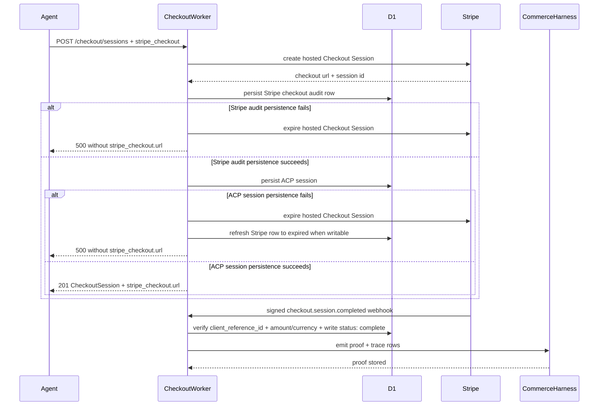
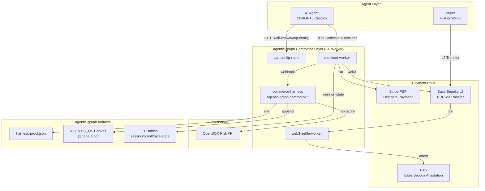

[Combined planning owner](agentic-graph-agentic-commerce-prd-tad-adr-mvp-gtm.md) · `PLAN-AGENTIC-GRAPH-AGENTIC-COMMERCE-PRD-TAD-ADR-MVP-GTM@0.2.1`. This companion preserves the source section; diagrams and frontmatter projections remain owned by the combined artifact.

### Workflow Specifications

#### Workflow: Fiat Checkout Session Lifecycle

**Trigger**: AI agent calls `POST /checkout/sessions` with a valid ACP payload.
**Actors**: AI Agent, `checkout-worker`, Stripe PSP, `commerce-harness`.

**Happy Path**:
1. Agent sends `POST /checkout/sessions` with items, buyer info, and optional `stripe_checkout { success_url, cancel_url, workspace_id }` → Worker validates schema and hosted Checkout return URLs against the server-owned return origin → derives the deterministic ACP session id and expected amount/currency.
2. If `stripe_checkout` is present, Worker creates a hosted Stripe Checkout Session with the ACP session id in `client_reference_id`, Stripe `Idempotency-Key`, expected amount/currency metadata, and `metadata[acp_session_id]`, stores the ACP session plus Stripe row only when the Stripe total matches ACP, and returns `CheckoutSession.stripe_checkout.url`.
3. Stripe webhook verifies the signature and paid/no-payment-required status, requires Stripe `metadata[acp_session_id]`, `client_reference_id`, amount, and currency to match the fiat ACP session, then D1 writes `status: "complete"` and proof/trace rows.
4. If the buyer or agent returns before webhook delivery, `GET /api/payments/stripe/checkout/session?session_id=...` first requires a locally-owned Stripe checkout row, then retrieves the Checkout Session server-side, persists the live Stripe state, returns only minimal payment state to public callers, and runs the same ACP settlement guard for `paid` or `no_payment_required` sessions.
5. If hosted Checkout is not requested and the ACP session is not terminal, the existing explicit `POST /checkout/sessions/:id/complete` delegate-token path remains available for compatible ACP clients.

**Alternate Paths**:
- Agent calls `POST /checkout/sessions/:id/cancel` before complete → D1 writes `status: "cancelled"` and preserves any existing hosted Checkout reference for audit reads.

**Error Paths**:
- Stripe Checkout price authority missing on the payment Worker → create request fails closed before Stripe is called
- Hosted Checkout `success_url` or `cancel_url` is owned only by the caller `Origin` header rather than the Checkout route origin or `STRIPE_CHECKOUT_RETURN_ORIGIN` → create request fails closed before Stripe is called or the ACP session is written
- Hosted Checkout inline price tuple differs from ACP amount/currency → create request fails closed before Stripe is called or the ACP session is written
- Hosted Checkout Price ID returns a Stripe `amount_total`/`currency` that differs from ACP amount/currency → Worker expires the new Stripe Session and fails closed before writing ACP or Stripe audit rows
- Stripe checkout audit persistence fails after hosted Stripe Checkout creation → Worker expires the new Stripe Session, returns 500, and exposes no Checkout URL
- ACP session persistence fails after hosted Stripe Checkout creation → Worker expires the new Stripe Session, refreshes the Stripe audit row to `expired` when possible, returns 500, and writes no ACP session or proof rows
- Stripe webhook `metadata[acp_session_id]`, `client_reference_id`, amount, or currency does not match the fiat ACP session → webhook is acknowledged but ACP settlement is skipped
- Stripe sends `checkout.session.expired` or the status route retrieves `status=expired` for the matching fiat ACP session → D1 writes `status: "cancelled"`, refreshes `session.stripe_checkout`, and writes no proof
- Stripe sends `checkout.session.async_payment_failed` for the matching fiat ACP session → D1 writes `status: "payment_failed"`, refreshes `session.stripe_checkout`, and writes no proof
- Stripe later sends `checkout.session.completed` for a `cancelled` or `payment_failed` ACP session → Stripe row is stored for audit, ACP terminal state remains unchanged, and no proof is written
- Stripe status refresh returns `status=complete` with `payment_status=unpaid` → status is stored for audit, but no ACP proof or unlock is emitted
- Agent calls `POST /checkout/sessions/:id/complete` with a delegate token on a hosted, cancelled, or payment-failed fiat ACP session → 409 returned; no delegate payment or proof write occurs
- Delegate-token charge fails (declined) → session `status: "payment_failed"` → agent receives 422 with error code
- Idempotency key conflict → 409 returned; existing session returned unchanged
- OpenBOX API timeout → `commerce-harness` degrades; proof emitted without risk block; warning logged

**Postconditions**: Session in terminal state (`complete`, `cancelled`, `payment_failed`); `harness-proof.json` updated; canvas `@node:proof` appended on success.

#### Workflow: Web3 Checkout + EAS Attestation

**Trigger**: AI agent calls `POST /checkout/sessions` with `x-web3.payment_method: "erc20"`.
**Actors**: AI Agent, `checkout-worker`, `web3-settle-worker`, EAS, `commerce-harness`.

**Happy Path**:
1. Agent sends session with `x-web3` fields → Worker generates deterministic L2 deposit address → D1 writes `status: "pending_onchain"` → returns session with `deposit_address`
2. Web3 buyer sends L2 transfer to deposit address
3. `web3-settle-worker` polls Base RPC → detects confirmed transfer → calls EAS → attestation UID returned
4. Worker calls `commerce-harness` webhook → proof + `@node:proof` emitted

**Error Paths**:
- L2 transfer not confirmed within 5 min → session expires → buyer notified via agent; refund path manual (hackathon scope: log + alert)
- EAS call fails → settle without attestation; log warning; proof emitted without UID

**Postconditions**: Session `status: "complete"`; EAS attestation UID in `harness-proof.json`; `@node:proof` in canvas.

---

### Data Flows

#### Data Flow: ACP Checkout Session State

| Stage | Component | Input Format | Output Format | Persistence | Error Handling |
|---|---|---|---|---|---|
| Ingest | `checkout-worker` | ACP `CreateSessionRequest` JSON | Validated `CheckoutSession` | D1: `agentic_commerce_sessions` | 400 on schema fail; 422 on semantic fail |
| Transform | `checkout-worker` | `CheckoutSession` + optional `stripe_checkout` request | Hosted Stripe Checkout Session | D1: `stripe_checkout_sessions` | Fail-fast before Stripe when price authority, return-origin policy, or inline ACP total is invalid; use ACP id as Stripe idempotency; expire mismatched Price-ID-backed Sessions before persistence; expire hosted Sessions if Stripe audit or ACP persistence fails after Stripe creation |
| Store | Cloudflare D1 | `CheckoutSession` JSON | `CheckoutSession` JSON | D1 row with proof/trace joins | D1 write error → 500; no silent fallback |
| Serve | `checkout-worker` | `session_id` | `CheckoutSession` JSON | D1 read | Missing row → 404 |

#### Data Flow: Commerce Proof Emission

| Stage | Component | Input Format | Output Format | Persistence | Error Handling |
|---|---|---|---|---|---|
| Ingest | `commerce-harness` | `CheckoutSession` JSON | Typed harness input | None | Schema rejection → degrade |
| Transform | `commerce-harness` | Harness input + OpenBOX response | `CommerceProof` | None | OpenBOX timeout → emit without risk block |
| Store | `harness-proof.json` writer | `CommerceProof` | Appended JSON entry | Git SSOT (append) | File write fail → log + alert |
| Serve | AGENTIC_OS Canvas writer | `CommerceProof` | `@node:proof` YAML block | Canvas file | Canvas write fail → log + continue |

---

### Quality Attributes

| Attribute | Scenario | Pattern | Validation |
|---|---|---|---|
| Performance | 50 sessions/day → checkout create < 500 ms p95 | CF Worker edge compute; D1 indexed session lookup | Load test with `wrangler dev` |
| Scalability | 10× traffic spike → no cold starts | CF Worker zero-cold-start; D1 free tier covers launch volume | CF Workers dashboard metrics |
| Security | Vault token must not be logged or persisted | Token passed through only; never written to D1 or proof | Code review + secret scanning |
| Observability | Every harness call emits cost log | `cost_log` field in every `commerce-harness` output | Log sampling test |
| Token Cost | < 500 tokens / checkout session at target load | Haiku model for governance call; prompt compression | Cost log p95 per sprint |
| TCO | 12-month infra cost = $0 | CF Worker + D1 free tier; Base Sepolia free RPC; EAS ~$0.01/tx | Monthly cost audit |

---

### Deployment Strategy

**Target**: Cloudflare Worker (single `wrangler.toml`; all routes in one Worker).

**Strategy**: Direct deploy via `wrangler deploy` (no staging environment required at solo-dev scale). Rollback: `wrangler rollback` to previous deployment.

**Environment variables**: `STRIPE_SECRET_KEY`, `OPENBOX_API_KEY`, `ATTESTER_PRIVATE_KEY` stored as Cloudflare Worker secrets (never in `wrangler.toml`).

**Migration path**: If session/proof/trace volume exceeds D1 free tier, shard by seller or move hot trace artifacts to R2 while preserving the shared route and semantic-key helpers.

---

### Architecture Diagram: Component Topology

### Component Inventory

| Layer | Component | File / Module | Status |
|---|---|---|---|
| Config | ACP config route | `cloudflare/workers/agentic-graph-payment/agenticCommerce.ts` | Implemented |
| Checkout | Checkout Worker | `cloudflare/workers/agentic-graph-payment/agenticCommerce.ts` | Implemented |
| Web3 | Web3 settlement path | `cloudflare/workers/agentic-graph-payment/agenticCommerce.ts`, `agenticCommerceIntegrations.ts`, `agenticCommerceSolanaPay.ts` | Implemented as Base RPC confirmation + EAS attest route plus Solana Pay transfer-reference validation |
| Harness | Commerce Harness persistence | `cloudflare/workers/agentic-graph-payment/agenticCommerceSettlement.ts`, `agenticCommercePersistence.ts` | Implemented |
| Schema | ACP/session/Web3/proof shared SSOT + semantic keys | `grph-shared/src/payments/agenticCommerceSsot.ts`, `grph-shared/src/payments/agenticCommerceSolanaPaySsot.ts`, `grph-shared/src/hash/signature.ts` | Implemented |
| Data | D1 session/proof/trace tables | `cloudflare/d1/migrations/0003_agentic_commerce.sql` | Implemented |
| Test | ACP config, hosted Stripe Checkout handoff, checkout lifecycle, Web3 settle, Solana Pay settle, Stripe webhook/status-refresh settle guards, webhook idempotency/retry, OpenBOX proof/ingest, artifact routes, shared semantic-key helper | `canvas/src/__tests__/agenticCommerceWorker.test.ts`, `canvas/src/__tests__/agentic-graph-payment-worker.test.ts` | Implemented; includes `worker.payments.agenticCommerce.hostedStripeCheckoutHandoff`, `worker.payments.agenticCommerce.solanaPayCheckout`, `worker.payments.agenticCommerce.solanaPaySettleRoute`, `worker.payments.agenticCommerce.solanaPayRejectsGenericWebhook`, `worker.payments.agenticCommerce.hostedStripeCheckoutRejectsDelegateComplete`, `worker.payments.agenticCommerce.terminalFiatRejectsDelegateComplete`, `worker.payments.agenticCommerce.stripePaidWebhookSkipsCancelled`, `worker.payments.agenticCommerce.stripeWebhookDuplicateSkipsSettlement`, `worker.payments.stripe.webhook.duplicatePayloadConflict`, `worker.payments.stripe.webhook.retriesFailedProcessing`, `worker.payments.stripe.webhook.reclaimsStaleProcessingClaim`, `worker.payments.agenticCommerce.stripeStatusRefreshSettle`, `worker.payments.agenticCommerce.stripeExpiredStatusRefreshCancel`, `worker.payments.agenticCommerce.stripeExpiredWebhookCancel`, `worker.payments.agenticCommerce.stripeAsyncPaymentFailed`, `worker.payments.agenticCommerce.stripeWebhookRejectsAmountMismatch`, and `worker.payments.agenticCommerce.sharedSemanticKey` |
| Config | Wrangler config | `cloudflare/workers/agentic-graph-payment/wrangler.toml` | Implemented |
| Operator UI | MainPanel Commerce | `docs/documents/agentic-graph-mainpanel-commerce-prd-tad-adr-mvp-gtm.md` | Implemented as canonical Commerce operator UI |

**Implementation note (2026-05-29; updated 2026-06-04)**: The existing repo already owned payment APIs in `cloudflare/workers/agentic-graph-payment`, so ACP reuses that Worker and its D1 binding instead of adding a parallel route tree or second state worker. The Web3 path accepts `x-web3` sessions, returns a deterministic deposit address, confirms matching Base RPC transfers, calls an EAS attestation endpoint, and emits `@node:proof` payloads with `tx_hash` and `attestation_uid`; credential material stays in Cloudflare secrets and outside the repo. Solana Pay extends the same Worker/D1 owner: `payment_rail: "solana_pay"` returns a generated `solana:` transfer URL/reference and settlement validates Solana RPC `getTransaction` output before `agentic-graph.commerce.settle`; the generic Commerce webhook cannot settle Solana Pay sessions.

---

## PRD ↔ TAD Traceability

| PRD Story | Acceptance Criterion | TAD Component | Interface | `/goal` Condition |
|---|---|---|---|---|
| AC-E1-S1 | AC-E1-S1-AC1 | `acp-config-route` | `GET /.well-known/acp-config` | `worker.payments.agenticCommerce.acpConfig` passes |
| AC-E1-S2 | AC-E1-S2-AC1 | `checkout-worker` | `POST /checkout/sessions` | `worker.payments.agenticCommerce.checkoutLifecycle` and `worker.payments.agenticCommerce.hostedStripeCheckoutHandoff` pass |
| AC-E1-S3 | AC-E1-S3-AC1 | `commerce-harness` | Stripe webhook/status refresh → ACP settlement | `worker.payments.agenticCommerce.stripeWebhookSettle`, `worker.payments.agenticCommerce.stripeWebhookDuplicateSkipsSettlement`, `worker.payments.stripe.webhook.duplicatePayloadConflict`, `worker.payments.stripe.webhook.retriesFailedProcessing`, `worker.payments.stripe.webhook.reclaimsStaleProcessingClaim`, `worker.payments.agenticCommerce.stripeStatusRefreshSettle`, `worker.payments.agenticCommerce.hostedStripeCheckoutRejectsDelegateComplete`, `worker.payments.agenticCommerce.terminalFiatRejectsDelegateComplete`, `worker.payments.agenticCommerce.stripePaidWebhookSkipsCancelled`, `worker.payments.agenticCommerce.stripeExpiredStatusRefreshCancel`, `worker.payments.agenticCommerce.stripeExpiredWebhookCancel`, `worker.payments.agenticCommerce.stripeAsyncPaymentFailed`, and `worker.payments.agenticCommerce.stripeWebhookRejectsAmountMismatch` pass; proof writes occur only after verified matching first-time payment |
| AC-E2-S1 | AC-E2-S1-AC1 | `checkout-worker` | `POST /checkout/sessions` (x-web3) | `worker.payments.agenticCommerce.web3Checkout` passes |
| AC-E2-S2 | AC-E2-S2-AC1 | `web3-settle-worker` + `commerce-harness` | EAS + canvas writer | `worker.payments.agenticCommerce.web3SettleRoute` passes; @node:proof payload emitted |
| AC-E2-S3 | AC-E2-S3-AC1 | `solana-pay-settle-worker` + `commerce-harness` | Solana RPC + canvas writer | `worker.payments.agenticCommerce.solanaPayCheckout`, `worker.payments.agenticCommerce.solanaPaySettleRoute`, and `worker.payments.agenticCommerce.solanaPayRejectsGenericWebhook` pass; @node:proof payload emits the verified signature |
| AC-E3-S1 | AC-E3-S1-AC1 | `commerce-harness` | OpenBOX API | `worker.payments.agenticCommerce.openboxIngest` passes |

---

## Open Questions Register

| ID | Question | Owner | Target Resolution |
|---|---|---|---|
| OQ-1 | Stripe test mode vs live mode for hackathon demo? | airvio | Sprint 0 |
| OQ-2 | Advertise `x-web3` in ACP config from day 0 or post-AC-E2? | airvio | Sprint 1 |
| OQ-3 | DeBox DID self-asserted or on-chain validated for MVP? | airvio | Sprint 3 |
| OQ-4 | Acceptable L2 confirmation block count for demo (1 block ≈ 2 s)? | airvio | Sprint 3 |
| OQ-5 | OpenBOX API rate limits on free tier — sufficient for 50 sessions/month? | airvio | Sprint 2 |

## Planning revision — reference implementation

All five roles below consume `PLAN-AGENTIC-GRAPH-AGENTIC-COMMERCE-PRD-TAD-ADR-MVP-GTM@0.2.1`. Existing source and runtime observations retain their original revisions and scope; this documentation update renews no deployment or demand evidence. The guideline is [v2.7.0](https://github.com/huijoohwee/huijoohwee.github.io/blob/e8d2a10a8d3e5735c43edf350a22523df05fdf91/guidelines/prd-tad-adr-mvp-gtm-guidelines.md); the shared maturity rubric loads on demand.

| Role | Owning content at this revision |
|---|---|
| PRD | [Part 1 — PRD](agentic-graph-agentic-commerce-prd-tad-adr-mvp-gtm.part-01.md#part-1--prd) |
| TAD | [Part 2 — TAD](agentic-graph-agentic-commerce-prd-tad-adr-mvp-gtm.part-01.md#part-2--tad) |
| ADR | [Architectural Decisions](agentic-graph-agentic-commerce-prd-tad-adr-mvp-gtm.part-01.md#architectural-decisions) |
| MVP | [MVP — reference implementation](agentic-graph-agentic-commerce-prd-tad-adr-mvp-gtm.part-02.md#mvp--reference-implementation) |
| GTM | [GTM — reference implementation](agentic-graph-agentic-commerce-prd-tad-adr-mvp-gtm.part-02.md#gtm--reference-implementation) |

## MVP — reference implementation

Reuse the minimum scope, acceptance conditions and component owners identified above. The demonstration must follow the documented entry, permitted action, durable outcome and readback, including its stated failure/recovery path. Use `npm run payment:stripe:configure` for its actual coverage and the named feature checks in the specification; attach exact source, command, result and authoring/mirror/delivery surface to each VCC before advancing readiness. A source locator or structural check alone proves no user outcome.

Record the observed steps and elapsed time against the existing TTV target. If no target or invocation is stated, the demonstration remains unverified until the document owner supplies it. All four experience criteria are **unassessed** in this authoring review: Core Requirements & Functionality, Innovation & Theme Alignment, Technical Execution & Integration, and Usefulness & Agentic Experience. No scored user observation is attached to this revision; the document owner must capture a timed pilot and criterion-specific evidence.

## GTM — reference implementation

Use the stated persona and pain hypothesis to test one priced pilot in the existing user environment. Keep the documented free/self-serve workflow as the comparison; additional hosting, channels or agent roles require an evidenced constraint or buyer need. Record the buyer’s workaround, frequency, accepted outcome, offered price, observed response and support minutes before ranking a commercial winner. Demand, collected payment and repeat use remain unvalidated by this documentation review; mechanism evidence keeps its narrower original scope. Measure tokens, cash expense and maintenance separately for each proposed deployment model. Feed actual pilot outcomes into a successor Context using the shared four-column planning record.

## Planning gaps — reference implementation

Source review is bounded to repository `7fb85741121d8c2886027e4a630d013ba91c1027`. Confirmed: these referenced artifacts exist at that revision: [`cloudflare/workers/agentic-graph-payment/agenticCommerce.ts`](https://github.com/huijoohwee/agentic-graph/blob/7fb85741121d8c2886027e4a630d013ba91c1027/cloudflare/workers/agentic-graph-payment/agenticCommerce.ts), [`cloudflare/workers/agentic-graph-payment/agenticCommerceSettlement.ts`](https://github.com/huijoohwee/agentic-graph/blob/7fb85741121d8c2886027e4a630d013ba91c1027/cloudflare/workers/agentic-graph-payment/agenticCommerceSettlement.ts), [`grph-shared/src/payments/agenticCommerceSsot.ts`](https://github.com/huijoohwee/agentic-graph/blob/7fb85741121d8c2886027e4a630d013ba91c1027/grph-shared/src/payments/agenticCommerceSsot.ts). Their existence does not confirm every behavior asserted by the specification.
Experience observations, current VCC execution and buyer/payment evidence are unverified here. This is a bounded planning update, not a full-guideline conformance verdict; historical conformance percentages above apply only to their recorded profile and revision.
