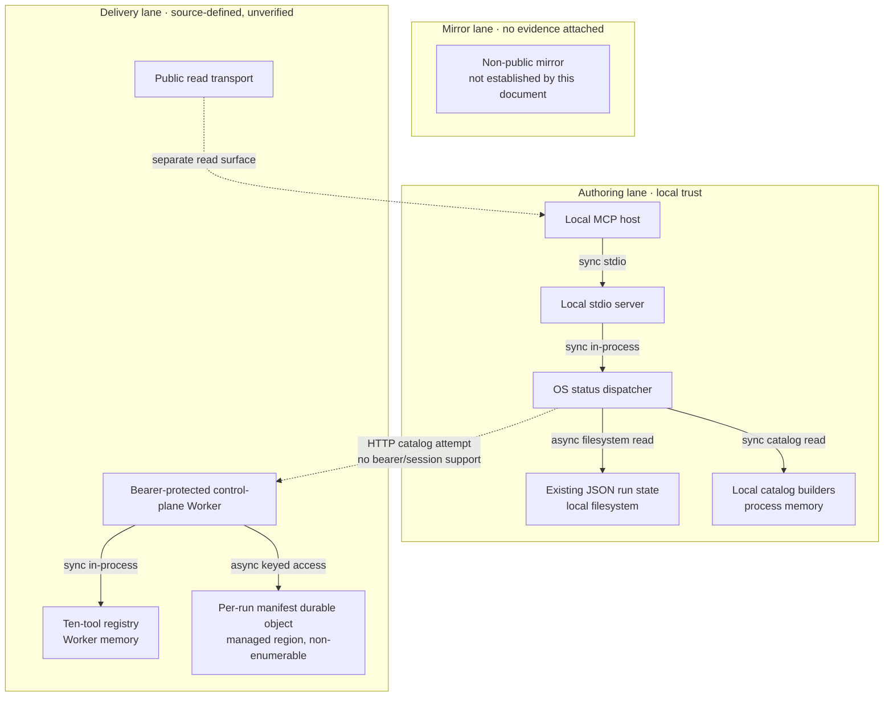

# agentic-graph Agentic OS — Reference implementation PRD/TAD

This document is the canonical product and technical owner for the Agentic OS
status surface in this repository. Every concrete product, provider, runtime,
file, and tool name below is a non-binding **reference implementation** of the
neutral OS Status Surface pattern.

The source snapshot contains implementation code, but this document attaches no
recorded implementation-test result, mirror result, delivery check, or operator
promotion instruction. Consequently, the only readiness claims are the
frontmatter rungs: local `spec-complete` and delivered `undocumented`. Nothing in
this document asserts a deployed or live service.

## Document contract

### Purpose and authority

The Agentic OS is a read-only, zero-model projection over state and catalogs
already owned by other harnesses. It answers four operator questions without
becoming a scheduler, approval service, model gateway, or second datastore:

1. What local runs can be found?
2. What capabilities are catalogued?
3. What payment, cost, gate, and circuit-breaker facts are observable?
4. Which sources are unavailable or unreachable?

This document owns the status-tool identity and its product contract. The named
source modules own executable behavior. The follow-on document owns unresolved
work sequencing; the video companion owns only its target workflow contract.

### Readiness dimensions

| Dimension | Scope in this increment | Local rung | Delivered rung |
|---|---|---|---|
| Agentic OS | Seven local read views and honest five-view Worker behavior | `spec-complete` | `undocumented` |
| AI Agent discovery | Catalog shape and trust-boundary selection only | `spec-complete` | `undocumented` |
| Gateway federation | Existing read and control-plane transports; no new proxy | `spec-complete` | `undocumented` |

The local rung is derived from the VCCs in this document with no satisfying
Evidence Reference attached. The delivered rung is `undocumented` because no
delivery-surface VCC, result, or operator instruction is recorded here.

### Min-viable scope

- Keep one read-only status-tool identity.
- Preserve all seven values in the local shared schema and local dispatcher.
- Describe the Worker's five implemented view branches without claiming parity.
- Return explicit partial-failure fields instead of silently dropping sources.
- Keep every status read at zero prompt tokens, zero completion tokens, and zero
  model calls.
- Add no Agentic OS database, background synchronizer, proxy tier, or approval
  token issuer.

### Explicit exclusions

- Starting, stopping, approving, retrying, or advancing a harness run.
- Enumerating the Worker's per-run durable objects without a separate index.
- Automatic approval or approval-token issue, verify, or consume behavior.
- Remote parity with the richer local tool catalog.
- A dashboard, mobile application, push stream, or browser-only status runtime.
- A deployment, secret change, route promotion, or live-provider proof.

## PRD

### Problem statement

Local run state is split across three filesystem conventions, while capability
metadata is split across local builders and an optional remote catalog. A caller
otherwise has to know each source shape and may mistake an unavailable source
for an empty system. The reference implementation needs one read-only surface
that normalizes what it can see and reports what it cannot.

The source also contains a material contract mismatch: the shared input schema
advertises seven views, while the Worker dispatcher implements five. Two
payment-readiness views therefore validate at discovery time but return
`invalid_view` when invoked remotely. The document must expose that gap rather
than flatten local and remote behavior into a false parity claim.

### Personas and jobs to be done

| Persona | Job to be done | First value |
|---|---|---|
| Local operator | Inspect recent harness runs before taking another action | A normalized process list or an explicit unavailable-source record |
| Agent integrator | Discover callable capabilities and choose a trust-appropriate transport | A deduplicated catalog with contributing sources and unreachable catalogs |
| Maintainer | Reconcile shared schemas, dispatch branches, auth, and source ownership | A view matrix and VCC that make drift observable |

### User journeys

| Journey | Stage | Action | Touchpoint | Friction | Required outcome |
|---|---|---|---|---|---|
| Operator status | Trigger | Ask what is running | Local MCP host | Three filesystem layouts | One status call |
| Operator status | Discover | Select process view | Local stdio transport | Missing directories look empty | `unavailableSources[]` is explicit |
| Operator status | Engage | Inspect normalized entries | Status result | Source states use different vocabularies | Source-native state is preserved |
| Operator status | Complete | Choose the owning harness | Harness-specific surface | Status surface cannot mutate | No status read changes source state |
| Operator status | Return | Read again after an action | Local stdio transport | Cache staleness | Fresh filesystem aggregation |
| Agent discovery | Trigger | Request capability union | Local MCP host | Catalogs are split | Deduplicated tool identities |
| Agent discovery | Discover | Attempt optional remote catalog | Capability adapter | Protected remote transport needs auth/session setup | Remote catalog is named unreachable |
| Agent discovery | Complete | Select a callable owner | Returned catalog | Local and remote inventories differ | Source catalogs and trust boundary remain visible |

### Workflow

**Trigger**: a caller requests one status view.

**Happy path**:

1. The transport validates the shared input schema.
2. The dispatcher selects exactly one view implementation.
3. The view reads existing state or static contracts once.
4. The dispatcher returns typed content with the zero-cost log.

**Alternate path**: an optional source is missing or unreachable; the call still
succeeds and identifies the source in `unavailableSources[]`,
`unreachableCatalogs[]`, or `validationFailures[]`.

**Error path**: an unsupported view returns `invalid_view`; an unexpected local
registry failure returns `registry_failure`. Neither path retries.

**Postconditions**: no harness state, approval token, registry, or credential is
created or modified.

### Stories, Given-When-Then criteria, and VCC translations

| Story | Given | When | Then | VCC |
|---|---|---|---|---|
| PRD-AOS-01 — local visibility | Readable and unreadable local run fixtures exist | The process view is called | Readable entries are normalized and unreadable sources are named | VCC-AOS-01 |
| PRD-AOS-02 — local contract completeness | The shared seven-value view enum is loaded | Each view is dispatched locally | Every enum value resolves to a local branch and carries a zero-cost log | VCC-AOS-02 |
| PRD-AOS-03 — honest remote behavior | The Worker uses the shared seven-value schema but has five branches | Each advertised view is invoked against the Worker dispatcher | Five return their typed projections and two return `invalid_view` until parity is implemented | VCC-AOS-03 |
| PRD-AOS-04 — protected control plane | The control-plane bearer secret is configured | A caller sends a missing, invalid, or valid bearer value | The protected MCP transport rejects missing/invalid credentials and accepts only the matching bearer | VCC-AOS-04 |
| PRD-AOS-05 — capability federation | The optional remote catalog points at the protected control plane | The local union adapter attempts discovery | Lack of bearer/session support is surfaced as an unreachable catalog, not as a complete union | VCC-AOS-05 |
| PRD-AOS-06 — spend isolation | Provider credentials may exist in the Worker environment | Any status view is called | The status path performs no model call, reads no provider credential, and reports an all-zero cost log | VCC-AOS-06 |
| PRD-AOS-07 — catalog integrity | The current Worker registry is built | Definitions are enumerated | Exactly ten unique definitions are returned, including the status owner | VCC-AOS-07 |

### Success metrics and time to value

| Metric | Source baseline | Target | Validation timing |
|---|---:|---:|---|
| Local view branches | 7 of 7 | 7 of 7 | Before any local rung promotion |
| Worker view branches | 5 of 7 | 7 of 7 | Follow-on; parity is not claimed here |
| Worker tool definitions | 10 | 10 unique | Before registry changes merge |
| Remote union adapter bearer/session support | 0 compatible path | 1 compatible initialized path | Follow-on |
| Status model calls per request | 0 | 0 | Every check |
| Status prompt/completion tokens per request | 0 / 0 | 0 / 0 | Every check |
| Local TTV steps | Not recorded | At most 2: start host, call view | Clean-environment VCC |
| Local TTV elapsed | Not recorded | At most 1 minute | Clean-environment VCC |
| Incremental monthly direct cost at demo load | Planning assumption: $0 | $0 | Monthly cost review |

Browser reach is host-dependent; the status tool has no browser UI. Mobile reach
is also host-dependent and has no dedicated client. Offline behavior is
available only through local stdio for filesystem/static views; the optional
remote catalog is reported unreachable. No delivery reach is claimed.

### MoSCoW and ROI

Planning formula:
`ROI = (user impact × monthly sessions) / (build hours + monthly TCO + token cost)`.
Session counts and hours below are planning assumptions, not observed usage.

| Tier | Feature | Assumptions | ROI score | Rationale |
|---|---|---|---:|---|
| Must | Seven-view local status contract | impact 5, sessions 20, hours 6, TCO 0, token 0 | 16.7 | Smallest unified local read surface |
| Must | Remote truth matrix and partial failures | impact 5, sessions 20, hours 3, TCO 0, token 0 | 33.3 | Prevents false parity and silent omission |
| Must | Zero-model read boundary | impact 5, sessions 20, hours 2, TCO 0, token 0 | 50.0 | Prevents observability spend |
| Should | Authenticated, session-compatible remote catalog adapter | impact 4, sessions 20, hours 8, TCO 0, token 0 | 10.0 | Closes the current federation gap |
| Could | Durable-object enumeration index | impact 2, sessions 10, hours 20, TCO 1, token 0 | 1.0 | Below the working threshold of 10; adds a second index |
| Won't | New monolithic proxy or automatic approval | Not scored | — | Duplicates owners or violates the read boundary |

## TAD

### Reference implementation view matrix

The shared input schema and local dispatcher define seven views. The Worker
reuses that schema but currently implements only five.

| View | Local behavior | Worker behavior | Partial-failure contract |
|---|---|---|---|
| `process_list` | Scans three local run directories | Returns no entries and names local/DO sources unavailable | `unavailableSources[]` |
| `capabilities` | Unions local catalog builders and an optional remote catalog | Projects the Worker's current definitions | `unreachableCatalogs[]` |
| `rail_readiness` | Builds a deterministic payment-rail snapshot | Returns `invalid_view` | Structured tool error |
| `agentic_purchase_readiness` | Builds deterministic local checks and returns all delivery-claim flags as false | Returns `invalid_view` | Structured tool error |
| `cost_summary` | Aggregates existing cost/credit records | Returns empty totals plus unavailable-source gaps | `validationFailures[]`, `costEmissionGaps[]` |
| `gate_catalog` | Reads static gate ids and local pending state | Returns static gate ids; local state unavailable | `unavailableSources[]` |
| `circuit_breakers` | Reads configured bounds and local counters | Returns static bounds; counters unavailable | `unavailableSources[]` |

### Reference implementation process registry

| Harness source | Local convention | Local behavior | Worker limitation |
|---|---|---|---|
| Video Remix | `data/video-remix-runs/<id>/run-manifest.json`, then `manifest.json` | Filesystem enumeration and first readable manifest | Per-run durable objects are readable by id but not enumerable without an index |
| Showrunner | `showrunner/runs/<id>/state.json` | Filesystem enumeration | Local filesystem unavailable |
| SuperAgent | `data/superagent-runs/<id>/state.json` | Filesystem enumeration | Local filesystem unavailable |

The local registry caps the normalized result at 200 entries. It does not read
an in-memory or remote durable-object index.

The Pages read transport remains a separate remote MCP surface. The Worker is
the sole remote orchestration/control-plane gateway, not the sole remote MCP
gateway.

### Reference implementation topology

**Version**: 3.0.0 — 2026-07-30.
**Version note**: replaces the stale parity/keyless topology with the actual
seven-local/five-Worker split, bearer boundary, and non-enumerable run store.

| Node | Role | Type | Lane | Connects to | Connection type | Data residency |
|---|---|---|---|---|---|---|
| Local MCP host | Caller | Process | Authoring | Local stdio server | Sync stdio | Local machine |
| Local stdio server | Router | Node process | Authoring | Status dispatcher | Sync in-process | Local process memory |
| Status dispatcher | Read aggregator | Module | Authoring | Filesystem sources, catalog builders | Async filesystem / sync module calls | Local process memory |
| Filesystem run sources | Store | JSON files | Authoring | Status dispatcher | Async filesystem read | Local filesystem |
| Local catalog builders | Catalog | Modules | Authoring | Status dispatcher | Sync in-process | Local process memory |
| Public read transport | Read gateway | Pages function | Delivery | Read-only content owners | Sync HTTPS | Managed edge; delivery unverified here |
| Control-plane Worker | Protected gateway | Worker | Delivery | Worker registry, per-run durable objects | Streamable HTTP / in-process | Managed edge; delivery unverified here |
| Worker registry | Catalog | Module | Delivery | Ten tool definitions | Sync in-process | Worker memory |
| Per-run manifest store | Store | Durable object | Delivery | Control-plane Worker | Keyed async read/write | Managed region; no collection enumeration |

### Journey-to-system mapping

| Journey stage | Workflow | Data flow | Harness flow | Topology nodes | TAD interface |
|---|---|---|---|---|---|
| Operator discover | Process read | Files → normalize → response | Zero-model sequential read | Status dispatcher, filesystem sources | TAD-AOS-LOCAL-READ |
| Agent discover | Capability read | Builders → merge → response | Zero-model sequential read | Catalog builders, optional Worker | TAD-AOS-CATALOG-UNION |
| Maintainer reconcile | View parity audit | Shared enum → two dispatchers → diff | Deterministic comparison | Local and Worker modules | TAD-AOS-VIEW-PARITY |
| Remote caller authenticate | Protected request | Bearer header → authorization → MCP serve | Zero-model authorization gate | Control-plane Worker | TAD-AOS-REMOTE-AUTH |

### Data flow

| Stage | Input | Transform | Output | Persistence | Error handling |
|---|---|---|---|---|---|
| Validate | `{ view, cloudflareMcpUrl? }` | Shared JSON schema | Validated arguments | None | Schema/unknown view error |
| Select | Validated view | One dispatcher branch | View call | None | `invalid_view` |
| Read local | Existing JSON/modules | Parse and normalize | Typed view payload | Existing source files remain authoritative | Source named unavailable |
| Read remote catalog | Optional URL | Bare `tools/list` HTTP request in current adapter | Catalog or unreachable marker | None | Catalog named unreachable |
| Serve | View payload | Add zero-cost log | Structured content/text | None | Local unexpected failure becomes `registry_failure` |

### Orchestration and harness contract

This surface is not AI-powered. It still uses the harness shape so its
non-use of a model is testable.

**Topology pattern**: sequential.
**Maximum iterations**: 1.
**Circuit-breaker**: return after the first success, partial result, or typed
error; no retry loop.
**Token budget**: 0 prompt + 0 completion, cache hits 0, estimated cost USD 0.

| Role | Component | Input schema | Output schema | Cost log | Fallback |
|---|---|---|---|---|---|
| Dispatcher | Local server or Worker registry | Shared seven-value enum | Routed view arguments | None | Typed invalid-view result |
| Executor | Local or Worker status dispatcher | View arguments | View-specific structured content | All-zero inline log | Typed registry failure |
| Observer | Calling host | Structured content and partial-failure fields | Operator-visible result | No external sink required | Treat missing fields as contract failure |
| Consumer | Operator or agent | Typed result | Display or next owner selection | None | Upstream error propagation |

### Reference implementation security and trust boundaries

- Local stdio has no transport authentication. It trusts the local process,
  filesystem permissions, and operator boundary.
- The control-plane MCP path authorizes before the MCP agent serves a request.
  An absent configured bearer secret produces HTTP 503; a missing or mismatched
  bearer produces HTTP 401.
- Public health and tool-list inspection endpoints are handled before that
  protected MCP branch. They expose definitions, not a status-tool invocation.
- The Worker may hold model, search, media, and payment provider credentials
  when an operator configures live clients. It is therefore not keyless.
- The status dispatcher itself does not call a model, read provider
  credentials, issue approval tokens, or invoke spend-bearing tools.
- The local remote-catalog adapter currently sends neither bearer
  authorization nor MCP initialization/session state. It cannot directly
  federate the protected Worker; mocks or an unauthenticated forwarder are not
  proof of the production-shaped path.

### Component inventory

| Component | Responsibility | Source | Local rung | Delivered rung |
|---|---|---|---|---|
| Shared status contract | Own seven-view input and output schemas | `mcp/os-status-contract.js` | `spec-complete` | `undocumented` |
| Local dispatcher | Implement seven local read branches | `mcp/os-status-runtime.js` | `spec-complete` | `undocumented` |
| Local tool catalog | Advertise the status identity among 79 current local definitions | `mcp/local-tool-contract.js` | `spec-complete` | `undocumented` |
| Worker status dispatcher | Implement five projections and two invalid-view paths | `cloudflare/workers/agentic-graph-mcp/os-status-tool.mjs` | `spec-complete` | `undocumented` |
| Worker registry | Build ten definitions | `cloudflare/workers/agentic-graph-mcp/tool-registry.mjs` | `spec-complete` | `undocumented` |
| Worker authorization | Enforce the static bearer boundary | `cloudflare/workers/agentic-graph-mcp/agent-runtime-http.ts` | `spec-complete` | `undocumented` |
| Worker entrypoint | Order public inspection and protected MCP handling | `cloudflare/workers/agentic-graph-mcp/index.ts` | `spec-complete` | `undocumented` |

## Reference implementation: Worker capability catalog

This is a non-authoritative projection of the ten source-registry tool
identities. Endpoint invocation, trust, token, and route authority remains
solely in [the MCP install contract](agentic-graph-mcp-install-contract.md). The
functional owners below remain unchanged; this document owns only the Agentic
OS status schema and readiness record.

| Tool identity | Kind | Functional owner | Typed arguments | Trust boundary | Token cost |
|---|---|---|---|---|---|
| `agentic-graph.superagent.run` | Tool identity | Agent runtime | Source-owned agent-run schema | Protected control plane | Harness-dependent |
| `agentic-graph.video_remix.run` | Tool identity | Video Remix Director | Source-owned run schema | Protected control plane | Harness-dependent |
| `agentic-graph.video_remix.research` | Tool identity | Video Remix stage runtime | Source-owned research schema | Protected control plane and approval gate | Harness-dependent |
| `agentic-graph.video_remix.storyboard` | Tool identity | Video Remix stage runtime | Source-owned storyboard schema | Protected control plane and approval gate | Harness-dependent |
| `agentic-graph.video_remix.render` | Tool identity | Video Remix stage runtime | Source-owned render schema | Protected control plane and approval gate | Harness-dependent |
| `agentic-graph.video_remix.publish` | Tool identity | Video Remix stage runtime | Source-owned publish schema | Protected control plane and approval gate | Harness-dependent |
| `agentic-graph.video_remix.checkout` | Tool identity | Video Remix stage runtime | Source-owned checkout schema | Protected control plane and approval gate | Harness-dependent |
| `agentic-graph.run_manifest.note.update` | Tool identity | Run-manifest note runtime | Source-owned note schema | Protected control plane | 0 model tokens |
| `agentic-graph.os.status` | Tool identity | Agentic OS reference implementation | `{ view: enum(7), cloudflareMcpUrl?: string }` | Local stdio trust or protected control plane | 0 |
| `agentic-graph.agentic_canvas_os.docs.invoke` | Tool identity | Agentic Canvas OS docs resolver | Source-owned docs-resolution schema | Protected control plane | 0 model tokens |

The status identity is present in both local and Worker catalogs. This document
does not transfer ownership of the other nine identities from their named
functional owners.

## Lane topology and deploy boundaries

| Lane | Function | Mutation rights | Data residency | Readiness ceiling in this document |
|---|---|---|---|---|
| Authoring | Edit source and run local checks | Source and local fixtures only | Local worktree and local filesystem | `spec-complete` |
| Mirror | Hold an approved non-public copy | Publish-only from an approved authoring state | No mirror is evidenced here | `undocumented` |
| Delivery | Serve public/read or protected/control-plane surfaces | Publish-only from an approved mirror | No delivered instance is evidenced here | `undocumented` |

| Boundary | From | To | Evidence Reference | Operator instruction | Rollback statement | State |
|---|---|---|---|---|---|---|
| AOS-AUTHORING-MIRROR | Authoring | Mirror | None attached | None | Keep the authoring state; no mirror mutation has occurred | `closed` |
| AOS-MIRROR-DELIVERY | Mirror | Delivery | None attached | None | Restore the prior delivered version and re-run its recorded check; no such promotion is authorized here | `closed` |

## Architecture decisions and economics

### Decisions

| Decision | Choice | Rejected alternative | Rationale |
|---|---|---|---|
| AOS-ADR-01 | One tool with a typed seven-value view enum | Seven separately wired tools | One identity and one owner; less catalog drift |
| AOS-ADR-02 | Read-time aggregation over existing sources | New FOSS file/database index | Avoids a second source of truth and sync job |
| AOS-ADR-03 | Discovery-first use of existing transports | New unified proxy | Keeps read and spend-bearing trust boundaries separate |
| AOS-ADR-04 | Static bearer at the current control plane | Claim JWT/session minting that does not exist | Matches source; session-capable federation remains a gap |

### Twelve-month TCO comparison

These are explicit planning assumptions at demo load, not billing evidence.
Operator labor is stated separately and is not hidden inside direct cost.

| Deployment model | 12-month direct-cost assumption | Ops burden | Token cost for status reads | Decision |
|---|---:|---|---:|---|
| Existing local in-process FOSS path | $0 incremental | Manual local updates and filesystem permissions | $0 | Selected for local |
| Existing managed/serverless control plane | $0 incremental target within existing allocation; measure before promotion | Provider operates runtime; operator owns secrets and releases | $0 | Source-defined, delivery unverified |
| New provisioned/self-managed gateway | At least $60 at a $5/month floor | Manual patching, backup, failover, capacity | $0 | Rejected |
| Hybrid/consolidated self-managed host | $0 incremental only if an existing host has spare capacity; otherwise at least $60 | Shared manual operations | $0 | Rejected |

The best FOSS alternative is the selected local in-process path. A new
self-managed proxy provides no additional user value for this read surface and
has higher operations cost. The Worker's base request/storage cost is outside
the status tool's incremental token budget and must be measured before any
delivery promotion.

## Readiness gaps and verification

### Readiness gap matrix

| Workstream | Local rung | Delivered rung | Gap | Exit VCC |
|---|---|---|---|---|
| Seven-view local dispatcher | `spec-complete` | `undocumented` | No recorded local result | VCC-AOS-02 |
| Worker view parity | `spec-complete` | `undocumented` | Two advertised views return `invalid_view` | VCC-AOS-03 |
| Process visibility | `spec-complete` | `undocumented` | Worker cannot enumerate per-run objects | VCC-AOS-01 |
| Capability federation | `spec-complete` | `undocumented` | Local adapter lacks bearer and session initialization | VCC-AOS-05 |
| Remote authorization | `spec-complete` | `undocumented` | No delivery-surface result attached | VCC-AOS-04 |
| Zero-model status path | `spec-complete` | `undocumented` | No recorded result attached | VCC-AOS-06 |
| Ten-definition Worker catalog | `spec-complete` | `undocumented` | No recorded result attached | VCC-AOS-07 |

### VCCs and candidate check hosts

| VCC | Evaluator-checkable end state | Candidate check host | Constraint |
|---|---|---|---|
| VCC-AOS-01 | Every readable local run fixture appears once; every unreadable source is named | `node --test mcp/__tests__/os-status-runtime.test.mjs` | Source fixtures are not modified |
| VCC-AOS-02 | All seven shared enum values resolve locally and return an all-zero cost log | `node --test mcp/__tests__/os-status-runtime.test.mjs mcp/__tests__/payment-os-status.test.mjs mcp/__pbt__/os-status.pbt.test.mjs` | No model client is invoked |
| VCC-AOS-03 | A parity check reports exactly seven local branches and five Worker branches until the two missing branches are implemented | Deterministic contract/dispatcher comparison | Do not treat shared schema reuse as Worker implementation |
| VCC-AOS-04 | Missing configuration returns 503, invalid bearer returns 401, and matching bearer reaches the MCP handler | Worker authorization test | Public inspection behavior remains separate |
| VCC-AOS-05 | An initialized remote catalog request carries the configured bearer/session state and returns ten definitions, or the union explicitly names it unreachable | Capability-union integration test | No credential is logged or persisted |
| VCC-AOS-06 | Every status view returns zero prompt/completion tokens and zero estimated USD with zero model invocations | Local and Worker status tests | Worker provider credentials remain unread |
| VCC-AOS-07 | The registry returns exactly ten unique names matching the capability catalog | `node --test cloudflare/workers/agentic-graph-mcp/__tests__/tool-registry.test.mjs cloudflare/workers/agentic-graph-mcp/__tests__/mcp-surface-equivalence.test.mjs` | No tool owner is duplicated |

**Evidence References**: none are attached to this baseline. The commands above
are candidate VCC hosts only; they have no recorded result or lane in this
document and therefore do not raise either rung.

### Open gaps

1. Add the two payment-readiness branches to the Worker or narrow the remote
   schema without changing the local contract.
2. Give the local capability-union adapter an authenticated, initialized MCP
   session path before claiming the protected Worker is federated.
3. Decide whether remote process enumeration justifies a separate index; the
   current decision is no.
4. Record clean-environment local evidence before any local rung promotion.
5. Record mirror and delivery checks plus an explicit operator instruction
   before any delivered rung promotion.

## Traceability and scoped conformance

### PRD-to-TAD-to-VCC matrix

| PRD story | Journey stage | TAD interface/component | VCC | Evidence Reference |
|---|---|---|---|---|
| PRD-AOS-01 | Operator discover | TAD-AOS-LOCAL-READ / local dispatcher | VCC-AOS-01 | None |
| PRD-AOS-02 | Operator engage | Shared contract + local dispatcher | VCC-AOS-02 | None |
| PRD-AOS-03 | Maintainer reconcile | TAD-AOS-VIEW-PARITY / Worker dispatcher | VCC-AOS-03 | None |
| PRD-AOS-04 | Remote caller authenticate | TAD-AOS-REMOTE-AUTH / authorization module | VCC-AOS-04 | None |
| PRD-AOS-05 | Agent discover | TAD-AOS-CATALOG-UNION / capability adapter | VCC-AOS-05 | None |
| PRD-AOS-06 | Operator and agent read | Zero-model harness flow | VCC-AOS-06 | None |
| PRD-AOS-07 | Maintainer reconcile | Worker registry + capability catalog | VCC-AOS-07 | None |

### Guideline artifact coverage

For the v1.7.0 modules invoked by this bounded consolidation, the linked
artifact-bearing coverage is **17/17**: frontmatter; owner/rungs/lane;
personas; journeys; workflow; GWT; VCCs; success metrics/TTV/reach; MoSCoW/ROI;
scope; data flow; harness flow; topology/inventory; integration/security;
capability catalog; lanes/boundaries; and traceability/evidence gaps.
Four advisory lenses are counted separately: min-viable-max-value, TCO-zero,
FOSS-first, and harness-first. This scoped count is not a global conformance
verdict and does not raise readiness.

## Related records

- Follow-on sequencing: [Agentic OS follow-on reference implementation](agentic-graph-agentic-os-follow-on-prd-tad.md)
- Video target contract: [Agentic video workflow reference implementation companion](agentic-graph-agentic-os-video-agent-prd-tad.companion.md)
- Superseded nested path: [MCP compatibility record](agentic-graph-mcp/agentic-graph-mcp-agentic-os-prd-tad.md)
- Superseded nested companion path: [MCP companion compatibility record](agentic-graph-mcp/agentic-graph-mcp-agentic-os-prd-tad.companion.md)
