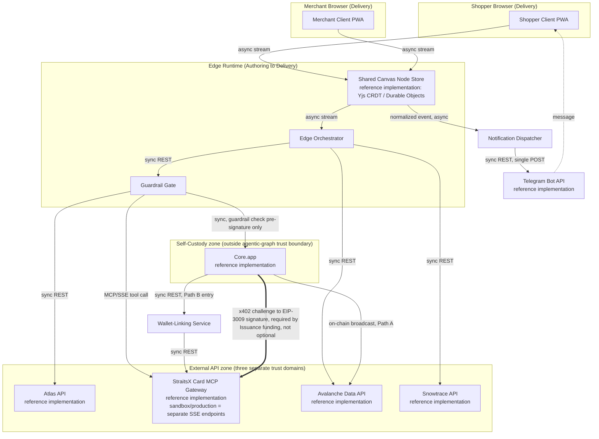

[Combined planning owner](agentic-graph-agentic-travel-agencies-planning-prd-tad-adr-mvp-gtm.md) · `PLAN-AGENTIC-GRAPH-AGENTIC-TRAVEL-AGENCIES-PRD-TAD-ADR-MVP-GTM@0.6.1`. This companion preserves the source section; diagrams and frontmatter projections remain owned by the combined artifact.

# agentic-graph Agentic Travel Agencies — Combined PRD-TAD-ADR-MVP-GTM

**Conformance note**: this document authors against `prd-tad-adr-mvp-gtm-guidelines.md` v1.7.0. `universal_scope: false` because this is a concrete product spec naming its actual chosen dependencies, not a reusable neutral guideline — the vendor names below are real integration targets, not swappable examples, and each is still introduced under a block whose text says "reference implementation" per the Scope & Neutrality Contract, since the rule applies regardless of surrounding intent. `local_rung` is raised only for locally implemented and focused-test-proven slices recorded below; `delivered_rung` remains `undocumented` because protected integration, production authorization, Cloudflare deployment, and live verification receipts do not yet exist. Raising either rung further requires re-deriving it from recorded Evidence References per Phase 4 — not editing this frontmatter by hand.

**Phase 4 changelog (v0.1.0 → v0.2.0)**: adds a self-custody wallet layer (**reference implementation: Core.app / Core Wallet**, Ava Labs' own Avalanche wallet) alongside the existing StraitsX-mediated path, and surfaces a settlement-path fork this version discovered: value can now settle **on-chain-direct** (self-custodied, StraitsX never in the loop) or **StraitsX-mediated** (required for Cards/Payout/fiat off-ramp), and these two paths carry different guardrail-enforcement guarantees. This is a requirements shift, not a cosmetic edit, so PRD and TAD are updated together per the Phase 4 directive; no rung is raised, since no new Evidence Reference exists — the version bump reflects new scope, not new proof.

**Phase 4 changelog (v0.2.0 → v0.3.0)**: replaces the v0.1.0 generic-REST assumption for Issuance Service with the **actual discovered reference implementation** — StraitsX exposes Cards as an **MCP server over SSE** (`card.straitsx.ai/sandbox/sse`, `card.straitsx.ai/production/sse`), and sandbox issuance is funded via an **x402/EIP-3009 self-custody-signed** flow, not custodial-balance debit. This is a correction, not just an addition: it means the Self-Custody Wallet Interface (Core.app, added in v0.2.0 as an *alternate* path) is actually **required** by Issuance Service's real funding mechanism, at least in sandbox — ADR-5's Path-A/Path-B separation was cleaner than reality. Also adds Snowtrace API as a second, independent settlement-verification source. No rung raised — this remains design-stage, corrected by documentation research, not by build evidence.

**Phase 4 changelog (v0.3.0 → v0.4.0)**: adds the Avalanche Fuji Faucet (Builder Hub) as a provisioning dependency, and captures a precision this document had blurred: **not every self-custody signature needs gas.** The x402/EIP-3009 signature that funds Issuance Service (ADR-6) is gasless for the signer — StraitsX's relayer submits and pays. **Path A (on-chain-direct settlement to a merchant, US-5)** is a different, ordinary on-chain transaction that the Self-Custody Wallet Interface must submit itself, and that does require the wallet to hold Fuji AVAX for gas. This distinction was implicit before and is now explicit, since conflating the two would have understated what Path A actually needs to work. No rung raised.

**Phase 4 changelog (v0.4.0 → v0.5.0)**: adds a Notification Dispatcher component (US-6) — **reference implementation: Telegram Bot API**, genuinely $0 at any volume — as a new consumer of the Webhook Normalizer's already-normalized events from the Shared-Canvas Sync Pipeline. WhatsApp Cloud API is logged as a `Should`-tier follow-on rather than built now, since Meta's business-verification and template-approval process costs calendar time, not money, the same pattern already noted for TikTok/Instagram elsewhere in this thread's research. Web Push is noted as a complementary, zero-cost channel in a footnote on the new component spec, not built out as its own component this revision. No rung raised.

**Release-candidate changelog (v0.5.0 → v0.6.0)**: records local implementation progress from the `agent/solo-agent/agentic-graph-agentic-travel-agencies` lane. Dev evidence now exists for the shared-node foundation, transaction-side authority, OpenAI Responses intent parser, deterministic guardrail retry slice, durable human-confirmation boundary, fail-closed issuance preparation route, exact two-source settlement verifier, MCP SSE profile support, D1 migration skeleton, and Commerce MainPanel travel-payment settings using the Stripe KTV layout. The local rung is raised only to `dev-proven`; delivery is now `protected-main-integrated` because PR #811 merged to canonical `origin/main` and the residual worktree was removed after parity was proven. Production deployment and live issuance remain closed because protected Cloudflare production dispatch has not run, rollback identity capture is blocked by missing release environment variables in Trae's active terminal, and production StraitsX MCP tool names/schema, Path-A enforcement, multi-card funding, wallet linking, escrow meter, notifications, and readiness/provenance derivation are not yet proven.

---

## Feature: Agentic Travel Agency — Flagship Flows & Shared-Canvas Primitive

### Problem Statement

Two distinct pain points, one shared root cause. **(1)** A shopper's agent booking travel or comparing purchases has no budget-enforced, human-confirmed path to checkout — overspend and unauthorized purchase are discovered after the fact, not prevented at the gate. **(2)** A merchant receiving agent-initiated traffic and the agent's human principal are structurally blind to each other's state — the merchant can't see why an agent stalled, the shopper can't see why a merchant's policy blocked a transaction, and any dispute means re-explaining the same transaction to two separate systems. Both pain points trace to the same root cause: shopper-side and merchant-side state are maintained as two separate, unsynchronized copies. The opportunity is a single primitive — a shared canvas node — that both sides read from the same source, eliminating the mirroring gap that causes both problems.

### Personas

| Persona | Jobs-to-be-done |
|---|---|
| **Shopper-Agent Principal** | SME founder/traveler whose agent transacts on their behalf within a stated budget; needs mobile-first, glanceable control with a hard confirmation gate before money moves |
| **Merchant Operator** | SME merchant/OTA-adjacent operator receiving agent-initiated traffic; needs to distinguish legitimate agents from noise, enforce policy, and resolve disputes without a separate support channel |

### User Journey Stage

Both personas occupy the same journey, different ends: **Discover** (agent finds/evaluates options) → **Engage** (guardrail + confirmation gate) → **Complete** (settlement + shared audit record). The shared-canvas primitive is what makes "Complete" identical for both personas instead of two divergent records.

### User Stories

**US-1 — As a** Shopper-Agent Principal **I want** my agent to book a flight within a stated budget and never exceed it **So that** I don't discover overspend after the fact.

**US-2 — As a** Shopper-Agent Principal **I want** my agent to compare purchases across stores and pause for my explicit confirmation before paying **So that** no purchase happens without my approval.

**US-3 — As a** Merchant Operator **I want** to see the identical transaction timeline my customer's agent sees **So that** disputes resolve without re-explaining context across two systems.

**US-4 — As a** Merchant Operator **I want** an on-chain-verifiable settlement guarantee before committing inventory **So that** I'm not exposed to a fare hold with no funds behind it.

**US-5 — As a** Shopper-Agent Principal holding XSGD in a self-custodied wallet **I want** to pay a merchant directly on-chain when the merchant accepts stablecoin **So that** I don't need to route funds through StraitsX custody for transactions that don't need a card or a fiat off-ramp.

**US-6 — As a** Shopper-Agent Principal **I want** to receive a message outside the canvas when my booking's state changes (confirmed, failed, disputed) **So that** I don't have to keep the app open to know the outcome.

### Acceptance Criteria

**US-1 — Given** an intent of SIN→KUL, 28 May–4 Jun, budget SGD 500, **When** the agent's Discovery returns a fare above budget, **Then** the guardrail gate blocks Issuance and triggers a bounded flexible-date retry before ever presenting a card.
> **VCC translation**: `Verify the guardrail-gate log shows zero StraitsX Cards issuance calls for any fare exceeding SGD 500, and at least one probe.evolve retry attempt is logged, with a stop condition after 3 retries`

**US-2 — Given** a discovered, scored best-value item, **When** the agent adds it to cart, **Then** no payment call fires until a human taps Confirm on the summary sheet.
> **VCC translation**: `Verify zero StraitsX Payment/Cards calls exist between the "added to cart" event and a recorded human-confirm event in the same session log`

**US-3 — Given** a completed or disputed transaction, **When** either a shopper-side or merchant-side human opens the transaction node, **Then** both see the identical expanded provenance record, not two different renderings.
> **VCC translation**: `Verify a checksum of the expanded node payload is identical when fetched from the shopper-canvas subscription and the merchant-canvas subscription for the same node id`

**US-4 — Given** an Atlas API fare hold with a stated expiry window, **When** the merchant console evaluates whether to commit inventory, **Then** an on-chain escrow commitment matching the hold window must exist before the merchant's console marks the offer as backed.
> **VCC translation**: `Verify the escrow-commitment timestamp precedes the "inventory committed" state transition in the merchant-console log, and the escrow window duration matches the Atlas hold-window value within ±5 seconds`

**US-5 — Given** a merchant address that accepts XSGD directly, **When** the shopper's Core.app wallet signs a transfer, **Then** the transaction settles on Avalanche without any StraitsX API call in the path, and the Guardrail Gate's budget check still applies before the signature is requested.
> **VCC translation**: `Verify zero StraitsX API calls exist in the transaction log for a Path-A settlement, and a guardrail-approval event precedes the wallet-signature-request event by session-log order`
>
> **Honest gap, stated rather than implied**: unlike US-1/US-2, this VCC's guardrail half has no server-side enforcement point to bind to — StraitsX's Guardrail Gate binding assumed a StraitsX-mediated call to block. For Path A, the check can only be enforced client-side (inside Core.app or the shared-canvas orchestrator, before it ever asks Core to sign) or on-chain (a spending-limit contract), neither of which exists yet. This VCC is written as a target, not a claim — it stays `spec-complete` with no path to `dev-proven` until one of those two enforcement points is built.

**US-6 — Given** a booking's state changes (confirmed, failed, or disputed) on the Shared Canvas Node, **When** the Notification Dispatcher consumes that normalized event, **Then** a Telegram message reflecting the new state reaches the shopper within a bounded delay, without the canvas needing to be open.
> **VCC translation**: `Verify a Telegram send event exists within 10 seconds of the corresponding Shared Canvas Node state-change event, for every state in {confirmed, failed, disputed}, and that no send fires for a state the node hasn't actually reached`

### Success Metrics

| Metric | Baseline | Target | Timeline |
|---|---|---|---|
| Budget-guardrail false-negative rate (fares issued over budget) | N/A (new capability) | 0 | at first Evidence Reference |
| Confirmation-gate bypass count | N/A | 0 | at first Evidence Reference |
| Shared-node checksum mismatch rate (shopper vs. merchant view) | N/A | 0 | at first Evidence Reference |
| Readiness rung (local / delivered) | `undocumented` / `undocumented` | `runtime-ready` / `runtime-ready` | Phase 3 exit |
| Time-to-value (TTV steps) | est. 6 steps (intent → confirm → settled) | ≤ 6 steps | Phase 0 estimate, validated Phase 3 |
| Time-to-value (TTV elapsed) | est. 90s (matches the demo-script constraint already established) | ≤ 120s | Phase 0 estimate, validated Phase 3 |
| Token cost / month | est. $0–5 at prototype load (Intent Parser + Scorer harnesses only; Discovery/Sync are zero-token per Component Specifications) | ≤ $20/mo at 100 sessions/mo | Sprint 1 |
| Monthly TCO | $0 (all bound APIs are 🟢/🟡 zero-cost per prior TCO matrices; CRDT store runs on already-provisioned Cloudflare Durable Objects) | $0 | ongoing |
| ROI Score | — | ≥ threshold set for Must-tier features (User Impact 5 × Reach [SME pilot cohort] / (Build Hours + $0 TCO + ~$5 token cost)) | Sprint 1 review |

### MoSCoW Priority

| Tier | Item | ROI rationale |
|---|---|---|
| **Must** | Shared-canvas node primitive (US-3) | Everything else depends on it; zero-token, reuses already-adopted CRDT stack — highest impact per build hour |
| **Must** | Budget/cart-total guardrail gate (US-1, US-2) | Directly prevents the two named pain points; deterministic, non-AI component — cheap to build, high user-trust impact |
| **Should** | Escrow-meter settlement guarantee (US-4) | Needed for merchant-side trust but has a dependency risk (see Open Questions on StraitsX Blockchain API fee floor) — sequence after Must-tier proves stable |
| **Should** | On-chain-direct settlement path, StraitsX-mediated case only (US-5, wallet-linking sub-flow) | Real user-holds-XSGD-in-Core scenario, low build cost (reuses Settlement Verifier unchanged) — but scoped to the *linked* flow only this increment |
| **Could** | Bidirectional reputation write | High narrative value, low urgency — no pilot transaction volume exists yet to make reputation meaningful |
| **Won't (this increment)** | Client-side or on-chain guardrail enforcement for unlinked Path-A settlement (US-5's harder half) | No enforcement point exists yet (see US-5 VCC honest-gap note); building one is a real scoping exercise, not a wiring task — deferred rather than half-built and claimed done |
| **[new, v0.3.0] Should** | Multi-card-per-transaction funding pattern for approved amounts exceeding the per-card cap (5–30 SGD sandbox / 5–50 USD production) | US-1's SGD 500 flight budget cannot be funded by a single card as the MCP gateway currently caps it — this is a real gap between the flagship demo and the discovered reference implementation's limits, not a hypothetical; needs resolving before US-1's Issuance step can leave `spec-complete` |
| **[new, v0.3.0] Won't (this increment)** | Production Issuance Service integration | Tool schema unconfirmed for the production endpoint (see Open Questions) — sandbox-only for this increment, consistent with the Deploy Boundary Register below |
| **[new, v0.4.0] Should** | Gas-provisioning flow for Path A testing (Fuji faucet or a pre-funded relayer/sponsor wallet) | Path A (US-5, on-chain-direct) cannot broadcast at all without wallet-held AVAX gas — this is a hard prerequisite, not a nice-to-have, and is scoped `Should` rather than `Must` only because Path A itself is already `Should`-tier |
| **[new, v0.5.0] Should** | Notification Dispatcher — Telegram Bot API (US-6) | Genuinely $0 at any volume, no approval process, extends an existing pipeline (Shared-Canvas Sync Pipeline's Webhook Normalizer) rather than adding a new one — one of the cheapest `Should`-tier items in this whole document to actually ship |
| **[new, v0.5.0] Could** | Notification Dispatcher — WhatsApp Cloud API follow-on | Higher SG/MY/SEA reach than Telegram, but costs calendar time (Meta business verification, template pre-approval) rather than money — same "budget time, not money" pattern already flagged for TikTok/Instagram; sequenced after Telegram proves the pipeline extension works |
| **Won't (this increment)** | Full MCP Gateway federation / multi-transport agent discovery (Agent-Platform Readiness "Must" tier as defined in the guideline set) | Out of scope for this document; declared explicitly per the Readiness Tiers directive rather than implied — this PRD covers the transaction primitive, not agentic-graph's own external-agent-discovery surface |
| **Won't (this increment)** | Privacy-preserving multi-merchant comparison | Flagged previously as architecturally hard, not just a UI toggle — needs its own Phase 0 problem-discovery pass before scoping |

### Min-Viable Scope

The two flagship flows (SIN→KUL flight booking, backpack comparison shopping) sharing one canvas via the shared-node primitive, with the guardrail gate and mandatory human-confirmation sheet. Excludes escrow meter, reputation writes, dispute arbitration UI, and any multi-merchant or multi-agent race-condition handling.

### Out of Scope

- MCP Gateway federation / external-agent discovery surface for agentic-graph itself (separate Follow-on PRD/TAD per Agent-Platform Readiness)
- Multi-merchant privacy-preserving comparison (idea flagged as needing independent Phase 0 discovery)
- Machine-payable micropayment settlement rail (blocked on the StraitsX Blockchain API fee-floor open question below)
- Cross-border compliance handshake, fare-hold race-condition visualizer, negotiation replay — deferred to a Follow-on increment once the Must-tier primitive is `runtime-ready`

### Dependencies

- Atlas API (aTriptech) sandbox + UAT credentials — **reference implementation** for GDS-style flight search/booking
- StraitsX sandbox account with Cards product access — **reference implementation** for stablecoin-funded virtual card issuance
- Avalanche Data API key — **reference implementation** for on-chain settlement verification
- Core.app (Core Wallet) — **reference implementation** for self-custody signing on Avalanche C-Chain; EVM-compatible, so this is a wallet-choice decision (see ADR-4), not a new integration surface
- StraitsX Customer Profile wallet-linking (address whitelisting) — required only for the StraitsX-mediated leg of US-5, not for pure Path-A on-chain settlement
- **[v0.3.0]** StraitsX Card MCP Gateway — sandbox `https://card.straitsx.ai/sandbox/sse`, production `https://card.straitsx.ai/production/sse`, **reference implementation** for Issuance Service; sandbox requires a Fuji-XSGD-funded self-custody wallet, whitelisted by StraitsX
- **[v0.3.0]** Snowtrace API key (`snowtrace.io/protected/profile/apikeys`) — **reference implementation** for independent settlement-transaction verification, complementing Avalanche Data API
- **[v0.4.0]** Avalanche Fuji Faucet (`build.avax.network/console/primary-network/faucet`) — **reference implementation** for provisioning the Self-Custody Wallet Interface with testnet gas; needed for Path A (US-5) only, not for the Issuance Service funding signature (see the gas-requirement precision in that component's spec)
- Yjs CRDT inside Cloudflare Durable Objects — **reference implementation**, already adopted per prior storage-sync architecture decisions; the shared-canvas primitive is a new consumer of an existing dependency, not a new one
- eBay Browse API + PricesAPI — **reference implementation** for comparison-shopping Discovery
- **[v0.5.0]** Telegram Bot API — **reference implementation** for Notification Dispatcher; genuinely $0 at any volume, created instantly via `@BotFather`, no approval process. **Footnote — Web Push**: native PWA push (VAPID) is a genuinely zero-cost complementary channel, worth keeping in view since agentic-graph is already a PWA, but it only reaches users who already have the app installed with notification permission granted — it doesn't substitute for Telegram/WhatsApp reaching someone who hasn't opened agentic-graph yet, so it isn't built out as its own component this revision.

### Open Questions

- Does the StraitsX Blockchain API impose a minimum transfer size or per-transaction fee floor? Unresolved from prior research; blocks any future micropayment-rail scoping and should be confirmed before ADR-3's alternatives are finalized.
- What is Atlas API's actual sandbox coverage depth for SEA low-cost carriers (AirAsia, Scoot) versus full-service carriers? Affects whether US-1's demo fare set is representative.
- Does the merchant console need an authentication model distinct from the shopper canvas, or can both run on the already-adopted Better Auth instance with role-scoped sessions? Affects Component Specifications for the Shared Canvas Node Store.
- **[new, v0.2.0]** Where should Path-A guardrail enforcement actually live — client-side inside Core.app (if it exposes a spending-policy hook), inside the shared-canvas orchestrator (pre-signature check, trusts the client not to bypass it), or an on-chain spending-limit contract (strongest guarantee, highest build cost)? Unresolved; blocks US-5's harder half from leaving `spec-complete`.
- **[new, v0.2.0]** Does Core.app's wallet-linking flow toward StraitsX Customer Profile differ operationally from a generic EVM address whitelist (e.g. Ava Labs-specific attestation), or is it identical to what any EVM wallet would need? Affects whether Wallet-Linking Service is wallet-agnostic or Core-specific.
- **[new, v0.3.0]** Production MCP tool names/schema are **unconfirmed** — only sandbox (`get_card_sandbox`, `view_card_sandbox`) is documented in the source referenced. Blocks Issuance Service from moving past `spec-complete` on the production side specifically.
- **[new, v0.3.0]** Sandbox per-card cap is 5–30 SGD; production is 5–50 **USD**, not SGD — is this a genuine settlement-asset difference (XSGD vs. XUSD) or just a documentation-currency convention? Directly affects ADR-6 and any Follow-on scoping of production issuance.
- **[new, v0.3.0]** US-1's flight-booking budget (SGD 500) exceeds the per-card cap in both environments by roughly an order of magnitude. Does Issuance Service need a **multi-card-per-transaction pattern** (several disposable cards summing to one approved fare), and if so, how does that interact with each card's single-use/one-view property and the existing VCC's "≤ 1 card per transaction" assumption? This is flagged in MoSCoW below rather than silently assumed solvable.
- **[new, v0.3.0]** Snowtrace API rate limits and scope for the generated key are unconfirmed — the key-management page requires authentication and wasn't independently verifiable from documentation alone.
- **[new, v0.4.0]** The Fuji faucet's rate limit (~1 claim per 24h, up to 2 AVAX per address) is fine for a single developer's manual testing but may not support a pilot cohort's demo cadence if multiple session wallets need gas concurrently — does Path A testing need a dedicated pre-funded relayer/sponsor wallet instead of per-session faucet claims? Unresolved; affects whether the `Should`-tier Path A item below is actually schedulable within a sprint.
- **[new, v0.5.0]** Should the WhatsApp follow-on go direct-to-Meta (Cloud API, no BSP) or through a Business Solution Provider (adds a platform fee but manages template approval/inbox tooling)? Affects the `Could`-tier item's actual cost, since direct-to-Meta is $0 at the infra layer but higher engineering effort, while a BSP adds a recurring fee for lower setup effort.

---

## Architecture: Flight Booking, Comparison Shopping & Shared-Canvas Primitive

### Overview

**From dual intent (shopper's agent request + merchant's inbound-request handling) to a single settled, jointly-visible transaction record**: Intent Parser → Probe-Tree Orchestrator → [Discovery Harness fan-out] → Guardrail Gate → Shared Canvas Node (single write, dual read) → Issuance/Settlement Harnesses → delivers one hash-linked record both shopper and merchant read identically.

**v0.2.0 addition — settlement forks two ways after the Guardrail Gate**: **Path A (on-chain-direct)** — Core.app signs a transfer straight to the merchant's Avalanche address, StraitsX never called, verified read-only via Settlement Verifier; **Path B (StraitsX-mediated)** — funds move into StraitsX custody (requiring Wallet-Linking first if the source was self-custodied) and proceed through Issuance Service exactly as in v0.1.0. Both paths converge back on the same Shared Canvas Node, so the "one hash-linked record" guarantee holds regardless of which path a given transaction took — only the guardrail-enforcement guarantee differs between them (see US-5).

### Journey → System Mapping

| Journey Stage | Workflow | Data Flow | Orchestration/Harness Flow | Topology Node(s) | Component |
|---|---|---|---|---|---|
| Discover | Discovery Workflow | Intent → Discovery Harness → scored offers | Flight Booking Pipeline / Comparison Shopping Pipeline | Edge Orchestrator, External API nodes | Discovery Harnesses |
| Engage | Guardrail Workflow | Offer → Guardrail Gate → gate result | *(deterministic, no AI pipeline)* | Edge Orchestrator | Guardrail Gate |
| Engage → Complete | Confirmation Workflow | Gate result → Shared Canvas Node → both clients | Shared-Canvas Sync Pipeline | Shopper Client, Merchant Client, Edge CRDT Store | Shared Canvas Node Store |
| Complete | Settlement Workflow | Confirm → Issuance/Settlement Harnesses → provenance write | *(sequential, low-token)* | External API nodes (StraitsX, Avalanche) | Issuance Service, Settlement Verifier |

### Topology

**Version**: 0.1 — 2026-08-15 (initial spec)
**Boundaries**: Shopper Browser (mobile-first PWA), Merchant Browser (mobile-first PWA), Edge Runtime (Cloudflare Workers/Durable Objects), Self-Custody zone (Core.app, device-local keys, outside agentic-graph's trust boundary by design), External API zone (Atlas, StraitsX, Avalanche — three separate trust domains, none controlled by agentic-graph)

| Node | Role | Type | Lane | Connects to | Connection type | Data residency |
|---|---|---|---|---|---|---|
| Shopper Client | Consumer | PWA (browser) | Delivery | Edge Orchestrator | Async stream (CRDT subscription) | Local (device) + Edge cache |
| Merchant Client | Consumer | PWA (browser) | Delivery | Edge Orchestrator | Async stream (CRDT subscription) | Local (device) + Edge cache |
| Edge Orchestrator | Router | Durable Object | Authoring→Delivery | Discovery Harnesses, Guardrail Gate, Shared Canvas Node Store | Sync REST (to APIs), Async (to clients) | Edge (Cloudflare region) |
| Shared Canvas Node Store | Store | CRDT (Durable Object) | Delivery | Edge Orchestrator, both Clients | Async stream | Edge (Cloudflare region) |
| Flight Discovery Harness | Executor | Harness + external API | Authoring→Delivery | Atlas API (external) | Sync REST | External (aTriptech-hosted) |
| Shopping Discovery Harness | Executor | Harness + external API | Authoring→Delivery | eBay Browse API, PricesAPI (external) | Sync REST | External (vendor-hosted) |
| Issuance Service | Executor | MCP harness (SSE transport) + external gateway | Authoring→Delivery | StraitsX Card MCP Gateway (external) — sandbox/production are **separate endpoints**, not a config flag | MCP/SSE (tool calls), x402/EIP-3009 signature round-trip via Self-Custody Wallet Interface | External (StraitsX-hosted) |
| Settlement Verifier | Executor | Harness + external APIs (×2) | Authoring→Delivery | Avalanche Data API + Snowtrace API (external, independent of each other) | Sync REST | External (Avalanche-hosted / Snowtrace-hosted) |
| **[v0.2.0] Self-Custody Wallet Interface** | Executor (signing) | Wallet (Core.app, device-local) | *outside agentic-graph lanes* | Avalanche network directly (Path A), or Wallet-Linking Service (Path B entry) | Sync (signature request/response), on-chain broadcast | Device-local keys; on-chain state is public |
| **[v0.2.0] Wallet-Linking Service** | Router | Component (Edge) | Authoring→Delivery | Self-Custody Wallet Interface, StraitsX Customer Profile | Sync REST | Edge (Cloudflare region) |
| **[v0.5.0] Notification Dispatcher** | Executor | Harness + external API | Authoring→Delivery | Telegram Bot API (external) | Sync REST (single POST per send) | External (Telegram-hosted) |

**Runtime diagram**: as above. **Version notes**: v0.5.0 — adds Notification Dispatcher as a new consumer of the Shared Canvas Node Store's normalized events, and Telegram Bot API as an external node; the dotted edge from Telegram to the Shopper Client represents message delivery happening outside agentic-graph's own client entirely (US-6's point — no canvas needs to be open). v0.3.0 — Issuance Service's edge to StraitsX changes from generic sync REST to MCP/SSE tool call; adds a bold edge from Core.app to the StraitsX Card MCP Gateway representing the x402/EIP-3009 funding signature, which v0.2.0's Path-A/Path-B model treated as optional and v0.3.0 corrects to required-in-sandbox; adds Snowtrace API as a second Settlement Verifier source. v0.2.0's additions (Self-Custody zone, Wallet-Linking Service, Path A/B edges) remain, narrowed in meaning by ADR-6 rather than removed.

### Orchestration/Harness Flows

**Pipeline**: Flight Booking Pipeline
**Topology pattern**: Agentic loop | **Max iterations**: 3 (flexible-date retries) | **Circuit-breaker**: no fare found ≤ budget after 3 retries → surface best-available options to human, do not retry a 4th time
**Token budget**: ~400 prompt + ~150 completion tokens @ ~30% cache hit rate (Intent Parser only — Atlas calls themselves are zero-token) = est. $0.002/call at current small-model pricing

| Role | Component | Input schema | Output schema | Cost log | Fallback |
|---|---|---|---|---|---|
| Dispatcher | Intent Parser | Free-text request | Typed intent (route, dates, budget) | — | Typed error: unparseable intent |
| Executor | Flight Discovery Harness (Atlas API, reference implementation) | Typed intent | Typed fare list | ✓ required (Atlas call itself is $0-token, non-LLM) | Degraded: return best-available above budget with a flag |
| Observer | Provenance Logger | Fare-list + gate result | Hash-linked log entry | — | Silent fail; gap flagged in monitoring |
| Consumer | Shared Canvas Node Store | Typed fare + gate state | Canvas node | — | Upstream error propagation to both clients |

**Pipeline**: Comparison Shopping Pipeline
**Topology pattern**: Fan-out/Fan-in | **Max iterations**: 1 (no retry loop — a miss just returns fewer results) | **Circuit-breaker**: N/A (bounded by definition, single pass)
**Token budget**: ~300 prompt + ~200 completion tokens @ ~20% cache hit rate (Scorer only) = est. $0.002/call

| Role | Component | Input schema | Output schema | Cost log | Fallback |
|---|---|---|---|---|---|
| Dispatcher | Intent Parser | Free-text request | Typed intent (item, price ceiling, criteria) | — | Typed error |
| Executor | Shopping Discovery Harness (eBay Browse API + PricesAPI, reference implementation) — fan-out | Typed intent | Two offer lists | ✓ required | Degraded: proceed with whichever source responded |
| Fan-in | Scorer | Two offer lists | Ranked, scored single list | ✓ required | Best-effort scoring on partial data |
| Consumer | Shared Canvas Node Store | Scored offer | Canvas node | — | Upstream error propagation |

**Pipeline**: Shared-Canvas Sync Pipeline
**Topology pattern**: Sequential | **Max iterations**: N/A (event-driven, not a loop) | **Circuit-breaker**: N/A
**Token budget**: 0 prompt + 0 completion = **$0.00/call** — pure CRDT merge and webhook normalization, no model call (non-zero cost log here would be a defect, consistent with the Agentic OS Must-tier $0 pattern)

| Role | Component | Input schema | Output schema | Cost log | Fallback |
|---|---|---|---|---|---|
| Dispatcher | Node Writer | State-change event | CRDT delta | — | Reject malformed delta |
| Executor | CRDT Merge (Yjs, reference implementation) | CRDT delta | Merged node state | — (not applicable, $0 by design) | Retry merge; last-write-wins per existing storage-sync ADR |
| Observer | Webhook Normalizer | Atlas/StraitsX raw callback | Normalized canvas event | — | Silent fail; gap flagged |
| Consumer | Shopper Client + Merchant Client | Merged node state | Rendered timeline entry | — | Stale-state banner until reconnect |
| **[v0.5.0] Consumer** | Notification Dispatcher (Telegram, reference implementation) | Normalized canvas event (state = confirmed/failed/disputed) | Telegram message | — (non-LLM, $0) | Silent fail is not acceptable here — a failed send must itself be logged as a canvas event, not dropped, since notification failure is exactly the scenario US-6 exists to prevent |

### Component Specifications

**Component**: Shared Canvas Node Store
**Responsibility**: Component merges shopper-side and merchant-side state changes into one CRDT-backed node so both clients read the identical object.
**Interfaces**: CRDT subscription (WebSocket/Durable Object), read/write per the persistent-storage key pattern already established (`table_name:record_id`)
**Dependencies**: Edge Orchestrator, both Clients
**Configuration**: shared vs. personal key scope per node (transaction nodes are shared; draft/pre-confirm intent nodes are personal until Discovery completes)
**FOSS / Vendor**: FOSS — **reference implementation: Yjs** (MIT), already adopted in the prior storage-sync architecture; no new dependency introduced
**Token Budget**: N/A (non-AI component, $0 by design)
**VCC Conditions**: see US-3 VCC above
**Evidence References**: none yet — `spec-complete`
**Readiness rung**: Local: `spec-complete` / Delivered: `undocumented`

**Component**: Guardrail Gate
**Responsibility**: Component blocks Issuance when a discovered offer exceeds the stated budget or cart-total policy.
**Interfaces**: reads typed offer + policy config; emits gate result (pass/block/retry)
**Dependencies**: Discovery Harnesses (upstream), Issuance Service (downstream, only on pass)
**Configuration**: budget/cart-total ceiling, retry bound (3), externalized per session
**FOSS / Vendor**: FOSS — deterministic component, no external dependency
**Token Budget**: N/A (non-AI, deterministic)
**VCC Conditions**: see US-1, US-2 VCCs above
**Evidence References**: none yet — `spec-complete`
**Readiness rung**: Local: `spec-complete` / Delivered: `undocumented`

**Component**: Flight Discovery Harness
**Responsibility**: Component queries flight fares and normalizes results into agentic-graph's typed offer schema.
**Interfaces**: `search.do` → `getOffers.do` (or `getOfferPrice.do` Fulfilment path) → `verify.do`, per the **reference implementation: Atlas API (aTriptech)**
**Dependencies**: Atlas sandbox/UAT credentials
**Configuration**: standard vs. Fulfilment fast-path selection per booking-window length
**FOSS / Vendor**: Proprietary API — no FOSS GDS-equivalent exists for live bookable fares (see ADR-2); OpenSky Network covers verification only, not booking, and is not a substitute
**Harness Contract**: Input schema — typed route/date/budget; Output schema — typed fare list; Cost log — `{ model: none, api_calls: n, estimated_cost_usd: 0 (sandbox) }`; Fallback — degraded best-available-above-budget with flag
**Token Budget**: N/A (non-LLM API harness; Atlas call cost is infra, not token cost)
**Orchestration Topology**: Agentic loop, max 3 iterations, circuit-breaker per Flight Booking Pipeline above
**VCC Conditions**: fare list returned matches typed schema; no call fires above the guardrail-approved amount
**Evidence References**: none yet — `spec-complete`
**Readiness rung**: Local: `spec-complete` / Delivered: `undocumented`

**Component**: Shopping Discovery Harness
**Responsibility**: Component queries multiple product sources in parallel and normalizes results for scoring.
**Interfaces**: eBay Browse API + PricesAPI, **reference implementation**
**Dependencies**: none beyond public free-tier registration
**FOSS / Vendor**: eBay Browse API free tier (no card); PricesAPI free tier (no card) — both zero-TCO per prior Discovery-stage TCO matrix
**Harness Contract**: Input — typed item + price ceiling; Output — typed offer list; Cost log — `{ model: none, api_calls: n, estimated_cost_usd: 0 }`; Fallback — proceed on whichever source responds
**Token Budget**: N/A (non-LLM)
**Orchestration Topology**: Fan-out/Fan-in, single pass, no loop
**VCC Conditions**: offer list returned matches typed schema; cart-add event has zero preceding payment calls
**Evidence References**: none yet — `spec-complete`
**Readiness rung**: Local: `spec-complete` / Delivered: `undocumented`

**Component**: Issuance Service *(revised v0.3.0 — corrects a v0.1.0 assumption)*
**Responsibility**: Component issues a stablecoin-funded, single-use virtual card scoped to the guardrail-approved amount.
**Interfaces**: **MCP server, SSE transport** — sandbox: `https://card.straitsx.ai/sandbox/sse`, production: `https://card.straitsx.ai/production/sse`, **reference implementation: StraitsX Card MCP Gateway**. This is a materially better fit than the v0.1.0 generic-REST assumption: agentic-graph is already MCP-native (its own `/`, `@`, `#` invocation grammar), so this harness binds as a direct MCP tool call, not a wrapped REST client. Sandbox tools confirmed: `get_card_sandbox { wallet_address, cardholder_name, amount_sgd }`, `view_card_sandbox { card_opaque_id, settlement_tx, wallet_address }` → one-time iframe URL. Production tool names are **unconfirmed** — assumed analogous (`get_card`/`view_card`) but not verified (see Open Questions).
**Dependencies**: Guardrail Gate (pass state required), Self-Custody Wallet Interface (funding signer — see correction below), StraitsX sandbox whitelisting/funding for the Fuji-XSGD test wallet
**Funding mechanism — correction to v0.1.0's custodial-only assumption**: card issuance is funded via **x402** (HTTP 402 Payment Required): an unpaid `issue_card` call returns a payment challenge; the caller signs an **EIP-3009** `transferWithAuthorization` for XSGD (sandbox: Fuji testnet contract) using only challenge-derived values, then retries with the signature. This means the **Self-Custody Wallet Interface (Core.app) is not an alternate path around Issuance Service — it is the actual signer Issuance Service requires**, in sandbox at least. ADR-5's clean Path-A/Path-B separation from v0.2.0 is narrower than modeled; see ADR-6.
**FOSS / Vendor**: Proprietary regulated payments API — no FOSS stablecoin-card-issuance equivalent exists; justified as the only compliant path to card-scoped disposable spend (see ADR-3, amended by ADR-6)
**Harness Contract**: Input — typed approved-amount + mandate + signer address; Output — `card_opaque_id`, one-time view iframe URL, `settlement_tx`; Cost log — `{ model: none, mcp_calls: n, estimated_cost_usd: 0 in sandbox (StraitsX relayer absorbs Fuji gas), TBD in production }`; Fallback — upstream 402/error propagation, no silent retry on a signed payment
**Token Budget**: N/A (non-LLM)
**Known server-side constraints (not agentic-graph-enforced, StraitsX-enforced)**: per-card cap **5–30 SGD in sandbox, 5–50 USD in production** — note the currency unit differs between environments (SGD vs. USD), unconfirmed whether this reflects an XSGD/XUSD settlement-asset difference (see Open Questions); cards are **single-use and one-view** — the view iframe has no re-render, a lost view requires issuing a new card, which the dedup VCC below must account for as a legitimate re-issue, not a duplicate
**VCC Conditions**: card scope amount exactly equals guardrail-approved amount; card issuance count per transaction ≤ 1 under normal completion, with an explicit re-issue exception when the prior card's one-time view was lost before use (must be distinguishable from a duplicate-issuance defect in the provenance log)
**Evidence References**: none yet — `spec-complete`
**Readiness rung**: Local: `spec-complete` / Delivered: `undocumented`

**Component**: Settlement Verifier
**Responsibility**: Component confirms on-chain finality of the funding leg behind a StraitsX Cards issuance.
**Interfaces**: **reference implementation: Avalanche Data API** (general on-chain state) + **reference implementation: Snowtrace API** (block-explorer-grade transaction receipt lookup, used specifically to independently confirm the `settlement_tx` value returned by `view_card_sandbox`/`view_card` against the chain, rather than trusting the MCP gateway's own claim) — API key managed at `snowtrace.io/protected/profile/apikeys`
**Dependencies**: Issuance Service (reads the funding transaction it produced)
**FOSS / Vendor**: both read-only verification APIs; no payment logic — pure trust layer; using two independent explorers for the same check is deliberate redundancy, not duplication — StraitsX's own claim and an independent block explorer should agree, and disagreement is itself a signal
**Token Budget**: N/A (non-LLM)
**VCC Conditions**: see US-4 VCC above, plus: `Verify the settlement_tx returned by view_card_sandbox resolves to a confirmed transaction on Snowtrace matching the guardrail-approved amount and the signing wallet address`
**Evidence References**: none yet — `spec-complete`
**Readiness rung**: Local: `spec-complete` / Delivered: `undocumented`

**Component**: Self-Custody Wallet Interface *(v0.2.0)*
**Responsibility**: Component signs an on-chain transfer on the shopper's behalf, either directly to a merchant (Path A) or into StraitsX custody (Path B entry).
**Interfaces**: standard EVM wallet signing interface, **reference implementation: Core.app (Core Wallet)** — chosen over MetaMask for Avalanche-ecosystem alignment; functionally interchangeable for C-Chain XSGD transfers since both are EVM-compatible (see ADR-4)
**Dependencies**: none from agentic-graph's side — this is explicitly outside agentic-graph's trust boundary; device-local keys, never held or seen by any agentic-graph component. **[v0.4.0]** For sandbox testing, the wallet needs (a) Fuji-testnet XSGD, funded via StraitsX's own whitelisting process (organizer/operator-funded, not self-serve), and (b) for **Path A transactions only**, Fuji-testnet AVAX for gas — **reference implementation: Avalanche Fuji Faucet** (`build.avax.network/console/primary-network/faucet`), up to 2 AVAX per claim, rate-limited to roughly one claim per 24h per address.
**Configuration**: N/A — user-controlled wallet, not a agentic-graph-configured service
**FOSS / Vendor**: Core.app is Ava Labs' wallet, free to use, no TCO to agentic-graph; MetaMask (FOSS-licensed, MIT-derived core) remains a drop-in alternative per ADR-4
**Token Budget**: N/A (non-AI, non-agentic-graph-hosted)
**Gas requirement — precision added in v0.4.0**: the x402/EIP-3009 signature that funds Issuance Service (ADR-6) is **gasless for the signer** — it's an off-chain authorization the StraitsX relayer submits and pays gas for. **Path A (US-5, on-chain-direct settlement)** is an ordinary on-chain transaction the wallet itself broadcasts, and **does** require the wallet to hold Fuji AVAX. Conflating these two would have overstated Path B's gas cost and understated Path A's — kept distinct here on purpose.
**VCC Conditions**: see US-5 VCC above, including its stated enforcement gap
**Evidence References**: none yet — `spec-complete`
**Readiness rung**: Local: `spec-complete` / Delivered: `undocumented`

**Component**: Wallet-Linking Service *(v0.2.0)*
**Responsibility**: Component registers a self-custody wallet address against a verified StraitsX Customer Profile, required before Path B can treat an inbound transfer as attributable to the user.
**Interfaces**: StraitsX Customer Profile API, **reference implementation: StraitsX**
**Dependencies**: Self-Custody Wallet Interface (source address), StraitsX Customer Profile (destination attestation)
**Configuration**: one-time linkage per wallet address; re-verification policy not yet defined (see Open Questions)
**FOSS / Vendor**: Proprietary (StraitsX KYC/Customer Profile) — no FOSS alternative possible in this category, same reasoning as ADR-3
**Token Budget**: N/A (non-AI)
**VCC Conditions**: `Verify a wallet-address-to-profile mapping exists in StraitsX before any Path-B inbound transfer from that address is credited to the user's usable balance`
**Evidence References**: none yet — `spec-complete`
**Readiness rung**: Local: `spec-complete` / Delivered: `undocumented`

**Component**: Notification Dispatcher *(v0.5.0)*
**Responsibility**: Component consumes normalized Shared-Canvas Node state-change events and sends an out-of-canvas message to the shopper's Telegram chat.
**Interfaces**: Telegram Bot API, **reference implementation**, single HTTPS POST per send (`sendMessage`), webhook-registered bot via `@BotFather`
**Dependencies**: Webhook Normalizer role in the Shared-Canvas Sync Pipeline (upstream, supplies the normalized event); user must have messaged the bot once (`/start`) before the bot can send — a one-time friction cost, not recurring, since Telegram bots cannot cold-initiate a conversation
**Configuration**: which state transitions trigger a send (confirmed/failed/disputed, per US-6's VCC); per-user chat-ID mapping stored alongside the existing Customer Profile linkage pattern
**FOSS / Vendor**: Telegram Bot API — genuinely $0 at any volume, no tier, no per-message charge, unchanged since 2015; the single cheapest external dependency in this entire document
**Footnote — Web Push**: native PWA push (VAPID) is a genuinely zero-cost, zero-third-party-dependency complementary channel — worth keeping in view given agentic-graph's existing PWA/mobile-first posture, but it only reaches a user who already has the app installed with notification permission granted. It is not built as its own component this revision; if built later, it would sit as an additional Consumer on the same Shared-Canvas Sync Pipeline row as Notification Dispatcher above, not as a replacement for it.
**Harness Contract**: Input — normalized canvas event; Output — `{ message_id, chat_id, sent_at }`; Cost log — `{ model: none, api_calls: n, estimated_cost_usd: 0 }`; Fallback — failed send logs its own canvas event rather than failing silently (see Shared-Canvas Sync Pipeline table above)
**Token Budget**: N/A (non-LLM)
**VCC Conditions**: see US-6 VCC above
**Evidence References**: none yet — `spec-complete`
**Readiness rung**: Local: `spec-complete` / Delivered: `undocumented`

### Integration Contracts

| Interface | Protocol | Format | Errors |
|---|---|---|---|
| Atlas API (reference implementation) | HTTPS REST | JSON | Documented codes incl. `318`/`608` duplicate-booking, `429` rate limit — mapped to Guardrail Gate dedup check |
| StraitsX Cards (reference implementation) | HTTPS REST | JSON | Standard StraitsX error responses; idempotent-request support used for dedup |
| Avalanche Data API (reference implementation) | HTTPS REST | JSON | Read-only; failure = "unverified," not a transaction failure |
| Shared Canvas Node Store sync | WebSocket (CRDT delta stream) | Binary CRDT update (Yjs) | Last-write-wins per existing storage-sync ADR; reconnect replay on drop |
| Self-Custody Wallet Interface (reference implementation: Core.app) *(v0.2.0)* | Standard EVM signing request/response (e.g. `eth_sendTransaction`-equivalent on C-Chain) | JSON-RPC | User rejection = no transaction broadcast, no partial state; no agentic-graph-side rollback needed since nothing was ever debited from a agentic-graph-held balance |
| Wallet-Linking Service (reference implementation: StraitsX Customer Profile) *(v0.2.0)* | HTTPS REST | JSON | Unlinked-address inbound transfer = held unattributed pending manual linkage, not silently credited |
| Notification Dispatcher (reference implementation: Telegram Bot API) *(v0.5.0)* | HTTPS REST (`sendMessage`) | JSON | Failed send logs its own canvas event per US-6; bot cannot cold-initiate — first contact requires the user to message the bot once |

### Architectural Decisions

See ADR-1 (shared-canvas primitive), ADR-2 (flight booking API selection), ADR-3 (card issuance vendor selection, amended by ADR-6), ADR-4 (wallet selection), ADR-5 (dual settlement path), ADR-6 (card issuance transport/funding correction), ADR-7 (notification channel selection) below.

### Quality Attributes

| Attribute | Scenario | Pattern | Validation |
|---|---|---|---|
| Performance | Discovery fan-out must return first result within ~2–3s on mobile networks | Cap parallel probes at 3; stream partial results rather than blocking | Timed mobile-network test |
| Scalability | Shared-canvas subscription must hold under concurrent shopper+merchant sessions at pilot scale (~100 sessions/mo) | CRDT + Durable Object, already proven at this scale in prior architecture work | Load test at 10x pilot volume |
| Security | Guardrail Gate must be un-bypassable from either client | Gate enforced server-side (Edge Orchestrator), never trusted from client input | Adversarial test: forged client bypass attempt |
| Observability | Every Issuance call must be traceable to its approving guardrail decision | Hash-linked provenance log per transaction | Audit-trail spot-check |
| Token Cost | Discovery + Scoring harnesses stay under $20/mo at 100 sessions | Sync-pipeline is $0 by design; only Intent Parser + Scorer consume tokens | Cost-log sampling, alert on p95 overrun |
| Offline Behaviour | Shopper loses connectivity mid-flow | Cache last Discovery result set locally (IndexedDB); Confirm action queues until reconnect, never silently retries a payment | Airplane-mode pass |
| TCO | 12-month projected spend vs. zero-TCO target | All bound APIs are 🟢/🟡 zero-cost per prior TCO matrices; CRDT store runs on already-provisioned infra | Monthly cost audit |
| Device Reach | Mobile-first PWA for both shopper and merchant clients | Single-column responsive layout, bottom-pinned CTA, no native-only APIs | Cross-device manual pass |

### Deployment Strategy

Edge-first on already-provisioned Cloudflare Workers/Durable Objects. No blue-green needed at this stage — promotion is sandbox-only (Atlas UAT + StraitsX sandbox credentials) through the Authoring lane until Phase 3 sign-off; Mirror-lane validation against the same sandbox credentials before any Delivery-lane promotion is considered. Rollback = revert to prior Durable Object state snapshot (CRDT history is append-only, so rollback is a read-pointer change, not a destructive operation).

### Component Inventory

| Layer | Component | File / Module | Local rung | Delivered rung |
|---|---|---|---|---|
| Edge | Shared Canvas Node Store | `cloudflare/workers/agentic-graph-storage/sharedCanvasNode/*`, `cloudflare/workers/agentic-graph-storage/canvasSyncRoom.ts` | `dev-proven` | `undocumented` |
| Edge | Transaction-Side Authority | `cloudflare/workers/agentic-graph-storage/travelAgencySide.ts`, `cloudflare/d1/migrations/0012_travel_agency.sql` | `dev-proven` | `undocumented` |
| Edge | Guardrail Gate | `cloudflare/workers/agentic-graph-payment/travelAgency/guardrailGate.ts` | `dev-proven` | `undocumented` |
| Harness | Flight Intent Parser | `cloudflare/workers/agentic-graph-payment/travelAgency/intentParser.ts` | `dev-proven` | `undocumented` |
| Harness | Flight Discovery Harness | `[...]` | `spec-complete` | `undocumented` |
| Harness | Shopping Discovery Harness | `[...]` | `spec-complete` | `undocumented` |
| Harness | Issuance Service | `cloudflare/workers/agentic-graph-payment/travelAgency/issuanceService.ts` | `dev-proven-fail-closed` | `undocumented` |
| Harness | Settlement Verifier | `cloudflare/workers/agentic-graph-payment/travelAgency/settlementVerifier.ts` | `dev-proven` | `undocumented` |
| Self-Custody | Self-Custody Wallet Interface *(v0.2.0)* | `[...]` | `spec-complete` | `undocumented` |
| Edge | Wallet-Linking Service *(v0.2.0)* | `cloudflare/d1/migrations/0012_travel_agency.sql` | `schema-only` | `undocumented` |
| Harness | Notification Dispatcher *(v0.5.0)* | `cloudflare/d1/migrations/0012_travel_agency.sql` | `schema-only` | `undocumented` |
| Canvas | Commerce Travel Payment Settings | `canvas/src/features/panels/views/travelAgencyPaymentApiDocs.ts`, `canvas/src/features/settings/registry-payments.ts` | `dev-proven` | `undocumented` |
| MCP | External Tool SSE Transport | `mcp/external-tool-*.js` | `dev-proven` | `undocumented` |

### Deploy Boundary Register

| Boundary | From lane | To lane | Evidence Reference | Operator instruction | Rollback statement | State |
|---|---|---|---|---|---|---|
| Sandbox-to-Mirror | Authoring | Mirror | local focused checks passed: Canvas check, Commerce UI unit, payment worker tests, MCP tests, shared-node PBT | Merge only through protected Integration Gate / PR; direct `main` push remains forbidden by `agentic-canvas-os/docs/RELEASE-WORKFLOW.md` | Revert candidate branch or protected merge commit before production authorization | `pending-protected-integration` |
| Mirror-to-Delivery | Mirror | Delivery | no protected production authorization receipt yet | Deploy only the exact candidate digest authorized by an authenticated human reviewer in the protected GitHub `production` environment | Use immutable rollback/publish workflow for prior authorized candidate; no manual prod mirror mutation | `closed` |
| **[v0.3.0] Issuance Service: sandbox SSE → production SSE** | Authoring/Mirror | Delivery | none yet — blocked on the production-tool-schema Open Question above | Swap the MCP endpoint from `card.straitsx.ai/sandbox/sse` to `card.straitsx.ai/production/sse` **only after** production tool names/schema are confirmed to match the sandbox contract this document specs against | Revert endpoint binding to `/sandbox/sse`; no funds-in-flight risk since this boundary only changes which MCP server is called, not any held balance | `closed` |

---

## ADR-1: Shared Canvas Node as CRDT-Backed Single Source
**Status**: Proposed
**Date**: 2026-08-15

### Context
Shopper-side and merchant-side canvases need to display identical transaction state (US-3) without either side owning a copy the other has to trust secondhand.

### Decision
Store shared transaction nodes as a single CRDT-backed record (Durable Object), read by both clients via subscription — never mirrored into two separate per-side stores with a reconciliation job.

### Alternatives Considered
1. **Mirrored dual-state with reconciliation job**: Pros — simpler initial client code; Cons — reintroduces the exact opacity/trust gap this primitive exists to close, and reconciliation lag is itself a new failure mode.
2. **FOSS alternative — Automerge**: another FOSS CRDT library; comparable feature set to Yjs but not already integrated into the existing storage-sync architecture — switching costs outweigh any marginal benefit at this stage.

### Rationale
Yjs is already the adopted CRDT inside Durable Objects per prior storage-sync architecture decisions — this is a new *consumer* of an existing dependency, not a new dependency, which is the strongest min-pivot-max-value case available.

### TCO Impact

| Dimension | Chosen: Yjs (already adopted) | FOSS Alternative: Automerge | Delta / 12 months |
|---|---|---|---|
| Infra cost | $0 (existing Durable Object provisioning) | $0 (same infra, different library) | $0 |
| Egress cost | $0 | $0 | $0 |
| Token cost | $0 (non-AI component) | $0 | $0 |
| Ops burden | Low (already operationally familiar) | Medium (new library to learn) | — |
| Vendor risk | Low (MIT, already vetted) | Low (MIT) | — |

### Consequences
- **Positive**: zero new infrastructure, zero new library risk, directly closes US-3.
- **Negative**: shared nodes require careful key-scoping (personal vs. shared) to avoid leaking pre-confirmation shopper state to the merchant side prematurely.
- **Neutral**: reuses the existing key-design pattern (`table_name:record_id`) already established for persistent artifact storage.

---

## ADR-2: Flight Booking via Reference-Implementation GDS API
**Status**: Proposed
**Date**: 2026-08-15

### Context
US-1 requires a genuinely bookable flight — not just a fare estimate — to make the guardrail and confirmation gate meaningful.

### Decision
Bind the Flight Discovery Harness to a GDS-style booking API, **reference implementation: Atlas API (aTriptech)** — `search.do` → `getOffers.do`/`getOfferPrice.do` → `verify.do` → `order.do` → `pay.do`.

### Alternatives Considered
1. **Direct scraping of airline/OTA sites**: Pros — no vendor relationship required; Cons — fragile, ToS-risk, breaks the FOSS/ethics posture already established for e-commerce Discovery in prior research; explicitly rejected on the same grounds as scraping was rejected there.
2. **FOSS alternative — none exists** for live bookable fare inventory. OpenSky Network (already adopted for tracking/verification elsewhere) is the closest FOSS-aligned option but only proves a flight *happened*, not that a fare can be *booked* — it is not a substitute and is noted here explicitly rather than silently omitted.

### Rationale
No FOSS booking-capable alternative exists; Atlas API is the only path evaluated that provides a documented, sandbox-testable booking flow with hybrid-payment (VCC pass-through) support matching the Issuance Service's card-scoped funding model.

