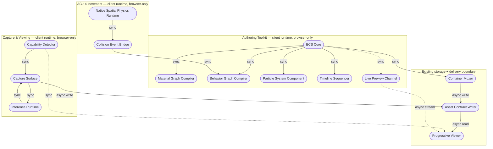

[Combined planning owner](agentic-graph-ar-vr-xr-planning-prd-tad-adr-mvp-gtm.md) · `PLAN-AGENTIC-GRAPH-AR-VR-XR-PRD-TAD-ADR-MVP-GTM@3.0.1`. This companion preserves the source section; diagrams and frontmatter projections remain owned by the combined artifact.

### Architecture: Device-Agnostic Capture, Viewing, Native In-Repo Spatial Authoring & Game Simulation

#### Overview
**From phone camera feed and in-browser authoring to a published, simulated spatial asset**: [Capture Surface | Authoring Toolkit | Game Simulation Layer] → Capability Detection / ECS Core → asset-contract publish → Progressive-Enhancement Viewer → delivers a spatial asset viewable at the best tier any given device supports, authorable and simulatable entirely in-browser, with zero incremental infrastructure cost and zero native-application dependency.

#### Journey → System Mapping

| Journey Stage | Workflow | Data Flow | Orchestration/Harness Flow | Topology Node(s) | Component |
|---|---|---|---|---|---|
| Capture: Trigger/Discover | Capture Init Workflow | — | — | Capture Surface | Capability Detector |
| Capture: Engage | Live Capture Workflow | Capture Data Flow | Depth Synthesis Harness Flow | Capture Surface, Inference Runtime | Monocular Depth Component, DIBR Synthesizer |
| Capture: Complete | Save & Publish Workflow | Capture Data Flow | Post-Process Fallback Harness Flow (conditional) | Asset Store | Asset Contract Writer |
| Capture: Return | View Workflow | Viewer Data Flow | — | Viewer Surface | Progressive Viewer |
| Author: Trigger/Discover | Authoring Init Workflow | — | — | Authoring Surface | ECS Core |
| Author: Engage | Scene Composition Workflow | Authoring Data Flow | — (deterministic compilers; no AI-powered pipeline) | Authoring Surface | Material Graph Compiler, Behavior Graph Compiler, Particle System Component, Timeline Sequencer |
| Author: Complete | Save & Publish Workflow | Authoring Data Flow | — | Asset Store | Container Muxer, Asset Contract Writer |
| Author: Return | Live Preview Workflow | Viewer Data Flow | — | Authoring Surface, Viewer Surface | Live Preview Channel |
| Simulate: Trigger/Discover | Existing XR Physics Workflow | — | — | Authoring Surface | Native Spatial Physics Runtime |
| Simulate: Engage | AC-14 Collision Dispatch Workflow | Simulation Data Flow | — (deterministic event adapter; no AI-powered pipeline) | Authoring Surface | Native Spatial Physics Runtime, Collision Event Bridge, Behavior Dispatcher |
| Simulate: Complete | Save & Publish Workflow | Authoring Data Flow | — | Asset Store | Asset Contract Writer *(shared with Feature A/B)* |

#### Topology
**Version**: 3 — 2026-08-06
**Boundaries**: Client runtime (browser, any device); no server-side boundary crossed by any feature in this document

**Capture & Viewing nodes** *(unchanged from v1)*:

| Node | Role | Type | Lane | Connects to | Connection type | Data residency |
|---|---|---|---|---|---|---|
| Capability Detector | Producer | Function (client-side) | Authoring | Capture Surface, Progressive Viewer | Sync in-process call | Local (device memory only) |
| Capture Surface | Producer/Consumer | Function (client-side) | Authoring | Inference Runtime, Asset Contract Writer | Sync in-process call | Local (device memory) |
| Inference Runtime | Producer | Function (client-side model runtime) | Authoring | Capture Surface | Sync in-process call | Local (device memory; no network egress) |
| Asset Contract Writer | Consumer/Store | Function → Storage adapter | Authoring/Delivery | Existing asset store | Async write | Region (existing storage residency, unchanged) |
| Progressive Viewer | Consumer | Function (client-side) | Delivery | Asset Contract Writer (read) | Async read | Region (same as Asset Contract Writer) |

**Authoring Toolkit nodes** *(unchanged from v2)*:

| Node | Role | Type | Lane | Connects to | Connection type | Data residency |
|---|---|---|---|---|---|---|
| ECS Core | Store/Router | Function (client-side, in-repo) | Authoring | Material Graph Compiler, Behavior Graph Compiler, Particle System Component, Timeline Sequencer, Live Preview Channel | Sync in-process call | Local (device memory only) |
| Material Graph Compiler | Producer | Function (client-side) | Authoring | ECS Core | Sync in-process call | Local |
| Behavior Graph Compiler | Producer | Function (client-side) | Authoring | ECS Core, *Collision Event Bridge (new)* | Sync in-process call | Local |
| Particle System Component | Producer | Function (client-side, GPU-backed) | Authoring | ECS Core | Sync in-process call | Local |
| Timeline Sequencer | Producer | Function (client-side) | Authoring | ECS Core | Sync in-process call | Local |
| Container Muxer | Consumer | Function (client-side) | Authoring | Asset Contract Writer *(shared with Feature A)* | Async write | Region (existing storage residency) |
| Live Preview Channel | Router | Function (client-side) + existing transport | Authoring/Delivery | Progressive Viewer *(shared with Feature A)* | Async stream | Local/Region (no new persistence) |

**Game Simulation Layer nodes** *(corrected v3 boundary)*:

| Node | Role | Type | Lane | Connects to | Connection type | Data residency |
|---|---|---|---|---|---|---|
| Native Spatial Physics Runtime | Producer/Router | Existing TypeScript runtime under `canvas/src/features/physics/` and `canvas/src/features/three/` | Authoring | Collision Event Bridge | Sync in-process call | Local (device memory only) |
| Collision Event Bridge | Router | Immediate AC-14 adapter | Authoring | Native Spatial Physics Runtime, existing Behavior Dispatcher | Sync in-process call | Local |
| Spatial Audio Component | Follow-on | Not implemented in this increment | Authoring | Undecided | — | Local only if later admitted |
| Portal Component | Follow-on | Not implemented; ADR-12 remains proposed | Authoring | Sole existing Three/R3F renderer | — | Local only if later admitted |
| Interaction Component | Follow-on | Pointer/touch/hand-ray adapters not implemented | Authoring | Existing Behavior Dispatcher | — | Local only if later admitted |



**Version notes**: corrected v3 reuses the existing native spatial-physics and exact-once behavior owners and adds only the AC-14 adapter seam. It does not attach a duplicate physics component to root `ecs/`, add a second dispatcher, or claim AC-13/15/16/17 implementation. No storage class, dependency, or network-egress path changes.

#### Orchestration/Harness Flows

**Pipeline**: Depth Synthesis Harness Flow *(unchanged from v1)*
**Topology pattern**: Sequential | **Max iterations**: 1 per frame | **Circuit-breaker**: N consecutive frame-budget breaches triggers fallback exit
**Token budget**: 0 prompt + 0 completion = $0.00 / call

| Role | Component | Input schema | Output schema | Cost log | Fallback |
|---|---|---|---|---|---|
| Dispatcher | Capture Surface | `{ frame: ImageBitmap, timestamp }` | `{ frame, depthRequest }` | — | Drop frame, continue capture |
| Executor | Inference Runtime | `{ frame, depthRequest }` | `{ depthMap, confidence }` | ✓ (frame_ms, model_id, device_class) | Frame-budget breach → exit to Post-Process Fallback Harness Flow |
| Observer | In-session frame-time logger | `{ frame_ms stream }` | `{ rolling avg, breach count }` | — | Silent fail; capture continues |
| Consumer | DIBR Synthesizer | `{ frame, depthMap }` | `{ stereoPairFrame }` | — | Upstream error → raw frame retained, depth discarded for that frame |

**Postconditions**: every captured frame is either a synthesized stereo pair or a raw frame with retained depth metadata; no frame lost; no unbounded retry loop; zero token spend.

---

**Pipeline**: Post-Process Fallback Harness Flow *(unchanged from v1)*
**Topology pattern**: Sequential | **Max iterations**: 1 pass over the saved clip | **Circuit-breaker**: n/a (single bounded pass)
**Token budget**: 0 prompt + 0 completion = $0.00 / call

| Role | Component | Input schema | Output schema | Cost log | Fallback |
|---|---|---|---|---|---|
| Dispatcher | Asset Contract Writer | `{ rawClipRef, depthMetadataRef }` | `{ jobRecord }` | — | Reject with typed error if clip ref unresolvable |
| Executor | Inference Runtime (batch mode) | `{ frame stream }` | `{ depthMap stream }` | ✓ required | Degraded mode: publish asset at `flat-fallback` tier without stereo synthesis |
| Observer | Job status logger | `{ progress stream }` | `{ percent complete }` | — | Silent fail; job continues |
| Consumer | Asset Contract Writer | `{ stereoPairFrame stream }` | `{ published asset, xr_capability_tier }` | — | Upstream error propagation to asset status field |

**Postconditions**: asset's `xr_capability_tier` field reflects the actually-achieved output tier; job record persisted; no unbounded retry.

---

**AC-14 introduces no model-backed harness.** The existing native physics step and the new collision adapter are deterministic client-side functions with zero token spend. AC-13/15/16/17 remain follow-on slices and are not counted as components delivered by this increment.

#### Component Specifications

*(Feature A and Feature B components are unchanged from v1/v2; carried forward for traceability continuity with ADR-1, ADR-2, ADR-4, ADR-5, ADR-6, ADR-7, ADR-8.)*

**Component**: Capability Detector
**Responsibility**: Capability Detector determines the client's XR tier from feature probes, never from user-agent string matching alone.
**Interfaces**: `detectXRCapabilities(): { tier: 'webxr-ar'|'webxr-vr'|'pseudo-ar-depth-parallax'|'flat-fallback', modules: {...} }`
**Dependencies**: Browser feature APIs only; no external service call
**Configuration**: None externalized; tier enum is closed and versioned with this component
**FOSS / Vendor**: FOSS (standard browser APIs only; no dependency to evaluate)
**VCC Conditions**: AC-1, AC-5
**Evidence References**: *(none yet)*
**Readiness rung**: Local: `spec-complete` / Delivered: `undocumented`

---

**Component**: Capture Surface
**Responsibility**: Capture Surface reads the device camera feed and dispatches frames to the synthesis harness at the capability-appropriate rate.
**Interfaces**: `startCapture(tier): CaptureSession`; `CaptureSession.onFrame(callback)`
**Dependencies**: Capability Detector, Inference Runtime, Asset Contract Writer
**Configuration**: Frame-budget breach threshold (ms), consecutive-breach count N — externalized
**FOSS / Vendor**: FOSS (standard browser media-capture API)
**VCC Conditions**: AC-2, AC-3
**Evidence References**: *(none yet)*
**Readiness rung**: Local: `spec-complete` / Delivered: `undocumented`

---

**Component**: Inference Runtime (monocular depth estimation)
**Responsibility**: Inference Runtime produces a per-frame depth map from a single camera frame without a server round-trip.
**Interfaces**: `estimateDepth(frame: ImageBitmap): { depthMap, confidence }`
**Dependencies**: Browser-native model-inference runtime (already selected under the FOSS gate — see ADR-2)
**Configuration**: Model variant selectable by device-class, externalized
**FOSS / Vendor**: FOSS — see **Reference implementation** in ADR-2
**Harness Contract**:
  - Input schema: `{ frame: ImageBitmap }`
  - Output schema: `{ depthMap: Float32Array, confidence: number }`
  - Cost log fields: `{ model: 'depth-estimator', prompt_tokens: 0, completion_tokens: 0, cache_hits: 0, estimated_cost_usd: 0.00 }`
  - Fallback path: degraded response (skip stereo synthesis for that frame)
**Token Budget**: 0 + 0 @ n/a cache rate = $0.00/request
**Orchestration Topology**: Sequential — max 1 iteration per frame; no retry, drop-and-continue on failure
**VCC Conditions**: AC-2, AC-3
**Evidence References**: *(none yet)*
**Readiness rung**: Local: `spec-complete` / Delivered: `undocumented`

---

**Component**: DIBR Synthesizer
**Responsibility**: DIBR Synthesizer produces a stereo pair frame from a raw frame and its depth map using depth-image-based rendering.
**Interfaces**: `synthesizeStereoPair(frame, depthMap): { left, right }`
**Dependencies**: Inference Runtime output
**Configuration**: Baseline eye-separation constant, externalized
**FOSS / Vendor**: FOSS (implemented in-repo; no external dependency)
**VCC Conditions**: AC-2
**Evidence References**: *(none yet)*
**Readiness rung**: Local: `spec-complete` / Delivered: `undocumented`

---

**Component**: Markerless Anchoring Fallback *(Should-tier)*
**Responsibility**: Markerless Anchoring Fallback provides in-canvas image/face-target tracking on devices without a native immersive-session API.
**Interfaces**: `startAnchoredSession(target): AnchorSession`
**Dependencies**: Capability Detector (`pseudo-ar-depth-parallax` tier)
**Configuration**: Target asset reference
**FOSS / Vendor**: FOSS — see **Reference implementation** in ADR-1
**VCC Conditions**: *(deferred to a follow-on Phase 1 pass)*
**Evidence References**: *(none yet)*
**Readiness rung**: Local: `undocumented` / Delivered: `undocumented`

---

**Component**: Native Handoff Bridge *(Could-tier)*
**Responsibility**: Native Handoff Bridge hands a placement-ready 3D asset to the platform's native AR viewer for full positional tracking.
**Interfaces**: exposes a platform-native model-viewing link generated from the published asset
**Dependencies**: Asset Contract Writer output
**Configuration**: None
**FOSS / Vendor**: FOSS — see **Reference implementation** in ADR-1
**VCC Conditions**: *(deferred)*
**Evidence References**: *(none yet)*
**Readiness rung**: Local: `undocumented` / Delivered: `undocumented`

---

**Component**: Progressive Viewer
**Responsibility**: Progressive Viewer renders a published spatial asset at the highest capability tier the current device reports.
**Interfaces**: `renderAsset(assetRef): ViewerSession`
**Dependencies**: Capability Detector, Asset Contract Writer (read), Live Preview Channel (optional, authoring-time only), Portal Component (optional, if the asset contains a portal)
**Configuration**: Tier-to-renderer mapping table, externalized
**FOSS / Vendor**: FOSS (existing canvas runtime; immersive-session entry point uses the standard browser immersive-session API where reported available)
**VCC Conditions**: AC-4
**Evidence References**: *(none yet)*
**Readiness rung**: Local: `spec-complete` / Delivered: `undocumented`

---

**Component**: ECS Core
**Responsibility**: ECS Core stores entities and components in typed arrays and executes systems per frame, providing the shared scene model for every Authoring Toolkit and Game Simulation Layer component.
**Interfaces**: `createWorld()`, `addEntity(world)`, `addComponent(world, eid, Component)`, `query(world, [Components])`
**Dependencies**: None (self-contained, in-repo)
**Configuration**: Component schema registry, externalized
**FOSS / Vendor**: FOSS — custom in-repo build (see ADR-4 and ADR-10; no external dependency)
**VCC Conditions**: AC-6
**Evidence References**: *(none yet)*
**Readiness rung**: Local: `spec-complete` / Delivered: `undocumented`

---

**Component**: Material Graph Compiler
**Responsibility**: Material Graph Compiler evaluates a node-material graph into a compiled shader targeting the existing node-material rendering system.
**Interfaces**: `compileMaterialGraph(graphDef): CompiledMaterial`
**Dependencies**: ECS Core (entity/material binding), shared Node Graph Engine
**Configuration**: Node-type registry, externalized
**FOSS / Vendor**: FOSS — see **Reference implementation** in ADR-5
**VCC Conditions**: AC-7
**Evidence References**: *(none yet)*
**Readiness rung**: Local: `spec-complete` / Delivered: `undocumented`

---

**Component**: Behavior Graph Compiler
**Responsibility**: Behavior Graph Compiler evaluates a node-based trigger/action graph into typed event-dispatch bindings against ECS Core, now receiving triggers from both the Collision Event Bridge and the Interaction Component in addition to authoring-time-defined triggers.
**Interfaces**: `compileBehaviorGraph(graphDef): CompiledBehavior`
**Dependencies**: ECS Core, shared Node Graph Engine, the `agentic-os-behavior-graph/v1` contract (see Integration Contracts), *Collision Event Bridge and Interaction Component (new upstream sources)*
**Configuration**: Trigger/action node-type registry, externalized
**FOSS / Vendor**: FOSS — see **Reference implementation** in ADR-5
**VCC Conditions**: AC-8, AC-14, AC-17
**Evidence References**: *(none yet)*
**Readiness rung**: Local: `spec-complete` / Delivered: `undocumented`

---

**Component**: Particle System Component *(Could-tier)*
**Responsibility**: Particle System Component manages GPU particle emitters bound to ECS entities within configured rate/lifetime/count bounds.
**Interfaces**: `createEmitter(config): EmitterHandle`
**Dependencies**: ECS Core
**Configuration**: Emitter presets, externalized
**FOSS / Vendor**: FOSS — see **Reference implementation** in ADR-6
**VCC Conditions**: AC-9
**Evidence References**: *(none yet)*
**Readiness rung**: Local: `spec-complete` / Delivered: `undocumented`

---

**Component**: Timeline Sequencer *(Could-tier)*
**Responsibility**: Timeline Sequencer interpolates keyframed bone/property values over a scrubbable timeline for a rigged entity.
**Interfaces**: `createSequence(entity, keyframes): SequenceHandle`
**Dependencies**: ECS Core
**Configuration**: Interpolation-curve presets, externalized
**FOSS / Vendor**: FOSS — see **Reference implementation** in ADR-8
**VCC Conditions**: AC-10
**Evidence References**: *(none yet)*
**Readiness rung**: Local: `spec-complete` / Delivered: `undocumented`

---

**Component**: Container Muxer
**Responsibility**: Container Muxer packages already-encoded WebCodecs track output into a single standard, browser-playable deliverable container.
**Interfaces**: `muxTracks(encodedChunks[]): ContainerFile`
**Dependencies**: Browser-native WebCodecs API output (from Feature A's capture pipeline or Authoring Toolkit exports)
**Configuration**: Target container format (MP4 | WebM), externalized
**FOSS / Vendor**: FOSS — custom in-repo build (see ADR-7; no external dependency)
**VCC Conditions**: AC-11
**Evidence References**: *(none yet)*
**Readiness rung**: Local: `spec-complete` / Delivered: `undocumented`

---

**Component**: Live Preview Channel *(Could-tier)*
**Responsibility**: Live Preview Channel propagates authoring-session edit deltas to connected viewer sessions with bounded latency.
**Interfaces**: `publishEdit(delta)`, `subscribeToEdits(callback)`
**Dependencies**: ECS Core, Progressive Viewer, existing dev-transport infrastructure already in the stack
**Configuration**: Propagation-latency ceiling, externalized
**FOSS / Vendor**: FOSS (zero new dependency; reuses existing transport infrastructure)
**VCC Conditions**: AC-12
**Evidence References**: *(none yet)*
**Readiness rung**: Local: `spec-complete` / Delivered: `undocumented`

---

*(New Game Simulation Layer components — Feature C.)*

**Component**: Physics Component
**Responsibility**: Existing native spatial physics owns fixed stepping, gravity, dynamic/static/kinematic bodies, impulses, sphere/cuboid colliders, collision/sensor transitions, queries, and snapshots. It does not currently own force accumulation, 3D angular state, or joints.
**Interfaces**: `SpatialPhysicsEngine`, `stepXrPhysicsSimulation`, and `xrPhysicsRuntime` controls
**Dependencies**: Existing repository-owned TypeScript modules; independent of root agentic `ecs/`
**Configuration**: Existing XR physics world contract
**FOSS / Vendor**: Source-authored in-repo; zero new dependency
**VCC Conditions**: Existing focused physics checks remain separate; AC-13 is follow-on
**Evidence References**: *(no new readiness evidence asserted by this document)*
**Readiness rung**: Existing runtime status unchanged; AC-13 Local: `undocumented` / Delivered: `undocumented`

---

**Component**: Collision Event Bridge
**Responsibility**: Preserve existing `SpatialPhysicsEvent` values currently discarded by `xrSpatialPhysicsAdapter.ts`, normalize stable identities, and route collision begin/end through `createExactOnceBehaviorDispatcher`.
**Interfaces**: A typed adapter over `SpatialPhysicsEvent` plus the existing `BehaviorDispatchEvent`; no second event bus
**Dependencies**: Native spatial physics, XR adapter/runtime, existing behavior dispatcher
**Configuration**: Bounded subject/entity binding and replay ledger; fail closed at capacity
**FOSS / Vendor**: FOSS (implemented in-repo; no external dependency)
**VCC Conditions**: AC-14
**Evidence References**: *(none yet)*
**Readiness rung**: Local: `spec-complete` / Delivered: `undocumented`

---

**Component**: Spatial Audio Component
**Responsibility**: Follow-on AC-15 concept only; no implementation is claimed.
**Interfaces**: Undecided pending browser media lifecycle and user-gesture design
**Dependencies**: Undecided; must reuse the active camera/listener owner
**Configuration**: Undecided
**FOSS / Vendor**: No dependency decision in this increment
**VCC Conditions**: AC-15
**Evidence References**: *(none yet)*
**Readiness rung**: Local: `undocumented` / Delivered: `undocumented`

---

**Component**: Portal Component *(Could-tier)*
**Responsibility**: Follow-on AC-16 concept only; ADR-12 remains proposed and no pixels are implemented by this document.
**Interfaces**: Undecided; any implementation must stay inside the sole renderer/camera owner in `canvas/src/lib/three/ThreeGraph.impl.tsx`
**Dependencies**: Existing Three/R3F canvas and the actual HTML viewer runtime at `canvas/src/lib/graph/htmlViewer/runtimeTemplate.ts`
**Configuration**: Undecided, including visible-portal ceiling
**FOSS / Vendor**: No new dependency proposed
**VCC Conditions**: AC-16
**Evidence References**: *(none yet)*
**Readiness rung**: Local: `undocumented` / Delivered: `undocumented`

---

**Component**: Interaction Component
**Responsibility**: Follow-on AC-17 concept only. Mouse/touch adapters and a hand-ray target adapter are not implemented by this increment.
**Interfaces**: Undecided pending source-specific adapters into the existing behavior dispatcher
**Dependencies**: Existing R3F pointer/touch owners. `packages/apple-spatial-input` owns device sensor axes/filter/lifecycle and must not be described as a hand-ray source.
**Configuration**: Undecided
**FOSS / Vendor**: No new dependency proposed
**VCC Conditions**: AC-17
**Evidence References**: *(none yet)*
**Readiness rung**: Local: `undocumented` / Delivered: `undocumented`

#### Integration Contracts

**Interface**: `xr_capability_tier` asset field *(unchanged from v1)* | **Protocol**: In-process function call + existing storage adapter | **Format**: JSON (extends the existing asset-contract schema) | **Errors**: Unresolvable clip/metadata reference → typed error surfaced to the Asset Contract Writer caller; asset not published

```json
{
  "xr_capability_tier": "webxr-ar | webxr-vr | pseudo-ar-depth-parallax | flat-fallback",
  "synthesis_mode": "live | post-process | none",
  "depth_metadata_ref": "string | null",
  "fallback_triggered": "boolean"
}
```

**Interface**: `agentic-graph-xr-behavior-graph/v1` *(existing owner; AC-14 extension pending)* | **Protocol**: In-process call through `createExactOnceBehaviorDispatcher` | **Format**: Existing `AuthoringBehaviorGraph` / `BehaviorDispatchEvent` types | **Errors**: invalid, stale, out-of-order, or reentrant events fail closed through the existing dispatcher result

```json
{
  "schema": "agentic-graph-xr-behavior-graph/v1",
  "actions": [],
  "behaviors": [ { "trigger": "collision-begin | collision-end", "sourceEntityId": 0, "actionIds": [] } ]
}
```
*AC-14 may add only `collision-begin` and `collision-end` to the canonical closed trigger union. AC-17 input triggers are not part of this increment.*

**Interface**: existing XR physics world contract | **Protocol**: `xrPhysicsRuntime` and `/xr.physics @canvas` | **Format**: existing `XrPhysicsWorldConfig`; not a new root-ECS component | **Errors**: existing configuration functions reject invalid updates without adding a compatibility path

```json
{
  "command": "/xr.physics",
  "binding": "@canvas",
  "semantic": "#world | #body | #impulse | #controller"
}
```

#### Architectural Decisions
See ADR-1 (anchoring/tracking layer selection), ADR-2 (monocular depth inference layer selection), ADR-3 (browser-native vs. native-app capture strategy), ADR-4 (ECS scene model), ADR-5 (node-based visual graph framework), ADR-6 (GPU particle system), ADR-7 (media container muxing strategy), ADR-8 (animation timeline/sequencer), ADR-9 (scene interchange format), ADR-10 (ECS consistency resolution across the project), ADR-11 (physics engine selection), ADR-12 (portal rendering technique) below.

#### Quality Attributes

*Applies uniformly to Features A, B, and C — all three share the same client-side-only, zero-egress architecture posture.*

| Attribute | Scenario | Pattern | Validation |
|---|---|---|---|
| Performance | Live synthesis, live authoring/preview, and live physics simulation must sustain target frame budget on a mid-tier device | Frame-budget monitor + automatic fallback exit (capture); direct-manipulation editing (authoring); fixed-timestep solver decoupled from render loop (simulation) | Timed capture, authoring, and simulation sessions on reference device; frame-time and physics-step-time histograms |
| Scalability | N/A — client-side only, no server component to scale | — | — |
| Security | Camera access must be user-granted per session; no frame, authoring, or simulation data leaves the device until publish | Browser permission API; no network call in Inference Runtime, Authoring Toolkit compilers, or Game Simulation Layer components | Manual permission-denial pass; network-tab audit showing zero egress during capture, authoring, and simulation |
| Observability | Frame-time breaches, fallback triggers, graph-compile errors, and physics-solver instability must be visible in local session diagnostics | In-session logger (no network telemetry) | Manual diagnostics-panel review during a forced-fallback test, a forced-compile-error test, and a forced-solver-instability test |
| Token Cost | All inference, authoring compilation, and physics simulation is local; target is $0.00/session regardless of load | Client-side model runtime, deterministic compilers, and the existing in-repo TypeScript physics runtime; no hosted LLM call | Cost log sampling confirms `estimated_cost_usd: 0` on every frame, every graph compile, and every physics step |
| Offline Behaviour | Capture, live synthesis, authoring, and simulation must work with no network connectivity; publish step queues if offline | Local-first state with deferred publish reconciliation | Airplane-mode capture, authoring, and simulation pass; reconciliation replay test on reconnect |
| TCO | Zero incremental infrastructure cost across all three features — no new compute, storage class, or egress path | Client-side-only architecture | Monthly cost audit shows no delta attributable to any feature |
| Device Reach | Must run acceptably on iOS-class, Android-class, headset-class, and desktop devices for capture, authoring, and simulation | Progressive enhancement; feature probes, not user-agent branching | Cross-device manual pass covering all four capability tiers, for all three features |
| Physics Stability | Rigid-body simulation must not diverge (NaN, unbounded velocity) under normal authored configurations | Fixed timestep, solver iteration cap, configuration validation at `attachPhysicsBody` | Reference-scene regression suite run per Physics Component change |

#### Deployment Strategy
The AC-14 increment is client-side-only and reuses bundled TypeScript runtime owners; it adds no WASM binary, external dependency, server surface, storage migration, invocation alias, Prod authority, or Cloudflare authority. Dev integration, protected release authorization, deployment, and live verification remain separate gates.

#### Architecture Diagrams
See Topology diagram above; see Orchestration/Harness Flow tables above. Sequence-level diagrams are added at implementation time per the Guideline Load Budget.

#### Component Inventory

| Feature | Layer | Component | File / Module | Local rung | Delivered rung |
|---|---|---|---|---|---|
| A | Capability | Capability Detector | `xr/capability-detector` *(indicative)* | `spec-complete` | `undocumented` |
| A | Capture | Capture Surface | `xr/capture-surface` | `spec-complete` | `undocumented` |
| A | Inference | Inference Runtime | `xr/depth-inference` | `spec-complete` | `undocumented` |
| A | Synthesis | DIBR Synthesizer | `xr/dibr-synthesizer` | `spec-complete` | `undocumented` |
| A | Anchoring | Markerless Anchoring Fallback | `xr/anchoring-fallback` | `undocumented` | `undocumented` |
| A | Handoff | Native Handoff Bridge | `xr/native-handoff` | `undocumented` | `undocumented` |
| A | Viewer | Progressive Viewer | `xr/progressive-viewer` | `spec-complete` | `undocumented` |
| B | Scene model | ECS Core | `xr/authoring/ecs-core` *(indicative)* | `spec-complete` | `undocumented` |
| B | Materials | Material Graph Compiler | `xr/authoring/material-graph` | `spec-complete` | `undocumented` |
| B | Behavior | Behavior Graph Compiler | `xr/authoring/behavior-graph` | `spec-complete` | `undocumented` |
| B | Particles | Particle System Component | `xr/authoring/particle-system` | `spec-complete` | `undocumented` |
| B | Animation | Timeline Sequencer | `xr/authoring/timeline-sequencer` | `spec-complete` | `undocumented` |
| B | Packaging | Container Muxer | `xr/authoring/container-muxer` | `spec-complete` | `undocumented` |
| B | Preview | Live Preview Channel | `xr/authoring/live-preview-channel` | `spec-complete` | `undocumented` |
| C | Physics | Existing Native Spatial Physics | `canvas/src/features/physics/`, `canvas/src/features/three/xrPhysicsRuntime.ts` | existing focused runtime; rung unchanged | `undocumented` |
| C | Physics | Collision Event Bridge (AC-14) | `canvas/src/features/xr-v2/collisionEventBridge.ts` | `spec-complete` | `undocumented` |
| C | Physics | Force Accumulation and Joints (AC-13) | no admitted module | `undocumented` | `undocumented` |
| C | Audio | Spatial Audio Component (AC-15) | no admitted module | `undocumented` | `undocumented` |
| C | Rendering | Portal Component (AC-16) | no admitted module; ADR-12 proposed | `undocumented` | `undocumented` |
| C | Input | Interaction Component (AC-17) | no admitted module | `undocumented` | `undocumented` |

#### Deploy Boundary Register

| Boundary | From lane | To lane | Evidence Reference | Operator instruction | Rollback statement | State |
|---|---|---|---|---|---|---|
| Authoring → Mirror | Authoring | Mirror | *(named local test suite pass — recorded at Phase 3)* | none | Revert to prior canvas bundle version | `closed` |
| Mirror → Delivery | Mirror | Delivery | *(named mirror-environment pass — recorded at Phase 3)* | none | Revert to the prior published bundle; AC-14 adds no persisted-data migration | `closed` |

---

## Part III — Architectural Decision Records (ADR)

