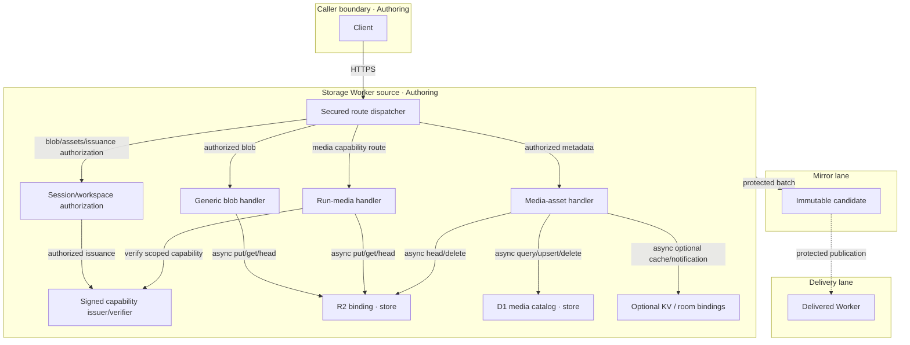

# Reference implementation: agentic-graph Artifact and Media Storage Architecture

## Authority and readiness

This document owns only the implemented source contract for binary blob/media routes in the
agentic-graph storage Worker. It does not make the storage Worker, bucket, endpoint, authentication
policy, provider ingest, or delivery surface production-ready.

The public Worker dispatches through `storagePublicRouteSecurity.ts` before calling the binary
handlers. Outside explicit local-runtime mode, the three route families are deliberately distinct:

- generic blobs require an active workspace session and the role appropriate to read or write;
  keys remain workspace/path addressed and overwriteable;
- run media requires an HMAC-SHA-256 capability scoped to workspace, object key, operation,
  user, and expiry; reads also verify R2 workspace/schema metadata;
- media-asset listing requires workspace read access; mutations require write access. Persisting
  an asset verifies its R2 workspace metadata and issues a signed read URL.

The legacy unsigned `{runId, expiresAt}` helper remains an explicit local-runtime fallback, not
an alternative public authorization path. Local mode cannot mint production media capabilities.
Source dispatch is not delivery evidence: local readiness remains `spec-complete` and delivered
readiness remains `undocumented`.

**Browser compatibility candidate — undelivered:** reuse the existing cookie-aware session reader
for workspace blobs, capability issuance and media-asset routes, with the existing browser-session configuration,
active-user, workspace-role, and exact-origin cookie-mutation checks. Route media and generic binary fetches
through `getClientFetch` for browser same-origin enforcement and credentials. The companion write
namespace contract below is required; chat, canonical document and room routes retain their
existing credential boundaries. Local validation remains pending; this establishes neither payment
entitlement nor deployment.

## Scope

In scope:

- R2 object-key construction and path validation;
- generic blob upload/read behavior;
- run-media upload/read behavior;
- media-asset list/persist/rename/delete behavior;
- current auth and overwrite semantics;
- replay URLs, metadata, limits, failures, VCCs, and delivery blockers.

Out of scope:

- model/provider generation and ephemeral URL download;
- payment entitlement;
- D1 document/sync schema;
- collaboration-room authorization;
- proof that any configured Worker or bucket is delivered.

## Invocation Register: Storage binary routes

| Route | Kind | Owner | Typed arguments | Trust boundary | Token cost |
|---|---|---|---|---|---|
| `/api/storage/blob/{workspaceId}/{canonicalPath}` | HTTP route | `storagePublicRouteSecurity.ts` → `blob.ts` | path strings; body; content type; optional content hash; max bytes from environment | active session and workspace read/write role before handler dispatch; explicit local bypass | 0 |
| `/api/storage/media/{namespace}/runs/{runId}/{stageId}/{shotId}.{ext}` | HTTP route | `storagePublicRouteSecurity.ts` → `storageMediaCapability.ts`; local fallback `media.ts` | media path; body; content type/hash; `x-agentic-graph-media-capability` header or `agentic_os_media_capability` query | signed object/operation/expiry claims; R2 ownership metadata on read; legacy run token only in explicit local mode | 0 |
| `/api/storage/media/assets` | HTTP route | `storagePublicRouteSecurity.ts` → `mediaAssetSync.ts` | GET workspace/limit; POST typed artifact record; PATCH workspace/artifact/name; DELETE workspace/artifact | active session and workspace role; POST checks R2 workspace ownership and replaces caller-supplied access URL; explicit local fallback | 0 |
| `/api/storage/media-capabilities` | HTTP route | `storagePublicRouteSecurity.ts` → `storageMediaCapability.ts` | POST workspace id, object key, read/write operation, integer TTL seconds | active workspace session with matching role; configured signing secret; local principal denied | 0 |

This is the sole declaration site for these binary routes and their capability issuer. Owners above
are relative to `cloudflare/workers/agentic-graph-storage/`. Other documents may link to this register
but must not redefine their arguments or trust boundary.

## Topology: Binary storage v2.2 — 2026-09-06

| Node | Role | Type | Lane | Connects to | Connection | Data residency |
|---|---|---|---|---|---|---|
| Client | Producer/Consumer | browser/tool host | Authoring | Storage Worker | HTTPS | caller device |
| Storage Worker | Gateway | Worker source | Authoring | R2 binding | in-process binding call | configured Worker region |
| Generic blob handler | Router | function | Authoring | secured dispatcher, R2 binding | workspace authorization + async put/get/head | request memory |
| Run-media handler | Router | function | Authoring | capability verifier, R2 binding | async signature verification + put/get/head | request memory |
| Media-asset handler | Router | function | Authoring | secured dispatcher, D1, R2, optional KV/room | workspace authorization + async binding calls | request memory |
| R2 bucket | Store | object store | Authoring until separately delivered | handlers | provider binding | configured bucket region |
| D1 media catalog | Store | relational records | Authoring until separately delivered | media-asset handler | provider binding | configured database region |
| Optional access/room stores | Store/Gateway | KV and room binding | Authoring until separately delivered | media-asset handler | provider binding/internal fetch | configured provider regions |
| Mirror artifact | Store | immutable release candidate | Mirror | Delivery | protected batch | mirror artifact store |
| Delivered Worker | Gateway | optional public runtime | Delivery | configured bucket | HTTPS + provider binding | declared delivery region |

**Version note**: v2.2 corrects the public dispatch boundary: signed capabilities and workspace
checks already precede the legacy handlers. The browser-cookie and workspace-write namespace
candidate remains undelivered. Objects remain overwriteable; neither capabilities nor media records prove payment entitlement or
RunManifest Durable Object verification.

## Data Flow: Generic blob

| Stage | Component | Input | Output | Persistence | Error handling |
|---|---|---|---|---|---|
| Authorize | secured dispatcher | session + workspace + method | read/write access | D1 session/membership read | reject before handler/body storage |
| Ingest | route parser | workspace id + canonical path | normalized route | none | 400 on missing/traversal/control characters |
| Transform | key builder | normalized route | `workspaces/{encodedWorkspaceId}/{canonicalPath}` | none | fail before bucket access |
| Store | blob upload | body + metadata | R2 object/etag | overwriteable at same key | 400 size limit; 500 missing binding |
| Serve | blob read | same path | bytes/metadata | no-store response | 404 missing object |

`POST` writes with `bucket.put`. The optional content hash is metadata only: the current handler
does not compare it, deduplicate, reject overwrite, or make the object immutable.

## Data Flow: Run media

| Stage | Component | Input | Output | Persistence | Error handling |
|---|---|---|---|---|---|
| Ingest | route parser | namespace/run/stage/shot path | R2 key | none | 400 malformed key |
| Issue | secured dispatcher | session + workspace/object/operation + TTL | signed capability | D1 session/membership read | 401/403 auth; 503 signing unavailable |
| Transform | capability verifier | header/query capability + path + operation | verified scoped claims | none | 403 missing/forged/expired/mismatched capability |
| Store | media write | bytes + optional hash metadata | R2 object/etag + workspace/user/schema metadata | overwriteable at the signed key | 500 missing binding |
| Serve | media read | verified capability + matching R2 workspace/schema metadata | bytes/metadata | private, no-store response | 403 ownership mismatch; 404 missing object |

The capability contains schema, workspace id, object key, operation, subject user id, issued/expiry
timestamps, and nonce. The issuer clamps TTL to 30–900 seconds (default 300); signing requires at
least 32 UTF-8 bytes in `AGENTIC_OS_STORAGE_SIGNING_SECRET`. Verification checks the signature,
object/operation, and time bounds. It does not re-check D1 membership at use time, revoke issued
capabilities on session change, or enforce payment entitlement. Explicit local mode retains the
legacy unsigned run-id/expiry behavior and must not be exposed as the delivered security boundary.

**Selected namespace candidate — local validation pending:** the shared native
`buildAgenticGraphStorageMediaWorkspace` derives the full SHA-256 key from the trimmed, otherwise
exact workspace id and returns the prefix `airvio/workspaces/<key>`. New upload object keys use
that prefix, and run ids begin with `<key>-` so global D1 artifact ids do not collide across
workspaces. Write capability issuance, write verification and asset POST all require this identity.
POST also matches the supplied run, stage and shot to the actual key. Existing write tokens for unscoped keys are rejected; existing objects
are not rewritten. Legacy signed reads remain available only with matching R2 workspace/schema
metadata. This is deterministic namespace isolation, not conditional R2 writes or distributed
same-workspace compare-and-swap; authorized writes to the same key remain overwriteable.

## Data Flow: Media-asset metadata

| Stage | Component | Input | Output | Persistence | Error handling |
|---|---|---|---|---|---|
| List | secured dispatcher + media-asset handler | GET session + workspace id + limit | artifact ids, object/public paths, run/stage/shot ids, hashes, provenance | D1 read | 400 missing workspace; 401/403 session/role failure |
| Persist | secured dispatcher + media-asset handler | session + typed record | artifact record, signed read URL, binding statuses | D1; R2 must already contain workspace-owned object; optional KV/room | 401/403 session/role/ownership failure; 503 signing unavailable; explicit binding status |
| Rename | secured dispatcher + media-asset handler | session + workspace/artifact/name | updated provenance | D1 | 401/403 session/role failure; 404 missing record |
| Delete | secured dispatcher + media-asset handler | session + workspace/artifact | deletion status | D1 and R2 | 401/403 session/role failure; 404 missing record; missing binding surfaced |

The public dispatcher authorizes caller-supplied workspace ids before delegating. POST verifies
R2 workspace ownership and replaces the caller's `presignedUrl` with a newly signed read URL.
Stored D1 paths retain their raw-key representation. Outward paths encode each segment once;
listing and deletion preserve literal percent sequences without selecting a different object.
Only explicit local-runtime mode delegates to the legacy unauthenticated listing/run-token mutations.
The proposed browser-cookie path must retain these workspace and object checks unchanged.

The selected upload candidate requests a write capability, uploads bytes, then persists the asset.
It uses the authoritative signed read URL returned by asset persistence, removing the redundant
pre-upload read-capability request. This saves one sequential request, capability signature, and
session/workspace authorization round per upload without changing TTL limits or adding a resource
or dependency. Local validation of the combined flow remains pending.

Renaming obtains a fresh signed read URL before returning the artifact to the browser. Generic
binary artifacts use the bounded workspace blob route and the same configured browser session;
they do not acquire media catalog records. Browser replay tests use the existing durable IndexedDB
fixture because the runtime intentionally skips cloud synchronization for memory-only storage.

## Interface contracts

| Interface | Input | Output | Invariants |
|---|---|---|---|
| Generic blob upload | POST session, body, workspace/path, optional hash, content type | JSON object key/path/etag/size | workspace write role; max-byte limit; normalized path |
| Generic blob read | GET/HEAD session, workspace/path | bytes or headers | workspace read role; same deterministic key; no-store |
| Run-media write | PUT/POST body, media path, signed capability | JSON metadata | valid object/write/expiry claims before bucket access; candidate additionally requires the workspace prefix at issuance and use |
| Run-media read | GET/HEAD media path, signed capability | bytes or headers | valid object/read/expiry claims; matching R2 workspace/schema metadata |
| Media-asset list | GET session, workspace id + limit | JSON artifact metadata | workspace read access; no payment entitlement claim |
| Media-asset persist/rename/delete | session + typed JSON/query | JSON record/status | workspace write access; POST R2 ownership; D1/R2 and optional binding outcomes explicit |

## Component VCCs

| VCC | End state | Stated check | Constraint | Evidence Reference | Local rung | Delivered rung |
|---|---|---|---|---|---|---|
| VCC-M1 | generic blob positive/negative/key/limit/overwrite behavior is asserted | `npm run storage:relay:test` includes public route session/role/stream checks; complete key/HEAD/overwrite coverage still requires evidence | authorization does not imply immutability | not recorded for this revision | `spec-complete` | `undocumented` |
| VCC-M2 | run-media public dispatch verifies signed capability claims; local fallback retains run-id/expiry checks | `npm run storage:relay:test` covers signed public access; `node --test cloudflare/workers/agentic-graph-storage/__tests__/media.test.mjs` covers the legacy helper; candidate namespace/old-write-token rejection and legacy-read evidence remains pending | local helper checks alone do not prove public authorization or entitlement | not recorded for this revision | `spec-complete` | `undocumented` |
| VCC-M3 | media-asset D1 records preserve workspace scope, version, content hash, and provenance | `node --test cloudflare/workers/agentic-graph-storage/__tests__/mediaArtifacts.test.mjs` exits 0 | database behavior alone does not prove HTTP-route auth | not recorded for this revision | `spec-complete` | `undocumented` |
| VCC-M4 | media-asset list and mutations match current D1/R2/KV/room and auth semantics | `npm run storage:relay:test` includes authorized listing/persistence and cross-workspace rejection; browser-cookie and rename/delete evidence remains pending | scoped browser session reuse must preserve role/ownership checks | not recorded for this revision | `spec-complete` | `undocumented` |
| VCC-M5 | delivery-grade media auth uses a signed/issuer-verified token or server-side workspace/run entitlement lookup | `npm run storage:relay:test` includes forged-capability and unauthorized-workspace rejection; exact deployed policy still requires live evidence | zero unauthenticated metadata/byte reads or writes on a delivered route | not recorded for this revision | `undocumented` | `undocumented` |
| VCC-M6 | delivery proof binds an exact Worker revision, stores, routes, auth policy, and rollback | protected live route/security check records exact result | no source test promotes delivered rung | not recorded | `spec-complete` | `undocumented` |

## Security and delivery blockers

- Public source authorization depends on the secured dispatcher, active sessions/memberships,
  signing configuration, and explicit local-runtime bypass being disabled in delivery.
- The browser-cookie candidate needs local positive/negative checks for same-origin mutations,
  missing/expired sessions, inactive users, workspace roles, and unchanged non-media boundaries.
- The namespace candidate requires cross-workspace R2/D1 collision and previously issued write-token
  rejection checks, plus legacy owned-read compatibility; no existing object migration is implied.
- Signed media URLs are bearer capabilities until expiry; they do not prove payment entitlement,
  immediate revocation, or immutability.
- CORS permits `*`; this is not authorization.
- Content hashes are descriptive metadata, not integrity enforcement.
- Neither source presence nor local tests prove a private bucket or delivered route.
- Delivery remains closed until exact deployment/binding/auth and rollback evidence is recorded.

## TCO comparison

| Model | Infra/month | 12-month estimate | Security/ops burden | Disposition |
|---|---:|---:|---|---|
| local fixture/file artifacts | $0 | $0 | low; operator custody | default authoring fallback |
| managed Worker + object store | $0–25 | $0–300 | medium; auth, retention, egress, rollback | optional after VCC-M3/M4 |
| FOSS self-hosted object service | $10–80 | $120–960 | high; patching/backups/auth | portability alternative |
| hybrid local + managed media | $0–35 | $0–420 | high boundary complexity | only with measured value |

All paths use zero LLM tokens for storage and replay.

## Lane and deploy boundaries

| Boundary | From lane | To lane | Evidence Reference | Operator instruction | Rollback statement/check | State |
|---|---|---|---|---|---|---|
| `STORAGE-SOURCE-TO-MIRROR` | Authoring | Mirror | security/unit candidate result `not recorded` | `none` | discard candidate; rerun VCC-M1–M5 checks | `closed` |
| `STORAGE-MIRROR-TO-DELIVERY` | Mirror | Delivery | exact live route/security result `not recorded` | `none` | restore prior Worker revision/config; rerun auth/read/write probes | `closed` |

The production Pages release does not deploy this Worker. Worker deployment requires a separate
operator instruction, evidence set, and rollback record.

## Reference implementation owners

- Dispatcher: `cloudflare/workers/agentic-graph-storage/index.ts`
- Generic blobs: `cloudflare/workers/agentic-graph-storage/blob.ts`
- Run media: `cloudflare/workers/agentic-graph-storage/media.ts`
- Media-asset catalog/sync: `cloudflare/workers/agentic-graph-storage/mediaAssetSync.ts`
- Media-asset D1 records: `cloudflare/workers/agentic-graph-storage/mediaArtifacts.ts`
- Public route security: `cloudflare/workers/agentic-graph-storage/storagePublicRouteSecurity.ts`
- Signed capabilities: `cloudflare/workers/agentic-graph-storage/storageMediaCapability.ts`
- Session/workspace checks: `cloudflare/workers/agentic-graph-storage/storageSyncSecurity.ts`
- Cookie mutation/configuration checks: `cloudflare/workers/agentic-graph-storage/storageBrowserSession.ts`
- Local legacy token check: `cloudflare/workers/agentic-graph-storage/mediaAuth.ts`
- Browser media caller: `canvas/src/lib/storage/uploadedMediaStorage.ts`
- Browser fetch boundary: `canvas/src/lib/storage/agentic-graph-storage-client-transport.ts`
- Route constants/types: `cloudflare/workers/agentic-graph-storage/contract.ts`
- Public dispatch tests: `cloudflare/workers/agentic-graph-storage/storage-relay/storagePublicRouteSecurity.test.ts`
- Handler tests: `cloudflare/workers/agentic-graph-storage/__tests__/mediaArtifacts.test.mjs` and
  `cloudflare/workers/agentic-graph-storage/__tests__/media.test.mjs`
- Wider storage contract: `docs/documents/agentic-graph-storage-sync-document.md`
