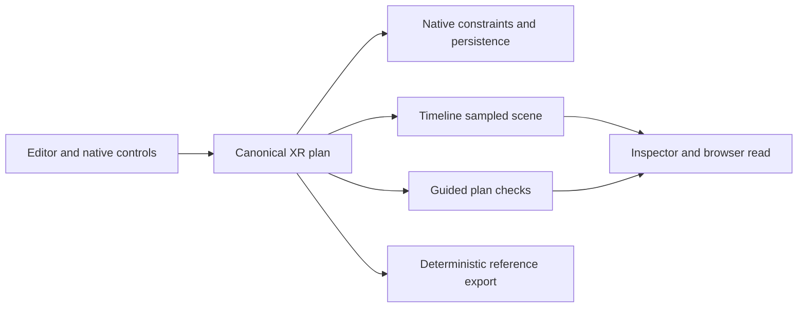

# agentic-graph Choreography Studio

## Source ownership and grounding

This is the editable product specification for an authored spatial rehearsal
workspace: arrange a stage, ask bounded questions about its objects, test a
movement plan, inspect feedback, and export a reusable reference. Its semantic
scene is an interactive digital model of authored space. It is not a measured
copy of a physical room, live sensor state, or evidence that a rehearsal ran.

All five roles join at **CHOREOGRAPHY-STUDIO-001@1.3.0**. This revision clarifies
save/export/offline boundaries and adds acceptance scenarios. Grounding baseline: Graph
`2874751715a1e1f0a12c06415141a93c894c9d90`, the merged Choreography source from
[PR #1223](https://github.com/huijoohwee/agentic-graph/pull/1223). Runtime source
was inspected at that revision; the upstream workflow was read at Agentic OS
`f8d00dd13242d7d83bae0276837268286b550bf0`. An upstream workflow read does not
change Graph's installed dependency pin. Refresh grounding when these owners
change. Historical checks remain bound to their original source revisions.

The [XR Motion Reference](agentic-graph-xr-motion-reference-document.md) and
[Python learning plan](prd-tad-adr-mvp-gtm-offline-python-learning-workspace.md)
retain their runtime/learning ownership. Paths below are repository-relative;
bare XR filenames mean `canvas/src/features/three/`.

| Concern | Actual source owner | Verified source behavior / limit |
|---|---|---|
| Editor and Canvas | `canvas/src/features/markdown-workspace/main/MarkdownWorkspaceMain.tsx` | Shared source-file editor and Canvas pane; no new application shell. |
| Plan and draft | `canvas/src/features/three/xrMotionReferenceModel.ts`, `xrMotionReferenceRuntime.ts` | One normalized persisted plan and one runtime snapshot. |
| Stage and Timeline | `canvas/src/features/three/XrMotionReferenceStage.tsx`, `xrMotionReferenceTimeline.ts` | Stage projection and existing playhead authority. |
| Movement constraints | `canvas/src/features/three/threeKeyboardChoreography.ts`, `xrConstrainedMotionEdits.ts` | Native bounds, swept peer collision, and physics-ownership checks. |
| Authoring UI | `canvas/src/features/three/XrChoreographyInspector.tsx`, `XrAnimationFloatingPanelView.tsx`, `XrCameraMotionSection.tsx` | Existing FloatingPanel and BottomPanel projections. |
| Semantic scene | `canvas/src/features/three/xrSceneSemantic.ts` | Pure authored-plan projection and category, nearest, within queries; no physical reconstruction. |
| Guided feedback | `canvas/src/features/three/xrSceneExercises.ts` | Three plan checks using native motion/physics safety; no persistent lesson progress or executed-run grade. |
| Local agent controls | `canvas/src/features/three/xrSceneMcpRuntime.ts`, `xrSceneMcpContract.mjs`; `canvas/src/features/agent-ready/xrSceneWebMcpTools.ts`, `webMcpRuntime.ts` | Existing browser inspection/control seam; no dedicated semantic-query tool. |
| Save and package | `canvas/src/features/three/xrScenePersistence.ts`, `xrMotionReferencePackage.ts` | Graph metadata save acknowledgement and deterministic JSON reference compilation; durability and reimport are separate. |
| Procedural execution | `canvas/src/features/python-learning/pythonParser.ts`, `pythonEvaluator.ts`, `pythonWorker.ts`, `learningRuntime.ts` | Existing bounded Python subset in a terminable worker; no Studio adapter observed. |
| Learning result and storage | `canvas/src/features/python-learning/learningProtocol.ts`, `learningLessons.ts`, `learningPersistence.ts` | Bound run identity, three original lessons, rubric and local workspace debriefs. |
| Application cache | `canvas/vitePwaRuntimeCachePolicy.ts`, `canvas/vite.config.ts` | General asset caches; no generic offline navigation fallback. |
| Learning tools and offline assets | `canvas/src/features/python-learning/learningToolContract.mjs`, `learningWebMcp.ts`; `canvas/vitePythonLearningOffline.mjs` | Separate inspect/control and cache owners; their presence does not prove Studio offline closure. |

Original native behavior and assets are the implementation inputs. Do not copy
third-party code, schemas, lessons, branding, or prose, add their services or
packages, or introduce external runtime dependencies for this capability.

## PRD

### User, pain, and smallest valuable result

Target a facilitator preparing a short movement demonstration in a mobile or
desktop browser. Paying for a reusable reference that reduces setup/explanation
time is a buyer hypothesis; interviews, savings, willingness to pay and payment
remain unverified.

| Priority | Buyer pain hypothesis | Near-built response | Evidence still needed |
|---|---|---|---|
| P1 | Placement, timing, and camera instructions disagree across separate references. | Reuse the XR plan, Timeline, and deterministic export as one handoff. | Observe an operator complete and reopen one reference. |
| P2 | A facilitator cannot explain what is near a subject or why its route fails. | Expose native scene entities and the three plan checks in the existing inspector. | Observe correct interpretation of query and constraint feedback. |
| P3 | Connectivity interrupts repeat practice or loses authored work. | Reuse local persistence and installed assets; verify disconnected reload. | Full Studio cache, save, reopen, and export proof on mobile and desktop. |
| P4 | Procedural practice and assistant advice disagree with the visible scene. | Consider a bounded adapter to the existing learning runtime after P1–P3. | Exact scene/run/grade correspondence; buyer need for coding. |

Rank by reuse and implementation distance; market size/ROI are unmeasured.
The $1 artifact experiment needs no new billing code or paid infrastructure.

### MVP scope and interaction

1. Keep the existing Editor Workspace and Canvas available; select XR Surface
   Mode, an original stage, and catalog subjects. No account or model call is
   required by the core rehearsal loop.
2. Place and label subjects, assign an available motion, and author bounded
   cast/camera marks through the canonical plan.
3. Inspect the authored scene at the Timeline playhead: filter a category,
   identify a selected subject's nearest entity, or inspect a bounded radius.
4. Adjust marks through existing pointer, keyboard, or browser-local controls;
   retain native stage, collision, Timeline, and physics ownership.
5. Read the three guided checks, repair missing setup or a blocked path, then
   rehearse, pause, and scrub with the shared Timeline.
6. Save the authored document through its native workspace owner and export
   the deterministic JSON motion-reference package; verify each result separately.
7. After a verified installation, reload the saved document with network
   disabled and confirm labels, marks, inspection, and export still agree.
   Downloading a reference package is not an editable-scene restore operation.

At 375 px, use existing pane controls without losing selection/playhead. Touch
must cover the flow without a keyboard. Layout, focus, screen-reader feedback
and touch usability still require browser evidence.

### Scope boundaries

The Must slice is authored scene inspection and rehearsal, with offline proof
still outstanding. Procedural execution already exists separately; bringing
arbitrary Studio scenes into it is a proposed extension, not delivered scope.

Excluded: automatic capture/reconstruction, inferred identities, retained
camera frames or pose history, physical device control, unrestricted Python or
desktop package compatibility, new SQL storage, hosted classrooms, accounts or
rosters, remote execution, paid inference, billing, publication, and deployment.
Rendered video is outside this acceptance slice; adjacent native export work
must retain its own runtime and browser evidence.

### Acceptance criteria

Owner checks are targets until the evidence register records a result.

| ID / pain | Given / when / then | Owner check / boundary |
|---|---|---|
| CS-01 / P1 | Given an active authored document, place or relabel a subject; exactly one normalized plan persists through graph metadata. | `xrChoreographyOwnership.test.tsx`; T1 / ADR-2. |
| CS-02 / P1 | Given a selected cast mark, request pointer, keyboard, or agent movement; the same constrained owner applies the displacement or reports rejection. | `xrKeyboardChoreography.test.ts`, native motion-constraint tests; T1 / ADR-2. |
| CS-03 / P1 | Given rehearsal, play/pause/scrub; Timeline owns sample time and competing writes obey native playback/physics fences. | `xrTimelineRehearsalControls.test.tsx`, `xrAnimationRuntime.test.ts`; T1 / ADR-2. |
| CS-04 / P1 | Given identical normalized plan, graph, document name, and compiler revision, export twice; JSON bundle bytes match without a network or model request. | `xrMotionReferencePackage.test.ts`; browser egress check still required; T1 / ADR-3. |
| CS-05 / P2 | Given an active scene, inspect through UI and browser tool; both describe the same authored revision; control uses existing guarded owners. Absent WebMCP leaves manual UI usable. | XR agent-ready scope/availability tests and browser parity; T3 / ADR-2. |
| CS-06 / P2 | Given a complete scene, query category/nearest/radius; stable IDs and sampled positions share revision/time. Invalid, missing-subject, and partial-scene cases fail explicitly. | `xrSceneSemantic.test.ts`; bounded query edge coverage remains to be expanded; T2 / ADR-4. |
| CS-07 / P2 | Given eligible marks, obstacle, camera anchor, and fixed physics state, evaluate; all three states follow T2 and identify the evaluated subject, without claiming an executed lesson or physical safety. | `xrSceneSemantic.test.ts` and native constraint tests; T2 / ADR-4. |
| CS-08 / P3 | Given a verified installed cache and saved scene, disable network and reload; subjects, marks, inspector, and export agree. Eviction or failed save is visible and never reported as durable success. | Disconnected desktop/375 px save-reopen-export proof, quota/upgrade negatives; T4 / ADR-3. |
| CS-09 / P1–P3 | Given the installed MVP, a first-time operator completes the seven-step flow on desktop and mobile without facilitator edits or hidden state loss. | Timed browser/accessibility pilot; T4 / ADR-3. |

CS-01–CS-09 define the MVP. **CS-10 is conditional future scope:** given an
explicitly selected supported Studio scene and source revision, a learning run
must bind their identities, replay deterministically, grade the same result,
stop visibly, and reject stale results after any source/scene switch. It cannot
be marked implemented until the T5 adapter and its own negative tests exist.

## TAD

### T1 — One authored plan and native authority

`graphData.metadata.kgXrMotionReference` is the persisted plan boundary. The
Editor Workspace owns source files and pane visibility; XR draft state projects
the plan. Timeline owns playhead; movement and physics owners decide whether an
edit is permitted. Panels, pointer, keyboard, and local agent controls call
those owners. No second timeline, scene database, or movement resolver is added.

Current normalized limits are 48 subjects, 12 cast tracks, 32 marks per cast
track, 32 camera marks, and 30 seconds duration. Coordinates are bounded to
50 m in magnitude, with nonnegative authored height. These are input limits,
not mobile performance guarantees. Inspect the model constants on drift.



### T2 — Semantic scene and guided feedback

`projectXrStudioScene` emits `agentic-graph-xr-studio-scene/v1`: `source` is
`authored-plan`, with runtime `revision`, `stageId`, clamped `timeSeconds`,
`complete`, and entities containing `id`, `kind`, `category`, `label`, `position`,
and `sizeMeters`. Subjects retain plan IDs; structures use `stage:<id>`.
Positions sample native cast marks at the playhead, falling back to authored
subject placement. Sizes use catalog dimensions and scale. This projection
does not read live physics poses, rotation-aware clearance, camera capture, or
measured room geometry; collision authority remains the native constraint owner.

| Query behavior | Current implementation |
|---|---|
| Category | Trim/lowercase input; reject empty or longer than 40 characters; match exact category. |
| Nearest | Require a subject ID; exclude that subject; choose minimum XZ center distance, with ID tie-break. |
| Within | Require a finite three-number center and radius from 0 to 50 m inclusive; use XZ center distance. Height and object extents do not affect the answer. |
| Bounds | Project at most 64 structures; set `complete=false` when structures exceed 64 or combined entity count exceeds 64. Queries return no matches with `partial-scene`. |
| Result | Return `ok`, optional `reason`, `sceneRevision`, `timeSeconds`, and at most 64 matches; unknown queries and missing subjects fail explicitly. |

The inspector offers fixed category choices and 1, 2, or 5 m radii around the
selected subject. It excludes that subject from the displayed nearby count;
the pure radius query includes it. The result count covers all matches, while
only the first eight labels are shown. Nearest may return a stage structure.
These UI controls do not expose arbitrary centers or the full 0–50 m API range.

An empty successful category result means no matching authored entity. An
incomplete projection is not an empty room. The raw projection may contain more
than 64 entities even though queries refuse that inventory; do not describe the
whole inspection payload as capped at 64 or silently claim complete coverage.

`evaluateXrStudioExercises` emits `agentic-graph-xr-studio-exercises/v1`, the
scene revision, evaluated subject ID, and three feedback records. It chooses
the selected cast track with at least two marks, otherwise the first eligible
track; the UI must make the evaluated subject clear.

| Check | Actual pass condition, in addition to native path safety |
|---|---|
| `reach-mark` | First-to-last displacement is at least 0.5 m in XZ. |
| `avoid-subject` | A different stationary subject lies within 3 m of the cast path's XZ segments; it has no cast track with more than one mark. |
| `sync-camera` | A camera mark anchors to the evaluated subject within 0.25 seconds of its final cast mark. |

Missing prerequisites produce `needs-work`; an unsafe eligible path produces
`blocked`; satisfied prerequisites plus native safety produce `passed`. The
safety owner reads scene-matched physics phase/frame and body ownership; this
report is not a pure function of the plan or revision number alone. The current
report carries no physics-frame identity. Compare UI/tool results with physics
stopped or the same observed state; do not cache a pass by scene revision alone.
The inspector memoizes by XR snapshot, so physics-only refresh parity and visible
evaluated-subject identity remain S1 checks. These are plan observations, not
executed lessons, learner achievements, traversed distances, or framing proof.

### T3 — Headless queries, browser tools, and invocation

Scene projection/query functions are pure and headless. Exercise evaluation
is callable without UI rendering but consults the native constraint/physics owner. Existing WebMCP registration exposes
`agentic-graph.inspect_local_xr_scene_assets` and
`agentic-graph.control_local_xr_scene` through native browser owners.
Inspection returns `sceneReady` and, when ready, `studio.scene` plus
`studio.exercises`; otherwise `studio` is null. Inspection accepts no category,
nearest, or radius parameters today. The inspector calls the pure query
function directly; a dedicated parameterized tool is not implemented.

The existing `/xr.stage @environment`, `/xr.place @asset`, and
`/xr.transform @subject #transform` grammar comes from `xrSceneMcpContract.mjs`.
Use registry-provided schemas and actual IDs rather than inventing command
aliases. `/` selects an operation, `@` its target, and `#` the declared semantic
facet. A label or imported document is data, never agent authorization.

Agents inspect before explaining or invoking a requested native action. Queries
and feedback require no model call. Retain document, scope, deadline and lifecycle
fences; a revision field alone is not compare-and-set write protection. Future
stale-write fencing needs its own implementation/tests. Browser WebMCP does not
prove remote HTTP/stdio control parity.

### T4 — Local continuity and failures

`persistXrScene` writes serialized motion data through `updateGraphMetadata`,
checks the in-memory value, and marks the draft saved. The graph owner updates
the active Markdown document. Neither that boolean nor the draft's clean flag
acknowledges durable browser storage; CS-08 must reopen the actual saved source
through the workspace owner after a fresh page load.

The reference compiler returns one JSON bundle containing nine virtual files:
manifest, subjects, cast tracks, camera track, diagnostics, frame samples, stage
SVG, generator brief, and README. It does not download nine files or render a
video. Its eight-hex graph/motion fingerprints are deterministic labels, not
cryptographic integrity or authorization proofs. No Studio package importer was
found in the inspected owners; retain the editable source document separately.

Offline installation is a prerequisite still to prove. `vite.config.ts` sets
`navigateFallback: null`; general script/style/worker caching is bounded and
uses background revalidation. The dedicated offline navigation route and atomic
asset closure belong to Python learning. They do not establish an installed
Studio route. S1 must identify the real route, service-worker revision, complete
lazy asset closure, and durable document before testing disconnected reload.
An uncached visit or another feature's smoke is insufficient. Reuse these owners
for any repair; add no independent cache, database, or application shell.

| Failure | Required outcome / evidence gap |
|---|---|
| Malformed plan/mark | Normalize supported values or reject before mutation through the native model. |
| Boundary, collision, physics-owned body, or competing playback writer | Native owner rejects/clamps as applicable; expose the actual outcome. |
| Incomplete inventory or invalid query | Preserve explicit failure and coverage state; do not imply a complete answer. |
| Missing scene/document or unavailable browser tool | Report unavailable; manual controls remain the fallback. |
| Failed export | Preserve plan and report error; no successful download claim. |
| Save failure, quota, cache eviction, partial upgrade | Preserve available authored data/export recovery; report missing durability or installation. Studio browser proof pending. |
| Document switch after inspection | Reinspect current owner before applying any follow-up; do not reuse another document's IDs. |

No telemetry, credentials, camera frames, or learner identity are required.
Cross-device handoff may share the reference as data. Resuming editing requires
a separately verified source-document export/import through the workspace owner;
package reimport and automatic concurrent synchronization are not MVP promises.

### T5 — Conditional procedural learning adapter

Reuse the native Python subset, worker, simulation, rubric, debrief store, and
tool registry. Existing lessons are `travel`, `route`, and `sense`; tools are
`inspect_local_python_learning` and `control_local_python_learning`. Inspection
never executes or saves. Controls bind workspace/document, source/scene digests,
lesson/runtime revisions, seed, run and request IDs. Worker generation/run fences
and document-change termination remain with that owner.

Its 1/60-second ticks, 8 m bound, and 0.2 m radius do not match arbitrary Studio
footprints and timing. No adapter was found. Conditional CS-10 must:

1. Bind a supported scene subset, plan/document revision, IDs, units, coordinate
   convention and digests; reject unsupported geometry/transforms.
2. Keep worker ticks with learning and authored marks/time with XR. Import a
   reviewed result only through existing constrained plan operations.
3. Prove Run/Step equivalence, replay, grading, stop, negative solutions,
   stale-result rejection and UI/tool parity; Studio plan checks are not grades.
4. Reuse debrief persistence; source/scene changes invalidate run evidence.
   Imported debriefs never execute source.

Current limits: 32 KiB source, 4,096 AST nodes, 50,000 steps, 7,200 ticks and
5,000 ms compute. They prove neither latency nor full Python compatibility.
Trace/debrief bounds stay with learning; a Studio adapter must bound its own
payloads. Add no desktop toolkit, SQL store, interpreter, or duplicate grader.

## ADR

| Decision | Rationale / consequence | Join |
|---|---|---|
| ADR-1 — Graph owns this plan | Source/tests live here; pinned projections remain read-only. | All CS; grounding table. |
| ADR-2 — Native plan and controls | One Timeline and constraint owner prevents competing UI/tool writes. | CS-01–05; T1/T3. |
| ADR-3 — Local offline MVP | Reuse installed assets, workspace and export; require disconnected proof. | CS-04/08/09; T4. |
| ADR-4 — Derived semantics/feedback | Reuse metadata and native safety; add no measured-room claim, model dependency or progress store. | CS-06/07; T2. |
| ADR-5 — Defer learning adapter | Geometry/time/rubric differ; prove a narrow mapping first. | CS-10; T5. |
| ADR-6 — Separate source and export | Metadata acknowledgement and reference JSON do not prove durable reopen or reimport. | CS-01/04/08; T4. |

Revisit on observed need or failed acceptance. Free-tier use and FOSS licensing
are separate gates; unknown license/cost blocks a new component. This revision
adds zero packages, runtime modules, hosting, or model requirements.

## MVP and GTM choreography

### Demonstration and delivery order

Use the existing source fixture as the first original rehearsal: `tropical-playground`,
4 s duration, selected `actor` using `character-pig` at `[0,0,0]`, stationary
`obstacle` using `furniture-table` at `[4,0,0]`, cast marks at 0 s / `[0,0,0]`
and 2 s / `[2,0,0]`, and a camera mark anchored to `actor` at 2 s. Fix physics
state before comparisons. This fixture already exercises the source harness;
its browser/mobile equivalents and the additional boundary rows remain targets.

| Scenario / join | Expected observation and retained proof |
|---|---|
| Inspect at 2 s / CS-05–07 | Actor position `[2,0,0]`; furniture query returns `obstacle`; nearest is `obstacle`; 0.1 m pure radius query includes only `actor`; all three plan checks pass. Record plan and physics state, revision, time, IDs, and UI/tool responses. |
| Repair / CS-02, CS-07 | Remove camera marks: camera check needs work. Keep one cast mark: all need work. Use a native rejected motion: show its reason and preserve accepted marks. Record before/after, without forcing a prohibited edit to manufacture a pass. |
| Query boundaries / CS-06 | Missing subject, invalid radius, and incomplete inventory return their explicit reasons. Add 0/50 m inclusive, >50 m, equal-distance ID tie, and changed-height cases; preserve XZ semantics and coverage state. |
| Selection/physics / CS-05, CS-07 | Select an ineligible track: identify the actual fallback subject. Change physics ownership without editing marks: inspect again and verify displayed feedback agrees. Any stale UI result is a repair finding. |
| Save/export / CS-01, CS-04 | Relabel Actor to Lead, save source, export twice with identical inputs, and compare bytes. Reopen source through the actual workspace; verify labels and marks. Do not use a store reseed as durable-storage evidence. |
| Offline/mobile / CS-08–09 | On desktop and 375 px touch, finish the seven-step flow, close/reload offline, then inspect/export. Record browser/device, installed revision, network failures, storage readback, focus/labels, elapsed time, and lost-state/intervention count. Exercise cache eviction and failed save separately. |

Store source revision, test IDs/commands, fixture digest, result, and failure
artifacts together. Record unavailable prerequisites as blocked observations;
source tests, browser proof, and pilot outcomes retain their own evidence.

| Slice | Change / cap | Exit evidence |
|---|---|---|
| S0 — This specification | One Markdown file, <500 lines and 32 KiB; zero runtime modules/dependencies; 15-minute active revision budget, refresh on preflight or source drift. | Grounded path/claim review, continuity joins, affected documentation checks, preserved historical evidence. |
| S1 — Prove the existing rehearsal | One 60-minute verification sprint; change at most four owning source modules and 24 KiB only if a concrete failure needs repair; no new dependency. | CS-01–CS-09 with exact source, desktop/mobile profiles, network trace, save/reopen/export and negative results. |
| S2 — Evaluate a learning bridge | Separate 60-minute design spike, one supported scene mapping; no runtime commitment until S1 and owner conformance evidence pass. | CS-10 feasibility/denials, exact learning dependency revision, measured cost, then a separately scoped implementation decision. |

S1/S2 are future scope estimates, not started work or production ETAs. Each
source module must remain under 600 lines and each new lazy-loaded chunk under
500 kB. Measure startup/input responsiveness on the target browser before
claiming a performance benefit. External CI/user waits are dependencies with a
recheck condition, never an estimated completion promise.

### Buyer experiment and success signals

Pilot P1/P2 with five consenting facilitators using the original fixture. Record
time to a valid reference, interventions, misunderstood feedback and next-session
reopen. Target: four of five finish within ten minutes and reopen without lost
marks. No sessions are recorded; these thresholds do not prove learning efficacy.

Then offer a **$1 reusable rehearsal reference** with explicit contents/limits.
Record acceptances, refusals and support minutes; payment uses a separately
authorized existing process. Outreach/payment are outside this task. Revenue,
demand, conversion, repeat use and unit economics remain unknown.

If fewer than four finish or confuse feedback with execution, fix that friction.
If nobody accepts $1, revisit pain/value before the learning adapter. Target
service/model spend is zero; labor, devices and distribution remain unmeasured.
Public projections must pin source and preserve these evidence limits.

## Validation and handoff

### Evidence register

| Surface | Status at this revision | Evidence / remaining check |
|---|---|---|
| Specification | `spec-complete` | Five roles joined at 1.3.0; document checks and exact candidate receipts required. |
| Native XR and Studio semantics | `implemented-in-part` | Inspected Graph baseline above; ownership, limits, predicates, and tool boundaries cited. |
| Prior source integration | `observed-merged` | PR #1223 merge `2874751715a1e1f0a12c06415141a93c894c9d90`, observed 2026-09-24. Does not prove this document successor's integration. |
| Inherited focused checks | `passed-source-only` | On 2026-09-24, all three Studio registry cases below passed against unchanged runtime source at Graph `2874751715a1e1f0a12c06415141a93c894c9d90`; source harness only. |
| Reference package check | `baseline-failed` | 2026-09-24: the case below failed in this lane and unchanged canonical `2874751715a1e1f0a12c06415141a93c894c9d90`: “expected no-file XR world entry to reset a deterministic oblique world camera.” Owner: `canvas/src/__tests__/helpers/xrMotionReferenceSourceAssertions.ts`. No package-test pass claimed. |
| Offline/mobile MVP | `unverified` | CS-08/CS-09 full installed browser flow, failure recovery, accessibility and timing absent. |
| Procedural learning bridge | `proposed` | Existing separate runtime inspected; CS-10 adapter absent. |
| Current source release | `pending` | Native RELEASE and exact candidate checks; no assumed integration. |
| Deployment and market proof | `not-requested` / `unverified` | No new deployment, payment, usage or buyer evidence. |

Reproduce the focused Studio checks from the Graph checkout:

```sh
npm -C canvas run test:ci:unit -- canvas.xrMode.studio.semanticExercises canvas.xrMode.studio.inspector canvas.xrMode.studio.agentSaveReopen
npm -C canvas run test:ci:unit -- canvas.xrMode.motionReferencePackage
```

Registry owner: `canvas/src/tests/registry/postParserCases7.ts`; test owner:
`canvas/src/__tests__/xrSceneSemantic.test.ts`. The third case saves/reopens
through graph metadata in a source harness. It does not test browser cache,
network disconnection, mobile controls, or durable storage failure. Existing
CS-01–CS-05 runtime tests remain required for a future implementation change;
this document-only revision does not justify a complete product rebuild.

Run repository-selected affected checks, `git diff --check`, frontmatter join,
source path/link, and byte/line validation. Check that no excluded branding,
external project links, copied content, or dependency requirements enter the
artifact. Source receipts bind the actual candidate outside these committed
bytes; never write a predicted commit or CI outcome as evidence.

### Current ADLC continuation

`/change #choreography-studio-spec-continued @codex` owns this one-file revision.
Native successor preserves PR #1224 at `700e2e2cec0ade9193ea787a074f78c1a7f8bc9e`
and reuses the requested `device-0232231d4a19--choreography-studio-spec` checkout
with its existing reservation and mission cap. The merged upstream START fix
selects a fresh mission for new unbound scopes; an existing published owner
continues through successor. Graph's installed dependency pin is unchanged.
Canonical main remains read-only; this revision authorizes no runtime edits.

Apply [START](https://github.com/huijoohwee/agentic-os/blob/f8d00dd13242d7d83bae0276837268286b550bf0/docs/START-WORKFLOW.md),
[ADLC](https://github.com/huijoohwee/agentic-os/blob/f8d00dd13242d7d83bae0276837268286b550bf0/docs/adlc-guidelines.md), and
[RELEASE](https://github.com/huijoohwee/agentic-os/blob/f8d00dd13242d7d83bae0276837268286b550bf0/docs/RELEASE-WORKFLOW.md) through their owner.
Development integration, lane retirement/cleanup, and runtime delivery retain
separate receipts. The [Graph release controller](../production-core-runtime-release.md)
and [rollback owner](../production-rollback-baseline.md) apply only to separately
authorized production effects; this task requests none.

Next: the runtime owner reconciles the baseline package-test failure, then runs
S1 with installed-cache/browser prerequisites at an exact reviewed revision.
Recheck on source/cache/device/browser drift. Until CS-08/09 pass, retain
`implemented-in-part`. Handoff records diff, checks, release state and risk;
preserve the lane while publication/closeout is pending.

### Preserved history

- 1.1.2 source work integrated through [PR #1223](https://github.com/huijoohwee/agentic-graph/pull/1223)
  at the grounding baseline. Earlier checks, reviewed heads, and MP4 evidence
  remain recorded in the [immutable checkpoint](https://github.com/huijoohwee/agentic-graph/blob/700e2e2cec0ade9193ea787a074f78c1a7f8bc9e/docs/documents/agentic-graph-choreography-studio-prd-tad-adr-mvp-gtm.md#historical-checkpoint--112).
- 1.2.0 documentation candidate [PR #1224](https://github.com/huijoohwee/agentic-graph/pull/1224)
  at `700e2e2cec0ade9193ea787a074f78c1a7f8bc9e` passed Integration Gate run
  `35937619945`; observed open on 2026-09-24. Its green result does not cover
  this 1.3.0 successor. Publish and check the exact new candidate before claiming
  its Development integration; Production Release and Runtime remain unverified.
