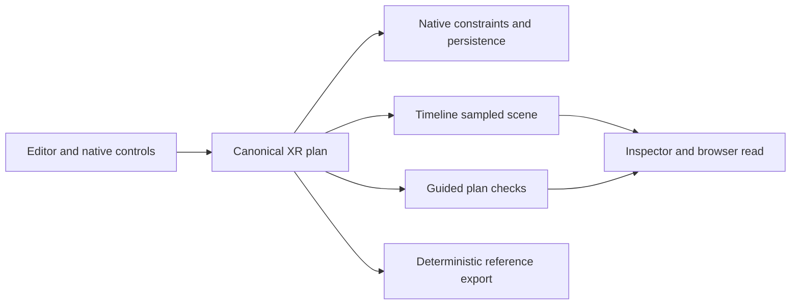

# agentic-graph Choreography Studio

## Source ownership and grounding

This is the editable product specification for an authored spatial rehearsal
workspace: arrange a stage, ask bounded questions about its objects, test a
movement plan, inspect feedback, and export a reusable reference. Its semantic
scene is an interactive digital model of authored space. It is not a measured
copy of a physical room, live sensor state, or evidence that a rehearsal ran.

All five roles join at **CHOREOGRAPHY-STUDIO-001@1.2.0**. This revision updates
requirements and evidence boundaries only. Grounding baseline: Graph
`2874751715a1e1f0a12c06415141a93c894c9d90`, the merged Choreography source from
[PR #1223](https://github.com/huijoohwee/agentic-graph/pull/1223). Runtime source
was inspected at that revision; the upstream workflow was read at Agentic OS
`0433c86a3528f2130d952a1b63c9e40feb41fde3`. An upstream workflow read does not
change Graph's installed dependency pin. Refresh grounding when these owners
change. Historical checks remain bound to their original source revisions.

The [XR Motion Reference](agentic-graph-xr-motion-reference-document.md) owns
existing runtime design. The [Python learning plan](prd-tad-adr-mvp-gtm-offline-python-learning-workspace.md)
owns procedural learning; its older planning status is not proof that the
current source is absent. Neither plan is duplicated here. Paths in the table
are repository-relative; bare XR filenames in subsequent sections mean
`canvas/src/features/three/`.

| Concern | Actual source owner | Verified source behavior / limit |
|---|---|---|
| Editor and Canvas | `canvas/src/features/markdown-workspace/main/MarkdownWorkspaceMain.tsx` | Shared source-file editor and Canvas pane; no new application shell. |
| Plan and draft | `canvas/src/features/three/xrMotionReferenceModel.ts`, `xrMotionReferenceRuntime.ts` | One normalized persisted plan and one runtime snapshot. |
| Stage and Timeline | `canvas/src/features/three/XrMotionReferenceStage.tsx`, `xrMotionReferenceTimeline.ts` | Stage projection and existing playhead authority. |
| Movement constraints | `canvas/src/features/three/threeKeyboardChoreography.ts`, `xrConstrainedMotionEdits.ts` | Native bounds, swept peer collision, and physics-ownership checks. |
| Authoring UI | `canvas/src/features/three/XrChoreographyInspector.tsx`, `XrAnimationFloatingPanelView.tsx`, `XrCameraMotionSection.tsx` | Existing FloatingPanel and BottomPanel projections. |
| Semantic scene | `canvas/src/features/three/xrSceneSemantic.ts` | Pure authored-plan projection and category, nearest, within queries; no physical reconstruction. |
| Guided feedback | `canvas/src/features/three/xrSceneExercises.ts` | Three deterministic plan checks; no persistent lesson progress or executed-run grade. |
| Local agent controls | `canvas/src/features/three/xrSceneMcpRuntime.ts`, `xrSceneMcpContract.mjs`; `canvas/src/features/agent-ready/xrSceneWebMcpTools.ts`, `webMcpRuntime.ts` | Existing browser inspection/control seam; no dedicated semantic-query tool. |
| Save and package | `canvas/src/features/three/xrScenePersistence.ts`, `xrMotionReferencePackage.ts` | Canonical graph persistence and deterministic reference compilation. |
| Procedural execution | `canvas/src/features/python-learning/pythonParser.ts`, `pythonEvaluator.ts`, `pythonWorker.ts`, `learningRuntime.ts` | Existing bounded Python subset in a terminable worker; no Studio adapter observed. |
| Learning result and storage | `canvas/src/features/python-learning/learningProtocol.ts`, `learningLessons.ts`, `learningPersistence.ts` | Bound run identity, three original lessons, rubric and local workspace debriefs. |
| Learning tools and offline assets | `canvas/src/features/python-learning/learningToolContract.mjs`, `learningWebMcp.ts`; `canvas/vitePythonLearningOffline.mjs` | Separate inspect/control and cache owners; their presence does not prove Studio offline closure. |

Original native behavior and assets are the implementation inputs. Do not copy
third-party code, schemas, lessons, branding, or prose, add their services or
packages, or introduce external runtime dependencies for this capability.

## PRD

### User, pain, and smallest valuable result

The first user is a scene operator or independent facilitator preparing a short
movement demonstration on a mobile or desktop browser. The buyer hypothesis is
a facilitator paying for a reusable rehearsal reference that reduces setup and
explanation time. No interview, measured saving, willingness to pay, or payment
currently validates that hypothesis.

| Priority | Buyer pain hypothesis | Near-built response | Evidence still needed |
|---|---|---|---|
| P1 | Placement, timing, and camera instructions disagree across separate references. | Reuse the XR plan, Timeline, and deterministic export as one handoff. | Observe an operator complete and reopen one reference. |
| P2 | A facilitator cannot explain what is near a subject or why its route fails. | Expose native scene entities and the three plan checks in the existing inspector. | Observe correct interpretation of query and constraint feedback. |
| P3 | Connectivity interrupts repeat practice or loses authored work. | Reuse local persistence and installed assets; verify disconnected reload. | Full Studio cache, save, reopen, and export proof on mobile and desktop. |
| P4 | Procedural practice and assistant advice disagree with the visible scene. | Consider a bounded adapter to the existing learning runtime after P1–P3. | Exact scene/run/grade correspondence; buyer need for coding. |

Ordering reflects reuse and implementation distance, not measured market size
or ROI. First value is a saved, inspectable reference. A later $1 offer tests
that artifact's value without requiring billing code or paid infrastructure.

### MVP scope and interaction

1. Keep the existing Editor Workspace and Canvas available; select XR Surface
   Mode, an original stage, and catalog subjects. No account or model call is
   required by the core rehearsal loop.
2. Place and label subjects, assign an available motion, and author bounded
   cast/camera marks through the canonical plan.
3. Inspect the authored scene at the Timeline playhead: filter a category,
   identify a selected subject's nearest entity, or inspect a bounded radius.
4. Adjust marks through existing pointer, keyboard, or browser-local controls;
   retain native stage, collision, Timeline, and physics ownership.
5. Read the three guided checks, repair missing setup or a blocked path, then
   rehearse, pause, and scrub with the shared Timeline.
6. Save and export the deterministic motion-reference package locally.
7. After a verified installation, reopen the saved scene with network disabled
   and confirm labels, marks, inspection, and export still agree.

At narrow widths, use existing pane visibility controls to move between source,
stage, inspector, and Timeline without losing selection or playhead. Touch
controls must cover the rehearsal path without requiring a hardware keyboard.
375 px layout, focus, screen-reader feedback, and touch usability are acceptance
targets pending browser evidence; responsive source alone is not proof.

### Scope boundaries

The Must slice is authored scene inspection and rehearsal, with offline proof
still outstanding. Procedural execution already exists separately; bringing
arbitrary Studio scenes into it is a proposed extension, not delivered scope.

Excluded: automatic capture/reconstruction, inferred identities, retained
camera frames or pose history, physical device control, unrestricted Python or
desktop package compatibility, new SQL storage, hosted classrooms, accounts or
rosters, remote execution, paid inference, billing, publication, and deployment.
Rendered video is outside this acceptance slice; adjacent native export work
must retain its own runtime and browser evidence.

### Acceptance criteria

These criteria join the TAD and ADR decisions below. A test file is a target,
not a pass; the evidence register states what has actually been checked.

| ID / pain | Given / when / then | Owner check / boundary |
|---|---|---|
| CS-01 / P1 | Given an active authored document, place or relabel a subject; exactly one normalized plan persists through graph metadata. | `xrChoreographyOwnership.test.tsx`; T1 / ADR-2. |
| CS-02 / P1 | Given a selected cast mark, request pointer, keyboard, or agent movement; the same constrained owner applies the displacement or reports rejection. | `xrKeyboardChoreography.test.ts`, native motion-constraint tests; T1 / ADR-2. |
| CS-03 / P1 | Given rehearsal, play/pause/scrub; Timeline owns sample time and competing writes obey native playback/physics fences. | `xrTimelineRehearsalControls.test.tsx`, `xrAnimationRuntime.test.ts`; T1 / ADR-2. |
| CS-04 / P1 | Given an unchanged valid plan, export twice; deterministic reference content is equivalent without a network or model request. | `xrMotionReferencePackage.test.ts`; browser egress check still required; T1 / ADR-3. |
| CS-05 / P2 | Given an active scene, inspect through UI and browser tool; both describe the same authored revision; control uses existing guarded owners. Absent WebMCP leaves manual UI usable. | XR agent-ready scope/availability tests and browser parity; T3 / ADR-2. |
| CS-06 / P2 | Given a complete scene, query category/nearest/radius; stable IDs and sampled positions share revision/time. Invalid, missing-subject, and partial-scene cases fail explicitly. | `xrSceneSemantic.test.ts`; bounded query edge coverage remains to be expanded; T2 / ADR-4. |
| CS-07 / P2 | Given eligible marks, obstacle, and camera anchor, evaluate; all three states follow the exact predicates in T2, without claiming an executed lesson or physical safety. | `xrSceneSemantic.test.ts` and native constraint tests; T2 / ADR-4. |
| CS-08 / P3 | Given a verified installed cache and saved scene, disable network and reload; subjects, marks, inspector, and export agree. Eviction or failed save is visible and never reported as durable success. | Disconnected desktop/375 px save-reopen-export proof, quota/upgrade negatives; T4 / ADR-3. |
| CS-09 / P1–P3 | Given the installed MVP, a first-time operator completes the seven-step flow on desktop and mobile without facilitator edits or hidden state loss. | Timed browser/accessibility pilot; T4 / ADR-3. |

CS-01–CS-09 define the MVP. **CS-10 is conditional future scope:** given an
explicitly selected supported Studio scene and source revision, a learning run
must bind their identities, replay deterministically, grade the same result,
stop visibly, and reject stale results after any source/scene switch. It cannot
be marked implemented until the T5 adapter and its own negative tests exist.

## TAD

### T1 — One authored plan and native authority

`graphData.metadata.kgXrMotionReference` is the persisted plan boundary. The
Editor Workspace owns source files and pane visibility; XR draft state projects
the plan. Timeline owns playhead; movement and physics owners decide whether an
edit is permitted. Panels, pointer, keyboard, and local agent controls call
those owners. No second timeline, scene database, or movement resolver is added.

Current normalized limits are 48 subjects, 12 cast tracks, 32 marks per cast
track, 32 camera marks, and 30 seconds duration. Coordinates are bounded to
50 m in magnitude, with nonnegative authored height. These are input limits,
not mobile performance guarantees. Inspect the model constants on drift.



### T2 — Semantic scene and guided feedback

`projectXrStudioScene` emits `agentic-graph-xr-studio-scene/v1`: `source` is
`authored-plan`, with runtime `revision`, `stageId`, clamped `timeSeconds`,
`complete`, and entities containing `id`, `kind`, `category`, `label`, `position`,
and `sizeMeters`. Subjects retain plan IDs; structures use `stage:<id>`.
Positions sample native cast marks at the playhead, falling back to authored
subject placement. Sizes use catalog dimensions and scale. This projection
does not read live physics poses, rotation-aware clearance, camera capture, or
measured room geometry; collision authority remains the native constraint owner.

| Query behavior | Current implementation |
|---|---|
| Category | Trim/lowercase input; reject empty or longer than 40 characters; match exact category. |
| Nearest | Require a subject ID; exclude that subject; choose minimum XZ center distance, with ID tie-break. |
| Within | Require a finite three-number center and radius from 0 to 50 m inclusive; use XZ center distance. Height and object extents do not affect the answer. |
| Bounds | Project at most 64 structures; set `complete=false` when structures exceed 64 or combined entity count exceeds 64. Queries return no matches with `partial-scene`. |
| Result | Return `ok`, optional `reason`, `sceneRevision`, `timeSeconds`, and at most 64 matches; unknown queries and missing subjects fail explicitly. |

An empty successful category result means no matching authored entity. An
incomplete projection is not an empty room. The raw projection may contain more
than 64 entities even though queries refuse that inventory; do not describe the
whole inspection payload as capped at 64 or silently claim complete coverage.

`evaluateXrStudioExercises` emits `agentic-graph-xr-studio-exercises/v1`, the
scene revision, evaluated subject ID, and three feedback records. It chooses
the selected cast track with at least two marks, otherwise the first eligible
track; the UI must make the evaluated subject clear.

| Check | Actual pass condition, in addition to native path safety |
|---|---|
| `reach-mark` | First-to-last displacement is at least 0.5 m in XZ. |
| `avoid-subject` | A different stationary subject lies within 3 m of the cast path's XZ segments; it has no cast track with more than one mark. |
| `sync-camera` | A camera mark anchors to the evaluated subject within 0.25 seconds of its final cast mark. |

Missing prerequisites produce `needs-work`; an unsafe eligible path produces
`blocked`; satisfied prerequisites plus native safety produce `passed`. These
are plan checks recomputed from the current snapshot, not completion events,
learner achievement records, traversed distances, or optical framing proof.
No second exercise progress store is introduced.

### T3 — Headless queries, browser tools, and invocation

Pure scene projection/query and exercise functions are headless and independent
of UI rendering. Existing WebMCP registration exposes
`agentic-graph.inspect_local_xr_scene_assets` and
`agentic-graph.control_local_xr_scene` through native browser owners.
Inspection returns `sceneReady` and, when ready, `studio.scene` plus
`studio.exercises`; otherwise `studio` is null. Inspection accepts no category,
nearest, or radius parameters today. The inspector calls the pure query
function directly; a dedicated parameterized tool is not implemented.

The existing `/xr.stage @environment`, `/xr.place @asset`, and
`/xr.transform @subject #transform` grammar comes from `xrSceneMcpContract.mjs`.
Use registry-provided schemas and actual IDs rather than inventing command
aliases. `/` selects an operation, `@` its target, and `#` the declared semantic
facet. A label or imported document is data, never agent authorization.

Agent assistance begins with inspection and offers an explanation or requested
native action. It adds no model call to deterministic queries or feedback.
Mutation must retain active-document, scope, deadline, and lifecycle fences in
the existing tool/runtime owner. Revision fields describe an observation; they
are not automatically a compare-and-set write contract. Any future stale-write
protection must be implemented and tested before it is claimed. Browser-local
WebMCP is not proof of an equivalent remote HTTP or stdio control transport.

### T4 — Local continuity and failures

Use native source/workspace persistence and reference download. Offline-ready
means installed application code, selected original assets, and saved data
survive a disconnected reload with the same behavior. An uncached first visit,
a successful in-memory save, or another feature's offline smoke does not prove
this. Lazy-load beyond the existing shell; avoid CDN, map, inference, and
service requests in the installed rehearsal path.

| Failure | Required outcome / evidence gap |
|---|---|
| Malformed plan/mark | Normalize supported values or reject before mutation through the native model. |
| Boundary, collision, physics-owned body, or competing playback writer | Native owner rejects/clamps as applicable; expose the actual outcome. |
| Incomplete inventory or invalid query | Preserve explicit failure and coverage state; do not imply a complete answer. |
| Missing scene/document or unavailable browser tool | Report unavailable; manual controls remain the fallback. |
| Failed export | Preserve plan and report error; no successful download claim. |
| Save failure, quota, cache eviction, partial upgrade | Preserve available authored data/export recovery; report missing durability or installation. Studio browser proof pending. |
| Document switch after inspection | Reinspect current owner before applying any follow-up; do not reuse another document's IDs. |

No telemetry, credentials, camera frames, or learner identity are required.
Cross-device use means the same portable reference can be opened on another
supported device; automatic synchronization or conflict-free concurrent editing
is not promised by this MVP.

### T5 — Conditional procedural learning adapter

Reuse the existing native Python subset, worker, simulation, lesson rubric,
workspace debrief store, and tool registry. Browser controls supply the desktop
control capability, native scene rendering supplies the simulation capability,
and workspace storage supplies persistence. Do not add a desktop GUI toolkit,
SQL database, interpreter, or a parallel lesson grader.

The current learning owner has `travel`, `route`, and `sense` lessons and
`inspect_local_python_learning` / `control_local_python_learning` tools.
Controls bind workspace/document, source and scene digests, lesson/runtime
revisions, seed, expected run ID, and request ID. Run/Step/Stop/Reset and Save
are separate operations; inspecting must not run, edit, or save a program.
The worker validates generation and run identity; document changes terminate
its active worker. Hints and grading use the same native lesson evidence.

Its fixed lesson descriptor uses 1/60-second ticks, an 8 m bound, and a 0.2 m
radius. Studio uses arbitrary catalog footprints and authored timing. Equal
axis names do not establish equivalent collision or timing semantics. There
is no inspected adapter between these scene contracts. Before implementing one:

1. Bind one supported scene subset to the exact plan/document revision, subject
   IDs, coordinate convention, units, lesson/runtime revisions, and digests.
   Reject unsupported geometry and transformations instead of approximating.
2. Keep learning ticks and worker state with the learning owner; keep authored
   marks and rehearsal time with XR. Explicitly import a reviewed result through
   existing constrained plan operations only when native authority permits it.
3. Prove identical Run/Step terminal state, replay, rubric, stop, stale-result
   rejection, negative solutions, and UI/tool parity. Never count the three
   Studio plan checks as the learning runtime's executed-run grade.
4. Reuse local debrief persistence; source/scene changes invalidate prior run
   evidence. Imported debriefs remain observations and never execute source.

Existing learning limits include 32 KiB source, 4,096 AST nodes, 50,000 steps,
7,200 ticks, and a 5,000 ms compute budget. These are source constants, not
measured latency or a claim of full Python compatibility. Trace/debrief limits
belong to that owner and can exceed this document's module/chunk budget; any
new Studio transport must separately enforce its own bounded payload contract.

## ADR

| Decision | Rationale and consequence | Acceptance join |
|---|---|---|
| ADR-1 — Keep the specification with Graph | Native source/tests live here. A consumer may project a pinned artifact; it must not become another editable owner. | All CS criteria; grounding table. |
| ADR-2 — Reuse native XR plan and controls | One plan, Timeline, and constraints avoid UI/tool disagreement. Extend the responsible owner; reject duplicate write paths. | CS-01–CS-05; T1/T3. |
| ADR-3 — Keep the MVP local and offline-capable | Original installed assets, local save, and deterministic export need no paid service. Offline readiness still requires CS-08; deployment remains separate. | CS-04, CS-08, CS-09; T4. |
| ADR-4 — Derive semantics and feedback | Read authored scene metadata and recompute plan predicates. No measured-room claim, natural-language model dependency, second scene schema owner, or completion store. | CS-06, CS-07; T2. |
| ADR-5 — Defer the cross-runtime adapter | Existing learning code is reusable, but its geometry, time, identity, and rubric differ. Keep its owner and prove a narrow mapping before expanding Studio. | Conditional CS-10; T5. |

Revisit a decision only for an observed user need or failed acceptance result.
Free-tier use and FOSS licensing are separate checks: retain native audited
assets and dependencies; unknown license/cost blocks adding a component. This
document adds zero packages, runtime modules, hosting, or model requirements.

## MVP and GTM choreography

### Demonstration and delivery order

Demo the seven PRD steps with two labeled subjects, two cast marks, one
stationary obstacle, and a camera mark anchored to the moving subject. Show a
missing-prerequisite state, a native constraint rejection, then a passing plan.
Inspect category, nearest, and radius at two playhead instants. Save/export and
reopen with network disabled only after installation is proven. Explain that
plan feedback and actual rehearsal playback are separate observations.

| Slice | Change / cap | Exit evidence |
|---|---|---|
| S0 — This specification | One Markdown file, <500 lines and 32 KiB; zero runtime modules/dependencies; initial 15-minute research/edit budget, refresh if workflow preflight extends it. | Grounded path/claim review, continuity joins, affected documentation checks, preserved historical evidence. |
| S1 — Prove the existing rehearsal | One 60-minute verification sprint; change at most four owning source modules and 24 KiB only if a concrete failure needs repair; no new dependency. | CS-01–CS-09 with exact source, desktop/mobile profiles, network trace, save/reopen/export and negative results. |
| S2 — Evaluate a learning bridge | Separate 60-minute design spike, one supported scene mapping; no runtime commitment until S1 and owner conformance evidence pass. | CS-10 feasibility/denials, exact learning dependency revision, measured cost, then a separately scoped implementation decision. |

S1/S2 are future scope estimates, not started work or production ETAs. Each
source module must remain under 600 lines and each new lazy-loaded chunk under
500 kB. Measure startup/input responsiveness on the target browser before
claiming a performance benefit. External CI/user waits are dependencies with a
recheck condition, never an estimated completion promise.

### Buyer experiment and success signals

First validate P1/P2 with five consenting independent facilitators or scene
operators using one original reusable exercise. Record time to first valid
reference, setup interventions, misunderstood feedback, and a second-session
reopen. Proposed targets: at least four of five finish within ten minutes and
reopen without losing marks. These are experiment thresholds; no sessions or
results are recorded yet, and five sessions do not prove learning efficacy.

After those outcomes, test a clearly described **$1 reusable rehearsal
reference** with the same audience. Present the deliverable and limitations,
record offer/acceptance/refusal and support minutes, and collect payment only
under a separately authorized existing payment process. This task sends no
outreach, creates no checkout, and makes no revenue claim. Revenue, demand,
conversion, acquisition cost, repeat use, and unit economics remain unknown.

Stop adding features if fewer than four pilots complete or users cannot tell
plan feedback from executed outcomes; fix the observed friction first. If no
one accepts the $1 offer, revisit pain and artifact value before building the
learning adapter. Core service/model spend is designed to be zero; developer,
device, support, and distribution costs are unmeasured. Any public projection
must pin this source revision and preserve its capability and evidence limits.

## Validation and handoff

### Evidence register

| Surface | Status at this revision | Evidence / remaining check |
|---|---|---|
| Specification | `spec-complete` | PRD/TAD/ADR/MVP/GTM joined at 1.2.0; path/link, byte/line, whitespace, hygiene, and affected documentation checks passed 2026-09-24. |
| Native XR and Studio semantics | `implemented-in-part` | Inspected Graph baseline above; ownership, limits, predicates, and tool boundaries cited. |
| Prior focused tests | `passed-source-only` | Historical combined head `7ac187b251820025a997fc36268f5e5c00b9a34f`; three Studio checks. Not current browser/offline proof. |
| Prior source integration | `observed-merged` | PR #1223 merge `2874751715a1e1f0a12c06415141a93c894c9d90`, observed 2026-09-24. Does not prove this document successor's integration. |
| Current focused checks | `passed-source-only` | On 2026-09-24, all three registry cases below passed at grounded Graph `2874751715a1e1f0a12c06415141a93c894c9d90`; source harness only. |
| Offline/mobile MVP | `unverified` | CS-08/CS-09 full installed browser flow, failure recovery, accessibility and timing absent. |
| Procedural learning bridge | `proposed` | Existing separate runtime inspected; CS-10 adapter absent. |
| Current source release | `pending` | Native RELEASE and exact candidate checks; no assumed integration. |
| Deployment and market proof | `not-requested` / `unverified` | No new deployment, payment, usage or buyer evidence. |

Reproduce the focused Studio checks from the Graph checkout:

```sh
npm -C canvas run test:ci:unit -- canvas.xrMode.studio.semanticExercises canvas.xrMode.studio.inspector canvas.xrMode.studio.agentSaveReopen
```

Registry owner: `canvas/src/tests/registry/postParserCases7.ts`; test owner:
`canvas/src/__tests__/xrSceneSemantic.test.ts`. The third case saves/reopens
through graph metadata in a source harness. It does not test browser cache,
network disconnection, mobile controls, or durable storage failure. Existing
CS-01–CS-05 runtime tests remain required for a future implementation change;
this document-only revision does not justify a complete product rebuild.

Run repository-selected affected checks, `git diff --check`, frontmatter join,
source path/link, and byte/line validation. Check that no excluded branding,
external project links, copied content, or dependency requirements enter the
artifact. Source receipts bind the actual candidate outside these committed
bytes; never write a predicted commit or CI outcome as evidence.

### Current ADLC continuation

`/change #choreography-studio-spec @codex` owns this one-file successor from the
Graph baseline above. The previous mission's single checkout allocation remains
historical; this new documentation task has a distinct native mission with one
checkout. Canonical main is read-only. No source runtime or sibling repository
edit is part of this revision.

Apply [START](https://github.com/huijoohwee/agentic-os/blob/0433c86a3528f2130d952a1b63c9e40feb41fde3/docs/START-WORKFLOW.md),
[ADLC](https://github.com/huijoohwee/agentic-os/blob/0433c86a3528f2130d952a1b63c9e40feb41fde3/docs/adlc-guidelines.md), and
[RELEASE](https://github.com/huijoohwee/agentic-os/blob/0433c86a3528f2130d952a1b63c9e40feb41fde3/docs/RELEASE-WORKFLOW.md) through their owner.
Development integration, lane retirement/cleanup, and runtime delivery retain
separate receipts. The [Graph release controller](../production-core-runtime-release.md)
and [rollback owner](../production-rollback-baseline.md) apply only to separately
authorized production effects; this task requests none.

Next product action: the Graph runtime owner executes S1 at an exact reviewed
revision after installed-cache/browser prerequisites are available. Recheck on
source, cache, device, or browser changes. Until CS-08/CS-09 pass, retain
`implemented-in-part`; an unavailable dependency blocks that transition only.
Report current document diff, checks, release state, and remaining risk at
handoff. Preserve the stopped or parked lane if publication/closeout is blocked.

### Historical checkpoint — 1.1.2

The following is retained context from the preceding source lane. Its future
tense instructions describe that historical checkpoint, not this task's scope.


2026-09-24: PR #1221 remains the immutable predecessor; native successor
`agent/device-0232231d4a19/choreography-closeout` reuses the same checkout and
seven-path reservation. It joined accepted XR PR #1222 main revision
`b3c11bd18196427d15259451663cd209389dcd1f` without conflicts. That repair passed
all five local affected stages and required Integration Gate run `35932570880`
at reviewed head `cdde018b81548ade09709231276381837a8051dc`; native desktop/mobile
MP4 evidence includes exact authored duration and endpoint under encoding delay.
The three Choreography focused checks passed again at combined head
`7ac187b251820025a997fc36268f5e5c00b9a34f`. This checkpoint is the only subsequent
source change before publication. Run the successor's native affected checks and
required exact-head Integration Gate, then retain integration and recoverable
cleanup receipts. Close predecessor PR #1221 only after successor integration.

Existing MainPanel, FloatingPanel and BottomPanel/Timeline remain the shared UI
owners. No deployment is requested. Source worktree closeout and the profile's
separate production-delivery state must be reported independently. Published
candidate bytes remain immutable; record post-publication outcomes in the
workspace `graph-end-adlc-20260924/prd-tad-adr-mvp-gtm-closeout-handover.md` and
native receipts before ending the turn. A later implementation must refresh
this editable source plan before its own publication.
