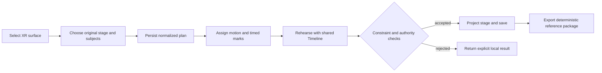

# agentic-graph Choreography Studio

## Source ownership

This is the editable, product-owned specification for the Choreography Studio
demo. Its implementation and evidence live in this repository because the
native XR stage, timeline, subject movement, camera choreography, persistence,
and browser-local agent controls live here. It supersedes no runtime contract:
the XR Motion Reference remains the detailed runtime-design authority for its
existing modules.

The demo is a browser-local previs and rehearsal surface. It does not claim a
physical-space capture pipeline, identity inference, device control, rendered
video delivery, hosted collaboration, or production deployment. Those require
separate source-owned scopes and evidence.

| Native concern | Existing owner | Current evidence |
|---|---|---|
| Plan, placed subjects, tracks, and marks | `canvas/src/features/three/xrMotionReferenceModel.ts` | Versioned graph metadata normalizes the authored plan. |
| Draft and stage projection | `xrMotionReferenceRuntime.ts`, `XrMotionReferenceStage.tsx` | One bounded snapshot feeds the panels and XR stage. |
| Timeline and rehearsal transport | `xrMotionReferenceTimeline.ts`, `XrRehearsalStatus.tsx` | The shared Timeline owns playhead and rehearsal state. |
| Subject and camera movement | `threeKeyboardChoreography.ts`, `XrKeyboardChoreographyRuntime.tsx` | Keyboard, pointer, and agent callers share constraint-aware movement. |
| Authoring controls | `XrChoreographyInspector.tsx`, `XrAnimationFloatingPanelView.tsx`, `XrCameraMotionSection.tsx` | Existing panels project the same persisted plan. |
| Browser-local agent surface | `canvas/src/features/agent-ready/webMcpRuntime.ts` and XR control runtimes | Existing guarded browser controls reuse native state owners. |

## PRD

### Problem

An operator needs a compact way to block a scene, assign native motions, place
timed subject and camera marks, rehearse the same plan, and hand off an
unambiguous reference. Existing Graph XR features provide those capabilities,
but the product intent, boundary, and validation target need one owner document.

### Primary user and outcome

The primary user is an operator preparing a short scene in a mobile or desktop
browser. In one local session they choose an original environment, place and
label subjects, assign an available motion, create bounded marks, rehearse the
Timeline, and export the existing deterministic reference package.

### MVP scope

1. Open the existing XR Surface Mode and select an original in-repository
   environment and subject catalog item.
2. Persist subject placement, labels, action assignments, cast marks, and
   camera marks through the canonical XR plan owner.
3. Rehearse through the existing Timeline transport and inspect the stage at a
   deterministic playhead instant.
4. Move selected subject or camera marks through the shared keyboard/pointer or
   existing browser-local control path; enforce stage, collision, and
   physics-ownership constraints.
5. Export the existing deterministic motion-reference package locally.

### Out of scope

- Automatic understanding, reconstruction, or capture of a real-world space.
- Camera-derived identities, biometric inference, retained camera frames, or
  pose history.
- Hardware actuation, device synchronization, provider-specific generation,
  paid APIs, or network-required authoring.
- Video rendering, remote publication, billing, and deployment proof.

### Acceptance criteria

| ID | Given / when / then | Native verification target |
|---|---|---|
| CS-01 | Given an XR plan, when the operator places or labels a subject, then one normalized plan is persisted through the canonical graph metadata owner. | `xrChoreographyOwnership.test.tsx` |
| CS-02 | Given a selected cast mark, when keyboard or agent movement is requested, then the shared resolver applies the same bounded displacement or reports the constraint rejection. | `xrKeyboardChoreography.test.ts` |
| CS-03 | Given Timeline rehearsal, when playback, pause, or scrub occurs, then the Timeline remains the playhead authority and conflicting motion writes fail closed. | `xrTimelineRehearsalControls.test.tsx` and `xrAnimationRuntime.test.ts` |
| CS-04 | Given an unchanged valid plan, when it is exported twice, then the native package contract emits equivalent deterministic reference content. | `xrMotionReferencePackage.test.ts` |
| CS-05 | Given a browser-local agent control, when it invokes an existing XR action, then it reuses the guarded native owner and does not introduce a parallel write route. | Focused existing XR and agent-ready tests selected by affected validation. |

### Success signals

The MVP is useful when an operator can complete the six-step local rehearsal
without leaving the browser or losing authored intent between panels. No demand,
revenue, performance, deployment, or production-usage claim is made until
separate recorded evidence exists.

## TAD

### Interaction flow

### Data and authority

`graphData.metadata.kgXrMotionReference` is the persisted plan boundary. The
XR draft runtime is a bounded local projection; Timeline owns playhead state;
the movement resolver owns key normalization, bounds, collision, and
physics-ownership checks. Panels, pointer input, keyboard input, and guarded
browser-local controls must call these existing owners rather than duplicate
their rules.

The data model contains authored stage selection, subject catalog references,
labels, transforms, assigned action paths, cast marks, and camera marks. It
must not contain camera frames, camera-derived identities, live pose history,
or provider credentials.

### Failure behavior

| Condition | Required behavior |
|---|---|
| Malformed plan or mark | Normalize only supported values or reject before mutation. |
| Movement crosses a boundary, peer, or physics-owned body | Reject or clamp through the shared resolver and report the actual outcome. |
| Conflicting writer during Timeline playback | Retain Timeline authority and fail the competing write closed. |
| Browser-local control unavailable | Return an explicit unavailable/timeout result; do not substitute a remote write path. |
| Export cannot be compiled | Leave persisted plan unchanged and report the local error. |

## ADR

### ADR-1: Keep the specification with the implementation owner

**Decision:** Store this editable Choreography Studio document in
`agentic-graph/docs/documents`.

**Why:** The actual source, tests, runtime contracts, and native browser
controls are maintained in Agentic Graph. A separate editable copy would drift
from those owners.

**Consequences:** A consumer-facing site may project an approved, versioned
artifact, and an archive may retain a non-editable historical record, but
neither becomes a second source of truth.

### ADR-2: Reuse the native XR plan and controls

**Decision:** Build the demo from the current XR Motion Reference, Timeline,
and existing guarded browser control seams.

**Why:** This preserves one plan model and one set of authority checks across
panels, interactions, and agent assistance.

**Consequences:** New functionality must extend the appropriate native owner;
it cannot add a competing timeline, persistence schema, or browser write path.

### ADR-3: Preserve a local, offline-capable MVP boundary

**Decision:** The initial demo remains browser-local and uses existing native
assets and local export only.

**Why:** The first useful rehearsal loop needs no hosted service, paid
inference, or runtime dependency.

**Consequences:** Remote collaboration, external execution, physical-space
automation, and publishing remain separate proposals with their own approval,
security, and deployment evidence.

## MVP and GTM choreography

### Demo script

1. Open XR Surface Mode and select an original stage.
2. Place two or more catalog subjects and give them clear labels.
3. Assign an available motion and add cast and camera marks.
4. Use the shared keyboard/pointer path to adjust a selected mark; show a
   boundary or collision rejection when applicable.
5. Rehearse, pause, and scrub the Timeline while the stage reflects the same
   plan.
6. Save and export the deterministic local reference package.

### Readiness register

| Surface | State | Evidence boundary |
|---|---|---|
| Specification | `spec-complete` | This document names owner, scope, and acceptance criteria. |
| Native XR authoring | `implemented-in-part` | Existing modules listed in Source ownership. |
| Focused test evidence | `pending-current-run` | Must be refreshed at the exact change head. |
| Protected integration | `undocumented` | Requires repository workflow receipts. |
| Deployment and market proof | `not-requested` | No deployment or commercial claim in this change. |

### GTM boundary

The first audience is the repository operator validating a local previs loop.
The first artifact is the deterministic reference package, not a hosted product
or a revenue claim. Any public projection must identify this source revision,
preserve the local-only boundary, and obtain its own release evidence.

## Validation plan

For this documentation change, run the repository’s affected validation and
check that every source path named above exists at the exact change head.
Before an implementation change is declared ready, rerun the focused tests for
CS-01 through CS-04 plus the applicable browser-control tests against that
implementation head. A passing local check is not protected integration,
deployment, or production evidence.
