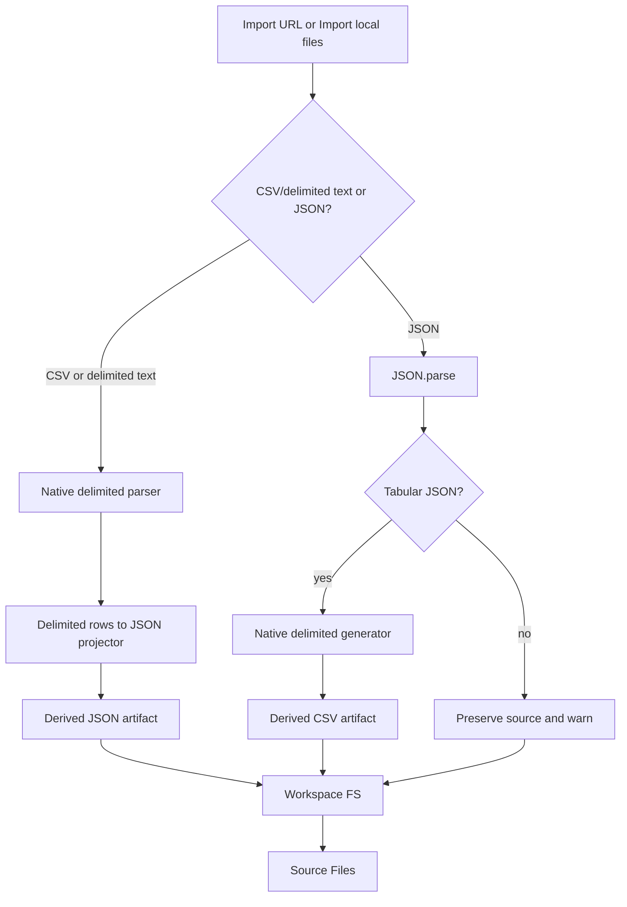
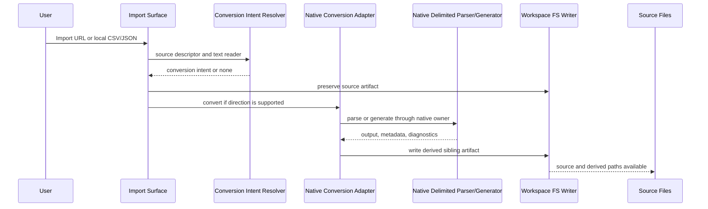

[Combined planning owner](agentic-graph-csv-json-prd-tad-adr-mvp-gtm.md) · `PLAN-AGENTIC-GRAPH-CSV-JSON-PRD-TAD-ADR-MVP-GTM@0.2.1`. This companion preserves the source section; diagrams and frontmatter projections remain owned by the combined artifact.

### Component Specifications

#### TAD-CJ-C01: Conversion Intent Resolver

**Responsibility**: Detect whether an imported source can produce a derived CSV or JSON artifact.

**Inputs**:

- Source path.
- MIME/content type when available.
- URL path or local filename.
- Raw text preview or source reader metadata.
- User import action context.

**Outputs**:

```ts
type CsvJsonConversionDirection = "delimited-to-json" | "json-to-delimited";

interface CsvJsonConversionIntent {
  direction: CsvJsonConversionDirection;
  sourcePath: string;
  sourceKind: "url" | "local-file";
  sourceFormat: "csv" | "tsv" | "delimited-text" | "json" | "geojson" | "jsonld";
  targetExtension: ".json" | ".csv";
  options: CsvJsonConversionOptions;
}
```

**Configuration**: Extension allowlist, optional user conversion toggle, max bytes, default delimited-text options.

**Goal conditions**:

- Local and URL `.csv`/`.tsv` imports produce `delimited-to-json` intent.
- Local and URL `.json` imports produce `json-to-delimited` intent when source text is valid tabular JSON.
- Unsupported formats do not enter conversion.

#### TAD-CJ-C02: Native Delimited Text Parser and Generator

**Responsibility**: Parse CSV/delimited text and generate CSV/delimited text using repo-owned code only.

**Inputs**:

```ts
interface DelimitedTextParseOptions {
  delimiter?: "," | "\t" | ";" | "|" | string;
  delimiterCandidates?: string[];
  quote?: string;
  escape?: string;
  newline?: "\n" | "\r\n" | "\r" | "auto";
  header?: boolean;
  trimEmptyTrailingRows?: boolean;
  maxBytes?: number;
  chunkSizeBytes?: number;
  signal?: AbortSignal;
  onProgress?: (progress: DelimitedTextProgress) => void;
}

interface DelimitedTextGenerateOptions {
  delimiter?: "," | "\t" | ";" | "|" | string;
  quote?: string;
  escape?: string;
  newline?: "\n" | "\r\n";
  fields?: string[];
  escapeFormulaCells?: boolean;
}
```

**Outputs**:

```ts
interface DelimitedTextParseResult {
  rows: string[][];
  headers?: string[];
  diagnostics: DelimitedTextDiagnostic[];
  metadata: {
    delimiter: string;
    newline: "\n" | "\r\n" | "\r" | "mixed" | "unknown";
    rowCount: number;
    fieldCount?: number;
    parserOwner: "agentic-graph-native-delimited-text";
    parserVersion: string;
    aborted: boolean;
  };
}

interface DelimitedTextDiagnostic {
  severity: "warning" | "error";
  code:
    | "ambiguous-delimiter"
    | "bad-delimiter"
    | "duplicate-header"
    | "empty-header"
    | "field-count-mismatch"
    | "invalid-escape"
    | "max-bytes-exceeded"
    | "unclosed-quote"
    | "unsupported-input";
  message: string;
  row?: number;
  column?: number;
  characterStart?: number;
  characterEnd?: number;
}
```

**Design directives**:

- Implement as a small deterministic scanner with explicit states owned by agentic-graph.
- Keep public API naming neutral and agentic-graph-specific.
- Keep parser pure where possible; file reading and URL fetching remain upstream.
- Allow chunked input from file streams, fetched streams, or text slices.
- Report progress monotonically and avoid re-parsing completed chunks.
- Abort promptly and do not write partial results as complete.
- Preserve source text; diagnostics explain risk instead of mutating truth silently.
- Generate output through the same delimiter, quote, escape, newline, and formula-safety policy used by parse tests.
- Do not copy PapaParse state names, option names, fixtures, examples, or implementation structure.

**Dependencies**: Native repo code only.

**TCO / Vendor**: `$0`; no npm parser dependency.

**Goal conditions**:

- Quoted delimiters, escaped quotes, embedded line breaks, and mixed newlines parse correctly.
- JSON-to-CSV generation round-trips through the native parser for supported cells.
- Formula-like values are escaped by default when generating CSV.
- Large input supports chunk/progress/abort behavior without infinite loops.
- Malformed input emits structured diagnostics.
- Static guards forbid PapaParse imports, vendored bundles, copied fixtures, and new manual line splitting outside this owner.

#### TAD-CJ-C03: Native JSON Adapter and Tabular Shape Resolver

**Responsibility**: Parse, validate, and format JSON with native runtime APIs, then resolve whether the value can become delimited text.

**Supported tabular roots**:

- Array of objects.
- Array of arrays.
- Object shaped as `{ "fields": string[], "data": unknown[][] }`.
- GeoJSON FeatureCollection can be future scope unless implementation explicitly flattens `features[*].properties`.

**Unsupported roots**:

- Scalar values.
- Single object without explicit one-row mode.
- Deep nested heterogeneous structures without flattening policy.
- JSONC comments for standard JSON conversion.

**Outputs**:

```ts
interface JsonTabularModel {
  fields: string[];
  rows: unknown[][];
  sourceShape: "array-of-objects" | "array-of-arrays" | "fields-data";
  diagnostics: CsvJsonConversionDiagnostic[];
}
```

**Dependencies**: native `JSON.parse`, native `JSON.stringify`.

**Goal conditions**:

- Invalid JSON preserves source artifact and surfaces a structured error.
- Supported tabular JSON roots convert to CSV.
- Unsupported roots do not silently invent columns.

#### TAD-CJ-C04: Derived Artifact Writer

**Responsibility**: Persist source and derived artifacts through existing workspace file ownership.

**Inputs**:

```ts
interface CsvJsonDerivedArtifact {
  sourcePath: string;
  targetPathHint: string;
  targetText: string;
  targetFormat: "json" | "csv";
  metadata: CsvJsonConversionMetadata;
  diagnostics: CsvJsonConversionDiagnostic[];
}
```

**Metadata schema**:

```ts
interface CsvJsonConversionMetadata {
  conversionId: string;
  sourcePath: string;
  sourceHash: string;
  direction: CsvJsonConversionDirection;
  sourceFormat: string;
  targetFormat: string;
  rowCount?: number;
  fieldNames?: string[];
  delimiter?: string;
  newline?: string;
  parserOwner: "agentic-graph-native-delimited-text" | "native-json";
  parserVersion: string;
  safety: {
    formulaEscaping?: boolean;
  };
  diagnosticsSummary: {
    warnings: number;
    errors: number;
  };
  createdAt: string;
}
```

**Goal conditions**:

- Source artifact is not overwritten by derived artifact.
- Derived artifact path conflict uses existing workspace naming behavior.
- Metadata can be inspected in Source Files or test assertions.

#### TAD-CJ-C05: Import Error and Diagnostics Presenter

**Responsibility**: Surface conversion diagnostics through existing import and Source Files affordances without creating a separate converter UI.

**Rules**:

- Fatal conversion failure still imports source when source read succeeded.
- Non-fatal warnings can write derived output with diagnostics attached.
- Diagnostics are deterministic and testable.
- User-visible wording avoids library-specific names unless explicitly showing the no-copy reference in docs.

### Integration Contracts

| Interface | Caller | Callee | Contract | Error Policy |
|---|---|---|---|---|
| Conversion intent | Import action | Intent resolver | Source descriptor -> optional intent | Unsupported source returns `null`. |
| Delimited parse | Conversion adapter | Native parser | Text/chunk source + options -> parse result | Fatal diagnostics fail derived artifact. |
| JSON parse | Conversion adapter | Native JSON adapter | Text -> unknown | Throw becomes structured error with source preserved. |
| CSV generation | Conversion adapter | Native generator | Tabular model + options -> delimited text | Unsupported cells stringify deterministically or fail by policy. |
| Artifact write | Conversion adapter | Workspace FS | Source plus derived artifact descriptors | Existing workspace errors surface through import UI. |
| Diagnostics | Converter | Import presenter | Structured diagnostics | Fatal vs warning severity preserved. |

### Workflow



### Sequence Diagram



### Architectural Decisions

#### ADR-CJ-01: Develop a Native In-Repo Delimited-Text Owner

**Status**: Accepted for implementation planning.

**Context**: CSV and delimited-text parsing is deceptively complex because of quoted delimiters, escaped quotes, embedded newlines, header rows, delimiter ambiguity, malformed input, large files, and spreadsheet safety. PapaParse publicly demonstrates the capability categories users expect, but this project explicitly requires native in-repo development and forbids copy.

**Decision**: Develop a native agentic-graph delimited-text parser and generator. Refer to PapaParse only as public capability inspiration. Do not install PapaParse, vendor it, wrap it, copy its APIs, or copy its tests/fixtures/docs/implementation.

**Alternatives considered**:

1. Native in-repo parser/generator: zero dependency, full ownership, clean no-copy boundary, more test work.
2. PapaParse dependency: mature FOSS package, but violates the requested native in-repo and no-dependency direction.
3. Existing local CSV parser expansion: zero dependency, but risks growing stale ad hoc behavior in the wrong owner.
4. Server-side CSV conversion: unnecessary recurring operational path and deployment coupling.

**TCO comparison**:

| Option | Build Cost | Runtime TCO | Maintenance Risk | Decision |
|---|---:|---:|---|---|
| Native in-repo owner | Medium | `$0` | Medium, mitigated by focused fixtures and static guards | Accept |
| PapaParse package | Low | `$0` | Low, but violates requirement | Reject |
| Legacy parser expansion | Low now | `$0` | High duplicate/churn risk | Reject |
| Server converter | Medium | Non-zero ops risk | Medium deployment coupling | Reject |

**Consequences**:

- Positive: deterministic in-repo ownership, no external parser dependency, no copy risk when guarded.
- Positive: shared owner can serve import, graph parsing, and future table panes.
- Negative: more focused edge-case tests are required.
- Neutral: PapaParse remains a public reference link in docs only.

#### ADR-CJ-02: Use Native JSON APIs as the JSON Owner

**Status**: Accepted.

**Context**: JSON parsing and formatting do not require a third-party dependency for standard JSON.

**Decision**: Use `JSON.parse` for parsing and `JSON.stringify(value, null, 2)` for formatted output. Reject unsupported tabular conversion shapes with structured warnings.

**Alternatives considered**:

1. Native JSON APIs: zero dependency, standard behavior.
2. JSON5/JSONC parser: useful for non-standard inputs but outside requested scope.
3. AI schema inference: high flexibility but token cost and non-determinism.

**TCO comparison**:

| Option | Build Cost | Runtime TCO | Token Cost | Decision |
|---|---:|---:|---:|---|
| Native JSON APIs | Low | `$0` | `0` | Accept |
| JSON5/JSONC parser | Medium | `$0` | `0` | Defer |
| AI inference | Medium | API cost | Non-zero | Reject for Must scope |

**Consequences**:

- Positive: deterministic behavior and no dependency churn.
- Negative: JSONC/JSON Lines are not covered in MVP.
- Neutral: `.jsonc` can remain an import format, but conversion must not treat comments as standard JSON unless a future parser is explicitly selected.

#### ADR-CJ-03: Preserve Source and Write Derived Sibling Artifacts

**Status**: Accepted.

**Context**: Users need provenance and trust. Replacing source CSV with derived JSON, or source JSON with derived CSV, hides the imported truth.

**Decision**: Always preserve the imported source artifact when read succeeds. Write derived output as a sibling artifact with metadata linking back to the source.

**Alternatives considered**:

1. Replace source with converted output: simpler but destroys provenance.
2. Write derived sibling: slightly more storage but transparent.
3. Only show conversion preview: avoids writes but loses workspace utility.

**TCO comparison**:

| Option | Build Cost | Runtime TCO | User Trust | Decision |
|---|---:|---:|---|---|
| Replace source | Low | `$0` | Low | Reject |
| Derived sibling | Medium | `$0` | High | Accept |
| Preview only | Medium | `$0` | Medium | Reject for Must |

**Consequences**:

- Positive: source remains auditable.
- Positive: derived artifacts can feed existing editor, graph, and source workflows.
- Negative: imports can create more files, so metadata and path naming must be clear.

### Quality Attributes

| Attribute | Scenario | Target | Validation |
|---|---|---|---|
| Correctness | Quoted cells, escaped quotes, embedded line breaks, duplicate headers, and delimiters parse deterministically. | Focused native fixtures cover each behavior. | Parser and adapter tests. |
| Safety | Spreadsheet formula-like values are generated to CSV safely. | Formula escaping enabled by default for generated CSV. | JSON-to-CSV formula tests. |
| Malformed input | Unclosed quotes and field-count mismatches are visible. | Structured diagnostics with row/column/range when available. | Malformed fixture tests. |
| Performance | Large CSV files do not freeze the UI. | Chunk/progress/abort path with worker-compatible boundary. | Large fixture smoke or chunk callback tests. |
| Observability | Conversion metadata records provenance. | Source hash, direction, parser owner, options, and diagnostics counts exist. | Metadata assertions. |
| Universality | No project-specific behavior. | No path/name hardcodes or demo fixtures in runtime. | Static search and focused tests. |
| Token Cost | Conversion runs without LLM. | No AI harness in Must tier. | Static guard: no chat/model dependency in adapter. |
| TCO | Feature has no recurring cost. | Native parser plus runtime JSON APIs only. | ADR review and package guard. |
| No-copy | PapaParse remains reference-only. | No imports, vendored source, copied fixtures, copied docs, copied API naming, or copied implementation shape. | Static guard plus review checklist. |

### Security and Privacy

- Conversion runs locally in the browser/runtime path used by import.
- URL import reuses existing fetch/proxy policy; no new remote parser endpoint.
- Extensionless URL classification is provider-neutral: a bounded direct `HEAD` probe may fall back to the existing proxy only for transport unavailability, and a successful candidate is read once with bounded `GET` on that transport.
- Full-document HTML takes precedence over MIME and delimiter hints. Authentication or hydration shells produce an explicit authentication-required failure and zero imported artifacts.
- Private collaboration databases and documents require either a genuinely public share/export URL or an explicitly authorized identity lane; the unauthenticated Import URL path does not acquire, store, or simulate credentials.
- Source text and derived data are not sent to AI services in Must scope.
- Formula-like cell escaping is enabled by default for generated CSV.
- Diagnostics must not log full file content by default; use row/column/range metadata and short excerpts only when existing logging policy permits.

### Deployment Strategy

- Development repo only: `$GITHUB_ROOT/agentic-graph`.
- Do not update `$GITHUB_ROOT/huijoohwee/content/agentic-graph`.
- Do not deploy to Cloudflare.
- Implementation can be validated with focused tests and static guards before any publish step.

### Component Inventory

| Surface | Component | Path | Status |
|---|---|---|---|
| Toolbar import | JSON/CSV import action | `canvas/src/features/toolbar/jsonImportAction.ts` | Existing, extend |
| Import effects | Import side effects | `canvas/src/features/toolbar/importSideEffects.ts` | Existing, extend or neutralize |
| Workspace persistence | Workspace FS | `canvas/src/features/markdown-workspace/workspaceFs.ts` | Existing, reuse |
| Format policy | Import extension allowlist | `canvas/src/lib/config-copy/importExportCopy.ts` | Existing, reuse |
| Conversion | CSV/JSON conversion adapter | `canvas/src/features/markdown-workspace/workspaceImport/csvJsonConversion.ts` | Planned |
| Native parser | Delimited text parser/generator | `canvas/src/features/markdown-workspace/workspaceImport/delimitedTextConversion.ts` | Planned |
| Parser consumers | CSV/JSON graph parser specs | `canvas/src/features/parsers/default.ts` | Existing, consume |
| Legacy parser | Graph CSV parser | `canvas/src/lib/graph/csv.ts` | Existing, replace or route through native owner |

### Traceability Matrix

| PRD Story | TAD Components | Validation | /goal Condition |
|---|---|---|---|
| PRD-CJ-01-S01 | TAD-CJ-C01, C02, C04 | Local CSV intent, native parse, artifact write | Local CSV import writes source and derived JSON. |
| PRD-CJ-01-S02 | TAD-CJ-C01, C02, C04 | URL CSV intent, fetched text/stream parse, artifact write | URL CSV import uses same adapter as local. |
| PRD-CJ-01-S03 | TAD-CJ-C02 | Delimiter fixtures | Comma, tab, semicolon, and pipe use one parser owner. |
| PRD-CJ-02-S01 | TAD-CJ-C03, C02, C04 | JSON parse, tabular validation, native generation | Local JSON import writes source and derived CSV. |
| PRD-CJ-02-S02 | TAD-CJ-C03, C02, C04 | URL JSON parse, tabular validation, artifact write | URL JSON import warns on unsupported roots. |
| PRD-CJ-03-S01 | TAD-CJ-C04 | Metadata assertions | Derived artifact records source hash and direction. |
| PRD-CJ-03-S02 | TAD-CJ-C02 | Formula safety fixtures | Formula-like values are escaped by default. |
| PRD-CJ-03-S03 | TAD-CJ-C02 | Chunk/progress/abort tests | Large input can be parsed without full reparse or infinite loop. |
| PRD-CJ-03-S04 | TAD-CJ-C02, C05 | Malformed fixture tests | Diagnostics are structured and source is preserved. |
| PRD-CJ-04-S01 | TAD-CJ-C01, C04 | Import path static search | No duplicate import entry point. |
| PRD-CJ-04-S02 | TAD-CJ-C02 | Parser static guard | No new parser path outside native owner. |

### Validation Plan

| Test Area | Test Shape | Owner |
|---|---|---|
| CSV-to-JSON local | Focused import test with quoted cells, headers, and embedded newlines | Conversion adapter and local import |
| CSV-to-JSON URL | Stubbed URL import test for `.csv` and `.tsv` | URL import and conversion adapter |
| JSON-to-CSV local | Focused import test for array-of-objects and `{ fields, data }` | JSON adapter and native generator |
| JSON-to-CSV safety | Formula-prefix fixture | Native generator safety policy |
| Malformed CSV | Unclosed quote, duplicate header, uneven rows, bad delimiter | Native parser diagnostics |
| Large CSV | Chunk/progress/abort fixture or smoke | Native parser owner |
| No-copy guard | Static search for PapaParse imports, vendored bundles, copied docs/examples, copied fixtures, and external dependency entries | Repo hygiene |
| No duplicate surface | Static search for new toolbar converter entry point | Toolbar/import owner |
| Frontmatter | YAML parse and required metadata assertions | Docs validation |

Static guards should include:

- No package dependency named `papaparse`.
- No source import from `papaparse`.
- No vendored files whose names or headers identify PapaParse.
- No runtime references to PapaParse exported API names.
- No copied fixture files or copied docs/examples from the public project.
- No new CSV tokenization outside the native parser owner.

### Risks and Mitigations

| Risk | Impact | Mitigation |
|---|---|---|
| Native parser under-handles CSV edge cases. | Data loss or failed imports. | Keep scope explicit, add round-trip fixtures, and route all consumers through one owner. |
| No-copy boundary becomes fuzzy. | Legal, maintenance, and review risk. | Static guards plus review checklist; author new neutral tests from this PRD/TAD only. |
| Duplicate parser paths persist. | Stale behavior and conflicting diagnostics. | Replace or route legacy graph CSV parsing through the native owner. |
| Headers are missing or duplicated. | JSON output can be ambiguous. | Deterministic header policy plus diagnostics; no silent overwrite. |
| Large CSV blocks UI. | Poor UX. | Chunk/progress/abort contract first; worker-compatible execution next. |
| Remote URL cannot be fetched directly. | Import URL fails. | Reuse existing URL fetch/proxy owner; parser consumes fetched text or stream only. |
| JSON root is not tabular. | CSV output would invent schema. | Preserve source and emit warning instead of forcing conversion. |

### Implementation Notes for Future Work

- Start at import owner and conversion adapter, not UI overlays.
- Keep parser/generator unopinionated and shared.
- Keep URL fetching upstream of the parser.
- Keep source artifact writes first; derived writes second.
- Version parser metadata with a agentic-graph-owned parser version string.
- Add focused fixtures that are small, neutral, and authored from the rules above.
- Remove stale parser behavior rather than layering compatibility aliases.
- Do not deploy beyond the dev repo until explicitly instructed.

