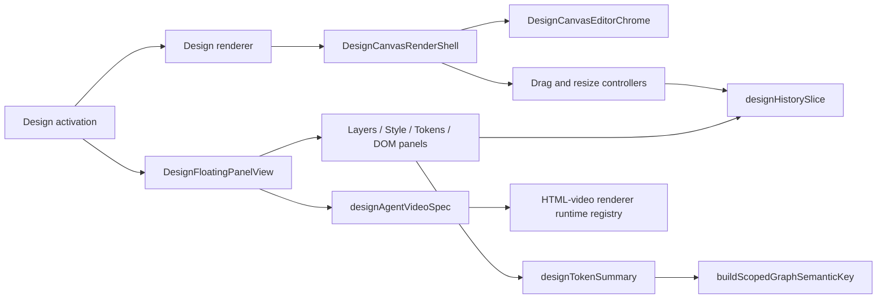

# agentic-graph Design Canvas Editor PRD-TAD-ADR-MVP-GTM

Current accepted scope revision: **0.6.0**. The following baseline records earlier implementation;
the [native design enhancement](#native-design-enhancement--reference-implementation) is a scoped
implementation in progress, with no new runtime or delivery claim.

**Document Version**: 0.3.0  
**Date**: 2026-05-29  
**Status**: Accepted and implemented Design editor baseline

## Document Purpose

Design editor baseline is implemented natively in agentic-graph. This document records the product and technical contract for the in-repo Design editor surface that was originally scoped from a reference-editor mental model: a focused canvas, explicit tools, layers, inspector, tokens, DOM context, and reversible layout edits. The reference is directional only; the implementation owns its behavior in agentic-graph source files and does not import external editor code, fixtures, or assets.

The shipped baseline keeps renderer semantics neutral. Design editing operates on Design-owned view state, Design-only history, existing canvas pointer modes, and shared semantic-key helpers. It does not remap old aliases, layer local patches over downstream UI, or mutate graph topology to represent presentational frame edits.

## Implemented Product Contract

| Capability | Status | Source owner |
|------------|--------|--------------|
| FloatingPanel Design editor | Shipped | `canvas/src/features/design/DesignFloatingPanelView.tsx`; `canvas/src/lib/toolbar/ToolbarToolMenu.impl.tsx` |
| Design canvas render shell | Shipped | `canvas/src/components/DesignCanvas.tsx`; `canvas/src/components/DesignCanvas/DesignCanvasRenderShell.tsx` |
| Editor chrome | Shipped | `canvas/src/components/DesignCanvas/DesignCanvasEditorChrome.tsx` |
| Pointer modes, fit-to-view, undo, redo | Shipped | `canvas/src/components/DesignCanvas/DesignCanvasEditorChrome.tsx`; `canvas/src/features/design/DesignFloatingPanelView.tsx` |
| Move and resize operation commits | Shipped | `canvas/src/components/DesignCanvas/useFrameDragController.ts`; `canvas/src/components/DesignCanvas/useResizeMarqueeController.ts` |
| Layers, Style, tokens, DOM tree, DOM inspect panels | Shipped | `canvas/src/features/design/DesignFloatingPanelView.tsx`; `canvas/src/features/design/DesignLayersPanel.tsx`; `canvas/src/features/design/DesignInspectorPanel.tsx`; `canvas/src/features/design/DesignTokensPanel.tsx`; `canvas/src/features/design/DesignDomTreePanel.tsx`; `canvas/src/features/design/DesignDomInspectPanel.tsx` |
| Agent-native HTML video render | Shipped | `canvas/src/features/design/designAgentVideoSpec.ts`; `canvas/src/features/design/DesignAgentVideoPanel.tsx`; `canvas/src/features/html-video-renderer/*` |
| Design-only history | Shipped | `canvas/src/hooks/store/designHistorySlice.ts`; `canvas/src/hooks/store/store-types/graph-state-design-history.ts` |
| Design launch and Import URL activation | Shipped | `canvas/src/features/design/designEditorLaunchState.ts`; `canvas/src/__tests__/designEditorIntegrationRegression.test.ts` |
| Layer state and token summaries | Shipped | `canvas/src/features/design/designLayersState.ts`; `canvas/src/features/design/designTokenSummary.ts` |

## User Outcomes

| User | Need | Implemented behavior |
|------|------|----------------------|
| Knowledge curator | Arrange graph-derived frames into a readable canvas | Design mode supports frame selection, movement, resize, layers, and inspector controls without changing canonical graph topology. |
| Research analyst | Reopen and refine visual layouts | Design state is scoped by graph metadata and committed through Design-owned store actions. |
| Builder | Extend Design editor behavior without duplicate state paths | FloatingPanel, render shell, controllers, and store history expose source-owned contracts covered by registry tests. |

## Functional Requirements

### FR-1: Dedicated Design Surface

The Design editor is reachable through Design renderer activation paths and one FloatingPanel Design view. The duplicate MainPanel Design tab is retired. MainPanel Settings remains the appearance owner; FloatingPanel Design owns overview, Layers, Style, Tokens, DOM tree, DOM inspect, and Video controls.

Acceptance:

- `mainPanelTabs.ts` exposes no Design tab and `MainPanel.tsx` mounts no Design editor.
- `ToolbarToolMenu.impl.tsx` mounts `DesignFloatingPanelView` for Design.
- A legacy MainPanel Design intent activates the shared FloatingPanel Design view.

### FR-2: Editor Chrome and Tooling

The canvas render shell mounts `DesignCanvasEditorChrome` when Design is active. The chrome exposes select, pan, undo, redo, and fit-to-view affordances through existing store actions, preserving one owner for pointer mode and viewport behavior.

Acceptance:

- `DesignCanvasRenderShell.tsx` mounts `DesignCanvasEditorChrome`.
- `DesignCanvasEditorChrome.tsx` calls `setCanvasPointerMode2d`, `undoDesignHistory`, `redoDesignHistory`, and `dispatchRuntimeFitToViewSoon`.
- The floating panel exposes matching viewport and shortcut actions without creating an alternate command path.

### FR-3: Move and Resize Commit Boundaries

Frame movement and resizing preview during pointer gestures and commit once per completed operation. The drag controller commits position patches through `commitDesignFramePosHistory`; the resize controller commits rectangle patches through `commitDesignFrameRectHistory`.

Acceptance:

- `useFrameDragController.ts` commits move operations with `commitDesignFramePosHistory`.
- `useResizeMarqueeController.ts` commits resize operations with `commitDesignFrameRectHistory`.
- Store writes are operation-level commits, not pointer-move recomputation loops.

### FR-4: Design-Only History

Design frame position, frame size, and layer state edits are reversible through Design-owned history commands. Undo and redo operate on Design state and do not rewrite canonical graph data.

Acceptance:

- `designHistorySlice.ts` owns `undoDesignHistory`, `redoDesignHistory`, `commitDesignFrameRectHistory`, `commitDesignFramePosHistory`, and `commitDesignLayerStateHistory`.
- `DesignLayersPanel.tsx` records layer visibility and ordering changes through `commitDesignLayerStateHistory`.
- `DesignInspectorPanel.tsx` records numeric frame edits through `commitDesignFrameRectHistory`.

### FR-5: Semantic-Keyed Token Summaries

Design token summaries reuse the shared semantic-key helper. Token summary caching is scoped by graph metadata and token inputs, avoiding ad-hoc cache keys and redundant derivation.

Acceptance:

- `designTokenSummary.ts` calls `buildScopedGraphSemanticKey('design-token-summary'`.
- `designEditorSurfaceRegression.test.ts` verifies shared semantic-key helper usage.
- `designTokenSummary.test.ts` covers extraction and semantic cache behavior.

### FR-6: Agent-Native HTML Video Render

The Design Video panel can derive a programmatic HTML-video render from the active graph. `designAgentVideoSpec.ts` converts selected or visible Design layers into semantic HTML, scoped CSS motion, seekable composition data attributes, virtual workspace files, composition rows, source-derived assets, timeline lanes, and structured data, then `DesignAgentVideoPanel.tsx` sends the generated HTML-video renderer node through the existing runtime-registered engine path. The shipped browser runtime can render MP4 through the `canvas-2d` adapter when supported by the browser; no hardcoded fallback engine is allowed.

Acceptance:

- `designAgentVideoSpec.ts` calls `buildScopedGraphSemanticKey('design-agent-video'` and reuses `summarizeDesignTokens`.
- `DesignAgentVideoPanel.tsx` calls `createHtmlVideoEngineRegistryFromRuntimeConfig()` and `runHtmlVideoFlowNode`.
- `designAgentVideoWorkspace.test.ts` verifies semantic HTML, deterministic motion CSS, virtual workspace/composition/asset/timeline metadata, timeline `data-start` / `data-duration` / `data-track-index` markers, generated `video/mp4` preview state, and no copied upstream design engine path.

## Technical Architecture



### Source Ownership

| Layer | Owner | Contract |
|-------|-------|----------|
| Panel routing | `canvas/src/features/design/designEditorLaunchState.ts`; `canvas/src/lib/toolbar/ToolbarToolMenu.impl.tsx` | Opens the sole FloatingPanel Design editor. |
| MainPanel boundary | `canvas/src/features/panels/mainPanelTabs.ts`; `canvas/src/features/panels/MainPanel.tsx` | Keeps MainPanel Settings and omits the duplicate Design editor. |
| Canvas root | `canvas/src/components/DesignCanvas.tsx` | Wires frame edit operations into Design history actions. |
| Render shell | `canvas/src/components/DesignCanvas/DesignCanvasRenderShell.tsx` | Mounts editor chrome with selected and layer counts. |
| Editor chrome | `canvas/src/components/DesignCanvas/DesignCanvasEditorChrome.tsx` | Exposes existing pointer, undo, redo, and fit actions. |
| Move controller | `canvas/src/components/DesignCanvas/useFrameDragController.ts` | Commits move operations once per gesture. |
| Resize controller | `canvas/src/components/DesignCanvas/useResizeMarqueeController.ts` | Commits resize operations once per gesture. |
| Panel shell | `canvas/src/features/design/DesignFloatingPanelView.tsx` | Hosts overview, Layers, Style, Tokens, DOM Tree, DOM Inspect, and Video workspace tabs. |
| Layers | `canvas/src/features/design/DesignLayersPanel.tsx`; `canvas/src/features/design/designLayersState.ts` | Owns layer visibility and ordering behavior. |
| Inspector | `canvas/src/features/design/DesignInspectorPanel.tsx` | Owns numeric frame edits. |
| Tokens | `canvas/src/features/design/DesignTokensPanel.tsx`; `canvas/src/features/design/designTokenSummary.ts` | Owns token extraction and semantic-keyed cache. |
| DOM context | `canvas/src/features/design/DesignDomTreePanel.tsx`; `canvas/src/features/design/DesignDomInspectPanel.tsx` | Owns DOM context display for Design workflows. |
| Agent video | `canvas/src/features/design/designAgentVideoSpec.ts`; `canvas/src/features/design/DesignAgentVideoPanel.tsx`; `canvas/src/features/html-video-renderer/*` | Owns graph-derived HTML/CSS/data render specs and MP4 generation through registered runtime adapters. |
| Design history | `canvas/src/hooks/store/designHistorySlice.ts`; `canvas/src/hooks/store/store-types/graph-state-design-history.ts` | Owns reversible Design-only commands. |

### State and Data Flow

1. The user activates the Design renderer; its FloatingPanel opens through the shared launcher.
2. `DesignFloatingPanelView` renders the Design controls once.
3. `DesignCanvasRenderShell` mounts `DesignCanvasEditorChrome` on the active canvas.
4. Drag, resize, inspector, and layer interactions preview through the UI and commit through Design history actions.
5. Token summaries use `buildScopedGraphSemanticKey('design-token-summary'` for stable cache identity.
6. Design video specs use `buildScopedGraphSemanticKey('design-agent-video'` and reuse token summaries for stable render identity.
7. Renderer output remains derived from graph data plus Design-scoped view state.

## Implementation Boundaries

Implemented:

- One FloatingPanel Design editor; the former MainPanel Design entry is retired.
- Canvas editor chrome for select, pan, undo, redo, fit-to-view, selected count, and layer count.
- Design-only move, resize, layer, and inspector history commits.
- Token summary extraction using the shared semantic-key helper.
- DOM tree and DOM inspect panels for Design context.
- Import URL path that can activate the shared Design surface.
- HTML-video render action in the Design overview that derives source-owned semantic HTML/CSS/data and renders MP4 through registered runtime adapters.

Out of scope for this baseline:

- Importing external editor code, assets, schemas, or runtime behavior.
- Full vector design-suite parity beyond agentic-graph frame, layer, token, and DOM workflows.
- External design-file import/export.
- Collaborative Design operation transport.
- Replacing the existing renderer backend.

Planned extension boundary:

- Any future collaborative Design operations must add source owners and tests before this document can mark them implemented.
- Any future external design-file import/export must keep conversion in a dedicated source owner and preserve graph semantics.
- Any future advanced vector tools must commit through Design history and reuse shared semantic keys for derived caches.

## Validation Contract

Run these focused checks after editing Design owners or this document:

```bash
npm --prefix canvas run test:ci:unit -- "design.editor.prdTad"
npm --prefix canvas run test:ci:unit -- "design.editor.surface"
npm --prefix canvas run test:ci:unit -- "design.editor.agentVideo"
npm --prefix canvas run test:ci:unit -- "design.layers"
npm run hygiene:check
npm --prefix canvas exec tsc -- -p canvas/tsconfig.json --noEmit --pretty false
```

The registry guard `design.editor.prdTad.implementedOwners` requires this PRD/TAD to stay aligned with implemented Design source owners and rejects proposed-only language for shipped behavior.

## ADR: retain Design-owned history and shared canvas controls

Keep presentational edits in Design-owned view state and history, with operation-level commits through the existing pointer and viewport owners. Encoding frame edits as graph topology or adding a second input controller would couple presentation to canonical data and create conflicting undo behavior. Shared semantic-key helpers continue to own derived identity. This records the implemented boundary; future collaboration or external-format support still needs its own source changes and validation.

## Historical planning revision — reference implementation

All five roles below consume `PLAN-AGENTIC-GRAPH-DESIGN-EDITOR-BASELINE-PRD-TAD-ADR-MVP-GTM@0.3.1`. Existing source and runtime observations retain their original revisions and scope; this documentation update renews no deployment or demand evidence. The guideline is [v2.7.0](https://github.com/huijoohwee/huijoohwee.github.io/blob/e8d2a10a8d3e5735c43edf350a22523df05fdf91/guidelines/prd-tad-adr-mvp-gtm-guidelines.md); the shared maturity rubric loads on demand.

| Role | Owning content at this revision |
|---|---|
| PRD | [Functional Requirements](agentic-graph-design-editor-baseline-prd-tad-adr-mvp-gtm.md#functional-requirements) |
| TAD | [Technical Architecture](agentic-graph-design-editor-baseline-prd-tad-adr-mvp-gtm.md#technical-architecture) |
| ADR | [ADR: retain Design-owned history and shared canvas controls](agentic-graph-design-editor-baseline-prd-tad-adr-mvp-gtm.md#adr-retain-design-owned-history-and-shared-canvas-controls) |
| MVP | [MVP — reference implementation](agentic-graph-design-editor-baseline-prd-tad-adr-mvp-gtm.md#mvp--reference-implementation) |
| GTM | [GTM — reference implementation](agentic-graph-design-editor-baseline-prd-tad-adr-mvp-gtm.md#gtm--reference-implementation) |

## MVP — reference implementation

Reuse the minimum scope, acceptance conditions and component owners identified above. The demonstration must follow the documented entry, permitted action, durable outcome and readback, including its stated failure/recovery path. Use `npm run check` for its actual coverage and the named feature checks in the specification; attach exact source, command, result and authoring/mirror/delivery surface to each VCC before advancing readiness. A source locator or structural check alone proves no user outcome.

Record the observed steps and elapsed time against the existing TTV target. If no target or invocation is stated, the demonstration remains unverified until the document owner supplies it. All four experience criteria are **unassessed** in this authoring review: Core Requirements & Functionality, Innovation & Theme Alignment, Technical Execution & Integration, and Usefulness & Agentic Experience. No scored user observation is attached to this revision; the document owner must capture a timed pilot and criterion-specific evidence.

## GTM — reference implementation

Use the stated persona and pain hypothesis to test one priced pilot in the existing user environment. Keep the documented free/self-serve workflow as the comparison; additional hosting, channels or agent roles require an evidenced constraint or buyer need. Record the buyer’s workaround, frequency, accepted outcome, offered price, observed response and support minutes before ranking a commercial winner. Demand, collected payment and repeat use remain unvalidated by this documentation review; mechanism evidence keeps its narrower original scope. Measure tokens, cash expense and maintenance separately for each proposed deployment model. Feed actual pilot outcomes into a successor Context using the shared four-column planning record.

## Planning gaps — reference implementation

Source review is bounded to repository `7fb85741121d8c2886027e4a630d013ba91c1027`. At that historical revision the MainPanel Design files existed; revision 0.6.0 retires the duplicate MainPanel view and keeps the FloatingPanel owner. File existence at the historical revision did not confirm every behavior asserted by the specification.
Experience observations, current VCC execution and buyer/payment evidence are unverified here. This is a bounded planning update, not a full-guideline conformance verdict; historical conformance percentages above apply only to their recorded profile and revision.

## Native design enhancement — reference implementation

All five roles in this section join the existing continuity ID at **0.4.0**. Historical baseline
claims above retain their original scope. Context: the current editor exposes layers, geometry,
tokens and DOM panels, but agents and users cannot yet obtain one typed, source-bound design context
with deterministic exports and bounded quality findings. Intent: shorten a builder's path from a
design review to a consistent, reusable local deliverable. Directive: enhance the existing token,
Design panel and agent inspection owners. Role/Subject: product implementer. Action/Verb: connect.
Object: native token definitions, agent context and Design inspection. Outcome: N1–N6 below.

**Authorization:** on 2026-09-21 the user selected “Authorize implementation of this v0.4.0 scope,
N1–N6” and instructed “IMPLEMENT”. That decision authorizes this exact scoped implementation and is
reused throughout the task. It does not establish acceptance, integration or production evidence.
No new authorization schema, approval service or standing runtime permission.

### Codebase grounding and dispositions

Bounded inspection: Graph `b242ab5d82c49155808a86b45565c797f8e04f61`, Agentic OS
`3559f18aeef6b0f2eb13bb95820f426a8e4e2301`, authoring guideline
`1b2820d8d1da5246d8d6adedd99a2e39ba1eb4fd` / `3.1.0`. Guideline SHA-256:
`cc49896776a70e372a34d54fb81582ae1a46d46e2f527e2dfd3108cc07a0b1ef`.
Graph's unrelated canonical workspace-seed edits are outside this lane and must remain intact.
Before implementation refresh source revisions, open scopes and the admitted write set.

| Claim and disposition | Native evidence at the inspected revision | Consequence |
|---|---|---|
| **Confirmed:** one shared light/dark token definition list exists | `grph-shared/src/ui/kgTokens.ts`: `KgTokenDef`, `AG_TOKEN_DEFS`; 38 definitions | Enhance this list; do not author a second JSON token source. |
| **Confirmed:** CSS generation and a token explorer exist | `canvas/src/lib/ui/tokens-ssot.ts`, `canvas/src/cli/gen-kg-tokens-css.ts`, `canvas/src/features/design-system/pages/TokensExplorer.tsx` | Extend the generator and explorer; generated files remain projections. |
| **Confirmed:** Design token summaries are observations of graph properties | `canvas/src/features/design/designTokenSummary.ts`, `DesignTokensPanel.tsx`: counts, sampled node IDs, semantic cache | Keep observed values distinct from authored shared tokens and resolved matches. |
| **Absent in those owners:** semantic token types, alias validation and portable bundle export | `KgTokenDef` currently contains only `cssVar`, `light`, `dark`; generator emits CSS only | Add a bounded native contract, validation and target emitters. This is not a repository-wide absence claim. |
| **Confirmed:** Design editing and reversible geometry already exist | Baseline owner table; `designHistorySlice.ts` and frame controllers | Preserve editing controls and operation-level history; no new editor backend. |
| **Confirmed:** Design activation has a strict shared invocation | `canvas/src/lib/canvas/canvasViewInvocationContract.mjs`, `canvasViewControlRuntime.ts`; `canvas/src/features/agent-ready/canvasViewWebMcpTools.ts` | Reuse the current `/`, `#`, `@` tuple and toolbar execution owner. |
| **Confirmed:** browser-local readback already has an owner | `canvas/src/features/agent-ready/localCanvasTopologyInspection.ts`, `webMcpToolRegistry.ts` | Extend Design readback there through a bounded Design-owned projection. |
| **Unverified:** agent-readable design context is coherent across tokens, theme and document revisions | Existing design-system guidance and source inspection expose pieces, but no end-to-end context/export proof was run | Require N3 and N5; do not claim an installed design skill or a new working command. |
| **Unverified:** improved design quality, saved time, native-platform fidelity or willingness to pay | No timed buyer pilot, comparison or platform consumer evidence in this review | Keep these as measured follow-ups, never inferred from structural checks. |

### PRD: ranked pain and acceptance

The user is a solo builder refining a document or small product interface. The prospective buyer is
an operator paying for a finished, consistent design deliverable. Both are hypotheses until observed.
Current workaround: compare token swatches, copy individual snippets and manually explain visual
intent to each agent. Rank by immediate pain and existing implementation, not an invented ROI score.

| Rank | Pain → near-built solution → first-dollar hypothesis |
|---|---|
| 1 / Must | Repeated inconsistent style decisions → typed shared tokens, context and export in the existing Design surface → one assisted consistency review accepted for $1. |
| 2 / Must | Agent suggestions lack source evidence → bounded token/quality findings with node/property provenance and current context → repeatable review deliverable using the same free core. |
| 3 / Later | Maintaining the same design on multiple native platforms → add an emitter only when an actual consumer and target test exist → validate recurring need before expanding formats. |

| Criterion | Given → when → then, with failure boundary | Owner / verification |
|---|---|---|
| N1 / typed tokens | Given existing definitions, when validated, then every token has a stable name, native type, purpose and light/dark value; duplicate names, invalid values, missing references, type mismatch and alias cycles fail before output. Existing CSS names/values remain compatible. | `kgTokens.ts`; extend `canvas/src/__tests__/kgTokenSsot.test.ts` with valid, cyclic, missing and mismatched fixtures. |
| N2 / deterministic exports | Given a valid source and target, when exported twice, then CSS, JSON and TypeScript bytes match, include provenance and agree on resolved values. Input ordering cannot change canonical bytes; an unsupported target fails explicitly. Invalid input produces no partial output. | Shared token owner, `tokens-ssot.ts`, existing generator; round-trip and exact-byte tests, generated CSS parity. |
| N3 / persistent design context | Given a document, theme and current token revision, when context is requested, then one bounded Markdown/JSON projection describes intent, hierarchy, typography, spacing, color roles, interaction, accessibility and motion constraints with owner links and unresolved fields. No absent intent is invented. Changed inputs invalidate context. | Existing design-system guidance plus Design projection; fixture/readback tests for missing intent, theme changes, escaping, stale revision and deterministic output. |
| N4 / useful Design review | Given Design mode, when Tokens is opened, then users can distinguish authored tokens, observed graph values, resolved matches and unassessed values; select a finding's existing node, inspect provenance and export context locally. Existing move/resize/undo/redo remain intact. | `DesignTokensPanel.tsx`, `designTokenSummary.ts`, shared selection/history; token tests plus browser interaction and history checks. |
| N5 / invocation parity | Given the existing tuple, when toolbar, invocation or registered browser tool selects Design, then all select the same renderer. Existing topology inspection returns the same bounded Design context/findings visible in the panel, bound to graph/theme/token revision. Inactive Design is explicit and performs no hidden activation. | `canvasViewInvocationContract.mjs`, `canvasViewWebMcpTools.ts`, `localCanvasTopologyInspection.ts`, shared tool contract and registry; route equivalence and invalid-input tests. |
| N6 / local quality and economics | Given cached local assets at a 360px viewport, when keyboard/touch users open, inspect and export, then there is no paid service, provider request, inaccessible action or page-level overflow. Audit classifies definite failures and unassessed cases separately; zero observations cannot pass. | Existing responsive classes and browser harness; offline/network capture, keyboard focus, both themes, reduced motion and bounded traversal fixtures. |

Quality findings cover invalid/missing token references, inconsistent values against an explicitly
selected token, and text/background contrast only when the actual pair and opacity are known. A graph
color count is not a contrast measurement or a design-quality score. Browser review covers hierarchy,
readability, focus, target reachability, overflow and reduced motion; unsupported checks remain
unassessed. Every finding carries rule, severity, source/node/property, evidence and suggested action.
Inspection never applies a correction automatically or changes graph topology.

### TAD: native ownership, contracts and flow

Dependency order is authored token definitions → pure validation/resolution/export → Design context
and findings → panel and existing agent inspection adapters. UI and DOM code cannot become dependencies
of the shared token owner. Extend the existing `KgTokenDef`; preserve current public names. Move any
headless exporter logic out of the Canvas adapter into `grph-shared/src/ui/kgTokens.ts`; retain only
contract-bound re-exports where current consumers need them. Existing generated CSS is regenerated.

The native value subset is color, dimension, number and explicit composite/shadow values required by
current definitions. References use a typed native field; parsing arbitrary CSS into an alias language
is excluded. Preserve existing literal CSS and fallbacks during migration. Unknown values fail with a
source path; consumers may continue rendering the last valid input while reporting the new error.
This proposal makes no external specification conformance claim.

Reuse the existing document/frontmatter owner for optional authored visual intent; define its precise
keys and validation in the Design owner before first use. Context exports are read-only projections,
never a second editable design-system file. Distinguish product chrome tokens from tokens inferred
from document content; importing a page must not silently change the app theme. Escape Markdown, CSS
and JSON output; imported design text is data, not instructions for the agent harness.

| Flow | Required behavior |
|---|---|
| User | Canvas View Mode → 2D Renderer: Design → Tokens → inspect source or export; preserve current Layers, Style, DOM and Video panels. |
| Data | Validate canonical definitions; combine explicit document intent with observed graph values; derive bounded context by exact inputs; discard stale projections on theme/document change. |
| Control | All Design activation uses the current canvas view controller; selection uses the existing store; frame changes retain Design history; review/export is read-only. |
| Agent | Discover existing tools, activate only when requested, inspect local context, propose a bounded change, then use the current authorized edit path; return source-bound findings and readback. No model call on open. |
| Failure/recovery | Return validation paths and unassessed checks; keep source bytes and last valid render; stale revision refuses application; regenerate projections after a reviewed source revert. |

Existing executable activation, unchanged:

```text
/canvas.view.set #canvas-view @canvas-view option=renderer:design
agentic-graph.control_local_canvas_view {"optionId":"renderer:design"}
```

The tool spelling above comes from the current contract; its availability remains transport-specific.
Reuse the current `inspect_local_canvas_topology` contract for Design readback; its schema owner is
`canvas/src/features/agent-ready/agentic-graph-agent-ready-tool-contract.mjs`. MCP adapters consume
the same registered contract; they cannot read
browser state when no authorized browser session exists. Report unavailable instead of adding an
ambient bridge. Do not invent `/design`, `/tokens`, command aliases, another MCP server or a skill pack.
Agentic OS continues to own discovery, invocation governance and check selection; Graph owns these
product features. No change to OS, Canvas OS, website guidelines or generated mirrors is required by
this slice. Cross-repository reuse uses existing shared-package exports, not copied token definitions.

Bounds: one explicit operation; at most 256 token definitions, reference depth 16, 2,000 observed nodes,
10,000 visited properties, 100 findings and 64 KiB context/export output. Token validation/export fails
closed above its bounds; observational summaries return `truncated` and scanned/total counts. Never
cache a partial scan as complete. Deterministic cache identity includes source, graph revision, theme,
document intent and requested limits; use existing semantic-key helpers. Zero new runtime dependencies,
zero new services, zero automatic model calls, zero always-load guidance bytes. All details lazy-load.

### ADR: extend the source and expose evidence

**Decision proposed for 0.4.0:** keep `AG_TOKEN_DEFS` as authored SSOT and enhance the current Design
surface. Typed JSON, CSS, TypeScript and context Markdown are derived exports. One native resolver owns
types, aliases and validation; each target emitter is a pure projection. This minimizes duplicate state
and makes failures reproducible locally. Alternative of a separate token JSON authority is rejected
because the current typed owner already serves runtime consumers. A new editor or renderer would
duplicate existing geometry/history/pointer paths; it is excluded. A broad automatic aesthetic rewrite
would lack an objective source contract; retain inspect/propose/authorized-edit/readback instead.

Consequences: existing CSS variable names and literals constrain migration; native platform output is
deferred until a real consumer supplies unit/color/font contracts and golden fixtures. SaaS bridges,
paid generation, external design-file import, arbitrary plugin execution, collaboration transport and
vector-suite parity remain outside this scope. Revisit only with a source-owned consumer or observed
buyer need. Recovery is a reviewed revert of native source plus regenerated outputs; preserve user
document edits, operation history and previous valid exports.

### MVP: bounded delivery and checks

The authorized implementation target, if accepted, is **all N1–N6**, delivered in these dependency-ordered
sprints. No partial sprint earns the complete enhancement claim. Estimates are active implementation
time; provider waits have a condition/recheck, not an ETA. Refresh scope when a cap or source revision
changes materially.

| Sprint | Outcome and exact owner families | Active cap / change cap |
|---|---|---|
| S1 | N1–N2: shared token owner, existing Canvas token adapter/generator and `kgTokenSsot.test.ts`; preserve generated CSS parity | 60–90 min / 7 files / 25 KiB authored delta / at most 1 new pure module |
| S2 | N3–N4: `features/design/` context, summary and Tokens panel; reuse `features/design-system/` guidance and source selection; extend existing Design tests | 60–90 min / 9 files / 30 KiB / at most 2 new pure modules |
| S3 | N5–N6: `features/agent-ready/` inspection/contract adapters and existing browser test harness; route, offline/mobile, theme and history verification | 45–75 min / 8 files / 25 KiB / at most 1 new test module |

Aggregate estimate 165–255 active minutes, at most 24 files, 80 KiB authored delta and four new modules;
each file stays below 600 lines and every emitted chunk below 500 kB. Inspect current file debt first;
over-budget touched owners must not grow. Generated output is accounted separately. No new package,
platform-specific emitter or always-load prompt is covered by this budget.

Existing focused entry points: `npm --prefix canvas run test:ci:unit -- "design.editor"`,
`"design.layers"`, token SSOT tests and `canvasViewWebMcpTools.test.ts` /
`canvasInteractionWebMcpTools.test.ts`. Extend behavior fixtures at their current owners and register
them in `canvas/src/tests/registry/`; run the selected affected plan from
`docs/collaboration-runtime-contract.md`, hygiene, type checking and the required Integration Gate.
New checks must prove N1–N6 outcomes, not just source-string presence. Local browser evidence must show
Design activation, context provenance, export content, invalid-input failure, revision invalidation,
selection/history preservation, keyboard/touch access, both themes and offline behavior. Full suite
parity, native-platform fidelity, deployed readiness and demand are separate, currently unverified.

Planning-only evidence for this revision is recorded below after checks. It cannot satisfy N1–N6.
Source release uses the existing START/RELEASE workflow and scoped Graph lane. After exact integration,
Graph's `docs/collaboration-runtime-contract.md` and protected release workflow own production;
`docs/agentic-graph-acos-deploy-runbook.md` and `docs/production-rollback-baseline.md` provide the
runbook/rollback path. Refresh current source and owner policy on any disagreement before an effect.
No deployment, production authorization, mirror publication or cleanup receipt follows from this plan.

### GTM: first-dollar experiment and learning

Offer hypothesis: a $1 assisted review of one small interface/document, returning its token/context
bundle and three evidence-backed improvements. Reuse an existing authorized collection method if a
buyer accepts; payment integration is not part of this engineering slice. Do not infer a sale from
an offer, exported file or passing test. Buyer demand, price acceptance and repeat use are unvalidated.

Pilot hypothesis: recruit three consenting builders through the existing product workflow, time their
current workaround and the native workflow on the same task, and record completion, corrections,
tokens, cash, support minutes and willingness to use/pay. No outreach is authorized by this plan.
Target: local inspect/export within two minutes once a document is loaded, no manual token re-entry,
and no invalid bundle accepted. Compare measured time, not estimated savings. Continue after two of
three complete without assistance and one explicitly accepts the $1 offer; otherwise revise the
observed friction before building native-platform exporters. Collected $1 and a second paid use remain
separate milestones with actual receipts. All four experience-rubric scores remain unassessed.

| Context / observation | Decision | Action owner | Next evidence |
|---|---|---|---|
| Existing editor, token list and route are present | Reuse and connect those owners | Graph implementer | N1–N6 plus browser readback |
| No measured customer, savings or payment | Keep GTM assumptions explicit | Product operator | Timed pilot, response, support cost and receipt if collected |
| Native target consumers are absent from this scoped review | Defer new target emitters | Shared-token owner | Named consumer contract and export fixture |

### Coverage and remaining decisions

This bounded enhancement dispositions **16/16 domains**: **8 covered / 16 applicable**, **8 deferred**,
zero not applicable. Coverage describes planning decisions, not verified implementation or full-product
conformance. This plan does not replace the broader product specification or venture projections.

| Domain | Disposition / owner / evidence or next check |
|---|---|
| C01 purpose/pain | Covered; product owner; ranked hypothesis and workaround above, validate in pilot. |
| C02 market/timing | Deferred; GTM owner; no segment/geography/sizing evidence, revisit at consenting pilot recruitment. |
| C03 offer/alternatives | Covered; product owner; $1 hypothesis, manual alternative and ADR; test offer acceptance. |
| C04 product/experience | Covered; Design owner; N1–N6, mobile/offline and accessibility checks. |
| C05 architecture/data | Covered; shared-token and Design owners; TAD ownership, five flows and bounds. |
| C06 quality/security/AI | Covered; validator; local fallback, escaped imported data, explicit unknowns, no new spend/dependency. |
| C07 tradeoffs | Covered; architecture owner; ADR and consumer-driven revisit trigger. |
| C08 validated slice | Deferred; implementer; implementation is authorized, acceptance evidence awaits N1–N6. |
| C09 acquisition/retention | Deferred; operator; experiment defined, channels/conversion/repeat demand await actual pilot. |
| C10 operations | Deferred; operator; support/capacity evidence depends on pilot; record support minutes and recovery failures. |
| C11 obligations | Deferred; product owner; no new dependency selected; review data/IP/collection obligations before buyer delivery. |
| C12 financial viability | Deferred; operator; zero incremental service spend constraint; cash/support/unit economics await pilot observations. |
| C13 capital/milestones | Covered; operator; bootstrap with current local core, no fundraising/new spend, next milestone is N1–N6 pilot. |
| C14 execution | Covered; lane owner; scoped plan lane, budgets, check/deploy/rollback boundaries; refresh grants before effects. |
| C15 audience projections | Deferred; documentation owner; deck/business plan/financial model need buyer evidence, revisit audience handoff. |
| C16 learning | Deferred; operator; continue/revise thresholds stated, actual results await timed pilot. |

### Planning checkpoint — 2026-09-21

Changed scope: this existing plan only; no runtime module, package, generated output or always-load
guidance change. Source remained Graph `b242ab5d82c49155808a86b45565c797f8e04f61` during review.
The canonical affected-command selector returns `documentation`, no unmatched paths and no runtime
commands. The existing `design.editor.prdTad.implementedOwners` function passed against this lane's
document and source using the installed sibling TypeScript loader. `npm run hygiene:check`,
`node scripts/check-worktree-policy.mjs` and `git diff --check` passed. These are planning/source checks;
N1–N6, browser behavior, production and buyer outcomes remain unverified. No full suite was needed for
the selected documentation scope; none is claimed. No prior runtime receipt was reused.

The draft is below 600 lines and 50 KiB. Tool/model token usage and total research bytes were not
measured; no savings claim is made. This task used no new package installation, paid infrastructure or
product model call. Preserve the admitted lane as the review checkpoint with authoring stopped pending
the scope decision. Recheck current ownership, source and exact accepted paths before implementation;
do not retire the lane or overwrite another task's changes to obtain a clean frontier.

### Implementation checkpoint — 2026-09-22

The user authorized N1–N6. The native `design-token-integration` successor preserves
`bb053670c92c5c50d9d4e7344c1d725ddcdb08b4`. XR integrated as protected
`620471f120ddb31c7aab6ffcc8296f7be6eb3144` and released its reservation. The admitted shared
owner now includes all 49 tokens, including the 11 formerly CSS-only colors, typed purposes and the
explicit dark action alias. The source fallback radius is reconciled from 12px to the existing
rendered 0.5rem. Black/white tooltip values and legacy CSS order, selector and spacing are preserved;
exact parity is checked against the protected CSS digest. No new dependency or always-load guidance.

Optional document `design` intent fields are `intent`, `hierarchy`, `typography`, `spacing`,
`colorRoles`, `interaction`, `accessibility`, `motion`. Missing fields remain unresolved. Explicit
`node.properties.designTokens` maps relative property paths to token names; equal observed values
are candidates only. Contrast needs declared opaque foreground/background and opacity 1; rendered
compositing, focus and motion remain unassessed. Parsing caps: 8 KiB frontmatter, 1,024 nodes, depth 16;
token/context bundles cap at 64 KiB, including envelopes.

Prior independent contract/parser checks passed. The shared owner join now requires fresh focused
Design/token/Canvas tests, application typecheck, generator parity and the local browser verifier.
Authoring and validation do not establish protected integration, production or buyer outcomes.
Merge remains coordinated with other eligible lanes; exact PR checks and closeout receipts follow.

## Native dark variants — reference implementation

All five roles here join `PLAN-AGENTIC-GRAPH-DESIGN-EDITOR-BASELINE-PRD-TAD-ADR-MVP-GTM@0.6.0`.
The implementation grant is the user's 2026-09-24 request to implement the prior recommendations,
including the later explicit learning-canvas alignment. Source inspection is bound to Graph
`969f0d07802605a38dc10cde840ff685d468cf46` and the proposed guideline
`3.3.0` at website `d1bb72de041b1ddc6d291fd4f8528ccc2d367fea`.
The unpublished Graph candidate was reconciled with protected base
`272862cc4d130616497a392605bcb4caf25c3a5a` before publication.
Protected integration and production effects require their separate evidence.

### PRD

A builder switches System, Light and Dark but cannot choose a neutral Black appearance; the
learning canvas remains blue while Light is selected. Existing saved Dark users must retain
their appearance. The near-built solution is a subordinate dark palette in the current MainPanel
Settings and shared token owner. A $1 assisted visual-consistency review is a hypothesis only;
buyer demand, time saved, and revenue have no observations.

| ID | Given → when → then | Check |
|---|---|---|
| T1 | Given fresh, legacy saved-Dark, malformed or unavailable storage, when appearance initializes, then fresh prefers Black, legacy Dark keeps Dark Blue, invalid data falls to Black, and System/Light retain the dark choice. | `ui.themeModePersistence`, `ui.themeSystemModeApplyAndSubscribe` |
| T2 | Given either dark variant, when the mode or system preference changes, then Settings, shared semantic surfaces and lazy Monaco resolve one current palette; code keeps 12px Menlo/Monaco-compatible type and 18px lines. | `ui.tokens.ssot`, `ui.nativeMonacoDarkVariants`, browser observation |
| T3 | Given the learning workspace, when theme changes, then scene backdrop, floor and grid follow Light, Black or Dark Blue while route/goal/object colors retain their lesson meaning. | Python learning browser smoke and manual theme switch |
| T4 | Given typography, icon or density overrides, when Reset theme is used, then only mode and dark variant return to System and Black; unrelated preferences remain. | Settings interaction and store readback |
| T5 | Given the 2D Flow canvas is visible, when Light, Black or Dark Blue is chosen, then its painted background changes on the next frame without a drag or zoom gesture. | Native canvas pixel readback before/after theme changes |
| T6 | Given the Design renderer, when its controls are opened, then the FloatingPanel supplies the single Design editor and MainPanel has no duplicate Design tab; MainPanel Settings remains available. | Design surface regression, tab registry and browser observation |

### TAD and ADR

`grph-shared/src/ui/kgTokenContract.ts` validates a complete third palette;
`kgTokens.ts` owns its values and CSS generation. `canvas/src/lib/ui/theme.ts`, the
existing Settings registry and store own mode/variant persistence and DOM application.
`canvas/src/lib/monaco/theme.ts` maps semantic roles at lazy editor mount and on toggles.
`LearningSceneStage.tsx` consumes the same values for the scene's non-authored surfaces.
The 2D Flow runtime redraws on root theme mutation, and the CSS state key includes the
dark variant. D3, Design, Dashboard and Gallery grid signals include that variant so
their cached paint follows the same change. `DesignFloatingPanelView` is the existing editor owner;
`ToolbarToolMenu.impl.tsx` mounts it and the redundant MainPanel view is removed. A legacy
MainPanel Design event routes to the shared Design launcher. `MarkdownWorkspaceMain.tsx`
already uses `UI_THEME_TOKENS.status.warning` for its Frontmatter warning, and the Python
help disclosure already uses semantic CSS variables. The economics disclosure reuses
`DashboardWidgetDisclosure` and `DashboardMetricGrid`; its border and background now use
`UI_THEME_TOKENS.panel`. These are reference consumers, not new parallel status, disclosure
or metric utilities.
The generated Settings projection and token CSS are derived outputs. This is one dependency
direction: tokens → adapters → presentation. Preserve the former Dark palette as Dark Blue,
retain existing mode cycling and personal text/icon/density settings, and add no remote
service or theme registry. A reviewed source revert plus regeneration is the rollback.

### MVP and GTM

The local candidate is complete only after type checking, focused theme/token checks,
affected Design and Python browser checks, generated-output parity, and the protected
Integration Gate. Browser checks must examine Light, Black and Dark Blue at narrow and
desktop widths and keyboard focus. A local test or green PR does not prove deployed state.
Active sprint bound: 45 minutes, 50 KiB authored delta and 12 owner modules initially.
The learning-canvas observation, native Settings projection, reported 2D redraw bug,
and Design panel consolidation expanded the cap to 150 minutes, 100 KiB authored delta
and 44 owner modules; generated outputs are tracked separately. Refresh again if these caps
are crossed. No dependency, paid tier, provider
request or new always-load guidance is part of this change.

Offer the existing $1 assisted review to a consenting builder only through an authorized
product channel. Measure their current workaround, task time, visual corrections,
support minutes and explicit offer response; do not treat feature completion as a sale.
The product operator owns that pilot and any later payment evidence.

**Implementation checkpoint (2026-09-24):** first source candidate under
`agent/device-0232231d4a19/design-dark-variants`. Typecheck, token CSS parity,
Settings projection parity, 12 focused theme/Design/Flow tests, and Python learning browser
smoke passed. Direct browser readback at 375px and 1280px resolved distinct Light,
Black, and Dark Blue canvas/code tokens without page overflow; the Settings dark-variant
selector accepted keyboard focus and the theme-only reset restored System/Black. The
isolated Flow canvas browser proof sampled its painted background before any drag:
Light `[243,244,246]`, Black `[0,0,0]`, Dark Blue `[2,6,23]`, with no page errors.
The broader Design browser verifier did not reach its Design panel because the current local
XR overlay intercepted the fixture; it is not counted as a pass. The browser checks do
not establish a complete accessibility assessment. PR #1239 passed the documentation gate
but failed Integration Gate hygiene because five pre-existing long files grew. The native
successor `design-dark-variants-hygiene` reduces those owners below their baseline line
counts, extracts the theme Settings entry into a small module, and consolidates Design
into FloatingPanel. Focused test selection once included an unrelated pinned-catalog case;
its local failure is not a theme result. The successor passed hygiene, Settings projection
parity (604 settings), Canvas check, 18 Design tests and six focused theme/dashboard tests.
An isolated browser at `127.0.0.1:4199` opened the FloatingPanel Design view while finding
no MainPanel Design tab and no page errors. This does not prove the user's `5175` session has
updated or establish full accessibility coverage. The central policy/template successor is
website PR #269, pending protected integration. Exact Graph successor SHA, provider checks,
protected integration and production remain pending. No buyer receipt.
