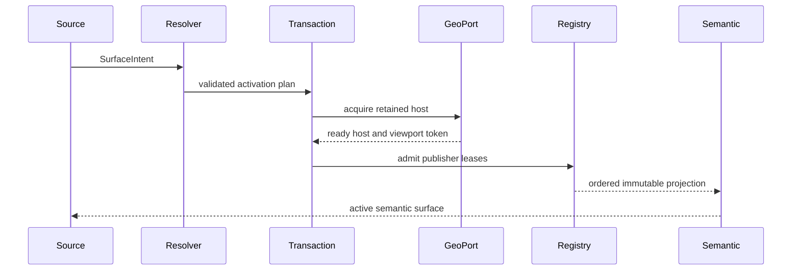
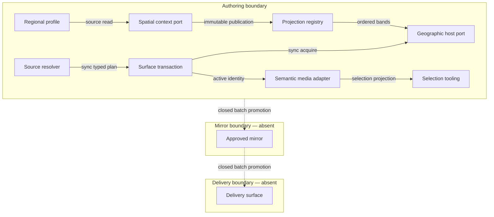

# Geo+XR Mode Product, Technical Architecture, and Decision Contract

## 1. Authority and neutrality boundary

This document owns the universal contract for composing a geographic surface
with spatial context in one `geo-xr` mode. It owns mode intent, atomic
activation, the single-visible-world rule, ordered projection bands, publisher
leases, semantic media exposure, viewport ownership, rollback, and provider or
region substitution.

It does not own a geographic provider, a spatial engine, a regional profile, a
simulation, a camera catalog, an invocation grammar, or a delivery target.
Those capabilities consume the ports defined here and remain independently
replaceable. A regional companion may supply authored coordinates, landmarks,
camera defaults, and provenance, but it cannot redefine this mode.

The contract is derived from this content and frontmatter, not from its path.
Every `##` section is a self-contained module. Concrete product, framework,
library, provider, regional, and source-path names appear only under a heading
containing “Reference implementation.”

## 2. PRD problem, hypothesis, and outcome

Users who need geographic context and spatial interaction are otherwise forced
to choose between a map that loses authored spatial context and a spatial world
that replaces the real geographic surface. Parallel worlds also create
conflicting cameras, gestures, selection state, and overlay order.

**Hypothesis:** one explicit composed mode with one retained geographic host
and typed spatial projections lets a user preserve geographic truth while
adding regional context, an optional local environment, domain data, and
dynamic-subject context without a second visual authority.

**Outcome:** a source can request `geo-xr`, receive one visible and selectable
media surface, interact through the retained geographic camera and gestures,
and exit to the exact prior surface state.

## 3. Personas and user journey

| Persona | Job to be done | Primary risk |
|---|---|---|
| Spatial operator | Inspect authored spatial context at real coordinates | Losing location, gesture, or camera continuity |
| Domain author | Add domain data without owning a renderer | Creating a second world or conflicting layer order |
| Reviewer | Verify source-to-surface identity and cleanup | Mistaking a stacked fallback for one coherent mode |
| Regional data steward | Supply bounded regional facts and provenance | Regional defaults leaking into the universal contract |

| Stage | Action | Touchpoint | Friction | Opportunity |
|---|---|---|---|---|
| Trigger | Apply a source that requests composed context | Source activation | Mode aliases may select the wrong owner | Resolve one exact mode identity |
| Discover | Observe the retained geographic surface | Semantic media stage | A generic wrapper may be invisible to selection tools | Expose one labeled media element |
| Engage | Interact with environment and domain projections | Geographic viewport | Competing cameras or pointer handlers corrupt input | Retain one camera and gesture owner |
| Complete | Inspect or edit the domain capability | Capability-owned panel | Projection state may fork from domain state | Publish immutable snapshots through leases |
| Return | Exit or open another exclusive surface | Surface lifecycle | Hidden overlays or stale padding can survive | Roll back atomically to the captured owner |

## 4. PRD stories, criteria, and VCC translations

| ID | Story | Given / When / Then | VCC translation |
|---|---|---|---|
| `PRD-GXR-01` | As a spatial operator, I want one composed surface so that geographic truth remains visible. | Given a ready geographic host, when `geo-xr` activates, then exactly one visible geographic renderer, camera, and viewport-gesture owner remains. | Verify one host owns rendering, camera, and gestures; no alternate world is mounted. |
| `PRD-GXR-02` | As a domain author, I want ordered projection bands so that capabilities compose without hardcoded peer precedence. | Given valid publishers, when snapshots are admitted, then regional-context, optional local-environment, domain, and dynamic-subject bands render in stable order and each publisher owns one lease. | Verify band order is stable, an explicitly absent optional band stays absent, and a publisher cannot mutate another lease. |
| `PRD-GXR-03` | As a reviewer, I want a semantic media stage so that selection tooling can identify the composed surface. | Given an active mode, when the surface renders, then one labeled `figure` with a caption wraps the renderer without intercepting viewport gestures, and the renderer-owned direct hit target references that caption, exposes the same direct accessible name, and owns the sole conditional selection marker. | Verify the semantic element, accessible name, caption, unique direct-hit selection marker, descendant label reference, exact closest owner, and absence of capture handlers. |
| `PRD-GXR-04` | As a regional data steward, I want profiles outside the mode contract so that regions remain substitutable. | Given two conforming regional profiles, when either is selected, then activation and overlay arbitration are unchanged. | Verify profile substitution changes authored data only, not mode or publisher contracts. |
| `PRD-GXR-05` | As an operator, I want failure to preserve my prior surface so that partial activation cannot corrupt the workspace. | Given any activation or publication failure, when rollback runs, then the captured prior owner, padding, and panel state are restored exactly once. | Verify typed failure plus one idempotent restoration and zero stale projections. |
| `PRD-GXR-06` | As a mobile or offline user, I want the core composition to remain usable so that network loss does not destroy local context. | Given cached or local profile data, when connectivity is absent at a supported viewport, then local projections, selection, and exit remain available. | Verify a 375 by 812 viewport and offline replay preserve interaction and cleanup. |

## 5. Scope, priority, economics, and time-to-value

| Capability | Tier | Impact | Sessions/month | Build hours | Monthly cash/token cost | ROI score | Rationale |
|---|---|---:|---:|---:|---:|---:|---|
| Exact mode identity and atomic activation | Must | 5 | 20 | 24 | $0 | 4.17 | Prevents all partial-owner states |
| One host plus semantic media contract | Must | 5 | 20 | 28 | $0 | 3.57 | Preserves geographic truth and selection |
| Typed band registry and publisher leases | Must | 5 | 20 | 40 | $0 | 2.50 | Removes peer-specific arbitration |
| Regional profile companions | Should | 4 | 12 | 20 | $0 | 2.40 | Keeps the universal core replaceable |
| Remote collaborative spatial sessions | Won't | 2 | 4 | 160 | $25 | 0.04 | Not required for local composition |

`ROI = (impact × sessions) / (build hours + monthly TCO + monthly token cost)`.
The Must threshold is `2.0`.

| Metric | Baseline | Target | Timeline |
|---|---:|---:|---|
| Visible geographic hosts after activation | unspecified | exactly 1 | first increment |
| Alternate renderer/camera owners | unspecified | 0 | first increment |
| Unleased publishers | unspecified | 0 | registry increment |
| Stale projections after exit | unspecified | 0 | first increment |
| Browser reach | desktop-first | desktop and 375 by 812 | first increment |
| Offline core operations | partial | activate from local data, interact, exit | first increment |
| Token cost/month | $0 | $0 | continuous |
| Monthly cash TCO | $0 | $0 | continuous |
| Local / delivered rung | spec-complete / undocumented | runtime-ready / undocumented | after all VCC evidence |

| TTV dimension | Estimate | Ceiling | Validation |
|---|---:|---:|---|
| Manual actions | 2 | 2 | apply one source, select one projection |
| Elapsed time | 30 seconds | 60 seconds | clean-workspace timed walk-through |
| First value | composed geographic and spatial context | — | visible semantic surface assertion |

**Min-viable scope:** exact `geo-xr` activation, one retained host, four
ordered bands, one lease per publisher, one semantic media stage, typed
rollback, and local/offline operation.

**Out of scope:** standalone geographic mode, standalone spatial mode,
simulation rules, regional facts, paid inference, remote collaboration,
production publication, and automatic promotion. OS Status Surface, Agent
Discovery Surface, and Gateway Federation Contract are also outside this
increment.

## 6. Workflow flow: activate, publish, and exit

**Trigger:** an admitted source requests `geo-xr`.

**Actors:** source resolver, surface transaction, geographic host port, spatial
context port, projection registry, semantic media adapter, and operator.

**Happy path:**

1. The resolver validates the exact intent and regional-profile reference.
2. The transaction captures the prior surface owner, viewport padding, and
   panel state.
3. The geographic host confirms readiness before spatial projections publish.
4. The registry admits one lease per publisher and orders snapshots by band.
5. The semantic adapter exposes one labeled `figure`; the interactive renderer
   hit target references its caption, carries the same direct accessible name,
   and owns the sole conditional selection marker.
6. Exit clears leases, releases the composed owner, and restores captured state.

**Alternate path:** a profile supplies no optional local-environment
projection; the geographic host and any admitted regional-context publication
remain valid while the empty local-environment band is explicit.

**Error path:** invalid intent, unavailable host, rejected lease, malformed
snapshot, or failed restoration returns a typed error. No later stage commits
after an earlier failure.

**Postconditions:** either one active composed owner exists with a complete
lease set, or no composed owner exists and the prior state is restored.

## 7. Data flow: source intent to composed projection

| Stage | Component | Input schema | Output schema | Persistence | Error handling |
|---|---|---|---|---|---|
| Ingest | Source resolver | `SurfaceIntent` | `ActivationPlan` | none | reject unknown mode or profile |
| Transform | Profile adapter | `EnvironmentProfile` | bounded geographic/spatial features with source provenance | none | reject invalid coordinates, rings, heights, bounds, or provenance |
| Transform | Projection registry | `OverlayPublication[]` | `OrderedProjection` | volatile memory | reject duplicate or expired lease |
| Store | Surface transaction | prior-owner snapshot | `RestorationToken` | volatile memory for one ownership epoch | abort on incomplete capture |
| Serve | Geographic host port | ordered projection + viewport contract | visible composed surface | host-owned runtime state | preserve prior committed frame |
| Consume | Semantic media adapter | active surface identity | labeled `figure` enclosing the renderer-owned selectable target | none | expose typed unavailable state |

Retention is bounded to the active ownership epoch. No regional profile,
projection snapshot, or restoration token becomes a second persistent store.
This data flow serves the Discover, Engage, Complete, and Return journey stages.

## 8. Orchestration flow: deterministic zero-token composition

This feature has no model executor. Its harness is a single-pass,
schema-validated deterministic pipeline.

**Topology pattern:** sequential
**Max iterations:** 1
**Circuit-breaker:** any invalid input or ownership conflict
**Token budget:** 0 prompt + 0 completion at 100% no-call rate = $0 per run

| Role | Component | Input schema | Output schema | Cost log | Fallback |
|---|---|---|---|---|---|
| Dispatcher | Source resolver | `SurfaceIntent` | `ActivationPlan` | — | typed rejection |
| Executor | Surface transaction | `ActivationPlan` | `ComposedSurfaceState` | model `none`, all token/cost fields zero | restore prior owner |
| Observer | Ownership observer | transition events | bounded diagnostics | — | report telemetry gap |
| Consumer | Semantic media adapter | composed state | semantic surface | — | typed unavailable surface |

**Postconditions:** one typed result, one zero-cost record, and no retry loop.

## 9. TAD architecture and topology

The architecture is ports-and-adapters. The universal core knows functional
contracts only; adapters bind a geographic renderer, spatial context source,
regional profile, or domain capability.

| Node | Role | Type | Lane | Connects to | Connection type | Data residency |
|---|---|---|---|---|---|---|
| Source resolver | Producer | pure parser | Authoring | surface transaction | synchronous typed call | volatile user-device memory |
| Surface transaction | Router | state machine | Authoring | geographic host, registry, semantic adapter | synchronous typed calls | volatile user-device memory |
| Geographic host port | Gateway | interface | Authoring | selected renderer adapter | synchronous lifecycle calls | volatile user-device memory |
| Spatial context port | Producer | interface | Authoring | projection registry | synchronous immutable publication | volatile user-device memory |
| Projection registry | Router | lease registry | Authoring | geographic host port | synchronous ordered snapshot | volatile user-device memory |
| Semantic media adapter | Consumer | semantic UI element | Authoring | selection tooling | document-tree projection | volatile user-device memory |
| Regional profile | Producer | authored companion | Authoring | profile adapter | source read | authored source residency |
| Approved mirror | Consumer | immutable package, absent | Mirror | delivery surface | batch publish, closed | none |
| Delivery surface | Consumer | browser application, absent | Delivery | user device | secure fetch, closed | none |

**Version note:** v1 introduced the universal port, lease, semantic, and
rollback contract. v1.1 separates the source-proven `regional-context` band
from the optional `local-environment` band. It records the current
peer-specific registry as a gap rather than treating specialization as
universal proof.

## 10. Integration contracts and component specifications

| Contract | Required fields | Failure rule |
|---|---|---|
| `SurfaceIntent` | exact mode, source identity, optional profile identity | unknown or aliased mode fails closed |
| `ActivationPlan` | prior owner, requested owner, required ports, rollback order | incomplete plan never acquires ownership |
| `GeoHostPort` | acquire, project, frame, restore, release | one epoch has one host token |
| `SpatialRuntimePort` | resolve profile, publish snapshot, clear publisher | no renderer or camera mutation |
| `EnvironmentProfile` | stable id, coordinate reference, bounded extent, provenance | invalid or unbounded profile is rejected |
| `RegionalContextFeature` | stable id, complete geographic Polygon ring set, real-metre base/height, accuracy, provenance | open, zero-area, self-intersecting, crossing, outside, overlapping, or nested rings; non-finite heights; missing provenance; or presentation-owned camera values are rejected |
| `OverlayPublication` | publisher id, lease token, band, revision, features | duplicate, stale, or cross-lease write is rejected |
| `SemanticMediaContract` | accessible name, caption, selectable state, gesture policy | generic or `aria-hidden` selectable wrappers, parallel HTML markers, and duplicate selection owners are invalid |
| `ViewportContract` | visible aperture, padding token, resize request, restore | restoration is idempotent and exact |

| Component ID | Responsibility | Dependencies | Configuration | Local rung | Delivered rung | VCCs |
|---|---|---|---|---|---|---|
| `TAD-GXR-RESOLVE` | Resolver validates exact source intent. | source parser | accepted mode identities | spec-complete | undocumented | 01, 04 |
| `TAD-GXR-TX` | Transaction commits or rolls back one ownership epoch. | all ports | bounded activation timeout | spec-complete | undocumented | 01, 05 |
| `TAD-GXR-GEO` | Geographic port retains renderer, camera, and gestures. | renderer adapter | provider and style references | spec-complete | undocumented | 01, 06 |
| `TAD-GXR-REGISTRY` | Registry orders immutable snapshots by neutral band and lease. | publisher ports | band order and lease TTL | spec-complete | undocumented | 02, 05 |
| `TAD-GXR-SEMANTIC` | Adapter exposes one selectable semantic surface. | selection tooling | accessible label and selection policy | spec-complete | undocumented | 03, 06 |
| `TAD-GXR-PROFILE` | Adapter converts one authored regional profile. | profile companion | coordinate and extent bounds | spec-complete | undocumented | 04 |

## 11. Quality attributes and failure policy

| Attribute | Scenario and bound | Pattern | Validation |
|---|---|---|---|
| Performance | one activation completes within 1 second after host readiness | single transaction and immutable snapshots | timed local activation |
| Determinism | equal intent, profile, and publications yield equal order | stable band and publisher ordering | replay comparison |
| Security | an unleased publisher cannot mutate another band | capability token per ownership epoch | stale/cross-lease rejection |
| Resilience | any partial failure restores prior state exactly once | idempotent rollback token | injected failure matrix |
| Accessibility | semantic surface is named, captioned, and keyboard discoverable; native direct-hit elements resolve the same name and closest owner | native semantic element plus `aria-labelledby` | document-tree and direct-hit assertions |
| Offline behavior | local profile activation, interaction, and exit need no network | source-backed local adapters | offline walk-through |
| Device reach | desktop and 375 by 812 preserve viewport gestures | responsive visible-aperture contract | cross-device pass |
| Token cost | all core paths use zero model calls | deterministic executor | zero cost log |
| TCO | 12-month incremental cash cost remains $0 | FOSS-first local composition | monthly audit |

Malformed inputs fail before ownership. Projection errors retain the last valid
frame. Restoration failure replaces provisional exit success with a typed
failure. No error path creates an alias mode, fallback renderer, duplicate
camera, unleased publisher, or hidden semantic wrapper.

## 12. VCC, evidence, readiness, and traceability

| VCC | Evaluator-checkable end state | Stated check | Evidence Reference |
|---|---|---|---|
| `VCC-GXR-01` | one host owns renderer, camera, and gestures; alternate world count is zero | focused activation and shared-ownership checks exit 0 | none recorded for the universal contract |
| `VCC-GXR-02` | neutral regional-context, optional local-environment, domain, and dynamic-subject bands accept arbitrary valid publisher identities through leases | registry conformance checks exit 0 | none; current specialization is not a neutral registry |
| `VCC-GXR-03` | one labeled `figure` exposes a caption while the live geographic renderer hit target owns the sole conditional selection marker without capture handlers, parallel HTML markers, a generic replacement wrapper, or `aria-hidden` | semantic document-tree and direct-hit checks exit 0 | none recorded for the universal contract |
| `VCC-GXR-04` | two regional profiles substitute without mode or arbitration changes; complete Polygon rings and source facts pass unchanged through geographic ports; framing uses the minimum circular-longitude interval | profile-substitution, topology, antimeridian, and exact pass-through checks exit 0 | none recorded |
| `VCC-GXR-05` | every injected failure restores prior owner, padding, and projections exactly once | failure-matrix checks exit 0 | none recorded |
| `VCC-GXR-06` | local/offline desktop and mobile paths activate, interact, and exit | clean-workspace browser proof records actions and viewport | none recorded |

| Workstream | Local rung | Delivered rung | Gap | Priority | Exit VCC |
|---|---|---|---|---|---|
| exact mode and single host | spec-complete | undocumented | universal evidence not recorded | major | 01 |
| neutral band registry | spec-complete | undocumented | current implementation is peer-specific | major | 02 |
| semantic media contract | spec-complete | undocumented | universal adapter evidence not recorded | major | 03 |
| profile substitution | spec-complete | undocumented | second-profile proof absent | major | 04 |
| rollback and device reach | spec-complete | undocumented | failure and clean-browser proof absent | major | 05, 06 |

| PRD | TAD component/interface | VCC |
|---|---|---|
| `PRD-GXR-01` | `TAD-GXR-TX` + `TAD-GXR-GEO` | 01 |
| `PRD-GXR-02` | `TAD-GXR-REGISTRY` / `OverlayPublication` | 02 |
| `PRD-GXR-03` | `TAD-GXR-SEMANTIC` / `SemanticMediaContract` | 03 |
| `PRD-GXR-04` | `TAD-GXR-PROFILE` / `EnvironmentProfile` | 04 |
| `PRD-GXR-05` | `TAD-GXR-TX` / `ViewportContract` | 05 |
| `PRD-GXR-06` | `TAD-GXR-GEO` + `TAD-GXR-SEMANTIC` | 06 |

> **Reference implementation: conformance profile.** The
> [selected split structural profile](./agentic-graph-prd-tad-adr-conformance-report.md#reference-implementation-2026-07-31-split-conformance)
> links 19 of 19 selected artifact-bearing rules (`100%`) and counts zero
> advisories. It is not a full guideline-set alignment claim.

The open evidence gaps prevent a rung above `spec-complete`.

## 13. Lane topology and deploy boundaries

| Lane | Function | Mutation rights | Data residency | Readiness ceiling |
|---|---|---|---|---|
| Authoring | write and prove the contract | source, tests, local state | maintainer worktree and user device | runtime-ready |
| Mirror | hold one approved non-public package | publish-only | approved artifact store | runtime-ready |
| Delivery | serve one promoted mirror | publish-only | declared delivery region | production-verified |

| Boundary | From | To | Evidence Reference | Operator instruction | Rollback statement | State |
|---|---|---|---|---|---|---|
| `GXR-AUTHORING-TO-MIRROR` | Authoring | Mirror | none recorded | none | retain prior mirror and verify its manifest | closed |
| `GXR-MIRROR-TO-DELIVERY` | Mirror | Delivery | none recorded | none | retain prior delivery revision and rerun its reachability check | closed |

No authoring command in this document can mutate Mirror or Delivery.

## 14. ADR-1: retain one geographic visual owner

**Status:** Accepted
**Date:** 2026-07-31

**Context:** two rendered worlds create conflicting cameras, gestures, and
geographic representations.

**Decision:** the composed mode retains one geographic renderer, camera, and
gesture owner. Spatial capabilities publish data through ports and never mount
an alternate visible world.

**Alternatives considered:** a second FOSS spatial renderer duplicates the
world; a rasterized spatial snapshot loses interaction.

| Dimension | Chosen local FOSS composition | Second FOSS renderer | Managed scene service |
|---|---:|---:|---:|
| Infra / egress / token cost | $0 / $0 / $0 | $0 / $0 / $0 | $120 / variable / variable |
| Ops burden | low | high | medium |
| 12-month cash TCO | $0 | $0 | at least $1,440 |
| Vendor risk | low | low | high |

**Consequences:** ownership is coherent; spatial adapters cannot assume a
private camera or renderer.

## 15. ADR-2: neutral bands and publisher leases

**Status:** Proposed
**Date:** 2026-07-31

**Context:** peer-name precedence cannot admit a new capability without editing
the arbiter.

**Decision:** order publications by `regional-context`, `local-environment`,
`domain`, and `dynamic-subject` bands, then stable publisher id. The
regional-context band carries source-proven geographic features independently
of an optional local spatial environment. Every publisher requires an
epoch-bound lease.

**Alternatives considered:** hardcoded peer precedence is simpler but coupled;
unmanaged append order is nondeterministic. Both can use FOSS primitives but
neither satisfies substitution.

| Dimension | Neutral in-process registry | Hardcoded in-process peers | Managed event broker |
|---|---:|---:|---:|
| Infra / egress / token cost | $0 / $0 / $0 | $0 / $0 / $0 | $60 / variable / $0 |
| Ops burden | low | medium | medium |
| 12-month cash TCO | $0 | $0 | at least $720 |
| Vendor risk | low | low | medium |

**Consequences:** new publishers do not change arbitration; the existing
peer-specific specialization remains a gap until replaced at its root owner.

## 16. ADR-3: native semantic media element

**Status:** Accepted
**Date:** 2026-07-31

**Context:** a generic or hidden wrapper cannot express selectable visual
media to accessibility and selection tooling.

**Decision:** expose the active surface through one labeled `figure` with a
caption. Its renderer-owned interactive hit target references that caption
with `aria-labelledby`, carries the same direct accessible name and the sole
conditional selection marker, and retains its native input semantics. The
`figure` carries no duplicate marker and adds no gesture-capture handler.
Neither the adapter nor a publisher may substitute a generic `div`, add
`aria-hidden`, or mount parallel HTML markers over the geographic renderer.

**Alternatives considered:** a generic container requires parallel semantics;
a FOSS custom-element wrapper adds lifecycle complexity without more value.

| Dimension | Native semantic element | FOSS custom element | Generic container |
|---|---:|---:|---:|
| Infra / egress / token cost | $0 / $0 / $0 | $0 / $0 / $0 | $0 / $0 / $0 |
| Ops burden | low | medium | medium |
| 12-month cash TCO | $0 | $0 | $0 |
| Accessibility risk | low | medium | high |

**Consequences:** direct browser hits and the semantic ancestor resolve the
same accessible media identity, while selection tooling lands on the real
interactive media target and the renderer retains viewport ownership.

## 17. ADR-4: regional facts live in companions

**Status:** Accepted
**Date:** 2026-07-31

**Context:** hardcoded regional bounds, landmarks, and camera defaults make the
mode non-universal.

**Decision:** each region owns one authored profile companion with provenance;
the universal mode consumes only `EnvironmentProfile`.

**Alternatives considered:** embedded constants cost $0 but duplicate
authority; a managed geodata service adds network and provider dependence.

| Dimension | Authored FOSS-friendly companion | Embedded constants | Managed geodata service |
|---|---:|---:|---:|
| Infra / egress / token cost | $0 / $0 / $0 | $0 / $0 / $0 | $240 / variable / $0 |
| Ops burden | low | medium | medium |
| 12-month cash TCO | $0 | $0 | at least $2,880 |
| Substitution risk | low | high | high |

**Consequences:** regional data can evolve without changing mode arbitration,
and the companion cannot claim legal boundary authority from presentation
bounds.

## 18. Reference implementation: current product mapping

The current agentic-graph mapping specializes this contract as follows:

- mode and activation:
  `canvas/src/lib/canvas/canvas3dMode.ts`,
  `canvas/src/features/geospatial/geoXrSurfaceActivation.ts`,
  `canvas/src/lib/canvas/canvasSurfaceOwnershipRuntime.ts`, and
  `canvas/src/features/geospatial/geospatialSurfaceOwnershipRuntime.ts`;
- publication:
  `canvas/src/features/geospatial/geoXrOverlayPublisherLease.ts`,
  `canvas/src/features/geospatial/geoXrFlightOverlayComposition.ts`, and
  `canvas/src/features/geospatial/useGeoXrOverlayPublisher.ts`;
- regional-context profile contract and admission:
  `grph-shared/src/geospatial/regionalPoiGeo.ts` and
  `canvas/src/features/geospatial/regionalPoiProfileCatalog.ts`;
- MapLibre adapters:
  `gympgrph/src/regionalPoiMapLibre.ts`,
  `gympgrph/src/flightGeoEnvironmentMapLibre.ts`,
  `gympgrph/src/cityGeoOverlayMapLibre.ts`,
  `gympgrph/src/flightGeoOverlayMapLibre.ts`, and
  `gympgrph/src/geoXrOverlayLayerOrder.ts`;
- React semantic wrapper:
  `canvas/src/lib/cards/SemanticMediaFigure.tsx` with
  `canvas/src/lib/cards/mediaPreviewSurfaceSelection.ts` and
  `canvas/src/features/game-city-sim/citySimMediaSurface.ts`;
- native canvas semantic binding:
  `gympgrph/src/features/geospatial/mapLibreCanvasSemanticOwner.ts` and
  `canvas/src/lib/three/threeCanvasSemanticOwner.ts`;
- regional profile:
  [ADM0 Singapore companion](./agentic-graph-adm0-singapore-prd-tad-ard.companion.md);
- domain consumer:
  [City-Building Simulation PRD/TAD/ADR](./agentic-graph-game-city-building-sim-prd-tad-ard.md).

MapLibre is the retained native geographic host in this reference
implementation. Three.js and React Three Fiber remain outside the active City
geographic presentation. If a shared Three renderer was already mounted before
City activation, its exact canvas may remain mounted only as an inactive,
transparent, pointer-inert lifecycle owner; a direct City entry creates no
Three owner. The City specialization resolves one companion-owned
regional-context profile and presents every exact admitted surface, real-metre
height, accuracy, provenance, and one derived fixed-pixel locator per identity
below City parcels and stopped Flight route/aircraft.
Its Flight-local XR environment publication remains explicitly absent.
MapLibre frames regional and domain bounds through its native camera and its
live canvas remains the sole selection owner; no HTML marker, generic
selectable wrapper, or `aria-hidden` surface competes with it. The current
overlay composer still hardcodes City and Flight identities and precedence, so
it is evidence for a working specialization only—not evidence that ADR-2's
neutral registry is implemented.

The standalone XR/Physics presentation reuses the same semantic figure
contract. Its renderer-created WebGL `canvas` receives the caption relation,
accessible region name, and sole conditional selection marker directly; the
React Three Fiber wrapper remains unmarked and never substitutes a generic
selection owner.

Current focused source suites include
`geoXrSurfaceActivation.test.ts`,
`canvasXrSharedSurfaceOwnership.test.ts`,
`geoXrOverlayPublisherLease.test.ts`,
`cityFlightGeoOverlayComposition.test.ts`,
`flightSimCityGeoXrLayerStack.test.ts`,
`cityGeoOverlayMapLibre.test.ts`, and
`citySimSemanticMediaSurface.test.tsx`. Results must be recorded against the
exact candidate before any readiness rung is raised.
