# agentic-graph LLM Prompt Contract PRD-TAD Companion

> Canonical source: `docs/documents/agentic-graph-llm-prompt-contract-prd-tad.md`
>
> Continuation scope: TAD, data contracts, validation, implementation guidance, open questions, and final decision.

---

## 7. TAD

### 7.1 Technical Decision Summary

| Decision | Status | Rationale |
|---|---|---|
| Reuse `CHAT_BASE_AGENTIC_OS_RESPONSE_CONTRACT_PROMPT` as the sole chatAgenticGraph contract owner | Accepted | Avoids prompt duplication and keeps fixes upstream. |
| Reuse workspace-document apply path for chat-generated AGENTIC_OS Markdown | Accepted | Keeps persistence, replay, and graph application deterministic. |
| Keep `tryParseMarkdownFrontmatterFlowGraph()` as the first Markdown graph parser | Accepted | Prevents duplicate or lossy parser forks. |
| Keep `flow.subgraphs -> kg:subgraphs -> deriveGraphGroups()` as the grouping pipeline | Accepted | Prevents duplicate cluster/group owners. |
| Reuse `buildScopedGraphSemanticKey()` everywhere graph identity is needed | Accepted | Prevents recomputation churn and signature drift. |
| Parse typed AGENTIC_OS semantic sigils through `agenticOsSemanticGraph.ts` | Accepted | Adds queryable semantic nodes and directed edges without legacy untyped remaps or a second Markdown parser. |
| Gate final response publication on provider terminal completeness and publish optional provider-exposed thinking as a separate response part | Accepted | Prevents partial success, preserves the answer losslessly, and keeps reasoning visibility independent of request subject matter. |
| Present generated collections through one shared Rich Media coordinator without changing semantic execution edges | Accepted | Gives Chat and Widget materialization one neutral, viewport-aware fan-out while preserving lineage, Run targeting, and connected-value behavior. |
| Delete stale competing paths instead of aliasing them | Accepted | Aligns with root-fix and no-backcompat-shim rules. |

### 7.2 Component Specification

#### TAD-C01 - MainPanel Chat Configuration

- Owner: `SettingsView` and `useSettingsChatAssist`.
- Responsibility: provider presets, endpoint resolution, model discovery, context-scope selection, and integration enablement.
- Constraint: configuration is upstream-only; chat rendering and request submission must not define competing config sources.

#### TAD-C02 - FloatingPanel Chat Mount

- Owner: `ToolbarToolMenu.impl.tsx` with `FloatingPanelChatLazy`.
- Responsibility: mount the chat UI when the floating panel is in chat mode.
- Constraint: no second chat entrypoint inside MainPanel.

#### TAD-C03 - FloatingPanelChat Runtime

- Owner: `FloatingPanelChat.tsx`.
- Responsibility: read graph data, current node, markdown text, workspace context cache key, and chat settings from the store.
- Constraint: graph context and workspace context must reuse shared cache and signature helpers.

#### TAD-C04 - Submit Shell / Coordinator / Helpers

- Owners:
  - `useFloatingPanelChatSubmit.ts`
  - `floatingPanelChatSubmitPreflight.ts`
  - `floatingPanelChatSubmitCoordinator.ts`
  - `floatingPanelChatSubmitRequest.ts`
  - `floatingPanelChatSubmitTransport.ts`
  - `floatingPanelChatStreaming.ts`
  - `floatingPanelChatAgenticOsAttempt.ts`
  - `chatStreamArtifacts.ts`
  - `chatStreamArtifactDereference.ts`
- Responsibility:
  - keep `useFloatingPanelChatSubmit.ts` as a thin shell for request-url guards and optimistic submit setup
  - choose AGENTIC_OS or generic contract by `chatStorageTarget` during request-build
  - resolve endpoint and provider request options through dedicated request and transport helpers
  - stream SSE deltas and persist live drafts plus session-folder stream artifacts through shared helpers
  - dereference eligible share/report URLs through the existing workspace URL-content import pipeline
  - validate AGENTIC_OS Markdown and retry with correction prompts through the AGENTIC_OS attempt helper plus validator/recovery modules
  - keep async lifecycle ownership centralized in `floatingPanelChatSubmitCoordinator.ts`
- Constraint: submit-flow enhancements must land in the existing shell-plus-helper stack, not in a second orchestrator and not by re-monolithizing the hook.

#### TAD-C05 - Finalize / Persist / Apply

- Owner: `useFinalizeAssistantSuccess.ts` plus `chatAgenticOsCanvasApply.ts` and `applyWorkspaceImportToCanvas.ts`.
- Responsibility:
  - append canonical workspace document
  - normalize canonical AGENTIC_OS path
  - follow workspace path
  - persist stream-log, stream-report, and dereferenced markdown artifacts in the same session folder
  - call `applyChatAgenticOsWorkspaceDocumentToCanvas()`
- Constraint: canvas application must materialize the saved document through Source Files with `applyWorkspaceImportToCanvas()` before reusing `setActiveMarkdownDocument()`.

#### TAD-C06 - AGENTIC_OS Workspace Path Contract

- Owner: `chatHistoryWorkspace.paths.ts`.
- Responsibility: canonical session-folder AGENTIC_OS path derivation: `/chat-log/YYYYMMDDTHHmmssZ/agenticOs_YYYYMMDDTHHmmssZ.md`, trace companion `agentic-os-trace_YYYYMMDDTHHmmssZ.md`, and markdown output/manifest consolidation back into `agenticOs_YYYYMMDDTHHmmssZ.md`.
- Constraint: path identity is part of the runtime contract; ad hoc filename schemes are forbidden.

#### TAD-C07 - Stream Artifact Session Contract

- Owner: `chatStreamArtifacts.ts`.
- Responsibility: derive one timestamped session folder, fold stream-log content into `agentic-os-trace_*` for AGENTIC_OS sessions, and keep `chat-stream-report*` plus dereferenced markdown artifact filenames on the shared workspace path.
- Constraint: stream artifacts are additive companions to canonical `agenticOs_*`; they must not become a second graph-apply source.

#### TAD-C08 - Markdown Graph Parse Priority

- Owner: `features/parsers/default.ts`.
- Responsibility: prefer frontmatter-flow parsing before generic Markdown parse.
- Constraint: no Mermaid-only side parser may supersede this entry order for chat-generated Markdown.

#### TAD-C09 - Frontmatter-Flow Graph Parser

- Owner: `markdownFrontmatterFlowGraph.core.ts` and its parser modules.
- Responsibility:
  - parse canonical YAML-frontmatter `flow:` documents
  - normalize nodes, edges, connections, socket types, clusters, and subgraphs
  - emit `GraphData` with `context: 'frontmatter-flow'`
- Constraint: grouping and graph semantics are normalized here once.

#### TAD-C10 - Import Mode Application

- Owner: `applyGraphDataCanonicalBootstrap.ts`, `frontmatterFlowImportMode.ts`, and `applyWorkspaceImportToCanvas.ts`.
- Responsibility: apply graph data, frontmatter-flow import modes, and canvas presets without leaking interactive view mutations into passive paths.
- Constraint: active import and passive source switching must remain separate.

#### TAD-C11 - Group And Cluster Rendering

- Owner: `subgraphs.ts` and `graphGroups.ts`.
- Responsibility: read normalized `kg:subgraphs` metadata and project it into rendered group underlays and nested group structures.
- Constraint: rendered groups are a projection, not an independent authoring model.

#### TAD-C12 - Shared Graph Semantic Identity

- Owner: `semanticKey.ts` and `lookupCache.ts`.
- Responsibility: stable graph-structure signatures and scope-aware semantic keys for reuse across graph-aware UI surfaces.
- Constraint: no local substitute helper may fork semantic identity behavior.

#### TAD-C13 - Typed AGENTIC_OS Semantic Graph Extraction

- Owner: `agenticOsSemanticGraph.ts`, `agenticOsSemanticQuery.ts`, `workspaceStructuredGraph.ts`, and the default Markdown parser.
- Responsibility: parse inline typed `` `@node:type:id` `` and `` `@edge:predicate:source->target` `` sigils outside fenced code, validate optional `node_types` and `edge_predicates` frontmatter lists, infer edge endpoints only when the typed contract is explicit, merge semantic GraphData with neutral Markdown structure, and expose path/filter/search/ancestor/descendant helpers.
- Constraint: untyped legacy references such as `@node:n-trigger` are references only; they must not be remapped into typed nodes.

#### TAD-C14 - Headless Response Terminal And Part Coordinator

- Owner: `runTextEventStream.ts`, `floatingPanelChatStreaming.ts`, `storyboardWidgetWorkflowTextGenerationProvider.ts`, `storyboardWidgetHeadlessTextRun.ts`, and the shared Rich Media publisher.
- Responsibility: reject provider-declared non-success terminals before returning accumulated assistant text; preserve a successful answer as the required `response` part; carry non-empty provider-exposed reasoning as the optional `thinking` part; and, for canvas-bound output, publish each part to a distinct Rich Media Panel under one run identity. Newly owned Markdown panels declare the shared Editor Workspace Viewer capability upstream; explicit authored targets retain their selected surface, and explicit `false` remains the compact-surface opt-out.
- Input contract: provider event stream or response envelope plus a prepared headless response run.
- Output contract: terminal run result with one complete response part and zero or one thinking part; canvas-bound Widget publication materializes those parts as distinct Rich Media Panels, while Chat-only projection keeps reasoning in its dedicated UI and stream artifact.
- Fallback: a bounded capability-compatible retry may replace an incomplete attempt; otherwise retain typed failure status and never label provisional text complete.
- Constraint: response-part routing is provider-neutral and domain-agnostic. It MUST NOT inspect filenames, directories, user topics, languages, example phrases, or use-case labels.

#### TAD-C15 - Shared Materialization Coordinator And Fan-Out Projection

- Owner: `storyboardWidgetRunExecutionAnchor.ts`, `storyboardWidgetWorkflowRichMediaPublication.ts`, `runMaterializationProjection.ts`, `storyboardWidgetRenderGraph.ts`, and `overlayTopologyLayoutSignature.ts`.
- Responsibility: capture one immutable source/viewport execution anchor; plan measured natural-size materialization; retain the existing semantic source-or-selected-parent edges to generated cards and source edge to the Rich Media coordinator; attach a render-only projection source to those semantic card edges; and include that projection in overlay cache identity.
- Semantic contract: downstream Run, Run-all, connected-value discovery, persistence, and lineage read the original `source-or-selected-semantic-parent -> generated-card` endpoints and semantic `parentNodeId`.
- Presentation contract: the Storyboard overlay may resolve the existing semantic card edge from the coordinator declared by `workflowMaterializationProjectionSourceNodeId`, while `workflowMaterializationParentNodeId` records the same presentation parent on the child and remains the durable fallback after source serializers that omit optional edge extension fields. Resolution prefers the live edge annotation and falls back to the matching child annotation. No physical coordinator-to-card execution edge is created.
- Wide layout: source lane -> coordinator lane -> one ordered top-down fan-out lane.
- Constrained layout: at natural-size 100% scale, keep the source and camera stable and collapse coordinator plus fan-out into one rightward, coordinator-first top-down column.
- Migration: materialization layout version 3, balanced Probe layout version 7, and Probe output layout version 3 supersede older canonical placement; a valid current materialization layout remains authoritative.
- Fallback: an absent, invalid, stale, or out-of-overlay projection source resolves to the semantic edge source; an invalid topology declaration uses the existing generic balanced planner.
- Constraint: topology and placement depend only on semantic role, measured footprints, captured viewport, scale, grid, and version. They MUST NOT inspect request content, language, domain, provider, model, labels, filenames, directories, example phrases, or feature-specific card counts.

### 7.3 Data Contracts

#### DC-01 - Chat Storage Target

- `chatAgenticGraph` -> AGENTIC_OS structured Markdown contract.
- `chatHistory` -> generic chat response contract.
- No-slash `chatAgenticGraph` turns stay on the generic plain Markdown/`response:` contract; recognized Agentic OS invocations, including `/prd-tad.create`, select the structured AGENTIC_OS contract and add Storyboard template slash/#/@ directive context.
- Recognized leading invocations are route metadata. Provider payload shaping, prompt context, and AGENTIC_OS fallback use `chatRuntimeInvocationQuery.ts` to keep the route token separate from the remaining user request, so `/prd-tad.create` can select PRD/TAD structure while the model receives the same query/media payload a no-slash turn would receive.
- Both base prompt contracts reuse `chatStoryboardTemplateContract.ts` for `agentic-os-2d-renderer-storyboard-template/v1` alignment: Storyboard frontmatter intent is data, runtime readiness is proof-gated, and Prod/Cloudflare publish remains blocked until operator approval.
- The PRD enhancement MUST NOT blur these two output modes.

#### DC-02 - AGENTIC_OS Workspace File Identity

- Session folder: `YYYYMMDDTHHmmssZ`
- Canonical AGENTIC_OS file: `agenticOs_<session>.md`
- Trace companion: `agentic-os-trace_<session>.md`
- Markdown run output and manifests: consolidated sections in `agenticOs_<session>.md`

The runtime MUST persist and normalize to these forms instead of inventing alternate file identity patterns.

#### DC-03 - Stream Artifact Session Identity

- Session folder: `YYYYMMDDTHHmmssZ`
- Stream log content: consolidated section in `agentic-os-trace_<session>.md`
- Stream report file: `chat-stream-report_<session>.md`
- Additional dereference files: stable ordinal markdown basenames inside the same session folder

The runtime MUST derive these from the shared session timestamp instead of provider-local naming.

#### DC-04 - Frontmatter Graph Identity

- Graph context: `frontmatter-flow`
- Group metadata key: `kg:subgraphs`
- Group render ID: `subgraph:<id>`

#### DC-05 - Prompt And Validator Coupling

- Prompt contract emits structured AGENTIC_OS Markdown.
- Validator checks structural and syntactic rules.
- Correction prompt reuses the same output contract.
- Finalize persists the validated or best-available AGENTIC_OS document.

#### DC-06 - Typed AGENTIC_OS Semantic Sigils

- Node sigil: `` `@node:<type>:<id>` ``
- Edge sigil: `` `@edge:<predicate>:<source>-><target>` ``
- Optional frontmatter guards: `node_types` and `edge_predicates`
- Graph identity: `metadata.kind = agentic-os-semantic`, `metadata.graphSemanticKey` from `buildScopedGraphSemanticKey()`

#### DC-07 - Headless Response Parts

- Run identity: `agentic-graph-headless-response-run/v1` plus one `runId`.
- Required part: `response`, containing the complete successful assistant answer.
- Optional part: `thinking`, containing only non-empty reasoning text or summaries explicitly exposed by the provider.
- Terminal rule: incomplete, length-limited, failed, cancelled, and transport-error terminals are non-success even when provisional response text exists.
- Isolation rule: `thinking` never replaces, prefixes, suffixes, truncates, or shares a panel with `response`.
- Absence rule: no provider-exposed reasoning means no thinking publication.
- Presentation rule: newly owned Markdown parts declare the Editor Workspace Viewer capability; explicit authored targets retain their selected surface; an explicit `false` opts into the compact surface; routing uses persisted content capabilities rather than request- or provider-specific heuristics.

#### DC-08 - Materialization Semantics And Projection

- Topology mode: `coordinator-fanout-rightward-top-down`.
- Semantic coordinator edge: existing `source -> Rich Media coordinator`.
- Semantic generated-card edge: existing `source-or-selected-semantic-parent -> generated-card`.
- Child presentation parent: `workflowMaterializationParentNodeId = <coordinator-id>`.
- Edge presentation source: `workflowMaterializationProjectionSourceNodeId = <coordinator-id>`.
- Overlay edge: presented as `coordinator -> generated-card` only when the coordinator resolves inside the active overlay; otherwise it falls back to the semantic source.
- Physical coordinator-to-card execution edge: forbidden.
- Persistence rule: the typed or plain property envelope is preserved while presentation metadata is merged; semantic endpoints and semantic parent fields are not rewritten.
- Cache rule: overlay topology signatures include the presentation source, so a projection-only change invalidates stale edge geometry without mutating execution semantics.

### 7.4 Failure Handling

| Failure point | Current owner | Required behavior |
|---|---|---|
| Missing endpoint or model | `floatingPanelChatSubmitPreflight.ts` via `useFloatingPanelChatSubmit` | Abort early with UI error; do not create alternate request path. |
| Provider request 400/429/model mismatch | `floatingPanelChatSubmitTransport.ts` via `floatingPanelChatSubmitCoordinator.ts` | Retry token parameter fallback or model fallback in the same runtime. |
| Empty assistant response | `floatingPanelChatStreaming.ts` plus `floatingPanelChatSubmitCoordinator.ts` | Surface explicit error and do not persist partial final content as success. |
| Assistant fragment followed by incomplete or length terminal | `runTextEventStream.ts`, `floatingPanelChatStreaming.ts`, plus the headless text-generation adapter | Reject the fragment as terminal success; perform only the bounded compatible retry or preserve a typed failure state. |
| Provider exposes reasoning | headless text-generation adapter plus shared Rich Media publisher | Preserve the final answer independently and materialize non-empty reasoning in its own optional `thinking` panel. |
| Projection coordinator is missing, stale, or outside the active overlay | Storyboard overlay edge projector | Fall back to the semantic edge source; never fabricate a node or rewrite semantic endpoints. |
| Coordinator/fan-out cannot fit as three natural-size stages | Run materialization planner | Keep source and camera stable; compare measured layouts and use one rightward coordinator-first downstream stack when it has the lower overlap/overflow score. |
| Invalid AGENTIC_OS structure | `validateChatMarkdown` + `buildCorrectionPrompt` | Retry upstream contract before finalize. |
| Stream artifact persistence mismatch | `chatStreamArtifacts.ts` | Keep canonical `agenticOs_*` success path intact and fail stream artifacts additively. |
| Share/report dereference failure | `chatStreamArtifactDereference.ts` via `fetchWorkspaceUrlContent()` | Skip the failing dereference, keep the original observed URL, and avoid a second fetch stack. |
| Persist/apply mismatch | `useFinalizeAssistantSuccess` / `chatAgenticOsCanvasApply.ts` | Persist canonical file first, then apply through workspace-document import. |
| Parse failure | parser stack | Fall back inside the existing parser chain only; do not spawn a parallel parser owner. |
| Typed semantic parse mismatch | `agenticOsSemanticGraph.ts` | Emit warnings or fail strict mode at the parser owner; do not reinterpret untyped legacy sigils downstream. |
| Group rendering mismatch | `subgraphs.ts` / `graphGroups.ts` | Fix normalization or projection at the root; do not duplicate group metadata. |

### 7.5 Performance And Stability Constraints

- Draft writes should remain throttled during SSE streaming; no per-character synchronous graph apply.
- Final graph application occurs after canonical workspace persistence, not on every stream chunk.
- Passive source-file parsing must remain passive.
- Stream artifact writes must stay session-scoped and additive to the canonical AGENTIC_OS path.
- URL dereference must reuse the shared workspace URL-content import path, not a second fetch/cache layer.
- Group derivation must read normalized metadata and avoid recomputing alternative group registries.
- Graph cache identity must reuse the shared semantic-key helper.
- Typed AGENTIC_OS semantic Markdown is a structured workspace graph and must suppress keyword-mode re-derivation.
- Coordinator/fan-out layout must use measured natural-size footprints and the captured visible viewport; it must not resize cards, mutate zoom/pan, or replace the source position to manufacture fit.
- Presentation-only projection must not become an execution edge, and the projection source must participate in overlay topology cache invalidation.

### 7.6 Current End-to-End Sequence

```mermaid
flowchart LR
  A[MainPanel Settings] --> B[FloatingPanel chat]
  B --> C[FloatingPanelChat]
  C --> D[useFloatingPanelChatSubmit shell]
  D --> E[submit preflight]
  D --> F[submit coordinator]
  F --> G[CHAT_BASE_AGENTIC_OS_RESPONSE_CONTRACT_PROMPT]
  F --> H[request build plus provider transport]
  H --> I[streamed assistant text]
  I --> J[upsertChatHistoryWorkspaceDraft]
  I --> K[AGENTIC_OS recovery plus validateChatMarkdown retry]
  K --> L[useFinalizeAssistantSuccess]
  L --> M[appendChatHistoryWorkspaceFile]
  L --> N[applyChatAgenticOsWorkspaceDocumentToCanvas]
  N --> O[setActiveMarkdownDocument]
  O --> P[default markdown parser]
  P --> Q[tryParseMarkdownFrontmatterFlowGraph]
  Q --> R[GraphData context=frontmatter-flow]
  R --> S[applyFrontmatterFlowImportModes]
  R --> T[kg:subgraphs metadata]
  T --> U[readSubgraphs + deriveGraphGroups]
  U --> V[GraphCanvas groups and clusters]
```

Component inventory: canonical section 2.1 plus TAD-C01 through TAD-C15 in this companion.

### 7.7 Frontmatter Output Reality

The import layer accepts Markdown with YAML frontmatter presets. The canonical chat path is a richer AGENTIC_OS structured Markdown document containing:

- identity fields such as `title`, `graphId`, `doc_type`, `date`, `ai_model`, and `lang`
- structural blocks such as `$schema`, `spec`, `runner`, `links`, `canvas`, `graph_meta`, `pipeline`, `mermaid`, and `flow`
- `flow.subgraphs` as the grouping source of truth

Minimal canvas preset keys remain a supported import surface, but the contract must not downgrade generated AGENTIC_OS output into a thinner format that drops `flow`, `pipeline`, or `subgraph` semantics.

---

## 8. Validation And Traceability

### 8.1 Current Validation Surfaces

| Surface | Existing test / code guard | What it proves |
|---|---|---|
| Prompt snippets and contract wording | `canvas/src/__tests__/chatResponseContractPrompt.test.ts` | AGENTIC_OS and generic prompt contracts include required structural guidance. |
| Structured AGENTIC_OS compatibility | `chatResponseContractPrompt.test.ts` | Base template and deterministic fallback are parseable by frontmatter-flow parser and validation rules. |
| Submit helper ownership | `chatResponseContractPrompt.test.ts` | Thin hook delegation, request-build, transport fallback, preflight, coordinator, and AGENTIC_OS retry helpers stay decomposed and behaviorally aligned. |
| Finalize-to-canvas apply path | `chatResponseContractPrompt.test.ts` | Finalize uses `applyChatAgenticOsWorkspaceDocumentToCanvas()` and the workspace-document apply flags. |
| Stream artifact session writes | `canvas/src/__tests__/chatStreamArtifacts.test.ts` | Session-folder stream logs, reports, and dereferenced markdown artifacts stay on the shared workspace path. |
| Stream hardcode guard | `canvas/src/__tests__/miromindStreamArtifactHardcodeGuard.test.ts` | Example shared URLs are not committed as repo literals. |
| Frontmatter-flow parse behavior | `frontmatterFlowNodeNormalize.test.ts` | Frontmatter-flow node and subgraph normalization stays valid. |
| Typed AGENTIC_OS semantic graph | `canvas/src/__tests__/agenticOsSemanticGraph.test.ts` | Typed `@node` / `@edge` sigils become semantic-keyed GraphData, query helpers work, Markdown parser merge preserves document structure, and untyped legacy references are not remapped. |
| Passive import-mode guard | `frontmatterFlowImportModeSeepageRegression.test.ts` | Passive flows do not replay interactive import modes. |
| Source-file apply guard | `sourceFilesIngestStaleGuard.test.ts` | Workspace import and composed graph apply stay on the canonical graph-owning path. |
| Shared semantic-key reuse | `sourceFilesIngestStaleGuard.test.ts` and other regressions | Graph identity remains rooted in `buildScopedGraphSemanticKey()`. |
| Partial terminal rejection | `storyboardWidgetTextGenerationProviderRetry.test.ts`, `byteplusRunTextTerminal.test.ts`, `chatResponseStreamingContract.test.ts` | A readable fragment cannot bypass incomplete/length terminal handling in Widget generation or FloatingPanel Chat, and a bounded retry ends on a complete response. |
| Response/thinking panel isolation | `storyboardWidgetHeadlessOutputWiring.test.ts` | Provider-exposed thinking uses a distinct owned Rich Media publication and never alters the response text. |
| Rich Media Viewer publication | `storyboardWidgetExplicitOutputWiring.test.ts`, `storyboardWidgetNaturalLanguageRequest.test.ts`, `richMediaPanelTextModeRegression.test.tsx`, `richMediaPanelWorkspaceViewerPostEditRegression.test.tsx` | Newly owned Markdown output selects the shared Editor Workspace Viewer, explicit compact opt-out survives, and view/edit persistence remains canonical. |
| Generic coordinator/fan-out planner | `storyboardWidgetNaturalLanguageRequest.test.ts` | A wide viewport preserves source/coordinator/ordered fan-out lanes; a constrained natural-size viewport preserves the source and collapses only coordinator plus fan-out into one rightward top-down column; invalid topology falls back to the generic balanced planner. |
| Semantic-versus-presentation edge isolation | `storyboardWidgetExplicitOutputWiring.test.ts` | Semantic source-to-card endpoints and Run targeting remain unchanged while the overlay projects those cards from the Rich Media coordinator without adding coordinator-to-card execution edges. |
| Canonical layout migration | `storyboardProbeTreeOutputLayout.test.ts`, `storyboardWidgetResetAllProbeTreeLayout.test.ts` | Older layouts migrate once to coordinator-before-branches placement and a settled current layout remains idempotent. |

### 8.2 Required PRD-To-TAD Traceability

| PRD epic | TAD owner(s) | Validation owner |
|---|---|---|
| PRD-E1 | TAD-C01, TAD-C02, TAD-C03, TAD-C12 | settings assist behavior + graph semantic-key reuse tests |
| PRD-E2 | TAD-C04, TAD-C09 | `chatResponseContractPrompt.test.ts`, validator behavior |
| PRD-E3 | TAD-C04, TAD-C05, TAD-C06, TAD-C07, TAD-C14, TAD-C15, DC-07, DC-08 | finalize/apply tests, stream artifact and workspace path helpers, terminal completeness tests, response-part publication tests, coordinator/fan-out layout tests, and semantic-versus-presentation edge isolation tests |
| PRD-E4 | TAD-C08, TAD-C09, TAD-C10, TAD-C11 | parser and import-mode regression tests |
| PRD-E5 | TAD-C10, TAD-C11, TAD-C12 | stale-guard and semantic-key reuse tests |
| PRD-E6 | TAD-C13, DC-06 | `agenticOsSemanticGraph.test.ts` plus parser runner coverage |

### 8.3 Definition Of Done

This scope is done only when all of the following are true:

1. The docs describe only real in-repo runtime owners for the current chat-to-canvas path.
2. The enhanced prompt contract is specified as an upstream change to `CHAT_BASE_AGENTIC_OS_RESPONSE_CONTRACT_PROMPT`.
3. Group and cluster semantics are documented as one normalized pipeline, not parallel concepts.
4. Stream artifacts and share/report dereference remain additive workspace companions, not alternate apply surfaces.
5. Stale or speculative components are removed from the canonical doc rather than kept as competing proposed owners.
6. Focused validation remains tied to existing tests and parser/import guards.
7. Provider-declared incomplete or length-limited fragments cannot finalize as successful answers, and non-empty provider-exposed thinking is isolated in a separate Rich Media publication.
8. Newly owned Markdown response parts render and edit through the shared Editor Workspace Viewer without request-, provider-, label-, or file-specific surface heuristics.
9. A generated collection preserves source-or-selected-parent semantic lineage while the overlay presents one Rich Media coordinator with an ordered rightward top-down fan-out; constrained 100% placement keeps the source stable, and no presentation-only execution edge exists.

---

## 9. Implementation Guidance For The Next Code Pass

This document update does not itself change runtime code, but it sets the exact direction for the next implementation pass.

### 9.1 Safe Enhancement Targets

1. `chatBaseAgenticOsResponseContractPrompt.ts`, `chatBaseResponseContractPrompt.ts`, and the `chatResponseBaseContract.ts` re-export
   - tighten anti-duplicate and anti-stale wording
   - reinforce `flow.subgraphs` as the grouping SSOT
   - reinforce request-shaped section behavior
2. `chatMarkdownValidation`
   - reject any newly discovered duplicate grouping or stale heading patterns
3. `chatHistoryWorkspace.agenticOs.build`
   - preserve request-shaped normalization and continue stripping stale canned labels
4. `chatStreamArtifacts.ts`
   - keep session-folder lineage concise and renderer-neutral
5. `chatResponseContractPrompt.test.ts`
   - add focused assertions for any newly tightened prompt requirements
6. `storyboardWidgetRunExecutionAnchor.ts` and `runMaterializationProjection.ts`
   - keep topology selection footprint- and viewport-driven
   - preserve semantic endpoints while projecting coordinator-owned overlay geometry
   - version migration at the shared layout owner rather than patching coordinates after render

### 9.2 Unsafe Changes To Avoid

1. Adding a new chat orchestrator hook for the same request path.
2. Adding a direct assistant-text-to-graph mutation helper.
3. Adding a second grouping metadata format next to `kg:subgraphs`.
4. Introducing compatibility remaps for stale prompt shapes instead of fixing the prompt and validator upstream.
5. Adding a second share/report fetch client instead of reusing workspace URL import helpers.
6. Replacing shared semantic-key helpers with local hash logic.
7. Adding physical coordinator-to-card edges for visual grouping or rewriting semantic `parentNodeId` to match the overlay.
8. Hardcoding coordinates, card counts, request topics, languages, providers, models, labels, filenames, directories, or example phrases into materialization routing.

---

## 10. Open Questions

| ID | Question | Why it matters | Current direction |
|---|---|---|---|
| OQ-01 | Should the enhanced AGENTIC_OS contract explicitly require classic canvas preset keys in addition to the existing `canvas:` block? | The import layer accepts presets, but the canonical chat contract is already richer. | Prefer the richer AGENTIC_OS contract as SSOT; add classic keys only if there is a concrete import benefit without duplication. |
| OQ-02 | Which new validator rules belong in `validateChatMarkdown()` versus prompt-only wording? | Over-validating can cause churn; under-validating can allow drift. | Add only rules that prevent deterministic structural regressions. |
| OQ-03 | Should prompt tests assert `flow.subgraphs` wording more strongly? | Group semantics are central to this pipeline. | Yes, if implemented as a focused prompt regression. |
| OQ-04 | Should canonical AGENTIC_OS persistence expose a stronger UI signal when the validator had to retry? | Better debugging for malformed model output. | Safe follow-up if it does not create a second state channel. |
| OQ-05 | Should dereferenced share/report markdown docs expose richer frontmatter lineage for Storyboard defaults? | Better Canvas observability without a second renderer contract. | Safe follow-up if it stays additive to the shared frontmatter path. |
| OQ-06 | Are there any remaining stale docs that still mention the removed speculative bridge/orchestrator/parser owners? | Canonical docs must not compete. | Audit adjacent docs after this rewrite. |

---

## 11. Final Decision

agentic-graph already owns a coherent chat-to-canvas pipeline. The correct strategy is to strengthen and document that existing upstream path, not to add new layers.

Therefore the architecture decision is final for this scope:

- MainPanel config stays upstream.
- FloatingPanel chat stays the chat UI owner.
- `useFloatingPanelChatSubmit` stays a thin submit shell.
- `floatingPanelChatSubmitCoordinator.ts` plus the existing submit helpers stay the async submit / stream / validate owner.
- `chatStreamArtifacts.ts` and `chatStreamArtifactDereference.ts` stay additive workspace companions on the shared runtime.
- `useFinalizeAssistantSuccess` plus `applyChatAgenticOsWorkspaceDocumentToCanvas()` stays the persistence / apply owner.
- `tryParseMarkdownFrontmatterFlowGraph()` stays the first Markdown graph parser.
- `flow.subgraphs -> kg:subgraphs -> deriveGraphGroups()` stays the grouping pipeline.
- `buildScopedGraphSemanticKey()` stays the semantic identity helper.
- Terminal provider status stays authoritative over accumulated response fragments.
- Complete response and optional provider-exposed thinking stay distinct Rich Media parts under one headless run.
- Newly owned Markdown Rich Media parts select the shared Editor Workspace Viewer upstream; explicit authored targets and compact opt-out remain authoritative.
- Source-or-selected-parent semantic edges stay authoritative for generated-card lineage and execution, while the existing source-owned Rich Media Panel acts as the shared presentation coordinator.
- The overlay may project coordinator-to-card fan-out through neutral properties, but it never creates a physical coordinator-to-card execution edge.
- Wide views use a coordinator lane followed by an ordered top-down fan-out lane; constrained natural-size 100% views keep the source stable and stack coordinator plus fan-out in one rightward column.
- Versioned canonical migration moves older coordinator-after-branches layouts to coordinator-before-branches without request- or domain-specific conditions.

Everything stale, speculative, duplicate, conflicting, downstream-patched, or second-runtime is forbidden.

---

*Companion ID: `agentic-graph-llm-prompt-contract-prd-tad-companion`*
*Version: `0.5.0`*
*Updated: `2026-07-30`*
