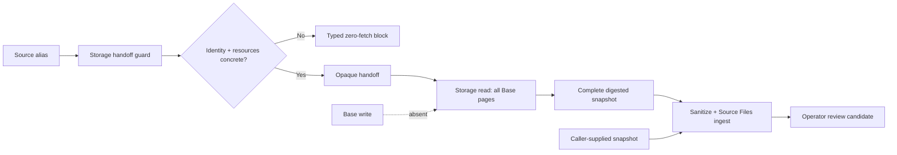
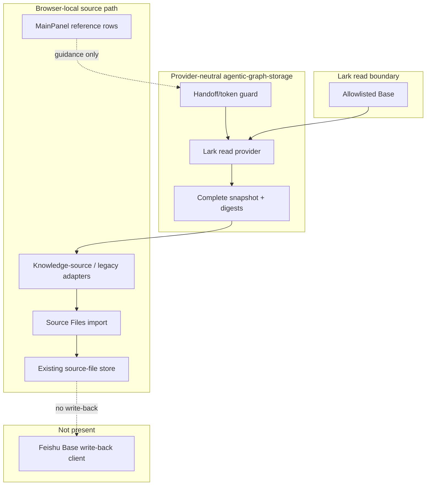

# Reference implementation: Feishu Base Read-only Knowledge Ingestion Contract

## Reference implementation scope and readiness

This combined PRD/TAD reconciles three source-present concerns:

1. a MainPanel configuration/documentation row family; and
2. a server-only, read-only Lark knowledge-source runtime owned by the
   provider-neutral `agentic-graph-storage` boundary; and
3. a separate adapter/import command for caller-supplied Base snapshots.

The new runtime can read an allowlisted Base through Lark OpenAPI and return a
complete, digested, sanitized snapshot. It does not make Lark the knowledge
source of truth: Git-backed Markdown/frontmatter remains the portable authored
authority, `agentic-graph-storage` owns provider access and normalization, and Lark
remains a collaboration projection or candidate source. Base write-back is
still absent.

| Scope | Local rung | Delivered rung | Basis |
|---|---|---|---|
| Combined contract | `spec-complete` | `undocumented` | The read-only contract is implemented and has deterministic VCC hosts; live identity/resources and delivery evidence are not attached. |

The readiness ladder is `undocumented` → `spec-complete` → `dev-proven` →
`runtime-ready` → `production-verified`.

### Actual repository baseline

| Source owner | Source-present fact | Explicit limit |
|---|---|---|
| `grph-shared/src/search/feishuBaseMcpSsot.ts` | Defines host-managed configuration labels, auth boundary, operator guidance, and phase labels. | The source scope text describes docs/settings only; labels do not establish delivery. |
| `canvas/src/features/settings/registry-feishu-base-mcp.ts` | Persists non-secret configuration labels in browser-local settings. | It stores no Base credential and executes no Base operation. |
| `canvas/src/features/panels/views/feishuBaseMcpApiDocs.ts` | Projects 11 virtual documentation rows into MainPanel. | It is not an MCP or Base API client. |
| `canvas/src/features/source-files/feishuBaseSourceAdapter.ts` | Converts a caller-supplied snapshot into sanitized Markdown, redacts identifiers, and reports field/record counts. | It does not obtain the snapshot from Feishu. |
| `canvas/src/features/source-files/feishuBaseSourceImportCommand.ts` | Exposes a browser-local command/event bridge that delegates to existing source-file ingest. | It is not remote Base mutation. |
| `cloudflare/workers/agentic-graph-storage/knowledge-source/` | Owns allowlist parsing, server identity, Lark reads, complete-snapshot provenance/digests, opaque handoff, and typed failures. | It is read-only and grants no source acceptance or deploy authority. |
| `canvas/src/features/source-files/knowledge-source/` | Streams the response within a byte cap, validates the closed envelope/count schema, recomputes both SHA-256 digests, adapts sanitized snapshots, and creates a new Source File through the existing ingest seam. | It receives no Lark credential, configured resource identifier, or OpenAPI endpoint override; approved primitive business values may still include user-authored links. |
| Focused Feishu/knowledge-source tests | Exercise row defaults, legacy snapshot import, authenticated handoff issuance, zero-fetch blocks, bounded pagination/streaming, stable totals and revisions, digest recomputation, opaque redemption, redaction, and create-only import delegation. | The Worker test files are a standalone VCC host and are not yet wired into `storage:relay:test`; the Canvas registry case is a separate critical-path VCC. Neither is live provider or Production proof. |

The MainPanel phase label and the separate adapter can coexist: the
configuration surface remains documentation-only, while server-only
acquisition and supplied-snapshot transformation live in separate owners. The
read contract can be proven locally; live readiness remains blocked while the
configured identity and resource values are placeholders.

## PRD

### Problem and outcome

Operators need a clear Base configuration boundary and a safe way to acquire or
transform records into a reviewed source document. The first-value outcome is
deterministic, zero-model-token ingestion through an opaque handoff, with
server-only provider identity and redacted source references. Live acquisition
is blocked until concrete identity/resources are configured; write-back remains
absent.

### Personas and user stories

| Persona | User story | Success signal |
|---|---|---|
| Operator | As an operator, I want host/auth ownership visible so that I do not paste Base secrets into browser settings. | MainPanel stores only non-secret labels. |
| Importer | As an importer, I want a supplied snapshot converted through the existing source-file seam so that validation is reused. | The adapter returns sanitized Markdown and the import command delegates. |
| Knowledge operator | As an operator, I want one allowlisted source alias rather than provider IDs in the browser so that server custody and source boundaries remain clear. | Browser input contains only `sourceId` plus an opaque handoff token. |
| Reviewer | As a reviewer, I want configured identifiers and nested provider metadata redacted without deleting approved primitive business content. | Configured Base/table/view IDs, record IDs, nested token/ID/link/URL metadata, and provider-shaped identifier strings are absent; an authorized primitive business value may remain and still passes Markdown sanitization. |
| Maintainer | As a maintainer, I want configuration and import owners separated so that a docs phase label cannot hide actual source seams. | Ownership table distinguishes them. |
| Auditor | As an auditor, I want contract, live, and delivery proof separated so that deterministic fixtures are not promoted to provider or production readiness. | The zero-fetch blocker and closed deploy boundary remain explicit. |

### User journey flow

| Stage | User action | Touchpoint | Friction | Required outcome |
|---|---|---|---|---|
| Trigger | Needs Base records in a workspace. | MainPanel, host, or external Base tooling | Configuration rows may look executable. | Identify `agentic-graph-storage` as the read owner. |
| Discover | Requests an allowlisted source alias. | Server handoff route | Provider identifiers or secrets could leak. | Return only an opaque, expiring handoff. |
| Engage | Reads the source or supplies a structured snapshot. | Storage read route or browser-local import | Identity/resources may still be placeholders. | Block before provider fetch or return a complete envelope. |
| Complete | Imports the generated source document. | Existing source-file ingest | A parallel import stack can drift. | Delegate to canonical ingest owner. |
| Return | Requests refresh or write-back. | Read-only storage runtime | Partial reads may look complete; write-back is absent. | Digest only complete snapshots; reject writes. |

### Requirements and prioritization

| ID | Requirement | Priority |
|---|---|---|
| `PRD-FB-01` | Keep MainPanel configuration labels non-secret and host/server-owned. | Must |
| `PRD-FB-02` | Require `baseToken` and `tableId` for supplied snapshot conversion. | Must |
| `PRD-FB-03` | Sanitize imported values; redact configured Base/table/view identifiers, record IDs, provider-shaped identifier strings, and nested provider ID/token/link/URL metadata while allowing approved primitive business content. | Must |
| `PRD-FB-04` | Delegate import to the existing source-file ingest owner. | Must |
| `PRD-FB-05` | Distinguish supplied-snapshot transformation from remote Base acquisition. | Must |
| `PRD-FB-06` | Keep Base write-back absent until auth, idempotency, conflict, audit, and rollback contracts exist. | Must |
| `PRD-FB-07` | Add browser-owned Base credentials or a direct write path. | Won't |
| `PRD-FB-08` | Route every provider read through provider-neutral `agentic-graph-storage`; keep Git-backed Markdown/frontmatter authoritative. | Must |
| `PRD-FB-09` | Resolve Lark identity and `agentic-graph-knowledge-source-allowlist/v1` only from server configuration. | Must |
| `PRD-FB-10` | Read only the allowlisted Base/table/view and operator-approved `fieldNames`; require every approved field to be present and visible, stable provider totals, `minimumRecordCount`, and matching pre/post table revision before success. | Must |
| `PRD-FB-11` | Return a typed zero-fetch block for unresolved identity/resources, a non-allowlisted source, or allowlist drift. | Must |
| `PRD-FB-12` | Emit only `complete: true` `agentic-graph-knowledge-source-snapshot/v1` envelopes with content and envelope digests; require Canvas to bounded-stream, validate, and recompute both digests before mutation. | Must |
| `PRD-FB-13` | Gate handoff issuance on authenticated workspace membership, then redeem a five-minute AEAD bearer capability carrying only `sourceId` plus opaque token; use no `VITE_*` provider or long-lived storage bearer and import create-only. | Must |

### Acceptance criteria

| Requirement | Given / When / Then | VCC |
|---|---|---|
| `PRD-FB-01` | Given default MainPanel state, when rows render, then only host-managed labels and documentation guidance appear. | `VCC-FB-01` |
| `PRD-FB-02` | Given a snapshot missing `baseToken` or `tableId`, when adapted, then a typed failure is returned. | `VCC-FB-02` |
| `PRD-FB-03` | Given approved fields/records, when adapted, then configured and nested provider identifiers/tokens/links are absent while authorized primitive business content is retained subject to Markdown sanitization. | `VCC-FB-03` |
| `PRD-FB-04` | Given a valid import request, when command execution begins, then it delegates to `importFeishuBaseSnapshotIntoSourceFile`. | `VCC-FB-04` |
| `PRD-FB-05` | Given source review, when acquisition ownership is traced, then the legacy supplied-snapshot adapter performs no network fetch and only `agentic-graph-storage` may acquire Lark data. | `VCC-FB-05` |
| `PRD-FB-06` | Given a write-back request, when current ownership is checked, then the capability is unavailable. | `VCC-FB-06` |
| `PRD-FB-07` | Given browser configuration or import, when credential and mutation ownership is inspected, then no browser-held Base credential or direct remote write path exists. | `VCC-FB-07` |
| `PRD-FB-08` | Given a Lark source, when a read is requested, then `agentic-graph-storage` performs provider access and the result remains a review candidate rather than authored authority. | `VCC-FB-08` |
| `PRD-FB-09` | Given a request with caller-supplied provider IDs or credentials, when admission runs, then it is ignored/rejected in favor of server configuration. | `VCC-FB-09` |
| `PRD-FB-10` | Given multi-page Base fixtures, when read completes, then pre/post table revisions match, every page reports a stable total, all approved fields are present and non-hidden, and record count meets `minimumRecordCount`. | `VCC-FB-10` |
| `PRD-FB-11` | Given literal placeholders such as `<tenant-app\|user-oauth>` or unresolved resource IDs, when handoff/read is requested, then a stable block code is returned and the provider fetch count is zero. | `VCC-FB-11` |
| `PRD-FB-12` | Given a successful read, when Canvas bounded-streams the envelope, then it validates counts/schema and independently recomputes both SHA-256 digests before Source Files mutation; any failed/incomplete/oversize response produces no import. | `VCC-FB-12` |
| `PRD-FB-13` | Given a browser handoff, when it is issued and consumed, then authenticated membership precedes issuance, only `sourceId` plus the five-minute AEAD bearer capability crosses the URL-fragment boundary, and a name collision creates a suffixed Source File rather than overwriting. | `VCC-FB-13` |

### Economics, TTV, and delivery reach

| Scope | Impact × reach | Build + TCO + token score | ROI score | Decision |
|---|---:|---:|---:|---|
| Supplied-snapshot transform/import | `7 × 5` | `3 + 0 + 0` | `11.67` | Retain. |
| Allowlisted read-only Base ingestion | `8 × 5` | `5 + 1 + 0` | `6.67` | Retain behind zero-fetch configuration and evidence gates. |
| Browser-owned remote Base client | `5 × 3` | `9 + 7 + 4` | `0.75` | Reject. |

| Metric | Current fact | Gate |
|---|---|---|
| Time to first value | Not measured | At most 5 minutes from supplied or opaque-handoff snapshot to reviewed source file; record a clean-browser VCC. |
| Configuration/transform tokens | 0 model tokens | Remain 0. |
| Import/read loop | Finite, bounded page/field/record traversal; no model loop | Preserve request, page, byte, and timeout caps. |
| Remote operation tokens | 0 model tokens; deterministic API reads only | No AI-assisted transform is admitted. |
| Managed 12-month incremental agentic-graph TCO | USD 0 for current browser-local source path; Lark/API cost unmeasured | Measure provider/Worker request and egress cost before delivery. |
| Self-managed 12-month TCO | Not selected; unmeasured | Compare auth proxy compute, maintenance, storage, and egress. |
| Hybrid 12-month TCO | Not selected; unmeasured | Compare separately. |

| Reach | Current source behavior |
|---|---|
| Browser | Config rows, opaque-handoff reader, and supplied-snapshot import are source-present. |
| Mobile browser | No distinct evidence; large-table ergonomics unmeasured. |
| Offline | Supplied snapshots can be transformed; live Base acquisition requires the server and Lark. |

The `lark-base` string in the source SSOT is operator guidance, not a
repository-owned browser route. This document owns no MCP endpoint or
Invocation Register. Canonical agentic-graph routes remain in
[the MCP installation contract](../agentic-graph-mcp-install-contract.md).

### Exact read-only provider contract

The public agentic-graph contract is `agentic-graph-knowledge-source/v1`:

| Operation | agentic-graph route | Exact Lark read | Completion rule |
|---|---|---|---|
| Resolve handoff | `POST /api/storage/knowledge-source/handoff` | None | Authenticate the agentic-graph session, require active workspace membership, and resolve source/identity/allowlist before issuing a five-minute AEAD bearer capability. |
| Pin Base revision | `POST /api/storage/knowledge-source/read` | `GET /open-apis/bitable/v1/apps/{app_token}/tables` before and after content reads | Traverse bounded pages, require a stable `total`, find the exact `table_id`, and require the same integer table `revision` before/after. |
| Read Base fields | `POST /api/storage/knowledge-source/read` | `GET /open-apis/bitable/v1/apps/{app_token}/tables/{table_id}/fields` with allowlisted `view_id` | Continue within caps; require stable `total`, exact final count, and every allowlisted `fieldNames` entry present and not hidden. |
| Search Base records | `POST /api/storage/knowledge-source/read` | `POST /open-apis/bitable/v1/apps/{app_token}/tables/{table_id}/records/search` with body `{ view_id, field_names, automatic_fields: false }` | Continue with query `page_token`/`page_size`; require stable `total`, exact final count, and at least `minimumRecordCount`. |

For `tenant-app`, the server obtains a token through
`POST /open-apis/auth/v3/tenant_access_token/internal`; that credential call is
not a knowledge read and its app ID/secret/token never enter the handoff,
snapshot, browser, log-safe error, or document. Tenant tokens are cached
single-flight and self-refresh before the configured expiry window. `user-oauth`
uses only the external broker/operator-managed server-held
`AGENTIC_OS_STORAGE_LARK_USER_ACCESS_TOKEN` plus its absolute expiry and fails
terminally on provider auth rejection. This lane does not select
`offline_access`, store or rotate a refresh token, call
`/open-apis/authen/v2/oauth/token`, or implement one-time refresh-token rotation
and reauthorization within the provider's 365-day limit. Exact OAuth
scopes/permissions remain an operator decision. The
selected mode and credentials come from `AGENTIC_OS_STORAGE_LARK_*`, and resources come only from
`AGENTIC_OS_STORAGE_LARK_SOURCE_ALLOWLIST_JSON`. The existing server-only
`AGENTIC_OS_STORAGE_SIGNING_SECRET` seals the five-minute AES-GCM AEAD handoff; it
is not sent to Canvas. No Lark or long-lived storage bearer is read from a
`VITE_*` variable. In Cloudflare, the app secret, user access token, and
signing secret must be secret bindings rather than plaintext Worker variables
or repository content.

`kgKnowledgeSourceHandoff` is carried in the URL fragment, not the query string.
The browser does not send the fragment in the initial HTTP request or `Referer`
header, and Canvas removes it immediately after consumption. This protection is
specific to the knowledge-source capability; legacy review/import handoffs keep
their existing query behavior.

The allowlist schema is `agentic-graph-knowledge-source-allowlist/v1`. Its Base entry
pins `sourceId`, `workspaceId`, provider `lark`, kind `base`, `appToken`,
`tableId`, `viewId`, 1–100 unique operator-approved `fieldNames`, and
`minimumRecordCount` 1–2000; display labels are optional. A request cannot
override those values. The approved-field/minimum-count checks distinguish a
legitimate result from Lark advanced-permission filtering that can otherwise
look like a successful empty response.

Cloudflare currently caps each Worker variable or secret at 5 KB, while the
parser admits at most 100 sources. The env-JSON allowlist is therefore an MVP
small-set mechanism, not the long-term centralized database. A larger catalog
must move to D1, KV, or generated configuration and receive its own versioned
promotion digest before it can replace this source.

Literal placeholders are unresolved configuration, not credentials or resource
selection. They return one of `identity_unresolved`, `identity_not_available`,
`resources_unresolved`, `source_not_allowlisted`, or `source_config_drift`
before any Lark content request. Only a complete result may use
`agentic-graph-knowledge-source-snapshot/v1`; it includes allowlist revision/digest,
provider revision where available, counts, `contentDigest`, `envelopeDigest`, a
sanitized snapshot, and warnings.

## TAD

### Workflow flow

**Trigger:** an operator selects an allowlisted Base alias, supplies a Base
snapshot, or opens configuration help.

1. MainPanel renders source-owned non-secret configuration labels.
2. For a server read, the handoff route authenticates the agentic-graph session,
   requires active workspace membership, and resolves server identity plus the
   exact allowlist revision without fetching Lark content.
3. It returns a five-minute AEAD bearer capability bound to
   workspace/source/identity/allowlist and the authenticated user/session.
4. Canvas consumes `kgKnowledgeSourceHandoff` and redeems the capability at the
   read route with `sourceId`; redemption is scoped bearer-capability
   authorization, not a second browser-supplied identity assertion.
5. `agentic-graph-storage` revalidates the capability and configuration, checks table
   revision before/after, fetches every bounded fields/search page with stable
   totals, applies approved-field/minimum-record guards, redacts nested provider
   metadata, and emits a complete digested envelope.
6. Canvas bounded-streams and validates the response, recomputes content and
   envelope digests, sanitizes it, and delegates to create-only Source Files
   ingest.
7. The operator reviews the imported Markdown candidate before protected
   source acceptance.

**Supplied-snapshot path:** the existing adapter validates `baseToken` and
`tableId`, sanitizes/redacts values, and delegates to the same source-file seam
without a network request.

**Alternate path:** empty fields or records produce warnings and a valid
document when required selection identifiers exist.

**Error path:** unresolved server identity/resources, non-allowlisted source,
allowlist drift, expired/invalid handoff, provider/page or provenance failure,
or missing legacy selection returns a typed failure. Configuration blockers
perform zero Lark content fetches; incomplete reads produce no success envelope.

**Postcondition:** app-owned candidate source state may change; Lark remote
state and accepted Git-backed source do not.

### Data flow

| Stage | Component | Input | Output | Persistence | Failure |
|---|---|---|---|---|---|
| Ingest | Storage handoff guard or legacy caller | Authenticated member/source alias or supplied selection/records | Five-minute AEAD capability or adapter input | Capability is short-lived; legacy input is caller-owned | Zero-fetch block or typed selection error |
| Acquire | Lark provider behind `agentic-graph-storage` | Allowlisted Base/table/view/fields/minimum | Stable-revision, stable-total bounded field/search pages | Request memory only | Entire read fails on incomplete, hidden/missing field, low-count, or revision drift |
| Transform | Storage normalizer + Base document adapter | Complete sanitized snapshot | Digested envelope, then sanitized Markdown + warnings | None | Bounded stream or client-recomputed digest/schema/completeness fails closed |
| Store | Source-file ingest owner | Generated document | New app candidate source file; collision gets a suffix | Existing app store | Typed ingest failure; no overwrite |
| Serve | Knowledge-source/legacy import commands | Import request | Summarized result | Last result may be reflected in app dataset | Explicit result/error |
| Consume | Workspace/Canvas/reviewer | Imported candidate | Reviewed/applicable content | Existing workspace/canvas owners; Git only after review | Existing validation and protected merge rules apply |

### Orchestration and harness flow

Every present step is deterministic and zero-model-token.

### Topology flow

### Journey-to-system mapping

| Journey stage | Workflow | Data stage | Harness role | Owner |
|---|---|---|---|---|
| Trigger | Open guidance/request import | Ingest | Dispatcher | MainPanel/import command |
| Discover | Resolve source alias | Ingest | Auth/allowlist guard | `agentic-graph-storage` knowledge-source runtime |
| Engage | Read all pages or supply snapshot | Acquire/transform | Provider executor or legacy adapter | Lark provider/Base adapter |
| Complete | Persist candidate source file | Store/serve | Existing ingest + observer | Source-file owners |
| Return | Review/refresh | Consume | Operator; write gap | Workspace/Canvas/protected source |

### Component and integration contracts

| Component ID | Component | Interface IDs | VCC mappings | Invariant |
|---|---|---|---|---|
| `TAD-FB-CONFIG` | Configuration SSOT/registry | `TAD-FB-CONFIG-ROWS` (Feishu Base virtual rows) | `VCC-FB-01`, `VCC-FB-07` | No Base token value or remote operation. |
| `TAD-FB-ADAPTER` | Source adapter | `TAD-FB-ADAPTER-ADAPT` (`adaptFeishuBaseRecordsToSourceDocument`) | `VCC-FB-02`, `VCC-FB-03` | No network fetch; no full identifier in Markdown metadata. |
| `TAD-FB-IMPORT` | Import command | `TAD-FB-IMPORT-COMMAND` (`createFeishuBaseSourceImportCommand`) | `VCC-FB-04` | No parallel persistence owner. |
| `TAD-FB-WORKSPACE` | Workspace/Canvas | `TAD-FB-WORKSPACE-VALIDATE` (existing source-file ingest) | `VCC-FB-04` | Import does not bypass validation. |
| `TAD-FB-STORAGE` | Provider-neutral knowledge-source runtime | `TAD-FB-STORAGE-HANDOFF`; `TAD-FB-STORAGE-READ` (the two `/api/storage/knowledge-source/*` routes) | `VCC-FB-08`, `VCC-FB-09`, `VCC-FB-11`, `VCC-FB-12` | Server-only identity and allowlist; no provider identifiers in browser output. |
| `TAD-FB-LARK-READ` | Lark read provider | `TAD-FB-LARK-REVISION`; `TAD-FB-LARK-FIELDS`; `TAD-FB-LARK-SEARCH` | `VCC-FB-10`, `VCC-FB-12` | Read only; stable totals and pre/post revision; approved fields/minimum count before success. |
| `TAD-FB-OPAQUE` | Canvas knowledge-source bridge | `TAD-FB-OPAQUE-CONSUME` (`kgKnowledgeSourceHandoff`) | `VCC-FB-13` | Authenticated membership-gated issuance, scoped five-minute bearer redemption, bounded verification, and create-only import. |
| `TAD-FB-REMOTE-WRITE` | Future write owner (not implemented) | `TAD-FB-REMOTE-WRITE` | `VCC-FB-06`, `VCC-FB-07` | Must be separately authenticated, idempotent, conflict-aware, audited, reversible, and authorized. |

### PRD ↔ TAD traceability

| Requirement | TAD component | Interface | VCC |
|---|---|---|---|
| `PRD-FB-01` | `TAD-FB-CONFIG` | `TAD-FB-CONFIG-ROWS` | `VCC-FB-01` |
| `PRD-FB-02` | `TAD-FB-ADAPTER` | `TAD-FB-ADAPTER-ADAPT` | `VCC-FB-02` |
| `PRD-FB-03` | `TAD-FB-ADAPTER` | `TAD-FB-ADAPTER-ADAPT` | `VCC-FB-03` |
| `PRD-FB-04` | `TAD-FB-IMPORT` + `TAD-FB-WORKSPACE` | `TAD-FB-IMPORT-COMMAND` + `TAD-FB-WORKSPACE-VALIDATE` | `VCC-FB-04` |
| `PRD-FB-05` | `TAD-FB-ADAPTER` + `TAD-FB-STORAGE` | `TAD-FB-ADAPTER-ADAPT` + `TAD-FB-STORAGE-READ` | `VCC-FB-05` |
| `PRD-FB-06` | `TAD-FB-REMOTE-WRITE` | `TAD-FB-REMOTE-WRITE` | `VCC-FB-06` |
| `PRD-FB-07` | `TAD-FB-CONFIG` + `TAD-FB-REMOTE-WRITE` | `TAD-FB-CONFIG-ROWS` + `TAD-FB-REMOTE-WRITE` | `VCC-FB-07` |
| `PRD-FB-08` | `TAD-FB-STORAGE` | `TAD-FB-STORAGE-READ` | `VCC-FB-08` |
| `PRD-FB-09` | `TAD-FB-STORAGE` | `TAD-FB-STORAGE-HANDOFF` | `VCC-FB-09` |
| `PRD-FB-10` | `TAD-FB-LARK-READ` | `TAD-FB-LARK-REVISION` + `TAD-FB-LARK-FIELDS` + `TAD-FB-LARK-SEARCH` | `VCC-FB-10` |
| `PRD-FB-11` | `TAD-FB-STORAGE` | `TAD-FB-STORAGE-HANDOFF` + `TAD-FB-STORAGE-READ` | `VCC-FB-11` |
| `PRD-FB-12` | `TAD-FB-STORAGE` + `TAD-FB-LARK-READ` | `TAD-FB-STORAGE-READ` | `VCC-FB-12` |
| `PRD-FB-13` | `TAD-FB-OPAQUE` | `TAD-FB-OPAQUE-CONSUME` | `VCC-FB-13` |

### Security and error contract

| Condition | Required outcome |
|---|---|
| Browser receives a Base secret as configuration | Reject/omit; config stores labels only. |
| Snapshot lacks required selection identifiers | Typed adapter failure. |
| Snapshot content contains unsafe Markdown/HTML | Sanitize before source-file ingest. |
| Source URL contains path/query identifiers | Persist only valid origin metadata. |
| Server Base field value contains nested provider metadata | Drop nested ID/token/link/URL/email/avatar/download keys and provider-shaped identifier strings; retain only approved primitive business values subject to sanitization. |
| Empty field schema or records | Emit warning, not fabricated content. |
| Identity/resources are blank or placeholders | Typed zero-fetch block; no Lark content request. |
| Requested alias is absent or its bound config drifted | `source_not_allowlisted` or `source_config_drift`; no successful handoff/read. |
| Any Base page fails, truncates, or exceeds a cap | No complete snapshot and no Canvas handoff. |
| Field total changes, approved field is missing/hidden, record total changes/falls below minimum, or table revision changes | `source_config_drift`/invalid response; no complete snapshot. |
| Snapshot bounded-stream/count/digest/schema/`complete` admission fails | Reject before Source Files mutation. |
| Imported filename already exists | Create a suffixed Source File; never overwrite the existing file. |
| Remote write requested | Typed unavailable boundary. |

### Architectural decision

Keep server-owned acquisition in provider-neutral `agentic-graph-storage` and keep
deterministic browser-local transformation separate. Reuse existing source-file
persistence and validation. Git-backed Markdown/frontmatter remains the
authored authority; a Lark snapshot is a candidate projection until reviewed.
This provides useful read-only ingestion without a secret-bearing browser
client, duplicate storage authority, or write-back path.

### Lane and deploy boundaries

| Lane | Allowed state | Promotion rule |
|---|---|---|
| Authoring | Source contracts, docs, deterministic checks | Current lane |
| Mirror | Separately authorized projection | `closed` without instruction, evidence, target, rollback |
| Delivery | Public app or remote Base service | `closed` without trusted Production issuer/caller evidence, concrete provider identity/resources/fields/minimum, live provider VCCs, and exact candidate-digest authorization |

No authoring-lane command here authorizes a mirror, live provider claim,
write-back, or public publication. Production deployment remains forbidden
until the operator authorizes the exact revalidated candidate digest.

### Deploy Boundary Register

| Boundary | From lane | To lane | Evidence Reference | Operator instruction | Rollback statement/check | State |
|---|---|---|---|---|---|---|
| `DB-FB-AUTHORING-MIRROR` | Authoring | Mirror | `none recorded` | `none` | Restore the prior approved mirror revision; verify its digest matches the prior promotion record. | `closed` |
| `DB-FB-MIRROR-DELIVERY` | Mirror | Delivery | `none recorded` | `none` | Restore the prior delivered revision; rerun the provider/import health check recorded by that prior promotion. | `closed` |

## VCC and evidence register

| VCC | Exact check | Expected end state | Constraint | Evidence Reference |
|---|---|---|---|---|
| `VCC-FB-01` | From `canvas/`: `node --preserve-symlinks --preserve-symlinks-main ../node_modules/tsx/dist/cli.cjs src/tests/runExport.ts src/__tests__/mainPanelMcpFeishuBase.test.tsx testFeishuBaseMcpRegistryDefaultsStayNonSecretAndPhaseOneOnly` | `runExport` prints `OK`; defaults remain non-secret and configuration-only. | Deterministic; no network. | None recorded |
| `VCC-FB-02` | From `canvas/`: `node --preserve-symlinks --preserve-symlinks-main ../node_modules/tsx/dist/cli.cjs src/tests/runExport.ts src/__tests__/feishuBaseSourceAdapter.test.ts testFeishuBaseSourceAdapterRejectsMissingRequiredIdentifiers` | `runExport` prints `OK`; required selection fields fail closed. | Supplied fixtures only. | None recorded |
| `VCC-FB-03` | From `canvas/`: `node --preserve-symlinks --preserve-symlinks-main ../node_modules/tsx/dist/cli.cjs src/tests/runExport.ts src/__tests__/feishuBaseSourceAdapter.test.ts testFeishuBaseSourceAdapterBuildsCanonicalMarkdownDocument` | `runExport` prints `OK`; identifiers are redacted and content is sanitized. | No upstream call. | None recorded |
| `VCC-FB-04` | From `canvas/`: `node --preserve-symlinks --preserve-symlinks-main ../node_modules/tsx/dist/cli.cjs src/tests/runExport.ts src/__tests__/feishuBaseSourceImportCommand.test.ts testFeishuBaseSourceImportCommandImportsSnapshotThroughWindowCommand` | `runExport` prints `OK`; import delegates and preserves explicit results. | Browser-local. | None recorded |
| `VCC-FB-05` | Source review of the legacy adapter and storage route ownership | The supplied-snapshot adapter remains zero-fetch; only `agentic-graph-storage` owns provider acquisition. | Source separation only; no live readiness credit. | None recorded |
| `VCC-FB-06` | No invocable remote-write VCC exists. | Auth, conflicts, idempotency, audit, and rollback are proven before write activation. | Unsatisfied; no readiness credit. | None recorded |
| `VCC-FB-07` | Source review of configuration and import owners | Browser storage contains no Base credential owner and import exposes no direct remote write path. | Source review only; no remote readiness credit. | None recorded |
| `VCC-FB-08` | From repository root, standalone: `TSX_TSCONFIG_PATH=canvas/tsconfig.json node --import tsx --test --test-concurrency=1 cloudflare/workers/agentic-graph-storage/knowledge-source/*.test.ts` | Focused storage tests pass for provider-neutral handoff/read ownership. | Mocked provider transport; not yet wired into `storage:relay:test`; no live readiness credit. | None recorded |
| `VCC-FB-09` | Run the focused knowledge-source suite in `VCC-FB-08`. | Server env and `agentic-graph-knowledge-source-allowlist/v1` are the only identity/resource owners; caller overrides fail. | No secrets in fixtures/output. | None recorded |
| `VCC-FB-10` | Run the focused knowledge-source suite in `VCC-FB-08`. | Base table revision matches before/after; fields/search totals stay stable; approved fields are non-hidden; `field_names`, `view_id`, and `automatic_fields: false` are exact; minimum count holds. | Mocked Lark responses; no live provider claim. | None recorded |
| `VCC-FB-11` | Run the focused knowledge-source suite in `VCC-FB-08`. | Every unresolved/not-allowlisted/drift condition returns its typed code with provider fetch count zero. | Literal placeholders remain configured in this lane. | None recorded |
| `VCC-FB-12` | Run the focused knowledge-source suite in `VCC-FB-08`, then the Canvas suite in `VCC-FB-13`. | Server signs only complete snapshots; Canvas bounded-streams, validates counts, and recomputes content/envelope digests before import. | Deterministic fixtures only. | None recorded |
| `VCC-FB-13` | From repository root: `npm -C canvas run test:ci:unit -- knowledgeSource` | The registered critical-path case proves capability-fragment consumption/removal, no query placement, bounded read validation, digest recomputation, and create-only Source Files delegation. | Distinct from Worker tests; no live Lark or Production route. | None recorded |

See [the companion](agentic-graph-feishu-base-mcp-prd-tad.companion.md) for the
source-gap register. Passing deterministic VCCs can prove contract readiness;
the Worker files above are not yet part of `storage:relay:test`, and the Canvas
registry case is a distinct critical-path proof. Live readiness stays blocked
until a trusted Production issuer/caller, concrete identity and exact allowlisted
resources/approved fields/minimum count, exact scopes/permissions, and live
negative/positive VCCs exist. Production stays deploy-forbidden until exact
candidate-digest authorization.
