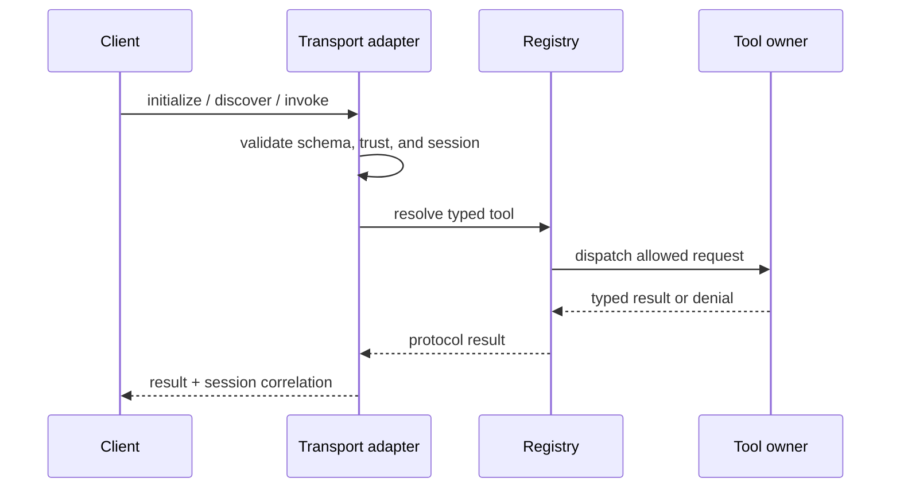
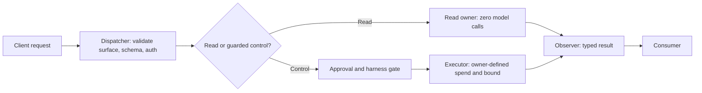
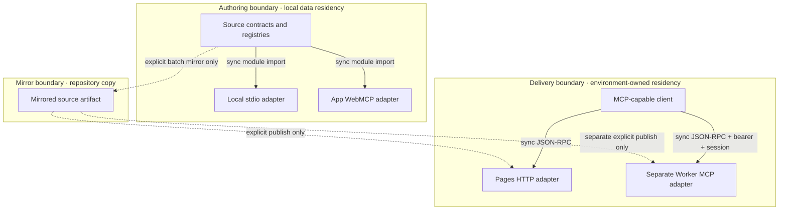

# MCP Service Contract

## Reference implementation: current repository MCP service

This combined PRD/TAD specifies the repository-owned MCP surfaces without
promoting source presence into a delivery claim.

### Readiness declaration

| Scope | Local rung | Delivered rung | Basis |
|---|---|---|---|
| Combined contract | `spec-complete` | `undocumented` | VCCs are stated; no satisfying Evidence Reference with a recorded result is attached. |

The ordered ladder is `undocumented` → `spec-complete` → `dev-proven` →
`runtime-ready` → `production-verified`. No other status vocabulary is used.

### PRD

#### Problem and outcome

Agents and people need a low-friction way to discover source content, inspect
the agent-ready surface, and invoke explicitly guarded controls. The service
must expose the minimum useful capability at each trust boundary while keeping
surface counts, authorization, delivery state, and token cost unambiguous.

The first-value outcome is a typed read result from the intended surface without
requiring a model call. Control execution is a distinct, guarded outcome.

#### Personas

| Persona | Goal | Primary constraint |
|---|---|---|
| Reader host | Search or fetch source-backed context. | No write or model-spend side effect. |
| Browser operator | Inspect context and choose a guarded control. | Explicit approval for control actions. |
| Local builder | Use the broader stdio surface. | Missing configuration fails closed. |
| Remote operator | Use the separate Worker control plane. | Bearer authorization and preserved session identity. |

#### User stories

- **As a** reader host **I want** zero-token source discovery **so that** I
  obtain context without granting control authority.
- **As a** browser operator **I want** read and guarded tools classified
  separately **so that** I can approve side effects intentionally.
- **As a** local builder **I want** unavailable integrations to fail closed
  **so that** discovery never masquerades as executable configuration.
- **As a** remote operator **I want** authenticated session continuity **so
  that** control requests are authorized and correlated.

#### User journey flow

| Stage | Action | Touchpoint | Friction | Opportunity |
|---|---|---|---|---|
| Trigger | Needs repository context or a control action. | MCP-capable client | Multiple surfaces appear similar. | Start from the authoritative install register. |
| Discover | Selects a surface by capability and trust. | Install contract | Source count may be mistaken for availability. | Show source and delivered rungs separately. |
| Engage | Initializes, discovers tools, and invokes one. | stdio, Pages, browser, or Worker | Authorization and session rules differ. | Fail closed with typed errors. |
| Complete | Receives a typed result or guarded denial. | Client response | Partial failures can be hidden. | Preserve error shape and surface identity. |
| Return | Reuses the same documented boundary. | Saved client configuration | Stale endpoint recipes drift. | Keep one Invocation Register owner. |

#### Requirements

| ID | Requirement | Priority |
|---|---|---|
| `PRD-MCP-01` | Keep local stdio broad, configuration-gated, and fail-closed. | Must |
| `PRD-MCP-02` | Keep Pages HTTP at exactly 7 read-only source tools. | Must |
| `PRD-MCP-03` | Keep app WebMCP at exactly 42 source tools: 30 read-only and 12 guarded controls. | Must |
| `PRD-MCP-04` | Keep the remote Worker registry at exactly 10 source tools and treat the Worker as a separate delivery unit. | Must |
| `PRD-MCP-05` | Require bearer `Authorization` for remote Worker MCP requests and preserve `mcp-session-id` after initialization. | Must |
| `PRD-MCP-06` | Treat source presence, runtime readiness, and production verification as separate facts. | Must |
| `PRD-MCP-07` | Keep the two-endpoint Invocation Register solely in the install contract. | Must |
| `PRD-MCP-08` | Add further control tools only after their trust, spend, and approval VCCs are specified. | Won't in this increment |

#### MoSCoW and ROI

Scores use `(impact × reach) / (build + TCO + token cost)` with normalized
0–10 inputs; the score ranks scope and is not a financial return claim.

| Tier | Scope | Impact × reach | Cost scores | ROI score | Rationale |
|---|---|---:|---:|---:|---|
| Must | `PRD-MCP-01` through `PRD-MCP-07` | `9 × 8` | `4 + 0 + 0` | `18.0` | Establishes useful zero-token reads and explicit trust without a new store. |
| Should | None in this increment | — | — | — | Do not dilute the evidence-critical boundary work. |
| Could | None in this increment | — | — | — | A new proxy or UI is not required for first value. |
| Won't | `PRD-MCP-08` without prior trust/spend VCCs | `2 × 2` | `8 + 5 + 8` | `0.19` | Unbounded control expansion has poor value and unsafe spend. |

#### Acceptance criteria and VCC translation

| Requirement | Given / When / Then | VCC |
|---|---|---|
| `PRD-MCP-02` | Given Pages discovery, when tools are listed, then only the seven read-only names are returned. | `VCC-MCP-01` |
| `PRD-MCP-03` | Given app initialization, when annotations are classified, then 42 tools split into 30 read-only and 12 guarded controls. | `VCC-MCP-02` |
| `PRD-MCP-04` | Given Worker registry construction, when tools are listed, then 10 unique names are returned. | `VCC-MCP-03` |
| `PRD-MCP-05` | Given a remote Worker session, when initialization and a subsequent call occur, then bearer authorization is present and the returned session id is reused. | `VCC-MCP-04` |
| `PRD-MCP-06` | Given this document set, when readiness is derived, then no delivery rung exceeds its attached evidence. | `VCC-MCP-05` |

#### Success metrics and economics

| Metric | Baseline | Target | Timeline / check |
|---|---|---|---|
| TTV steps | Unmeasured | At most 3: choose, initialize, read. | Clean-client VCC before any readiness promotion. |
| TTV elapsed | Unmeasured | At most 5 minutes. | Clean-client VCC before any readiness promotion. |
| Discovery/read model tokens | 0 by source path | 0 per request. | Contract test on every registry change. |
| Control token budget | Owner-dependent and not authorized here | A numeric prompt + completion cap, cache target, and maximum iteration count before each spend-bearing harness is enabled. | Owner VCC before execution. |
| Local stdio 12-month incremental TCO | Existing machine; actual unmeasured | USD 0 new license/infrastructure. | Quarterly owner review. |
| Pages 12-month incremental TCO | Delivery actual unmeasured | USD 0 until a nonzero budget is explicitly approved. | Publication gate. |
| Worker 12-month incremental TCO | Separate delivery actual unmeasured | USD 0 before explicit nonzero ADR/budget; model spend remains per invocation. | Separate Worker publication gate. |
| ROI score | `18.0` normalized estimate | At least `10.0` for Must scope. | Recompute on scope or cost change. |

The FOSS/open-protocol direct-adapter baseline has USD 0 license cost. A
proprietary gateway or new persistent service is rejected unless a later ADR
records separate managed, self-managed, and hybrid TCO plus a higher ROI score.

#### Minimum viable scope

The Must tier is discovery, zero-token reading, explicit surface separation, and
fail-closed guarded control. Federation growth, additional automation, and
operator dashboards are follow-on work.

#### Out of scope, dependencies, and open questions

| Kind | Item | Resolution |
|---|---|---|
| Out of scope | A unified proxy, new database, implicit cross-surface fallback, or public unguarded control. | Requires a later PRD/TAD and ADR. |
| Dependency | Shared tool contract, four existing adapters/registries, and existing tool owners. | Missing owners fail closed. |
| Dependency | Environment-issued Worker bearer secret and transport-managed session state. | Delivery operator owns secret/session configuration. |
| Open measurement | Clean-client TTV and environment-specific 12-month actual TCO. | Close through recorded VCC results before promotion; does not change Must scope. |

### TAD

#### Workflow flow

**Trigger:** a client needs a read or an explicitly guarded control.

**Actors:** client, transport adapter, tool registry, tool owner, evaluator.

**Happy path:**

1. Client selects the surface from the install contract.
2. Transport validates the request and, for the Worker, bearer authorization.
3. Registry returns typed discovery or dispatches the chosen tool.
4. Tool owner returns a typed result.
5. Client preserves the Worker session id for subsequent calls.

**Alternate path:** local stdio or browser features that lack configuration
return a typed unavailable result without broadening another surface.

**Error path:** missing Worker authorization, missing session correlation, an
unknown tool, or a denied guarded control fails closed without execution.

**Postcondition:** the client receives a typed result or typed denial; no
delivery rung changes without a new Evidence Reference.

#### Data flow

| Stage | Component | Input | Output | Persistence | Error handling |
|---|---|---|---|---|---|
| Ingest | Transport adapter | JSON-RPC request | Validated request | None | Typed protocol/auth error |
| Transform | Registry/dispatcher | Tool name + arguments | Owner call | None | Unknown/denied tool error |
| Store | Source documents or harness-owned stores | Owner-specific data | Owner-specific data | Source repository or owner-defined store; no MCP-owned database | Owner error propagates |
| Serve | MCP transport | Typed owner result | JSON-RPC result | Worker session state only where the transport requires it | Typed protocol result |
| Consume | MCP-capable client | JSON-RPC result | User or agent context | Client-owned | Client surfaces partial failure |

This flow traces to the Engage and Complete stages of the user journey.

#### Journey → system mapping

| Journey stage | Workflow | Data flow | Harness flow | Topology nodes | Components |
|---|---|---|---|---|---|
| Trigger | Select need | Client input | None | Client | Install contract |
| Discover | Initialize/list | Ingest → transform | Dispatcher validates with zero model calls | Client + adapter + registry | Transport and registry |
| Engage | Invoke | Transform → serve | Read owner or approval-gated executor | Adapter + tool owner | Registry and owner |
| Complete | Receive result | Serve → consume | Observer surfaces result/cost | Adapter + client | Observer and consumer |
| Return | Reuse or reinitialize | No MCP persistence beyond session lifecycle | Circuit breaker on denial, failure, or budget | Client + Worker session where selected | Client and transport |

#### Orchestration/harness flow

| Role | Contract | Cost log | Fallback |
|---|---|---|---|
| Dispatcher | Reject invalid schema, trust, or session before execution. | No model spend. | Typed denial. |
| Executor | Exists only for a selected guarded control. | Required when model or paid service spend occurs. | Owner-defined degraded result. |
| Observer | Surfaces result, denial, and cost metadata. | Records owner-emitted cost. | Flag an observation gap. |
| Consumer | Receives typed output. | No implicit spend. | Preserve upstream error. |

There is no loop in MCP dispatch. A downstream agentic executor must set a
maximum iteration count before invocation; the circuit breaker is budget
exhaustion, explicit denial, or typed owner failure.

#### Topology v0.5.0 — source and delivery boundaries

| Node | Role | Type | Lane | Connects to | Connection | Data residency |
|---|---|---|---|---|---|---|
| Source contracts | Producer/catalog | Repository module | Authoring | Local/browser adapters; mirror | Synchronous import; explicit batch mirror | Authoring filesystem |
| Local stdio adapter | Gateway | Local process | Authoring | Local client and tool owners | stdio JSON-RPC | Local process; no MCP content store |
| App WebMCP adapter | Gateway | Browser module | Authoring/runtime target | Browser client and app owners | In-process synchronous calls | Browser app state |
| Mirror artifact | Copy | Repository artifact | Mirror | Delivery adapters | Explicit batch publication | Mirror repository |
| Pages adapter | Read gateway | Edge function | Delivery | Reader client and read owners | Synchronous HTTP JSON-RPC | Delivery environment; no MCP-owned content store |
| Worker adapter/session | Control gateway | Worker/transport state | Delivery | Remote client and tool owners | Synchronous HTTP JSON-RPC | Delivery environment; session retention follows transport lifecycle |

Dashed edges are authorized only by an explicit operator action. This version
replaces the prior blended narrative with separate source, mirror, Pages, and
Worker boundaries.

#### Component specification

| Component | SVO responsibility | Interface / configuration | FOSS/vendor boundary | Local rung | Delivered rung |
|---|---|---|---|---|---|
| Local adapter | Adapter dispatches configured local tools. | stdio JSON-RPC; `mcp/server.js`; local env/config. | Open protocol; local dependencies owner-selected. | `spec-complete` | `undocumented` |
| Pages adapter | Adapter serves seven read-only tools. | HTTP JSON-RPC; `cloudflare/pages/agentic-graph-agent-ready.mjs`. | Open protocol; current edge adapter is a replaceable reference implementation. | `spec-complete` | `undocumented` |
| Browser adapter | Runtime registers 42 app tools. | WebMCP; `webMcpRuntime.ts`; browser feature owners. | Emerging browser protocol; app runtime is replaceable. | `spec-complete` | `undocumented` |
| Worker adapter | Adapter authenticates and correlates remote MCP requests. | HTTP JSON-RPC; `index.ts`; bearer secret + transport session config. | Open protocol; current worker runtime is replaceable. | `spec-complete` | `undocumented` |
| Worker registry | Registry catalogs 10 control-plane tools. | Typed discovery; `tool-registry.mjs`; tool-owner gates. | Tool owners may have separate cost/licensing decisions. | `spec-complete` | `undocumented` |

Detailed names and invariants are maintained in
[the companion](agentic-graph-mcp-service-prd-tad.companion.md). Endpoint
invocation, trust, and token-cost ownership remains in
[the install contract](../agentic-graph-mcp-install-contract.md).

#### Federation and integration contracts

| Interface | Protocol/format | Catalog authority | Errors |
|---|---|---|---|
| Local client ↔ stdio adapter | MCP JSON-RPC over stdio | Local catalog source | Typed unavailable/validation/tool error |
| Reader client ↔ Pages adapter | MCP JSON-RPC over HTTP | Seven-name companion catalog | Typed protocol/read error |
| Browser client ↔ app runtime | WebMCP typed descriptors | 42-name shared source contract | Typed unavailable/denied error |
| Remote client ↔ Worker adapter | MCP JSON-RPC over HTTP + bearer + session id | Ten-name companion catalog | Unauthorized/session/approval/tool error |

This is the federation contract; it points to the companion capability catalogs
and to the install contract's sole Invocation Register rather than redeclaring
endpoint ownership.

#### Architectural decision

| ID | Selected approach | Alternative considered | Consequence |
|---|---|---|---|
| `MCP-ADR-01` | Discovery-first federation over four existing transports, with Pages and Worker delivered separately. | One unified proxy and blended registry. | Preserves read/spend trust boundaries and USD 0 new-store baseline; clients select from one install register. Revisit only with separate TCO, FOSS, migration, and rollback evidence. |

#### Quality attributes and delivery reach

| Attribute | Target scenario | Pattern | Planned validation |
|---|---|---|---|
| Security | Missing Worker auth/session or control approval produces no dispatch. | Validate before registry/tool owner. | Negative auth/session/approval VCC. |
| Performance | Tool discovery responds within 1 second p95 at the selected runtime target. | Static registry; no model call. | Bounded runtime measurement. |
| Determinism | Equal registry source yields equal ordered identity set after canonical sorting. | Source-owned definitions and uniqueness checks. | Repeat count/name check twice. |
| Browser reach | Pages reads work in an MCP client; 42-tool WebMCP is app-local. | Separate adapters. | Pages and browser VCCs. |
| Mobile reach | HTTP reads depend on a mobile MCP-capable client; app controls depend on browser capability. | Graceful capability boundary. | Supported-client inventory plus clean-client VCC. |
| Offline behavior | Local stdio and already-loaded app state may remain usable; HTTP surfaces return explicit unavailable. | No hidden network fallback. | Network-off negative-path check. |
| Token cost | Discovery/read is exactly 0 model tokens. | No model executor on reads. | Cost-spy assertion. |
| TCO | No new persistent store or license in Must scope. | Reuse adapters; separate delivery budgets. | Quarterly cost/ADR review. |

#### Requirement-to-architecture traceability

| PRD requirements | TAD interfaces | VCCs |
|---|---|---|
| `PRD-MCP-01` | Local adapter/config gate | `VCC-MCP-C-05` in companion |
| `PRD-MCP-02`, `03` | Pages and browser adapters | `VCC-MCP-01`, `VCC-MCP-02` |
| `PRD-MCP-04`, `05` | Worker registry and authenticated session adapter | `VCC-MCP-03`, `VCC-MCP-04` |
| `PRD-MCP-06`, `07` | Federation contract, readiness matrix, install owner | `VCC-MCP-05` |

#### VCC register

| ID | End state | Stated check | Constraint / bound | Evidence Reference |
|---|---|---|---|---|
| `VCC-MCP-01` | Pages discovery returns exactly 7 read-only tools. | Run the focused Pages parity test and surface its count and names. | No guarded control is present; one run. | None recorded |
| `VCC-MCP-02` | App WebMCP exposes exactly 42 tools split 30/12. | Run the focused WebMCP runtime test and surface annotation counts. | No duplicate name; one run. | None recorded |
| `VCC-MCP-03` | Worker registry exposes exactly 10 tools. | Run the Worker registry test and surface count and names. | No duplicate name; one run. | None recorded |
| `VCC-MCP-04` | Worker transport rejects missing bearer auth and preserves the initialized session id. | Run the focused remote grammar/session test and surface auth and header assertions. | No unauthenticated control execution; one run. | None recorded |
| `VCC-MCP-05` | All eight linked contracts use ladder-only local and delivered rungs. | Run frontmatter/schema validation and surface every derived rung. | Only the permitted document set changes; stop on the first schema error. | None recorded |

The checks are planned VCC hosts, not Evidence References. A check becomes
evidence only when its exact invocation, recorded result, and lane are attached.

#### Readiness gap matrix

| Workstream | Local rung | Delivered rung | Gap | Priority | Exit criterion |
|---|---|---|---|---|---|
| Pages read surface | `spec-complete` | `undocumented` | No attached local or delivery evidence. | major | `VCC-MCP-01` |
| App WebMCP | `spec-complete` | `undocumented` | No attached local or delivery evidence. | major | `VCC-MCP-02` |
| Worker registry | `spec-complete` | `undocumented` | Separate deployment not evidenced. | blocker | `VCC-MCP-03`, then delivery evidence |
| Worker auth/session | `spec-complete` | `undocumented` | Runtime behavior not evidenced here. | blocker | `VCC-MCP-04`, then delivery evidence |
| Documentation alignment | `spec-complete` | `undocumented` | Validation result not attached as evidence. | major | `VCC-MCP-05` |

#### Agent-platform readiness and execution order

| Dimension | Tier | Local rung | Delivered rung | Gate |
|---|---|---|---|---|
| AI-agent discovery | Must | `spec-complete` | `undocumented` | `VCC-MCP-01`, `VCC-MCP-02` |
| MCP gateway federation | Must | `spec-complete` | `undocumented` | `VCC-MCP-05` and sole install register |
| OS status source catalog | Must | `spec-complete` | `undocumented` | `VCC-MCP-03` |
| Spend/auth/session safety | Must | `spec-complete` | `undocumented` | `VCC-MCP-04` |
| Unbounded control growth or blended proxy | Won't | `spec-complete` | `undocumented` | Requires a later PRD/TAD and ADR |

Execution order is discovery contract → spend/auth/session gate → separate
Worker runtime proof → any later control expansion. A later stage cannot promote
while an earlier gate lacks evidence.

#### Lane and deploy boundary register

| Boundary | Entry condition | Mutation | Exit condition | Rollback |
|---|---|---|---|---|
| Authoring → mirror | Explicit operator approval plus selected authoring revision. | Faithful copy only. | Mirror revision and check result recorded. | Restore prior mirror revision. |
| Mirror → Pages delivery | Explicit Pages publication instruction. | Publish selected mirror revision. | Endpoint Evidence Reference recorded. | Restore prior Pages revision. |
| Mirror → Worker delivery | Separate explicit Worker publication instruction. | Publish selected Worker revision and bindings. | Authenticated session Evidence Reference recorded. | Restore prior Worker revision and bindings. |

The deploy boundary is closed. Operator instruction: none. Current delivery
Evidence Reference: none.

The evaluator is a deterministic check mechanism distinct from the document
author. It judges only surfaced counts, results, and lane data; it does not infer
completion from narrative.
