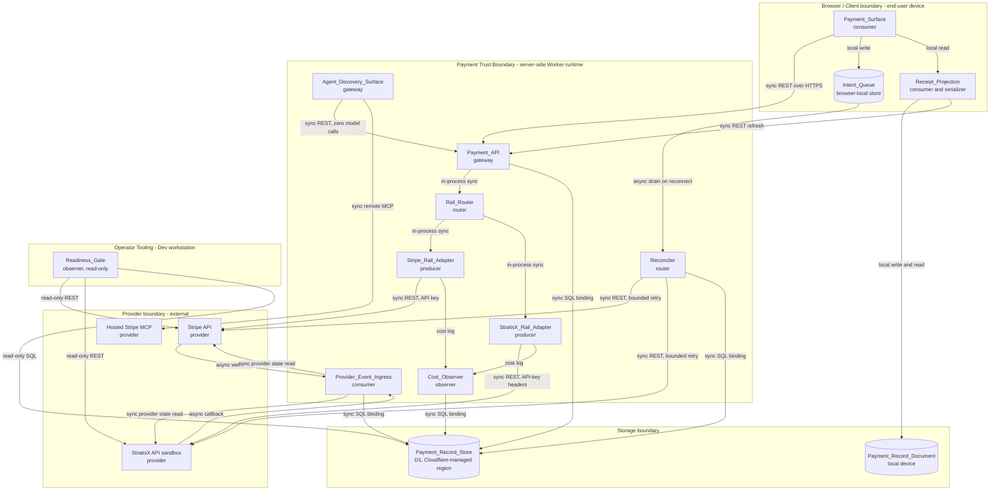
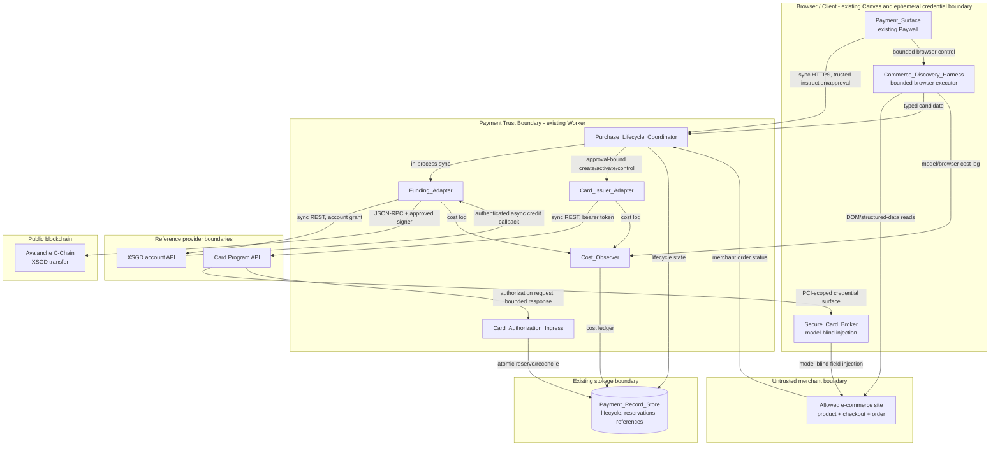

[Combined planning owner](agentic-graph-payments-prd-tad-adr-mvp-gtm.md) · `PLAN-AGENTIC-GRAPH-PAYMENTS-PRD-TAD-ADR-MVP-GTM@1.3.1`. This companion preserves the source section; diagrams and frontmatter projections remain owned by the combined artifact.

### Success Metrics

| Metric | Baseline | Target | Timeline |
|---|---|---|---|
| Rails reaching a confirmed sandbox payment | unverified in this document | 2 rails with separate satisfying Evidence References | Increment 1 |
| Duplicate provider objects created per replayed intent | not measured | 0 | Increment 1 |
| Queued offline intents resolved to a terminal state after reconnect | 0 percent (no queue exists) | 100 percent within 60 s of reconnect | Increment 1 |
| Provider events applied more than once | not measured | 0 | Increment 1 |
| Unauthenticated provider events accepted | not measured | 0 | Increment 1 |
| Payment secrets reachable from the client bundle | 0 asserted, not gated | 0 gated by a check | Increment 1 |
| Payment_Record_Document round-trip fidelity | not measured | byte-identical re-serialization for every valid document | Increment 1 |
| Time-to-value steps (Solo_Operator) | not measured | 10 steps or fewer | Increment 1 |
| Time-to-value elapsed (Solo_Operator) | not measured | 45 min or less | Increment 1 |
| Time-to-value steps (Buyer_SG) | not measured | 4 steps or fewer | Increment 1 |
| Time-to-value elapsed (Buyer_SG) | not measured | 90 s or less | Increment 1 |
| Full agentic lifecycle reaches matching merchant and issuer success | 0 recorded runs | 1 bounded, environment-consistent, provider-approved golden path plus all failure fixtures | Increment 2 |
| XSGD funding replay creates duplicate transfers | not measured | 0 across 100 generated retries and one provider-backed proof | Increment 2 |
| Discovery leaves the immutable purchase envelope | not measured | 0 across prompt-injection and merchant-mutation fixtures | Increment 2 |
| Disposable cards issued per lifecycle | not measured | exactly 1; 0 on rejected or expired approval | Increment 2 |
| Terminal lifecycle cards still permitting new authorization | not measured | 0 | Increment 2 |
| Safe closure overdue past the source-bound disposal deadline | not measured | 0; `closure_pending` is allowed only while recorded capture/reversal/refund risk remains | Increment 2 |
| PAN, CVV, or full expiry in model input, logs, screenshots, stores, or receipts | not measured | 0, enforced by a planted-secret check | Increment 2 |
| Remote authorization decisions within provider deadline | not measured | 100 percent under the documented deadline in focused load proof | Increment 2 |
| Discovery model budget per lifecycle | not measured | at most 2 calls, 12,000 prompt tokens plus 2,000 completion tokens total | Increment 2 |
| Token cost per month on the payment path | not measured | 0.00 USD with zero model calls in selection, creation, ingestion, reconciliation, serialization | Continuous |
| Token cost per month for commerce discovery at 10 demo runs | not measured | 2.00 USD ceiling; exact model price and cache rate recorded before enablement | Increment 2 |
| Monthly fixed infrastructure spend | 0.00 USD (existing Worker plus D1 free tier) | 0.00 USD | Continuous |
| Provider-inclusive monthly TCO at launch load | unknown; commercial and transaction schedules are not established here | Must be recorded before any live enablement | Commercial gate before release |
| ROI score (capability aggregate) | - | 8 or higher | Increment 1 |

Provider transaction, FX, and network fees do not change the fixed-infrastructure row, but
they do belong in provider-inclusive TCO. That total and commercial ROI remain unknown while
the StraitsX collection schedule is open under OQ-1 and Increment 2 card, PCI, blockchain,
dispute, and model economics are open under OQ-22; this document makes no zero-total-TCO claim
([StraitsX API guides](https://docs.straitsx.com/docs/introduction)).

### MoSCoW Priority

The prioritization proxy uses `(User Impact x Reach) / (Build Hours + Monthly fixed
infrastructure spend + Token Cost per Month)`, with Reach expressed as launch payments per
month and Impact on a 1-to-5 scale. Because provider variable fees are unresolved, the scores
are scope-ranking upper bounds, not final financial ROI; OQ-1 and OQ-22 block commercial
go-live claims, and the Increment 2 scores must be recomputed after both close.

| Tier | Feature | Requirement | Impact x Reach | Build hours | Monthly fixed infra | Token cost / month | Scope ROI upper bound |
|---|---|---|---|---|---|---|---|
| Must | Server-side trust boundary and secret custody gate | R1 | 5 x 40 = 200 | 4 | 0.00 | 0.00 | 50.0 |
| Must | Rail selection contract | R2 | 4 x 40 = 160 | 3 | 0.00 | 0.00 | 53.3 |
| Must | Stripe rail intent creation with idempotency | R3 | 4 x 30 = 120 | 5 | 0.00 | 0.00 | 24.0 |
| Must | StraitsX rail SGD fiat collection | R4 | 5 x 25 = 125 | 10 | 0.00 | 0.00 | 12.5 |
| Must | Provider event authentication and replay-safe settlement | R5 | 5 x 40 = 200 | 6 | 0.00 | 0.00 | 33.3 |
| Must | Offline intent queue and reconnect reconciliation | R6 | 4 x 20 = 80 | 8 | 0.00 | 0.00 | 10.0 |
| Must | Payment record serialization with round-trip guarantee | R7 | 3 x 40 = 120 | 4 | 0.00 | 0.00 | 30.0 |
| Must | Typed failure handling and refunds | R10 | 4 x 15 = 60 | 5 | 0.00 | 0.00 | 12.0 |
| Must | Per-rail readiness gates | R11 | 4 x 20 = 80 | 4 | 0.00 | 0.00 | 20.0 |
| Must | Data minimization and release boundary | R12 | 5 x 40 = 200 | 2 | 0.00 | 0.00 | 100.0 |
| Must (Increment 2) | Existing-Paywall lifecycle projection | R13 | 5 x 40 = 200 | 8 | 0.00 | 0.00 | 25.0 |
| Must (Increment 2) | KYC-bound XSGD funding on one granted network | R14 | 5 x 40 = 200 | 12 | 0.00 (network/provider fees variable) | 0.00 | 16.7 |
| Must (Increment 2) | Bounded e-commerce discovery harness | R15 | 5 x 40 = 200 | 12 | 0.00 | 8.00 ceiling at 40 runs | 10.0 |
| Must (Increment 2) | Approval-bound disposable virtual-card orchestration | R16 | 5 x 40 = 200 | 14 | 0.00 (provider fees unknown) | 0.00 | 14.3 |
| Must (Increment 2) | Secure checkout execution, authorization, reconciliation, and disposal | R17 | 5 x 40 = 200 | 18 | 0.00 | 0.00 | 11.1 |
| Should | Mobile-first buyer payment surface states | R8 | 3 x 40 = 120 | 5 | 0.00 | 0.00 | 24.0 |
| Should | Agent payment discovery plus approval-gated tool surface | R9 | 4 x 10 = 40 | 6 | 0.00 | 0.00 | 6.7 |
| Should | StraitsX rail XSGD stablecoin acceptance | R4 | 3 x 8 = 24 | 8 | 0.00 (network fees variable) | 0.00 | 3.0 |
| Could | XSGD to SGD conversion through the Swap API | - | 2 x 5 = 10 | 6 | 0.00 | 0.00 | 1.7 |
| Could | Payout and disbursement rails through the Payout API | - | 2 x 3 = 6 | 8 | 0.00 | 0.00 | 0.8 |
| Won't (this increment) | Subscriptions and recurring billing | - | - | - | - | - | - |
| Won't (this increment) | Marketplace or connected-account fund splitting | - | - | - | - | - | - |
| Won't (this increment) | Custody of buyer funds or a agentic-graph-operated wallet | - | - | - | - | - | - |
| Won't (this increment) | Stripe Treasury agentic finance tools | - | - | - | - | - | - |
| Won't (this increment) | A second payment Worker, proxy tier, or payment store | - | - | - | - | - | - |

### Min-Viable Scope

Increment 1 remains the ten original Must rows: two collection rails, one selection contract,
one replay-safe settlement path, one offline queue, one serialized record, and one readiness
gate per rail in sandbox mode inside Dev.

The Increment 2 min-viable-max-value cut adds exactly five Must rows: enhance the single
existing Paywall, bind one KYC-verified provider user and one granted XSGD network, scan one
allowlisted sandbox merchant, issue one provider-granted instant virtual-card product, and
execute one approval-bound order through one secure credential path. It excludes open-web
shopping, multiple issuers, multiple blockchain networks, generalized product comparison,
automatic approval, live cards, and any second UI/runtime/store. Increment 2 cannot start live
or provider-backed proof until Increment 1 spend-safety and the external card-program gates
close.

### Out of Scope

- Subscriptions, recurring billing, invoicing schedules, and dunning.
- Marketplace flows, connected-account fund splitting, and platform fee capture.
- agentic-graph custody of buyer funds, a agentic-graph-operated wallet, or an exchange.
- Stripe Treasury money-movement, bill-pay, and card tools, which are access-gated ([Stripe MCP](https://docs.stripe.com/mcp)).
- StraitsX Payout, Swap, and FX flows beyond the Could tier.
- Tax calculation, invoicing compliance, and accounting integration.
- A custom card-entry form or any component touching raw card data.
- A second payment Worker, a unified proxy gateway tier, a second payment store, and a second payment settings registry.
- A payment-only top-level MainPanel tab.
- A second Paywall, a buyer storefront, an open-web autonomous shopping agent, or merchant
  origins not explicitly allowed by the buyer instruction.
- agentic-graph custody of XSGD, private keys, seed phrases, provider KYC documents, PAN, CVV, or
  full card expiry.
- Automatic approval, approval inferred from chat text, page-originated approval, or card
  issuance before a fresh item/total review.
- A claim that the reference card provider offers a native disposable/single-use card,
  merchant lock, caller-selected expiry, or automatic XSGD-to-card funding; those contracts
  remain account- and product-gated.
- Reusing the seller-side ACP checkout owner for a third-party merchant card purchase, or
  injecting a reference-provider card into an ACP shared-payment-token flow without an
  official interoperability contract.
- Production-only blockchain deposit-address creation or any real-value XSGD transfer without
  separate explicit financial authorization and recorded rollback/recovery guidance.
- Production mirror publication and Cloudflare deployment.
- Live-mode payments. This increment is sandbox only, and the API key in use determines live versus sandbox behavior on the Stripe side ([Stripe API](https://docs.stripe.com/api)).

### Dependencies

| Dependency | Class | Justification |
|---|---|---|
| Existing `agentic-graph-payment` Cloudflare Worker and its D1 binding | No-new-fixed-infra, existing free-tier binding | Already the payment trust boundary; reuse avoids a new tier. |
| Existing shared payment SSOT modules (`grph-shared/src/payments/stripePaymentSsot.ts`, `stripeMcpSsot.ts`, `agenticCommerceSsot.ts`) | Repository-owned | Route, secret-name, and MCP configuration authority already exists; duplicating it would split ownership. |
| Existing external-tool Approval_Gate owner | Repository-owned | Spend authorization must not be reimplemented per rail. |
| Existing MainPanel Commerce surface | Repository-owned | Payments remains a Commerce subsection. |
| Existing Paywall overlay and Canvas conditional mount | Repository-owned | The only current buyer control surface. The Increment 2 target introduces at most one controller beneath that owner, atomically migrates the single configuration owner to provider-neutral naming, and leaves no legacy alias, second overlay, or parallel controller. |
| Existing seller-side Agentic Commerce runtime | Repository-owned | Retains ACP seller checkout, server-owned offer/price authority, and commerce proof ownership. Increment 2 consumes no non-Stripe ACP processor path. |
| Browser-control discovery owner, unresolved under OQ-23 | Planned repository-owned extension plus browser platform | After the canonical owner is selected, deterministic DOM/structured-data extraction precedes at most two model calls; origin allowlist, page/action limits, and prompt-injection isolation are mandatory. |
| Stripe API and hosted Checkout | Proprietary, justified in ADR-1 | No FOSS alternative provides global card acquiring. Fees are per-transaction and variable; fixed infrastructure TCO stays 0.00 while total TCO remains usage-dependent ([Stripe API](https://docs.stripe.com/api)). |
| Hosted Stripe MCP server | Proprietary, justified in ADR-4 | First-party remote MCP surface for the Stripe account; OAuth is preferred where supported, autonomous access uses a dedicated restricted key, and agentic-graph applies the provider-recommended human-confirmation control to every registered tool ([Stripe MCP](https://docs.stripe.com/mcp)). |
| StraitsX API, sandbox first | Proprietary, justified in ADR-2 | Regulated SGD collection has no FOSS substitute; access depends on an approved use case, Customer Profiles prerequisites, product grants, and assigned integration model. The XSGD account-deposit endpoint/network source is documented but production-only; capability remains unavailable until authenticated account-grant, returned-address, provider-credit, and settlement evidence is bound ([StraitsX API guides](https://docs.straitsx.com/docs/introduction), [create deposit address](https://docs.straitsx.com/reference/create-deposit-address), [supported blockchains](https://docs.straitsx.com/reference/get-a-list-of-supported-blockchains)). |
| StraitsX Card Issuing APIs, reference implementation | Proprietary, justified in ADR-8 | Requires a provider-created issuer group, issuing plan, card product, authentication method, card pool, KYC/cardholder contract, and sandbox integration. Current docs establish instant virtual-card capability, not a native disposable-card or arbitrary XSGD-funding contract ([Card Issuing API](https://docs.straitsx.com/v1-CARDS/docs/introduction), [Getting Started](https://docs.straitsx.com/v1-CARDS/docs/getting-started)). |
| Avalanche C-Chain, reference implementation | FOSS protocol plus configurable RPC | XSGD funding binds to mainnet chain ID `43114` and an authenticated provider-supported token/network tuple; a self-hosted AvalancheGo node is optional and not required for the min-viable browser/serverless path ([C-Chain integration](https://build.avax.network/docs/primary-network/exchange-integration), [AvalancheGo](https://github.com/ava-labs/avalanchego)). |
| Secure card-credential broker | Proprietary or provider-hosted, unresolved | Generic e-commerce checkout needs a PCI-scoped injection path that keeps PAN/CVV outside models, logs, screenshots, and general application state. No readiness claim is permitted until OQ-19 closes. |
| Browser-local storage for the Intent_Queue | Platform, FOSS | Zero egress while offline; no new service. |

### Open Questions

Open questions use one shared `OQ-N` identifier space with the requirements authority at
`.kiro/specs/agentic-graph-payments/requirements.md`. An id means the same question in both
documents, so a resolution recorded against `OQ-7` there closes `OQ-7` here. Ids are
never reused or renumbered once assigned; a withdrawn question keeps its id and is marked
resolved.

The `Owner` column names which document is responsible for closing the question.
`Requirements` questions block acceptance criteria and are mirrored in the requirements
authority. `Design` questions arise from architecture decisions in this document and
exist only here.

| ID | Owner | Question | Blocks | Resolution path |
|---|---|---|---|---|
| OQ-1 | Requirements | StraitsX commercial pricing (transaction, FX, and network fee schedules) is not published in the referenced documentation ([StraitsX API guides](https://docs.straitsx.com/docs/introduction)). | Revenue model and per-transaction cost of revenue | Operator to obtain a commercial schedule from the provider |
| OQ-2 | Requirements | Which StraitsX integration model will be approved for a solo operator collecting payments for its own product: First Party Transfer, Third Party Transfer, or Regular Transfer ([StraitsX API guides](https://docs.straitsx.com/docs/introduction)). | R4 endpoint selection and the StraitsX_Rail_Adapter fund-flow guard | Provider onboarding outcome |
| OQ-3 | Requirements | No StraitsX MCP server is described in the referenced documentation. | Agent-surface parity across rails | Confirm existence before promising parity; otherwise StraitsX stays REST-only behind the agentic-graph tool surface |
| OQ-4 | Design | The hosted Stripe MCP tool inventory is mutable provider surface area; the current page does not give the whole server a Public Preview label ([Stripe MCP](https://docs.stripe.com/mcp)). | ADR-4 federation stability | Reconcile the allowlist against current official documentation on every provider-surface change; fail closed on unknown tools |
| OQ-5 | Design | Stripe Treasury money-movement, bill-pay, and card tools are access-gated ([Stripe MCP](https://docs.stripe.com/mcp)). | Any future money-movement automation | Out of scope this increment; revisit only with granted access and a new ADR |
| OQ-6 | Requirements | **Resolved 2026-07-29**: StraitsX documents `Xfers-Signature` as HMAC-SHA256 over the exact raw callback body using the active signing secret, in addition to source-address allowlisting ([callback security](https://docs.straitsx.com/docs/securing-your-callback)). | — | R5 now requires signature verification before parsing and retains the provider state read |
| OQ-7 | Requirements | **Resolved 2026-07-29**: transactional POSTs accept `referenceId` or `idempotency_id`; the same logical retry reuses the same value and an uncertain result is read before retry ([idempotent requests](https://docs.straitsx.com/docs/idempotent-requests), [transaction safety](https://docs.straitsx.com/docs/transaction-safety)). | — | R4 now owns one stable provider key derived from Client_Intent_Key |
| OQ-8 | Requirements | Which request header the Worker reads to evaluate the StraitsX source address, and whether a shared-secret path segment is warranted as defense in depth. | Provider_Event_Ingress implementation | Design task |
| OQ-9 | Requirements | **Partially resolved 2026-07-29**: the business-account API documents production-only deposit-address creation with `token` plus `blockchain`, including `avalanche`, and a supported-blockchain read; the exact account grant, returned address, XSGD contract match, callback credit semantics, and availability for this card program remain unproven ([create deposit address](https://docs.straitsx.com/reference/create-deposit-address), [supported blockchains](https://docs.straitsx.com/reference/get-a-list-of-supported-blockchains)). | R4 and R14 XSGD scope | Keep capability false until authenticated account responses and one provider-credit proof bind the exact tuple |
| OQ-10 | Requirements | Exact StraitsX payment method for the first increment: dynamic PayNow QR, persistent PayNow QR, or virtual bank account, all documented as Payment API capabilities ([StraitsX API guides](https://docs.straitsx.com/docs/introduction)). | R4 buyer flow | Depends on OQ-2 |
| OQ-11 | Requirements | Which Stripe request API version and webhook endpoint version the existing owners already pin. `2026-06-24.dahlia` is current as checked on 2026-07-29, but current is not evidence of the configured versions ([versioning](https://docs.stripe.com/api/versioning)). | R1 version-pinning contract | Read both existing owners before any implementation change |
| OQ-12 | Requirements | Which existing browser-local persistence owner holds the Intent_Queue and what its size bound is. | R6 implementation | Design task |
| OQ-13 | Design | R11 criterion 3 permits an optional payment-adjacent model explanation while R12 criterion 4 forbids any payment record field in a model prompt, leaving that harness with no record-derived input. | Enabling any payment-adjacent model call | Keep the harness disabled and specified as a contract only until the spec resolves the tension |
| OQ-14 | Design | **Resolved 2026-07-29**: the signed request canonical form is `METHOD\nPATH\nQUERY\nTIMESTAMP\nNONCE\nBODY`, with raw URL-encoded query pairs sorted lexicographically and the exact transmitted body ([HTTP request signing](https://docs.straitsx.com/docs/http-request-signing)). | — | R1 and the provider contract now require the documented Ed25519 builder |
| OQ-15 | Design | **Resolved 2026-07-29**: current hosts are `https://api-sandbox.straitsx.com` and `https://api.straitsx.com`; production additionally requires business verification and explicit API approval ([sandbox and production environments](https://docs.straitsx.com/docs/sandbox-production-environments)). | Live operation remains out of scope by operator directive, not by host ambiguity | Keep production disabled until a separate release instruction and provider approval |
| OQ-16 | Requirements | The inspected official sources do not establish an exact StraitsX refund endpoint, eligibility rule, or idempotency contract. | StraitsX branch of R10 | Return `provider_operation_unverified` with zero provider calls until an exact official endpoint reference and account grant are recorded |
| OQ-17 | Requirements | Which card-program issuer group, issuing plan, instant virtual-card product, funding source, account currency, card pool, KYC/cardholder model, 3DS method, and sandbox hosts will the provider grant? | R16 implementation and any card readiness claim | Provider onboarding packet plus authenticated sandbox configuration read |
| OQ-18 | Requirements | Which exact provider contract moves XSGD credited from an Avalanche deposit into the card settlement account, and which balance is authoritative for issuance and Remote Host Authorization? General XSGD settlement marketing does not establish this bridge. | R14-R17 end-to-end value path | Provider-signed integration design, account/application whitelisting, settlement address, network/product grant, and authenticated balance/settlement evidence |
| OQ-19 | Requirements | Which PCI-compliant mechanism injects PAN, CVV, and expiry into a third-party merchant checkout without exposing them to the model, screenshots, logs, or general application state? The card API permits encrypted credential return only for eligible PCI merchants. | R16 secure-injection readiness and all R17 execution | Approved provider-hosted or PCI-scoped credential broker plus planted-secret proof |
| OQ-20 | Requirements | Which sandbox merchant origin, product, robots/terms permission, checkout fields, shipping/tax behavior, 3DS path, CAPTCHA behavior, and order-read contract are approved for the golden path? | R15 discovery and R17 browser proof | One allowlisted deterministic merchant fixture or explicit merchant sandbox |
| OQ-21 | Requirements | What exact one-use policy handles holds, completions, reversals, partial captures, refunds, duplicate authorizations, concurrent authorization, merchant retries after card closure, and force-post transactions? The reference provider documents spend limits and permanent close, not native disposable cards. | R16 disposal and R17 settlement safety | Atomic authorization ledger, exact provider event contract, provider review, and focused race/reversal fixtures |
| OQ-22 | Requirements | What are card setup, issuance, authorization, settlement, blockchain, FX, reserve, dispute, PCI, and model costs at launch load? | Provider-inclusive TCO and ROI | Commercial schedule plus a 12-month managed/serverless, self-managed, and hybrid comparison |
| OQ-23 | Design | Which canonical browser-control owner will host JX discovery, and how are its tool allowlist, prompt-injection shield, five-page/twelve-action/two-model-call bounds, cost logs, and cancellation signal surfaced? | H2 and R15 | Bind the canonical owner or add one repository-owned bounded extension beneath it without duplicating browser control |
| OQ-24 | Design | Which canonical command, semantic tag, binding, and MCP tool identities will invoke the buyer-side lifecycle? This document cannot add them to the Agentic Canvas OS dictionaries it only projects. | External agent invocation beyond the existing Chat/Paywall UI | Update the invocation dictionaries and gateway catalog in their owner, then project the accepted exact identities here |
| OQ-25 | Requirements | What is the measured provider onboarding lead time from zero state to issuer group, card product, KYC user, XSGD funding, card activation, and sandbox transaction? | Operator TTV and demo schedule | Timed provider onboarding record; keep steady-state buyer TTV separate |

---

# PART II - TAD

## Architecture: agentic-graph Payments

### Overview

**From buyer intent to a locally readable receipt**: Payment_Surface captures an intent with a client-generated key, Intent_Queue holds it when the trust boundary is unreachable, Rail_Router selects exactly one rail, the selected rail adapter creates the provider object inside the Payment_Trust_Boundary, Provider_Event_Ingress authenticates and applies provider events at most once, Reconciler resolves every intent to a terminal state from provider-read state, Payment_Record_Store persists the record, and Receipt_Projection emits a byte-stable document the buyer and operator can read offline.

**From a bounded buyer instruction to one third-party merchant order**: the existing
Payment_Surface invokes one Purchase_Lifecycle_Coordinator. Funding_Adapter proves a
KYC-bound XSGD credit, Commerce_Discovery_Harness returns schema-valid candidates under fixed
bounds, Card_Issuer_Adapter creates one approval-bound virtual card, Secure_Card_Broker fills
credential fields without model visibility, Card_Authorization_Ingress atomically decides
network authorizations, and the coordinator reconciles merchant plus issuer state before
closing the card and projecting the lifecycle receipt.

The deterministic payment, funding, issuance, authorization, settlement, and record paths
perform zero model calls. Only bounded commerce discovery may call a model. All provider
credentials and financial decisions live server-side. The client holds instruction identity,
approval references, minimized state projections, and offline receipts only.

### Journey to System Mapping

| Journey Stage | Workflow | Data Flow | Orchestration/Harness Flow | Topology Node(s) | Component |
|---|---|---|---|---|---|
| JB-Trigger, JB-Discover | W1 Rail selection and intent creation | DF1 Intent ingest | None. Deterministic rules, zero model calls | Payment_Surface, Payment_API, Rail_Router | Payment_Surface, Rail_Router |
| JB-Engage online | W1 Rail selection and intent creation | DF1 Intent ingest, DF2 Provider create | None | Rail_Router, Stripe_Rail_Adapter, StraitsX_Rail_Adapter, provider APIs | Stripe_Rail_Adapter, StraitsX_Rail_Adapter |
| JB-Engage offline | W3 Offline queue and reconnect reconciliation | DF4 Queue persistence | None | Intent_Queue, Reconciler | Intent_Queue |
| JB-Complete, JA-Complete | W2 Provider event ingestion and settlement | DF3 Event ingest and settlement | None | Provider_Event_Ingress, Payment_Record_Store | Provider_Event_Ingress, Payment_Record_Store |
| JB-Return, JA-Return | W4 Receipt projection | DF5 Record serialization | H1 explanation harness, disabled this increment | Receipt_Projection, Payment_Record_Store | Receipt_Projection |
| JA-Discover | W5 Agent discovery | DF6 Capability metadata read | H0 zero-token read view, max 1 iteration | Agent_Discovery_Surface | Agent_Discovery_Surface |
| JA-Engage | W1 with an approval precondition | DF1 Intent ingest | None. The approval check is policy, not a model call | Approval_Gate, Payment_API | Agent_Discovery_Surface |
| JO-Trigger to JO-Return | W6 Rail readiness | DF7 Readiness snapshot | H0 zero-token read view, max 1 iteration | Readiness_Gate, Commerce Payments subsection | Readiness_Gate |
| JB-Complete failure branch, JO-Return | W7 Typed failure and refund | DF3, DF5 | None | Payment_API, rail adapters, Payment_Record_Store | Stripe_Rail_Adapter, StraitsX_Rail_Adapter |
| JX-Trigger | W8 Existing-Paywall lifecycle coordination | DF8 Lifecycle state | None. Typed validation and approval policy | Payment_Surface, Purchase_Lifecycle_Coordinator | Payment_Surface, Purchase_Lifecycle_Coordinator |
| JX-Discover, funding | W9 KYC-bound XSGD funding | DF9 XSGD funding | None. Deterministic chain/account checks | Funding_Adapter, Provider_Event_Ingress, Avalanche C-Chain | Funding_Adapter |
| JX-Discover, item search | W10 Bounded commerce discovery | DF10 Candidate extraction | H2 bounded discovery, max 12 actions and 2 model calls | Commerce_Discovery_Harness, external merchant | Commerce_Discovery_Harness |
| JX-Engage | W11 Disposable card issuance | DF11 Card issuance | None. Approval and provider policy | Approval_Gate, Card_Issuer_Adapter, Secure_Card_Broker | Card_Issuer_Adapter, Secure_Card_Broker |
| JX-Complete | W12 Secure checkout and reconciliation | DF12 Checkout execution | None on financial path; browser actions are policy-driven | Secure_Card_Broker, Card_Authorization_Ingress, external merchant | Card_Authorization_Ingress, Purchase_Lifecycle_Coordinator |
| JX-Return | W12 Secure checkout and reconciliation | DF8 Lifecycle state, DF5 Record serialization | H0 zero-token read view | Payment_Surface, Receipt_Projection, Payment_Record_Document | Purchase_Lifecycle_Coordinator, Receipt_Projection |

### Topology

**Version 2 retained baseline**: 2026-07-29, `spec-complete`, Authoring-lane snapshot only.

**Boundaries**: Browser/Client (end-user device), Payment Trust Boundary (server-side Worker runtime), Provider boundary (Stripe, hosted Stripe MCP, StraitsX sandbox), Storage boundary, Operator Tooling (Dev workstation, command-invoked).

| Node | Role | Type | Lane | Connects to | Connection type | Data residency |
|---|---|---|---|---|---|---|
| Payment_Surface | Consumer | Client view | Authoring | Payment_API, Intent_Queue, Receipt_Projection | Sync REST over HTTPS, local read | End-user device. No credential, card, or bank identifier |
| Intent_Queue | Store | Browser-local durable queue | Authoring | Payment_Surface, Reconciler | Local write, async drain on reconnect | End-user device only. Unsent intent identity, amount, currency, rail, state |
| Receipt_Projection | Consumer | Client view plus serializer | Authoring | Payment_Record_Document, Payment_API | Local read and write, sync REST on refresh | End-user device for the local projection |
| Payment_API | Gateway | Worker route | Authoring | Rail_Router, Payment_Record_Store, Approval_Gate | Sync REST over HTTPS | No persistence in the route layer |
| Rail_Router | Router | Worker function | Authoring | Stripe_Rail_Adapter, StraitsX_Rail_Adapter, Payment_Record_Store | In-process sync | No persistence. Decision written to Payment_Record_Store |
| Stripe_Rail_Adapter | Producer | Worker function | Authoring | Stripe API, Cost_Observer | Sync REST over HTTPS with restricted-key auth | No persistence. Credential read from server-side secret storage |
| StraitsX_Rail_Adapter | Producer | Worker function | Authoring | StraitsX API sandbox, Cost_Observer | Sync REST over HTTPS with API-key and optional signed-request headers | No persistence. Credential read from server-side secret storage |
| Provider_Event_Ingress | Consumer | Worker route | Authoring | Stripe API, StraitsX API, Payment_Record_Store | Async inbound webhook or callback, then sync provider state read | Event identity and processing status persisted in the payment store |
| Reconciler | Router | Worker function plus client driver | Authoring | Provider APIs, Payment_Record_Store, Intent_Queue | Sync REST with bounded same-key retry | No persistence of its own |
| Payment_Record_Store | Store | Existing payment database binding | Authoring | Payment_API, Provider_Event_Ingress, Reconciler, Cost_Observer | Sync database access through the trust boundary | Existing managed payment store. Intent records, event identities, cost ledger rows; no card, verification value, or full bank account number |
| Cost_Observer | Observer | Worker function | Authoring | Payment_Record_Store | In-process sync write | Cost ledger rows in the payment store |
| Agent_Discovery_Surface | Gateway | Worker route plus static metadata | Authoring | Payment_API, existing MCP transports, hosted Stripe MCP | Sync REST and sync remote MCP, zero model calls | No persistence. Metadata derived at read time |
| Readiness_Gate | Observer | Command-invoked script | Authoring | Provider APIs, Payment_Record_Store, secret-store metadata | Sync REST and database read, read-only | No persistence. Writes nothing |
| Stripe API | Provider | External REST service | Authoring reference dependency | Stripe_Rail_Adapter, Provider_Event_Ingress | Sync REST over HTTPS | Provider-managed at `https://api.stripe.com` ([Stripe API](https://docs.stripe.com/api)) |
| Hosted Stripe MCP | Provider | External MCP transport | Authoring reference dependency | Agent_Discovery_Surface | Sync remote MCP over HTTPS | Provider-managed at `https://mcp.stripe.com` ([Stripe MCP](https://docs.stripe.com/mcp)) |
| StraitsX API sandbox | Provider | External REST service | Authoring reference dependency | StraitsX_Rail_Adapter, Provider_Event_Ingress | Sync REST over HTTPS | Provider-managed at `https://api-sandbox.straitsx.com` ([environments](https://docs.straitsx.com/docs/sandbox-production-environments)) |
| Payment_Record_Document | Store | Serialized text projection | Authoring | Receipt_Projection | Local write and read | End-user device or operator workstation. No credential, card, bank account, email, or provider customer identifier |

**Component inventory for the topology diagram**

| Node in diagram | Component specification | Boundary | Local rung | Delivered rung | Evidence Reference |
|---|---|---|---|---|---|
| PS | Payment_Surface | Browser/Client | `dev-proven` | `undocumented` | Source/component tests cover the payment states and trusted four-phase projection; no live-browser result |
| IQ | Intent_Queue | Browser/Client | `dev-proven` | `undocumented` | Persistence, replay, reload, and capacity cases pass locally |
| RP | Receipt_Projection | Browser/Client | `dev-proven` | `undocumented` | Minimized serialization and round-trip cases pass locally |
| API | Payment_API route surface | Payment Trust Boundary | `dev-proven` | `undocumented` | Public denial, typed route, and read-only readiness cases pass locally |
| RR | Rail_Router | Payment Trust Boundary | `dev-proven` | `undocumented` | Deterministic selection and persisted reason pass locally |
| SRA | Stripe_Rail_Adapter | Payment Trust Boundary | `dev-proven` | `undocumented` | Local idempotency and uncertainty contracts pass; no paid sandbox proof |
| XRA | StraitsX_Rail_Adapter | Payment Trust Boundary | `dev-proven` | `undocumented` | Local signing, path, grant, fund-flow, and zero-egress guards pass; no account or sandbox proof |
| PEI | Provider_Event_Ingress | Payment Trust Boundary | `dev-proven` | `undocumented` | Raw-body authentication, duplicate, and provider-read contracts pass locally |
| REC | Reconciler | Payment Trust Boundary | `dev-proven` | `undocumented` | Bounded same-key reconciliation and terminal monotonicity pass locally |
| CO | Cost_Observer | Payment Trust Boundary | `dev-proven` | `undocumented` | Per-call zero-model cost rows and explicit gaps pass locally |
| ADS | Agent_Discovery_Surface | Payment Trust Boundary | `dev-proven` | `undocumented` | Typed zero-token discovery and approval rejection pass locally |
| RG | Readiness_Gate | Operator Tooling | `dev-proven` | `undocumented` | Source-bound local gate passes and external gates remain independently blocked |
| STRIPE, SMCP, XFERS | External providers | Provider | `undocumented` | `undocumented` | Dependency only; provider docs are contracts, not runtime evidence |
| D1 | Payment_Record_Store | Storage | `dev-proven` | `undocumented` | Additive migrations `0009` and `0010` are exercised by focused local SQLite tests; no remote migration |
| DOC | Payment_Record_Document | Storage | `dev-proven` | `undocumented` | Exact field guard and byte-stable round trip pass locally |

**Version notes**: version 2 adds the required functional lane and separates local from
delivered rungs. Its repository-owned nodes are executable in the Dev candidate on existing
owners; it adds no second Worker or store. Mirror and Delivery topology remain unchanged
because both promotion boundaries are closed.

#### Topology version 3: buyer-side agentic purchase extension

**Version**: 3 - 2026-07-29, `dev-proven` for the deterministic local safety owners and
`spec-complete` for provider/browser adapters, Authoring-lane delta over retained version 2.

**New boundaries**: Untrusted Merchant (third-party e-commerce origin), Card Program
(separately provisioned provider surface), and Public Blockchain (XSGD network). Existing
Browser, Payment Trust, Storage, and Operator boundaries remain.

| Node | Role | Type | Lane | Connects to | Connection type | Data residency |
|---|---|---|---|---|---|---|
| Purchase_Lifecycle_Coordinator | Router | Deterministic safety/persistence kernel in the existing payment Worker owner | Authoring | Payment_Surface, future Funding_Adapter, Commerce_Discovery_Harness, Card_Issuer_Adapter, Card_Authorization_Ingress, Payment_Record_Store | Sync in-process; future HTTPS status reads remain gated | Lifecycle ids, minimized stage state, approval/card/funding/order references in the existing managed payment store |
| Funding_Adapter | Producer | Planned function in the existing payment Worker owner | Authoring | XSGD account API, Avalanche C-Chain, Provider_Event_Ingress, Cost_Observer | Sync REST/JSON-RPC plus async authenticated callback | No key custody; provider account data remains provider-side; minimized transaction and credit references in existing store |
| Commerce_Discovery_Harness | Executor | Planned extension under the canonical browser-control owner selected by OQ-23 | Authoring | Payment_Surface, allowed merchant origins, Cost_Observer | Browser navigation and DOM reads; at most two model calls | Ephemeral page data on end-user device; only typed candidate fields persist |
| Card_Issuer_Adapter | Producer | Planned function in the existing payment Worker owner | Authoring | Card Program API, Approval_Gate, Cost_Observer | Sync REST over HTTPS with server-side bearer token | No PAN/CVV persistence; opaque user/card/program references in existing store |
| Secure_Card_Broker | Gateway | Planned PCI-scoped ephemeral credential adapter | Authoring | Card Program secure credential surface, allowed merchant checkout | Provider-hosted/PCI-scoped credential retrieval and browser field injection | Card fields exist only inside the approved ephemeral credential boundary; never in model, screenshot, log, general store, or receipt |
| Card_Authorization_Ingress | Consumer | Planned route in the existing payment Worker owner | Authoring | Card Program authorization calls, Payment_Record_Store, Purchase_Lifecycle_Coordinator | Async inbound authorization request with synchronous bounded response; async webhook reconciliation | Atomic reservation and issuer event identity in existing managed payment store |
| XSGD account API | Provider | External REST service | Authoring reference dependency | Funding_Adapter, Provider_Event_Ingress | Sync REST plus async authenticated callback | Provider-managed KYC, account, address, balance, and credit state |
| Card Program API | Provider | External REST service | Authoring reference dependency | Card_Issuer_Adapter, Secure_Card_Broker, Card_Authorization_Ingress | Sync REST plus async authorization/webhook | Provider-managed user, card, credential, authorization, clearing, and settlement state |
| Avalanche C-Chain | Network | Public EVM blockchain | Authoring reference dependency | Funding_Adapter | JSON-RPC plus signed transaction broadcast | Public transaction/address/token/amount data; no KYC data written on-chain |
| External merchant | Consumer/Producer | Third-party e-commerce site | Authoring reference dependency | Commerce_Discovery_Harness, Secure_Card_Broker, Purchase_Lifecycle_Coordinator | Browser HTTPS plus merchant order read | Merchant-managed product, checkout, delivery, and order data |

**Version 3 inventory delta**

| Node | Component specification | Local rung | Delivered rung | Evidence Reference |
|---|---|---|---|---|
| Purchase_Lifecycle_Coordinator | Added below | `dev-proven` | `undocumented` | Same-D1 lifecycle, approval, authorization identity, receipt, cancellation, and safe-close kernel passes local race/restart tests |
| Funding_Adapter | Added below | `dev-proven` for tuple/reservation safety; provider adapter `spec-complete` | `undocumented` | Local reservation/release and no-return-transfer contracts pass; no authenticated account, signer, transfer, or provider credit |
| Commerce_Discovery_Harness | Added below | `dev-proven` for shared validation; browser adapter `spec-complete` | `undocumented` | Injection/cancellation/bounds/cost contracts pass; no browser owner, merchant fixture, or pixels |
| Card_Issuer_Adapter | Added below | `dev-proven` for approval/opaque-card persistence; provider adapter `spec-complete` | `undocumented` | Durable approval and secret-canary contracts pass; no card-program grant or sandbox card |
| Secure_Card_Broker | Added below | `spec-complete` | `undocumented` | R16-R17 VCCs stated; OQ-19 remains open |
| Card_Authorization_Ingress | Added below | `dev-proven` for identity/reservation persistence; provider ingress `spec-complete` | `undocumented` | Local first-identity/exact-replay/competing-denial passes; no authenticated authorization/webhook/load result |
| XSGD account API, Card Program API, Avalanche C-Chain, External merchant | External dependencies | `undocumented` | `undocumented` | Contract/source references only; not runtime evidence |

Version 3 adds deterministic contracts, same-D1 state, the trusted existing-Paywall
projection, and read-only readiness on existing owners. It adds no second runtime, store,
top-level surface, provider/browser adapter, or delivery path. Mirror and Delivery versions
remain unchanged and both Deploy Boundaries remain closed.

