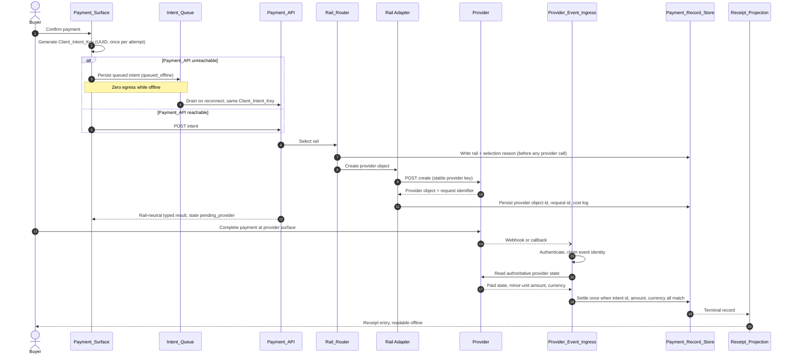
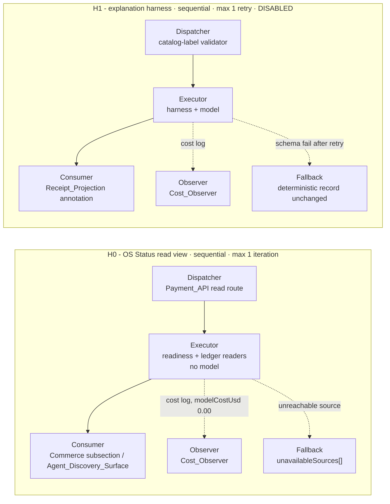
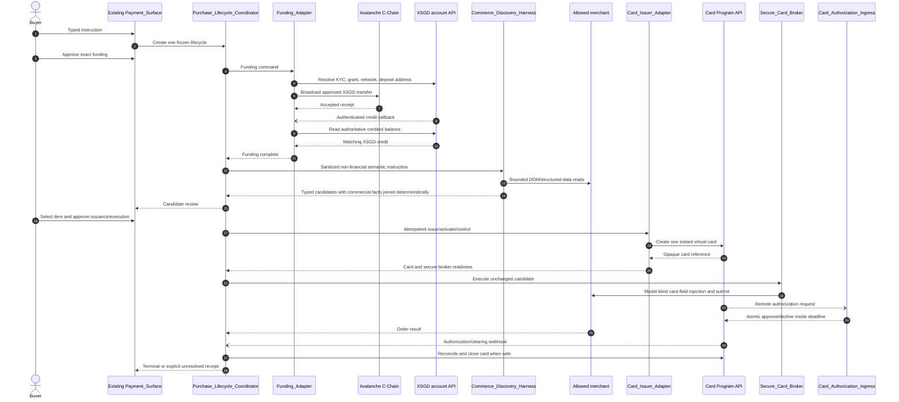
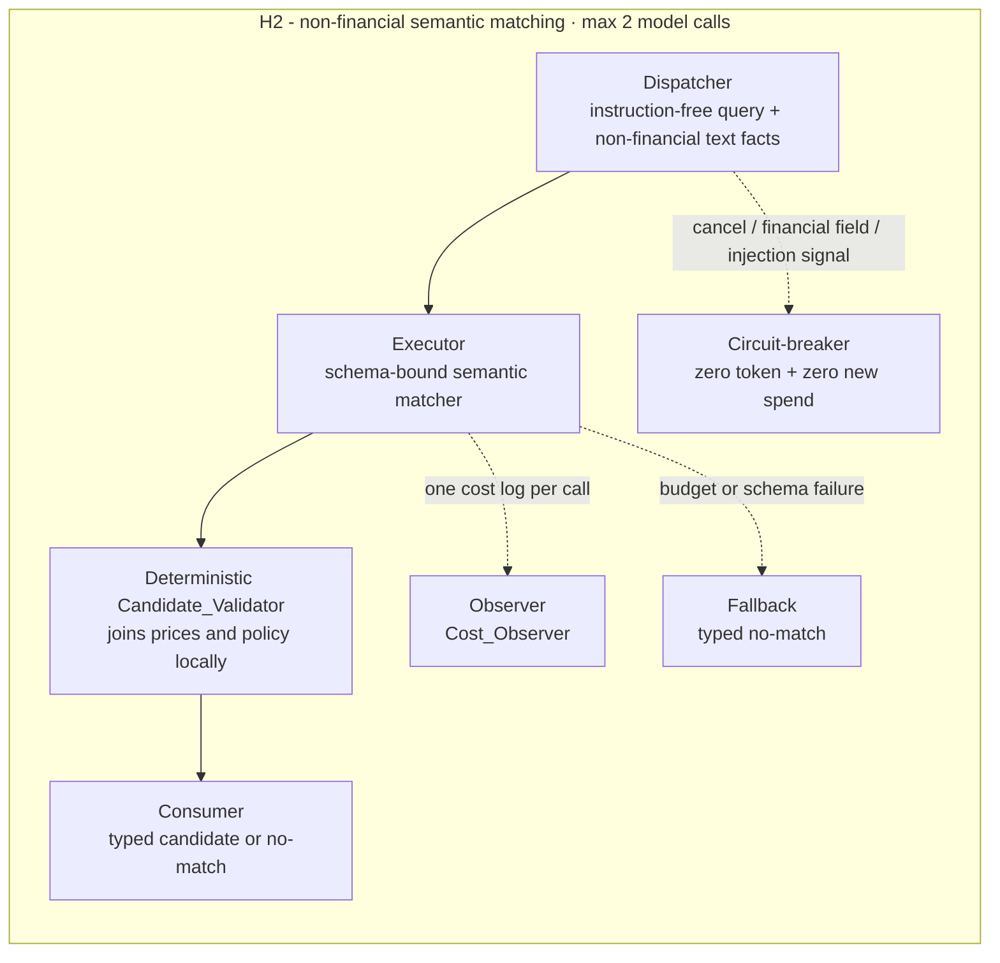

[Combined planning owner](agentic-graph-payments-prd-tad-adr-mvp-gtm.md) · `PLAN-AGENTIC-GRAPH-PAYMENTS-PRD-TAD-ADR-MVP-GTM@1.3.1`. This companion preserves the source section; diagrams and frontmatter projections remain owned by the combined artifact.

### Orchestration/Harness Flows

**No AI model call is in any financial path.** Rail selection, intent creation, provider event
ingestion, funding validation/credit, card issuance, card authorization, reconciliation,
disposal, and record serialization are deterministic and make zero model calls. Only H2
commerce discovery may call a model under its fixed bounds. The read-only OS Status Surface
for payments (rail readiness views and the cost ledger view) costs 0.00 USD in token spend
with zero model calls per view, aggregates at read time over state that already exists in the
payment store, adds no persistent OS-level datastore, and exposes no payment write path. A
non-zero model cost on any financial or read-only view is a defect, not a budget overrun.

#### H0: Payment OS Status Surface read view

**Trigger**: Operator or agent requests a payment readiness or cost view.
**Topology pattern**: Sequential. **Max iterations**: 1. **Circuit-breaker**: any view attempting a model call or a state write aborts the response and reports a defect.
**Token budget**: 0 prompt + 0 completion at any cache hit rate = 0.00 USD per call.

| Role | Component | Input schema | Output schema | Cost log emitted | Fallback |
|---|---|---|---|---|---|
| Dispatcher | Payment_API read route | `{view: "rail_readiness" \| "cost_summary"}` | Routed read request | - | Reject an unknown view with a typed error |
| Executor | Readiness snapshot reader and cost ledger reader, no model | Typed read request | `{entries[], unavailableSources[]}` | Yes, with `modelCostUsd: 0.00` | Move the unreachable source into `unavailableSources[]`; the response still succeeds |
| Observer | Cost_Observer | Cost log stream | Ledger rows and totals | - | Silent fail with a logged gap; the view still returns |
| Consumer | MainPanel Commerce Payments subsection, Agent_Discovery_Surface | `{entries[], unavailableSources[]}` | Rendered rows or JSON | - | Upstream typed error propagated |

**Postconditions**: zero payment state mutation, zero model calls, `modelCostUsd` equal to 0.00, and every unreachable source named rather than silently dropped.

#### H1: Optional payment-adjacent explanation harness, disabled in this increment

R11 criterion 3 allows an optional payment-adjacent model explanation behind a harness. R12 criterion 4 forbids sending any payment record field into a model prompt. Together those constraints leave the harness with no record-derived input, so H1 ships disabled and is specified only so that no ad-hoc model call can appear later without a contract. The tension is recorded as OQ-13.

**Trigger**: Operator explicitly enables the harness and requests a generic explanation of a state label. Never invoked from a selection, creation, ingestion, reconciliation, settlement, or serialization path.
**Topology pattern**: Sequential. **Max iterations**: 1. **Circuit-breaker**: an invalid output schema after one retry, or invocation from any payment path, aborts and returns the deterministic record unchanged.
**Token budget**: not measured. A ceiling must be stated before enablement and the harness stays disabled until then.

| Role | Component | Input schema | Output schema | Cost log emitted | Fallback |
|---|---|---|---|---|---|
| Dispatcher | Payment_API explanation route, disabled by default | `{stateLabel: enum, railLabel: enum}` drawn from the static catalog, with no intent identifier, amount, currency, provider identifier, card, bank, email, or provider customer field | Validated explanation request | - | Reject malformed or record-bearing input before any token spend |
| Executor | Explanation harness plus model | Typed prompt built only from the two catalog labels | `{explanation: string}` validated against schema | Yes, `{model, prompt_tokens, completion_tokens, cache_hits, estimated_cost_usd}` | Return the deterministic record unchanged |
| Observer | Cost_Observer | Cost log stream | Ledger rows and alerts | - | Silent fail with a logged gap |
| Consumer | Receipt_Projection view | `{explanation}` | Rendered annotation, never a stored payment field | - | Upstream error propagated; record unchanged |

**Postconditions**: no payment record field entered a model prompt, the deterministic record is unchanged, and one cost log entry exists per call while the harness is enabled.

#### H2: Bounded non-financial commerce semantic matching

**Trigger**: deterministic structured-data and DOM extraction produced candidate text facts
but cannot decide which candidate satisfies the buyer's semantic item attributes.
**Topology pattern**: Agentic loop.
**Max iterations**: 2 model calls, within the enclosing maximum of five product pages and
twelve browser actions.
**Circuit-breaker**: cancellation is signalled; any input contains lifecycle id, approval,
account, address, transaction, funding, card, authorization, order, amount, price, shipping,
tax, total, currency, or payment record data; deterministic page filtering detects a
tool/policy instruction; output schema fails twice; model budget is exhausted; or the
instruction expires. Cancellation stops before the next browser action or model call.
**Token budget**: at most 6,000 prompt plus 1,000 completion tokens per call; at most 12,000
prompt plus 2,000 completion tokens per lifecycle; target cache hit rate at least 50 percent.
The configured model price converts logged token counts to estimated cost before H2 is
enabled.

| Role | Component | Input schema | Output schema | Cost log emitted | Fallback |
|---|---|---|---|---|---|
| Dispatcher | Commerce_Discovery_Harness | `{semanticQuery, requiredAttributes[], candidates: [{candidateId, title, variantText, descriptionFacts[]}], cancellationSignal}` with every financial/lifecycle/provider field structurally absent | Validated non-financial semantic match request | Input rejection costs zero | Deterministic candidate set or typed `semantic_match_unavailable` |
| Executor | Model adapter inside Commerce_Discovery_Harness | Non-financial semantic match request only | `{matches: [{candidateId, matchedAttributes[], missingAttributes[], confidenceBasis}]}` | `{model, prompt_tokens, completion_tokens, cache_hits, estimated_cost_usd}` per call | At most one retry, then no-match |
| Observer | Cost_Observer | Model cost log plus browser page/action counters | Persisted cost/counter entry | — | Log failure aborts H2 before candidate selection |
| Consumer | Deterministic Candidate_Validator inside Commerce_Discovery_Harness | Model semantic output joined locally with separately held origin, URL, quantity, price, shipping, tax, total, currency, and freshness facts | R15 candidate schema or typed rejection | Zero additional model cost | No candidate; zero card/authorization or other new spend-bearing calls; terminal cleanup may release the existing funding reservation |

**Happy path**:
1. Deterministic filtering admits only instruction-free page facts; any injection signal has
   already aborted the discovery run. Dispatcher validates that the prompt schema cannot
   carry any payment, lifecycle, or provider field.
2. Executor returns schema-valid semantic matches and one cost entry.
3. Deterministic consumer joins the matches with separately held commercial facts, applies
   origin, budget, currency, and freshness rules without a model, and returns candidates.

**Alternate paths**:
- Structured data already resolves the item: H2 is skipped and model cost is `0.00`.
- First output invalid: one bounded retry with the same sanitized input.

**Error paths**:
- Any injection signal, prohibited field, or page instruction reaches filtering/dispatcher:
  abort the whole discovery run before token spend or another browser action.
- Cancellation before or during H2: stop before the next browser action/model call, return a
  typed cancellation, and create no card or authorization.
- Model unavailable, budget exceeded, or second output invalid: return typed no-match and
  create no card.

**Postconditions**: at most one schema-valid non-financial semantic result is joined by
deterministic code to commercial facts; every model call has one cost log; payment records
and financial fields never enter a model prompt.

### Workflow and Harness Diagrams

**W1 plus W2: intent creation through settlement** (multi-actor, `sequenceDiagram`).

**H0 and H1: harness control paths** (`flowchart LR`, loop sections bounded by subgraphs).

Circuit-breaker conditions restated for the diagram: H0 aborts and reports a defect if any
view attempts a model call or a state write. H1 aborts to the deterministic record if the
output schema fails after one retry, or if it is invoked from any selection, creation,
ingestion, reconciliation, settlement, or serialization path.

**W8-W12 plus H2: XSGD-funded agentic purchase lifecycle** (multi-actor
`sequenceDiagram`; financial calls remain outside H2).

H2 never receives prices, amounts, currency, payment/lifecycle/provider identifiers, or card
data. Deterministic code joins those separately after semantic matching. The lifecycle stops
on any phase mismatch; no branch reissues a card or resubmits checkout while outcome is
unknown.

