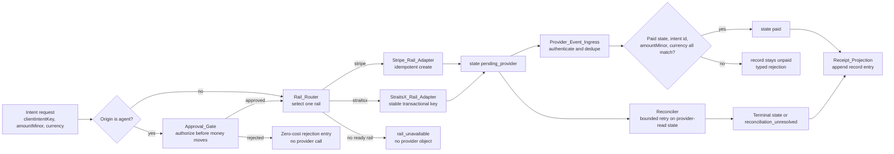
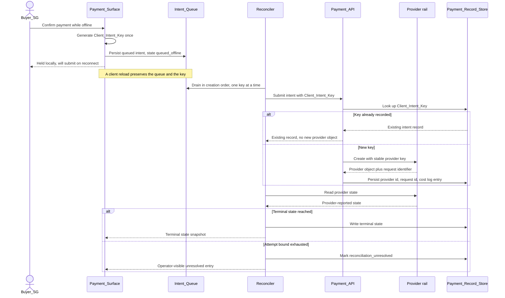
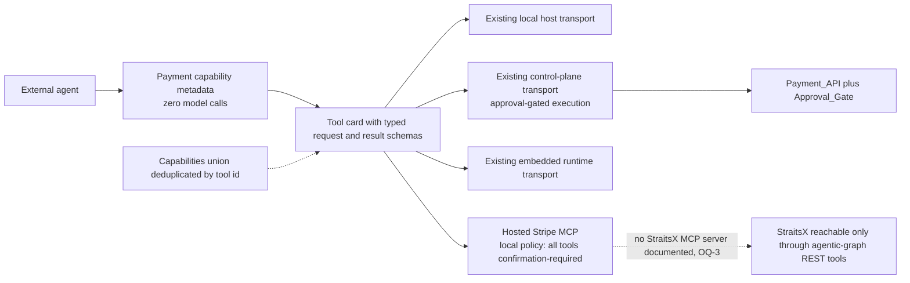

[Combined planning owner](agentic-graph-payments-prd-tad-adr-mvp-gtm.md) · `PLAN-AGENTIC-GRAPH-PAYMENTS-PRD-TAD-ADR-MVP-GTM@1.3.1`. This companion preserves the source section; diagrams and frontmatter projections remain owned by the combined artifact.

### Reference implementation: Cross-Boundary Integration Contracts

| Interface | Protocol | Format | Auth | Error strategy |
|---|---|---|---|---|
| `Payment_Surface` → `Payment_API` buyer intent create | HTTPS POST | JSON with `origin="buyer"` and amount/currency/asset asserting the projected server buyer product | Session-scoped; no payment credential client-side | Missing authority or tuple mismatch returns `capability_unavailable` before D1/provider; other typed results include `rail_unavailable`, `intent_parameter_conflict`, `integration_model_unsupported`, `provider_outcome_unknown`, `mode_mismatch` |
| `Payment_Surface` → `Payment_API` status read | HTTPS GET | JSON, exactly four fields | Public by intent identifier | Typed `not_found`; provider internals never surfaced |
| `Payment_API` → `Stripe_Rail_Adapter` → Stripe | HTTPS POST/GET, form-encoded request bodies, JSON responses | Provider JSON | Adapter-specific restricted key from server-side secret storage, HTTPS only, request API version pin | Provider `type` mapped to a typed result; indeterminate outcomes remain unresolved through same-key reconciliation |
| `Payment_API` → `StraitsX_Rail_Adapter` → StraitsX | `POST /v1/payments/paynow`; `GET /v1/payments/paynow/{paymentId}` | Nested JSON:API request `{data:{attributes:{referenceId,amount,expiresAt}}}` and `data.type="payment"` response with nested `attributes.paymentMethod` | API key always; signed mode adds the documented Ed25519 canonical-request headers after raw query sorting | Missing/invalid fund flow, model-flow mismatch, signing failure, exact-path/grant mismatch, XSGD, and unbound refund fail before egress with zero provider calls; response PayNow id, amount, currency, reference, and shape mismatches remain fail-closed |
| Stripe → `Provider_Event_Ingress` | HTTPS POST, exact raw body preserved | JSON | `Stripe-Signature`, endpoint secret, and timestamp tolerance verified before parsing | Signature/timestamp failure produces zero state change; duplicates and order handled explicitly |
| StraitsX → `Provider_Event_Ingress` | HTTPS POST, exact raw body preserved | JSON | `Xfers-Signature` HMAC-SHA256 plus source allowlist before parsing; mandatory provider read after | Rejected on either authenticity failure; provider state remains settlement authority |
| Agent host → `Agent_Discovery_Surface` metadata | HTTPS GET | JSON matching the published schema | None required; zero model calls | Typed `method_not_allowed`; unreachable sources named in `unavailableSources[]` rather than dropped |
| Agent host → payment tool | Existing MCP transport | Typed tool schema; verified agent create receives derived `payment-action:<tokenId-or-issuedAt>` reference, never the raw token | agentic-graph marks hosted tools confirmation-required; `Approval_Gate` also required for state-changing or spend-bearing calls | `approval_missing`, `schema_invalid`; zero-cost pre-dispatch rejection; agent-create and refund services are callable only through this approved host boundary |
| Public HTTP caller → agent intent create | HTTPS POST `/api/payments/intents` with `origin="agent"` | Typed denial envelope; caller-supplied `approvalRef` is never authority | No public agent-create authority | Always `403 approval_missing` before runtime construction or D1 access; zero provider calls |
| Public HTTP caller → refund path | HTTPS POST `/api/payments/intents/{intentId}/refund` | Typed denial envelope | No public refund authority | Always `403 approval_missing` before runtime construction or D1 access; zero provider calls |
| `Agent_Discovery_Surface` → hosted MCP transport | HTTPS, MCP | MCP tool schema | OAuth preferred; autonomous restricted-key fallback; connected account uses restricted key plus account header | Unknown tools and environment mismatch fail closed; unreachable transport is surfaced |
| `Readiness_Gate` → providers and store | HTTPS GET, database read | JSON with separate `admissionRails` and proof-complete `rails` | Read-only | Non-zero on missing input, buyer-product mismatch, absent pin, fund-flow mismatch, signing-clock failure, or unverified callback; admission never promotes readiness; writes nothing |
| Existing `Payment_Surface` → `Purchase_Lifecycle_Coordinator` | HTTPS REST | Immutable Purchase_Envelope and minimized lifecycle snapshot | Existing user session plus phase-specific Approval_Gate reference | `purchase_instruction_rejected`, `purchase_instruction_conflict`, `approval_missing`; pre-approval hidden/closed makes zero calls, while post-state cancellation permits only mandatory unreserve/read/reconcile/block/safe-close cleanup |
| `Funding_Adapter` → XSGD account API | HTTPS REST plus callback | Provider JSON; exact raw callback body | Server-side account credential; callback HMAC/source controls | Unsupported environment/account/network/product makes zero transfer; chain-only result remains pending |
| `Funding_Adapter` → Avalanche-compatible RPC/signer | JSON-RPC plus external signer request | EVM transaction/receipt and signer result | Buyer-controlled or approved external signer; agentic-graph holds no private key | Wrong chain/token/address/amount/gas/signer fails before broadcast; provider credit remains separately required |
| `Commerce_Discovery_Harness` → allowed merchant | Browser HTTPS | DOM/structured data in; typed candidate out | Public browsing/session cookies scoped to buyer browser; no payment credential | Redirect/origin violation, injection signal, cancellation, blocked page, unknown total, or bound exhaustion aborts before another action/model call and produces no card |
| `Card_Issuer_Adapter` → Card Program API | HTTPS REST | Provider JSON | Server-side client-credentials bearer token; separate environment/program | Grant/product/pool/activation/3DS mismatch or provider-plus-RHA control union weaker than approval yields no usable card; uncertain create reconciles before retry |
| Card Program → `Card_Authorization_Ingress` | Provider callback HTTPS with synchronous response, plus separate webhook | Provider authorization/event schema | Dedicated inbound bearer secret; separate webhook signing secret | Invalid auth fails closed; first identity is atomically claimed/reserved, exact duplicate returns prior decision, concurrent later identity is denied, deadline is enforced, and timeout remains provider-declined/unresolved according to exact contract |
| Card Program secure surface → `Secure_Card_Broker` → allowed merchant checkout | Provider-hosted or PCI-scoped browser channel | Card fields remain opaque to model/app; result is success/failure only | Ephemeral credential session bound to lifecycle, origin, form, and TTL | Any redaction, origin, broker, or PCI-mode failure aborts before checkout |
| `Purchase_Lifecycle_Coordinator` → merchant order read | Browser/API HTTPS | Minimized order id, total, currency, state | Buyer/merchant session | Merchant/issuer disagreement remains `purchase_outcome_unknown`; no card reissue or checkout resubmit |

The local API-reference captures are advisory snapshots only. Current official sources below
are normative for this revision; a local capture that differs is a stale-source finding and
must not override the upstream contract.

### Reference implementation: Provider Integration Contracts

#### Interface: Stripe REST API

| Aspect | Contract |
|---|---|
| Protocol | HTTPS REST, resource-oriented URLs, base URL `https://api.stripe.com`. Plain HTTP and unauthenticated requests fail ([Stripe API](https://docs.stripe.com/api)) |
| Format | Form-encoded request bodies, JSON responses, standard HTTP verbs and status codes. One object per request; no bulk update ([Stripe API](https://docs.stripe.com/api)) |
| Auth | One least-privilege restricted key per service/use case, with separate `rk_test_` and `rk_live_` credentials; the payment adapter and autonomous MCP client do not share a key. Keys are held server-side and never enter source or a browser ([restricted API keys](https://docs.stripe.com/keys/restricted-api-keys)) |
| Sandbox | Sandboxes exercise the API without touching live data or banking networks, and the key in use determines live versus sandbox ([Stripe API](https://docs.stripe.com/api)) |
| Idempotency | Scope this contract to API v1: every POST carries a key of at most 255 characters derived from Client_Intent_Key and free of personal data. Stripe replays the first status/body, including `500`, can prune a key after at least 24 hours, and rejects changed parameters. agentic-graph retains durable uniqueness beyond that window ([idempotent requests](https://docs.stripe.com/api/idempotent_requests)) |
| Errors | Preserve documented error fields and `decline_code` in operator output. Network errors and `5xx` can be indeterminate; reuse the same key and parameters, reconcile by provider read and authenticated webhook, and retain `provider_outcome_unknown` rather than minting a new key or recording failure ([advanced error handling](https://docs.stripe.com/error-low-level)) |
| Pagination | Cursor-based with `limit` between 1 and 100 (default 10) and mutually exclusive `starting_after` and `ending_before`; list responses are `{object:"list", data, has_more, url}`. Search uses `query`, `page`, `next_page`. The `/v2` namespace paginates differently, and API v2 uses an `include` array to select which properties return actual values instead of null ([Stripe API](https://docs.stripe.com/api)) |
| Metadata | Up to 50 keys, key names at most 40 characters, values at most 500 characters, no square brackets in key names. Bank account numbers and card details are never placed in metadata or `description` ([Stripe API](https://docs.stripe.com/api)) |
| Versioning | Pin outbound requests and webhook endpoints independently. `2026-06-24.dahlia` is the current documented version checked on 2026-07-29; existing Event payloads retain their creation-time version ([versioning](https://docs.stripe.com/api/versioning), [webhook versioning](https://docs.stripe.com/webhooks/versioning)) |
| Correlation | `Request-Id` response header recorded per call for support correlation and log linkage ([Stripe API](https://docs.stripe.com/api)) |
| Connected accounts | A `Stripe-Account` header carrying an `acct_` identifier where an operation is account-scoped ([Stripe API](https://docs.stripe.com/api)) |
| Authoritative state | ADR-1 selects Checkout Session. `status=complete` is not sufficient by itself: unlock only from `payment_status=paid` or `no_payment_required` and the applicable asynchronous success event. A nested PaymentIntent has a different state model and must not overwrite the Session state ([Checkout Session](https://docs.stripe.com/api/checkout/sessions/object), [PaymentIntent](https://docs.stripe.com/api/payment_intents/object)) |
| Webhooks | Verify exact raw body, `Stripe-Signature`, endpoint secret, and timestamp tolerance before parsing; deduplicate Event ID and `(event.type, data.object.id)`, return `2xx` quickly, and never depend on delivery order ([webhooks](https://docs.stripe.com/webhooks)) |

#### Interface: hosted Stripe MCP transport

| Aspect | Contract |
|---|---|
| Protocol | Remote MCP over HTTPS at `https://mcp.stripe.com`. Client configuration is `{"mcpServers":{"stripe":{"url":"https://mcp.stripe.com"}}}` ([Stripe MCP](https://docs.stripe.com/mcp)) |
| Current tool inventory | `stripe_api_search`, `stripe_api_details`, `stripe_api_read`, `stripe_api_write`, `get_stripe_account_info`, `create_refund`, `search_stripe_documentation`, `stripe_implementation_planner`, `send_stripe_mcp_feedback`, and `stripe_report`. Reconcile this allowlist at source-check time; unknown tools remain unregistered ([Stripe MCP](https://docs.stripe.com/mcp)) |
| Tools excluded | `get_balance_summary` is Treasury Public Preview, and Treasury money movement, bill pay, and cards are access-gated; all remain out of scope ([Stripe MCP](https://docs.stripe.com/mcp)) |
| Auth | OAuth is preferred where supported. An autonomous client may use a dedicated vault-held restricted key. Connected-account calls cannot use OAuth and require a restricted key plus `Stripe-Account`. Sandbox and live access are separate ([Stripe MCP](https://docs.stripe.com/mcp)) |
| Safety | Official guidance recommends human confirmation; this reference implementation marks every registered hosted tool confirmation-required. Broad reads/writes, refunds, reports, and feedback also receive explicit local side-effect classification; spend-bearing or state-changing calls additionally pass Approval_Gate. Prompt-injection caution applies when servers are combined ([Stripe MCP](https://docs.stripe.com/mcp)) |
| Errors | An unreachable transport is reported in `unavailableTransports[]`; missing confirmation, missing approval, environment mismatch, or unknown tool is refused before dispatch |

#### Interface: StraitsX REST API

| Aspect | Contract |
|---|---|
| Protocol | HTTPS REST. Current hosts are `https://api-sandbox.straitsx.com` and `https://api.straitsx.com`; production requires business verification and explicit API approval and remains disabled here ([sandbox and production environments](https://docs.straitsx.com/docs/sandbox-production-environments)) |
| Format | JSON requests and responses |
| Auth, all modes | `X-XFERS-APP-API-KEY` is required on every request under every authentication method ([StraitsX Say Hello](https://docs.straitsx.com/reference/say-hello)) |
| Auth, signed mode | Add `X-PUBLIC-KEY-ID`, `X-TIMESTAMP`, a never-reused UUID `X-NONCE`, and base64 Ed25519 `X-SIGNATURE` over `METHOD\nPATH\nQUERY\nTIMESTAMP\nNONCE\nBODY`; use exact raw body, lexicographically sorted raw URL-encoded query pairs, and ±300-second clock tolerance ([HTTP request signing](https://docs.straitsx.com/docs/http-request-signing)) |
| Reachability probe | `GET https://api-sandbox.straitsx.com/v1/authorize/hello` with HTTP `200` proves only connectivity and API-key authentication for that request; it is not Payment API, callback, integration-model, or settlement evidence ([StraitsX Say Hello](https://docs.straitsx.com/reference/say-hello)) |
| Access model | Access depends on an approved use case, and the partner is assigned one of First Party Transfer (Customer Profile), Third Party Transfer (Customer Profile), or Regular Transfer. First Party restricts deposits and withdrawals to a user's own bank accounts with per-user KYC. Third Party lets the partner collect KYC and move funds to users, merchants, or third parties. Regular Transfer moves only the partner's own funds between its own or linked corporate accounts ([StraitsX API guides](https://docs.straitsx.com/docs/introduction)) |
| API families used | Customer Profiles is an essential prerequisite for Payment and Payout APIs according to the introduction. Increment 1 binds only the granted SGD Payment API method. Increment 2 specifies a separately gated business-account blockchain deposit and Card Program path; Payout, Swap, and Transaction Limit operations remain blocked ([StraitsX API guides](https://docs.straitsx.com/docs/introduction)) |
| Idempotency | Transactional POSTs accept `referenceId` or `idempotency_id`. Reuse the same value for the same logical operation; changed requests can return `422/STXE-7000`. On timeout or `5xx`, read transaction state before a same-key retry ([idempotent requests](https://docs.straitsx.com/docs/idempotent-requests), [transaction safety](https://docs.straitsx.com/docs/transaction-safety)) |
| State | `pending`, `completed`, `refunded`, `failed`, and `expired`; only `completed` is success. `expired` is production-only for time-limited QR and is not a sandbox proof target ([transaction status](https://docs.straitsx.com/docs/transaction-status)) |
| Callbacks | Verify `Xfers-Signature` as HMAC-SHA256 over the exact raw body using the active signing secret, compare timing-safely, and enforce source IP allowlisting before parse. Return HTTP `200` quickly; repeated delivery is expected, so processing is idempotent ([securing callbacks](https://docs.straitsx.com/docs/securing-your-callback), [source IP addresses](https://docs.straitsx.com/docs/source-ip-addresses)) |
| Errors | Preserve HTTP status and each `errors[]` entry's `error`, `error_code`, and `error_handling`. Treat `429/STXE-9000` with configurable bounded backoff; the source provides no numeric quota or guaranteed `Retry-After` ([errors](https://docs.straitsx.com/docs/errors)) |
| Gated operations | Increment 1 XSGD collection returns `capability_unavailable`; refund returns `provider_operation_unverified`. Increment 2 XSGD funding is a separate capability and remains false until its exact production account/network/address/credit and card-settlement bridge close OQ-9 and OQ-18 |

#### Interface: StraitsX XSGD account funding, reference implementation

| Aspect | Contract |
|---|---|
| Account model | Business-account blockchain deposit is account-scoped and must not be conflated with Customer Profile KYC/payment records. The exact KYC/cardholder/account ownership mapping remains provider-assigned |
| Capability discovery | Authenticated `GET /v1/blockchain_transfer/blockchains` is the runtime source for account-supported token/network tuples; documentation examples alone do not enable a tuple ([supported blockchains](https://docs.straitsx.com/reference/get-a-list-of-supported-blockchains)) |
| Deposit address | Production-only `POST /v1/blockchain_transfer/deposit_addresses` accepts a token and blockchain, with `avalanche` among documented blockchain examples. The returned account deposit address is the only eligible destination after allowlist/grant checks; the token contract is never a destination ([create deposit address](https://docs.straitsx.com/reference/create-deposit-address)) |
| Credit authority | An observed chain transaction is a hint. Funding completes only after the exact raw provider callback authenticates and an authoritative account balance/credit read matches token, network, address, transaction, amount, and completed state ([callback samples](https://docs.straitsx.com/docs/callback-samples), [callback security](https://docs.straitsx.com/docs/securing-your-callback)) |
| Fiat-versus-token drift | Current API changes state that SGD/USD deposits into dashboard virtual accounts credit fiat balances instead of automatically minting XSGD/XUSD; `wallet_source` selects the withdrawal balance. No bank deposit may be inferred to mint XSGD ([mandatory 2026 changes](https://docs.straitsx.com/changelog/mandatory-changes-30-jan-2026)) |
| Environment | The documented deposit-address create path is production-only. Deterministic local fixtures may prove schemas/state/idempotency, but no provider-backed XSGD/Avalanche proof or financial transfer occurs without separate explicit authority |
| Card bridge | No inspected official endpoint proves that an arbitrary credited XSGD Avalanche deposit automatically funds the Card Program account. OQ-18 remains a blocker and the lifecycle advertises Funding as unavailable until that bridge is provider-confirmed |

#### Interface: StraitsX Card Program, reference implementation

| Aspect | Contract |
|---|---|
| Hosts | Card Management System sandbox `https://merchant.cop-staging.straitsx.com/`; production `https://merchant.cop.straitsx.com/` ([Card Management System](https://docs.straitsx.com/v1-CARDS/docs/card-management-system-cms)) |
| Authentication | Server obtains a bearer token with provider-distributed client credentials; secrets never enter client code or visible configuration ([authentication](https://docs.straitsx.com/v1-CARDS/docs/authentication-method)) |
| Provider provisioning | Provider creates the issuer group, issuing plan, card product, authentication method, and product opaque ids. Card capability is false until exact sandbox program/grant evidence exists ([Getting Started](https://docs.straitsx.com/v1-CARDS/docs/getting-started)) |
| Card create | `POST /api/v1/issuing_plans/{issuing_plan_opaque_id}/users/{customer_opaque_id}/cards` creates a card for an existing user; virtual/instant behavior comes from the provider-assigned card product. Funding source and account currency are account/program contracts, not caller assumptions ([Create Card](https://docs.straitsx.com/v1-CARDS/reference/create-card)) |
| Instant availability | Instant issuance needs a provider-supplied product opaque id and pre-generated card pool. A created card is initially inactive and must be activated; pool exhaustion is a typed, fail-closed outcome ([Instant Card Issuance](https://docs.straitsx.com/v1-CARDS/docs/instant-card-issuance)) |
| E-commerce readiness | Most e-commerce payments need 3DS enrollment; buyer authentication is a user handoff, never agent impersonation. Spend limits and permanent close are explicit API capabilities ([Getting Started](https://docs.straitsx.com/v1-CARDS/docs/getting-started)) |
| Credential boundary | Requesting encrypted PAN or CVV through Create Card requires PCI eligibility. Non-PCI runtime cannot request those fields. OQ-19 must bind an approved secure credential path before execution |
| Authorization | Remote Host Authorization lets the program approve/decline using balance and policy. The inbound request uses a dedicated bearer secret, the documented timeout is six seconds, timeout auto-declines, and the provider does not retry; the existing always-online Worker must prove atomic reservation and latency ([RHA reference](https://docs.straitsx.com/v1-CARDS/reference/remote-host-authorization), [RHA FAQ](https://docs.straitsx.com/v1-CARDS/docs/faqs-rha)) |
| Effective controls | Provider-native card controls combine with repository-owned RHA amount/currency/merchant/transaction/time policy. Every approval restriction must be enforced by at least one side; a weaker effective union yields no usable card |
| Disposable semantics | Provider docs do not define a native disposable/single-use card. Increment 2 defines one-use at the first authenticated authorization identity successfully claimed and atomically reserved; an exact duplicate returns the prior decision, later identities are denied, `closure_pending` persists through hold/capture/reversal/refund risk, and permanent close occurs when safe. This remains unavailable until OQ-21 is source-bound |
| XSGD settlement | The provider describes XSGD as an issuer-native card settlement rail, but marketing capability is not authenticated account/program evidence and does not close the Avalanche-to-card bridge ([card issuance platform](https://www.straitsx.com/platform/card-issuance)) |

#### Interface: Avalanche C-Chain for XSGD, reference implementation

| Aspect | Contract |
|---|---|
| Network | Avalanche C-Chain is EVM-compatible; mainnet transactions must use chain id `43114`. Wrong-chain or replayable transaction configuration fails before signing/broadcast ([C-Chain integration](https://build.avax.network/docs/primary-network/exchange-integration)) |
| Token | The current provider support source lists XSGD C-Chain contract `0xb2F85b7AB3c2b6f62DF06dE6aE7D09c010a5096E`. Runtime still verifies the authenticated account-supported tuple and configured contract; the address is a token contract, never a deposit address ([XSGD token addresses](https://support.straitsx.com/support/solutions/articles/157000365664-how-do-i-add-the-xsgd-token-to-my-eth-polygon-avalanche-arbitrum-zilliqa-xrp-ledger-or-hedera-w)) |
| Finality | C-Chain exposes accepted/finalized state through normal EVM reads with fast irreversible finality, but provider account credit is a separate business event and remains the Funding authority ([C-Chain finality](https://build.avax.network/docs/primary-network/exchange-integration)) |
| RPC/node | JSON-RPC is configurable. Reusing an authenticated managed RPC keeps the min-viable runtime zero-new-infra; self-hosting FOSS AvalancheGo is an optional provisioned alternative with patching, storage, monitoring, and availability burden ([AvalancheGo](https://github.com/ava-labs/avalanchego)) |
| Privacy | Public chain data includes sender, destination, token, amount, and transaction. No KYC field, buyer instruction, merchant candidate, card, or order data is written on-chain |
| Proof boundary | Local fixtures and provider docs can reach at most `dev-proven`. A real-value mainnet transfer and account credit require explicit financial authority; no sandbox XSGD token/network proof is inferred |

### Quality Attribute Summary

| Attribute | Scenario | Pattern | Validation |
|---|---|---|---|
| Performance | Buyer on a 375 px viewport reaches a terminal sandbox state within 90 seconds | Hosted provider payment surfaces, no client-side card handling, one state snapshot | Timed sandbox purchase during the TTV walk-through |
| Correctness | A replayed intent must never create a second provider object | Client-generated key carried into the provider idempotency mechanism plus a provider state read | Property test across 100 generated interleavings |
| Scalability | Event volume grows without a second store or tier | Existing Worker plus existing D1 binding, event identity dedup table | Focused worker tests plus readiness gate output |
| Security | A forged or replayed provider event must not unlock capability | Cryptographic verification over exact raw bytes on both rails, provider-specific replay/source controls, provider read, at-most-once side effects | Negative-path tests for tampered bytes, wrong secret, stale replay input, foreign source address, duplicate forms, and reordered delivery |
| Secret custody | A payment secret must never be reachable from the client bundle | Server-side secret storage only, gated bundle and visible-var scan | Gate exits non-zero when a secret name is planted |
| Observability | Every provider call must be attributable | One cost log entry per call with rail, operation, provider request identifier, outcome, elapsed ms | Recorded-run assertion of one entry per call |
| Accessibility | Payment state must be available without sight or a mouse | Text state announcement, keyboard-reachable controls, no horizontal overflow at 375x812 | Focused surface tests |
| Token Cost | Payment path at any load | Zero model calls on selection, creation, ingestion, reconciliation, serialization; read views at 0 prompt plus 0 completion | Cost log assertion that `modelCostUsd` equals 0.00; a non-zero value fails the gate |
| Agent discovery cost | One agentic purchase searches one allowed merchant | Deterministic structured-data/DOM extraction first; H2 max five pages, twelve browser actions, two model calls, 12,000 prompt plus 2,000 completion tokens | Browser/model counter assertions, per-call cost logs, and prohibited-financial-field prompt canary |
| Funding correctness | A chain receipt exists but the regulated account has not credited the matching XSGD | Dual authority: accepted chain receipt plus authenticated provider callback/read | Wrong-chain/token/address/amount and chain-only fixtures; one explicitly authorized provider proof |
| Authorization latency | Card Program calls the Remote Host Authorization endpoint | Existing always-online Worker, atomic reservation, internal safety margin below provider's six-second timeout | Focused p95/p99 load result plus timeout/duplicate/concurrency fixtures |
| Card credential security | Agent checks out at an allowed third-party merchant | Provider-hosted or PCI-scoped, model-blind ephemeral injection; screenshots/telemetry disabled for credential fields | Planted PAN/CVV/expiry/OTP canaries absent from model, logs, screenshots, stores, and receipts |
| Disposable-card correctness | Merchant uses hold/completion/reversal/refund or a late force-post | Immediate authorization block plus `closure_pending` until source-bound safe-close condition | State/race property suite across authorization, capture, reversal, refund, timeout, and close |
| Offline Behaviour | Client disconnects during any agentic phase | Paywall keeps the last minimized snapshot/receipt locally; new funding, discovery navigation, issuance, authorization, and checkout pause/fail explicitly, while server-side unreserve/read/reconcile/block/safe-close cleanup for existing financial state remains permitted | Airplane-mode surface pass; pre-approval offline causes zero calls; post-state disconnect causes zero new spend and mandatory cleanup remains observable |
| Device Reach | Buyer controls the lifecycle from a mobile browser | Existing responsive Paywall, provider-hosted authentication handoff, no native-only dependency | 375×812 browser pass for every phase, error, `closure_pending`, and receipt |
| TCO | 12-month fixed infrastructure spend at target load | Reuse of the existing managed serverless Worker and its managed serverless database free tier; zero-egress default; no new provisioned runtime | Monthly cost audit and ADR-5 review. Managed serverless variant is 0.00 USD per month at current load; self-managed equivalents are priced separately in ADR-1 and ADR-5 and are not blended into this figure |
| Provider-inclusive TCO | XSGD funding, card issuance, authorization, settlement, PCI boundary, disputes, and discovery model at launch load | Commercial gate separate from fixed infrastructure; no zero-total-cost claim | OQ-22 schedule plus 12-month managed/serverless, provisioned/self-managed, and hybrid comparison before any live enablement |

### Lane and Diagram Strategy

The canonical functional-lane table and Deploy Boundary Register appear in the Deployment
Strategy below. Both promotion boundaries are closed. This subsection only constrains the
Authoring-lane architecture diagrams and performs no publication or deployment.

Rules that bind this increment:

- Prod and Cloudflare deploys are gated on explicit operator instruction and are NOT performed by this document. No deploy, publish, or push command is issued here.
- Rail enablement is staged. A rail is exposed only after a recorded authenticated sandbox callback plus provider read establishes its rail-specific success state and all configuration checks pass.
- Live-mode credentials are rejected while sandbox mode is configured, so an accidental live deploy fails closed rather than moving money.
- Schema changes ride the existing payment migration owner. No second migration path is introduced.

### Architecture Diagrams

#### Diagram 1: Rail selection and settlement control flow

**Component inventory for diagram 1**

| Diagram node | Component | Requirement | Local rung | Delivered rung |
|---|---|---|---|---|
| Intent request | Payment_Surface, Payment_API | R6, R8 | `dev-proven` | `undocumented` |
| Approval_Gate | existing approval owner | R9 | `dev-proven` | `undocumented` |
| Rail_Router | Rail_Router | R2 | `dev-proven` | `undocumented` |
| Stripe_Rail_Adapter | Stripe_Rail_Adapter | R3 | `dev-proven` | `undocumented` |
| StraitsX_Rail_Adapter | StraitsX_Rail_Adapter | R4 | `dev-proven` | `undocumented` |
| Provider_Event_Ingress | Provider_Event_Ingress | R5 | `dev-proven` | `undocumented` |
| Reconciler | Reconciler | R6 | `dev-proven` | `undocumented` |
| Receipt_Projection | Receipt_Projection | R7 | `dev-proven` | `undocumented` |

#### Diagram 2: Offline capture to reconnect settlement

**Component inventory for diagram 2**

| Diagram participant | Component | Requirement | Local rung | Delivered rung |
|---|---|---|---|---|
| Payment_Surface | Payment_Surface | R6, R8 | `dev-proven` | `undocumented` |
| Intent_Queue | Intent_Queue | R6 | `dev-proven` | `undocumented` |
| Reconciler | Reconciler | R3, R4, R6 | `dev-proven` | `undocumented` |
| Payment_API | Payment_API route surface | R1, R6 | `dev-proven` | `undocumented` |
| Provider rail | External provider contracts | R3, R4 | `undocumented` | `undocumented` |
| Payment_Record_Store | Payment_Record_Store | R5, R6, R12 | `dev-proven` | `undocumented` |

#### Diagram 3: Agent discovery federation

**Component inventory for diagram 3**

| Diagram node | Component | Requirement | Local rung | Delivered rung |
|---|---|---|---|---|
| Payment capability metadata, tool card, capabilities union | Agent_Discovery_Surface | R9 | `dev-proven` | `undocumented` |
| Existing local, control-plane, and embedded transports | existing MCP transport owners | R9 | `dev-proven` | `undocumented` |
| Hosted Stripe MCP | external provider transport | R9 | `undocumented` | `undocumented` |
| Payment_API plus Approval_Gate | Payment_API, existing approval owner | R9 | `dev-proven` | `undocumented` |
| StraitsX REST tools | StraitsX_Rail_Adapter behind agentic-graph tools | R4, R9 | `dev-proven` | `undocumented` |

The three adjacent inventories are the diagram-to-component SSOT. Their repository-owned
nodes advance only from the recorded local VCC; provider and delivered nodes remain
independently unproven.

