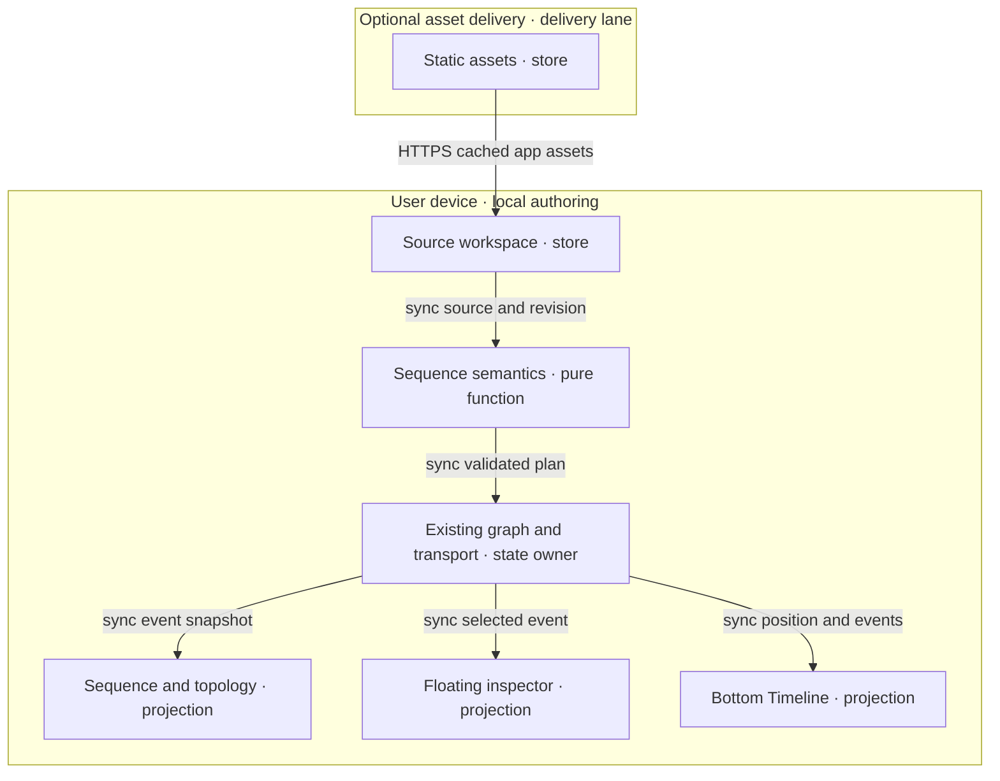

# Sequence views and synchronized flow rehearsal

## Identity, scope and authority

All five roles join **SEQUENCE-FLOW-001@1.3.43**. This 2026-10-04 implementation repairs bounded
parsing, source fencing, event targets, readable accessible projections and offline installation
discovery through existing owners. Earlier evidence retains its limitations; production readiness is unproved.

Context: an existing sequence view and shared Timeline shown in the supplied screenshot.
Intent: explain ordered interactions and branch-specific playback using existing owners.
Directive: preserve authored bytes/event identity, bound invalid input and verify the existing runtime.
Role/action/outcome: maintainer / repairs and checks / a reviewable production-readiness candidate.
Browser and build evidence below is bounded; final affected validation and protected release receipts remain separate.
Invocation: `/fix #sequence-runtime-readiness @codex-sequence-runtime`.

Use native owners and original product UI. The user-supplied demonstration stays external:
import it through normal workspace controls; do not store its path, source or specimen in
runtime code, fixtures or tests. Independent generic regression cases exercise the contract.
No outside implementation, assets, hosted rendering service or dependency enters this change.

Sprint: initial 60 active minutes; refreshed final validation estimate/cap 15 active minutes, 20 admitted files,
80 KiB added-byte cap, zero new production modules/dependencies and $0 incremental spend.
Keep files below 600 lines and chunks below 500 kB; load feature UI only on demand.
Remove the repository demonstration copy and its test reader. External CI/review waits
have no ETA; recheck on a changed exact-candidate status. Publication, integration,
deployment, payment and outreach retain separate authority and evidence boundaries.

## PRD

### Customer, pain and smallest outcome

User: developer/facilitator explaining interactions. Buyer hypothesis: team lead
commissioning a reviewed handoff. Beneficiary: reviewer identifying order, async
work and recovery. Economic pain and paid demand are unverified.

The original feature ticket established the requested capability; the current request is
production runtime readiness. The assumed workaround is reading source alongside topology;
its frequency and time cost remain unmeasured.

| Pain / priority | Hook → break → fix → close | Evidence and minimum resource/value note |
|---|---|---|
| P1 / first | Open an interaction → discover its existing sequence choices → compare Connections/Lifelines and notation → inspect each message in order. | Repair unreadable text, overlapping event targets and bounded-input failures in existing owners; difficulty and WTP remain unvalidated. |
| P2 / second | Select a numbered connection → need exact message context → use the existing sequence inspector → identify sender, receiver and current event. | FloatingPanel request supported by the ticket; explanatory benefit unvalidated. Extend the panel owner. |
| P3 / third | Rehearse a flow → need temporal context → use the existing shared Timeline → pause, scrub and return to the same event. | Timeline enhancement supported by the ticket; baseline loss/rework unmeasured. Reuse the playhead and controls. |

Rank P1–P3 provisionally by buyer pain and proximity to existing capability. The smallest
next solution is the existing-owner repair and external-source walkthrough, then remaining VCC proof. There is no
evidenced WTP ranking; a consented $1 offer can test it before further feature work.

### Journey and user stories

Journey: discover source → choose sequence view → inspect an event → rehearse and
scrub → save source and hand off → reopen. First value is identifying the sender,
receiver and order of one message in a saved interaction.

| Story / stage | User outcome | Priority / pain |
|---|---|---|
| R1 / choose | As a developer, I choose an interactive or notation-backed sequence view from the existing canvas controls to inspect the same source. | Must / P1 |
| R2 / inspect | As a reviewer, I select a numbered message and read its participants, protocol, label and source location in the floating inspector. | Must / P1, P2 |
| R3 / rehearse | As a facilitator, I play, pause, step, reset and scrub a local authored interaction to explain its progress. | Must / P3 |
| R4 / retain | As a developer, I switch views or reopen saved source without changing its messages or duplicating a run. | Must / P1, P3 |
| R5 / recover | As a reviewer, I see precise unsupported-input and stale-source feedback to avoid interpreting an incomplete rehearsal as a valid trace. | Must / P1 |
| R6 / discover | As a local agent caller, I use the existing canvas-view interface to select either sequence view. | Must / P1 |

Should: actor/event filters and explicit branch/bounded-loop inspection. Could:
still/replay export after pilot evidence. Won't: production tracing, service effects,
traffic/network emulation, inferred correctness, remote collaboration, generated
diagrams, billing, unlimited imports or a new shell.

### Acceptance conditions

Each VCC has an end state, check and constraint. Runtime rows remain **unverified** until their complete browser and owner evidence
exists. Focused domain checks are recorded below; Q1–Q9 remain the acceptance obligations. Native starting commands are mapped below.

| VCC / story | Given → when → then; constraint | Stated check / TAD / ADR |
|---|---|---|
| V1 / R1 | Given supported source, when either sequence choice is selected, then its ordered messages match source; native Connections/Lifelines and notation view changes preserve source bytes and shared position. | Q1 renderer/source fixture matrix; C1, C2, C3 / A1 |
| V2 / R2 | Given repeated messages on one connection, when event 3 is selected, then exactly event 3 is current in canvas, inspector and Timeline; connection aggregation does not merge event identity. | Q2 repeated-edge selection cases; C2, C4 / A1, A2 |
| V3 / R3 | Given a finite plan, when playback and scrubbing run, then highlights equal the event state at the shared position, including pause and reset. | Q3 deterministic clock/replay cases; C2, C5 / A2 |
| V4 / R4 | Given running source, when the document changes, then old callbacks cannot alter the new document and playback stops; a view-only change preserves position. | Q4 document/revision race cases; C2, C5, C6 / A2 |
| V5 / R5 | Given malformed, unsupported or oversized input, when parsed, then a source-located diagnostic appears and rehearsal stays disabled; authored bytes remain intact. | Q5 negative grammar/budget cases; C2, C3 / A1 |
| V6 / R1–R4 | Given cached app assets and saved source, when disconnected, then render, inspect, rehearse and reopen work with no network request or model call. | Q6 disconnected browser walkthrough; C3, C4, C5, C6 / A3 |
| V7 / R2–R3 | Given a narrow touch viewport or keyboard-only input, when selecting and scrubbing, then all actions remain reachable and the page has no horizontal overflow. | Q7 390×844 and 1280×800 browser matrix; C3, C4, C5 / A3 |
| V8 / R6 | Given a valid existing canvas-view call, when either new view ID is supplied, then it uses the same selection handler; unknown IDs are rejected. | Q8 browser/tool parity cases; C1, C7 / A3 |
| V9 / R3 | Given simulated failure/recovery events, when played, then every visible outcome is labelled authored rehearsal and no external service action occurs. | Q9 zero-effect and original recovery fixture; C2, C3, C5 / A2 |

### Success metrics and reach

| Metric | Baseline | Target / window | Evidence needed |
|---|---|---|---|
| TTV steps | Unmeasured; discovery estimate 4 | ≤4 manual actions from installed app and saved sample to first identified message | Clean first-run observation; count import/open, view choice, message selection and inspector read |
| TTV elapsed | Unmeasured; estimate 2 minutes | ≤2 minutes in first pilot | Timed Q7 walkthrough |
| Event correspondence | No dedicated sequence proof | 100% fixture correspondence in both sequence views, inspector and Timeline | Q1–Q4 |
| Frame response | Unmeasured | p95 frame work ≤16 ms for 20 participants / 200 events on declared test device | Q3 browser measurement; reduce animation if target fails |
| Offline reach | Verified installation, disconnected reload and branch playback observed; strict zero attempts still blocked | Q6 passes after verified asset installation | Disconnected reload, persisted readback and zero network log |
| Runtime tokens / spend | Not measured for existing app | 0 model calls, 0 serving tokens, $0 incremental infrastructure | Q6, Q9; no AI in this slice |
| Local / delivered rung | undocumented / undocumented | dev-proven / undocumented after code acceptance | Named evidence; deployment earns a separate rung |
| Integration time, repeated actions, support cost | Unknown | Record before/after for the same pilot journey | Five timed walkthroughs; no savings claim from reuse alone |

Planning-only ROI inputs: impact/reach 1, effort R1/R2/R3 2/1/1, runtime TCO/token
points 0. `(impact × reach)/(build + TCO + token)` gives 0.5/1/1; dependencies keep
R1 first. Revisit inputs after discovery; ordinal estimates prove no economic return.

## TAD

### Capability ownership and data contract

| Component | Single responsibility / origin | Interface / derived VCC |
|---|---|---|
| C1 view selection | Extend the existing renderer registry and its invocation enum. | Existing option → selected surface; V1, V8 |
| C2 sequence semantics | Existing sequence-specific domain owner normalizes and evaluates authored events. | Source/revision → immutable plan or diagnostics; plan/time → event state; V1–V5, V9 |
| C3 projections | Extend the canvas host with lazy native and notation-backed adapters consuming C2. | Plan/current state → lifelines or topology overlay; V1, V5–V7, V9 |
| C4 inspector | Extend the existing floating-panel router with sequence details. | Plan/event selection → ordered list and source-linked details; V2, V6, V7 |
| C5 Timeline | Extend the bottom Timeline routing and reuse its transport/clock. | Event tracks ↔ shared position/selection; V3, V4, V6, V7, V9 |
| C6 persistence | Reuse the source workspace and settings owners. | Authored source → save/reopen readback; V4, V6 |
| C7 tool adapter | Extend existing view-selection tooling, with no second discovery registry. | Same option input → same C1 handler; V8 |

Implemented C2 contract, with acceptance constraints below: a plan has document ID, diagram ID, source revision, participants,
events, branch membership, diagnostics and source lines. Explicit dependency-based
parallel timing remains outside this bounded grammar. Participants
have stable IDs/labels. Events have stable IDs, participant IDs, optional graph edge
ID, order, kind (call/reply/async/note), text/protocol, start/duration and source range.
Protocol labels are descriptive metadata. They never open a socket or invoke a service.

Prefer explicit source IDs; otherwise scope identity by document, diagram and source
range for that revision. Do not key events solely by participant pair, edge ID or
display number. Source edits invalidate affected generated IDs and clear stale selection.
Display numbering is derived from accepted source order; equal-time events use that
order as a tie-breaker. Repeated connections retain every event identity.

Timing is a derived rehearsal projection: integer milliseconds; default duration
1,000 ms per ordered message. Custom timing is not admitted in this increment. A message is
pending before start, active on `[start,end)` and complete at end. Zero-duration
notes are markers, never moving pulses. Empty source has duration 0 and disables Play.
Scrubbing recomputes state from plan and time; it does not replay imperative effects.

Initial grammar: participant/actor declarations and aliases, ordered calls, replies,
asynchronous messages, notes, automatic numbering and explicit activations.
Explicitly chosen nested alternatives are admitted by the bounded grammar. Every
authored branch stays visible; only the selected outcome contributes playback events.
Do not silently flatten parallel blocks, loops, breaks or unknown directives. Unsupported
constructs produce diagnostics and disable synchronized rehearsal. A later increment adds
dependency-based parallel timing and bounded loop counts; both adapters must agree before that grammar becomes supported.
Ordinary graph connections alone do not establish chronological order. Missing ordering
requires authored metadata and a diagnostic rather than inferred execution semantics.

C2 emits an immutable projection, not a second persisted graph or event database.
Existing graph identity/source ranges are reused where compatible. Canonical source
is always editable through C6; selection/playhead are transient, and persisted view
preferences stay in the existing settings owner. No automatic source rewriting.

### Five flows

| Flow | Trigger / transformation / postcondition | Alternate, failure and boundary |
|---|---|---|
| User journey | Open original interaction → choose view → inspect step → rehearse → save/reopen. | No source: offer native source opening; invalid source: show diagnostic. TTV target is in PRD. |
| Workflow | C1 admits view; C2 validates/normalizes; C3 renders; C4 inspects; C5 plays/scrubs; C6 saves source. | Renderer load failure preserves source; unsupported grammar disables rehearsal; no background retry loop. |
| Data | Source/revision → plan/diagnostics → event state at time → canvas/panel tracks; saved source → local store/readback. | Bound bytes/counts before parsing; stale results dropped by document+revision+request identity. |
| Harness | Deterministic parse → validation → derived state → views. Optional tools call C1 once. | No model harness, model endpoint or agent loop; zero serving tokens. Errors surface at the owner seam. |
| Topology | Device-local source and parser feed projections; one state/transport owner fans out to canvas, inspector and Timeline. | Optional edge delivery serves assets only; rehearsal requires no backend. Source release order is contract → semantics → adapters → affected checks. |

### Reference implementation — exact codebase grounding

Current rows describe the working candidate based on **agentic-graph `eea2db95344af90b40a9754087eaa5be299b4492`**; final receipts must bind final bytes.
Prior grounding at `24f0614390affce87268d74e80a93791a73c30ca`, inspected OS checkout `445dedbeb34693fdf5e7f92fb8aed785493096a1`
and recorded OS pin `1d3e803f9c28c33ab41f3bf6755e760426e1c956` are historical identities, not new delivery proof.

| C / source owner and inspected symbol | Confirmed current behavior / remaining condition | Check starting point |
|---|---|---|
| C1 [config.render.ts](../../canvas/src/lib/config.render.ts), `CANVAS_2D_RENDERERS` | `sequence` and `sequenceMermaid` already exist, with the native menu labels below. | `canvasViewDisplayControls.test.ts`, `canvasViewWebMcpTools.test.ts` |
| C2 [sequenceModel.ts](../../canvas/src/features/sequence/sequenceModel.ts), `parseSequence`, `sequencePlaybackEvents`, `sequenceTimedEvents` | Stops allocation at participant/event/branch/activation/depth budgets; diagnostic floods stop with an explicit final diagnostic. Preserves source bytes and disables invalid playback. Source-scoped events, 1,000 ms messages and zero-duration notes remain pure and local. | `sequenceFlow.test.ts`: grammar, allocation limits, branches, time, repeated identity |
| C2 [markdownJsonLdMermaidParser.ts](../../canvas/src/features/parsers/markdownJsonLdMermaidParser.ts), `parseMermaidFrontmatter`; [sequenceGraphProjection.ts](../../canvas/src/features/sequence/sequenceGraphProjection.ts), `projectSequenceGraph` | Sequence dispatch exists before flowchart handling. Each message projects a distinct relation with ordinal, branch, kind, protocol and absolute source line; topology alone never establishes time. | `sequenceFlow.test.ts`: Markdown round trip |
| C3 [CanvasViewport.tsx](../../canvas/src/components/CanvasViewport.tsx), `SequenceCanvasLazy`; [SequenceCanvas.tsx](../../canvas/src/features/sequence/SequenceCanvas.tsx); [sequenceTopologySvg.ts](../../canvas/src/features/sequence/sequenceTopologySvg.ts) | Native targets allocate without badge/participant collisions for repeated, reverse and self messages. Theme ink and notation background preserve text; interactive SVG children stay reachable. Render errors pause playback; event state and reduced-motion pulses reuse one playhead. | `sequenceFlow.test.ts`, `sequenceFlowPresentation.test.tsx`; browser containment and accessibility remain open |
| C3 [sequenceSvgBinding.ts](../../canvas/src/features/sequence/sequenceSvgBinding.ts), `bindSequenceSvg`; [mermaidRuntime.ts](../../canvas/src/lib/mermaid/mermaidRuntime.ts) | Exact-count/occurrence binding fails on mismatch. Notation participant/lifeline highlights bind source IDs and reject unknown IDs, including duplicate aliases. Installed runtime retains strict configuration and queued cancellation. | SVG identity, interactive-child, duplicate-alias and cancellation cases |
| C4 [SequenceInspector.tsx](../../canvas/src/features/sequence/SequenceInspector.tsx), `SequenceInspector` | Existing floating view retains event selection, aliases, protocol and source line; wraps long text, provides 44px controls and exposes neutral verified workspace installation. | Mounted presentation cases plus browser touch/keyboard/save-reopen checks |
| C5 [useSequenceDocument.ts](../../canvas/src/features/sequence/useSequenceDocument.ts) | Adds source identity to callback fencing, including equal-byte document switches. Literal frontmatter uses physical lines; escaped/folded scalars point to their declaration. Multiple blocks diagnose ambiguity; choices/selection stay transient. | Branch/source/identity fences and frontmatter source-line cases |
| C5 [TimelineBottomPanelView.tsx](../../canvas/src/features/gitgraph/TimelineBottomPanelView.tsx), `sequenceContext`; [SequenceTimeline.tsx](../../canvas/src/features/sequence/SequenceTimeline.tsx); [SequenceTimelineRuler.tsx](../../canvas/src/features/sequence/SequenceTimelineRuler.tsx) | Sequence routing is mounted. Existing transport/ruler/clip/mark owners provide pause/play, seek, reset, step, rate, zoom, fit and outcome selection. Milliseconds adapt to the ruler's minute contract; source duration is not editable. | `sequenceFlow.test.ts`, shared transport/ruler suites; native gestures separately |
| C6 [MarkdownWorkspaceMain.tsx](../../canvas/src/features/markdown-workspace/main/MarkdownWorkspaceMain.tsx); [LearningOfflineControls.tsx](../../canvas/src/features/python-learning/LearningOfflineControls.tsx); [vitePythonLearningOffline.mjs](../../canvas/vitePythonLearningOffline.mjs) | `purpose="workspace"` reuses verified `studio-offline` generic-shell installation, recovery and revision readback. Synchronous pending guard prevents duplicate operations. Source remains in existing IndexedDB workspace; install/save/reopen are distinct checks. | Q6 installed disconnected save/reopen; existing offline owner tests |
| C7 [canvasViewInvocationContract.mjs](../../canvas/src/lib/canvas/canvasViewInvocationContract.mjs), `CANVAS_VIEW_CONTROL_OPTION_IDS`; [canvasViewWebMcpTools.ts](../../canvas/src/features/agent-ready/canvasViewWebMcpTools.ts) | Both renderer IDs already use the existing browser-local canvas-view route. No additional discovery registry or sequence playback tool is introduced. | `canvasViewWebMcpTools.test.ts`; Q8 current browser/tool parity |
| Design [panelTypography.ts](../../canvas/src/lib/ui/panelTypography.ts), `usePanelTypography`; [theme-tokens.ts](../../canvas/src/lib/ui/theme-tokens.ts) | Existing panel and transport owners supply typography, shared controls and tokens. Retain mobile containment and keyboard/reduced-motion acceptance. | Q7; shared panel/transport checks |

Exact requested menu labels are **Sequence Diagram** and **Sequence Diagram (Mermaid)**
under **Toolbar → Canvas View Mode → 2D Renderer**. Both read the same normalized
plan. Native lifelines support selection, zoom/pan and playback; the Mermaid adapter
renders the installed package's SVG and maps semantic event IDs independently of
unstable SVG-generated IDs. Topology connections show event numbers and protocol;
a moving marker uses the shared event progress. Parallel/repeated messages cannot
overwrite one another. If reliable SVG-to-event mapping fails, report the unsupported
interaction rather than use approximate label matching as proof.

The enhanced BottomPanel Timeline retains its existing transport chrome, timecode,
rates (0.25/0.5/1/1.5/2), zoom and fit/center actions. Existing Previous/Next event,
Reset and numbered message marks appear in participant clips; actor labels stay readable
while the track viewport scrolls. The separate sequence step rail/card grid has been removed.
Outcome choices live in the shared workflow clip. In ordinal mode show Step n/N explicitly; in timed
mode show milliseconds/seconds, never fabricated measured network latency. FPS is
a display sampling setting only if its native owner supports it; event ordering and
duration do not change with display FPS. Generic Media/XR controls keep their semantics.

### Reference implementation — invocation reuse and checks

| Surface | Current route / support | Authority and support |
|---|---|---|
| Browser | Existing view selector → `renderer:sequence`, `renderer:sequenceMermaid` | Implemented IDs; local reversible view effect only |
| Command / semantic / binding | `/canvas.view.set #canvas-view @canvas-view option=renderer:sequence` (or `renderer:sequenceMermaid`) | Existing tuple; strict enum rejects unknown IDs |
| Tool gateway | `agentic-graph.control_local_canvas_view` / existing browser-local `control_local_canvas_view` builder | Existing owner and enums; authenticated remote access not established here |
| Headless | C2 pure input → plan/diagnostics/state evaluation | Existing pure TypeScript module; no published SDK/remote MCP execution contract |
| Timeline tools | No verified sequence play/scrub route found | Won't this increment; do not register speculative tools or claim tool parity for playback |

Focused sequence behavioral cases exist; complete Q1–Q9 acceptance still needs bound
owner/browser evidence. Existing invocable baseline:
`npm --prefix canvas run test:ci:unit -- canvasView timelineTransport mermaid panelSemantic`.
Q6–Q7 observations below include browser identity and limitations; source checks alone prove no browser
result. Use `npm run ci:affected` for the implementation candidate.

### Topology diagram — reference implementation

**D1** · class: topology · notation: Mermaid flowchart TB · version: 1.3.6.
Primary document surface: existing D3 2D graph canvas; ingest: fenced source below.
Caption: source and pure semantics stay on the user device; the shared state feeds
three projections. Optional delivery serves assets across a closed release boundary.
The diagram describes a proposed extension; it asserts no deployed components.

| Diagram | Target / ingest | Projects | Nodes / edges / clusters | Proof |
|---|---|---|---|---|
| D1@1.3.7 | D3 2D / fenced Mermaid | Intended; parse-only proof pending | Expected 7 / 6 / 2 | Guideline canvas-render checker; actual result recorded below |

Inventory: Source→C6, Parser→C2, State→existing C5 authority, Canvas→C3,
Inspector→C4, Timeline→C5; Assets→existing delivery owner. Feature readiness is
`undocumented` locally and delivered. Acyclic build/release order: C2 contract →
checks → adapters → affected checks → protected integration → authorized delivery.

### Failure, privacy, performance and recovery

Implemented caps: 64 KiB UTF-8 source, 32 participants, 200 events, 200 branches, 200 activation starts,
eight nested alternatives and 32 diagnostics. Budget failure stops parsing with a source-located error,
retains authored bytes and disables playback. Plans last at most 200 seconds; notes take zero time. Loops/parallel remain unsupported.
Reject over-budget input before rendering; never silently truncate. Lazy adapters
must each remain below 500 kB emitted chunk bytes and files below 600 lines.
Reduce moving markers for reduced-motion preferences; event selection and textual
status remain available. No semantic correctness depends on frame rate.

Strict V6 zero attempted requests and whole-app chunks below 500 kB remain unproved. Verified routes now suppress automatic grammar hydration and published-source fallback through existing owners.
The peer-owned inventory host-copy guard awaits PR #1547 integration/closeout; asset stale-while-revalidate can also attempt requests. Hygiene allows larger vendor chunks.
Offline rendering or a passing budget gate alone is insufficient. Record actual requests and emitted bytes.

Exactly one active clock owns a document. Guard parse/render/playback publication by
document ID, source revision and request generation. Abort superseded work; old
callbacks may not publish. View switches share selection/position and cancel the
old surface's animation subscription; document/revision changes pause and revalidate.
At most one automatic retry for transient module loading, none for deterministic parse
errors. Stop after two consecutive same-cause failures and expose the diagnostic.

Treat source labels and generated SVG as untrusted. Keep strict render configuration,
disable executable directives/remote assets and validate event-to-element bindings.
No credentials, remote telemetry, raw trace payloads or service calls are required.
Retain source under the existing workspace policy; derived plans stay in memory and
are discarded on document disposal. Saving/importing remains an explicit native action.
Check application licensing and every asset/dependency license before code adoption.

| Boundary | From → to | Evidence / operator instruction | State / recovery |
|---|---|---|---|
| Source review | Task lane → protected source | Current implementation lane starts at the reviewed base above; predecessor PR/check entries below are historical. | Publish only after current affected checks; exact protected integration remains separate |
| Asset mirror | Protected source → generated mirror | Product owner disposition of exact doc paths and build inputs; none yet | Closed; never edit generated output directly |
| Production | Mirror → delivery | Exact-candidate protected environment authorization and live readback; none | Closed; retain prior artifact identity and owner rollback receipt |

Rollback uses a reviewed successor restoring prior runtime behavior without deleting
authored source or restoring the prohibited repository demonstration. Stored unknown renderer
preferences fall back through the existing resolver; test this before release. No data migration is proposed.

## ADR

### A1 — One semantic plan, two lazy projections

Implemented decision: reuse the native parser/domain owner and two lazy projections.
Direct owner reuse wins over an independent sequence editor because source identity,
selection, persistence and renderer discovery already exist. A static-only view is a
FOSS fallback but cannot satisfy V2–V4. A contract-only adapter is warranted only at
the notation/SVG seam; it contains no duplicated parser, store or authority logic.
Extraction into a new shared package waits for two inspected consumers and an actual
portability need. Consequence: the bounded parser subset and exact SVG event mapping need
behavioral tests. Revisit on unsupported grammar, mapping instability or two consumers.
At 1.3.43, fix parser allocation, source identity/scalar locations and native target allocation
at these existing owners. Preserve current-participant IDs and accessible SVG descendants;
independent generic tests replace the external demonstration dependency.

### A2 — Rehearsal derives from the existing shared time authority

Implemented decision: compute event state from plan/time; reuse the existing transport
and cancellation driver. An independent interval engine loses document fencing and
adds synchronization work. Actual distributed simulation would require new effects,
failure models and provider evidence; it is outside scope. Deterministic local replay
is the FOSS alternative and chosen approach. Consequences: authored timing is visibly
distinct from measured latency; unsupported branch semantics fail loudly. Recovery:
disable the sequence adapter and retain source, transport and existing timelines.
Implemented at 1.3.10: TimelineTransportLane owns every authored mark: 44px hit target, 24px circle, inherited font, accent selection, visible focus and no decorative shadow. Remove duplicate sequence and XR mark geometry, heavy XR numerals and per-track/beat inline color variants; retain time positions and scrub/retime behavior. Shared pointer handling chooses the nearest sibling mark when hit areas overlap; keyboard activation stays on the focused mark. Shared bar captions use full text opacity for legibility. A stale responsive-menu assertion stops expecting a removed FloatingPanel dropdown. Prior 1.3.9: MainPanel, FloatingPanel and BottomPanel reuse PanelViewTabs/PanelViewTab for one contained rail, selected styling, named icon/button semantics and control-height targets, with no document or renderer input. Remove the unused MainPanel text-tab variant and duplicated FloatingPanel/BottomPanel controls; missing MainPanel icon metadata fails loudly. Selecting a minimized MainPanel tab restores its body. FloatingPanel warehouse composition now consumes the shared capability hook, with a semantic section scroll wrapper. One small shared module replaces more tab code than it adds; selected feature bodies stay lazy and all existing lane/bar owners remain unchanged. Prior 1.3.8: FloatingPanel has one static 27-view registry and one expanded/minimized header, reusing IconButton, icon metadata, typography and control-height tokens. Remove the separate Graph Traversal overflow button and hidden/disabled tab-spec fields. Named button/icon semantics expose selection; contained scrolling reveals the selected view. XR routing retains its shared capability owner while shell selection always commits; choosing any tab restores the body. No source/path or feature payload can choose a tab variant. Prior 1.3.7: one neutral BottomPanel tab strip stays available for every source; Storyboard selection keeps the panel open. Storyboard, Design and warehouse project through existing transport/ruler/bar owners; shared read-only commands prevent generated projections from mutating Markdown. XR selection retains Timeline and uses the existing Media inspector for object details. Desktop tab shapes reuse toolbar controls; mobile targets follow the shared control-height token and scroll inside the shell. No paid service, dependency or source-path dispatch is added. Prior 1.3.6: shared chrome binds usePanelTypography for every host. Lane descendants inherit common font and uppercase treatment; clip-control outputs inherit neutral caption typography. Remove XR label sizes, colored/heavy captions and duplicate sequence wrapper binding. No file/path branch owns typography. Reuse the existing workflow/participant ruler and clip/mark
components; delete the duplicate step rail, card grid and separate scrub slider.
One millisecond-to-minute adapter aligns clips and pointer scrubbing with the shared
rounded display scale. Marks keep exact authored IDs and ordinals. Minimum axis width
keeps 44px targets apart on mobile; horizontal/vertical overflow stays inside Timeline.
Outcome controls occupy the shared workflow clip. No parser, clock, persisted track,
shared ruler variant or source-mutation path is introduced.
Shared chrome now inherits the Main Toolbar compact-surface/control/radius tokens at
its root, including the ruler subtree. XR and sequence use the same time-axis bar and
clip-control strip; feature CSS retains only span geometry and event/mark semantics.
Remove the 1.5× height, XR inset-height/camera flavor, 20px stage selector, 44px desktop
control override and unused two-row XR control CSS. Compact media rules exclude rails. At 1.3.5 one shared surface owns compact clips and time-axis bars; delete tinted compact clip/placeholder/image/regular-FBF flavors, label chips and divergent selected border widths. All ruler headers inherit one control-sized axis height; prevent wrapped scale fields covering the first lane. Lane selection and semantic marks remain data-driven, with no document/path branches. The shared TimelineTransportLane owner now owns the surface, caption and control-strip layout; remove those rules from the media/notation stylesheets. Captions and controls occupy separate flex cells with overflow inside the strip, retaining native selection and mark semantics. Scale fields never shrink into overlapping labels. No document/path branch chooses chrome. The shared playhead marker and line are now named button-backed horizontal sliders above ruler labels, compact controls and lane marks. Existing pointer capture/scrubbing owns drag; keyboard seek delegates to the existing selection/time callback. ARIA values expose seconds, frame-aware arrows and Home/End/Page bounds; no hidden or generic-div playhead decoration remains. One 26-line module replaces the two span affordances without growing the oversized ruler. The scene adapter now uses the same ruler mode and inline progress as sequence. Delete the XR-only responsive stylesheet and hard-coded frame-button sizes; semantic frame controls consume the shared mini-action bar. Responsive wrapping belongs to the shared transport container width, never a document/path or XR-only selector.

### A3 — Device-local core, existing invocation and design owners

Implemented architecture: use the local domain, existing invocation enum and native
typography/tokens. Sequence exposes the existing verified generic workspace installer and `studio-offline`
route with neutral copy; no second cache, manifest, route or service worker. Offline render/rehearsal
and strict zero attempted requests remain acceptance targets. New service/SDK/registry
options fail the zero-spend, duplication and scope constraints. Self-hosted static
assets are a portable FOSS alternative; they add operator work and are not a new
required runtime. Revisit only when measured integration pain justifies an adapter.

| Variant | 12-month incremental infrastructure / egress / serving tokens | Ops and evidence |
|---|---|---|
| Existing installed device runtime, chosen | $0 / $0 / $0 proposed | Local support/time unknown; enforce no backend/model requests |
| Self-hosted static FOSS alternative | Unknown existing electricity/host/egress; no new spend permitted / 0 serving tokens | Higher operator work; requires cost/license proof before selecting |
| Existing optional edge asset delivery | Account/quota eligibility unverified; not selected for this task / 0 serving tokens | Delivery owner's receipts required; free hosting alone does not prove FOSS |

Constraints → Argumentation → Outranking: reject paid or copied/external-runtime
options; compare owner extension, static-only projection and separate local engine.
Owner extension satisfies all target VCCs with the smallest integration delta;
static-only fails interactive conditions; separate engine increases synchronization
risk. This is a provisional source-based choice, not a commercial ranking or runtime
verdict. Missing source or performance evidence leaves the affected decision open.

## MVP

### Smallest slice and demonstration

The dependency-closed slice remains R1–R6/V1–V9 through C1–C7 and A1–A3. Import the
user-supplied external demonstration through normal file controls, retaining its exact
bytes outside the repository. The screenshot is context, not current acceptance. Generic
authored tests cover alternatives, duplicates, self-calls, notes, async, failure/recovery,
budget floods, identity switches, scalar lines, target collisions and accessible projections.
Current focused checks pass 14 domain/hook cases and five presentation cases. Current
build, browser and affected validation are underway; inherited live observations do not
prove the repaired candidate. Disconnected reopen, strict zero requests, negative-input UI,
race, mobile/keyboard and performance obligations require exact-candidate receipts.

| Beat | Bound | Action / reveal condition |
|---|---|---|
| Hook | 10 s | Open the external authored interaction through normal workspace controls and identify its purpose. |
| Probe | 20 s | Choose native sequence view and select event 3. |
| Reveal | 30 s | V2 holds: the same event is selected in canvas, inspector and Timeline. |
| Rehearse interaction | 40 s | V3/V4: play, pause, scrub and switch the notation view without a second clock. |
| Close | 20 s | Save/reopen source and report observed result. Run Q6 separately after verified offline installation; record failure without calling the demo offline-proven. |

Total demo cap: 120 seconds. Domain object: an authored interaction plan, not a live
distributed system. Historical local rendering/rehearsal evidence remains bounded;
current full functionality and usefulness are unassessed, with no contiguous experience level
claimed. Offline reload and the remaining VCC observations precede full acceptance;
protected source integration, production delivery and paid-pilot observation remain separate.

### One roadmap and bounded tasks

| Phase / outcome | Reuse / minimum delta / owner | Prerequisite / exit | Active bounds / recovery / trigger |
|---|---|---|---|
| S0 documented proposal | Existing workflow and source owners / one document / writer | Ticket + exact source; documentation checks and evidence checkpoint | 30 min, 40 KiB, 1 doc, 24k authoring tokens, $0; retain review lane if publication blocked |
| S1 inspect one interaction | Parser extension + two lazy renderers + inspector / domain and canvas maintainers | Authorized code scope and licensing proof; V1, V2, V5, V8 | Estimate 4 h, 8 h cap, 12 modules, 120 KiB source delta, 30k authoring tokens, 0 serving tokens/$0; 3 refinement passes, stop on no improvement twice |
| S2 rehearse across views | Existing transport/Timeline + revision fencing / Timeline maintainer | S1 accepted; V3, V4, V6, V7, V9 | Estimate 3 h, 6 h cap, 10 modules, 100 KiB delta, 24k authoring tokens, 0 serving tokens/$0; same pass bound; revert adapter on race regression |
| S3 test buyer value | Existing source handoff / five timed pilots / product maintainer | Accepted local demo; GTM experiment and actual-vs-target record | 2 h active cap, 0 runtime modules, 1 evidence update ≤20 KiB, 6k tokens/$0; external buyer response waits for response/recheck at agreed session |

Lazy-load delta is zero for S0; S1–S2 add only selected feature adapters, no new
always-loaded runtime. Gates distinguish documentation completion, local proof,
protected source release, deployment, collected payment and repeat use. Parallel/loop grammar and replay export are Won't this increment; revisit only after
V1–V9 pass and a pilot shows the omitted behavior matters. No second roadmap.

## GTM

Current 1.3.43 is an unpublished readiness candidate. Complete Q1–Q9 and exact build/release evidence before
offering production readiness; focused passes and offline controls do not prove installation, delivery, buyer value or revenue.

Hypothesis H1: a reachable technical team lead values a reviewed reusable interaction
handoff enough to pay $1. The requester exists; a reachable paying prospect is unverified.
Offer: one original source document, both sequence views and a 120-second demonstration.
No bulk market, timing urgency, customer count or market-size number is asserted.

| Stream | Order / reason | Mechanism / demand / collection |
|---|---|---|
| Reviewed interaction handoff to an existing contact | 1; small deliverable using the existing local loop | Neither mechanism-proven nor demand-validated; no payment evidence |
| Repeated team walkthrough/support | 2; needs repeated accepted outcomes and measured support cost | Unvalidated; no subscription implementation |
| Public self-serve package | 3; needs channel demand, licensed packaging and owner release evidence | Deferred; no audience publication authorized |

Experiment E1, before outreach: register H1, offer/price, five eligible pilot slots,
consent to the timed walkthrough and an acceptance question. Product owner records
completed demonstrations, comprehension errors, time to first value, accepted handoffs,
support minutes, offered-price responses and repeat requests. Continue if at least
3/5 correctly identify event 3 within two minutes and one voluntarily accepts the
priced offer; pivot the offer if clarity improves but nobody accepts; stop expansion
after two five-person cohorts without accepted value. Those are prospective thresholds.
Payment still requires an actual authorized payment route and its receipt; an accepted
offer or synthetic test does not prove a dollar collected. No messaging is authorized here.

Market research remains a gap: reconcile a bottom-up reachable-team count with an
independent sourced segment estimate, geography and acquisition/retention assumptions
before any TAM/SAM/SOM claim or audience projection. Price/channel selection uses the
ADR constraints/argumentation/outranking process; current ranks are provisional because
WTP and reachable buyer evidence are missing.

Economics discovery sketch: serving token COGS target 0; authoring and support time
unmeasured; selected incremental infrastructure spend 0. Per-delivery contribution is
collected price minus permitted transaction fees and observed fulfillment/support cost.
Payment fees, licensed packaging, capacity and legal/entity/IP/data obligations need
source evidence before a transaction. This is not a complete financial model: linked
income/cash/balance statements and reconciled scenarios, capitalization and funding
ask are deferred until a real commercial proposition is validated. No paid tools,
capital expenditure or external provider enrollment is authorized.

## From-0-to-1 coverage and next checks

Join: SEQUENCE-FLOW-001@1.3.43. **0**: requested capabilities plus inspected reusable
owners and unresolved buyer/runtime evidence. **1**: one accepted local interaction
handoff, followed separately by one evidenced $1 collection and repeat-use observation.

| Domain | Decision / source at 1.3.6 | Evidence or gap / accountable owner / next check |
|---|---|---|
| C01 | covered / PRD | Ticket + personas; economic pain unvalidated / product / timed pilot |
| C02 | deferred / GTM | Segment/geography/market sizing absent; requires reachable prospects / product / before audience claim |
| C03 | covered / ADR, GTM | Alternatives and tentative offer; WTP unknown / product / E1 |
| C04 | covered / PRD | Journey, stories, metrics and VCCs; bounded live runtime proof / UX / Q1–Q7 |
| C05 | covered / TAD | Exact owners, five flows and contracts / architecture / owner drift recheck |
| C06 | covered / TAD, ADR | Bounds, threat/failure, cost/license gate; behavior unproved / QA / Q4–Q9 |
| C07 | covered / ADR | Three provisional material decisions / architecture / revise on failed constraints |
| C08 | covered / MVP | Slice, demo and explicit unverified conditions / QA / V1–V9 |
| C09 | covered / GTM | First-dollar order and E1; no acquired/retained buyer / product / five pilots |
| C10 | covered / TAD, GTM | Local delivery/support/incident boundary; capacity unknown / product / measured support time |
| C11 | deferred / GTM | Entity, IP/data/contract/jurisdiction review depends on selected buyer/payment route / product / before sale |
| C12 | deferred / GTM | Incomplete discovery sketch; needs cost/volume/payment drivers / finance / before financial claim |
| C13 | not-applicable / ADR | No funding or spend requested in this implementation task / product reviewer / revisit funding request |
| C14 | covered / evidence and authority | START identity; checks/release receipts pending / writer / scoped checks then source handoff |
| C15 | deferred / GTM | No audience action; deck/plan/model need validated claims and C02/C12 / writer / before audience handoff |
| C16 | covered / MVP, GTM | Stop/pivot/continue thresholds and next action / product / record E1 result in successor |

Dispositioned: **16/16**. Covered applicable: **11/15**; deferred: **4**;
not-applicable: **1**. These are coverage decisions, not readiness proof.

## Evidence, findings and session handoff — reference implementation

Current increment: 1.3.43 repairs parser allocation/diagnostics, same-byte document fencing, scalar locations,
collision-free native badges, outward arrow tangents, themed text, source-ID highlights and interactive SVG semantics.
External demonstration fixtures/readers are removed. Generic domain/hook cases pass 14/14; offline-route cases pass 3/3, covering retained local bytes, zero automatic hydration/fallback calls and unchanged online/manual behavior. Presentation cases cover dense repeated/reversed/self/note geometry.
Native and notation event 3 retain 2.0 s; unsupported syntax has source-line errors and no playback targets. At 390×844, page width/scrollWidth are 390 and both outcome controls are 44 px high. Physical devices and screen readers remain untested.
The first production build and repository chunk gate pass; sequence lazy chunks are below 118 kB. A 20-participant/200-event desktop production trace (1,575 frames, no truncation) measures p95 15.797 ms; this is a local build observation, not deployed hardware proof.
Verified installation cached 980 files/29.3 MiB; saved external source reopened disconnected and completed the declined six-step outcome. Seven failed background fetch attempts invalidate strict V6; two owners are repaired, while the inventory owner remains reserved by PR #1547. Network capture was truncated, so its count is a lower bound. Service-worker refresh remains a separate zero-attempt risk.
The first affected run passed its executed standard stages but rejected concurrent input drift. Final frozen affected validation/publication is required; protected integration and delivery require their own authority and receipts. No paid service, dependency or new production module was added.
Historical 1.3.42 refreshed claims and renamed the prior fixture/reader under four-path START;
that repository-fixture arrangement is superseded by the external-input rule.

The following entries retain earlier checkpoints; later observations need their own receipts.
The authoring checkpoint below predates implementation. Current bounded source proof
is recorded separately; bounded live verification does not establish every VCC.

| Evidence | Exact check / result / surface |
|---|---|
| E-SOURCE | `git rev-parse HEAD` in admitted Graph lane: `40d33424a5a2c76521f011ba578889b9a2470012`; parser guard, renderer enums and Timeline owners inspected / authoring |
| E-GUIDE | Authoring guideline 3.4.0 at `82835ac37d524643faa6b9703cb077ea9474ab15`; templates, verification, planning, CID and diagram companions loaded by scope / authoring |
| E-START | `npm run release:common -- start sequence-flow-planning --write=docs/documents/agentic-graph-sequence-flow-prd-tad-adr-mvp-gtm.md --plan=docs/documents/agentic-graph-prd-tad-adr-mvp-gtm-architecture.md --checkout-limit=1` returned admitted lane at E-SOURCE / authoring |
| E-LICENSE | Existing lockfile records Mermaid 11.17.0 MIT and D3 7.9.0 ISC. No dependency added; application/assets eligibility still needs implementation preflight / authoring |
| E-DOC | Shared frontmatter parser passed; five joined roles, 19 local targets, 16 unique coverage rows. `node [guideline-source]/scripts/check-diagram-canvas-render.mjs [this-file]` exited 0: D1 has 7 nodes, 6 edges, 2 clusters, no findings / authoring |
| E-OS | `npm run check` at workflow source above exited 0: evaluators plus 4 selected safety suites, 28/28 tests; 231 suites skipped. This bounded OS proof does not establish feature behavior / authoring |
| E-RELEASE | Planning source published in PR #1480 at 79c9add872c02e7f8cc480855946800db4360bdb. Implementation publication, integration and deployment receipts remain absent. |

Implemented locally: bounded sequence parser and graph projection, exact source event IDs,
branch-specific millisecond plan, native Connections/Lifelines SVG, strict installed-package Mermaid adapter,
SVG identity binding, inspector, shared Timeline ruler/clips/marks and single-clock playback adapter.
Historical demonstration observations preserve their original scope. Runtime adapters are lazy at their
host boundaries; pure parser code is the small always-load delta required for ingestion.

| Implementation evidence | Result and practical limit |
|---|---|
| I1 domain suite | `TSX_TSCONFIG_PATH=canvas/tsconfig.json node --import tsx --test canvas/src/__tests__/sequenceFlow.test.ts`: 11/11 pass, including fidelity, exact SVG binding, graph round-trip identity, limits, nested branches, millisecond intervals, queued Mermaid cancellation/recovery, stale RAF rejection, note selection, branch/source callback fences and distinct numbered topology connections. |
| I2 native build types | Typecheck passed after wiring and live repairs; final no-emit build exited 0. Existing pinned canvas dependency directories are reused through ignored local links; no package added. After protected-base refresh, `npm --prefix canvas run typecheck` also passed in `/tmp/sequence-refreshed-typecheck.log`. |
| I3 source hygiene | Changed-file hygiene and `git diff --check` pass. The pre-existing 1,823-line routing test was corrected without line growth; every new module is below 600 lines. Log: `/tmp/sequence-wired-hygiene.log`. |
| I4 baseline regression | Canvas View / Timeline / Mermaid / panel selectors: 47/47 pass with dictionary revision e0ef770860905830157e64c455f0a342084b6d25. Corrected one stale assertion to read its extracted icon owner. After protected-base refresh the same 47/47 pass in `/tmp/sequence-refreshed-regressions.log`; bounded local proof, not required candidate CI. |
| I5 native owner handoff | PR #1489 exact head b55cdb1cdd0d72a6141ec05c162ccb93edc4a0e8 passed protected Integration Gate run 36977601824 and merged as 305536912ea5f6995c37396bce65902361b33693. Native complete now records sourceIntegrated=true, canonicalCurrent=true, cleanupSatisfied=true, laneDisposition=quarantined and missionState=source_complete. Exact owner message releases the seven paths. Receipt: `/tmp/autonomous-graph-complete-synced.log`. |
| I6 host admission and wiring | Native readmission at own HEAD 79c9add872c02e7f8cc480855946800db4360bdb passed with writeDigest a545a59dc2b4550610a9680603f3c4ed7b85ba8d2862f71950254720911ae98b. All seven protected input blobs match the retained checked patch, which is now applied (SHA256 db3a80dc11be0eaeb2d12ae71e8151ca4f60e81443f555bbb6bfb0351fc6b4c2). Shared registry, host, invocation/menu and initial UI state expose both choices. |
| I7 live desktop and tools | At 127.0.0.1:5190, both menu entries are visible and both WebMCP option IDs invoke the same host. Native Connections exposes four participants/eight distinct events; Lifelines toggles without seeking. Mermaid binds eight accessible event buttons. Branch and playhead survive native/notation switches. Screenshot: `sequence-menu-fixed.jpg`. |
| I8 synchronized rehearsal | Approved and declined branches each expose six one-second steps; declined retains ordinals 1,2,3,4,7,8. Event 7 activates Payment failed at 4s while 5/6 are skipped. Reset, next, keyboard Enter, End/ArrowLeft seeking, real RAF progression to 6s and paused stability passed. Inspector aliases and absolute Markdown source lines 29/31/33/34/36/37/39/40 are correct. Live findings fixed hidden Timeline header controls and projection controls covered by the floating panel. |
| I9 mobile and reduced motion | 390×844 has document/body width 390 and no page horizontal overflow; header actions are at least 44×44px. Canvas retains internal horizontal pan. Reduced-motion emulation produced zero moving pulses. 1280×800 and keyboard selection/seek passed. Screenshot: `sequence-mobile-live.jpg`; temporary motion/viewport overrides are restored. |
| I10 production build | Build passed in 39.15s; new UI chunks are SequenceInspector 2.74 kB, SequenceTimeline 5.28 kB and SequenceCanvas 14.93 kB. Existing unrelated app chunks exceed 500 kB; no whole-app budget parity is claimed. Log: `/tmp/sequence-wired-build.log`. Working-tree build identifies own base 79c9add; it is not an exact release receipt. |
| I11 offline and remaining matrix | Built preview at 127.0.0.1:5200/agentic-graph/ renders the saved local demo. Disconnected reload failed with ERR_INTERNET_DISCONNECTED; the page reports data-kg-offline-ready=0, so Q6 remains unproved. Browser recovery retained the saved authored demo and eight event buttons. Fresh normal-load diagnostics were empty; changing the hook scope through HMR caused one transient update-depth error that cleared after reload. Source-edit race UI, negative-input UI, unknown-ID rejection UI, 200-event frame measurement and full required candidate CI remain unverified. |
| I12 refreshed source | The unpublished feature commit is retained in merge e6d027a9a7247d69f6a49818bebb6c41ff5bfce8, with protected main 305536912ea5f6995c37396bce65902361b33693 as an ancestor. Native readmission passed at this exact head with the same writeDigest. Fresh live preview at 5190 again shows both menu entries and eight event buttons; selecting native view and Next step synchronizes Create payment request at 1s. Screenshot `sequence-menu-fixed.jpg` was refreshed from this source. |
| I13 validation selection | Native check:plan selected 10 affected partitions (standard prerequisite plus nine extended), no unmatched paths and no broad reason, with a one-hour run budget. This is selection evidence, not passing CI. Log: `/tmp/sequence-validation-plan.log`. |
| I14 consolidation | User requested removal of conflicting/duplicate BottomPanel variants. The separate step rail, card grid and scrub slider are removed. Existing VideoSequenceTimelineRuler, TimeAxisClip/Mark and transport chrome render one workflow span plus four participant lanes. DOM observation: zero old grids/rails, one shared transport. No oversized shared owner was changed. |
| I15 CI repair | PR #1490 Integration Gate run 36982416275 failed because the fidelity demo added an unregistered subdirectory to the strict workspace seed inventory. Move unchanged source to `canvas/src/features/sequence/fixtures/demo.md`; update the test/link and remove the empty old directory. Full seed-authority check passes with pinned dictionary e0ef770860905830157e64c455f0a342084b6d25. `/tmp/sequence-consolidation-seed-authority.log`; required successor CI still pending. |
| I16 affected checks | Domain suite 11/11; three ruler files loaded successfully; their exported assertions were not executed; canvas typecheck passes. Logs: `/tmp/sequence-consolidation-focused.log`, `/tmp/sequence-consolidation-regressions.log`, `/tmp/sequence-consolidation-typecheck-final.log`. Existing owner source is reused without modification. |
| I17 live consolidated Timeline | At 5190, mark 4 seeks Authorization result at 3s; lane drag seeks Payment confirmed at 4.8s; Home/ArrowRight seeks step 2 at 1s. Declined outcome retains 1,2,3,4,7,8; Enter on mark 7 selects Payment failed at 4s. Real RAF reaches 6s and pauses on Ask for another card. Both renderer changes retain paused 3s/approved outcome. Mobile 390×844: body width 390, all five lanes, 44px marks separated by 48.5px, outcome selection and mark 2 click verified. Temporary viewport reset. Screenshots: `/tmp/sequence-consolidated-desktop.jpg`, `/tmp/sequence-consolidated-mobile.jpg`. |
| I18 current build | Build passes in 37.85s. SequenceTimeline 8.01 kB, Inspector 3.03 kB, Canvas 14.93 kB; adapters remain lazy and under 500 kB. Existing unrelated oversized chunks remain. `/tmp/sequence-consolidation-build.log` binds working-tree input over predecessor 59189ac; this is local build proof, not a deployed candidate receipt. |

| I19 shared sizing owners | Shared root tokens reach playback and ruler siblings. Time-axis rails are transparent 61px geometry; bars and workflow/scene clips follow Main Toolbar height/radius. Both feature controls consume one shared strip. Unused XR two-row CSS and camera/sequence chrome variants are removed; runtime timing remains unchanged. Remove the shared ruler minimum height so focus scroll cannot obscure transport controls in a short BottomPanel. |
| I20 actual affected assertions | Native registry runs execute enhanced BottomPanel, video sequence runtime surfaces, XR SHOOT, XR panel and motion-package assertions: 5/5 passed. XR fixture now contains explicit authored metadata with no initial camera marks; source assertions follow the shared owner and PanelSelect contract. Typecheck and changed-file hygiene pass. `/tmp/timeline-shared-chrome-five-tests.log`, `/tmp/timeline-shared-chrome-typecheck-final.log`, `/tmp/timeline-shared-chrome-hygiene.log`. XR package source assertions also follow the existing Media catalog mode owner. |
| I21 playhead live proof | Preview 5190: marker and line expose named slider roles, second-valued bounds and no aria-hidden wrapper. Hit testing returns the marker over ruler ticks and line over WORKFLOW/Customer/Web Shop bars. Both controls seek with keyboard; body drag seeks 2.999s and marker drag 5.309s through the existing transport. At 390×844 the marker target is 44×44px, line target width is 44px, page width stays 390 and foreground hits pass for workflow and three participants. `/tmp/timeline-playhead-desktop.png`, `/tmp/timeline-playhead-mobile.png`. Prior 1.3.3 neutral bar/row and XR checks remain bounded evidence. |
| I22 shared scene/reference follow-up | Typography successor: live scene/reference roots share the same system font at 14px/20px; labels share 12px bold uppercase and captions 12px/16px regular. Screenshots: `/tmp/timeline-shared-typography-scene.png`, `/tmp/timeline-shared-typography-reference.png`. Enhanced BottomPanel, runtime surfaces and XR SHOOT checks pass; the XR source contract now reads the shared lane CSS owner. Typecheck passes. Predecessor #1499 CI failed an import-selection restart test; the exact test passes locally. Current required candidate CI remains separate. Earlier geometry evidence: Live scene and sequence measurements both show 61px lane rows, 38px neutral bars, 28px axis, 183px sidebar and 36px desktop transport. At 390px bars become 54px and axis/frame targets 44px; scene and sequence transport controls remain inside the 390px page. Both use shared progress and ruler mode; available width owns responsive rows. Native previous-frame selection works. Desktop screenshots: `/tmp/timeline-neutral-scene-desktop.png` and `/tmp/timeline-neutral-reference-desktop.png`. Four affected registry checks, follow-up enhanced BottomPanel check, typecheck and changed-file hygiene pass. Stale GitGraph highlight assertion follows its existing shared selected-row owner. |
| I23 retained CI diagnosis | PR #1491 Integration Gate 36985222394 failed in agent-mission browser readiness, not the build. Official failure artifact records a valid native unselected/empty authored workspace rejected by mandatory activePath. The helper now accepts empty roots only after bootstrap, idle seed synchronization and history readiness; selected roots still require their workspace source path. Exact successor 70a51779f mission browser smoke passed locally; its required Integration Gate remains pending. |

Native implementation: [sequenceModel.ts](../../canvas/src/features/sequence/sequenceModel.ts),
[useSequenceDocument.ts](../../canvas/src/features/sequence/useSequenceDocument.ts),
[SequenceCanvas.tsx](../../canvas/src/features/sequence/SequenceCanvas.tsx),
[SequenceInspector.tsx](../../canvas/src/features/sequence/SequenceInspector.tsx), and
[SequenceTimeline.tsx](../../canvas/src/features/sequence/SequenceTimeline.tsx).
A transient branch-choice and explicit marker selection retains no second playhead or persisted graph.
The existing graph store, transport controller and cancellable RAF remain authoritative.
Topology node highlights and moving connection samples derive from that same playhead.
Repeated messages remain separate connections; notes remain selectable markers with no
message arrow. Timeline uses the existing time-axis clips and numbered marks; selected
event context and the inspector show full labels, aliases and source/time/state.
Timeline zoom, fit and center actions reuse the existing transport view owner; colors
consume shared theme tokens. Shared diagram classification and Markdown ingestion now
admit sequence projections, and Mermaid initialize/render operations share one queue.
The always-load parser/projection source delta is approximately 9.3 KiB; UI adapters
remain lazy. The Mermaid adapter honors an authored theme and otherwise follows the
root theme. Superseded queued renders skip work; in-flight results cannot publish.

Remaining: freeze/commit/rebind the admitted provider-preview repair and this plan;
pass focused preview checks and the required native gate on that exact clean successor.
Complete clean-candidate desktop/narrow/keyboard, original-MP4 reload, edit/Undo/Redo,
row/tab/Inspector replay and disconnected-reopen acceptance; preserve failed and stalled evidence.
Publish/protect-integrate the exact candidate; cleanup/sync and Dev/Prod retain separate grants/receipts.
Rungs remain `undocumented`; focused checks do not establish the full runtime rung.
| Finding Type | Severity | Rule anchor | Artifact reference | Evidence excerpt | Remediation |
|---|---|---|---|---|---|
| pain-point-not-validated | major | pain-point-to-feature-mapping#3 | PRD@1.3.7 | "difficulty and WTP unvalidated" | Locally reproducible timed pilot; record supported pain before implementation baseline |
| unimplemented-guideline | major | time-to-value#3 | PRD@1.3.7 | "Clean first-run observation" | Locally reproducible first-run check after S1 |
| market-size-single-method | major | venture-record-pitch-deck-business-plan--financial-model#6 | GTM@1.3.7 | "Market research remains a gap" | Specification change with two sourced sizing methods before audience use |
| scenario-set-incomplete | major | venture-record-pitch-deck-business-plan--financial-model#5 | GTM@1.3.7 | "This is not a complete financial model" | Specification change joining reconciled scenarios and statements before financial claims |
Acceptance gap: disconnected reopen failed; clean-candidate browser, VCC and release gates remain open.
Shared native path ownership is resolved.
Tracked authoring majors: 4. Full authoring artifact-bearing-rule coverage has not been computed and no full
alignment verdict is claimed. Diagram/canvas-domain checks prove only their selected
structural contract; runtime, licensing, demand and delivery remain separate checks.
Implemented at 1.3.18: MainPanel media and BottomPanel Gantt now reuse one source-recovery hook in the existing media-session owner. MainPanel independently restores saved bytes and refreshes items/export/preview plans on the shared registry revision; Gantt removes its duplicate lifecycle. Shared local video recovery keeps the last committed import as owner of each registry alias in one IndexedDB write transaction; older binary records remain retained. PRD: restored native-frame sources must follow the selected import and preserve distinct directory identities without file-specific variants. TAD/ADR: recovery respects ordered identity keys, rejects ambiguous legacy keys, preserves path/signature keys during runtime hydration and checks size/MIME/path before returning a handle. Deferred URL cleanup retains handles still used by other aliases and clears revoked signature caches so an older version can be reimported safely. The 1.3.16 lazy device-local Dexie store, revision-driven shared preview/export/thumbnail plans, serial writes, concurrent live-import precedence, snapshot notifications and metadata teardown remain in place. MVP: eleven direct behavior checks pass, including mounted MainPanel recovery without BottomPanel/document edits, replacement-import plan refresh, last-import/reimport ordering, concurrent store writers, ambiguous legacy data, two same-name directory sources in both recovery orders and delayed URL cleanup/reimport. Eleven existing native-frame/import/export/shared-surface contracts pass. Current canvas typecheck and changed-file hygiene pass. The unintended broad contract invocation was stopped after an unrelated Markdown mention-thumbnail failure; no broad-suite pass is claimed. Isolated preview 5191 was responsive before importing the original 12,867,837-byte MP4, then browser control stalled; restored-frame visibility and reload fidelity still have no browser receipt. Prior PR #1512 CI passed 302 contracts and eight Flight boundary checks; retained diagnostics identify a 300-second Python offline smoke timeout after the warehouse rehearsal passed, with its internal build complete and no failed assertion. No green integration proof is claimed. GTM: local candidate only; production and broad parity remain unverified. Scope cap: six paths and 20 KiB for this 15-minute follow-up; four paths changed, no added dependency, module or spend. Native successor retains draft PR #1513 at f6a7e0a78 and PR #1512 at 530bfd677dcc; previous published candidates remain immutable. Original video bytes remain on disk and in retained local records; uncached or ambiguous imports require the original file reconnected once. Candidate CI, visual verification, protected integration, canonical synchronization, cleanup and production authorization remain separate uncompleted transitions.
Current 1.3.28 joined checkpoint repairs the required offline smoke setup, retaining full original product scope and R1-R6/V1-V9 acceptance. PRD: native VIDEO filmstrips/source-linked Annotations, separate authored FBF, calibrated Inspector replay, foreground semantic playhead, universal panel/row/tab/edit behavior and narrow labels remain the target. This test repair establishes no final UI acceptance. TAD: clean native4ec9286bc2cb08c867637973f346f039f74c5d9b/tree078f0e6fa9055663d2191badb7f8b493f2606d3e/parentde818 commits the unpublished-task XR evidence repair/all-five1.3.27. Exact five-path freeze15,641addedB/native rebind6cdcff/sequence127, traversal7/7, shared source85/85 and actual XR workspace-seed/comprehensive pass are retained. Normal gate then fails after eight of ten outer partitions pass: standard33stages291.107s, mission156.995s, XR114.431s and Python browser66.519s pass; ninth Python offline127.843s fails, tenth core is uncompleted. Untruncated268,587B diagnostic SHA b313f4a9e3a3c6ca693e5671099be168044c04604a04cb17f5fecc63cb8f8a7a and aggregate snapshot SHA f4bc129d5b9c8534a8690f9c773c248035402a3f722440a0f658311a9a71f04c bind the failure. XR startup explicitly requests the lazily mounted Motion Control floating panel. Offline setup optionally dismisses before its card appears; native Python selections retain it and its inactive panorama projection covers the enabled Run button. Fix the earliest setup-readiness error: only the first dismissal waits for the expected non-bottom floating card, then asserts existing normal Close/detach. Shared optional helper, later dismissals, lesson/Run/offline/storage/service-worker/remote-resource assertions and deadlines remain. ADR: no forced clicks, product z-index patch, timeout increase, unsupported tracking, early publication or unchanged failure retry. Native admission1c6586a6d706119bd8900c94894e1909d4086ea9600dcf89e26cdad70f08c82b at4ec binds writeDigest1b6a72d9ea8a13c730103f7c8e85f17c5145501aeed29c606ce49a5d0041c2b5 to two existing offline-smoke/book paths. Cap20active minutes/8KiB added/two paths/no product-runtime/new-module/dependency/spend delta. Focused smoke expected about three minutes and required normal gate about thirteen minutes from retained observations. MVP: exact freeze/native commit/rebind, existing focused offline smoke and next clean normal gate remain pending; no aggregate/full-suite parity. CLI full-predev4ec preview on5190 is task-preview only. Fresh human close/reopen was directly verified in coordinator chat; root inventory had zero tabs. One root tab5 then exposed only AXWebArea/tools notification, with15s runtime-tool and non-DOM-log timeouts. No app cause/current timeline acceptance is established. Coordinator is sole browser writer for the preserved exact checklist; root UI is stopped and remains sole native/gate/runtime/private-body operator. Historical UI proof requires valid source/runtime/config/scope bindings; XR smoke does not substitute missing VIDEO/AUDIO, thumbnail/seek/drag, transport/document pin, panel/view/error, saved/offline or narrow acceptance. GTM: retain source, MP4, immutable drafts, negatives and protected Graph1520/OS324 merge/sync/recovery receipts. Later candidate/check/browser facts remain private to avoid source commits solely for metadata. Publication, protected integration, eligible cleanup/canonical sync and canonical Dev/Production retain separate grants/green readback. END ADLC remains delivery_pending; demand/payment, physical multi-device and original disconnected-video acceptance remain unverified.
Historical 1.3.31 joins source-window and gap preservation in the owned Gantt YouTube player; immutable2b73e8a7e75187eb281b41aba6f8e785a88d6201/treeab547b8d76ce9bbc672626fe6617ea552889eaf3 retains1.3.30 and its eleven-path13,126B/native commit/rebind proof. PRD: retain full R1-R6/V1-V9 scope, VIDEO filmstrips/source-linked Annotations, separate authored FBF, exact selected frame and universal panel/edit/transport behavior. A moved/trimmed clip must preview its source window and pause/blank through composition gaps. TAD: reuse resolveTimelineVideoPreviewTargetSeconds with each incoming shared frame position, the current export plan/source and validated duration. A nullable local projection belongs to the existing Gantt player and shared media delivery owner; only opted-in non-target delivery is cloned, never published. Reject foreign document frames while a stale model remains mounted. Shared composition clocks, targeted source pins, default followers, native MP4/Blob/audio/image playback and source/open/export identities remain unchanged. Existing srcDoc bridge receives a local gap flag, pauses without seeking/rate/play commands, includes gaps in both dedup signatures and forces a correct seek on re-entry even at the same source time. ADR: strict plan mapping, no nearest-segment/zero fallback, duplicate clock, replacement controller, new module, dependency or spend. Native readmission0746f6e0 at2b73 binds seven existing paths to retained118-path reservation/writef3b1c2b8; preparation and disjoint-owner checks are eligible. Cap15active minutes/16KiB added/seven paths/four runtime owners, with tests/types/book included; files stay below600lines and500kB. MVP: nine mounted/bridge checks pass, including composition25s to trimmed source15s, owned READY replay, hidden paused gap35s with zero source seeks, repeated gaps, same-time re-entry, foreign-model rejection/matching-model recovery, and global/default/target isolation. Failed strict floating-point equality, immediate throttled default-frame probe, and mismatched synthetic playing/React READY timing are retained before the final matching-scope test pass; no upstream decode or native frame READY inferred. The prior instrumented storage smoke4/4, recovery12/12 and clock7/7 are bounded inherited proofs. Historical e39 native10/10 is preserved;729 nativeFAILED after22/33standard stages, storage exit124/92.855s, nine later partitions unrun and276B diagnostic with unresolved cause. New clean native gate and actual browser acceptance remain pending;2b73 aggregate was held for this review fix. Historical URL import was observed by20s; exact completion instant is unmeasured. Downloads-path403 is a serving boundary, not file-picker Blob playback or saved-lineage proof; connector launch-option reset is not application persistence loss. Exact35.860 analysis READY/remount, full original edits/panels/mobile/offline and physical peers0/2 remain open. GTM: local candidate only; preserve source, recovery, negatives and protected Graph1520/OS324 receipts. Publication, exact protected integration/completion/sync and Dev/Production require their own authority and green readback; END ADLC remains delivery_pending. Later gate/browser receipts stay private to avoid source commits only for metadata. Historical 1.3.32 addresses native cold-mount failure and timeline-gap interaction. PRD: keep the full original R1-R6/V1-V9 product scope; essential canvas widgets must remain available while optional lazy layers load, and a blank composition gap must hide pointer and keyboard controls. TAD: isolate each of the four existing lazy Surface children in its own null Suspense boundary; retain the normal SVG and widget overlays in their existing provider and DOM order, with a separate overlay fallback for any future suspending ReactNode descendant. Keep every existing mount condition, active prop, listener, retained state and scheduler lifecycle. Reuse the shared preview owner’s visibility:hidden gap behavior without unmounting the owned iframe, so READY, pause and correct source-time re-entry remain available. ADR: repair the product boundary owner, with no eager preload, test assertion or 1500ms deadline change, timeout increase, new module, dependency or spend. Native admission55969c5a at clean fef34b2 binds four existing paths and preparation/disjoint eligibility to the retained119-path reservation. Cap15active minutes/8KiB added/four existing paths maximum; all changed files remain below600lines and500kB. MVP: unchanged three renderer-isolation cases pass after separate overlay containment, and nine source-window/bridge cases pass with the final Player/test bytes; current fef native gate failed naturally at the local-import stage (97/98 cases, standard4/33, nine later outer partitions unrun). Its immutable native diagnostics and private failure-only ESM enrichment show eight expected graph nodes but no canvas/widget overlays at the original deadline. This supports isolating the shared lazy boundary; the exact suspending child and final native outcome remain unproved. Later gate/browser receipts stay private. GTM: local candidate only; preserve earlier source, recovery, negative checks and Graph1520/OS324 receipts. Actual YouTube import/thumbnails/Annotations, source-frame READY, universal panels/edits, narrow/saved/offline acceptance, physical peers and protected integration/completion/sync/Production remain separately open; no full-suite or delivery claim. Current 1.3.33 makes the existing MainPanel dismissible while its outer lazy import is pending. PRD: the shared desktop/mobile panel must show loading and an accessible Close control instead of an empty full-viewport pointer trap; preserve VIDEO thumbnails/source-owned Annotations, independent FBF and all R1-R6/V1-V9 and nine acceptance groups. QA5 observed an empty requested-Settings shell intercepting hits, then restored the MP4 context after same-URL reload; exact rendered candidate identity and the module cause remain unproved. TAD: both Toolbar outer Suspense sites import MainPanelLoadingFallback from the existing shared MainPanelFrame owner, reuse HeaderActions, and retain setIsMainPanelOpen(false). The regression imports the presentation owner directly, avoiding eager Toolbar controller dependencies. Settings/views remain lazy; tab resolution, pin/drag/card/mobile ownership and source/document state remain unchanged. Dismissal does not cancel module loading or reopen the panel when loading completes. ADR: reuse the native panel frame/action owners for the necessary loading shell; no generic replacement variant, new product module, dependency, eager view preload, cache deletion, deadline change, retry or paid resource. Native readmission b21dd030 admitted four source paths. The Frame request was blocked by a separate live START; one retry after observed lock release returned a1d2d5e6. Preparation/disjoint checks are eligible. The retained reservation remains122paths/write3d005cef; Frame was already covered. Refreshed cap15active minutes/8KiB authored additions/five existing files/zero new modules or dependencies, each below600lines and500kB. The first owned-preview stop guard incorrectly compared the lsof descriptor field with PID text; the first Toolbar edit nevertheless ran before its rejection was inspected. The corrected PID/cmd/cwd/listener/owned-Toolbar guard stopped only Vite14874; no browser proof is claimed for intermediate HMR bytes. MVP: initial focused run exited137 without a proven cause; two bounded30s diagnostics and a later2-case focus failure remain preserved. That focus failure was the shared JSDOM harness own activeElement getter always returning BODY. Following the established repository keyboard-fixture pattern restores native focus only in this test. Exact Object.is predicates are asserted as Boolean values; local Node22.22.3 source confirms custom-message strictEqual still constructs a diff from whole object operands. This bounds diagnostic formatting without weakening equality, changing native limits or claiming a cause for137. The corrected fixture passed2/2 native cases in18.973s,916B output,13.456s measured CPU and434356224B maximum single-process RSS before the final shared-owner move. Final relocated-module native check passed2/2 in40.696s,915B output,15.865s measured CPU and282968064B maximum single-process RSS; source bytes stayed unchanged during that run. Different run contexts do not establish savings. Coverage proves the controlled shared fallback loading/focus/Close/late-completion/workspace contract, not actual Toolbar desktop/narrow cold loading. Clean ece native gate failed naturally at canvas after300.410s (standard16/33, outer0/10, later9 partitions unrun); its full587B log reports no type error. Explicit localTS5.8.3 forced-build traces retained an observed8MiB-cutoff overrun10,218,849B before checking and one32MiB-budget sequel timing out at the unchanged300s deadline with21,619,995B. The latter recorded distributed checker progress; no isolated source defect is proven. Forced tracing bypasses normal incremental reuse, so it cannot explain the failed incremental gate; cache origin/current validity remain unknown. Native receipts, source/book1.3.32, focused renderer3/window9 passes, prior e39 success and729/fef failures are preserved. GTM: unpublished local repair only; current passing native gate, actual YouTube77F import/16 decoded VIDEO thumbnails/Annotations/exact35.860s raster and READY, original MP4 picker/reload, universal panels/edits, narrow/saved/offline proof and physical peers remain open. Protected publication/integration/completion/sync and Production require their separate authority and green receipts; do not create a source commit only for check metadata.

Implemented at 1.3.34: PRD: retain one source VIDEO filmstrip with expandable Annotations and reachable sample controls, independent authored FBF, and accessible Main Close while Floating remains available. TAD: MainPanelFrame owns a body portal with direct Canvas interaction guards and a shared z-index resolver preserving Floating normalization. Source annotations become clip siblings outside paint containment. Expansion uses document and stable source-video identity; the shared allocator adds one 61px row and computes its actual offset, including caller-inserted rows. Map ordering preserves linear allocation. Disclosure presses do not scrub. Drags capture physical row ownership; auxiliary rows map to VIDEO, edge travel retains authored delta, and allocation drift at move or release cancels the drag. ADR: reuse presentation, lane, interaction and semantic source-window owners; no replacement variant, new module or dependency. Guarded preservation recovered four exact interrupted-run locks under existing repair authority; the extra private-helper approval requirement was corrected without granting protected-release authority or altering receipts. Native readmission a8ee3ff admits125 paths and preserves checkout/ref/HEAD2e40. MVP: source-bound Main lifecycle2/2 passes in12.538s; annotation/lane16/16 passes in4.190s, including exact sample callbacks, pointercancel, direct release after allocation drift and playhead invariance. These tests do not prove native geometry, source raster/boxes/READY, touch, full affected validation or performance savings. All prior evidence, nine acceptance groups and R1-R6/V1-V9 remain required. Sprint cap24KiB additions across18 existing files, zero new product modules/dependencies; source files remain below600 lines. GTM: local unpublished repair; freeze/rebind, run normal full affected selection and complete same-candidate native acceptance before publication. OS326 protected integration and later Graph release effects retain separate authority requirements.
Implemented at 1.3.35: PRD/TAD/ADR: preserve shared panel stacking and all prior scope; update the existing workspace-overlay contract to follow the shared z-index owner and verify normal, editor, pinned, high and nonfinite inputs directly. MVP: clean00bf normal gate failed at a stale inline-source assertion after12standard stages passed; design/editor31of32passed, outer0of10, no timeout or performance diagnosis. Native readmission35163f admitted the existing test after a concurrent admission released its lock; no peer lock mutation occurred. Focused owner check and new clean normal gate remain pending. Cap3KiB additions/two existing files/zero runtime module or dependency changes. GTM: retain00bf failure and all prior receipts; no full validation, native acceptance, protected integration or delivery claim. Implemented at 1.3.36: PRD: selecting an imported annotation must reveal its actual Analysis content in the existing Inspector before impact details. TAD: the Inspector caller now supplies the shared rich-media preview hook with the real node, graph lookup, connected values and existing patch callback; preserve the shared widget and iframe bridge. ADR: repair the missing preview input and presentation order in the existing owner; no new panel, module, dependency, synthetic graph node or timeline-route change. MVP: native35.860 selection proved the canvas raster while the Inspector showed Waiting for text content with no iframe; this is the confirmed defect. Extend the registered mounted-Inspector test with distinct Analysis/Playback HTML and media-before-impact assertions using bounded scalar errors. Focused and final native checks remain pending; prior b0c10/10 proof stays bound to unchanged source. GTM: unpublished local repair, three existing files under600lines, <=8KiB added; retain all original acceptance and separate release authority. Implemented at 1.3.37: PRD/TAD/ADR: retain the shared Inspector preview repair and all prior acceptance; supply the required Graph type in its new test fixture. MVP: focused rendering passed, then8590 normal validation caught TS2345 for the fixture missing GraphData.type; preserve that failure. Normal native first0/middle35.860/last48.9 selection after Inspector unmount revealed decoded640x360 exact-source frames, matching clocks/boxes and unobscured iframe hits. Narrow390x844 decoded after resize; Close was reachable by normal header horizontal scrolling. This is not physical-device, explicit READY or full acceptance proof. Typed fixture focused1of1passed in7.456s; final normal gate remains pending. GTM: local unpublished, runtime bytes unchanged from8590; two existing files, <=2KiB added, zero modules/dependencies. Implemented at 1.3.38: PRD: the selected Analysis preview must fit narrow Inspector content without clipping. TAD/ADR: opt the existing Inspector caller into shared WidgetEditorPanel container constraints and proportional height; other callers and collapsed/field-editor sizing retain their contracts. No new module or dependency. MVP: observed390px iframe extended16px beyond the viewport; two-file repair passes the existing mounted-Inspector case1/1 in5.928s, but native containment remains unverified. Clean2a146 normal gate failed one dense-JSON timing assertion5480.7ms against the unchanged5000ms bound; isolated native retry passed1/1 in4.561s total process time, which does not replace the failed gate or establish cause. Native original12,867,837-byte MP4 import stalled at0/1 with mounted workspace; after user closed that test tab, fresh-tab fallback import completed with generated thumbnails. Opening Editor Workspace then stalled before another import, narrowing the failure to workspace activation without proving its cause. Temporary two-file development diagnostics1484addedB are preserved privately and removed from product source; no stage/error capture was obtained from the stalled renderer. GTM: local unpublished width repair only; current native gate, original workspace import/reload, narrow visual check and full original acceptance remain open. All earlier failures/proofs and separate release grants remain preserved. Implemented at 1.3.39: PRD: import activation follows completed workspace synchronization. TAD/ADR: remove the duplicate Explorer activePath write before refresh; retain the existing reveal-without-activation, synchronize/apply, then select completion owner for files, folders and URLs. No new runtime module or dependency. MVP: native breadcrumbs show the original MP4 importer and apply-policy resolution finished in710/712ms; finalization did not finish, so the visible0/1 status was stale. Correct the earlier inference: Editor Workspace also restored responsively, and a covered Launch button had misdirected a prior click; workspace activation alone is not a proven cause. The real-importer/core regression holds refresh, verifies written bytes with no selection, then observes exactly one synchronized final selection. Old code fails that assertion; repaired code passes1/1, including the subscription-strengthened run. The existing mount test now supplies its missing matchMedia fixture. A fresh native tab stalled during startup before import; this does not prove or refute the selection-order repair as the freeze cure. Temporary diagnostics are removed and retained privately. GTM: local unpublished ordering repair, three existing files, <=8KiB added, under600lines each. Native original import/reload, narrow containment, final normal gate and original acceptance remain open; preserve prior receipts and separate release grants. Implemented at 1.3.40: PRD: video imports and restored media must remain responsive while keeping VIDEO thumbnails and source Annotations. TAD: keep the shared CardMediaPreview composed video ref stable across renders; normalize, deduplicate and sort the plural media-reader URL set before memoizing its effect dependency by serialized content. Real callback replacement still detaches/attaches; real URL changes, cancellation, cache reuse and inactive reset retain their existing owners. ADR: repair two proven React feedback loops without changing decoder, import timeout, source storage, transport contracts or adding a module/dependency. The authorized Playwright Chrome debugger captured alternating ref detach/attach state updates, then118 thumbnail-loading effect resets in2seconds for the identical blob URL. MVP: old-source ref and URL-set regressions fail with bounded scalar errors; repaired ref lifecycle/source-replacement case passes1/1 and complete device-local source-recovery suite passes13/13. Chrome154 imports the original12,867,837-byte MP4 with mounted Explorer, decodes24 filmstrip images, plays, saves with an explicit Saved acknowledgement and restores24 decoded frames on reload; the8second import profile records5.2seconds idle and no JavaScript errors. Reimporting YouTube77FAnT935IE produces16 decoded thumbnails and a nested Annotations layer. Sample35.860 reveals the matching640x360 raster, matching labels and an exact Inspector-frame READY message. At390px, the repaired Inspector iframe spans x50..340 and remains contained. These browser checks use an isolated Chrome profile; the previously stalled in-app renderer, physical devices and all other original acceptance remain separate. Sprint cap: five existing files,16KiB additions, zero new modules/dependencies/spend; every changed file remains below600lines. GTM: local repair verified on the served candidate; clean commit/rebind and current normal gate remain required before publication. Preserve prior failed gates, measured receipts, outstanding original acceptance and separate release grants. Implemented at 1.3.41: PRD: native Lifelines must highlight the active sender and receiver, retaining exact actor and participant identity. TAD/ADR: wrap each native participant with the existing escaped data-sequence-participant binding; reuse the current playback effect and CSS without changing event geometry, Warehouse, Sequence routing or media contracts. The review claim that SequenceTimeline is unmounted is disproved by the existing lazy import and sequenceContext branch in TimelineBottomPanelView. Preserve the I23 readiness contract: idle seed sync, completed bootstrap and initialized history permit an unselected workspace; a selected workspace still requires its matching authored source. Correct the stale readiness test to exercise both cases, leaving the helper and callers unchanged. MVP: missing native participant metadata fails the focused regression before repair; the repaired full Sequence suite passes11/11 and the selected/blank startup readiness browser test passes1/1. Original0c11668 remains immutable in PR1525; its protected attempt2 is green but three unresolved review conversations prevent integration. Native successor source-annotation-review is admitted with writeDigest5cfcec414cb8bd146d33260196e006997155c268df8bed1d3bc9b3179637826f and workflow34268d5b66026523e292fbacd539488a51e5ed70105a645a04c1f9132d25973a. GTM: four existing files, less than20KiB added, zero modules/dependencies/spend; successor normal validation/publication and exact integration authority remain pending. The four aviation handoff paths stay reserved until verified native closeout and recipient readmission. Preserve the reconciled router proposal ab9f562a366191e6ca2daf331320e27b7573d6e5fcb623fa1dd3c31007f9b9d6, original source/CI receipts, broader acceptance and separate integration, retirement, cleanup, sync and production grants.
