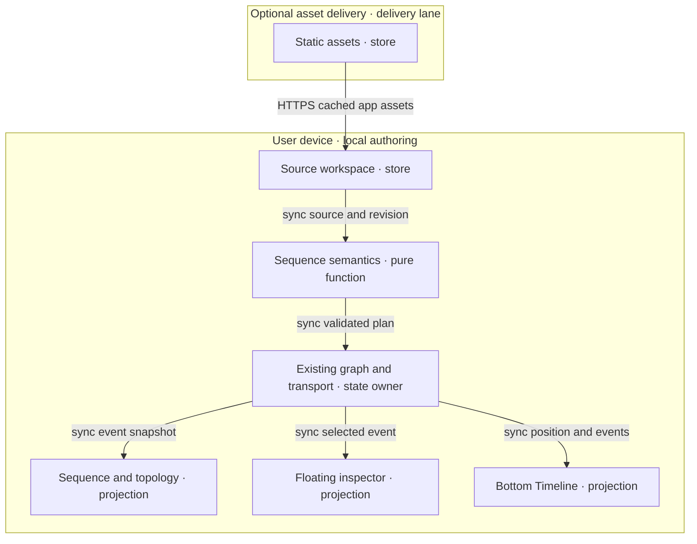

# Sequence views and synchronized flow rehearsal

## Identity, scope and authority

All five roles join **SEQUENCE-FLOW-001@1.3.5**. The user authorized implementation
and live UI verification on 2026-10-02. Work extends the existing workspace through
an admitted successor lane. Remote service invocation, production mirrors, deployment
and payment remain separate effects with no new grant here.
Labelled reference implementation sections bind the portable capability to source.

Context: requested sequence views, inspector and Timeline enhancement. Intent:
inspect source in temporal/topology views without losing the current event.
Directive: implement owner extensions and verify their VCCs. Role: implementation
maintainer. Action/SVO: maintainer / implements / local authored sequence rehearsal.
Outcome: source, fidelity fixture, checks, and explicit remaining integration conditions.

Use native owners and original product UI. The latest explicit user instruction
authorizes the supplied four-participant sequence content in demo.md for fidelity.
No reference-site branding, UI, code, assets, identity, link or hosted service is adopted.
No dependency or provenance is taken from the restricted references.

The implementation sprint estimates four active hours with a four-hour review checkpoint,
120 KiB source delta, 29 changed runtime/test/owner modules, one demo and one planning
update. Every authored module stays below 600 lines; selected lazy chunks must remain
below 500 kB. No new paid service, dependency purchase or model-serving tokens are
permitted. Three refinement rounds bind this slice. External owner/provider waits have
no ETA: resume on native path admission or a changed required-check receipt.
The module cap includes the exhaustive renderer title map and two shared feature modules
for the requested connections projection and presentation state. The 2026-10-02 enhancement
increment binds 40 active minutes, eight changed modules and 60 KiB source changes; no new
dependency is added. Native Sequence Diagram defaults to Connections and offers Lifelines.
BottomPanel Timeline uses the shared ruler, participant clips and numbered event marks;
the inspector and transport context provide aliases, protocol, source line and state.
The missing-menu fix pass binds 30 active minutes, seven wiring modules and 20 KiB changes,
plus this required planning update. Native owner closeout and seven-path readmission passed;
the checked wiring is applied. Live findings required corrections in five already-admitted
feature modules and the existing sequence test, within the original 29-module/120 KiB cap.
The final source handoff pass estimates 15 active minutes with a 25-minute checkpoint,
no runtime expansion, one evidence update ≤20 KiB and no serving tokens/spend.
Native publication committed 829ea93baf2a2e92d1e4800a4adbbabe04225a73, then
refused its stale protected base. A source-preserving merge of protected main produced
e6d027a9a7247d69f6a49818bebb6c41ff5bfce8 with no conflicts. Native readmission
passed at that exact head; that earlier checkpoint preceded remote publication.
The published implementation is PR #1490 at 59189ac76aac7e2c21d680702c4a8f498076be44.
Its Integration Gate failed on the restricted seed inventory. Native successor
`sequence-timeline-consolidation` retains that exact predecessor and admits the user's
duplicate-Timeline removal plus fixture relocation. This increment estimates 35 active
minutes, with a 50-minute checkpoint, seven changed paths and a 24 KiB delta cap; $0,
no added dependency. Required CI and protected integration remain separate effects.
The shared-chrome successor retains PR #1491 at 43e833856ddf4b8c1eb8972b002c54760c5b5cd7.
This pass binds 40 active minutes, 17 paths (ten runtime owners, five existing contracts,
one CI helper and this plan), an 80 KiB patch cap and $0. Contract updates account for
scope growth; existing oversized files have no line growth. No dependency is added.

## PRD

### Customer, pain and smallest outcome

User: developer/facilitator explaining interactions. Buyer hypothesis: team lead
commissioning a reviewed handoff. Beneficiary: reviewer identifying order, async
work and recovery. Economic pain and paid demand are unverified.

The 2026-10-02 request is a feature ticket. The assumed workaround is reading source
alongside topology; its frequency and time cost are unmeasured.

| Pain / priority | Hook → break → fix → close | Evidence and minimum resource/value note |
|---|---|---|
| P1 / first | Open an interaction → no dedicated sequence choice → add two synchronized sequence views → inspect each message in order. | Requested capability supported by the ticket; difficulty and WTP unvalidated. Reuse the source and renderer selection; add only the missing projection. |
| P2 / second | Select a connection → context is dispersed → use the existing floating inspector for ordered steps and details → identify sender, receiver and current event. | FloatingPanel request supported by the ticket; explanatory benefit unvalidated. Extend the panel owner. |
| P3 / third | Rehearse a flow → temporal context is incomplete → enhance the existing bottom Timeline → pause, scrub and return to the same event. | Timeline enhancement supported by the ticket; baseline loss/rework unmeasured. Reuse the playhead and controls. |

Rank P1–P3 provisionally by dependency and proximity to built capability. There is
no evidenced WTP ranking yet. A paid pilot may change that order before code work.

### Journey and user stories

Journey: discover source → choose sequence view → inspect an event → rehearse and
scrub → save source and hand off → reopen. First value is identifying the sender,
receiver and order of one message in a saved interaction.

| Story / stage | User outcome | Priority / pain |
|---|---|---|
| R1 / choose | As a developer, I choose an interactive or notation-backed sequence view from the existing canvas controls to inspect the same source. | Must / P1 |
| R2 / inspect | As a reviewer, I select a numbered message and read its participants, protocol, label and source location in the floating inspector. | Must / P1, P2 |
| R3 / rehearse | As a facilitator, I play, pause, step, reset and scrub a local authored interaction to explain its progress. | Must / P3 |
| R4 / retain | As a developer, I switch views or reopen saved source without changing its messages or duplicating a run. | Must / P1, P3 |
| R5 / recover | As a reviewer, I see precise unsupported-input and stale-source feedback to avoid interpreting an incomplete rehearsal as a valid trace. | Must / P1 |
| R6 / discover | As a local agent caller, I use the existing canvas-view interface to select either sequence view. | Must / P1 |

Should: actor/event filters and explicit branch/bounded-loop inspection. Could:
still/replay export after pilot evidence. Won't: production tracing, service effects,
traffic/network emulation, inferred correctness, remote collaboration, generated
diagrams, billing, unlimited imports or a new shell.

### Acceptance conditions

Each VCC has an end state, check and constraint. Runtime rows remain **unverified** until their complete browser and owner evidence
exists. Focused domain checks are recorded below; Q1–Q9 remain the acceptance obligations. Native starting commands are mapped below.

| VCC / story | Given → when → then; constraint | Stated check / TAD / ADR |
|---|---|---|
| V1 / R1 | Given supported source, when either sequence choice is selected, then its ordered messages match source; native Connections/Lifelines and notation view changes preserve source bytes and shared position. | Q1 renderer/source fixture matrix; C1, C2, C3 / A1 |
| V2 / R2 | Given repeated messages on one connection, when event 3 is selected, then exactly event 3 is current in canvas, inspector and Timeline; connection aggregation does not merge event identity. | Q2 repeated-edge selection cases; C2, C4 / A1, A2 |
| V3 / R3 | Given a finite plan, when playback and scrubbing run, then highlights equal the event state at the shared position, including pause and reset. | Q3 deterministic clock/replay cases; C2, C5 / A2 |
| V4 / R4 | Given running source, when the document changes, then old callbacks cannot alter the new document and playback stops; a view-only change preserves position. | Q4 document/revision race cases; C2, C5, C6 / A2 |
| V5 / R5 | Given malformed, unsupported or oversized input, when parsed, then a source-located diagnostic appears and rehearsal stays disabled; authored bytes remain intact. | Q5 negative grammar/budget cases; C2, C3 / A1 |
| V6 / R1–R4 | Given cached app assets and saved source, when disconnected, then render, inspect, rehearse and reopen work with no network request or model call. | Q6 disconnected browser walkthrough; C3, C4, C5, C6 / A3 |
| V7 / R2–R3 | Given a narrow touch viewport or keyboard-only input, when selecting and scrubbing, then all actions remain reachable and the page has no horizontal overflow. | Q7 390×844 and 1280×800 browser matrix; C3, C4, C5 / A3 |
| V8 / R6 | Given a valid existing canvas-view call, when either new view ID is supplied, then it uses the same selection handler; unknown IDs are rejected. | Q8 browser/tool parity cases; C1, C7 / A3 |
| V9 / R3 | Given simulated failure/recovery events, when played, then every visible outcome is labelled authored rehearsal and no external service action occurs. | Q9 zero-effect and original recovery fixture; C2, C3, C5 / A2 |

### Success metrics and reach

| Metric | Baseline | Target / window | Evidence needed |
|---|---|---|---|
| TTV steps | Unmeasured; discovery estimate 4 | ≤4 manual actions from installed app and saved sample to first identified message | Clean first-run observation; count import/open, view choice, message selection and inspector read |
| TTV elapsed | Unmeasured; estimate 2 minutes | ≤2 minutes in first pilot | Timed Q7 walkthrough |
| Event correspondence | No dedicated sequence proof | 100% fixture correspondence in both sequence views, inspector and Timeline | Q1–Q4 |
| Frame response | Unmeasured | p95 frame work ≤16 ms for 20 participants / 200 events on declared test device | Q3 browser measurement; reduce animation if target fails |
| Offline reach | General cache only; this loop unproved | Q6 passes after verified asset installation | Disconnected reload, persisted readback and zero network log |
| Runtime tokens / spend | Not measured for existing app | 0 model calls, 0 serving tokens, $0 incremental infrastructure | Q6, Q9; no AI in this slice |
| Local / delivered rung | undocumented / undocumented | dev-proven / undocumented after code acceptance | Named evidence; deployment earns a separate rung |
| Integration time, repeated actions, support cost | Unknown | Record before/after for the same pilot journey | Five timed walkthroughs; no savings claim from reuse alone |

Planning-only ROI inputs: impact/reach 1, effort R1/R2/R3 2/1/1, runtime TCO/token
points 0. `(impact × reach)/(build + TCO + token)` gives 0.5/1/1; dependencies keep
R1 first. Revisit inputs after discovery; ordinal estimates prove no economic return.

## TAD

### Capability ownership and data contract

| Component | Single responsibility / origin | Interface / derived VCC |
|---|---|---|
| C1 view selection | Extend the existing renderer registry and its invocation enum. | Existing option → selected surface; V1, V8 |
| C2 sequence semantics | New sequence-specific extension within the existing parser/domain owner; normalize and evaluate authored events. | Source/revision → immutable plan or diagnostics; plan/time → event state; V1–V5, V9 |
| C3 projections | Extend the canvas host with lazy native and notation-backed adapters consuming C2. | Plan/current state → lifelines or topology overlay; V1, V5–V7, V9 |
| C4 inspector | Extend the existing floating-panel router with sequence details. | Plan/event selection → ordered list and source-linked details; V2, V6, V7 |
| C5 Timeline | Extend the bottom Timeline routing and reuse its transport/clock. | Event tracks ↔ shared position/selection; V3, V4, V6, V7, V9 |
| C6 persistence | Reuse the source workspace and settings owners. | Authored source → save/reopen readback; V4, V6 |
| C7 tool adapter | Extend existing view-selection tooling, with no second discovery registry. | Same option input → same C1 handler; V8 |

Proposed C2 contract: a plan has document ID, diagram ID, source revision, participants,
events, branch membership, diagnostics and source lines. Explicit dependency-based
parallel timing remains outside this bounded grammar. Participants
have stable IDs/labels. Events have stable IDs, participant IDs, optional graph edge
ID, order, kind (call/reply/async/note), text/protocol, start/duration and source range.
Protocol labels are descriptive metadata. They never open a socket or invoke a service.

Prefer explicit source IDs; otherwise scope identity by document, diagram and source
range for that revision. Do not key events solely by participant pair, edge ID or
display number. Source edits invalidate affected generated IDs and clear stale selection.
Display numbering is derived from accepted source order; equal-time events use that
order as a tie-breaker. Repeated connections retain every event identity.

Timing is a derived rehearsal projection: integer milliseconds; default duration
1,000 ms per ordered message. Custom timing is not admitted in this increment. A message is
pending before start, active on `[start,end)` and complete at end. Zero-duration
notes are markers, never moving pulses. Empty source has duration 0 and disables Play.
Scrubbing recomputes state from plan and time; it does not replay imperative effects.

Initial grammar: participant/actor declarations and aliases, ordered calls, replies,
asynchronous messages, notes, automatic numbering and explicit activations.
Explicitly chosen nested alternatives are admitted for the fidelity fixture. Every
authored branch stays visible; only the selected outcome contributes playback events.
Do not silently flatten parallel blocks, loops, breaks or unknown directives. Unsupported
constructs produce diagnostics and disable synchronized rehearsal. A later increment adds
dependency-based parallel timing and bounded loop counts; both adapters must agree before that grammar becomes supported.
Ordinary graph connections alone do not establish chronological order. Missing ordering
requires authored metadata and a diagnostic rather than inferred execution semantics.

C2 emits an immutable projection, not a second persisted graph or event database.
Existing graph identity/source ranges are reused where compatible. Canonical source
is always editable through C6; selection/playhead are transient, and persisted view
preferences stay in the existing settings owner. No automatic source rewriting.

### Five flows

| Flow | Trigger / transformation / postcondition | Alternate, failure and boundary |
|---|---|---|
| User journey | Open original interaction → choose view → inspect step → rehearse → save/reopen. | No source: offer native source opening; invalid source: show diagnostic. TTV target is in PRD. |
| Workflow | C1 admits view; C2 validates/normalizes; C3 renders; C4 inspects; C5 plays/scrubs; C6 saves source. | Renderer load failure preserves source; unsupported grammar disables rehearsal; no background retry loop. |
| Data | Source/revision → plan/diagnostics → event state at time → canvas/panel tracks; saved source → local store/readback. | Bound bytes/counts before parsing; stale results dropped by document+revision+request identity. |
| Harness | Deterministic parse → validation → derived state → views. Optional tools call C1 once. | No model harness, model endpoint or agent loop; zero serving tokens. Errors surface at the owner seam. |
| Topology | Device-local source and parser feed projections; one state/transport owner fans out to canvas, inspector and Timeline. | Optional edge delivery serves assets only; rehearsal requires no backend. Source release order is contract → semantics → adapters → affected checks. |

### Reference implementation — exact codebase grounding

Source rows bind to **agentic-graph `40d33424a5a2c76521f011ba578889b9a2470012`**;
agentic-os workflow source: `4530415d3c64609392e6938b1ea01429b30fa536`;
huijoohwee.github.io authoring guideline 3.4.0:
`82835ac37d524643faa6b9703cb077ea9474ab15`. Refresh affected source joins on drift.
These observations prove no runtime/deployment result and change no dependency pin.

| C / source owner and inspected symbol | Confirmed capability / required delta | Existing check starting point |
|---|---|---|
| C1 [config.render.ts](../../canvas/src/lib/config.render.ts), `CANVAS_2D_RENDERERS`; [Canvas2dRendererSelect.tsx](../../canvas/src/components/toolbar/Canvas2dRendererSelect.tsx), `Canvas2dRendererSelect` | Existing renderer choices and hierarchical menu. Add `sequence` / `sequenceMermaid` and lazy surface mapping. | `canvasViewDisplayControls.test.ts`, `canvasViewWebMcpTools.test.ts` |
| C2 [markdownJsonLdMermaidParser.ts](../../canvas/src/features/parsers/markdownJsonLdMermaidParser.ts), `parseMermaidFrontmatter` | Explicitly returns unless kind is flowchart. A sequence event model and projection are confirmed gaps. Extend parser composition, retain flowchart behavior. | `mermaidFrontmatterRender.test.ts`; new sequence cases required |
| C2 [orchestratorTraversal.ts](../../canvas/src/features/panels/utils/orchestratorTraversal.ts), `TraversalSummaryMembership` | Existing edge-step membership can annotate topology. Traversal order is not a distributed event log; do not replace it or infer responses. | `graphTraversalFloatingPanel.test.ts` |
| C3 [CanvasViewport.tsx](../../canvas/src/components/CanvasViewport.tsx), `React.lazy` adapters; [CanvasViewContainer.tsx](../../canvas/src/components/CanvasViewContainer.tsx), `CanvasViewContainer` | Native lazy canvas host and common full/inset sizing. Add two adapters under the same host. | `canvasViewportHeavyRuntimeIntentGate.test.ts` |
| C3 [mermaidRuntime.ts](../../canvas/src/lib/mermaid/mermaidRuntime.ts), `loadMermaidRuntimeApi`, `renderMermaidWithRuntime`; [InteractiveMermaidDiagram.tsx](../../canvas/src/lib/diagram/InteractiveMermaidDiagram.tsx) | Existing dynamic package import, strict default config and generic SVG interaction; sequence-specific event mapping unproved. Reuse pinned package, never a hosted editor/render endpoint. | `mermaidRuntimeCleanupSsot.test.ts`, `mermaidFidelityRuntimeSafe.test.ts` |
| C4 [ToolbarToolMenu.impl.tsx](../../canvas/src/lib/toolbar/ToolbarToolMenu.impl.tsx), lazy diagram panels | Existing FloatingPanel routing, pinning and presentation. Add a lazy sequence view with summary, actor list, step list and current event detail. | `panelSemanticContract.test.ts` |
| C5 [TimelineBottomPanelView.tsx](../../canvas/src/features/gitgraph/TimelineBottomPanelView.tsx), `TimelineBottomPanelView` | Existing Media/XR/learning routing. Add sequence-document routing before unrelated fallback; preserve their owners. | `mermaidGanttPanelRouting.test.ts`; sequence routing cases required |
| C5 [timelineTransport.ts](../../canvas/src/components/timeline/timelineTransport.ts), `useTimelineDocumentTransportController`, `startTimelineTransportPlayback`; [uiSliceInitialState.ts](../../canvas/src/hooks/store/uiSliceInitialState.ts), `setTimelineTransportState` | One document-scoped position, rates and cancellable RAF driver; document change resets state. Extend revision fencing and sequence binding; do not add a second clock. | `timelineTransportResponsiveContract.test.ts`, `timelineTransportEditModeStore.test.ts` |
| C5 [VideoSequenceTimelineRuler.tsx](../../canvas/src/components/timeline/VideoSequenceTimelineRuler.tsx), shared time-axis clips/marks and [SequenceTimelineRuler.tsx](../../canvas/src/features/sequence/SequenceTimelineRuler.tsx) | Existing workflow row, inserted lanes, ruler geometry and scrub owner. Adapt milliseconds to its minute contract; spans remain derived rehearsal intervals, with no persisted media clips or editable duration. | Shared ruler exact-zero, scroll and surface suites; live mark/drag/keyboard checks |
| C6 [MarkdownWorkspaceMain.tsx](../../canvas/src/features/markdown-workspace/main/MarkdownWorkspaceMain.tsx); [vitePwaRuntimeCachePolicy.ts](../../canvas/vitePwaRuntimeCachePolicy.ts) | Existing source workspace and asset cache policy. This new loop's offline closure is unverified. | Q6 planned walkthrough |
| C7 [canvasViewInvocationContract.mjs](../../canvas/src/lib/canvas/canvasViewInvocationContract.mjs), `CANVAS_VIEW_CONTROL_OPTION_IDS`; [canvasViewWebMcpTools.ts](../../canvas/src/features/agent-ready/canvasViewWebMcpTools.ts) | One strict invocation tuple and same control handler; new IDs absent. Extend owner enum and generated schemas. | `canvasViewWebMcpTools.test.ts` |
| Design [panelTypography.ts](../../canvas/src/lib/ui/panelTypography.ts), `usePanelTypography`; [theme-tokens.ts](../../canvas/src/lib/ui/theme-tokens.ts) | Existing settings-derived typography and shared token exports. Consume them for panels, controls, code text and light/dark states; retain central icons. | `theme.test.ts`, `panelSemanticContract.test.ts` |

Exact requested menu labels are **Sequence Diagram** and **Sequence Diagram (Mermaid)**
under **Toolbar → Canvas View Mode → 2D Renderer**. Both read the same normalized
plan. Native lifelines support selection, zoom/pan and playback; the Mermaid adapter
renders the installed package's SVG and maps semantic event IDs independently of
unstable SVG-generated IDs. Topology connections show event numbers and protocol;
a moving marker uses the shared event progress. Parallel/repeated messages cannot
overwrite one another. If reliable SVG-to-event mapping fails, report the unsupported
interaction rather than use approximate label matching as proof.

The enhanced BottomPanel Timeline retains its existing transport chrome, timecode,
rates (0.25/0.5/1/1.5/2), zoom and fit/center actions. Add Previous/Next event,
Reset and numbered message marks in participant clips; actor labels stay readable
while the track viewport scrolls. Remove the separate sequence step rail/card grid.
Outcome choices live in the shared workflow clip. In ordinal mode show Step n/N explicitly; in timed
mode show milliseconds/seconds, never fabricated measured network latency. FPS is
a display sampling setting only if its native owner supports it; event ordering and
duration do not change with display FPS. Generic Media/XR controls keep their semantics.

### Reference implementation — invocation reuse and checks

| Surface | Existing route / proposed extension | Authority and support |
|---|---|---|
| Browser | Existing view selector → `renderer:sequence`, `renderer:sequenceMermaid` | Proposed IDs, local reversible view effect only |
| Command / semantic / binding | `/canvas.view.set #canvas-view @canvas-view option=renderer:sequence` (or `renderer:sequenceMermaid`) | Extend existing tuple; strict enum rejects unknown IDs |
| Tool gateway | `agentic-graph.control_local_canvas_view` / existing browser-local `control_local_canvas_view` builder | Existing owner; new enums proposed, authenticated remote access not established here |
| Headless | C2 pure input → plan/diagnostics/state evaluation | Proposed portable domain export; no browser globals or DOM dependency |
| Timeline tools | No verified sequence play/scrub route found | Won't this increment; do not register speculative tools or claim tool parity for playback |

Q1–Q5, Q8–Q9 need owner-suite behavioral cases. Existing invocable baseline:
`npm --prefix canvas run test:ci:unit -- canvasView timelineTransport mermaid panelSemantic`.
Q6–Q7 need browser identity/screenshots/network logs. Source checks prove no browser
result. Use `npm run ci:affected` for the implementation candidate.

### Topology diagram — reference implementation

**D1** · class: topology · notation: Mermaid flowchart TB · version: 1.3.5.
Primary document surface: existing D3 2D graph canvas; ingest: fenced source below.
Caption: source and pure semantics stay on the user device; the shared state feeds
three projections. Optional delivery serves assets across a closed release boundary.
The diagram describes a proposed extension; it asserts no deployed components.

| Diagram | Target / ingest | Projects | Nodes / edges / clusters | Proof |
|---|---|---|---|---|
| D1@1.3.5 | D3 2D / fenced Mermaid | Intended; parse-only proof pending | Expected 7 / 6 / 2 | Guideline canvas-render checker; actual result recorded below |

Inventory: Source→C6, Parser→C2, State→existing C5 authority, Canvas→C3,
Inspector→C4, Timeline→C5; Assets→existing delivery owner. Feature readiness is
`undocumented` locally and delivered. Acyclic build/release order: C2 contract →
checks → adapters → affected checks → protected integration → authorized delivery.

### Failure, privacy, performance and recovery

Implemented caps: 64 KiB UTF-8 source, 32 participants, 200 events and eight nested
alternative blocks. At one second per message the maximum plan is 200 seconds;
notes have zero duration. Loop and parallel grammar remain unsupported.
Reject over-budget input before rendering; never silently truncate. Lazy adapters
must each remain below 500 kB emitted chunk bytes and files below 600 lines.
Reduce moving markers for reduced-motion preferences; event selection and textual
status remain available. No semantic correctness depends on frame rate.

Exactly one active clock owns a document. Guard parse/render/playback publication by
document ID, source revision and request generation. Abort superseded work; old
callbacks may not publish. View switches share selection/position and cancel the
old surface's animation subscription; document/revision changes pause and revalidate.
At most one automatic retry for transient module loading, none for deterministic parse
errors. Stop after two consecutive same-cause failures and expose the diagnostic.

Treat source labels and generated SVG as untrusted. Keep strict render configuration,
disable executable directives/remote assets and validate event-to-element bindings.
No credentials, remote telemetry, raw trace payloads or service calls are required.
Retain source under the existing workspace policy; derived plans stay in memory and
are discarded on document disposal. Saving/importing remains an explicit native action.
Check application licensing and every asset/dependency license before code adoption.

| Boundary | From → to | Evidence / operator instruction | State / recovery |
|---|---|---|---|
| Source review | Task lane → protected source | Planning PR #1480; implementation PR #1490 at 59189ac76aac7e2c21d680702c4a8f498076be44 failed required CI. Consolidation successor is admitted with local proof below. | Closed until the successor's exact required green check and protected receipt; retain lane |
| Asset mirror | Protected source → generated mirror | Product owner disposition of exact doc paths and build inputs; none yet | Closed; never edit generated output directly |
| Production | Mirror → delivery | Exact-candidate protected environment authorization and live readback; none | Closed; retain prior artifact identity and owner rollback receipt |

Documentation rollback removes this proposal in a successor source change. Runtime
rollback for future implementation restores the prior renderer/menu and lazy artifacts
without deleting authored source. Stored unknown renderer preferences fall back through
the existing resolver; test this before release. No data migration is proposed.

## ADR

### A1 — One semantic plan, two lazy projections

Proposed decision: extend the native parser/domain owner and expose two adapters.
Direct owner reuse wins over an independent sequence editor because source identity,
selection, persistence and renderer discovery already exist. A static-only view is a
FOSS fallback but cannot satisfy V2–V4. A contract-only adapter is warranted only at
the notation/SVG seam; it contains no duplicated parser, store or authority logic.
Extraction into a new shared package waits for two inspected consumers and an actual
portability need. Consequence: a new parser subset and exact SVG event mapping need
behavioral tests. Revisit on unsupported grammar, mapping instability or two consumers.

### A2 — Rehearsal derives from the existing shared time authority

Proposed decision: compute event state from plan/time; reuse the existing transport
and cancellation driver. An independent interval engine loses document fencing and
adds synchronization work. Actual distributed simulation would require new effects,
failure models and provider evidence; it is outside scope. Deterministic local replay
is the FOSS alternative and chosen approach. Consequences: authored timing is visibly
distinct from measured latency; unsupported branch semantics fail loudly. Recovery:
disable the sequence adapter and retain source, transport and existing timelines.
Implemented at 1.3.5: reuse the existing workflow/participant ruler and clip/mark
components; delete the duplicate step rail, card grid and separate scrub slider.
One millisecond-to-minute adapter aligns clips and pointer scrubbing with the shared
rounded display scale. Marks keep exact authored IDs and ordinals. Minimum axis width
keeps 44px targets apart on mobile; horizontal/vertical overflow stays inside Timeline.
Outcome controls occupy the shared workflow clip. No parser, clock, persisted track,
shared ruler variant or source-mutation path is introduced.
Shared chrome now inherits the Main Toolbar compact-surface/control/radius tokens at
its root, including the ruler subtree. XR and sequence use the same time-axis bar and
clip-control strip; feature CSS retains only span geometry and event/mark semantics.
Remove the 1.5× height, XR inset-height/camera flavor, 20px stage selector, 44px desktop
control override and unused two-row XR control CSS. Compact media rules exclude rails. At 1.3.5 one shared surface owns compact clips and time-axis bars; delete tinted compact clip/placeholder/image/regular-FBF flavors, label chips and divergent selected border widths. All ruler headers inherit one control-sized axis height; prevent wrapped scale fields covering the first lane. Lane selection and semantic marks remain data-driven, with no document/path branches. The shared TimelineTransportLane owner now owns the surface, caption and control-strip layout; remove those rules from the media/notation stylesheets. Captions and controls occupy separate flex cells with overflow inside the strip, retaining native selection and mark semantics. Scale fields never shrink into overlapping labels. No document/path branch chooses chrome. The shared playhead marker and line are now named button-backed horizontal sliders above ruler labels, compact controls and lane marks. Existing pointer capture/scrubbing owns drag; keyboard seek delegates to the existing selection/time callback. ARIA values expose seconds, frame-aware arrows and Home/End/Page bounds; no hidden or generic-div playhead decoration remains. One 26-line module replaces the two span affordances without growing the oversized ruler. The scene adapter now uses the same ruler mode and inline progress as sequence. Delete the XR-only responsive stylesheet and hard-coded frame-button sizes; semantic frame controls consume the shared mini-action bar. Responsive wrapping belongs to the shared transport container width, never a document/path or XR-only selector.

### A3 — Device-local core, existing invocation and design owners

Proposed decision: render and rehearse offline after verified installation; extend
the current invocation enum and native typography/tokens. New service/SDK/registry
options fail the zero-spend, duplication and scope constraints. Self-hosted static
assets are a portable FOSS alternative; they add operator work and are not a new
required runtime. Revisit only when measured integration pain justifies an adapter.

| Variant | 12-month incremental infrastructure / egress / serving tokens | Ops and evidence |
|---|---|---|
| Existing installed device runtime, chosen | $0 / $0 / $0 proposed | Local support/time unknown; enforce no backend/model requests |
| Self-hosted static FOSS alternative | Unknown existing electricity/host/egress; no new spend permitted / 0 serving tokens | Higher operator work; requires cost/license proof before selecting |
| Existing optional edge asset delivery | Account/quota eligibility unverified; not selected for this task / 0 serving tokens | Delivery owner's receipts required; free hosting alone does not prove FOSS |

Constraints → Argumentation → Outranking: reject paid or copied/external-runtime
options; compare owner extension, static-only projection and separate local engine.
Owner extension satisfies all target VCCs with the smallest integration delta;
static-only fails interactive conditions; separate engine increases synchronization
risk. This is a provisional source-based choice, not a commercial ranking or runtime
verdict. Missing source or performance evidence leaves the affected decision open.

## MVP

### Smallest slice and demonstration

The dependency-closed slice is R1–R6/V1–V9 through C1–C7 and A1–A3. Use the user-authorized
four-participant fidelity fixture with eight messages, activations and two payment
outcomes in [demo.md](../../canvas/src/features/sequence/fixtures/demo.md). Each selected outcome
contains six one-second playback messages. The focused test suite adds original duplicate,
nested outcome, self-call, note, async and failure/compensation cases. Shared host/store
owners are admitted and both renderers are mounted live. Bounded correspondence,
transport, view preservation, mobile and keyboard observations passed; full VCCs
remain open for disconnected reopen, negative-input UI, source-edit race and performance evidence.

| Beat | Bound | Action / reveal condition |
|---|---|---|
| Hook | 10 s | Open saved fidelity interaction and identify its purpose. |
| Probe | 20 s | Choose native sequence view and select event 3. |
| Reveal | 30 s | V2 holds: the same event is selected in canvas, inspector and Timeline. |
| Rehearse interaction | 40 s | V3/V4: play, pause, scrub and switch the notation view without a second clock. |
| Close | 20 s | V6: reopen saved source while disconnected and retain readable event detail. |

Total demo cap: 120 seconds. Domain object: an authored interaction plan, not a live
distributed system. Local menu, rendering and rehearsal behavior now has live evidence;
full functionality and usefulness remain unassessed, and no contiguous experience level
is claimed. Offline reload and the remaining VCC observations precede full acceptance;
protected source integration, production delivery and paid-pilot observation remain separate.

### One roadmap and bounded tasks

| Phase / outcome | Reuse / minimum delta / owner | Prerequisite / exit | Active bounds / recovery / trigger |
|---|---|---|---|
| S0 documented proposal | Existing workflow and source owners / one document / writer | Ticket + exact source; documentation checks and evidence checkpoint | 30 min, 40 KiB, 1 doc, 24k authoring tokens, $0; retain review lane if publication blocked |
| S1 inspect one interaction | Parser extension + two lazy renderers + inspector / domain and canvas maintainers | Authorized code scope and licensing proof; V1, V2, V5, V8 | Estimate 4 h, 8 h cap, 12 modules, 120 KiB source delta, 30k authoring tokens, 0 serving tokens/$0; 3 refinement passes, stop on no improvement twice |
| S2 rehearse across views | Existing transport/Timeline + revision fencing / Timeline maintainer | S1 accepted; V3, V4, V6, V7, V9 | Estimate 3 h, 6 h cap, 10 modules, 100 KiB delta, 24k authoring tokens, 0 serving tokens/$0; same pass bound; revert adapter on race regression |
| S3 test buyer value | Existing source handoff / five timed pilots / product maintainer | Accepted local demo; GTM experiment and actual-vs-target record | 2 h active cap, 0 runtime modules, 1 evidence update ≤20 KiB, 6k tokens/$0; external buyer response waits for response/recheck at agreed session |

Lazy-load delta is zero for S0; S1–S2 add only selected feature adapters, no new
always-loaded runtime. Gates distinguish documentation completion, local proof,
protected source release, deployment, collected payment and repeat use. Parallel/loop grammar and replay export are Won't this increment; revisit only after
V1–V9 pass and a pilot shows the omitted behavior matters. No second roadmap.

## GTM

Hypothesis H1: a reachable technical team lead values a reviewed reusable interaction
handoff enough to pay $1. The requester exists; a reachable paying prospect is unverified.
Offer: one original source document, both sequence views and a 120-second demonstration.
No bulk market, timing urgency, customer count or market-size number is asserted.

| Stream | Order / reason | Mechanism / demand / collection |
|---|---|---|
| Reviewed interaction handoff to an existing contact | 1; small deliverable using the proposed local loop | Neither mechanism-proven nor demand-validated; no payment evidence |
| Repeated team walkthrough/support | 2; needs repeated accepted outcomes and measured support cost | Unvalidated; no subscription implementation |
| Public self-serve package | 3; needs channel demand, licensed packaging and owner release evidence | Deferred; no audience publication authorized |

Experiment E1, before outreach: register H1, offer/price, five eligible pilot slots,
consent to the timed walkthrough and an acceptance question. Product owner records
completed demonstrations, comprehension errors, time to first value, accepted handoffs,
support minutes, offered-price responses and repeat requests. Continue if at least
3/5 correctly identify event 3 within two minutes and one voluntarily accepts the
priced offer; pivot the offer if clarity improves but nobody accepts; stop expansion
after two five-person cohorts without accepted value. Those are prospective thresholds.
Payment still requires an actual authorized payment route and its receipt; an accepted
offer or synthetic test does not prove a dollar collected. No messaging is authorized here.

Market research remains a gap: reconcile a bottom-up reachable-team count with an
independent sourced segment estimate, geography and acquisition/retention assumptions
before any TAM/SAM/SOM claim or audience projection. Price/channel selection uses the
ADR constraints/argumentation/outranking process; current ranks are provisional because
WTP and reachable buyer evidence are missing.

Economics discovery sketch: serving token COGS target 0; authoring and support time
unmeasured; selected incremental infrastructure spend 0. Per-delivery contribution is
collected price minus permitted transaction fees and observed fulfillment/support cost.
Payment fees, licensed packaging, capacity and legal/entity/IP/data obligations need
source evidence before a transaction. This is not a complete financial model: linked
income/cash/balance statements and reconciled scenarios, capitalization and funding
ask are deferred until a real commercial proposition is validated. No paid tools,
capital expenditure or external provider enrollment is authorized.

## From-0-to-1 coverage and next checks

Join: SEQUENCE-FLOW-001@1.3.5. **0**: requested capabilities plus inspected reusable
owners and unresolved buyer/runtime evidence. **1**: one accepted local interaction
handoff, followed separately by one evidenced $1 collection and repeat-use observation.

| Domain | Decision / source at 1.3.5 | Evidence or gap / accountable owner / next check |
|---|---|---|
| C01 | covered / PRD | Ticket + personas; economic pain unvalidated / product / timed pilot |
| C02 | deferred / GTM | Segment/geography/market sizing absent; requires reachable prospects / product / before audience claim |
| C03 | covered / ADR, GTM | Alternatives and tentative offer; WTP unknown / product / E1 |
| C04 | covered / PRD | Journey, stories, metrics and VCCs; bounded live runtime proof / UX / Q1–Q7 |
| C05 | covered / TAD | Exact owners, five flows and contracts / architecture / owner drift recheck |
| C06 | covered / TAD, ADR | Bounds, threat/failure, cost/license gate; behavior unproved / QA / Q4–Q9 |
| C07 | covered / ADR | Three provisional material decisions / architecture / revise on failed constraints |
| C08 | covered / MVP | Slice, demo and explicit unverified conditions / QA / V1–V9 |
| C09 | covered / GTM | First-dollar order and E1; no acquired/retained buyer / product / five pilots |
| C10 | covered / TAD, GTM | Local delivery/support/incident boundary; capacity unknown / product / measured support time |
| C11 | deferred / GTM | Entity, IP/data/contract/jurisdiction review depends on selected buyer/payment route / product / before sale |
| C12 | deferred / GTM | Incomplete discovery sketch; needs cost/volume/payment drivers / finance / before financial claim |
| C13 | not-applicable / ADR | No funding or spend requested in a documentation task / product reviewer / revisit funding request |
| C14 | covered / evidence and authority | START identity; checks/release receipts pending / writer / scoped checks then source handoff |
| C15 | deferred / GTM | No audience action; deck/plan/model need validated claims and C02/C12 / writer / before audience handoff |
| C16 | covered / MVP, GTM | Stop/pivot/continue thresholds and next action / product / record E1 result in successor |

Dispositioned: **16/16**. Covered applicable: **11/15**; deferred: **4**;
not-applicable: **1**. These are coverage decisions, not readiness proof.

## Evidence, findings and session handoff — reference implementation

Update this checkpoint before publication; later observations need a successor.
The authoring checkpoint below predates implementation. Current bounded source proof
is recorded separately; bounded live verification does not establish every VCC.

| Evidence | Exact check / result / surface |
|---|---|
| E-SOURCE | `git rev-parse HEAD` in admitted Graph lane: `40d33424a5a2c76521f011ba578889b9a2470012`; parser guard, renderer enums and Timeline owners inspected / authoring |
| E-GUIDE | Authoring guideline 3.4.0 at `82835ac37d524643faa6b9703cb077ea9474ab15`; templates, verification, planning, CID and diagram companions loaded by scope / authoring |
| E-START | `npm run release:common -- start sequence-flow-planning --write=docs/documents/agentic-graph-sequence-flow-prd-tad-adr-mvp-gtm.md --plan=docs/documents/agentic-graph-prd-tad-adr-mvp-gtm-architecture.md --checkout-limit=1` returned admitted lane at E-SOURCE / authoring |
| E-LICENSE | Existing lockfile records Mermaid 11.17.0 MIT and D3 7.9.0 ISC. No dependency added; application/assets eligibility still needs implementation preflight / authoring |
| E-DOC | Shared frontmatter parser passed; five joined roles, 19 local targets, 16 unique coverage rows. `node [guideline-source]/scripts/check-diagram-canvas-render.mjs [this-file]` exited 0: D1 has 7 nodes, 6 edges, 2 clusters, no findings / authoring |
| E-OS | `npm run check` at workflow source above exited 0: evaluators plus 4 selected safety suites, 28/28 tests; 231 suites skipped. This bounded OS proof does not establish feature behavior / authoring |
| E-RELEASE | Planning source published in PR #1480 at 79c9add872c02e7f8cc480855946800db4360bdb. Implementation publication, integration and deployment receipts remain absent. |

Implemented locally: bounded sequence parser and graph projection, exact source event IDs,
branch-specific millisecond plan, native Connections/Lifelines SVG, strict installed-package Mermaid adapter,
SVG identity binding, inspector, shared Timeline ruler/clips/marks and single-clock playback adapter.
The demo preserves the authorized source content. New runtime adapters are lazy at their
host boundaries; pure parser code is the small always-load delta required for ingestion.

| Implementation evidence | Result and practical limit |
|---|---|
| I1 domain suite | `TSX_TSCONFIG_PATH=canvas/tsconfig.json node --import tsx --test canvas/src/__tests__/sequenceFlow.test.ts`: 11/11 pass, including fidelity, exact SVG binding, graph round-trip identity, limits, nested branches, millisecond intervals, queued Mermaid cancellation/recovery, stale RAF rejection, note selection, branch/source callback fences and distinct numbered topology connections. |
| I2 native build types | Typecheck passed after wiring and live repairs; final no-emit build exited 0. Existing pinned canvas dependency directories are reused through ignored local links; no package added. After protected-base refresh, `npm --prefix canvas run typecheck` also passed in `/tmp/sequence-refreshed-typecheck.log`. |
| I3 source hygiene | Changed-file hygiene and `git diff --check` pass. The pre-existing 1,823-line routing test was corrected without line growth; every new module is below 600 lines. Log: `/tmp/sequence-wired-hygiene.log`. |
| I4 baseline regression | Canvas View / Timeline / Mermaid / panel selectors: 47/47 pass with dictionary revision e0ef770860905830157e64c455f0a342084b6d25. Corrected one stale assertion to read its extracted icon owner. After protected-base refresh the same 47/47 pass in `/tmp/sequence-refreshed-regressions.log`; bounded local proof, not required candidate CI. |
| I5 native owner handoff | PR #1489 exact head b55cdb1cdd0d72a6141ec05c162ccb93edc4a0e8 passed protected Integration Gate run 36977601824 and merged as 305536912ea5f6995c37396bce65902361b33693. Native complete now records sourceIntegrated=true, canonicalCurrent=true, cleanupSatisfied=true, laneDisposition=quarantined and missionState=source_complete. Exact owner message releases the seven paths. Receipt: `/tmp/autonomous-graph-complete-synced.log`. |
| I6 host admission and wiring | Native readmission at own HEAD 79c9add872c02e7f8cc480855946800db4360bdb passed with writeDigest a545a59dc2b4550610a9680603f3c4ed7b85ba8d2862f71950254720911ae98b. All seven protected input blobs match the retained checked patch, which is now applied (SHA256 db3a80dc11be0eaeb2d12ae71e8151ca4f60e81443f555bbb6bfb0351fc6b4c2). Shared registry, host, invocation/menu and initial UI state expose both choices. |
| I7 live desktop and tools | At 127.0.0.1:5190, both menu entries are visible and both WebMCP option IDs invoke the same host. Native Connections exposes four participants/eight distinct events; Lifelines toggles without seeking. Mermaid binds eight accessible event buttons. Branch and playhead survive native/notation switches. Screenshot: `sequence-menu-fixed.jpg`. |
| I8 synchronized rehearsal | Approved and declined branches each expose six one-second steps; declined retains ordinals 1,2,3,4,7,8. Event 7 activates Payment failed at 4s while 5/6 are skipped. Reset, next, keyboard Enter, End/ArrowLeft seeking, real RAF progression to 6s and paused stability passed. Inspector aliases and absolute Markdown source lines 29/31/33/34/36/37/39/40 are correct. Live findings fixed hidden Timeline header controls and projection controls covered by the floating panel. |
| I9 mobile and reduced motion | 390×844 has document/body width 390 and no page horizontal overflow; header actions are at least 44×44px. Canvas retains internal horizontal pan. Reduced-motion emulation produced zero moving pulses. 1280×800 and keyboard selection/seek passed. Screenshot: `sequence-mobile-live.jpg`; temporary motion/viewport overrides are restored. |
| I10 production build | Build passed in 39.15s; new UI chunks are SequenceInspector 2.74 kB, SequenceTimeline 5.28 kB and SequenceCanvas 14.93 kB. Existing unrelated app chunks exceed 500 kB; no whole-app budget parity is claimed. Log: `/tmp/sequence-wired-build.log`. Working-tree build identifies own base 79c9add; it is not an exact release receipt. |
| I11 offline and remaining matrix | Built preview at 127.0.0.1:5200/agentic-graph/ renders the saved local demo. Disconnected reload failed with ERR_INTERNET_DISCONNECTED; the page reports data-kg-offline-ready=0, so Q6 remains unproved. Browser recovery retained the saved authored demo and eight event buttons. Fresh normal-load diagnostics were empty; changing the hook scope through HMR caused one transient update-depth error that cleared after reload. Source-edit race UI, negative-input UI, unknown-ID rejection UI, 200-event frame measurement and full required candidate CI remain unverified. |
| I12 refreshed source | The unpublished feature commit is retained in merge e6d027a9a7247d69f6a49818bebb6c41ff5bfce8, with protected main 305536912ea5f6995c37396bce65902361b33693 as an ancestor. Native readmission passed at this exact head with the same writeDigest. Fresh live preview at 5190 again shows both menu entries and eight event buttons; selecting native view and Next step synchronizes Create payment request at 1s. Screenshot `sequence-menu-fixed.jpg` was refreshed from this source. |
| I13 validation selection | Native check:plan selected 10 affected partitions (standard prerequisite plus nine extended), no unmatched paths and no broad reason, with a one-hour run budget. This is selection evidence, not passing CI. Log: `/tmp/sequence-validation-plan.log`. |
| I14 consolidation | User requested removal of conflicting/duplicate BottomPanel variants. The separate step rail, card grid and scrub slider are removed. Existing VideoSequenceTimelineRuler, TimeAxisClip/Mark and transport chrome render one workflow span plus four participant lanes. DOM observation: zero old grids/rails, one shared transport. No oversized shared owner was changed. |
| I15 CI repair | PR #1490 Integration Gate run 36982416275 failed because the fidelity demo added an unregistered subdirectory to the strict workspace seed inventory. Move unchanged source to `canvas/src/features/sequence/fixtures/demo.md`; update the test/link and remove the empty old directory. Full seed-authority check passes with pinned dictionary e0ef770860905830157e64c455f0a342084b6d25. `/tmp/sequence-consolidation-seed-authority.log`; required successor CI still pending. |
| I16 affected checks | Domain suite 11/11; three ruler files loaded successfully; their exported assertions were not executed; canvas typecheck passes. Logs: `/tmp/sequence-consolidation-focused.log`, `/tmp/sequence-consolidation-regressions.log`, `/tmp/sequence-consolidation-typecheck-final.log`. Existing owner source is reused without modification. |
| I17 live consolidated Timeline | At 5190, mark 4 seeks Authorization result at 3s; lane drag seeks Payment confirmed at 4.8s; Home/ArrowRight seeks step 2 at 1s. Declined outcome retains 1,2,3,4,7,8; Enter on mark 7 selects Payment failed at 4s. Real RAF reaches 6s and pauses on Ask for another card. Both renderer changes retain paused 3s/approved outcome. Mobile 390×844: body width 390, all five lanes, 44px marks separated by 48.5px, outcome selection and mark 2 click verified. Temporary viewport reset. Screenshots: `/tmp/sequence-consolidated-desktop.jpg`, `/tmp/sequence-consolidated-mobile.jpg`. |
| I18 current build | Build passes in 37.85s. SequenceTimeline 8.01 kB, Inspector 3.03 kB, Canvas 14.93 kB; adapters remain lazy and under 500 kB. Existing unrelated oversized chunks remain. `/tmp/sequence-consolidation-build.log` binds working-tree input over predecessor 59189ac; this is local build proof, not a deployed candidate receipt. |

| I19 shared sizing owners | Shared root tokens reach playback and ruler siblings. Time-axis rails are transparent 61px geometry; bars and workflow/scene clips follow Main Toolbar height/radius. Both feature controls consume one shared strip. Unused XR two-row CSS and camera/sequence chrome variants are removed; runtime timing remains unchanged. Remove the shared ruler minimum height so focus scroll cannot obscure transport controls in a short BottomPanel. |
| I20 actual affected assertions | Native registry runs execute enhanced BottomPanel, video sequence runtime surfaces, XR SHOOT, XR panel and motion-package assertions: 5/5 passed. XR fixture now contains explicit authored metadata with no initial camera marks; source assertions follow the shared owner and PanelSelect contract. Typecheck and changed-file hygiene pass. `/tmp/timeline-shared-chrome-five-tests.log`, `/tmp/timeline-shared-chrome-typecheck-final.log`, `/tmp/timeline-shared-chrome-hygiene.log`. XR package source assertions also follow the existing Media catalog mode owner. |
| I21 playhead live proof | Preview 5190: marker and line expose named slider roles, second-valued bounds and no aria-hidden wrapper. Hit testing returns the marker over ruler ticks and line over WORKFLOW/Customer/Web Shop bars. Both controls seek with keyboard; body drag seeks 2.999s and marker drag 5.309s through the existing transport. At 390×844 the marker target is 44×44px, line target width is 44px, page width stays 390 and foreground hits pass for workflow and three participants. `/tmp/timeline-playhead-desktop.png`, `/tmp/timeline-playhead-mobile.png`. Prior 1.3.3 neutral bar/row and XR checks remain bounded evidence. |
| I22 shared scene/reference follow-up | Live scene and sequence measurements both show 61px lane rows, 38px neutral bars, 28px axis, 183px sidebar and 36px desktop transport. At 390px bars become 54px and axis/frame targets 44px; scene and sequence transport controls remain inside the 390px page. Both use shared progress and ruler mode; available width owns responsive rows. Native previous-frame selection works. Desktop screenshots: `/tmp/timeline-neutral-scene-desktop.png` and `/tmp/timeline-neutral-reference-desktop.png`. Four affected registry checks, follow-up enhanced BottomPanel check, typecheck and changed-file hygiene pass. Stale GitGraph highlight assertion follows its existing shared selected-row owner. |
| I23 retained CI diagnosis | PR #1491 Integration Gate 36985222394 failed in agent-mission browser readiness, not the build. Official failure artifact records a valid native unselected/empty authored workspace rejected by mandatory activePath. The helper now accepts empty roots only after bootstrap, idle seed synchronization and history readiness; selected roots still require their workspace source path. Exact successor 70a51779f mission browser smoke passed locally; its required Integration Gate remains pending. |

Native implementation: [sequenceModel.ts](../../canvas/src/features/sequence/sequenceModel.ts),
[useSequenceDocument.ts](../../canvas/src/features/sequence/useSequenceDocument.ts),
[SequenceCanvas.tsx](../../canvas/src/features/sequence/SequenceCanvas.tsx),
[SequenceInspector.tsx](../../canvas/src/features/sequence/SequenceInspector.tsx), and
[SequenceTimeline.tsx](../../canvas/src/features/sequence/SequenceTimeline.tsx).
A transient branch-choice and explicit marker selection retains no second playhead or persisted graph.
The existing graph store, transport controller and cancellable RAF remain authoritative.
Topology node highlights and moving connection samples derive from that same playhead.
Repeated messages remain separate connections; notes remain selectable markers with no
message arrow. Timeline uses the existing time-axis clips and numbered marks; selected
event context and the inspector show full labels, aliases and source/time/state.
Timeline zoom, fit and center actions reuse the existing transport view owner; colors
consume shared theme tokens. Shared diagram classification and Markdown ingestion now
admit sequence projections, and Mermaid initialize/render operations share one queue.
The always-load parser/projection source delta is approximately 9.3 KiB; UI adapters
remain lazy. The Mermaid adapter honors an authored theme and otherwise follows the
root theme. Superseded queued renders skip work; in-flight results cannot publish.

Remaining: complete the disconnected cached-app reopen condition and the remaining
negative/race/performance VCC observations; publish the admitted shared-chrome successor
against current protected main; pass required candidate CI and protected integration.
Buyers and delivery require their own evidence. Native owner handoff is resolved.
Recheck on a changed cache-ready/provider/source receipt, not an unchanged polling loop.
Rungs remain `undocumented`; bounded live checks do not establish the full runtime rung.

| Finding Type | Severity | Rule anchor | Artifact reference | Evidence excerpt | Remediation |
|---|---|---|---|---|---|
| pain-point-not-validated | major | pain-point-to-feature-mapping#3 | PRD@1.3.5 | "difficulty and WTP unvalidated" | Locally reproducible timed pilot; record supported pain before implementation baseline |
| unimplemented-guideline | major | time-to-value#3 | PRD@1.3.5 | "Clean first-run observation" | Locally reproducible first-run check after S1 |
| market-size-single-method | major | venture-record-pitch-deck-business-plan--financial-model#6 | GTM@1.3.5 | "Market research remains a gap" | Specification change with two sourced sizing methods before audience use |
| scenario-set-incomplete | major | venture-record-pitch-deck-business-plan--financial-model#5 | GTM@1.3.5 | "This is not a complete financial model" | Specification change joining reconciled scenarios and statements before financial claims |

Acceptance gap: disconnected reopen failed; remaining VCC/candidate gates are open.
Shared native path ownership is resolved.
Tracked authoring majors: 4. Full authoring artifact-bearing-rule coverage has not been computed and no full
alignment verdict is claimed. Diagram/canvas-domain checks prove only their selected
structural contract; runtime, licensing, demand and delivery remain separate checks.

Next: publish the timeline-neutral-chrome successor of PR #1498 (7003baf44). Remove the XR-only control stylesheet and bind scene/sequence to shared progress, ruler and responsive transport owners. Four affected timeline checks, canvas typecheck, hygiene and live desktop/mobile geometry checks pass. Cap refreshed to 30 active minutes, ten changed files, 30 KiB patch and $0; no new clock, source-path branch or dependency. Native publication stops at provider handoff; required candidate CI determines integration. Remaining VCC observations stay open.
Recheck every affected receipt on source drift. Preserve lane/source bytes if publication
or lifecycle effects are blocked. Production remains behind its separate protected owner.
