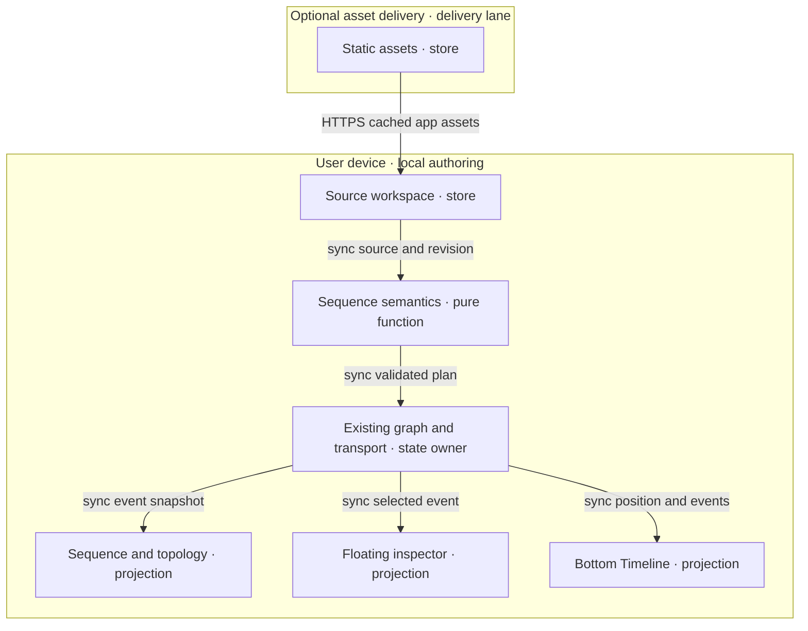

# Sequence views and synchronized flow rehearsal

## Identity, scope and authority

All five roles join **SEQUENCE-FLOW-001@1.3.60**. This closure lane restores seven retained offline owners and reuses shared canvas controls under a native twenty-path reservation, including this plan. The existing PWA registration suppresses automatic update requests on the explicit offline route; immutable revision assets use the existing cache policy. The browser proof consumes three external Markdown inputs and binds source bytes, installation, cache precedence, synchronized event selection, invalid-input recovery and frame measurements to one frozen build. Each validated input retains its bounded bytes privately and supplies a fresh copy to the native file chooser, including recovery; later edits to the external path cannot change the imported content under an earlier digest. Receipts omit the captured buffer. No demo is embedded in the repository.
[PR #1559](https://github.com/huijoohwee/agentic-graph/pull/1559), exact `0f7ac8125af0f4f8945dd08b97b2c3faa02ec9c7`, passed all ten native plans in 352.26 seconds and its required provider Integration Gate on October 5 at 09:39:04 SGT. It integrated as `45a27725a9a5f8ee97b2bc444bfd7194b14b2b82` at 09:39:15 SGT. Native closeout verifies all fourteen changed paths; approved canonical synchronization and lane quarantine completed at 09:54 SGT. Branches, objects and recovery bytes are retained. Source completion is not production delivery.
That protected source includes the original participant/message presentation, panel-aware framing and cached SVG playback from PR #1557; spatial-helper enrollment from PR #1556; parser/materialization guards and IndexedDB enrollment from PR #1558; and bounded mission-readiness diagnostics. Earlier PR #1558 failed its provider mission readiness wait. Preserve that failure: the later green run establishes neither its cause nor a diagnostic runtime fix. Deadlines, retry counts, source authority and error identity remain unchanged.
The shared runtime owner has adopted the protected parser source and received native contract write admission after this lane's predecessor was unmounted. Its first offline document opening now reaches the recorded view; newly observed map-style requests remain its source-owned repair. The seven sequence/PWA restoration paths are disjoint from that work. Prepare them now, then adopt only the exact shared protected revision, enroll the remaining CI changes through native admission and run final combined acceptance. Earlier shared failures remain retained and no failed gate is waived.
The latest browser review requires the sequence views to use the existing full canvas viewport and its Display Controls. The parent CanvasViewContainer remains the sole drawing viewport owner; remove the nested forced inset and header-reserved drawing row. Only the floating controls and alerts reuse the shared inset container to remain reachable around open panels; the SVG and grid stay outside that chrome frame. Grid uses CanvasGridOverlaySurface and the shared schema, including programmatic Fit/reset repaint. The human approved participant arrangement: native connections allow two-dimensional presentation placement; native and notation lifelines preserve authored participant/time order while adjusting horizontal spacing. Snap and Helper Lines reuse gridSnap, alignmentGuides and the shared SVG guide renderer; Aspect consumes resolveCanvasAspectRatioSize for participant cards, including notation actor dimensions. Arrangement remains transient, resets on document/layout/aspect changes or the Reset arrangement control, and never rewrites the source or event IDs. Pointer cancellation, Escape, schema changes and disposal clear previews/guides. Keyboard arrows arrange focused participants; Alt bypasses snapping/guides. Rehearsal pauses during pointer arrangement and recreates geometry bindings afterward so a pulse cannot follow stale geometry.
This visual correction estimates 25 active minutes, capped at 30 active minutes, eight visual source/test modules and 64 KiB added source (refreshed from 48 KiB after the approved arrangement and gesture coverage measured 60,882 added bytes). Together with retained offline preparation and the newly diagnosed source repair, the lane ceiling is twenty-three eventual files and 168 KiB added source; twenty are currently admitted. These feature adapters remain lazy with the existing sequence renderer. No new dependency or always-loaded runtime owner is introduced. Shared protected integration remains an external wait, followed by exact combined acceptance. The earlier inset screenshot and source tests keep their historical limits. The final presentation/interaction family passes 25/25 cases, and the sequence/readiness tests pass 17/17, native registered container/alignment tests pass 5/5, and explicitly invoked shared Grid/Snap exports pass 14/14 (the earlier 21-entry log included four import-only modules); the Canvas typecheck and worktree policy pass. Live browser checks confirm full shared bounds, both renderer controls, retained event IDs, keyboard movement, Aspect and resumed playback. Fresh-profile pointer acceptance remains incomplete: the import notification initially intercepted the target; after waiting for its normal expiry, the existing startup owner reported an async source-read materialization error. Retain that failure and diagnose source authority before claiming desktop/mobile browser acceptance. The shared protected candidate independently reports a source-materialization failure; no retry, timeout or stale-source guard is relaxed by this visual change.

The source follow-up estimates 20 active minutes, capped at 25 active minutes, four source/test paths (including the existing CI suite entry) and 24 KiB added source. The existing startup owners admit at most 4 KiB of additional always-loaded code for source-authority checks; the remaining delta is test-only, with no new runtime module or dependency. A non-pausing fresh-browser diagnostic observes unchanged Explorer selection and the exact same nonempty SourceFiles array while native activation changes the prior document into the requested imported document during passive reading. The existing guard rejects that convergence. The repair reuses the single-retry boundary, verifies fresh persisted bytes against the exact requested Markdown document, discards prepared snapshots, and rechecks document, inventory, preset intent and selection after awaited verification. Verified retries bypass cached passive reads, resolve only the active file and append it while retaining exact inactive records; ambiguous or colliding identities reject before publication. A same-path prior draft, inventory mutation, competing identity, changed/deleted persisted source or second churn remains an error. The deterministic public-owner regression fails on the prior owner. The new focused companion is imported by the existing native convergence suite, so its checks run without a new CI command or shared-contract mutation. The existing convergence entry passes 107/107 tests (82 retained and 25 new); independent review, Canvas typecheck and ownership checks pass. Runtime source adds 2,838 net bytes; the three implementation/test paths add 16,745 bytes, with one additional CI companion-import line. A frozen development diagnostic observes native import completion in 24,698 ms, four participants, eight authored events and no authority-error overlay or guard hit. Its bare dynamic-store snapshot used a different hot-reload module instance and is excluded as application-state evidence. Separate workspace-import-publication and shared-candidate source-settlement failures remain unproven by this diagnosis; retain each failed browser receipt. Final acceptance still requires the frozen combined build.
Final candidate readiness requires the complete evidence matrix below; earlier proof keeps its original limits.

Context: an existing sequence view and shared Timeline shown in the supplied screenshot.
Intent: explain ordered interactions and branch-specific playback using existing owners.
Directive: preserve authored bytes/event identity, bound invalid input and verify the existing runtime.
Role/action/outcome: maintainer / repairs and checks / a reviewable production-readiness candidate.
Browser and build evidence below is bounded; final affected validation and protected release receipts remain separate.
Invocation: `/fix #sequence-runtime-closure @codex-sequence-runtime`.

Use native owners and original product UI. The user-supplied demonstration stays external:
import it through normal workspace controls; do not store its path, source or specimen in
runtime code, fixtures or tests. Independent generic regression cases exercise the contract.
No outside implementation, assets, hosted rendering service or dependency enters this change.

The retained preparation at `e278802a56410eecdb824e0057cc7dffde009df2` preserves the seven offline files. Recovery patch SHA-256 `8974ded31533b3a61ab4f2c00246a27fb17298ed87fb87e6536c9d9d66c8c522` applies cleanly to this protected base, with 60,030 added source bytes. This sprint estimates 20 active minutes and caps restoration/focused checks at 30 active minutes, eleven eventual changed files and 96 KiB added source. Its original admission was eight paths; the shared-canvas correction extends it to sixteen paths and the source follow-up to twenty paths; contract, command-selection expectations and worker-test changes require later native readmission after the shared handoff. The initial restored Python/registration family passes 98/98 focused cases and all three proof scripts pass syntax checking. Independent review identified the path-read/import race: the file-replacement regression fails before the captured-buffer repair and passes afterward, including recovery, stress, invalid input and upload-buffer mutation. The complete Python/registration family then passes 99/99 cases. These preparation checks do not establish combined browser acceptance. Two restored proof modules run only in validation. The existing PWA startup owner adds an offline guard; the existing worker cache policy adds one bounded route. No dependencies, paid service or demo fixtures are added. Preserve enhanced visual and startup owners; the previous twenty-two-file/180 KiB ceiling is historical, not this lane's write grant. Shared integration and provider checks are external waits with status-change rechecks.
Historical shared retention candidate `072614155c522b86cf0205abf33b9c9a4b0e82ac` keeps an explicit root-local import through seed refresh and a page reload. Its native standard plan passes, and a live import/refresh retains three entities, 185 facts and three sources. Its recorded reload reports a distinct `async source read` materialization failure; retain that raw failure and do not repeat the unchanged full-app proof. Contract v86 selects the existing `workspaceFs.indexedDb.` family, covering the current persistence cases and the registered root-local retention case when that shared candidate is adopted. Final readiness requires their combined source and exact-build proof.
Keep files below 600 lines and chunks below 500 kB; load feature UI only on demand.
The demonstration remains external; the browser proof accepts its path explicitly at invocation. External CI/review waits
have no ETA; recheck on a changed exact-candidate status. Publication, integration,
deployment, payment and outreach retain separate authority and evidence boundaries.

## PRD

### Customer, pain and smallest outcome

User: developer/facilitator explaining interactions. Buyer hypothesis: team lead
commissioning a reviewed handoff. Beneficiary: reviewer identifying order, async
work and recovery. Economic pain and paid demand are unverified.

The original feature ticket established the requested capability; the current request is
production runtime readiness. The assumed workaround is reading source alongside topology;
its frequency and time cost remain unmeasured.

| Pain / priority | Hook → break → fix → close | Evidence and minimum resource/value note |
|---|---|---|
| P1 / first | Open an interaction → discover its existing sequence choices → compare Connections/Lifelines and notation → inspect each message in order. | Repair unreadable text, overlapping event targets and bounded-input failures in existing owners; difficulty and WTP remain unvalidated. |
| P2 / second | Select a numbered connection → need exact message context → use the existing sequence inspector → identify sender, receiver and current event. | FloatingPanel request supported by the ticket; explanatory benefit unvalidated. Extend the panel owner. |
| P3 / third | Rehearse a flow → need temporal context → use the existing shared Timeline → pause, scrub and return to the same event. | Timeline enhancement supported by the ticket; baseline loss/rework unmeasured. Reuse the playhead and controls. |

Rank P1–P3 provisionally by buyer pain and proximity to existing capability. The smallest
next solution is the existing-owner repair and external-source walkthrough, then remaining VCC proof. There is no
evidenced WTP ranking; a consented $1 offer can test it before further feature work.

### Journey and user stories

Journey: discover source → choose sequence view → inspect an event → rehearse and
scrub → save source and hand off → reopen. First value is identifying the sender,
receiver and order of one message in a saved interaction.

| Story / stage | User outcome | Priority / pain |
|---|---|---|
| R1 / choose | As a developer, I choose an interactive or notation-backed sequence view from the existing canvas controls to inspect the same source. | Must / P1 |
| R2 / inspect | As a reviewer, I select a numbered message and read its participants, protocol, label and source location in the floating inspector. | Must / P1, P2 |
| R3 / rehearse | As a facilitator, I play, pause, step, reset and scrub a local authored interaction to explain its progress. | Must / P3 |
| R4 / retain | As a developer, I switch views or reopen saved source without changing its messages or duplicating a run. | Must / P1, P3 |
| R5 / recover | As a reviewer, I see precise unsupported-input and stale-source feedback to avoid interpreting an incomplete rehearsal as a valid trace. | Must / P1 |
| R6 / discover | As a local agent caller, I use the existing canvas-view interface to select either sequence view. | Must / P1 |

Should: actor/event filters and explicit branch/bounded-loop inspection. Could:
still/replay export after pilot evidence. Won't: production tracing, service effects,
traffic/network emulation, inferred correctness, remote collaboration, generated
diagrams, billing, unlimited imports or a new shell.

### Acceptance conditions

Each VCC has an end state, check and constraint. Runtime rows remain **unverified** until their complete browser and owner evidence
exists. Focused domain checks are recorded below; Q1–Q9 remain the acceptance obligations. Native starting commands are mapped below.

| VCC / story | Given → when → then; constraint | Stated check / TAD / ADR |
|---|---|---|
| V1 / R1 | Given supported source, when either sequence choice is selected, then its ordered messages match source; native Connections/Lifelines and notation view changes preserve source bytes and shared position. | Q1 renderer/source fixture matrix; C1, C2, C3 / A1 |
| V2 / R2 | Given repeated messages on one connection, when event 3 is selected, then exactly event 3 is current in canvas, inspector and Timeline; connection aggregation does not merge event identity. | Q2 repeated-edge selection cases; C2, C4 / A1, A2 |
| V3 / R3 | Given a finite plan, when playback and scrubbing run, then highlights equal the event state at the shared position, including pause and reset. | Q3 deterministic clock/replay cases; C2, C5 / A2 |
| V4 / R4 | Given running source, when the document changes, then old callbacks cannot alter the new document and playback stops; a view-only change preserves position. | Q4 document/revision race cases; C2, C5, C6 / A2 |
| V5 / R5 | Given malformed, unsupported or oversized input, when parsed, then a source-located diagnostic appears and rehearsal stays disabled; authored bytes remain intact. | Q5 negative grammar/budget cases; C2, C3 / A1 |
| V6 / R1–R4 | Given cached app assets and saved source, when disconnected, then render, inspect, rehearse and reopen work with no network request or model call. | Q6 disconnected browser walkthrough; C3, C4, C5, C6 / A3 |
| V7 / R2–R3 | Given a narrow touch viewport or keyboard-only input, when selecting and scrubbing, then all actions remain reachable and the page has no horizontal overflow. | Q7 390×844 and 1280×800 browser matrix; C3, C4, C5 / A3 |
| V8 / R6 | Given a valid existing canvas-view call, when either new view ID is supplied, then it uses the same selection handler; unknown IDs are rejected. | Q8 browser/tool parity cases; C1, C7 / A3 |
| V9 / R3 | Given simulated failure/recovery events, when played, then every visible outcome is labelled authored rehearsal and no external service action occurs. | Q9 zero-effect and original recovery fixture; C2, C3, C5 / A2 |

### Success metrics and reach

| Metric | Baseline | Target / window | Evidence needed |
|---|---|---|---|
| TTV steps | Unmeasured; discovery estimate 4 | ≤4 manual actions from installed app and saved sample to first identified message | Clean first-run observation; count import/open, view choice, message selection and inspector read |
| TTV elapsed | Unmeasured; estimate 2 minutes | ≤2 minutes in first pilot | Timed Q7 walkthrough |
| Event correspondence | No dedicated sequence proof | 100% fixture correspondence in both sequence views, inspector and Timeline | Q1–Q4 |
| Frame response | Unmeasured | p95 frame work ≤16 ms for 20 participants / 200 events on declared test device | Q3 browser measurement; reduce animation if target fails |
| Offline reach | Verified installation, disconnected reload and branch playback observed; strict zero attempts still blocked | Q6 passes after verified asset installation | Disconnected reload, persisted readback and zero network log |
| Runtime tokens / spend | Not measured for existing app | 0 model calls, 0 serving tokens, $0 incremental infrastructure | Q6, Q9; no AI in this slice |
| Local / delivered rung | undocumented / undocumented | dev-proven / undocumented after code acceptance | Named evidence; deployment earns a separate rung |
| Integration time, repeated actions, support cost | Unknown | Record before/after for the same pilot journey | Five timed walkthroughs; no savings claim from reuse alone |

Planning-only ROI inputs: impact/reach 1, effort R1/R2/R3 2/1/1, runtime TCO/token
points 0. `(impact × reach)/(build + TCO + token)` gives 0.5/1/1; dependencies keep
R1 first. Revisit inputs after discovery; ordinal estimates prove no economic return.

## TAD

### Capability ownership and data contract

| Component | Single responsibility / origin | Interface / derived VCC |
|---|---|---|
| C1 view selection | Extend the existing renderer registry and its invocation enum. | Existing option → selected surface; V1, V8 |
| C2 sequence semantics | Existing sequence-specific domain owner normalizes and evaluates authored events. | Source/revision → immutable plan or diagnostics; plan/time → event state; V1–V5, V9 |
| C3 projections | Extend the canvas host with lazy native and notation-backed adapters consuming C2. | Plan/current state → lifelines or topology overlay; V1, V5–V7, V9 |
| C4 inspector | Extend the existing floating-panel router with sequence details. | Plan/event selection → ordered list and source-linked details; V2, V6, V7 |
| C5 Timeline | Extend the bottom Timeline routing and reuse its transport/clock. | Event tracks ↔ shared position/selection; V3, V4, V6, V7, V9 |
| C6 persistence | Reuse the source workspace and settings owners. | Authored source → save/reopen readback; V4, V6 |
| C7 tool adapter | Extend existing view-selection tooling, with no second discovery registry. | Same option input → same C1 handler; V8 |

Implemented C2 contract, with acceptance constraints below: a plan has document ID, diagram ID, source revision, participants,
events, branch membership, diagnostics and source lines. Explicit dependency-based
parallel timing remains outside this bounded grammar. Participants
have stable IDs/labels. Events have stable IDs, participant IDs, optional graph edge
ID, order, kind (call/reply/async/note), text/protocol, start/duration and source range.
Protocol labels are descriptive metadata. They never open a socket or invoke a service.

Prefer explicit source IDs; otherwise scope identity by document, diagram and source
range for that revision. Do not key events solely by participant pair, edge ID or
display number. Source edits invalidate affected generated IDs and clear stale selection.
Display numbering is derived from accepted source order; equal-time events use that
order as a tie-breaker. Repeated connections retain every event identity.

Timing is a derived rehearsal projection: integer milliseconds; default duration
1,000 ms per ordered message. Custom timing is not admitted in this increment. A message is
pending before start, active on `[start,end)` and complete at end. Zero-duration
notes are markers, never moving pulses. Empty source has duration 0 and disables Play.
Scrubbing recomputes state from plan and time; it does not replay imperative effects.

Initial grammar: participant/actor declarations and aliases, ordered calls, replies,
asynchronous messages, notes, automatic numbering and explicit activations.
Explicitly chosen nested alternatives are admitted by the bounded grammar. Every
authored branch stays visible; only the selected outcome contributes playback events.
Do not silently flatten parallel blocks, loops, breaks or unknown directives. Unsupported
constructs produce diagnostics and disable synchronized rehearsal. A later increment adds
dependency-based parallel timing and bounded loop counts; both adapters must agree before that grammar becomes supported.
Ordinary graph connections alone do not establish chronological order. Missing ordering
requires authored metadata and a diagnostic rather than inferred execution semantics.

C2 emits an immutable projection, not a second persisted graph or event database.
Existing graph identity/source ranges are reused where compatible. Canonical source
is always editable through C6; selection/playhead are transient, and persisted view
preferences stay in the existing settings owner. No automatic source rewriting.

### Five flows

| Flow | Trigger / transformation / postcondition | Alternate, failure and boundary |
|---|---|---|
| User journey | Open original interaction → choose view → inspect step → rehearse → save/reopen. | No source: offer native source opening; invalid source: show diagnostic. TTV target is in PRD. |
| Workflow | C1 admits view; C2 validates/normalizes; C3 renders; C4 inspects; C5 plays/scrubs; C6 saves source. | Renderer load failure preserves source; unsupported grammar disables rehearsal; no background retry loop. |
| Data | Source/revision → plan/diagnostics → event state at time → canvas/panel tracks; saved source → local store/readback. | Bound bytes/counts before parsing; stale results dropped by document+revision+request identity. |
| Harness | Deterministic parse → validation → derived state → views. Optional tools call C1 once. | No model harness, model endpoint or agent loop; zero serving tokens. Errors surface at the owner seam. |
| Topology | Device-local source and parser feed projections; one state/transport owner fans out to canvas, inspector and Timeline. | Optional edge delivery serves assets only; rehearsal requires no backend. Source release order is contract → semantics → adapters → affected checks. |

### Reference implementation — exact codebase grounding

These runtime rows retain their grounding in protected **agentic-graph `f8d448cb7bd8764feb9f8163edf39c49d932701e`**. The current CI contract was inspected at protected `e6c9f1ca73f8f8634ca2979de59bc3a0a7fd33b1`. Both startup producers are integrated; retained offline work and final combined proof remain separately evidenced below.
Prior grounding at `24f0614390affce87268d74e80a93791a73c30ca`, inspected OS checkout `445dedbeb34693fdf5e7f92fb8aed785493096a1`
and recorded OS pin `1d3e803f9c28c33ab41f3bf6755e760426e1c956` are historical identities, not new delivery proof.

| C / source owner and inspected symbol | Confirmed current behavior / remaining condition | Check starting point |
|---|---|---|
| C1 [config.render.ts](../../canvas/src/lib/config.render.ts), `CANVAS_2D_RENDERERS` | `sequence` and `sequenceMermaid` already exist, with the native menu labels below. | `canvasViewDisplayControls.test.ts`, `canvasViewWebMcpTools.test.ts` |
| C2 [sequenceModel.ts](../../canvas/src/features/sequence/sequenceModel.ts), `parseSequence`, `sequencePlaybackEvents`, `sequenceTimedEvents` | Stops allocation at participant/event/branch/activation/depth budgets; diagnostic floods stop with an explicit final diagnostic. Preserves source bytes and disables invalid playback. Source-scoped events, 1,000 ms messages and zero-duration notes remain pure and local. | `sequenceFlow.test.ts`: grammar, allocation limits, branches, time, repeated identity |
| C2 [markdownJsonLdMermaidParser.ts](../../canvas/src/features/parsers/markdownJsonLdMermaidParser.ts), `parseMermaidFrontmatter`; [sequenceGraphProjection.ts](../../canvas/src/features/sequence/sequenceGraphProjection.ts), `projectSequenceGraph` | Sequence dispatch exists before flowchart handling. Each message projects a distinct relation with ordinal, branch, kind, protocol and absolute source line; topology alone never establishes time. | `sequenceFlow.test.ts`: Markdown round trip |
| C3 [CanvasViewport.tsx](../../canvas/src/components/CanvasViewport.tsx), `SequenceCanvasLazy`; [SequenceCanvas.tsx](../../canvas/src/features/sequence/SequenceCanvas.tsx); [sequenceTopologySvg.ts](../../canvas/src/features/sequence/sequenceTopologySvg.ts) | Native targets allocate without badge/participant collisions for repeated, reverse and self messages. Theme ink and notation background preserve text; interactive SVG children stay reachable. Render errors pause playback; event state and reduced-motion pulses reuse one playhead. | `sequenceFlow.test.ts`, `sequenceFlowPresentation.test.tsx`; browser containment and accessibility remain open |
| C3 [sequenceSvgBinding.ts](../../canvas/src/features/sequence/sequenceSvgBinding.ts), `bindSequenceSvg`; [mermaidRuntime.ts](../../canvas/src/lib/mermaid/mermaidRuntime.ts) | Exact-count/occurrence binding fails on mismatch. Notation participant/lifeline highlights bind source IDs and reject unknown IDs, including duplicate aliases. Installed runtime retains strict configuration and queued cancellation. | SVG identity, interactive-child, duplicate-alias and cancellation cases |
| C4 [SequenceInspector.tsx](../../canvas/src/features/sequence/SequenceInspector.tsx), `SequenceInspector` | Existing floating view retains event selection, aliases, protocol and source line; wraps long text, provides 44px controls and exposes neutral verified workspace installation. | Mounted presentation cases plus browser touch/keyboard/save-reopen checks |
| C5 [useSequenceDocument.ts](../../canvas/src/features/sequence/useSequenceDocument.ts) | Adds source identity to callback fencing, including equal-byte document switches. Literal frontmatter uses physical lines; escaped/folded scalars point to their declaration. Multiple blocks diagnose ambiguity; choices/selection stay transient. | Branch/source/identity fences and frontmatter source-line cases |
| C5 [TimelineBottomPanelView.tsx](../../canvas/src/features/gitgraph/TimelineBottomPanelView.tsx), `sequenceContext`; [SequenceTimeline.tsx](../../canvas/src/features/sequence/SequenceTimeline.tsx); [SequenceTimelineRuler.tsx](../../canvas/src/features/sequence/SequenceTimelineRuler.tsx) | Sequence routing is mounted. Existing transport/ruler/clip/mark owners provide pause/play, seek, reset, step, rate, zoom, fit and outcome selection. Milliseconds adapt to the ruler's minute contract; source duration is not editable. | `sequenceFlow.test.ts`, shared transport/ruler suites; native gestures separately |
| C6 [MarkdownWorkspaceMain.tsx](../../canvas/src/features/markdown-workspace/main/MarkdownWorkspaceMain.tsx); [LearningOfflineControls.tsx](../../canvas/src/features/python-learning/LearningOfflineControls.tsx); [vitePythonLearningOffline.mjs](../../canvas/vitePythonLearningOffline.mjs) | `purpose="workspace"` reuses verified `studio-offline` generic-shell installation, recovery and revision readback. Synchronous pending guard prevents duplicate operations. Source remains in existing IndexedDB workspace; install/save/reopen are distinct checks. | Q6 installed disconnected save/reopen; existing offline owner tests |
| C7 [canvasViewInvocationContract.mjs](../../canvas/src/lib/canvas/canvasViewInvocationContract.mjs), `CANVAS_VIEW_CONTROL_OPTION_IDS`; [canvasViewWebMcpTools.ts](../../canvas/src/features/agent-ready/canvasViewWebMcpTools.ts) | Both renderer IDs already use the existing browser-local canvas-view route. No additional discovery registry or sequence playback tool is introduced. | `canvasViewWebMcpTools.test.ts`; Q8 current browser/tool parity |
| Design [panelTypography.ts](../../canvas/src/lib/ui/panelTypography.ts), `usePanelTypography`; [theme-tokens.ts](../../canvas/src/lib/ui/theme-tokens.ts) | Existing panel and transport owners supply typography, shared controls and tokens. Retain mobile containment and keyboard/reduced-motion acceptance. | Q7; shared panel/transport checks |

Exact requested menu labels are **Sequence Diagram** and **Sequence Diagram (Mermaid)**
under **Toolbar → Canvas View Mode → 2D Renderer**. Both read the same normalized
plan. Native lifelines support selection, zoom/pan and playback; the Mermaid adapter
renders the installed package's SVG and maps semantic event IDs independently of
unstable SVG-generated IDs. Topology connections show event numbers and protocol;
a moving marker uses the shared event progress. Parallel/repeated messages cannot
overwrite one another. If reliable SVG-to-event mapping fails, report the unsupported
interaction rather than use approximate label matching as proof.

The enhanced BottomPanel Timeline retains its existing transport chrome, timecode,
rates (0.25/0.5/1/1.5/2), zoom and fit/center actions. Existing Previous/Next event,
Reset and numbered message marks appear in participant clips; actor labels stay readable
while the track viewport scrolls. The separate sequence step rail/card grid has been removed.
Outcome choices live in the shared workflow clip. In ordinal mode show Step n/N explicitly; in timed
mode show milliseconds/seconds, never fabricated measured network latency. FPS is
a display sampling setting only if its native owner supports it; event ordering and
duration do not change with display FPS. Generic Media/XR controls keep their semantics.

### Reference implementation — invocation reuse and checks

| Surface | Current route / support | Authority and support |
|---|---|---|
| Browser | Existing view selector → `renderer:sequence`, `renderer:sequenceMermaid` | Implemented IDs; local reversible view effect only |
| Command / semantic / binding | `/canvas.view.set #canvas-view @canvas-view option=renderer:sequence` (or `renderer:sequenceMermaid`) | Existing tuple; strict enum rejects unknown IDs |
| Tool gateway | `agentic-graph.control_local_canvas_view` / existing browser-local `control_local_canvas_view` builder | Existing owner and enums; authenticated remote access not established here |
| Headless | C2 pure input → plan/diagnostics/state evaluation | Existing pure TypeScript module; no published SDK/remote MCP execution contract |
| Timeline tools | No verified sequence play/scrub route found | Won't this increment; do not register speculative tools or claim tool parity for playback |

Focused sequence behavioral cases exist; complete Q1–Q9 acceptance still needs bound
owner/browser evidence. Existing invocable baseline:
`npm --prefix canvas run test:ci:unit -- canvasView timelineTransport mermaid panelSemantic`.
Q6–Q7 observations below include browser identity and limitations; source checks alone prove no browser
result. Use `npm run ci:affected` for the implementation candidate.

### Topology diagram — reference implementation

**D1** · class: topology · notation: Mermaid flowchart TB · version: 1.3.6.
Primary document surface: existing D3 2D graph canvas; ingest: fenced source below.
Caption: source and pure semantics stay on the user device; the shared state feeds
three projections. Optional delivery serves assets across a closed release boundary.
The diagram describes a proposed extension; it asserts no deployed components.

| Diagram | Target / ingest | Projects | Nodes / edges / clusters | Proof |
|---|---|---|---|---|
| D1@1.3.7 | D3 2D / fenced Mermaid | Intended; parse-only proof pending | Expected 7 / 6 / 2 | Guideline canvas-render checker; actual result recorded below |

Inventory: Source→C6, Parser→C2, State→existing C5 authority, Canvas→C3,
Inspector→C4, Timeline→C5; Assets→existing delivery owner. Feature readiness is
`undocumented` locally and delivered. Acyclic build/release order: C2 contract →
checks → adapters → affected checks → protected integration → authorized delivery.

### Failure, privacy, performance and recovery

Implemented caps: 64 KiB UTF-8 source, 32 participants, 200 events, 200 branches, 200 activation starts,
eight nested alternatives and 32 diagnostics. Budget failure stops parsing with a source-located error,
retains authored bytes and disables playback. Plans last at most 200 seconds; notes take zero time. Loops/parallel remain unsupported.
Reject over-budget input before rendering; never silently truncate. Lazy adapters
must each remain below 500 kB emitted chunk bytes and files below 600 lines.
Reduce moving markers for reduced-motion preferences; event selection and textual
status remain available. No semantic correctness depends on frame rate.

Verified routes suppress automatic grammar, published-source fallback and service-worker registration/update.
Immutable revision assets use the existing verified cache reader through CacheFirst; corruption fails closed.
The complete browser collector distinguishes page responses from service-worker network fetches, online versus disconnected phases and deliberate corruption. The published shared host-copy repair and strict bundle repair require native handoff before final zero-request and whole-app budget acceptance.

Exactly one active clock owns a document. Guard parse/render/playback publication by
document ID, source revision and request generation. Abort superseded work; old
callbacks may not publish. View switches share selection/position and cancel the
old surface's animation subscription; document/revision changes pause and revalidate.
At most one automatic retry for transient module loading, none for deterministic parse
errors. Stop after two consecutive same-cause failures and expose the diagnostic.

Treat source labels and generated SVG as untrusted. Keep strict render configuration,
disable executable directives/remote assets and validate event-to-element bindings.
No credentials, remote telemetry, raw trace payloads or service calls are required.
Retain source under the existing workspace policy; derived plans stay in memory and
are discarded on document disposal. Saving/importing remains an explicit native action.
Check application licensing and every asset/dependency license before code adoption.

| Boundary | From → to | Evidence / operator instruction | State / recovery |
|---|---|---|---|
| Source review | Task lane → protected source | Current implementation lane starts at the reviewed base above; predecessor PR/check entries below are historical. | Publish only after current affected checks; exact protected integration remains separate |
| Asset mirror | Protected source → generated mirror | Product owner disposition of exact doc paths and build inputs; none yet | Closed; never edit generated output directly |
| Production | Mirror → delivery | Exact-candidate protected environment authorization and live readback; none | Closed; retain prior artifact identity and owner rollback receipt |

Rollback uses a reviewed successor restoring prior runtime behavior without deleting
authored source or restoring the prohibited repository demonstration. Stored unknown renderer
preferences fall back through the existing resolver; test this before release. No data migration is proposed.

## ADR

### A1 — One semantic plan, two lazy projections

Implemented decision: reuse the native parser/domain owner and two lazy projections.
Direct owner reuse wins over an independent sequence editor because source identity,
selection, persistence and renderer discovery already exist. A static-only view is a
FOSS fallback but cannot satisfy V2–V4. A contract-only adapter is warranted only at
the notation/SVG seam; it contains no duplicated parser, store or authority logic.
Extraction into a new shared package waits for two inspected consumers and an actual
portability need. Consequence: the bounded parser subset and exact SVG event mapping need
behavioral tests. Revisit on unsupported grammar, mapping instability or two consumers.
At 1.3.43, fix parser allocation, source identity/scalar locations and native target allocation
at these existing owners. Preserve current-participant IDs and accessible SVG descendants;
independent generic tests replace the external demonstration dependency.

### A2 — Rehearsal derives from the existing shared time authority

Implemented decision: compute event state from plan/time; reuse the existing transport
and cancellation driver. An independent interval engine loses document fencing and
adds synchronization work. Actual distributed simulation would require new effects,
failure models and provider evidence; it is outside scope. Deterministic local replay
is the FOSS alternative and chosen approach. Consequences: authored timing is visibly
distinct from measured latency; unsupported branch semantics fail loudly. Recovery:
disable the sequence adapter and retain source, transport and existing timelines.
Implemented at 1.3.10: TimelineTransportLane owns every authored mark: 44px hit target, 24px circle, inherited font, accent selection, visible focus and no decorative shadow. Remove duplicate sequence and XR mark geometry, heavy XR numerals and per-track/beat inline color variants; retain time positions and scrub/retime behavior. Shared pointer handling chooses the nearest sibling mark when hit areas overlap; keyboard activation stays on the focused mark. Shared bar captions use full text opacity for legibility. A stale responsive-menu assertion stops expecting a removed FloatingPanel dropdown. Prior 1.3.9: MainPanel, FloatingPanel and BottomPanel reuse PanelViewTabs/PanelViewTab for one contained rail, selected styling, named icon/button semantics and control-height targets, with no document or renderer input. Remove the unused MainPanel text-tab variant and duplicated FloatingPanel/BottomPanel controls; missing MainPanel icon metadata fails loudly. Selecting a minimized MainPanel tab restores its body. FloatingPanel warehouse composition now consumes the shared capability hook, with a semantic section scroll wrapper. One small shared module replaces more tab code than it adds; selected feature bodies stay lazy and all existing lane/bar owners remain unchanged. Prior 1.3.8: FloatingPanel has one static 27-view registry and one expanded/minimized header, reusing IconButton, icon metadata, typography and control-height tokens. Remove the separate Graph Traversal overflow button and hidden/disabled tab-spec fields. Named button/icon semantics expose selection; contained scrolling reveals the selected view. XR routing retains its shared capability owner while shell selection always commits; choosing any tab restores the body. No source/path or feature payload can choose a tab variant. Prior 1.3.7: one neutral BottomPanel tab strip stays available for every source; Storyboard selection keeps the panel open. Storyboard, Design and warehouse project through existing transport/ruler/bar owners; shared read-only commands prevent generated projections from mutating Markdown. XR selection retains Timeline and uses the existing Media inspector for object details. Desktop tab shapes reuse toolbar controls; mobile targets follow the shared control-height token and scroll inside the shell. No paid service, dependency or source-path dispatch is added. Prior 1.3.6: shared chrome binds usePanelTypography for every host. Lane descendants inherit common font and uppercase treatment; clip-control outputs inherit neutral caption typography. Remove XR label sizes, colored/heavy captions and duplicate sequence wrapper binding. No file/path branch owns typography. Reuse the existing workflow/participant ruler and clip/mark
components; delete the duplicate step rail, card grid and separate scrub slider.
One millisecond-to-minute adapter aligns clips and pointer scrubbing with the shared
rounded display scale. Marks keep exact authored IDs and ordinals. Minimum axis width
keeps 44px targets apart on mobile; horizontal/vertical overflow stays inside Timeline.
Outcome controls occupy the shared workflow clip. No parser, clock, persisted track,
shared ruler variant or source-mutation path is introduced.
Shared chrome now inherits the Main Toolbar compact-surface/control/radius tokens at
its root, including the ruler subtree. XR and sequence use the same time-axis bar and
clip-control strip; feature CSS retains only span geometry and event/mark semantics.
Remove the 1.5× height, XR inset-height/camera flavor, 20px stage selector, 44px desktop
control override and unused two-row XR control CSS. Compact media rules exclude rails. At 1.3.5 one shared surface owns compact clips and time-axis bars; delete tinted compact clip/placeholder/image/regular-FBF flavors, label chips and divergent selected border widths. All ruler headers inherit one control-sized axis height; prevent wrapped scale fields covering the first lane. Lane selection and semantic marks remain data-driven, with no document/path branches. The shared TimelineTransportLane owner now owns the surface, caption and control-strip layout; remove those rules from the media/notation stylesheets. Captions and controls occupy separate flex cells with overflow inside the strip, retaining native selection and mark semantics. Scale fields never shrink into overlapping labels. No document/path branch chooses chrome. The shared playhead marker and line are now named button-backed horizontal sliders above ruler labels, compact controls and lane marks. Existing pointer capture/scrubbing owns drag; keyboard seek delegates to the existing selection/time callback. ARIA values expose seconds, frame-aware arrows and Home/End/Page bounds; no hidden or generic-div playhead decoration remains. One 26-line module replaces the two span affordances without growing the oversized ruler. The scene adapter now uses the same ruler mode and inline progress as sequence. Delete the XR-only responsive stylesheet and hard-coded frame-button sizes; semantic frame controls consume the shared mini-action bar. Responsive wrapping belongs to the shared transport container width, never a document/path or XR-only selector.

### A3 — Device-local core, existing invocation and design owners

Implemented architecture: use the local domain, existing invocation enum and native
typography/tokens. Sequence exposes the existing verified generic workspace installer and `studio-offline`
route with neutral copy; no second cache, manifest, route or service worker. Offline render/rehearsal
and strict zero attempted requests remain acceptance targets. New service/SDK/registry
options fail the zero-spend, duplication and scope constraints. Self-hosted static
assets are a portable FOSS alternative; they add operator work and are not a new
required runtime. Revisit only when measured integration pain justifies an adapter.

| Variant | 12-month incremental infrastructure / egress / serving tokens | Ops and evidence |
|---|---|---|
| Existing installed device runtime, chosen | $0 / $0 / $0 proposed | Local support/time unknown; enforce no backend/model requests |
| Self-hosted static FOSS alternative | Unknown existing electricity/host/egress; no new spend permitted / 0 serving tokens | Higher operator work; requires cost/license proof before selecting |
| Existing optional edge asset delivery | Account/quota eligibility unverified; not selected for this task / 0 serving tokens | Delivery owner's receipts required; free hosting alone does not prove FOSS |

Constraints → Argumentation → Outranking: reject paid or copied/external-runtime
options; compare owner extension, static-only projection and separate local engine.
Owner extension satisfies all target VCCs with the smallest integration delta;
static-only fails interactive conditions; separate engine increases synchronization
risk. This is a provisional source-based choice, not a commercial ranking or runtime
verdict. Missing source or performance evidence leaves the affected decision open.

## MVP

### Smallest slice and demonstration

The dependency-closed slice remains R1–R6/V1–V9 through C1–C7 and A1–A3. Import the
user-supplied external demonstration through normal file controls, retaining its exact
bytes outside the repository. The screenshot is context, not current acceptance. Generic
authored tests cover alternatives, duplicates, self-calls, notes, async, failure/recovery,
budget floods, identity switches, scalar lines, target collisions and accessible projections.
The protected predecessor passed 14 domain/hook cases and seven presentation cases. Current
build, browser and affected validation are underway; inherited live observations do not
prove the repaired candidate. Disconnected reopen, strict zero requests, negative-input UI,
race, mobile/keyboard and performance obligations require exact-candidate receipts.

| Beat | Bound | Action / reveal condition |
|---|---|---|
| Hook | 10 s | Open the external authored interaction through normal workspace controls and identify its purpose. |
| Probe | 20 s | Choose native sequence view and select event 3. |
| Reveal | 30 s | V2 holds: the same event is selected in canvas, inspector and Timeline. |
| Rehearse interaction | 40 s | V3/V4: play, pause, scrub and switch the notation view without a second clock. |
| Close | 20 s | Save/reopen source and report observed result. Run Q6 separately after verified offline installation; record failure without calling the demo offline-proven. |

Total demo cap: 120 seconds. Domain object: an authored interaction plan, not a live
distributed system. Historical local rendering/rehearsal evidence remains bounded;
current full functionality and usefulness are unassessed, with no contiguous experience level
claimed. Offline reload and the remaining VCC observations precede full acceptance;
protected source integration, production delivery and paid-pilot observation remain separate.

### One roadmap and bounded tasks

| Phase / outcome | Reuse / minimum delta / owner | Prerequisite / exit | Active bounds / recovery / trigger |
|---|---|---|---|
| S0 documented proposal | Existing workflow and source owners / one document / writer | Ticket + exact source; documentation checks and evidence checkpoint | 30 min, 40 KiB, 1 doc, 24k authoring tokens, $0; retain review lane if publication blocked |
| S1 inspect one interaction | Parser extension + two lazy renderers + inspector / domain and canvas maintainers | Authorized code scope and licensing proof; V1, V2, V5, V8 | Estimate 4 h, 8 h cap, 12 modules, 120 KiB source delta, 30k authoring tokens, 0 serving tokens/$0; 3 refinement passes, stop on no improvement twice |
| S2 rehearse across views | Existing transport/Timeline + revision fencing / Timeline maintainer | S1 accepted; V3, V4, V6, V7, V9 | Estimate 3 h, 6 h cap, 10 modules, 100 KiB delta, 24k authoring tokens, 0 serving tokens/$0; same pass bound; revert adapter on race regression |
| S3 test buyer value | Existing source handoff / five timed pilots / product maintainer | Accepted local demo; GTM experiment and actual-vs-target record | 2 h active cap, 0 runtime modules, 1 evidence update ≤20 KiB, 6k tokens/$0; external buyer response waits for response/recheck at agreed session |

Lazy-load delta is zero for S0; S1–S2 add only selected feature adapters, no new
always-loaded runtime. Gates distinguish documentation completion, local proof,
protected source release, deployment, collected payment and repeat use. Parallel/loop grammar and replay export are Won't this increment; revisit only after
V1–V9 pass and a pilot shows the omitted behavior matters. No second roadmap.

## GTM

Current 1.3.60 restores offline recovery on the protected visual/parser source. The predecessor is source-complete with approved local synchronization and quarantine; this lane still requires shared protected adoption and final combined acceptance. Complete Q1–Q9 and exact build/release evidence before
offering production readiness; focused passes and offline controls do not prove installation, delivery, buyer value or revenue.

Hypothesis H1: a reachable technical team lead values a reviewed reusable interaction
handoff enough to pay $1. The requester exists; a reachable paying prospect is unverified.
Offer: one original source document, both sequence views and a 120-second demonstration.
No bulk market, timing urgency, customer count or market-size number is asserted.

| Stream | Order / reason | Mechanism / demand / collection |
|---|---|---|
| Reviewed interaction handoff to an existing contact | 1; small deliverable using the existing local loop | Neither mechanism-proven nor demand-validated; no payment evidence |
| Repeated team walkthrough/support | 2; needs repeated accepted outcomes and measured support cost | Unvalidated; no subscription implementation |
| Public self-serve package | 3; needs channel demand, licensed packaging and owner release evidence | Deferred; no audience publication authorized |

Experiment E1, before outreach: register H1, offer/price, five eligible pilot slots,
consent to the timed walkthrough and an acceptance question. Product owner records
completed demonstrations, comprehension errors, time to first value, accepted handoffs,
support minutes, offered-price responses and repeat requests. Continue if at least
3/5 correctly identify event 3 within two minutes and one voluntarily accepts the
priced offer; pivot the offer if clarity improves but nobody accepts; stop expansion
after two five-person cohorts without accepted value. Those are prospective thresholds.
Payment still requires an actual authorized payment route and its receipt; an accepted
offer or synthetic test does not prove a dollar collected. No messaging is authorized here.

Market research remains a gap: reconcile a bottom-up reachable-team count with an
independent sourced segment estimate, geography and acquisition/retention assumptions
before any TAM/SAM/SOM claim or audience projection. Price/channel selection uses the
ADR constraints/argumentation/outranking process; current ranks are provisional because
WTP and reachable buyer evidence are missing.

Economics discovery sketch: serving token COGS target 0; authoring and support time
unmeasured; selected incremental infrastructure spend 0. Per-delivery contribution is
collected price minus permitted transaction fees and observed fulfillment/support cost.
Payment fees, licensed packaging, capacity and legal/entity/IP/data obligations need
source evidence before a transaction. This is not a complete financial model: linked
income/cash/balance statements and reconciled scenarios, capitalization and funding
ask are deferred until a real commercial proposition is validated. No paid tools,
capital expenditure or external provider enrollment is authorized.

## From-0-to-1 coverage and next checks

Join: SEQUENCE-FLOW-001@1.3.60. **0**: requested capabilities plus inspected reusable
owners and unresolved buyer/runtime evidence. **1**: one accepted local interaction
handoff, followed separately by one evidenced $1 collection and repeat-use observation.

| Domain | Decision / source at 1.3.6 | Evidence or gap / accountable owner / next check |
|---|---|---|
| C01 | covered / PRD | Ticket + personas; economic pain unvalidated / product / timed pilot |
| C02 | deferred / GTM | Segment/geography/market sizing absent; requires reachable prospects / product / before audience claim |
| C03 | covered / ADR, GTM | Alternatives and tentative offer; WTP unknown / product / E1 |
| C04 | covered / PRD | Journey, stories, metrics and VCCs; bounded live runtime proof / UX / Q1–Q7 |
| C05 | covered / TAD | Exact owners, five flows and contracts / architecture / owner drift recheck |
| C06 | covered / TAD, ADR | Bounds, threat/failure, cost/license gate; behavior unproved / QA / Q4–Q9 |
| C07 | covered / ADR | Three provisional material decisions / architecture / revise on failed constraints |
| C08 | covered / MVP | Slice, demo and explicit unverified conditions / QA / V1–V9 |
| C09 | covered / GTM | First-dollar order and E1; no acquired/retained buyer / product / five pilots |
| C10 | covered / TAD, GTM | Local delivery/support/incident boundary; capacity unknown / product / measured support time |
| C11 | deferred / GTM | Entity, IP/data/contract/jurisdiction review depends on selected buyer/payment route / product / before sale |
| C12 | deferred / GTM | Incomplete discovery sketch; needs cost/volume/payment drivers / finance / before financial claim |
| C13 | not-applicable / ADR | No funding or spend requested in this implementation task / product reviewer / revisit funding request |
| C14 | covered / evidence and authority | START identity; checks/release receipts pending / writer / scoped checks then source handoff |
| C15 | deferred / GTM | No audience action; deck/plan/model need validated claims and C02/C12 / writer / before audience handoff |
| C16 | covered / MVP, GTM | Stop/pivot/continue thresholds and next action / product / record E1 result in successor |

Dispositioned: **16/16**. Covered applicable: **11/15**; deferred: **4**;
not-applicable: **1**. These are coverage decisions, not readiness proof.

## Evidence and readiness handoff

The startup producer [PR #1549](https://github.com/huijoohwee/agentic-graph/pull/1549), head
`f923c924ad8c13a0b112577a00db14fcb2c33c97`, passed all 10 native validation partitions and the
provider Integration Gate. Human-enabled auto-merge integrated it at 2026-10-04 13:13:58 UTC as
`f8d448cb7bd8764feb9f8163edf39c49d932701e`. Native closeout confirms exact 21-path source
integration. The later PR #1559 lane has approved canonical synchronization and quarantine receipts; those receipts do not retire every predecessor. Combined runtime acceptance and production activation remain separate incomplete effects.
The offline successor preserves that published candidate and its protected ancestry. Earlier checkpoints remain in the
[immutable producer document](https://github.com/huijoohwee/agentic-graph/blob/f923c924ad8c13a0b112577a00db14fcb2c33c97/docs/documents/agentic-graph-sequence-flow-prd-tad-adr-mvp-gtm.md#evidence-and-readiness-handoff).

| Current evidence | Result and practical limit |
|---|---|
| Startup selection | Existing bootstrap coordinator retries only proven path supersession with fresh source/index snapshots; unsaved or filesystem-stale bytes and genuine failures still reject. Empty initial document identity is not an unsaved edit. Six focused cases pass after baseline failures. |
| Cancellation | Existing mount controller supplies its signal; cancellation fences preparation, reads, retries and result publication. It preserves the exact abort reason. This is not cancellation of already-started inner operations. |
| Responsibility and size | Existing persistence/bootstrap owner is extracted into typed, acyclic workspace, cloud and polling hooks. The caller is 552 lines; hooks are 458/368/174 and shared types 95. AST review preserves callback bodies and effect order; all currently modified files are below 600 lines. |
| Passive graph intent | For ordinary Markdown, cold and cached passive hydration preserve the current graph; explicit activation afterward applies the selected document. Source guards remain enforced. The combined closure group passes 42/42, with six materialization/ingest checks and one storage source check also passing; final typecheck succeeds. Retained agent-graph manifest restoration is a separate pre-existing document contract, outside this ordinary-Markdown guarantee. |
| Retained offline owners | Preserved in complete candidate `e278802a56410eecdb824e0057cc7dffde009df2`, with restoration provenance `2fa04682facea268428d7029ba18df7192f5339b`; restored as disjoint preparation in this lane; final build acceptance waits for the shared protected dependency. Originally recovered from commit `cb83723f2dcfb5c61213af511eb941d8a2ca50f9`: actual Workbox cache strategy and production PWA boot regressions failed before repair and pass afterward: 20/20 focused tests. Verified or damaged installed members initiate no fetch; ordinary online misses still fetch. |
| Prior offline diagnostic | Verified installation completed in 4,890 ms. The explicit offline route with connectivity available observed 463 page requests: 462 service-worker responses, zero worker fetches and one uncached host-mirror POST. The strict assertion correctly fails; this is not final offline acceptance. |
| Shared-file handoff | The shared owner retains production/disconnected mirror suppression, acknowledgement-only digest caching and bounded chunks. Its per-pass refresh settlement regression and ten native partitions pass at `7ef185a3722e4d62c4e8bea08df8a7cd01730824`. Plan-only successor `639965a06a394b93a982fee33407c9e99374a5e9` in [PR #1554](https://github.com/huijoohwee/agentic-graph/pull/1554) repeats [PR #1553](https://github.com/huijoohwee/agentic-graph/pull/1553)'s provider initial-import failure: unchanged 30-second readiness wait, prior scene, disabled review and Refreshing, no console/request errors. The per-pass fix does not close this observed failure. A fresh-origin diagnostic imports successfully after startup has settled; its later chooser timing and missing provider fixture prevent equivalence. The startup producer is now protected and adopted by the shared successor; this CI contract amendment remains required for its extracted helpers. Native reservations cannot be rewritten manually. No failed gate is waived. |
| Shared CI enrollment | PR #1556 freezes exact `6a5790366516bac7e6dc526c15b3f794a6b081fb`. Both helper-only before/after selections prove unchanged spatial unit/browser/full-app commands now run, plus Canvas checking. Native affected checks pass all ten partitions in 54.37 seconds; required provider Integration Gate passes. These source changes are integrated through PR #1559; metadata proof does not establish runtime acceptance. |
| Visual fidelity predecessor | The retained seven-file increment, superseded by the full shared viewport and controls correction above, reuses `CanvasViewContainer` with sequence-local inset sizing and toolbar clearance; its existing overlay inventory adds the current Timeline class. The header occupies its own row. Topology cards use generic authored roles, visible authored messages with secondary step/protocol metadata, collision-free targets and original glyphs. The 14 focused presentation tests pass, including a reproduced pre-fix visible-message failure, dense geometry, mounted desktop/mobile panel changes and both-layout cached playback. Live 1280×800 review fits above the Timeline and beside the Inspector; 390×844 keyboard selection works with covering panels closed. Connections/Lifelines preserve event 3, Canvas/Inspector/Timeline agree, reduced motion removes only the pulse, and playback preserves zoom. One shared vector clip prevents routes crossing message labels. Exact native affected checks and candidate-bound browser receipts remain required; development screenshots do not establish production/offline or physical-device acceptance. |
| Combined cache contract | The root's immutable-assets CacheFirst route adds a sixth worker route. An exact-input external compatibility test fails the shared five-route assertion (2/3 pass); adding only the ordered expected CacheFirst entry passes 3/3. The shared test owner has agreed to hand off that path after protected integration and native closeout. This diagnostic does not replace combined native validation. |
| Requested document convergence | Bootstrap owns the selected path and prepared active bytes while native editor indexing may publish that document during an awaited read. With an empty initial inventory, the prior guard rejected absent/prior document identity before inspecting prepared authority. The narrow correction accepts only exact current/prepared active identity and bytes, verifies persisted bytes twice, preserves current inactive records and keeps one retry. Same-path prior drafts, including empty edits, nonempty initial inventory, selection/provenance/duplicate identity and persisted drift still reject. Four new pre-fix failures establish the missing transition and previously unreachable persisted-byte fences; all 61 convergence/import checks and 45 existing bootstrap checks pass after repair. This source-grounded gap is not asserted as the cause of the separate browser or provider failures. |
| Late-created startup selection | [sourceFilesRuntimeStartup.ts](../../canvas/src/features/source-files/sourceFilesRuntimeStartup.ts) originally resolved a newer explicit Explorer path against a directory snapshot taken before that file existed, then restored the default starter. The existing startup owner now detects the changed selection, re-lists files and directly reads the selected persisted bytes, checking raw path and selection identity after every await. It keeps three bounded attempts, rejects stable missing/deleted files and original I/O failures, and preserves an explicit clear. `workspaceBootstrapSourceAuthority.test.ts` adds scenarios inside its existing enrolled regression; no test registry or dependency is added. Eight expected pre-fix failures reproduce the lost selection; a ninth failure from independent review proves that late canonical aliases must update Explorer under the selection fence. Canonicalization now re-enters fresh observation within the same three-attempt budget. All twelve scenarios pass, including exact retry exhaustion during listing and reading, unchanged imported source ownership, and canonical bootstrap reapplication without a retry. The existing 26-check bootstrap group passes, followed by all eleven bootstrap-prefix checks and canonical Canvas check on the final correction. This defect is not asserted as the cause of the provider Refreshing timeout, which precedes explicit import activation. |
| First-open diagnostic boundary | The actual authored shared demo failed its first offline open on a retained workspace. Its Explorer UI displayed 36 entries; that is not a graph-store snapshot. Later instrumented desktop and 390-pixel openings pass with 33 runtime source records and no guard hits. A fresh separate 390-pixel origin also passes first open with 33 records. These distinct observations preserve the original failure without establishing its cause or final sequence acceptance. |
| Precache ownership | Retained build `89e15bb256ee088d8eee6349c94c357790803b08` reproduces four emitted-worker failures: precache eviction fetches, corrupt precache bypasses integrity, and corrupt/missing pack members return ordinary cached 200. No-pack hit/miss behavior passes. The shared owner committed a custom-worker correction using the original fetch request and existing integrity reader. Actual emitted-worker proof at `fca520008ccddbabd39717848c0dc6f8786cdd0b` passes all six cases; all installed cases observe zero worker fetches. Its provider runtime/build checks pass, but a documentation portability failure requires an immutable successor and protected integration before final adoption. The reusable browser proof covers all six cases and retains full context requests. |
| Bundle handoff | The shared build owner reports a bounded diagnostic build with no static cycles. Final exact emitted JS/MJS/CJS sizes, worker imports, initial-load behavior and browser parity remain required before acceptance. |
| Retained external-input proof | Preserved in complete candidate `e278802a56410eecdb824e0057cc7dffde009df2`, with restoration provenance `2fa04682facea268428d7029ba18df7192f5339b`; restored as disjoint preparation in this lane; final build acceptance waits for the shared protected dependency. Originally recovered from commit `cb83723f2dcfb5c61213af511eb941d8a2ca50f9`, the built offline smoke accepts an explicit external sequence document, with no default specimen or repository fixture. It derives event and branch expectations from the actual parser, records the source hash and checks save/reopen, public view controls, playback, narrow keyboard access and reduced motion. |
| Producer browser proof | Clean `89e15bb256ee088d8eee6349c94c357790803b08` passes the existing full-app walkthrough at 1024×900 and 390×900: local import, apply/cancel/undo, verified 980-file installation, offline cold reopen, no page errors or blocked remote requests. Mobile first value 16,186 ms, installation 5,344 ms and reload 1,781 ms. The producer changes only two test files after that browser receipt; application/build inputs are identical. This is not strict zero-fetch sequence acceptance. |
| Validation ownership | Focused bootstrap checks retain the shared lazy gate’s relevant positive and negative storage-import assertions, eager mount/SSOT bridge rules and Flight ordering. The unrelated broad gate and its pre-existing selections remain unchanged. |
| Frame work | Retained build traces measure 655 frames at p95 15.328 ms and 605 frames at p95 17.135 ms; the latter fails the unchanged 16 ms gate. Both traces are retained. The prior canvas rewrites at least 620 attributes and replaces its pulse per tick. The SVG repair restored from `e278802a56410eecdb824e0057cc7dffde009df2` caches bindings and geometry, writes only changed semantic attributes and reuses one pulse. The shared clock stays unchanged; disposal and replaced-SVG guards fence stale updates, and reduced-motion changes remove the pulse while preserving selection. All 26 focused sequence tests pass, including mutation, branch exclusion and lifetime regressions. Final exact-build validation must prove the frame improvement. |
| Startup inventory convergence | Shared candidate `38f2aa04342f13c05aa7c589bdacdd2e7338daf9` passes all ten native partitions and source portability locally; [PR #1551](https://github.com/huijoohwee/agentic-graph/pull/1551) failed its provider spatial import check at the unchanged 30-second readiness wait and retains a separate authored-document offline-open failure. A shared successor owns the explicit-refresh concurrency correction; no failed provider result is waived. Its bound debugger trace locates the graph/bootstrap async-read guard: current SourceFiles change from empty to 49 entries while the active path, document and active record remain identical. Nine inactive prepared seed texts differ from current empty placeholders, so whole-list equality is false. The existing source owner is responsible for a bounded initial-empty retry with an already-enabled exact active identity, persisted-byte and publication fences; it must preserve current inactive records and reject unsaved, selection or filesystem drift. The cold-start repair reproduces the failure on the original owner. Independent review also found a late-import overwrite during awaited parsing in `applyWorkspaceImportToCanvas`; the repaired owner checks inventory and caller authority before publication, preserves callback errors and rejects synchronous subscriber replacement. Deferred-parser regressions demonstrate lost imports and active bytes on the old owner and zero stale publication on the repaired owner. The 47 focused convergence/import guards and native Canvas check pass. The exact full existing bootstrap group exposed a second literal source-contract assertion, corrected by a cold-path early return that preserves the ordinary merge declaration; the unchanged complete group now passes 45/45 alongside 47/47 convergence guards. Combined exact-build proof remains required before acceptance. |
| Dependency reordering | Shared successor `6609c981d251ffd15f21ba19befaaf11a7b160d8` fixes a separately reproduced queued-refresh snapshot defect. Its unchanged full-app gate passes desktop import/apply/install/offline reopen, then mobile reports `Active document source changed during materialization (source)`. It therefore depends on this producer. Preserve both failed candidates; integrate this exact six-file source correction first, then the shared runtime and final offline successor. No active reservation is transferred or silently removed. |
| Final validation | The earlier startup producer at `f8d448cb7bd8764feb9f8163edf39c49d932701e` has green local/provider gates. Convergence producer `7c6438edc49321a48778e96a803a5d47b52da442` has 92/92 focused checks and all ten declared native checks green (405 seconds); its exact authorized PR #1552 merged after the required provider gate as `201835c8c69e2d1c53a25b978312c955a82e4af7` at 2026-10-04 15:41:00 UTC. After the shared owner’s protected release, freeze the combined source, run its selected native gate, exact build and external-input acceptance. Final proof binds repeated-connection selection to the exact pressed inspector row as well as status text, canvas event and Timeline identity, native step controls and observed pause stability, 1280×800 desktop coverage, active-play source invalidation and visible invalid-input diagnostics with saved-byte/offline-reopen recovery. Retained build `54fe9baeae578c2d39b931c716a3b718a3a760ed` passes that complete sequence walkthrough: 652 full frames at p95 15.273 ms, exact repeated event 3, Previous 2/Next 3, pause stability 677 ms, active-source invalidation stable for 2,108 ms, diagnostics and native save/reload/recovery. It still records worker fetches and uses a different helper checkout, so it is diagnostic evidence only. The final combined-candidate matrix remains pending. Repository prose freezes before exact-candidate proof; final observed results and raw receipts belong to the candidate-bound handoff, without changing source afterward. |

TAD: one source owner and one shared clock remain authoritative. Sequence drawing reuses the full shared canvas viewport; floating controls alone use the existing panel-inset owner. Grid follows the shared zoom transform, and playback does not replace the SVG or manual zoom. Message cards preserve full accessible labels when displayed text is bounded.
 Startup retries are capped at three;
no retry may overwrite a newer document. The PWA uses revision namespaces and its existing integrity
reader; source storage, manual reveal and deliberate refresh keep their existing owners.
ADR: serialize protected startup integration → shared runtime integration → combined offline acceptance because native admission does
not transfer active reservations between lanes. The CI contract owner therefore enrolls `canvas/scripts/lib/aviation-evidence-offline-proof.mjs` and `canvas/scripts/lib/spatial-smoke-diagnostics.mjs` under `spatial_workspace`; v86 additionally enrolls the existing IndexedDB persistence family under `block_editor`. Helper-only selection must include the unchanged spatial unit, browser and full-app commands, with no new commands or fallback changes. Shared source adopts this protected contract before final proof. Disjoint preparation can proceed while provider checks run; final build acceptance cannot. Keep the complete cancellation/caller closure;
focused validation preserves every relevant lazy-loading assertion. In the final stage, repair automatic
request callers, existing cache policy and canonical worker composition. Precache and runtime strategies must consult the same verified-pack owner; do not replace persistence,
weaken stale-source checks, increase chunk exceptions or duplicate the shared-file repair.
MVP: Q1–Q9 bind to the same final build, complete network records and external source hash;
desktop browser emulation does not establish physical-device or screen-reader coverage.
GTM: technical readiness and delivery receipts remain separate from unobserved buyer demand,
first-dollar collection and repeat use. No outreach, purchase or paid service is part of this repair.

Production activation is a separate effect after exact protected source integration, candidate review,
rollback-baseline capture and the repository's candidate-bound production authorization. Source CI,
local browser acceptance and a green predecessor PR never authorize that effect by themselves.
