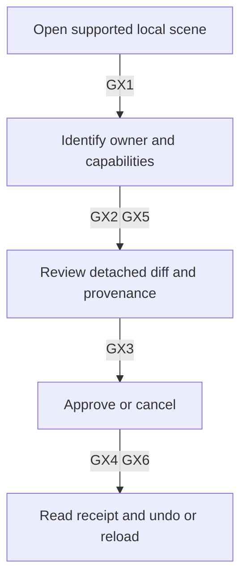
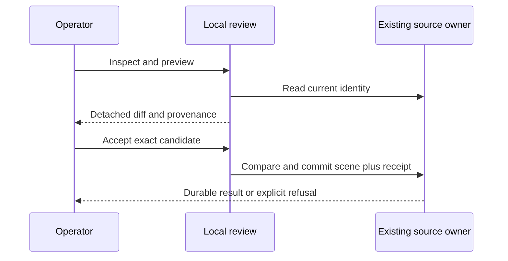
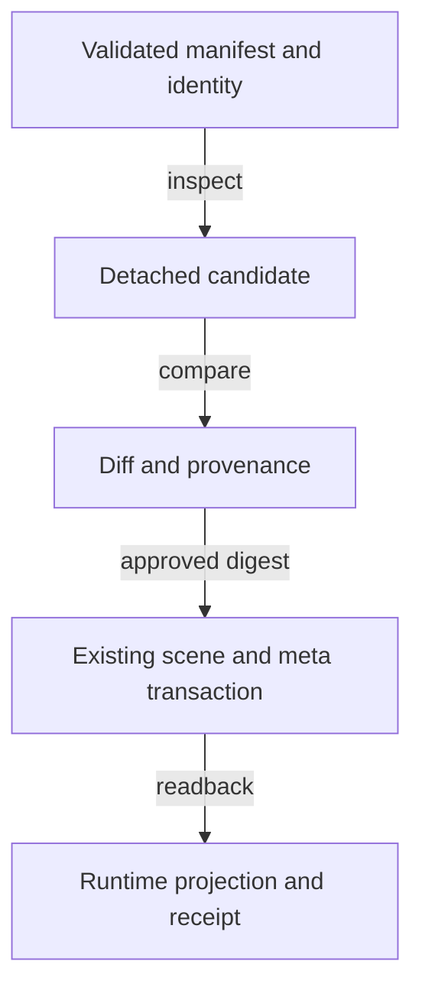
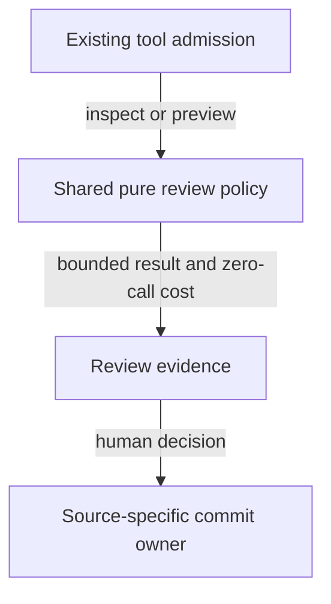
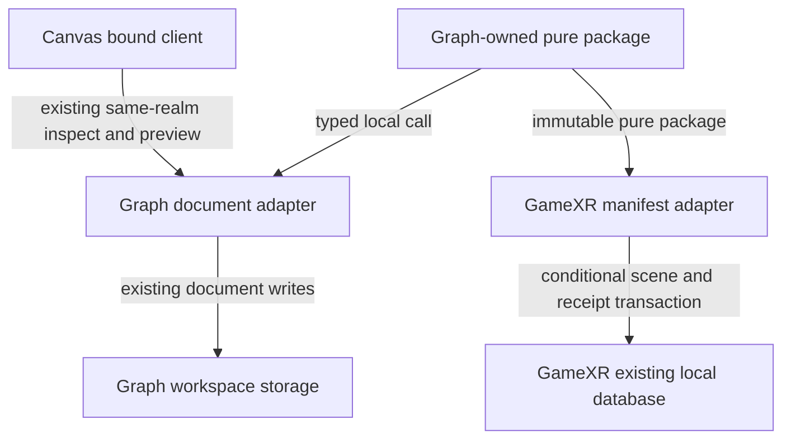

# Spatial workspace and GameXR integration — reference implementation

All five roles join **SPATIAL-GAMEXR-001@0.4.0**. This is the cross-runtime extension plan,
not evidence that either application's scene format can already execute the other's proposals.
The [spatial review owner](agentic-graph-spatial-workspace-prd-tad-adr-mvp-gtm.md),
`SPATIAL-WORKSPACE-001@0.9.0`, retains Graph's transaction and geometry requirements.
Canvas consumes that contract at `CANVAS-CONTROL-SURFACE-001@1.0.6`.
GameXR retains its game manifest, frontend, assets and local storage. Its existing drone plan
`DRONE-FLIGHT-PATH-001@1.2.0` retains bench transport; this plan grants it no new command authority.

Context: related runtimes share some primitives but have different document and approval owners.
Intent: make those capabilities discoverable without confusing a simulation, a proposal or an
observation with an accepted edit. Directive: reuse existing owners, expose unsupported seams,
then implement one reversible game-manifest edit. Role/action/outcome: the spatial integration
maintainer grounds the boundaries and sequences checked source changes. Contributor invocation:
`/change #spatial-review-record @codex-01a0dba4`; this is not a new product route.

## Implementation progress — reference implementation

R1 supplies Graph's shared canonical JSON, SHA-256, freeze, UTF-8 budget, refusal, equality and
source-capability policy. Graph imports `grph-shared/spatial-review/index`; its document geometry,
receipts and commit owner remain domain-specific. Graph [PR #1309](https://github.com/huijoohwee/agentic-graph/pull/1309), merged as
`14f993caba1a3ee1e3edb8b435d240c34c34339c`, binds the protected source and its full affected checks. `grph-shared/scripts/pack-spatial-review.mjs` projects the same module as
internal `@agentic-graph/spatial-review@0.1.0`, with exact source revision/digest and no dependencies.
GameXR's harmonization record owns the protected package SHA, double-build comparison and archive
integrity. Its older flight/Apple/world packages and Swift pins remain unchanged.

R2/R3 are implemented by **GAMEXR-SCENE-REVIEW-001@0.1.0**, the companion in
`GameXR/docs/prd-tad-adr-mvp-gtm-scene-review.md`, published in
the [GameXR integration successor](https://github.com/huijoohwee/GameXR/commit/3a982d59bd67d8b68dd175430bb5cc5bbf41671c)
at immutable candidate `3a982d59bd67d8b68dd175430bb5cc5bbf41671c`. It preserves the tested runtime
bytes from `495c05d5f3012d7fb57f4be9f4073ddf3811669b` and refreshes the existing provenance
snapshot without changing its verifier. Its required CI/merge record establishes integration
separately from this implementation evidence. Canvas remains at protected
`e31de88e5353d8c0b0174bcecaa05ed1b8b4400f`; GameXR consumes installed OS
`f6d03945ab297281ded6b702ae96d24d2b94c14e` for native lane/check/publication operations.
`SpatialReview.ts` owns a single detached proposal and strict
source bindings; `LocalDatabase.ts` owns atomic scene/receipt compare-and-set using the existing
stores and a global write revision; `GameRuntime.ts` retains the existing serialized writer and
projection ordering. `SpatialReviewPanel.ts` loads on demand through `AppController.ts` and uses
its existing export/import owner. Position/scale review supports the procedural ship only.
Agent saved-manifest/animation-setting bypasses now refuse with the local-review route. Transport
remains separate. A new registry/session invalidates old proposals and tool handles.

The local operator reviews the exact candidate, accepts while idle/paused, cancels, exports or
reviews an inverse. Two tabs cannot both commit the same expected revision. Receipt/source survive
post-commit projection failure; flight remains blocked until explicit recovery from saved source.
Partial/malformed imports refuse before writes; imported actor identity stays unverified. Graph's
catalog geometry is not applied to GameXR, and measured correspondence remains unknown.

Mechanical evidence: eight GameXR review-policy tests plus existing MCP/vendor contracts, all
owner checks, all fifteen desktop/mobile spatial browser cases and fourteen Safari regression cases. Offline
proof stops a real disposable origin and exercises reload, fresh navigation, apply/cancel and undo.
The exact candidate validation receipts and browser artifact digest live with the consumer's
verification record; protected source integration is independently established by required CI and
native completion receipts, not copied into a second ledger here. These checks establish local
`dev-proven` behavior, not Production, independent rubric ratings or physical-device validation.
Xcode beta's unaccepted license blocks native execution on this host. No native pin changed.

R4 remains open with zero completed human sessions. Consent does not count as a walkthrough.
Canvas remains the Graph-only consumer and reports GameXR transport unavailable. This completes the
R1–R3 implementation without claiming the optional Canvas-to-GameXR route or a human result.
The combined GameXR increment is bounded to 20 changed paths (21 reservations including the renamed predecessor), three new runtime modules, <80 KiB net
runtime/test/document growth and one separate generated archive; each source file remains <600 lines.

## Production admission — implementation and release pending

Context: the protected release bundle preserved an older GameXR artifact even after R1–R3
merged. Intent: deliver the reviewed spatial runtime on the existing shared Pages project.
Directive: `/release #gamexr-release @codex-01a0dba4` adds R5 at Graph's release owner;
GameXR and the publish mirror remain source and generated consumers respectively.

`config/production-gamexr.json` pins GameXR protected merge
`74bd6c6d28b5aeaa275edd2f149ec4618bcc86f3`, successful main CI run `36236161473`,
and artifact digest `87b6df08eec652398145a2759042faab415106bc4e109b5e980865dccab2f4fa`.
`scripts/production-gamexr.mjs` requires a clean exact checkout, rebuild, complete byte inventory,
source-owned header/route parity and the existing WebKit production tests before candidate admission.
The managed artifact inventory now carries `content/gamexr` through sealing, upload, reconciliation
and generated publication. Sibling routes and files retain their existing owners.

The protected controller checks disabled Pages HTML injection, prewarms an isolated returning-user
GameXR profile, then verifies immutable/public route hashes, metadata caching, MIME types, aliases, the bounded same-origin canonical HTML redirect,
WebKit runtime/cache checks and returning-user cache bytes before mirror publication. Existing
Pages/storage rollback and exact-candidate human authorization remain unchanged. Receipt files
bind source, artifact and before/after cache identities; this source update itself grants no deployment.

R5 is bounded to ten source/test/config/document paths, one new release module, <35 KiB net growth,
no runtime payload growth, no new resource/subscription and one existing release controller.
Source checks, protected integration, deployed identity and live verification are separate gates.
Production remains pending until the controller's terminal receipt exists. Native-device validation
and R4's real human sessions remain unverified independently of any successful browser deployment.

## Initial codebase inventory — historical reference

The following inventory preserves the pre-implementation observation at v0.1.0; its absent capabilities
and setup limitations are historical. The implementation record above supersedes those gaps.
The input was the earlier spatial plan plus the user's requested GameXR expansion. The bounded
inventory below supersedes its package-only GameXR observation. Source locators resolve against
these exact Git objects; source presence is distinct from executed or deployed behavior:

| Key | Repository / exact revision | Observation boundary |
|---|---|---|
| G | `agentic-graph@d91de86b772825aaec70e773f902756b6fd16e25` | Protected PR #1307; current Graph source |
| C | `agentic-canvas-os@e36ff95c210aa3fd11002958fde9bcbd26b336da` | Protected PR #952; current Canvas source |
| X | `GameXR@01b18b515b05e027d966eb157746332d2d830bd0` | Fetched protected main; local canonical checkout is six commits older |
| O | `agentic-os@84a15c89e5a0f8ea6926a0ce4685ce40d9ccf2a6` | Lifecycle/diagnostics owner; each consumer's lockfile still selects its own runtime |
| D | Graph PR #1299, head `e4e7317aa5bceee0432eb4f119e8168c9f27448c` | Open, behind main at review time; no protected integration claim |

| Claim | Disposition | Exact source evidence and consequence |
|---|---|---|
| G owns revision-bound authored edits | confirmed | `canvas/src/features/three/spatialWorkspaceModel.ts`, `spatialWorkspaceRuntime.ts`, `SpatialWorkspaceReview.tsx`; 8 edits, one pending proposal, 32 receipts, 128 KiB review budget; operator apply/undo |
| C can inspect and preview the active G document | confirmed | `web/spatial-workspace-client.mjs`, `__tests__/spatial-workspace-client.test.mjs`; host-injected same-realm registry, no apply/undo or network proxy |
| X has a general graph of editable scene entities | contradicted | `src/config/types.ts`, `src/config/manifest.ts`, `shared/gamexr.scene.schema.json`: closed `gamexr-scene/v1` with one ship, optional planet, procedural world and configuration; not G's subject/cast document |
| X owns persisted manifests and local assets | confirmed | `src/storage/LocalDatabase.ts`: `gamexr-local-v1`, scenes/assets/meta stores; scene and active ID share a transaction, with no expected-revision argument |
| X tools already implement spatial review | absent | `src/mcp/contracts.ts`: `gamexr.inspect_runtime` and `gamexr.control_runtime`; `apply-manifest-patch` validates then immediately calls `applyManifest`; no proposal, expected token, approval receipt or guarded undo |
| X manifest application already persists before activating its prepared projection | confirmed | `src/runtime/GameRuntime.ts#applyManifest` calls `rebuildScene(nextManifest, true)`: prepare assets, await `LocalDatabase.saveScene`, recheck generation, then swap projection. Preserve this ordering; expected-source compare-and-set, review receipt and explicit readback evidence are absent |
| X WebMCP fallback proves a browser-native agent host | contradicted | `src/mcp/WebMcpBridge.ts` creates `fallback-readable` context when no host exists. In-process readable tools do not prove external host availability |
| G shared packages already export spatial review | absent | G `grph-shared/package.json` and `packages/apple-spatial-input/package.json` have no spatial-review export; G model still imports XR authoring and graph types |
| X's flight and sensor primitives are source-owned upstream | confirmed | X `src/runtime/FlightSimulation.ts`, `docs/AGENTIC-GRAPH-HARMONIZATION.md`, `native/Package.swift`; local frontend adapters consume pinned upstream primitives, with explicit roll-sign projection |
| Current shared-package pins are interchangeable | contradicted | X `package.json` uses vendored `@agenticgraph/apple-spatial-input`; G package declares `@agentic-graph/apple-spatial-input`. X harmonization pins upstream `19f9da8bc537b782e23ae7669c4a919d94171529`; neither package identity nor current export compatibility may be assumed |
| X already consumes a bounded Graph path | confirmed | X `src/drone/FlightPath.ts`: v1/v2 kinematic samples, 60 Hz, 2–7201 samples, 500,000 bytes, local X/Z/altitude metres and heading degrees, `physicalAircraft:false`; not a spatial proposal |
| X embeds Graph's own read-only canvas | confirmed, consumer source only | X `src/drone/GraphCanvasPreview.ts`: artifact identity, same-origin frame, source/channel checks and 15 s readiness timeout; unavailable fallback when artifact is absent |
| That provider exists in protected G main | absent | D owns `LearningCanvasEmbed.tsx`, `learningCanvasEmbedProtocol.ts`, `build_learning_canvas_embed.mjs` and drone export changes; they are absent from G. X's merged consumer alone cannot close this dependency |
| X path handoff grants flight or scene-write approval | contradicted | X `FlightPathTransfer.ts`, `FlightPathLink.ts`: one-shot opener/origin/channel, 20 s timeout, bounded compressed fragment, explicit local admission. Connect/Run remain separate; source URL is navigation, not synchronized source or digest proof |
| Cross-runtime physical correspondence is established | unverified | X cross-runtime fixture tests mathematical/frontend projections, not physical calibration, native pixel identity, actual iPhone/headset behavior or measured real-world geometry |

The selected unchanged X manifest/MCP/flight/parity/vendor tests can run from the older local
checkout only after their source and test bytes match X. New drone files are inspected at X via
Git objects; no local execution is attributed to those files. This distinction prevents a clean
old checkout from masquerading as latest-source evidence.

## PRD — reference implementation

Domain object: a **reviewed authored scene change**, qualified by its source owner and schema.
Moving a ship's saved starting position is different from moving its live flight pose or issuing
a bench command. No part of this plan establishes a measured physical twin.

| Pain / provisional priority | Hook → break → fix → close | Evidence |
|---|---|---|
| P1 / Must: unclear scene ownership | Identify the scene → similar 3D views hide different schemas → show owner/capabilities → refuse incompatible proposals | G/C/X source inventory; customer frequency and value unvalidated |
| P2 / Must: game configuration applies before review | Propose a saved ship move → patch applies immediately → detached diff and explicit approval → receipt plus safe undo | X `executeControl` and save boundary; WTP unvalidated |
| P3 / Should: rendering mistaken for measurement | Explain an observed result → flight pixels look physically authoritative → preserve provenance/units → show unknown correspondence | G provenance and X simulation/fixture contracts; WTP unvalidated |

| Criterion / pain | One measurable end state / VCC | Design / decision |
|---|---|---|
| GX1 / P1 | Capability inspection identifies source kind, schema, active document/manifest and supported operations; foreign tokens and a missing host are explicitly unsupported, with zero writes or model calls | T1 / A1 |
| GX2 / P2 | For one supported procedural ship position or scale edit, preview changes no manifest, live flight pose, source text, database, history or asset bytes | T2 / A2 |
| GX3 / P2 | Explicit operator acceptance applies exactly the reviewed candidate once against unchanged manifest identity; concurrent edit, switch, stale approval or running flight produces zero writes | T3 / A3 |
| GX4 / P2 | Scene and bounded receipt persist together; reload preserves them; undo reverses only unchanged affected values and records its inverse | T3 / A3 |
| GX5 / P3 | Review/export distinguishes authored starting transform, simulated pose and imported local assets; unknown scale/correspondence remains unknown and imported URLs are not fetched | T1, T4 / A4 |
| GX6 / P1–P3 | At desktop and 390 px, a new supported scene reaches reviewed acceptance in ≤5 deliberate actions/300 s; installed offline apply/cancel/undo/reload preserves exact bytes without an agent host | T4 / A1–A4 |

GX1–GX6 now have consumer-specific mechanical evidence in `GAMEXR-SCENE-REVIEW-001@0.1.0`;
Graph tests alone never satisfy the GameXR conditions. Measure first value from app
navigation, count chooser selection, and record installation and help separately. No new human
walkthrough outcome has been received; consent alone establishes no completion or target-profile fit.
Failure or five minutes without completion is an incomplete result, never a coached pass.

Won't this increment: bidirectional world synchronization, Graph subject-to-ship coercion, arbitrary
GLB geometry reasoning, drone actuation, remote service proxies, native headset review parity,
calibrated reconstruction, collaborative distributed commits, new paid infrastructure or production.

## TAD — reference implementation

| Element | Implementation owner | Input → output / refusal |
|---|---|---|
| T1: source-qualified inspection | G inspection and C's admitted registry remain unchanged; extend X's existing inspect envelope with explicit manifest identity/capabilities | Validated manifest + source kind → digest-bound read; foreign G identity never becomes an X approval |
| T2: detached comparison | Reuse the extracted pure identity/budget policy from G through its explicit package; retain G XR and X manifest adapters in their respective owners | One normalized supported edit → immutable candidate/diff; no package copy, renderer import or second physics engine |
| T3: X commit adapter | Extend `GameRuntime` configuration queue and `LocalDatabase`, using existing scenes/meta stores and a validated side record; G document commit stays G-owned | Approved digest + paused runtime + expected persisted identity → scene/receipt transaction, then projection; abort stale transaction; report uncertain projection/readback explicitly |
| T4: review and fallback | X existing `AppController`/shell and WebMCP contract own local controls; C remains a G-only consumer until an explicitly admitted X contract exists | Text diff + provenance → operator apply/cancel/undo, unavailable state, same local fallback without agent host |

T2 is a source move/adaptation with one policy implementation, not a downstream fork. The package regression checks prove which helpers are independent of G's subjects, choreography, asset catalog and
editor fences. Do not import `canvas/src` privately from X or advertise an export before it exists.
Existing catalog-bound geometry is not valid for X's ship or arbitrary GLB. The X comparison
reports transform differences with geometry unavailable; geometric findings require separately
grounded pure bounds and must reuse G's existing spatial engine rather than the flight integrator.

Implemented mapping remains intentionally narrow:

| Source value | Meaning / mapping boundary |
|---|---|
| G `kgXrMotionReference.subjects` and cast marks | G-owned authored objects/choreography; no lossless map to X's single ship is supplied |
| X `manifest.id`, `ship.position`, `ship.scale` | Identity and authored initial transform; implemented review supports procedural ship only, within the existing X validator |
| X runtime `position`/`rotation` | Simulated live state; inspection can label it, but it cannot replace saved initial transform or become a preview mutation |
| X flight adapter rotation | YXZ quaternion projection negates upstream roll; preserve existing adapter and parity vectors; do not silently reinterpret as G yaw-only rotation |
| X local asset ID / hash | Local bytes admitted by existing asset owner; an ID is not a transferable asset or a measured shape |
| G observation identity / pixels | Existing semantic-space package retains pixels/digests; X schema has no equivalent observation field; report unsupported rather than append unknown keys |
| Drone path / source URL | Bounded simulated path or user navigation; neither a scene manifest nor source revision authority |

T3 must cover every X manifest writer, including existing `apply-manifest-patch`, UI imports,
profile switching and configuration edits. Otherwise that direct tool remains a bypass around a
new review view. Transport controls remain their existing separate capability; the scene-change
review cannot issue throttle, Run, pairing or drone commands. No `approved:true` tool argument.
Store at most one pending proposal in memory, 32 receipts and 128 KiB review metadata; expire and
invalidate on source/session change. Reuse the existing meta store with a scene-qualified key and
one transaction with the scene. Keep the closed scene schema and native manifest compatibility.
Define explicit receipt export/import through the existing export owner before claiming portable
undo; plain manifest export alone cannot carry the side record. Partial import stays rejected.

Source mutation and runtime rebuild are not one atomic mechanism. Preserve the existing asset preparation before
persistence; add identity checks inside the serialized operation and persisted transaction; publish the
new runtime projection only from committed source. On post-commit projection failure, retain the
receipt, stop flight, show recovery and rebuild from stored source. Do not promise a rollback that
would erase an intervening edit. The real two-tab transaction test proves persisted compare-and-set: only one acceptance can win
a captured revision, and the losing tab must re-inspect before another proposal.

### Five flows — reference implementation

Each flow covers GX1–GX6 at inspect → compare → decide → recover. The diagrams describe the implemented GameXR review path; the separate physical and optional
transport exclusions remain unchanged. Every node is an existing owner or the bounded T2 extension.

**Diagram GX-J** · Class: Journey stage map · Version: 2 — 2026-09-26.
**Surface:** 2D Renderer: Storyboard; 2D Renderer: D3 Graph.

**Diagram GX-W** · Class: User workflow · Version: 2 — 2026-09-26.
**Surface:** non-projecting semantic diagram.

**Diagram GX-D** · Class: Data flow · Version: 2 — 2026-09-26.
**Surface:** 2D Renderer: Storyboard; 2D Renderer: D3 Graph.

**Diagram GX-H** · Class: Orchestration / harness flow · Version: 2 — 2026-09-26.
**Surface:** 2D Renderer: Storyboard; 2D Renderer: D3 Graph.

**Diagram GX-T** · Class: Runtime topology · Version: 2 — 2026-09-26.
**Surface:** 2D Renderer: Storyboard; 2D Renderer: D3 Graph.

Diagram register: GX-J 5 nodes/4 edges, GX-D 5/4, GX-H 4/3, GX-T 6/5; no clusters.
GX-W has three participants and six messages and does not project. All runtime calls remain local;
package release is a build-time dependency, not a new hosted data path.

## ADR — reference implementation

| ID | Decision / reuse rationale | Alternatives, consequence and recovery |
|---|---|---|
| A1 | Qualify every source and report capabilities before federation | Reject treating similar tools as the same schema. Keep C's current G binding; unsupported X returns unavailable. No new universal registry |
| A2 | Extract only proven reusable pure policy from G, then consume an immutable package in X | Copying G's model or implementing parallel geometry violates one-owner. Direct canvas imports couple builds. If extraction cannot preserve G's regression suite, keep X read-only and stop that extension |
| A3 | Each persisted document has one local writer; extend X's existing queue/database for its own manifest | A second world database duplicates truth. Updating renderer first can lose durable identity. Preserve source/receipt on projection failure and disable acceptance until recovery |
| A4 | Preserve separate authored, simulated and observed facts; treat drone transfer as an unrelated capability | Reject claiming calibrated twin, native parity or aircraft authority from a scene review. Missing provenance remains unknown; source export stays available |
| A5 | Admit exact GameXR source and artifact through Graph’s existing release controller | A mirror-only edit leaves production stale; independent deployment splits rollback ownership. Refuse drift before activation and use the existing rollback owner before publication |

Hard constraints: no external project dependency, no paid/model service, offline local path, preserved
native manifest, one capability owner, no autonomous apply, no physical control effect. A new hosted
world service and a parallel editor fail those constraints. The existing-owner extension is the sole
admitted design; no fabricated provider ranking is needed. Reopen on failed extraction or persistence
proof, at most three repair cycles and stop after two with no reduction in blocking failures.

## MVP and implementation plan — reference implementation

| Step / criteria | Reuse and genuinely new work | Owner / prerequisite / bound | Evidence required |
|---|---|---|---|
| R0 / GX1 (completed specification increment) | Current source inventory and protected G/C receipts; new exact seam/gap record | Initial documentation increment; four documents, no runtime/dependency change, <30 KiB net growth, zero always-load modules | Source locators, revision joins, diagrams, docs/fleet checks |
| R1 / GX1, GX2 | G pure helpers/tests; new explicit shared export and source-qualified capability contract | G maintainer first; two 90-minute slices, ≤6 touched files/2 new modules, each <600 lines/500 kB | Existing 26 G tests unchanged; package builds with no canvas/renderer imports; foreign-source and unknown-capability rejection |
| R2 / GX2–GX5 | X validator, queue, local database, UI and export owner; new detached proposal/receipt adapter | X maintainer after protected R1; three 90-minute slices; R2/R3 combined ≤20 changed paths (21 reservations including the renamed predecessor)/3 new runtime modules, ≤80 KiB runtime/test/document delta | Preview/cancel leave exact bytes unchanged; paused-only acceptance; concurrent/replayed/stale attempts; storage abort, post-commit rebuild failure, receipt roundtrip and guarded undo |
| R3 / GX1, GX6 | C admitted discovery/client, existing X bridge and mobile/offline harness | Consumer maintainers after protected R2; two 60-minute slices, ≤4 touched files | Real host/no-host distinction, replaced registry/session, 390/1024 px, ≤5 actions/300 s, offline cold reload; no test injection creates first value |
| R5 / GX1–GX6 deployment | Existing protected release, artifact inventory, GameXR checker and WebKit tests; one admission adapter | G maintainer after R1–R3 protected merge; one 90-minute slice; ten files, one release module, <35 KiB | Exact source/build hash, sibling preservation, injection refusal, immutable/public browser checks, returning-user cache convergence, protected authorization, terminal receipt |
| R4 / all | Existing pilot protocol and private record | Product owner after technical acceptance | Consented real outcomes, observed confusion, support minutes and return intent; three profiles, no synthetic substitution |

R1–R3 implementation and mechanical verification are recorded above; their time bounds remain
estimates, not measured labor. Max one active lane per owner and
one writer; no parallel agents required. Source order is G package → X adapter → C optional admission.
An unrelated drone-provider integration is neither a shortcut nor a required dependency for this
game-manifest review. Its own adoption remains gated on D's protected merge and exact artifact check.
GameXR native lifecycle setup is repaired and its canonical source synchronized. The exact dangling
foreign hook configuration was verified and removed with compare-and-set before native setup; the
repair receipt preserves the former value and native doctor result. No hook or protected push bypass
is introduced. Both owner repositories publish through required protected Integration Gates.

| Demo beat | Time ceiling | Observable VCC |
|---|---:|---|
| Hook | 20 s | Open supported scene and state intended saved transform |
| Probe | 40 s | GX1 owner, capabilities and source identity visible |
| Reveal | 60 s | GX2/GX5 exact diff, unchanged source and provenance |
| Approve | 90 s | GX3 one accepted commit or explicit stale refusal |
| Close | 90 s | GX4/GX6 receipt, guarded undo and restored bytes |

Total 300 s. Installation is measured separately. Current G timings cannot satisfy X's demo.

Verification commands are selected from the existing owners: G `npm run spatial-workspace:test`
and full-app smoke; C `npm run spatial-workspace:check` and `npm run docs:check`; X
`node --test tests/manifest.test.ts tests/mcp-contract.test.ts tests/flight-simulation.test.ts tests/cross-runtime-parity.test.ts tests/vendor-archives.test.ts`.
On 2026-09-26 these five X test files passed **27/27 tests** locally at `d3e840bfd45ffb269dba330c369aa8ee94587baa`; their selected source/test bytes were checked against X and were unchanged. This does not execute the newer drone files. Those baseline tests establish the pre-existing contracts only. The current consumer tests in the
implementation record supply the R2/R3 evidence. Run `npm run native:check` only if a shared package or native boundary changes.

The initial v0.1.0 four-document check passed 17 diagrams (13 projecting/4 non-projecting), 67 projected nodes, 51 edges and four clusters; Canvas documentation contracts passed across 75 artifacts and the initial fleet check passed eight repositories, 581 artifacts, 18 responsibilities and 109 planning families. Those counts describe the historical candidate. This revision passes the named diagram canvas-render check over both companions: five diagrams (four projecting/one non-projecting), 20 nodes, 16 edges and zero clusters. Mermaid static rendering independently matches all four flow counts and renders the three-participant/six-message sequence; all five diagrams were visually inspected. The refreshed candidate fleet check passes eight repositories, 585 artifacts, 18 responsibilities and 111 planning families with zero findings. GameXR adds explicit five-role revision metadata to the existing drone path plan and uses a domain-specific companion filename to preserve Canvas invocation ownership. These remain bounded mechanical observations, not a full alignment or runtime verdict.

Selected guideline linkage is 10/10 artifact-bearing rules, advisory count 0 in this scoped set:
continuity#1/#5 → frontmatter/inventory; flow-patterns#1/#2 → five flows; time-to-value#1 → GX6;
autonomous-implementation-verification#1 → GX1–GX6; division-of-work#1/#2 → T1–T4/A1–A4;
monetization#1 → GTM; lane-topology--deploy-boundary#2 → boundary below. Here continuity abbreviates
`artifact-continuity-authoring-seam`. Linkage is not satisfaction or full-guideline conformance.

| Finding Type | Severity | Rule anchor | Artifact reference | Evidence excerpt | Remediation |
|---|---|---|---|---|---|
| pain-point-not-validated | major | pain-point-to-feature-mapping#3 | P1–P3 | No completed human outcome or WTP evidence | Product owner runs R4; retain provisional priority |

The prior missing-implementation finding is resolved by the consumer tests and source record.
Native/physical and delivered validation remain explicitly unclaimed; no full alignment verdict is claimed.
All four experience rubric dimensions remain unassessed. Authoring → protected source integration
is the current authorized effect; authoring → mirror → delivery stays closed without exact candidate,
named production authorization and existing release evidence. Roll back by protected source revert;
runtime follow-ons retain the prior verified package and preserve local source/receipts.

## GTM — reference implementation

First-dollar ordering: (1) guided reversible-edit review for an existing local scene/game author;
(2) a self-serve report only after repeat-use and support-cost proof; (3) hosted collaboration or
continuous measured twins, Won't this increment. A $1 guided pilot is a research offer hypothesis,
not a published price, buyer commitment or payment. No WTP ordering exists between P1–P3, so
engineering sequence follows reuse and prerequisites rather than invented demand.

For each real session record completion, deliberate actions, elapsed/setup/help minutes, error and
refusal counts, provenance understanding and voluntary return intent. Keep identifying information
outside the repository. Tokens/model/paid calls target zero for the local path; labor, energy and
12-month TCO remain unmeasured. New self-hosted or managed services fail this increment's constraints;
neither is assigned an invented price or savings figure. The implementation supplies bounded mechanical proof of reversible editing. Demand validation, offer
acceptance and collected revenue remain separate and unestablished for this offer.
