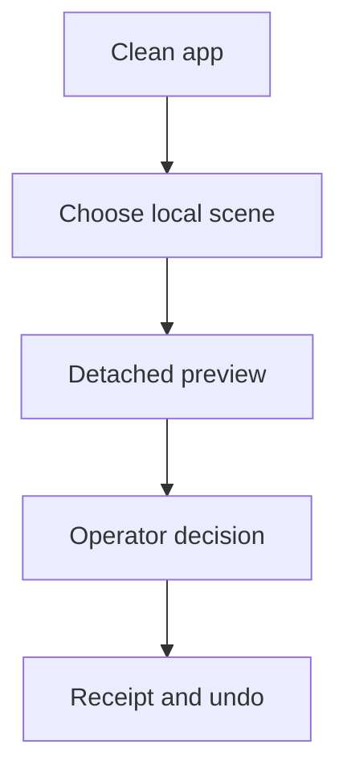
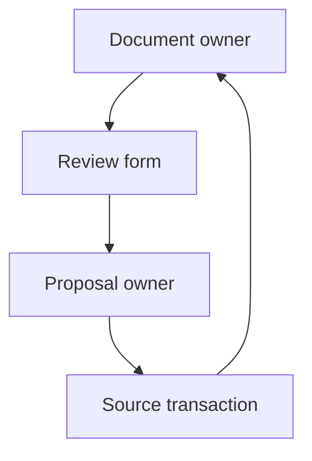
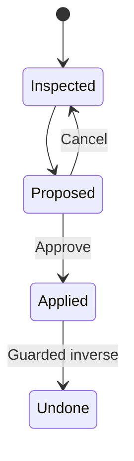
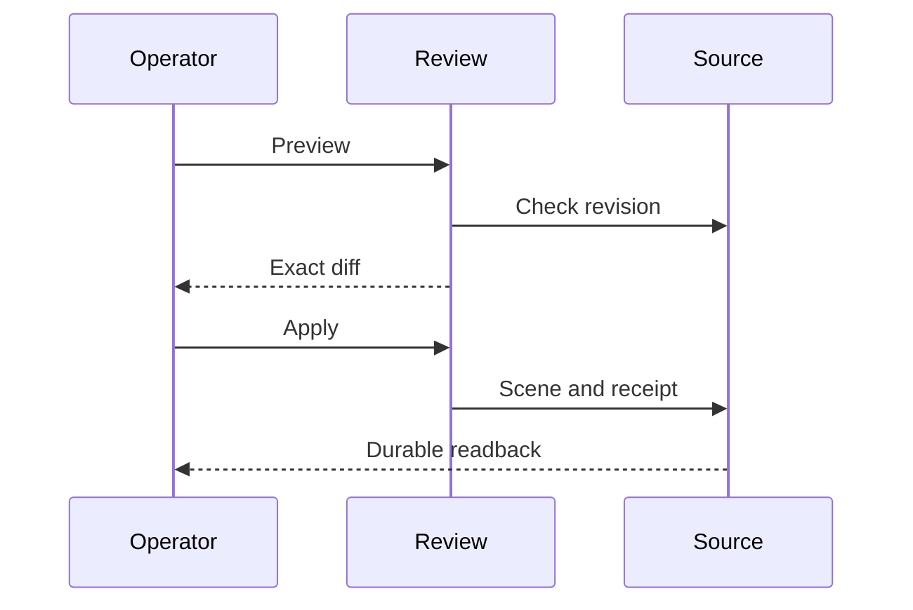
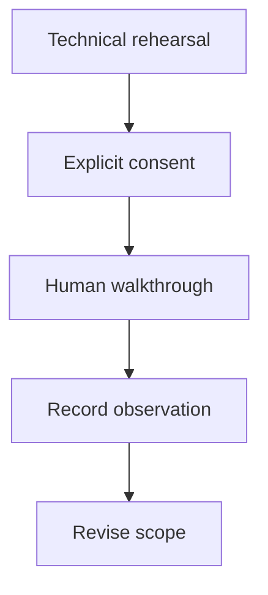

# Spatial workspace acceptance and pilot — reference implementation

All five roles join `SPATIAL-WORKSPACE-PILOT-001@0.1.0`. This bounded follow-up validates
SW5/SW6 in the spatial workspace specification and prepares three human walkthroughs.
The named participants below are recommended profiles, not recruited people. No outreach
or human participation has occurred. Automated results never count as interviews or consent.

## Grounding — reference implementation

| Existing owner | Verified base or gap | Follow-up |
|---|---|---|
| Graph PR #1302, protected merge `434972605932f219bb680f9c782988477ee73f02` | Revision-bound inspect, preview, operator apply, durable receipt and undo; mission regression fixed. | Retain these guards; exercise actual app entry. |
| Canvas PR #952, protected merge `e36ff95c210aa3fd11002958fde9bcbd26b336da` | Host-injected browser client supports inspection and preview. | Existing cross-repository transport remains the adapter; no new endpoint or apply permission. |
| `SpatialWorkspaceReview.tsx` | Existing form requires a typed change before preview. | Add an explicit one-metre X preview shortcut and refresh inspection when the editor loading guard clears; reuse the same proposal and approval boundary. |
| `semanticSpaceRuntime.ts`, `semanticSpaceStore.ts`, `semanticObjectView.ts` | Saved pixels, hashes, entities and observation reference already have import/export owners. | Project provenance without copying pixels, fetching URLs or inventing calibration. |
| `LearningOfflineControls.tsx` and PWA revision cache | Existing complete installation supports the offline Studio route. | Expose the same installer within spatial review and test offline cold reload. |
| `run_spatial_workspace_browser_smoke.mjs` | Component and transport fixture; not a complete app boot. | Keep it and add `run_spatial_workspace_full_app_smoke.mjs`. |
| Pinned Agentic OS stage runner | Console tail can lose early failure diagnostics. | Consume the protected owner repair and retain content-bound full failure artifacts in Integration CI. |

## PRD — reference implementation

Pain hypotheses: an author cannot confidently judge a suggested scene edit; an agent-workflow
builder needs visible human approval; a mobile reviewer needs a usable local fallback.
Engineering evidence supports the workflow gaps. Frequency, customer value and willingness
to pay are unvalidated.

| Must / acceptance | VCC | Design and decision |
|---|---|---|
| P1: clean full app, import, preview and approve in at most five deliberate actions and 300 seconds; desktop and 390-pixel mobile | Full-app smoke records each action and cold-entry time; human time remains separate | T1 / A1 |
| P2: offline preview, cancel, apply, undo and installed cold reload retain exact source/receipt bytes without WebMCP | Full-app smoke with capability absent and browser offline | T1, T3 / A1, A3 |
| P3: authored metres, simulated bounds and imported pixel observations remain distinct; unknown correspondence stays explicit | Existing package roundtrip plus provenance and receipt adversarial tests | T2 / A2 |
| P4: three consented human records contain outcome, actions, elapsed time, confusion and support effort | Protocol and empty measurement table below; no substitute generated participants | T4 / A4 |

Non-goals: measured physical correspondence, calibrated reconstruction, another scene store,
remote import dereferencing, paid model calls, production deployment or fabricated commercial proof.

## TAD — reference implementation

T1 uses native Launch → local file import → existing Timeline review. The shortcut prepares
one detached proposal from the inspected revision. Only Apply commits through the existing
source owner. Cancel changes no bytes; Undo checks the affected values and records its inverse.
Touch controls are at least 44 pixels high. The free-form position/scale path remains available.

T2 reads `kgSemanticObjectView` and the existing saved semantic-space package. Authored
positions use authored metres; static catalog comparisons are simulated; imported images use
source pixels with unknown physical scale. A missing package is shown as unavailable with
unknown units. Scene Markdown exports its reference; the existing package exporter carries
pixels and their digest. Neither export establishes physical accuracy. Receipt import validates
actor, token, time, provenance and inverse marks before exposing the undo path.

T3 reuses the existing verified installation, manifest, service worker and `studio-offline` route.
Installation time and bytes are setup costs and are recorded separately. Technical first value
starts at clean app navigation, including import; offline review begins after app modules load.
Cold reload occurs after explicit installation. Browser eviction remains an existing storage limit.

T4 stores only volunteered, consented observations in the pilot record. No participant names,
recordings or private scene files belong in the repository. Technical output records exact Git
revision/tree, actions, timings, errors, storage readback and screenshots in a local artifact folder.
CI failure artifacts retain a bounded 16 MiB log plus digest, source and truncation metadata for
seven days; they remain diagnostics and grant no release authority.

The journey, owner flow, states, handshake and pilot topology above contain respectively
5/4, 4/4, 4/4, 3/6 and 5/4 nodes/transitions; none has subgraphs. Diagrams explain the
protocol; they are not additional acceptance evidence.

## ADR — reference implementation

| ID | Decision and consequence | Alternatives |
|---|---|---|
| A1 | One-click bounded preview uses the existing proposal owner. Five actions count Launch, Choose files, file selection, preview and approval separately. | Dropping assertions or excluding file selection would disguise friction; automatic apply would bypass operator review. |
| A2 | Use existing semantic-space identity, pixels and validation; authored and simulated facts retain unknown correspondence. | A second observation store duplicates ownership; treating a rendering as a measurement is unsupported. |
| A3 | Reuse explicit revision-verified offline installation. | A generic cache fallback could reopen an unverified version; a separate spatial cache duplicates lifecycle. |
| A4 | Use three purposive profiles and record technical rehearsals separately. | Synthetic personas cannot establish consent, usability, buyer intent or payment. |

These choices satisfy one-owner, bounded local processing and no-new-dependency constraints.
No vendor scoring is needed. Reopen the decision if an existing owner cannot preserve exact
source bytes or clean-browser first value cannot meet the threshold after three bounded repairs.

## MVP and implementation plan — reference implementation

| Stage | Exit condition | Current evidence |
|---|---|---|
| M1 | Provenance and malformed import checks pass | 23 spatial model/runtime/provenance tests passed locally; candidate only |
| M2 | Desktop/mobile full-app first value, offline cancel/undo and cold reload | Implemented harness; exact-candidate run pending |
| M3 | Protected owner diagnostics repair, consumer pin, required CI and canonical runtime | Owner verification in progress; consumer not yet published |
| M4 | Three consented walkthroughs | Protocol ready; zero participants and zero completed human records |
| M5 | Successor five-role specification reflects actual findings | Update after technical and human evidence; never promote pending criteria |

Run `npm run spatial-workspace:test`, `npm run spatial-workspace:browser` and
`npm run spatial-workspace:full-app`. The full-app command builds, requires clean committed
source and writes revision-bound `acceptance.json` plus desktop/mobile review screenshots.
The browser uses native UI and actual IndexedDB. The existing storage service fixture prevents
host/external writes; no fixture component or injected graph-store state establishes first value.

### Three walkthroughs — reference implementation

Recruit only after explicit outreach authorization; select one consenting person per profile:

| Record | Profile and eligibility | Task emphasis |
|---|---|---|
| H1 | Solo scene author who has moved objects in an editor | Import a personal non-sensitive scene, preview a move, explain the diff, apply and undo |
| H2 | Agent-workflow builder who has used browser tools | Inspect via Canvas's existing client, request preview, explain why agent approval cannot apply, approve in Graph |
| H3 | Reviewer who primarily uses a touch device | At about 390 pixels, complete native review without WebMCP, cancel, apply, undo and reopen offline |

Consent prompt: “May I observe you trying this local scene workflow and record anonymous task
outcomes, timings and comments? Participation is voluntary; you may skip a task or stop at any
time. I will not record your screen, name or scene content without separate consent.” Record
explicit agreement before timing. Use a supplied harmless scene if they prefer. Do not collect
camera, location, microphone or account credentials.

Facilitator: establish prior experience, disclose any installed-cache setup, then say “Show how
you would review this proposed move before accepting it.” Offer no hints during the first attempt.
Count each click/tap, chooser selection and field edit; record navigation and installation separately.
After first value, ask them to cancel another proposal, undo, identify what is authored versus
observed, and reopen offline. Stop at five minutes and record an incomplete outcome rather than
coaching a pass. Log any later assistance separately. Ask what they would use this for, what fails
today, and what would make them return; ask price only as a hypothesis, never as proof of payment.

| Record | Consent | Completed | Actions / seconds | Errors / help minutes | Provenance explanation | Return intent / quote |
|---|---|---|---|---|---|---|
| H1 | Not collected | Not run | — | — | — | — |
| H2 | Not collected | Not run | — | — | — | — |
| H3 | Not collected | Not run | — | — | — | — |

## GTM — reference implementation

The recommended first audience is existing local scene authors with an immediate reversible-edit
need. The agent-workflow builder checks integration usefulness; the mobile reviewer checks
accessibility and fallback. Three purposive sessions expose blockers, not a representative market.

Pass the engineering gate only with P1–P3 evidence. Consider an invitation-only human pilot after
that gate; its exit is three consented completed records, an explanation of unknown physical scale,
and an explicit decision for every observed blocker. Retest blockers on a successor revision.
A paid assisted pilot remains a hypothesis until a real buyer agrees to a concrete scope and price.
No revenue, willingness to pay, retention or general customer TTV is currently established.

Track model tokens (zero for the local technical path), setup bytes/minutes, first-value actions/time,
help minutes, completion failures and a voluntary return-use statement. Labor cost and cash revenue
remain unreported. Production promotion retains its existing exact-candidate human authorization.

Scoped guideline linkage: continuity → frontmatter; grounding → owner table; flow-patterns → five
diagrams; time-to-value → P1/M2 and H1–H3; autonomous verification → P1–P3 commands;
division-of-work → T1–T4 and A1–A4; monetization → GTM; deploy-boundary → Dev-only rule.
This is a linkage record, not full guideline conformance. Open findings: exact-candidate full-app
proof and actual human consent/outcomes. Both local and delivered readiness remain undocumented.
