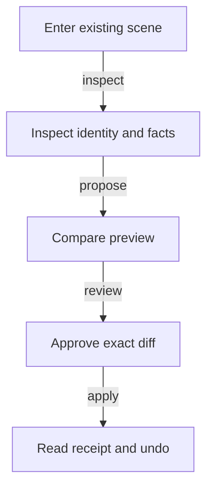
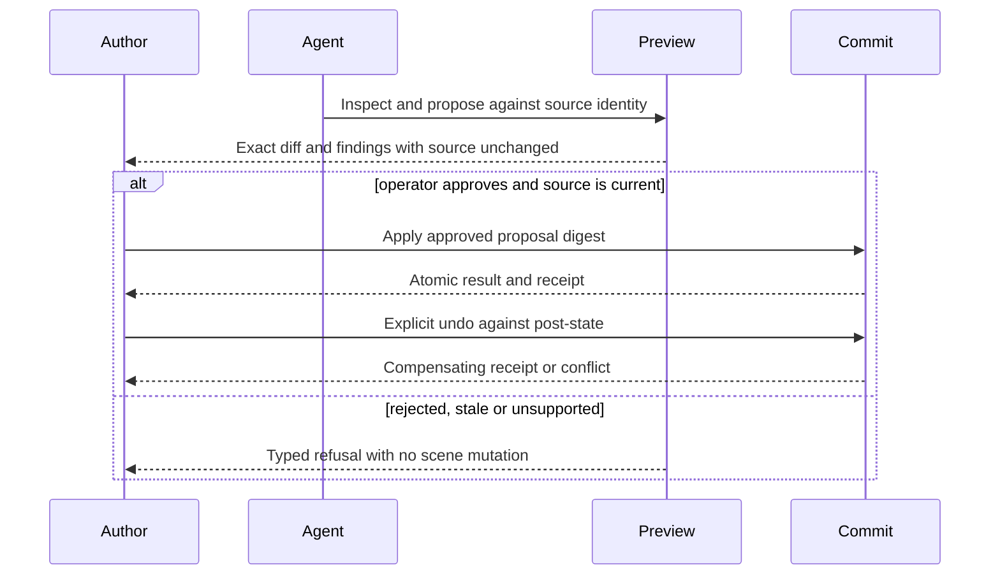
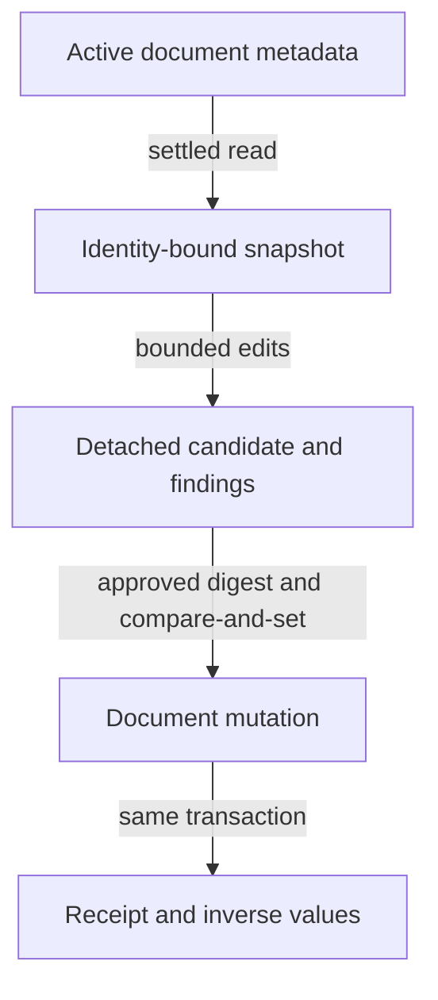
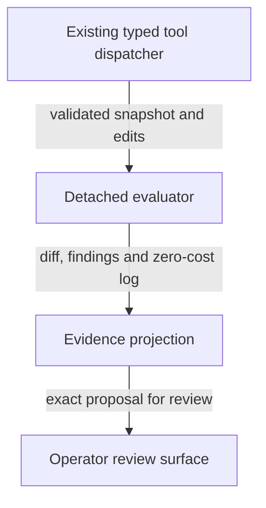
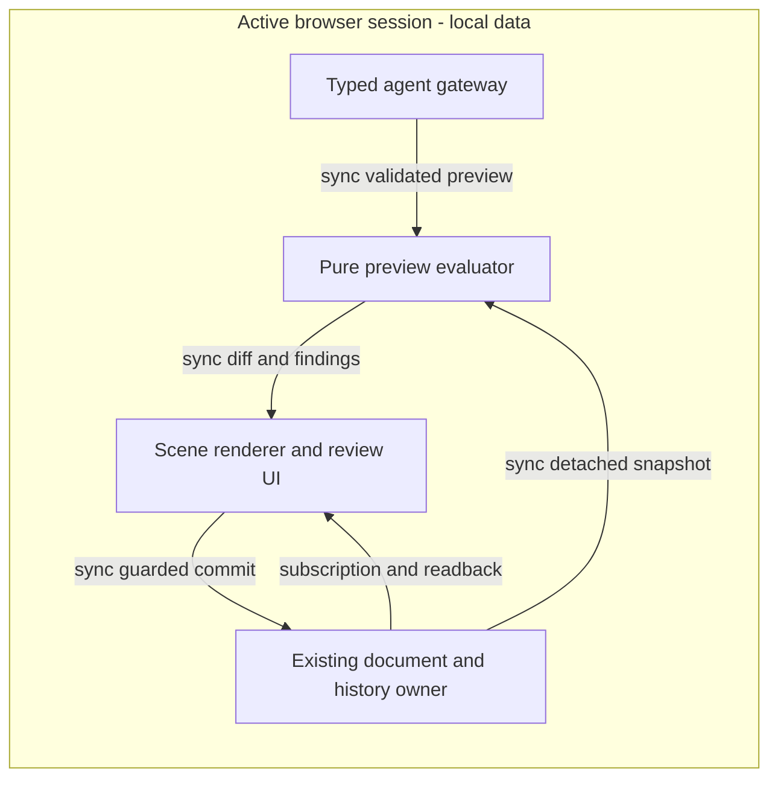

# Reference implementation: agentic-graph agent-native spatial workspace

PRD, TAD, ADR, MVP and GTM join **SPATIAL-WORKSPACE-001@0.7.0**. This successor records protected integration of the initial review loop and the bounded acceptance follow-up: observation provenance, native app entry, offline recovery and a three-profile pilot protocol. The follow-up remains a source candidate until its own protected gate completes. Customer validation and production delivery remain unestablished.

Context: the source owners below already support bounded spatial authoring, but the reviewed base did not expose a revision-bound spatial proposal transaction. Intent: let an operator and an agent inspect the same authored scene and safely compare a proposed edit. Directive: extend those owners with the smallest inspect, preview, review, apply and undo slice. Role: spatial maintainer. Action: the maintainer implements and checks that shared review loop. Outcome: a local runtime candidate with reproducible checks and a remaining-work plan. Authoring/runtime invocation: `/change #spatial-workspace-runtime @codex-01a0dba4`; these are contributor intent tokens, not new product routes.

This artifact owns the spatial proposal delta. The [XR planning set](agentic-graph-ar-vr-xr-planning-prd-tad-adr-mvp-gtm.md), `PLAN-AGENTIC-GRAPH-AR-VR-XR-PRD-TAD-ADR-MVP-GTM@3.0.1`, retains capture, rendering and general spatial authoring ownership. Its pinned historical conformance document is unchanged. The [native physics plan](agentic-graph-native-physics-engines-prd-tad-adr-mvp-gtm.md), `PLAN-AGENTIC-GRAPH-NATIVE-PHYSICS-ENGINES-PRD-TAD-ADR-MVP-GTM@1.1.3`, retains simulation ownership. Canvas consumes this contract; it must not create another scene store or physics engine.

## Codebase grounding - reference implementation

The following G/C/O/X inventory is the historical pre-implementation baseline, not a claim about current missing features. All Graph-relative paths in that inventory resolve at `8bff012eac5f58a456c8caf85ccc2ac11ccf07c9` (G). Canvas paths resolve at `5ea33c4f521d39e985a60c054db8ebd13d4db54c` (C). Lifecycle source checkout: `8bd5c314c23e30bc16de9a0fbb0a4349c3273638` (O); consumer lockfiles, not O, select execution versions. GameXR package observation: `d3e840bfd45ffb269dba330c369aa8ee94587baa` (X). Authoring input: the user-requested `0.1.0` plan followed by implementation authorization; this `0.7.0` successor assesses the bounded source inventory and candidate delta separately. External reference material supplies no implementation evidence, copied artifacts, or dependency.

| ID | Material claim and disposition | Exact owner evidence / implication |
|---|---|---|
| G1 | **confirmed**: authored motion and physics persist through graph metadata | G: `canvas/src/features/three/xrScenePersistence.ts`, `xrMotionReferenceModel.ts`, `xrPhysicsModel.ts`; keys `kgXrMotionReference` and `kgXrPhysicsWorld`. Reuse the active document, not a new world database. |
| G2 | **confirmed**: graph metadata writes update source text, revision and history | G: `canvas/src/hooks/store/graph-data-slice/graphDataNodeActions.ts#updateGraphMetadata`, `canvas/src/hooks/store/historySlice.ts`. A scheduled history entry is not an attributed spatial transaction receipt. |
| G3 | **confirmed**: typed browser inspection and immediate controls exist | G: `canvas/src/features/three/xrSceneMcpContract.mjs`, `xrSceneMcpRuntime.ts`, `xrSceneControlNormalization.ts`; `canvas/src/features/agent-ready/xrSceneWebMcpTools.ts`. Inspector exposes separate motion and physics revisions; no combined document token is returned. |
| G4 | **absent in inspected owners**: revision-bound proposal, approval receipt and isolated spatial comparison | G: G1-G3 owners have immediate mutations and rollback of runtime snapshots on persistence failure, but no proposal/apply/undo action or expected-revision input. Do not present direct controls as the proposed review protocol. |
| G5 | **confirmed**: native bounded geometry and simulation can be reused | G: `canvas/src/features/physics/spatialPhysicsEngine.ts`, `spatialPhysicsGeometry.ts`, `spatialPhysicsTypes.ts`; point/overlap/ray queries, fixed steps, snapshot/restore. Geometry supports cuboids and spheres; no oriented 3D body dynamics, mesh clearance, articulated robotics or certified safety analysis. |
| G6 | **confirmed**: UI and tools share existing persistence, with multiple live projections | G: `canvas/src/features/three/XrSubjectAuthoringControls.tsx`, `XrMotionReferenceRuntimeBridge.tsx`, `xrScenePersistence.ts`. Motion, physics and graph revisions differ; a single authoritative revision is a new integration requirement, not an existing guarantee. |
| G7 | **confirmed**: source-scoped limits already exist | G: `xrMotionReferenceModel.ts`: 48 subjects, 12 cast tracks, 32 marks per track, coordinates bounded to 50 m; `xrPhysicsModel.ts`: 128 bodies, 192 static colliders. New previews must respect these limits. |
| G8 | **contradicted**: all spatial metadata writes pass the settled-editor fence | G: `canvas/src/features/workspace-table/workspaceSceneMetadataAuthoring.ts` allows `kgXrPhysics`; G1 writes `kgXrPhysicsWorld`. The mismatch affects the guarded editor path; it does not prove every physics save fails. Fix the existing allowlist owner and test the exact persisted keys before proposal commits. |
| C1 | **confirmed**: Canvas routes to shared Graph/lifecycle contracts | C: `src/agentic-graph-mcp-contract.js` re-exports the pinned lifecycle adapter; `scripts/xr-invocation-contract.mjs` checks dictionary ownership; `agent-api/src/tool-search.js` owns deferred discovery. No Canvas-local scene store is justified. |
| O1 | **confirmed**: lifecycle and fleet allocation have existing owners | O: `bin/agentic-os.mjs`, `bin/agentic-os-fleet.mjs`, `FLEET.md`. Checks and local reservations do not confer protected integration or deployment authority. |
| X1 | **confirmed, package scope only**: another spatial frontend consumes shared packages | X: `package.json` pins local archives for `grph-shared` and spatial input. No current spatial-proposal compatibility is evidenced; adoption is deferred until Graph's contract is proven. |
| G9 | **unverified**: complete digital-twin correspondence, device latency, offline reload and buyer value | No sensor-calibration, physical-scene comparison, clean-browser timing or customer-result artifact was supplied. These claims cannot justify readiness or execution. |

**Recorded source checks, 2026-09-26, authoring surface:** after `npm ci --ignore-scripts` and `npm run smoke:prepare`, G's `TSX_TSCONFIG_PATH=canvas/tsconfig.json node --import tsx --test canvas/src/__tests__/spatialPhysicsEngine.test.ts canvas/src/__tests__/xrSceneMcpContract.test.ts` exited 0: 8 tests, 8 passed. An initial run failed because the linked package build was absent; preparing it resolved that environment failure. C's `node --test __tests__/xr-invocation-contract.test.mjs` exited 0: 7 tests, 7 passed. C's `npm run docs:check` exited 0 over 75 artifacts. After authoring, C's `npm run check` passed all six selected owner checks (budgets, four test shards and docs); it does not imply full-suite parity. G's `npm run check` passed linked-package builds, TypeScript and all three local-browser-runtime policy tests. These are supporting source checks, not evidence satisfying the new VCCs.

**Fleet preflight, repaired 2026-09-26:** O's `npm run fleet:check -- --ownership=<explicit-eight-root-map>` passes across 8 repositories, 578 artifacts, 18 responsibilities and 106 planning families, with zero findings. The Graph release-recovery companion now explicitly consumes the Design baseline's five-role `0.6.4` join; its separate artifact version `0.6.7` preserves the original release evidence. The two specification worktrees replace canonical roots in this candidate map. This clears the recorded planning prerequisite; it is not protected publication or deployment evidence.

### Implementation checkpoint - reference implementation

The original Graph review loop is protected in [PR #1302](https://github.com/huijoohwee/agentic-graph/pull/1302), merge `434972605932f219bb680f9c782988477ee73f02`; its specification is in merged PR #1300. The mission-browser panel cleanup regression is fixed. Canvas's browser client is protected in [PR #952](https://github.com/huijoohwee/agentic-canvas-os/pull/952), merge `e36ff95c210aa3fd11002958fde9bcbd26b336da`. The runtime and transport gaps recorded at G/C are therefore historical.

The follow-up is branch `agent/device-cba000d3779d/spatial-import-surface`. Its automated full-app proof binds commit `afc114feb2fec454208ceca74b1b08ad1b0b8c44` and tree `5d965a37a6aed17b3c547a01bc56df9b5c475e29`; artifact `/tmp/spatial-full-app-import/acceptance.json`. Subsequent specification and protected lifecycle-pin changes retain this source observation and receive their own required CI proof; the observation is not retroactively rebound.

| Delta | Concrete owner / result |
|---|---|
| Shared transaction | `spatialWorkspaceModel.ts`, `spatialWorkspaceRuntime.ts` and the existing source serializer retain revision fencing, detached preview, operator apply, durable receipt and guarded undo. |
| Observation provenance | `spatialWorkspaceProvenance.ts` projects existing `kgSemanticObjectView` and semantic-space identity. Existing package import/export preserves pixels and digests; authored metres, simulated bounds and source pixels remain distinct and physically uncalibrated. Receipt import validates identity, actor, provenance, time and inverse marks. |
| Native review | `SpatialWorkspaceReview.tsx` adds an explicit one-metre X preview and reuses `LearningOfflineControls`. It refreshes after bootstrap/indexing/layout fences clear and when local source binding, graph identity or physics readiness changes, with one timer for the existing mutation deadline. Controls stay disabled until inspection matches current source/runtime inputs; pending inspection retains the displayed draft. Mobile review works while expensive 3D rendering remains opt-in. `strybldrTimelineBottomPanelLayout.ts` drops the editor inset when less than 320 pixels remain, instead of accepting a clipped 48-pixel strip. |
| Native import | `useWorkspaceFileActions/core.ts` resolves the existing frontmatter preset before generic widget/Storyboard fallback. Explicit XR, Geo and renderer intent stays authoritative and native canvas reveal is preserved; implicit and explicitly 2D widget imports retain the fallback. A native-hook regression proves the former 2D overwrite and the corrected route without changing saved source. |
| Browser acceptance | `run_spatial_workspace_full_app_smoke.mjs` uses native Launch/file chooser, actual source storage, no tool host and explicit offline installation. No injected store or fixture component creates first value. The existing storage fixture blocks external/host writes. |
| Lifecycle diagnostics | Agentic OS [PR #313](https://github.com/huijoohwee/agentic-os/pull/313), protected `84a15c89e5a0f8ea6926a0ce4685ce40d9ccf2a6`, retains bounded full failure logs and validates export identity/digests. Integration CI uploads failure-only diagnostics for seven days. Cleanup ignores post-merge check noise and uses the existing declared inventory ceiling. |

**Technical evidence, 2026-09-26:** 26 model/runtime/provenance tests pass, including hydration-fence release, late local source binding, graph/physics readiness changes and actual parser/source reserialization. The late-binding and native-import regressions failed before their respective repairs and pass afterward; two existing import checks also pass. TypeScript and three browser-runtime policy tests pass. The cross-repository browser smoke passes at 1024/390 pixels with Canvas's generated client and the actual Graph registry: matching identities, stale rejection, offline apply/undo, four receipts, durable readback and zero page errors. The full-app rehearsal records five deliberate actions at both widths; 1024 px: 17.72 s to first value, 5.28 s installation, 2.83 s offline reload; 390 px: 5.05 s to first value, 3.82 s installation, 1.70 s offline reload. Both profiles verify preview/cancel byte preservation, apply, undo, two persisted receipts, installed offline cold reload, absent navigator/document tool surfaces, no script execution and no horizontal overflow. Browser checks now verify the review panel is at least 320 pixels wide within all clipping ancestors before editing and after reload; the earlier clickable-but-clipped mobile observation was insufficient. Mobile uses text review without opting into 3D. Offline Studio deliberately reopens the source editor; after verifying exact bytes, one native Close action returns to review. This reopen navigation is recorded separately from first value. These are automated technical timings, not observed customer TTV.

The first follow-up CI run (`36226732242`, attempt 1) timed out while initial review remained disabled. Its complete failed-stage log was retained by the new diagnostics exporter. A successor adds the missing inspection dependencies and logs the saved source and visible refusal message for future full-app failures; it requires its own green CI proof. Run `36227352881` then completed the desktop flow but exposed a mobile XR-to-Storyboard transition with intact saved source. The native import regression reproduced the generic widget fallback overriding explicit XR intent; the successor repairs that source owner. Owner CI passed before protected merge. The OS merge's first main run hit an unchanged 500 ms local-application fixture deadline; its focused three tests passed and the unchanged exact-revision retry passed. Logs and provider identity remain diagnostic evidence, not permission to bypass checks. Native closeout now quarantines both the completed specification lane and lifecycle-fix lane with recovery bytes preserved; the old 10,000-entry blocker is resolved.

| Stage | Result | Remaining prerequisite |
|---|---|---|
| M0-M3 | Initial review loop protected; acceptance follow-up source-tested | Follow-up protected integration and canonical runtime receipt |
| M4 | Canvas transport protected; SW5 package cases and SW6 full-app technical rehearsal pass | Larger-scene responsiveness and full guideline alignment remain unmeasured |
| M5 | Three-profile consent script, tasks and empty measurement record implemented | Real consenting participants and independently observed outcomes |

The [pilot specification](agentic-graph-spatial-workspace-pilot-prd-tad-adr-mvp-gtm.md), `SPATIAL-WORKSPACE-PILOT-001@0.4.0`, owns the recommended solo-author, agent-builder and mobile-reviewer sessions. No person was recruited, no feedback invented and no outreach sent. Production remains governed by its existing explicit authorization boundary.

## PRD - reference implementation

### Problem, personas and pain evidence — reference implementation

The operator can edit a scene today but cannot rely on the inspected interface to distinguish a reversible agent suggestion from an immediate write, or to prove which scene revision a spatial comparison describes. The implemented candidate supplies one reviewable loop using the existing editor and tools; the limitation in the preceding sentence describes the reviewed base. The domain object is an **authored spatial workspace**: one active document, scene entities, configured physical behavior, optional observation provenance, and bounded change evidence. A useful digital twin additionally requires measured correspondence with the physical subject; a rendered scene alone does not establish it.

| Persona | Job | First value |
|---|---|---|
| Solo scene author | Compare a placement change without losing existing work | A revision-labelled before/after result and a reversible accepted edit |
| Agent integrator | Read the same scene and propose a bounded operation | Typed data and explicit unsupported/stale outcomes without UI scraping |
| Spatial maintainer | Keep document, tools, history and renderer coherent | One source-owned commit path with reproducible failure cases |

| Pain | Hook / break / fix / close | Evidence and reuse split |
|---|---|---|
| P1: uncertain scene identity | Hook: show which scene is being discussed. Break: multiple revisions lack a shared read token. Fix: inspect a document-bound snapshot. Close: compare UI and tool identity. | Source gap G3/G6; customer pain **unvalidated**. Reuse inspector, graph revision and hydration; add identity contract. |
| P2: suggestions can overwrite work | Hook: inspect the change before applying it. Break: no proposal transaction in G4. Fix: bounded preview, explicit approval and stale rejection. Close: apply once and undo safely. | Source gap G4/G8; customer pain **unvalidated**. Reuse mutations, metadata, history and geometry; add transaction policy and receipts. |
| P3: simulation looks like physical evidence | Hook: explain what the result actually establishes. Break: no measured correspondence in G9. Fix: label authored, simulated and observed facts. Close: export provenance with the reviewed document. | G9; customer pain **unvalidated**. Reuse metadata/export; add bounded provenance fields, never invent measurements. |

WTP evidence is absent for all three pains, so no WTP ranking is implied. Priority below is provisional for a discovery pilot; pain validation is a baseline gate. Zero-code reuse can demonstrate current authoring, but cannot meet stale-write or approval criteria; a minimal extension precedes any new runtime.

### User stories, acceptance and VCCs — reference implementation

Each numbered criterion has one measurable end state. Candidate evidence follows the table; the original full acceptance conditions remain binding. The checkpoint distinguishes bounded technical acceptance from human outcomes and unmeasured larger-scene performance.

| ID / pain / priority | Given / when / then | VCC check and constraint | TAD / ADR |
|---|---|---|---|
| SW1 / P1 / Must | Given an active authored document, when UI and agent inspect it, then their document identity, source revision and scene digest agree. Missing or changing source returns unavailable. | `spatialWorkspaceRuntime.test.ts`: compare both surfaces after edit, undo, document switch and hydration; zero mutation/model/network effects during inspection. | T1 / A1 |
| SW2 / P2 / Must | Given an inspected revision and at most 8 supported edits, when preview runs, then it returns a deterministic diff and bounded spatial findings while the active document and history remain byte-equivalent. | `spatialWorkspace.test.ts`: repeat and reorder equivalent input, reject overflow/non-finite data/unsupported geometry, compare active state before/after; same implementation and configuration only. | T2 / A2 |
| SW3 / P2 / Must | Given a reviewed proposal, when the operator applies it, then precisely one approved change commits only against its unchanged source identity. | `spatialWorkspaceRuntime.test.ts`: stale, changed proposal, missing approval, document switch, two simultaneous applies and replay; zero partial writes on rejection. | T3 / A1, A3 |
| SW4 / P2 / Must | Given an applied change receipt, when its author requests undo, then one compensating change restores its prior values only while its post-state still matches. | Same runtime suite: undo, duplicate undo, intervening edit and reload; preserve unrelated edits and historical receipts, never restore the whole old workspace blindly. | T3 / A3 |
| SW5 / P3 / Must | Given authored, simulated or imported observation data, when reviewed or exported, then each fact retains its provenance and unknown correspondence remains explicit. | `spatialWorkspaceProvenance.test.ts` and existing package owners: export/import identity and provenance, missing units, missing observations, hostile labels/URLs, oversized payload; no code execution or automatic remote fetch. | T1, T4 / A4 |
| SW6 / P1 / Must | Given a clean browser with the local app available, when the operator completes the review loop without a model or network, then first value arrives within 5 actions and 5 minutes. | `canvas/scripts/run_spatial_workspace_browser_smoke.mjs` and `run_spatial_workspace_full_app_smoke.mjs`: mobile-width and desktop walkthrough, disconnect after load, reject/apply/undo/reload, WebMCP-unavailable fallback; record timings, errors and revisions. | T1-T4 / A1-A4 |

The implementation consolidates the originally proposed four test files into two suites under `canvas/src/__tests__/`. Registered commands are `npm run spatial-workspace:test` and `npm run spatial-workspace:browser`; the collaboration contract selects them for affected owners. No test filename is an additional source of policy.

| Criterion | Candidate evidence / remaining scope | Disposition |
|---|---|---|
| SW1 | One `inspectSpatialWorkspace` implementation feeds UI and browser tool; source/scene digests, session epoch and three revisions. Unit cases cover source changes, document changes, local-source eligibility, editor fences and actual-parser rehydration. | Implemented; local source tests pass. |
| SW2 | Pure sorted 1-8 edit preview, frozen candidate, existing native overlap engine, graph-owned cast preservation, translated choreography and clamp refusal. Tests prove determinism and no scene/history writes. | Implemented; local source tests pass. |
| SW3 | Frozen reviewed proposal is the UI capability; final synchronous source check, five-minute expiry, one commit in flight, source/receipt atomic serialization, replay without another history entry. Dedicated agent scene tool refuses legacy writes and forged flags. | Implemented; local source/browser tests pass for this boundary. |
| SW4 | Inverse checks affected values and context, preserves unrelated body/subject changes, refuses conflict, deduplicates undo. Browser verifies two persisted receipts and restored values. | Implemented; fresh-page readback and installed full-app offline cold reload pass. |
| SW5 | Existing observation-package roundtrip preserves pixels, hashes and unknown scale; inspection separates authored/metres, simulated bounds and imported pixels. Missing data, hostile URLs, malformed receipts and oversized payloads are rejected. | Technical cases pass; physical calibration and measured correspondence are outside this slice. |
| SW6 | Native full-app entry and five-action review at 390/1024 px; offline preview/cancel/apply/undo, installed cold reload and no-tool-host fallback pass with exact source/receipt readback. | Automated technical gate passes; human customer TTV remains unmeasured. |

### Scope, metrics and economics — reference implementation

Smallest slice: one existing scene document; inspect; propose 1-8 position/scale edits of existing subjects; measure conservative overlap and axis-aligned bounds; review; apply; undo; reload. Edit eligibility is limited to stopped physics and an unchanged authored source. Reject unsupported operations rather than silently narrowing or clamping a reviewed proposal. Existing direct manual controls remain usable. The dedicated `control_local_xr_scene` browser tool now accepts preview only and refuses its legacy scene writes. This is a compatibility change. Other tools retain their owners and invalidate a pending source token if they change scene data; no application-wide agent write sandbox is claimed.

Should: labelled measurement overlays and an exported change report. Could: multi-step bounded physics comparisons after static preview is proven. **Won't this increment:** live sensor ingestion, inferred room reconstruction, certified clearance/safety conclusions, autonomous physical actuation, arbitrary uploaded executable assets, mesh/path-planning engines, multiplayer conflict resolution, cross-device automatic merges, hosted orchestration, paid model calls and new infrastructure. Captures and XR rendering keep their existing owners.

| Metric | Baseline | Pilot target / measurement window |
|---|---|---|
| TTV steps / elapsed, SW1-SW6 loop | Automated: 5 actions at both widths; measured times in checkpoint. Human TTV unmeasured | At most 5 actions / 5 minutes from clean app entry to approved edit and receipt; also record install/setup time separately |
| Stale or unapproved writes | No proposal protocol in G4 | 0 accepted among all adversarial test cases before baseline |
| Preview repeatability and isolation | Native core tests pass, composed preview absent | Equal normalized findings/diff, unchanged live document and history for every preview fixture |
| Inspection / preview responsiveness | Unmeasured | p95 under 100 ms / 250 ms over 30 runs at the scoped 48-subject ceiling; record hardware, payload and cold start separately |
| Model tokens per read / per pilot month | No new model path | 0 prompt, 0 completion, 0 cache tokens, 0 model calls across 100 deterministic pilot sessions |
| Infrastructure / token spend | No new service selected | Incremental monetary budget $0/month; reject paid fallbacks or quota overruns |
| Total cost of ownership | Labor, hardware and energy unmeasured | Record active minutes, support minutes and device cost separately; no zero-total-cost claim |
| Local / delivered readiness | `undocumented` / `undocumented` for this increment | `spec-complete` only after alignment/TTV evidence; `dev-proven` after SW1-SW6 source/browser proof; no delivery target implied |
| ROI Score | Unknown; no measured savings or WTP | Measure `(monthly hours saved x agreed hourly value - monthly operating cost) / implementation hours`; defer commercial prioritization until inputs exist |

Open research: whether scene authors prefer one atomic proposal or per-edit selection; whether axis-aligned findings are useful for their scenes; which existing users will pay for a reviewed result. A pilot tests these uncertainties; it does not relax write safety.

## TAD - reference implementation

### Components, interfaces and reuse — reference implementation

TAD consumes all six criteria at `SPATIAL-WORKSPACE-001@0.7.0`. Existing components remain source-confirmed at G/C. The candidate owners and tests below implement T1-T4 through the bounded same-realm Canvas adapter. The increment retains local/delivered `undocumented` pending full acceptance and alignment; this conservative overall rung does not erase the bounded passing tests.

| Element | Owner and responsibility | Reuse / new work; input -> output | Local / delivered for delta |
|---|---|---|---|
| T1: scene snapshot | Existing `xrSceneMcpRuntime.ts`, `xrScenePersistence.ts`, graph store and source hydration | Reuse reads; add one document/source/scene identity envelope and provenance projection. Existing authored metadata -> bounded snapshot. No duplicate store. | `undocumented` / `undocumented` |
| T2: preview evaluator | Existing spatial core and XR adapter; a small pure proposal module beside scene owners | New detached candidate/diff evaluator; reuse normalization and `SpatialPhysicsEngine.fromSnapshot`. Snapshot + edits -> diff/findings. No imports from the renderer into the evaluator. | `undocumented` / `undocumented` |
| T3: guarded commit | Existing scene persistence, `graphDataNodeActions.ts`, editor fence and history | Extend current boundary to compare source identity, commit once and attach a bounded receipt. Approval + proposal -> receipt or typed refusal. UI and agent writes converge here. | `undocumented` / `undocumented` |
| T4: review and agent transport | Existing scene controls, `xrSceneWebMcpTools.ts`, tool catalog; Canvas deferred tool/search presentation | Add a before/after review view and capability-gated operations in the existing contract. Snapshot/proposal/receipt -> UI/tool result. Use current document export and storage; no new server. | `undocumented` / `undocumented` |

Dependency licenses and package versions stay lockfile-owned; this plan adds no library, SDK, service or external schema. New pure modules remain under 600 lines and 500 kB each. Existing runtime limits apply before allocation. Implemented caps: 8 edits, 1 pending proposal per active document, 32 retained receipt entries, 128 KiB combined proposal/receipt metadata; overflow refuses new work and offers explicit export/prune. These are enforced constants in `spatialWorkspaceModel.ts` and `spatialWorkspaceRuntime.ts`; receipt export/pruning uses the existing document authoring surface, not a new pruning UI.

### Snapshot, proposal and transaction contract — reference implementation

The candidate uses `agentic-graph.spatial-review/v1` and the document key `kgSpatialWorkspaceReview`. It extends the existing scene tool envelope without a new transport. Source owners and exact limits are recorded below.

| Record | Required content | Validation and owner |
|---|---|---|
| Snapshot identity | Existing workspace/source locator, document session identity, graph content revision, motion revision, physics revision, canonical scene digest, implementation/configuration revision | T1 samples one settled source and verifies it did not change during read. A document switch, hydration reset or concurrent source update invalidates the result. Labels are not identity. |
| Provenance | Authored category, metres, source document and unknown correspondence; derived findings explicitly identify their approximate basis | T1 projects authored, simulated and existing imported-observation provenance. Existing semantic-space package export/import preserves identity and source pixels; absent observations remain unavailable and physical scale/correspondence remain unknown. No observation grants control authority. |
| Proposal | Generated proposal identity, base source token, document, exact normalized edits, candidate digest, before/after findings, browser session/local actor mode and expiry | T2 checks all edits before computing; reject duplicate targets, invalid/non-finite values, unsupported geometry and excess bounds. Derived measurements are recomputed, not stored as independent truth. |
| Approval | Proposal identity and digest, same document/session, explicit operator decision, bounded expiry | T3 binds the exact reviewed bytes. Agent-supplied `approved: true`, tool annotations, render state or Canvas orchestration status cannot authorize a write. |
| Receipt | Proposal/digest, source token, post-scene digest, document/session, actor mode, local operator, timestamp, apply/undo relation, diff and inverse values; durability is reported by readback | T3 emits receipt with the same successful document mutation. Keep the source/history commit verifiable before reporting success; ambiguous persistence returns indeterminate and requires readback. |

Approval is a named product interaction in SW3, separate from repository release approval. The first slice allows an agent to inspect and preview; only the operator's explicit review action approves application. The dedicated scene tool is fenced at `xrSceneWebMcpTools.ts`, including invocation strings. The review component calls the UI-only apply/undo entry points; it never forwards an agent approval flag. Manual controls keep their existing fences. Browser-local attribution is not account authentication or a cryptographic signature; arbitrary same-origin JavaScript is outside this interface boundary. Do not assume a tool's annotation or registration constitutes enforcement.

**Apply sequence:** validate the exact pending frozen proposal capability, schema, browser session and digest; verify active source is settled and physics stopped; re-read identity immediately before commit; compute the entire next metadata value in memory; recheck the captured source epoch and runtime revisions, then mutate through the current graph owner without an asynchronous gap; commit scene and receipt together; verify source/document readback; refresh runtime projections; return the recorded receipt. Fail before mutation when any check fails. The root frontmatter serializer now emits motion, physics and receipt keys. `updateGraphMetadata` verifies the complete receipt-bearing source projection before changing store/history. Storage uses the existing queued writer and durable IndexedDB readback; a storage failure after the in-memory commit returns `persistence-indeterminate`, not a rolled-back success. Multi-tab/distributed compare-and-set is outside this slice.

Idempotency looks up the exact proposal/digest: the same completed apply returns its existing receipt without changing history; the same identity with different bytes is refused. Rejection/expiry creates no scene write. Undo is an explicit inverse transaction against the receipt's post-state and affected-field identity; concurrent edits that touch those fields cause conflict. Redo is a fresh proposal against current state. Retained history does not imply durable identity across reload; persisted digest/receipt checks must establish it.

**Spatial evaluation:** coordinates and dimensions come from the existing scene catalog, transforms and canonical stage projection. Static overlap uses conservative catalog axis-aligned bounds and stage colliders; it does not model configured dynamic body sizes, collision masks, custom floors or trajectories. No configurable clearance threshold is added. Rotated or non-cuboid geometry without a supported projection returns unsupported/approximate with its reason; it cannot return a safety pass. Detached fixed-step comparisons, when enabled later, reuse the same core build, snapshot, tick schedule and configuration. Never call play/step on the live runtime to create a preview. No pathfinding, real-world calibration, physical safety or cross-build bitwise determinism is claimed.

**Candidate errors for this contract:** source-unavailable, stale-source, unsupported-operation, unsupported-geometry, invalid-input, budget-exceeded, approval-required, approval-expired, proposal-mismatch, conflict, persistence-indeterminate, cancelled. Return a bounded reason and affected references; never silently replay against a newer document. Cancel stops preview and releases its snapshot; retry once only after an explicit fresh inspection. No recursive agents or background polling.

### Invocation register and harness — reference implementation

The executable invocation register remains `xrSceneMcpContract.mjs` plus the existing agent-ready tool catalog; this table references it and introduces no new slash, semantic or binding token. Product additions require owner schema and dispatcher changes together.

| Existing route | Existing capability / planned extension | Boundary / model tokens |
|---|---|---|
| `agentic-graph.inspect_local_xr_scene_assets` | Existing catalog/runtime plus `spatialWorkspace` with T1 identity, subjects, provenance and receipts or a typed refusal | Active browser session, no cloud inference; 0 |
| `agentic-graph.control_local_xr_scene` | Candidate accepts `{action: "preview", expectedToken, edits}` only; legacy write forms return `approval-required` | UI applies/undoes the displayed proposal; no tool apply/undo operation; 0 model calls |
| `/xr.stage`, `/xr.place`, `/xr.transform`, `/xr.label`, `/xr.remove`, `/xr.physics`, `/xr.present` | Existing commands from G3; no new command declarations | Manual invocation definitions remain; the dedicated agent scene tool refuses these legacy forms, covered by runtime/registry tests |
| `@canvas`, `@scene`, subject/asset bindings; `#transform`, `#world`, `#body`, `#impulse`, `#controller`, `#reticle` | Existing target semantics from G3 | Target resolution never grants approval |

Harness: dispatcher T4 -> executor T2 -> observer receipt/diff -> consumer operator T4. One preview per request, at most one explicit refresh after stale input, stop on unchanged failure. Model invocation is disabled in the first slice. The implemented functions invoke no model/provider; a separate monthly cost telemetry record is deferred and must not be inferred from these tests. An external agent's own reasoning cost is separate and unknown, never implied free. If WebMCP is unavailable, keep the same manual review workflow and explicitly report transport unavailability; do not install a hidden bridge or redirect a local edit to a remote service.

### Five linked flow patterns — reference implementation

**Diagram SW-J** · Class: Journey stage map · Notation: flowchart TB · Version: 1 — 2026-09-26
**Surface:** 2D Renderer: Storyboard; 2D Renderer: D3 Graph.
**Caption:** First value ends at a reviewed change with a receipt, with undo available in the same workspace.

| Node / stage | Workflow | Data / harness / topology | Criteria |
|---|---|---|---|
| enter / trigger | Open one document | SW-W Author; SW-D source; SW-H dispatcher; SW-T document | SW1, SW6 |
| inspect / discover | Read facts and provenance | SW-W Agent; SW-D snapshot; SW-H dispatcher; SW-T gateway | SW1, SW5 |
| compare / engage | Request detached preview | SW-W Preview; SW-D candidate; SW-H executor; SW-T evaluator | SW2, SW5 |
| approve / complete | Decide exact diff | SW-W Author/Commit; SW-D committed; SW-H consumer; SW-T document | SW3, SW6 |
| result / return | Inspect receipt or undo | SW-W Commit; SW-D receipt; SW-H observer; SW-T review | SW4-SW6 |

**Diagram SW-W** · Class: User workflow · Notation: sequenceDiagram · Version: 1 — 2026-09-26
**Surface:** dedicated sequence renderer; no node-link projection.
**Caption:** Only a current approved proposal reaches the document commit boundary.

| Participant | Happy path | Alternate / error |
|---|---|---|
| Author | Reviews, approves, optionally undoes | Reject/cancel preserves scene |
| Agent | Uses T1/T2 only before approval | Cannot assert its own approval |
| Preview | Detached normalized comparison | Invalid/unsupported/budget -> refusal |
| Commit | T3 commits once | Stale/expired/conflict -> no write; ambiguous readback -> indeterminate |

**Diagram SW-D** · Class: Data flow · Notation: flowchart TB · Version: 1 — 2026-09-26
**Surface:** 2D Renderer: Storyboard; 2D Renderer: D3 Graph.
**Caption:** Candidate state stays detached until the guarded commit updates the existing document.

| Node | Input -> output | Journey / owner |
|---|---|---|
| source | Existing scene keys -> authored metadata | enter / T1 |
| snapshot | Metadata and source identity -> bounded read envelope | inspect / T1 |
| candidate | Snapshot + edits -> diff and findings | compare / T2 |
| committed | Exact current approved candidate -> one metadata update | approve / T3 |
| receipt | Pre/post identity -> inspectable inverse and provenance | result / T3 |

**Diagram SW-H** · Class: Orchestration / harness flow · Notation: flowchart TB · Version: 1 — 2026-09-26
**Surface:** 2D Renderer: Storyboard; 2D Renderer: D3 Graph.
**Caption:** The bounded agent path produces review evidence without granting itself write authority.

| Role / node | Input -> output | Fallback / journey |
|---|---|---|
| Dispatcher / dispatcher | Typed tool request -> bounded T1/T2 call | Unavailable session -> explicit failure / inspect |
| Executor / executor | Snapshot/edits -> comparison | Reject unsupported or over-budget / compare |
| Observer / observer | Comparison -> evidence and cost log | Missing evidence stays unavailable / compare |
| Consumer / consumer | Proposal -> approve/reject intent | No response means no approval / approve, result |

**Diagram SW-T** · Class: Runtime topology · Notation: flowchart TB · Version: 1 — 2026-09-26
**Surface:** 2D Renderer: Storyboard; 2D Renderer: D3 Graph.
**Caption:** The MVP runs in one local browser and uses its current document authority.

| Node / boundary | Role / type / lane | Connection / residency |
|---|---|---|
| gateway / browser | Router / existing tool function / authoring | Synchronous typed calls to evaluator; browser memory |
| evaluator / browser | Consumer / pure function / authoring | Detached document input and review output; browser memory |
| document / browser | Store / existing graph/source/history / authoring | Guarded source mutation and subscriptions; existing local workspace storage |
| review / browser | Consumer and producer / UI / authoring | Reads projections, emits explicit approval; no model credentials |

| Diagram | Class | Notation | Surface | Projects | Nodes | Edges | Clusters | Version |
|---|---|---|---|---|---|---|---|---|
| SW-J | Journey stage map | flowchart TB | Storyboard / D3 Graph | yes | 5 | 4 | 0 | 1 |
| SW-W | User workflow | sequenceDiagram | Sequence | no | 0 | 0 | 0 | 1 |
| SW-D | Data flow | flowchart TB | Storyboard / D3 Graph | yes | 5 | 4 | 0 | 1 |
| SW-H | Orchestration / harness flow | flowchart TB | Storyboard / D3 Graph | yes | 4 | 3 | 0 | 1 |
| SW-T | Runtime topology | flowchart TB | Storyboard / D3 Graph | yes | 4 | 5 | 1 | 1 |

The shared projection check confirmed these counts on 2026-09-26: five diagrams, four projecting, one non-projecting, 18 nodes, 16 edges and one cluster. Sequence participants are an inventory, not projected nodes. Diagram compilation/projection does not prove runtime or visual usability.

### Quality and deploy boundary — reference implementation

Offline: after the app and existing assets load, inspection, static preview, review and undo need no network; explicit verified installation and offline reload pass the bounded SW6 rehearsal; eviction and new-device installation remain existing lifecycle constraints. Mobile: provide a touch/keyboard-accessible diff list with text findings; no headset, hover or camera permission required. Security: validate the same schema at tool and mutation boundaries; treat imported labels as text, deny executable assets and unsolicited fetches, retain existing document access rules. Observability: record source/digest, bounded duration, result and model-free costs without raw credentials or private agent reasoning.

| Boundary | From lane | To lane | Evidence reference | Operator instruction | Rollback | State |
|---|---|---|---|---|---|---|
| Source integration and projection | Authoring | Mirror | Initial runtime and transport have protected merge receipts; follow-up gate and projection receipt remain pending | None for promotion | Revert exact source commit through protected owner workflow; regenerate projection | closed |
| Public runtime promotion | Mirror | Delivery | Exact candidate, SW1-SW6, runtime proof, artifact identity and production authorization; absent | None | Existing product release owner restores prior verified candidate and validates readback | closed |

Do not hand-edit generated publication artifacts. Repository admission, integration and cleanup use the pinned lifecycle owner. Canvas uses existing discovery/routing only after Graph proves the contract. A local test or authoring request does not authorize a production release.

## ADR - reference implementation

A1-A3 are implemented in the protected initial loop. A4 now consumes the existing observation-package owner in the acceptance candidate. These decisions join this exact revision; the follow-up requires its own protected gate.

| ID | Context / decision | Alternatives and consequences | Recovery |
|---|---|---|---|
| A1 | G1/G6 already own scene data. Extend existing document metadata, identity and persistence. | Current configuration alone cannot meet SW1/SW3. A new FOSS scene store could isolate edits but creates a second authority; reject it. Reuse minimizes migration but requires repairing G8 and preserving editor fences. | Disable proposal capability; retain authored scene/source and receipts. |
| A2 | G5 provides bounded native geometry. Evaluate detached copies with existing pure core. | Applying edits to the live scene then rolling back fails preview isolation. A new FOSS geometry engine adds unsupported ownership/dependency; reject for this slice. Conservative AABBs limit conclusions and must be labelled. | Refuse unsupported preview; manual authoring remains available. |
| A3 | G4 has no spatial transaction. Bind explicit approval to candidate and source digest; commit and undo through one boundary. | Unconditional agent writes fail SW3; whole-workspace restoration fails SW4 under concurrent edits. Existing history is reused, with receipt metadata added for attribution and idempotency. | Conflict returns to fresh inspect; indeterminate writes require readback, never blind retry. |
| A4 | G9 lacks physical correspondence proof. Separate authored, simulated and observed provenance. | Treating a simulation as a measured twin overclaims evidence. A hosted twin service adds cost and a new segment before demand exists; defer it. | Preserve original imported observation and mark unknown fields; do not fabricate calibration. |

**Selection record:** hard constraints are one document owner, zero paid runtime, offline deterministic preview, current revision enforcement and no new external dependency. Existing configuration fails current-revision enforcement; an independently built parallel FOSS editor fails one-owner; managed new service fails offline/no-new-dependency. The existing-owner extension is the sole admissible design, with T3 demonstrated for one browser document and durable readback, not a distributed transaction. No fabricated outranking score or contested-provider verdict is needed. If source tests contradict atomic persistence feasibility, reopen A1/A3; three bounded repair cycles maximum, stop after two cycles without fewer blockers.

| 12-month TCO dimension | Existing-owner local extension | New FOSS self-managed editor | New managed service |
|---|---|---|---|
| Incremental infrastructure / egress / tokens | $0 / $0 / $0 budget on existing device; no service selected | Unpriced; additional hosting not authorized | Unpriced; excluded before purchase |
| Labor / energy / hardware | Unmeasured; record build, support and device minutes | Unmeasured; second editor/storage maintenance | Unmeasured integration and provider support |
| Operations / risk | Existing maintenance plus bounded proposal tests | Manual patching, backup, migration; duplicate-state risk | Provider dependency, quota and offline risk |
| Decision | Sole admitted MVP candidate; monetary ceiling is not measured TCO | Rejected by ownership constraint, not by invented pricing | Rejected by deployment/dependency constraints |

No new infrastructure candidate is procured, so no managed/self-managed price comparison or vendor documentation is used to justify a purchase. A hosted follow-on must separately price managed, self-managed and consolidated variants with actual workload and operations assumptions.

## MVP - reference implementation

Implement SW1-SW6 through T1-T4 and A1-A4 in dependency order. This document supplies a bounded implementation decomposition, but baseline sign-off remains open for the recorded validation gaps. One implementer, at most one runtime lane per owner; Canvas follows Graph's settled interface. No parallel agents or duplicated stores are required.

| Stage / criteria | Reuse | New work / owner | Prerequisite / bounded estimate |
|---|---|---|---|
| M0 / SW1, SW3 | Scene serializer and editor fence | Correct G8 at its owner; test supported keys and refusal of unrelated metadata | First; 30-60 minutes, one owner plus its existing test |
| M1 / SW1, SW5 | Inspector, source identity, serialization | Stable snapshot identity and provenance envelope; Graph maintainer | M0; one 90-minute source/test slice |
| M2 / SW2 | Native query/snapshot/normalization | Detached static preview/diff; Graph maintainer | M1; one 90-minute slice, no provider |
| M3 / SW3-SW4 | Metadata commit and history | Approval, idempotency, atomic receipt and guarded inverse; persistence maintainer | M2 and proven source CAS; two 90-minute slices, stop on unsafe persistence |
| M4 / SW5-SW6 | Scene UI, local tool builders and document export | Review affordance, gateway enforcement, roundtrip and browser checks; Graph then Canvas maintainers | M3; two 90-minute slices, only changed tool contracts loaded |
| M5 / GTM | Working local slice and existing users | Timed discovery pilot and priced offer record; product owner | M4 and closed VCCs; no release or outreach by this authoring task |

These are estimates, not measured labor. The runtime envelope was refreshed from 6 new/8 existing files to **6 new/10 existing files** when tests exposed the root frontmatter serializer omission and affected-scope CI registration was added. Total estimate remains 12 hours; no new dependency, no new file above 600 lines, and always-load instruction delta 0 bytes. The review component follows the existing XR inspector loading path. No production chunk-size measurement is claimed.

| Demo beat | Bound | Observable outcome |
|---|---|---|
| Hook | 20 s | Open one existing scene and state the edit goal |
| Probe | 40 s | SW1/SW5 show identity, geometry limits and provenance |
| Reveal | 60 s | SW2 shows exact diff/findings with unchanged source |
| Approve and apply | 90 s | SW3 accepts current proposal once; a changed-source attempt is refused |
| Close and undo | 90 s | SW4-SW6 show receipt, guarded undo and persisted readback |

Total demo ceiling is 300 seconds. A recorded clean-environment run must establish the TTV metric; narration and source tests cannot substitute for it.

### Verification, readiness and scoped conformance — reference implementation

Agentic OS visibility, AI Agent discovery and gateway federation are all in scope, in that order. The local candidate implements shared inspection, preview, guarded commit and undo; the Graph browser tool schema is executable in that candidate. Canvas browser federation now supports inspect and preview through the host-injected active registry. It exposes no apply/undo, URL proxy or agent approval capability; abort discards late replies while Graph retains any already-submitted preview for operator review. The bounded SW5/SW6 technical cases pass; human validation, larger-scene responsiveness and full alignment remain open, so the complete increment stays local/delivered `undocumented`. No delivered route is advertised.

Experience assessment at `SPATIAL-WORKSPACE-001@0.7.0`, authoring environment, using the shared **Agent Experience Maturity Rubric v1.0.0**: Core Requirements & Functionality, Innovation & Theme Alignment, Technical Execution & Integration, and Usefulness & Agentic Experience are all **unassessed**. Gap owner: product maintainer; next evidence: timed M5 pilot plus SW1-SW6 checks. No cumulative capability level, WTP or revenue follows from those ratings.

Authoring checks: strict YAML/revision/source-locator/line-budget checks on changed artifacts; `git diff --check`; C `npm run docs:check`; shared `scripts/check-diagram-canvas-render.mjs <this-file>`. The projection check also passes for the Canvas consumer document (two diagrams, 15 nodes, 12 edges, three clusters). Keep source test observations above separate. Mechanical checks evaluate surfaced structure and deterministic output; they cannot independently certify buyer pain, architectural completeness or visual usability.

Scoped artifact linkage coverage is **10/10 selected artifact-bearing rules**, with **0 advisory rules in this selected set**; this is not a full-guideline alignment verdict. Selected Rule IDs and artifacts: `artifact-continuity-authoring-seam#1` -> frontmatter join; `artifact-continuity-authoring-seam#5` -> grounding table; `flow-patterns#1` -> SW-J stage mapping; `flow-patterns#2` -> SW-J/W/D/H/T; `time-to-value#2` -> M5 pending check; `autonomous-implementation-verification#1` -> SW1-SW6; `division-of-work#1` -> T1-T4; `division-of-work#2` -> A1-A4; `monetization#1` -> GTM ledger; `lane-topology--deploy-boundary#2` -> boundary register. A link to a pending check is coverage, not satisfaction.

| Finding Type | Severity | Rule anchor | Artifact reference | Evidence excerpt | Remediation |
|---|---|---|---|---|---|
| unproven-claim | blocker | time-to-value#2 | M5 | "human TTV unmeasured" | Product owner records three consented walkthroughs under the pilot protocol; automated SW6 timing is recorded separately. |
| pain-point-not-validated | major | pain-point-to-feature-mapping#3 | P1-P3 / proposed Must tier | "customer pain unvalidated" | Specification change: product owner attaches pilot evidence or keeps the Must tier provisional. |

These are two explicit open findings, not a complete enumerated guideline audit; unexamined rule types are not reported as passing zeros. Phase 0 records unvalidated hypotheses; Phases 1/2 have the linked proposal; Phase 3 baseline is not signed off; Phase 4 consumes actual pilot evidence in a successor revision. Do not claim full conformance or implementation readiness from this scoped map alone. On 2026-09-26 all five Mermaid blocks rendered in the local browser with the installed Mermaid 11.17.0 build; labels and connections were inspected at a 738-pixel viewport. Vertical flow layouts preserve reading size. This checks the standalone diagrams, not Graph product-renderer parity, mobile interaction or SW6.

## GTM - reference implementation

Reachable-segment hypothesis: solo scene authors already using the existing workspace. No customer cohort, quote, usage result or willingness-to-pay evidence is attached. The smallest commercial test is a reviewed scene-change report for one existing user, after the local loop works; no subscription, marketplace or remote twin platform is required.

| First-dollar order | Offer / constraint disposition | Evidence required / current state |
|---|---|---|
| 1 | Guided review of one existing authored scene, with a reversible change report; passes no-new-infrastructure and existing-user targeting constraints | Priced conversation and accepted outcome; both unvalidated. Test a clearly labelled $1 pilot offer hypothesis, not a published price or recorded sale. |
| 2 | Self-serve paid export/report; conditional on repeated use and support-cost proof | Unvalidated; payment/export entitlement mechanism not evaluated here. More unbuilt assumptions than option 1. |
| 3 | Hosted team workspace or continuously synchronized twin | Fails this increment's offline/zero-new-service constraints; Won't this increment | No target segment, runtime proof or cost evidence; excluded from comparison |

Channel/price selection uses the same constraint-first rule as A1-A4. A direct, consented pilot with an existing user requires fewer unvalidated distribution and entitlement assumptions than a new paid acquisition channel; paid acquisition fails the zero-spend constraint. $1 is a bounded research offer, not an optimized price. Commercial outranking remains unresolved until price acceptance and support effort are observed; no same-author claim is an independent market verdict.

| Evidence boundary | Current record | Next observation |
|---|---|---|
| Demand / pain / WTP | unvalidated | Three consented target-user conversations with exact quotes and price response |
| Offer acceptance | unvalidated | One user explicitly accepts the scoped deliverable and price |
| Transaction / mechanism | unverified for this offer | Existing payment owner produces a scoped mechanism receipt only after separately authorized setup |
| Collected revenue | No payment evidence recorded | Actual settled payment; never infer from test transactions |
| Fulfilment / repeat use | unverified | Recipient accepts report and returns for a second task |
| Runtime / economics | Bounded SW1-SW6 technical evidence exists; human outcomes, larger-scene responsiveness and labor remain unmeasured | Timed completion, error/conflict rate, model tokens, active/support minutes and actual cost |

Proceed from discovery to a paid pilot only when one target user validates pain and accepts the offer, all Must VCCs pass and fulfilment is bounded. Revisit scope if three conversations find no useful job or if delivery requires unsupported spatial conclusions. Store results in the existing immutable planning Context owner and derive a successor specification; do not rewrite this revision into retrospective success. No outreach, payment, upload or deployment is performed by this implementation task.
