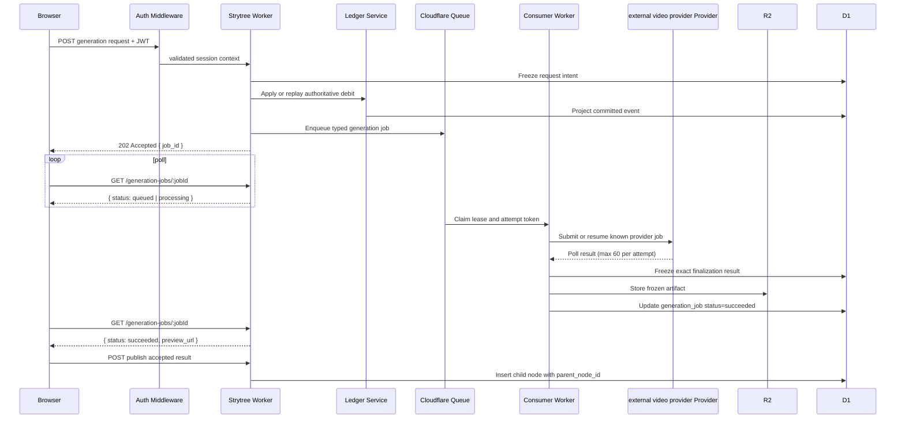

[Combined planning owner](agentic-graph-strytree-prd-tad-adr-mvp-gtm-workflows-api.md) · `PLAN-AGENTIC-GRAPH-STRYTREE-PRD-TAD-ADR-MVP-GTM@0.2.3`. This companion preserves the source section; diagrams and frontmatter projections remain owned by the combined artifact.


[Canonical PRD/TAD and section index](./agentic-graph-strytree-prd-tad-adr-mvp-gtm.md).

## C6. Payment And Credit-Token Workflow

### Workflow: Buy Credit Tokens

**Trigger**: User selects a credit package.

The provider-hosted path below is the production requirement. Current checkout creation and browser completion are enabled only in explicit local-development mode; production browser creation/completion are disabled. Native signed webhook fixtures prove settlement validation, not live collection.

**Actors**: Browser, Strytree Worker, Commerce Adapter, Stripe or existing payment provider, Webhook Handler, Ledger Service.

**Happy path**:
1. Browser posts `{ package_id, idempotency_key }` to the checkout endpoint.
2. Worker verifies session and package.
3. Commerce Adapter creates a checkout session server-side.
4. User completes payment on provider-hosted UI.
5. Provider sends signed webhook.
6. Webhook Handler verifies signature, recognized success type, explicit paid status, amount, currency, package, user, and provider session.
7. Ledger actor commits `purchase_credit` and balance, then projects to D1; settlement records the replay-safe audit before marking the session completed.
8. Browser polls wallet or receives refresh state.

**Alternate paths**:
- User abandons checkout: payment session expires; no ledger event.
- Browser returns before webhook: wallet shows pending payment status.

**Error paths**:
- Webhook signature invalid: reject and audit.
- Duplicate webhook: recover the existing credit without duplication; an audit-write failure leaves the session recoverable on retry. A legacy completed session missing its audit is not automatically repaired.
- Amount/package mismatch: quarantine event and do not credit.

**Postconditions**:
- A successful payment has exactly one durable ledger credit.
- Balance shown by UI is derived from server ledger, not browser state.

```mermaid
sequenceDiagram
  participant U as User
  participant B as Browser
  participant W as Strytree Worker
  participant C as Commerce Adapter
  participant P as Payment Provider
  participant L as Ledger Service
  participant D as D1

  U->>B: Select credit package
  B->>W: POST checkout package and idempotency key
  W->>C: Create server-side checkout session
  C->>P: Create payment session
  P-->>B: Redirect or client secret
  U->>P: Complete payment
  P->>W: Signed webhook
  W->>L: Verify and credit package
  L->>L: Commit authoritative SQLite event and balance
  L->>D: Project event; record audit; complete session
  B->>W: GET wallet balance
  W-->>B: Confirmed credit balance
```

### Workflow: Generate New Branch

**Trigger**: User confirms `Generate - 5 credits` in the modal.

**Actors**: Browser, Strytree Worker, Auth Middleware, Ledger Service, Cloudflare Queue, Queue Consumer Worker, external video provider Provider, R2, D1.

**Happy path**:
1. Browser posts prompt, parent node id, selected assets, generation options, and idempotency key.
2. Auth Middleware validates JWT session.
3. Worker validates parent/assets/cost and queue availability, then persists the exact D1 request intent before debit.
4. Ledger actor applies or replays the generation debit for that intent; identity drift conflicts.
5. Worker enqueues a typed generation job message to Cloudflare Queue; returns `202 Accepted` with `job_id` immediately.
6. Browser polls `GET /api/strytree/generation-jobs/:jobId` for status.
7. Consumer obtains a renewable 120-second lease and attempt token, submits with server credentials, and persists the provider job id before polling.
8. Consumer polls at most 60 times per attempt, freezes exact finalization artifact/result/mode, then writes those bytes to R2; retries reuse them.
9. Consumer updates `strytree_generation_jobs` status to `succeeded` and records artifact keys.
10. Browser sees `succeeded` on next poll; user previews result.
11. User publishes result; Worker inserts a new node with `parent_node_id` and media keys.

**Alternate paths**:
- Provider returns text-only fallback: consumer records fallback artifact; user may publish a draft node without video.
- User rejects preview: generation job remains archived but no public node is inserted; debit stays committed.

**Error paths**:
- Insufficient credits: Worker rejects before debit and enqueue; returns 402.
- Debit/projection or bounded enqueue-claim failure leaves a recoverable request; missing queue blocks a new debit with 503.
- An unknown provider submission result retains the debit for reconciliation; timeout alone does not permit another submission or refund. Confirmed failure uses a resumable refund intent.
- Moderation failure: Consumer keeps artifact private; job status set to `moderated`; no public node inserted.

**Postconditions**:
- No provider call occurs without a prior server ledger event.
- No public branch is inserted without moderation and publish confirmation.
- HTTP request lifecycle (Worker) is decoupled from provider poll lifecycle (Consumer).



### Workflow: Compare And Merge Candidate Branches

**Trigger**: Creator selects a parent node and requests `Compare candidates`.

**Actors**: Browser, Candidate Run Service, Credit Ledger actor, Candidate Scorecard Harness, D1.

**Happy path**:
1. Authenticate; bound JSON to 32 KiB, client key to 512 characters, and integer candidate count to 1–3; require native D1 batch support before any intent or debit.
2. Freeze the exact request digest, parent metadata, deterministic candidate content, and candidate digest in a versioned D1 `preparing` run.
3. Apply or replay its authoritative debit, including recovery when the D1 balance projection is stale.
4. Commit candidate rows, completed audit, and completed run state in one native D1 batch.
5. Return `202` for newly completed work or `200` for replay, both with `status: completed`; the browser retrieves verified scorecards.
6. On explicit publication, atomically commit child node, merge plan, candidate published status, snapshot-version increment, and publication audit.

**Alternate paths**:
- Preparing retries reuse the frozen plan and original debit. GET preparing returns `scorecards: []`.
- Creator rejects all candidates: the completed run stays private with no public node.

**Error paths**:
- Changed request identity, publication intent, or replay key conflicts with 409.
- Partial legacy or corrupt completed run/publication evidence requires reconciliation (503), without inventing missing success records.
- A failed native batch rolls back its whole delivery effect; a lost acknowledgement requires exact persisted completion proof.

**Postconditions**:
- Candidate creation prepares and scores at most three deterministic alternatives; it sends no candidate-only queue message and invokes no provider consumer.
- No hidden model call or provider generation is implied by candidate scorecards.
- One selected publication has one node, merge plan, audit, and snapshot increment; concurrent same-key retries return that winner.

```mermaid
sequenceDiagram
  participant B as Browser
  participant W as Candidate Run Service
  participant L as Ledger actor
  participant D as D1
  B->>W: POST bounded candidate run
  W->>D: Freeze preparing intent and candidate bytes
  W->>L: Apply or replay debit
  W->>D: Atomic candidates + audit + completed run
  W-->>B: 202 new or 200 replay; completed
  B->>W: GET verified scorecards
  B->>W: POST selected candidate and exact publish key
  W->>D: Atomic node + plan + published status + version + audit
  W-->>B: New publication or exact replay
```

### Workflow: Unlock Protected Branch

**Trigger**: User confirms unlock.

**Actors**: Browser, `strytreeStory.ts`, per-buyer `StrytreeCreditLedgerActor`, `strytreeData.ts`, D1.

**Happy path**:
1. Browser posts the client `idempotency_key` to the node-scoped route. Authenticate and reject missing, hidden, or moderation-rejected content. The route does not verify `quote_id`.
2. Ask the actor for a bounded replay by buyer, node, and raw key before checking current price or balance. Validate event type, ownership, negative amount, digest, frozen allocation, and complete D1 projection.
3. If absent, require native D1 batch support, then apply the current server price using the buyer-scoped key. The actor's SQLite commit freezes debit, balance, creator allocation, key, and version before its separate D1 projection.
4. Finalize entitlement insertion, paid-unlock count, and success audit in one native D1 batch. Return success only with matching ledger/key/price completion proof.

**Alternate paths**:
- Retry an interrupted paid effect with its original price and creator allocation, even after price, free-window, or creator changes. The frozen actor event is the recovery record; no separate pre-debit D1 unlock-intent journal exists.
- An existing complete entitlement returns full without another debit; fresh free/unpriced access is evaluated only after replay lookup.
- Concurrent finalization or a lost acknowledgement reads the exact completed winner; a loser batch rolls back all delivery writes.

**Error paths**:
- New insufficient balance: 402 `insufficient_balance`, no debit or entitlement.
- Key/node/owner/type mismatch: 409 `idempotency_conflict`; missing/corrupt projection or incomplete delivery: 503 `unlock_completion_unavailable`, retain the original effect for reconciliation.
- Hidden/rejected content remains inaccessible on paid retry. A legacy partial entitlement is not accepted as POST completion.

**Postconditions**:
- Debit and delivery have separate durable commits; retry must recover both without another charge.
- The unique buyer/node entitlement and exact audit prove this POST's completion. Creator/platform amounts are allocation metadata, not creator wallet credit or payout.
- Snapshot reads still trust existing entitlement rows directly; universal legacy-row remediation and deployed media delivery remain unproved ([C5](./agentic-graph-strytree-prd-tad-adr-mvp-gtm-architecture.md#entitlement-decision)).

## C7. API Contracts

### GET `/api/strytree/stories/:storyId/tree`

Response:

```json
{
  "story": {
    "id": "story_001",
    "title": "Coldwave Rebirth",
    "status": "alive",
    "poster_url": "https://..."
  },
  "nodes": [
    {
      "id": "node_root",
      "parent_node_id": null,
      "title": "Root",
      "synopsis": "Always free synopsis",
      "status": "alive",
      "is_free_window": true,
      "unlock_price_credits": 0,
      "likes_count": 520,
      "impressions_count": 12000,
      "entitlement_hint": "full",
      "thumbnail_url": "https://..."
    }
  ],
  "assets": [],
  "stats": {
    "active_branch_count": 7,
    "total_likes": 922
  },
  "snapshot": {
    "version": 3,
    "generated_at": "2026-05-30T00:00:00Z"
  }
}
```

Errors:

| Code | Meaning | Handling |
|---|---|---|
| `story_not_found` | Story id missing or hidden. | Show not-found surface. |
| `snapshot_unavailable` | D1/cache unavailable. | Retry with backoff or stale cache. |

### POST `/api/strytree/generation-jobs`

Request:

```json
{
  "story_id": "story_001",
  "parent_node_id": "node_a",
  "idempotency_key": "uuid",
  "prompt": "The next scene...",
  "selected_asset_ids": ["asset_lx", "asset_scene_meeting"],
  "image_references": [
    {
      "type": "subject",
      "img_id": 123,
      "ref_name": "lead_character"
    }
  ],
  "options": {
    "duration_seconds": 5,
    "model": "v6",
    "camera_movement": "push_in",
    "quality": "720p",
    "aspect_ratio": "9:16"
  }
}
```

Response:

```json
{
  "job_id": "gen_123",
  "status": "queued",
  "quoted_cost_credits": 5,
  "ledger_event_id": "ledger_123"
}
```

### GET `/api/strytree/generation-jobs/:jobId`

Response (in progress):

```json
{
  "job_id": "gen_123",
  "status": "processing",
  "provider_job_id": "pv_abc"
}
```

Response (succeeded):

```json
{
  "job_id": "gen_123",
  "status": "succeeded",
  "video_object_key": "strytree/gen_123/video.mp4",
  "thumbnail_object_key": "strytree/gen_123/thumb.jpg",
  "preview_url": "https://...",
  "provider_url": "https://provider-result.example/video.mp4"
}
```

Response (failed):

```json
{
  "job_id": "gen_123",
  "status": "failed",
  "error_code": "provider_unavailable",
  "refund_ledger_event_id": "ledger_refund_123"
}
```

Errors:

| Code | Meaning | Handling |
|---|---|---|
| `job_not_found` | Job id missing or not owned by requester. | Return 404. |
| `unauthorized` | No valid session. | Return 401. |

### POST `/api/strytree/candidate-runs`

Request:

```json
{
  "story_id": "story_001",
  "parent_node_id": "node_a",
  "idempotency_key": "uuid",
  "max_candidates": 3,
  "prompt": "Explore three high-contrast continuation options.",
  "selected_asset_ids": ["asset_lx", "asset_scene_meeting"],
  "options": {
    "duration_seconds": 5,
    "quality": "720p",
    "aspect_ratio": "9:16",
    "scorecard_mode": "cost_continuity"
  }
}
```

Response:

```json
{
  "candidate_run_id": "candrun_123",
  "status": "completed",
  "max_candidates": 3,
  "quoted_cost_credits": 15
}
```

### GET `/api/strytree/candidate-runs/:candidateRunId`

Preparing runs return `scorecards: []`; completed responses require inventory/payment/audit proof. The following values illustrate the deterministic scorecard shape, not measured provider output.

Response:

```json
{
  "candidate_run_id": "candrun_123",
  "status": "completed",
  "parent_node_id": "node_a",
  "scorecards": [
    {
      "candidate_id": "cand_001",
      "provider": "deterministic-fallback",
      "status": "succeeded",
      "credit_cost": 5,
      "elapsed_ms": 0,
      "inherited_asset_count": 0,
      "continuity_score": 0.77,
      "moderation_status": "approved",
      "publish_eligible": true,
      "thumbnail_object_key": null,
      "video_object_key": null
    }
  ]
}
```

### POST `/api/strytree/candidates/:candidateId/publish`

Request:

```json
{
  "idempotency_key": "uuid",
  "title": "The Ice Relay",
  "synopsis": "A selected continuation synopsis.",
  "merge_notes": "Use candidate motion, keep parent character refs."
}
```

Response:

```json
{
  "published_node_id": "node_child_123",
  "parent_node_id": "node_a",
  "selected_candidate_id": "cand_001",
  "snapshot_version": 4
}
```

Errors:

| Code | Meaning | Handling |
|---|---|---|
| `candidate_bound_exceeded` | Requested candidate count exceeds configured cap. | Return 400 before debit. |
| `candidate_not_publishable` | Candidate is not eligible for new publication. | Return 409; exact complete replay can return 200. |
| `candidate_run_not_found` | Run is missing or not owned by requester. | Return 404. |
| `idempotency_conflict` | Request/key differs from recorded intent. | Return 409 without new effects. |
| `candidate_reconciliation_required` / `candidate_publish_reconciliation_required` | Completion evidence is incomplete. | Return 503 without fabricating success. |

### POST `/api/strytree/nodes/:nodeId/unlock`

Request:

```json
{
  "idempotency_key": "uuid"
}
```

Response:

```json
{
  "node_id": "node_a",
  "entitlement": "full",
  "ledger_event_id": "ledger_unlock_123",
  "creator_credit_credits": 4,
  "platform_fee_credits": 1
}
```

Unlock errors: 400 `missing_idempotency_key`, 402 `insufficient_balance`, 409 `idempotency_conflict`, or 503 `unlock_completion_unavailable`. Response allocation fields describe the original debit; they do not establish creator payout.

### POST `/api/strytree/checkout/sessions`

Request:

```json
{
  "package_id": "credits_100",
  "idempotency_key": "uuid"
}
```

Response:

```json
{
  "checkout_session_id": "provider_session_id",
  "payment_session_id": "strypay_123",
  "status": "open",
  "package_id": "credits_100",
  "credit_amount": 100,
  "amount_total": 1800,
  "currency": "usd",
  "redirect_url": "https://checkout.example/..."
}
```

