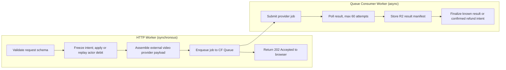
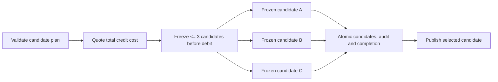

[Canonical PRD/TAD and section index](./agentic-graph-strytree-prd-tad-adr-mvp-gtm.md).

## C8. AI Harness Contract

### Component: external video provider Generation Harness

**Responsibility**: The harness validates a typed Strytree generation request, constructs the provider payload, executes a bounded external video provider job when server-side credentials and media refs exist, stores R2 result manifests, and emits cost/audit logs. If credentials are absent in local/demo mode, the same Queue consumer writes a provider-safe local manifest without exposing any provider key to the browser.

**Input schema**:

```json
{
  "job_id": "string",
  "user_id": "string",
  "story_id": "string",
  "parent_node_id": "string",
  "prompt": "string",
  "image_references": [
    {
      "type": "subject | background",
      "img_id": "string",
      "ref_name": "string"
    }
  ],
  "negative_prompt": "string",
  "model": "string",
  "duration": "number",
  "quality": "string",
  "aspect_ratio": "string",
  "motion_mode": "string",
  "camera_movement": "string",
  "seed": "number"
}
```

**Output schema**:

```json
{
  "job_id": "string",
  "status": "succeeded | failed | moderated | timed_out",
  "provider_job_id": "string",
  "video_object_key": "string",
  "thumbnail_object_key": "string",
  "synopsis": "string",
  "error_code": "string",
  "error_message": "string"
}
```

**Cost log fields**:

```json
{
  "provider": "external_video_provider",
  "model": "v6",
  "credit_cost": 5,
  "provider_cost_usd_estimate": 0,
  "prompt_tokens": 0,
  "completion_tokens": 0,
  "cache_hits": 0,
  "elapsed_ms": 0
}
```

**Token budget**:

Strytree uses two token concepts:

- App credit tokens: spendable wallet credits for generation and unlock.
- AI/model tokens: provider/LLM accounting fields required by the PRD/TAD guideline.

external video provider video calls may not expose LLM prompt/completion tokens. The harness still records prompt length, credit cost, provider job duration, and estimated provider cost. If a future LLM prompt enhancer is added, it must emit `{ model, prompt_tokens, completion_tokens, cache_hits, estimated_cost_usd }`.

**Orchestration topology**:

Sequential dispatch and consumption: the HTTP handler freezes a D1 request intent, applies/replays the authoritative debit, and claims bounded enqueue work. The Queue consumer uses a renewable 120-second lease and attempt token, persists provider identity before bounded polling, and freezes finalization bytes before R2 writes. Request identity drift conflicts; delivery retries reuse the recorded intent.



**Max-iteration bound**: 60 polls per leased attempt. Unknown provider submission outcomes retain the debit for reconciliation; timeout alone authorizes neither a second submission nor a refund. A known job id resumes polling, and a frozen finalization result resumes artifact writes without repeating provider work.

**Circuit breaker**:

- Stop polling after configured timeout.
- Stop before provider call when user balance is insufficient.
- Stop before provider call when daily provider budget is exhausted. `STRYTREE_DAILY_PROVIDER_BUDGET_CENTS=0` disables the breaker for local/demo mode; when the limit is positive, the Worker reads `STRYTREE_PROVIDER_BUDGET_KV` from the payment Worker Cloudflare KV binding and returns `provider_budget_exceeded` before debit/enqueue if spend is at or above the limit.
- Stop after moderation failure and do not publish public branch.

**Fallback path**:

Return structured fallback artifact:

```json
{
  "status": "failed",
  "fallback_type": "prompt_artifact",
  "compiled_prompt": "string",
  "selected_assets": [],
  "error_code": "provider_unavailable"
}
```

### Component: ForkCompare Candidate Harness

**Responsibility**: The existing candidate owner freezes up to three deterministic alternatives and normalized scorecards in a versioned preparing intent, applies/replays its debit, and completes candidates/audit/run in one native D1 batch. It neither submits candidate-only queue messages nor invokes the generation provider. Public story mutation requires a separate verified publication batch.

**Input schema**:

```json
{
  "candidate_run_id": "string",
  "user_id": "string",
  "story_id": "string",
  "parent_node_id": "string",
  "max_candidates": 3,
  "prompt": "string",
  "selected_asset_ids": ["string"],
  "options": {
    "duration_seconds": "number",
    "quality": "string",
    "aspect_ratio": "string",
    "scorecard_mode": "cost_continuity"
  }
}
```

**Output schema**:

```json
{
  "candidate_run_id": "string",
  "status": "preparing | completed",
  "scorecards": [
    {
      "candidate_id": "string",
      "provider": "string",
      "status": "succeeded | failed | fallback",
      "credit_cost": "number",
      "elapsed_ms": "number",
      "inherited_asset_count": "number",
      "continuity_score": "number",
      "moderation_status": "approved | pending | rejected",
      "publish_eligible": "boolean"
    }
  ]
}
```

**Cost log fields**:

```json
{
  "provider": "forkcompare",
  "candidate_count": 3,
  "credit_cost_total": 15,
  "prompt_tokens": 0,
  "completion_tokens": 0,
  "cache_hits": 0,
  "elapsed_ms": 0
}
```

**Token budget**:

The MVP scorecard uses deterministic heuristics over the frozen request and available metadata: inherited asset count, prompt length, moderation state, and credit cost. Provider/elapsed fields are not evidence of an external generation run. It must not add hidden LLM calls. If a future scorer uses Workers AI or another model, it must be feature-flagged and capped to one scorer pass per candidate run with explicit `{ model, prompt_tokens, completion_tokens, cache_hits, estimated_cost_usd }`.

**Orchestration topology**:

Bounded local preparation followed by two durable boundaries: a preparing D1 intent precedes the actor debit; one D1 batch then completes the frozen candidates and audit. Publication is another atomic D1 batch. An interrupted request retries its recorded content instead of generating a new plan.



**Max-iteration bound**:

- Integer `1 <= max_candidates <= 3`; request JSON <= 32 KiB and client key <= 512 characters.
- `max_provider_calls = 0` for current candidate preparation.
- One deterministic scorecard preparation per frozen plan; retries reuse it.
- Provider polling belongs to the separate generation harness.

**Circuit breaker**:

- Stop before debit when requested candidate count exceeds bound.
- Stop before a new debit when balance is insufficient; an existing debit can recover despite stale projected balance.
- Require native D1 batch support before creating intent or debit; reject changed identity and incomplete legacy completion.
- Stop public publish when moderation or scorecard marks candidate ineligible.

**Fallback path**:

A preparing run exposes no scorecards. Recoverable delivery failures retain the frozen intent; partial legacy or corrupt completed records fail closed for reconciliation. Completed alternatives remain private until publication; no failed batch leaves a partial node, merge plan, audit, or snapshot increment.

## C9. Client Graph And Calculation Engine

The client may keep the lightweight prototype layout algorithm, but it must consume server snapshots.

### Layout Algorithm

1. Build `childrenByParent` from `node.parent_node_id`.
2. Compute subtree leaf height recursively.
3. Assign `x = depth * X_GAP + X_OFFSET`.
4. Assign `y = yTop + (height - 1) * Y_GAP / 2`.
5. Draw edges from parent right edge to child left edge.
6. Draw nodes as SVG groups with HTML cards through `foreignObject`.

### Derived UI State

| UI State | Source |
|---|---|
| Hot node | Server stat or client threshold over `likes_count`; default `likes_count > 100`. |
| Dropped node | `status === "dropped"`. |
| Locked node | `entitlement_hint !== "full"` and not free-window. |
| Like rate | Prefer server aggregate; client may display `likes_count / impressions_count`. |
| Active branch count | Server stat to avoid client drift. |
| Total likes | Server stat to avoid partial snapshot drift. |

### Canvas Boundary

The Strytree prototype uses `<canvas>` only for the starfield background. The story graph is SVG. agentic-graph should keep this separation:

- Canvas: optional decorative or preview-only effects.
- SVG/HTML: story graph, nodes, edges, hit targets, accessibility labels, video cards.
- Server: authoritative graph, wallet, access, and provider state.

### ForkCompare Workbench Boundary

The candidate workbench must remain a projection of server candidate-run state, not a second graph runtime:

- Candidate cards reuse existing Strybldr/Storyboard/Strytree card surfaces.
- Candidate edges are preview-only until one candidate is published as a child node.
- Candidate scorecards come from `strytree_branch_candidates`, not browser-only scoring.
- Candidate publish writes one server child node and then refreshes the normal story snapshot.
- Client state may track selection and panel open/close, but it must not own candidate cost, entitlement, moderation, or publish eligibility.

## C10. Data Flows

### Data Flow: Story Snapshot

| Stage | Component | Input Format | Output Format | Persistence | Error Handling |
|---|---|---|---|---|---|
| Ingest | Snapshot API | `story_id`, session cookie | Query params and session context | None | 401 only for private stories |
| Transform | Story Graph Service | D1 rows | Node/asset JSON snapshot | KV optional cache | Stale cache fallback |
| Store | D1/R2 | Nodes/assets/media | SQL rows/object keys | Durable | D1 transaction rollback |
| Serve | Worker API | Snapshot JSON | Browser graph state | CDN/KV | Typed API error |

### Data Flow: Credit Purchase

| Stage | Component | Input Format | Output Format | Persistence | Error Handling |
|---|---|---|---|---|---|
| Ingest | Checkout endpoint | Package id | Provider session | D1 pending payment | Invalid package rejection |
| Transform | Payment provider | Payment action | Signed webhook | Provider ledger | Provider retry |
| Store | Ledger actor + settlement owner | Verified webhook | Authoritative credit, projection, audit, completed session | Actor SQLite, then D1 | Replay existing credit and recover unfinished audit/session |
| Serve | Wallet endpoint | User id | Balance JSON | D1 derived balance | Pending state |

### Data Flow: Unlock

| Stage | Component | Input Format | Output Format | Persistence | Error Handling |
|---|---|---|---|---|---|
| Ingest | Unlock endpoint | Node id, authenticated buyer, raw key | Replay lookup | None | Owner/node/key conflict; no quote verifier |
| Transform | Access Policy + Ledger actor | Existing effect or current new price | Frozen debit/allocation | Actor SQLite, then D1 projection | New insufficient balance; failed projection requires recovery |
| Store | Unlock Service | Exact frozen ledger effect | Entitlement + count + audit | One D1 batch | Rollback loser; verify complete winner after lost acknowledgement |
| Serve | Unlock response / Snapshot API | User/node | `entitlement: full` / hint | D1 | POST proves completion; snapshot still trusts legacy entitlement rows |

### Data Flow: Generation

| Stage | Component | Input Format | Output Format | Persistence | Error Handling |
|---|---|---|---|---|---|
| Ingest | Generation endpoint (HTTP Worker) | Prompt/options/assets + session | Frozen request, actor debit, bounded enqueue claim | D1 intent; actor SQLite; Queue | Validate before debit; retry identity conflicts |
| Enqueue | Cloudflare Queue | Typed job message | Queue delivery to consumer | CF Queue (at-least-once) | Retry on consumer failure; dead-letter on max retries |
| Transform | Queue consumer → provider | Leased attempt and frozen payload | Persisted provider job id | D1 | Unknown submission requires reconciliation; confirmed failure has resumable refund |
| Store | Artifact writer (consumer) | Frozen finalization result/artifact | Exact R2 object bytes | D1 finalization intent, then R2 | Retry original artifact without provider resubmission |
| Serve | Generation status endpoint | Job id + JWT | Status/result JSON | D1 | 404 on missing job; 401 on wrong owner |

### Data Flow: Candidate Compare

| Stage | Component | Input Format | Output Format | Persistence | Error Handling |
|---|---|---|---|---|---|
| Ingest | Candidate run endpoint | Parent node, prompt, max candidates, options | Candidate run row + quote | D1 | Reject count > 3; reject insufficient balance |
| Prepare | Candidate owner | Exact request and parent metadata | Frozen deterministic candidates and digests | Versioned D1 preparing intent | No candidate queue/provider call |
| Transform | Ledger actor | Frozen candidate request | Authoritative debit/projection | Actor SQLite, then D1 | Recover same-key debit without recharging |
| Store | Candidate owner | Frozen candidates | Candidates + audit + completed run | One D1 batch | Atomic rollback; exact completion proof on retry |
| Serve | Candidate run endpoint | Candidate run id + JWT | Scorecard JSON | D1 | 404 on missing run; 401 on wrong owner |
| Merge | Candidate publish endpoint | Complete candidate + exact key/intent | Node + plan + published status + version + audit | One D1 batch | Same-key replay; changed intent/key conflict; partial evidence requires reconciliation |

## C11. Quality Attributes

| Attribute | Scenario | Pattern | Validation |
|---|---|---|---|
| Security | User modifies token balance in browser. | Server-owned ledger; UI balance read-only. | Unit tests reject client-supplied balance. |
| Security | external video provider key leaked through static JS. | Server-side harness secrets only. | Build scan for provider secrets in client bundle. |
| Consistency | Duplicate webhook arrives. | Provider event id and idempotency key unique constraints. | Replay webhook fixture twice. |
| Consistency | Double-click unlock button. | Idempotent unlock key and unique `(user_id, node_id)`. | Parallel unlock test. |
| Performance | Story tree loads under normal branch counts. | KV cached snapshot plus client SVG layout. | Browser smoke with 100, 500, 1000 nodes. |
| Scalability | Hot story gets many reads. | Cache public snapshots; D1 for writes. | Load test snapshot route. |
| Observability | Provider generation fails. | Audit event, job error, refund ledger link. | Failure fixture proves refund and audit. |
| Token Cost | Generation costs exceed budget. | Quote, debit/hold, circuit breaker, cost log. | Budget-exceeded test. |
| TCO | MVP must avoid fixed monthly infra where possible. | Cloudflare D1/R2/KV free/low tier and provider variable cost. | Monthly cost review and ADR update. |
| Token Performance | Candidate fan-out hides extra model calls. | Bounded `max_candidates <= 3`; deterministic scorecard by default; model scorer behind feature flag only. | Candidate-run test asserts provider call count and scorecard token log. |
| TCO | Candidate workbench adds a new external graph/database/hosting dependency. | Reuse existing UI surface and Cloudflare bindings; dependency guard in CI. | Stack guard test scans lockfile and route config. |

## C12. Deployment Strategy

Follow the existing agentic-graph topology:

```text
Dev repo -> Prod mirror -> Cloudflare
```

MVP deployment path:

1. Implement feature and docs in the agentic-graph dev repo root.
2. Keep static/read-only UI compatible with local preview.
3. Add Cloudflare Worker routes behind the existing Pages/Worker topology.
4. Add Cloudflare Queue binding and consumer Worker for async generation jobs.
5. Use D1 migrations for schema.
6. Use R2 for generated media and reference assets.
7. Use environment-backed secrets for payment and external video provider credentials.
8. Add ForkCompare candidate tables and routes only after the secure generation/ledger path is green.
9. Keep ForkCompare UI inside existing Strybldr/Storyboard/Strytree surfaces; no new frontend graph dependency.
10. Sync to prod mirror with the canonical pages sync path.
11. Validate with local smoke, D1 migration dry run, webhook fixture, ledger tests, Queue consumer integration test, candidate-run stack guard, and Cloudflare preview URL.

Rollback:

- Disable Strytree write routes through feature flag.
- Disable Cloudflare Queue consumer Worker binding; drain in-flight messages before disabling.
- Keep public story snapshot read-only.
- Preserve ledger and entitlement tables.
- Do not delete generated R2 media during rollback.

## C13. Traceability Matrix

The matrix states acceptance targets; a row is not an execution receipt. CID `commerce.request-efficiency.unlock`, E05, C6 and ADR-006 share the [MainPanel RAO/SVO join](./agentic-graph-mainpanel-commerce-prd-tad-adr-mvp-gtm.md#paid-unlock-recovery-status). Current paid-boundary controls run via `npm run travel-commerce:strytree-ledger:test` (native Worker/D1/DO contracts); source receipts, full-suite failures, deployment, provider collection, and creator payout remain distinct evidence.

| PRD Requirement | TAD Component | Interface | `/goal` Condition |
|---|---|---|---|
| PRD-STR-E01-AC-01 | Access Policy Service | Public snapshot (no session) | Anonymous-access tests pass: public snapshot returns without auth. |
| PRD-STR-E01-AC-02 | Auth Middleware | All value-changing endpoints | Auth-gate tests pass: generation/unlock/publish return 401 without session. |
| PRD-STR-E01-AC-03 | Access Policy Service | Account linking endpoint | Account-linking tests pass: entitlements migrate; no duplicates. |
| PRD-STR-E02-AC-01 | Story Graph Service | GET /api/strytree/stories/:id/tree | Snapshot API tests pass: all D1 nodes returned with parent_node_id and entitlement_hint. |
| PRD-STR-E02-AC-02 | Story Graph Service | POST publish | Publish tests pass: child node persists in D1; reload returns it. |
| PRD-STR-E02-AC-03 | Storytree SVG Renderer (client) | Client-side edge derivation | Graph-render unit tests pass: edges derived from parent_node_id; no edge table query. |
| PRD-STR-E03-AC-01 | Credit Ledger Service | Ledger debit API | Ledger-debit tests pass: event exists before provider call. |
| PRD-STR-E03-AC-02 | Credit Ledger Service | Ledger finalize API | Ledger-finalize tests pass: no refund event after success. |
| PRD-STR-E03-AC-03 | Credit Ledger Service + Queue Consumer | Refund path | Ledger-refund tests pass: refund event linked to debit after provider failure. |
| PRD-STR-E03-AC-04 | Credit Ledger Service | Idempotency key constraint | Idempotency tests pass: duplicate submission produces one ledger event. |
| PRD-STR-E04-AC-01 | Commerce Adapter | POST /api/strytree/checkout/sessions | Checkout tests pass: session returned; no ledger event at creation. |
| PRD-STR-E04-AC-02 | Commerce Adapter + Ledger Service | `POST /api/strytree/checkout/sessions/:id/complete` and production webhook handler | Native settlement tests: one authoritative credit and completed audit/session per valid fixture; live provider collection requires separate evidence. |
| PRD-STR-E04-AC-03 | Credit Ledger Service | GET /api/strytree/wallet | Wallet-pending tests pass: pending status before webhook credit. |
| PRD-STR-E04-AC-04 | Commerce Adapter | Webhook idempotency | Replay tests pass: second webhook produces no duplicate event. |
| PRD-STR-E05-AC-01 | Unlock Transaction Service | POST /api/strytree/nodes/:nodeId/unlock | Native ledger/API contracts: one frozen debit and one complete entitlement/count/audit; allocation metadata is not creator payout. |
| PRD-STR-E05-AC-02 | Unlock Transaction Service | POST unlock (repeat) | Native API contracts: interrupted or concurrent same-key retry recovers the original price/allocation with no new debit. |
| PRD-STR-E05-AC-03 | Unlock Transaction Service + Ledger | POST unlock (insufficient) | Native ledger/API contracts: a new insufficient unlock returns 402 without a debit or entitlement; existing paid recovery is checked first. |
| PRD-STR-E06-AC-01 | Generation Harness | Asset inheritance loader | Asset-inheritance tests pass: modal receives ancestor asset_ids. |
| PRD-STR-E06-AC-02 | Generation Harness | POST /api/strytree/generation-jobs (schema) | Harness-validation tests pass: malformed requests rejected before debit. |
| PRD-STR-E06-AC-03 | Generation Harness + Auth Middleware | Worker env secrets | Credential-audit passes: no API key in client bundle. |
| PRD-STR-E06-AC-04 | Queue Consumer Worker | Fallback path | Fallback tests pass: structured fallback returned; refund ledger event exists. |
| PRD-STR-E07-AC-01 | Audit Event Service | Audit insert on all value-changing paths | Audit-coverage tests pass: one event per fixture action. |
| PRD-STR-E07-AC-02 | Generation Harness + KV budget counter | Circuit breaker | Circuit-breaker tests pass: 429 when budget counter at limit. |
| PRD-STR-E07-AC-03 | Story Graph Service | Moderation gate in snapshot | Moderation-gate tests pass: pending/rejected nodes absent from public snapshot. |
| PRD-STR-E08-AC-01 | Candidate Run Service | POST /api/strytree/candidate-runs | Candidate-run tests pass: bounded run inserted; count > 3 rejected before debit. |
| PRD-STR-E08-AC-02 | Candidate Scorecard Harness | GET /api/strytree/candidate-runs/:id | Candidate-scorecard tests pass: scorecard fields present for every candidate. |
| PRD-STR-E08-AC-03 | Candidate Run Service + Story Graph Service | POST /api/strytree/candidates/:candidateId/publish | Candidate-merge tests pass: exactly one selected candidate becomes a public child node. |
| PRD-STR-E08-AC-04 | ForkCompare Workbench | Existing Strybldr/Storyboard/Strytree UI | Stack guard passes: no new graph UI package, hosted database SDK, or non-Cloudflare deploy target. |

---
