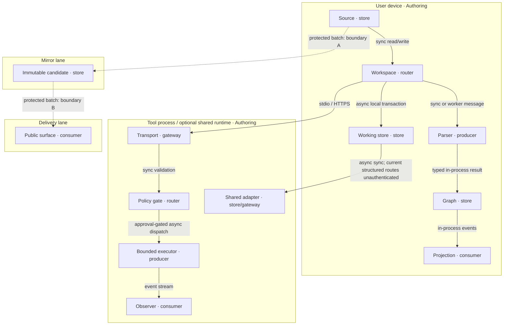

# Source-Native Graph Workspace Technical Architecture

## Authority

This document owns the neutral component, flow, topology, quality, and lane contracts for a
source-native graph workspace. The product requirements own user value; the decision companion owns
alternatives and rationale. Reference implementation names appear only in the final labelled section.

The local rung is `spec-complete`: every component has a VCC, but no satisfying Evidence Reference
is attached. The delivered rung is `undocumented`: no qualifying Mirror result, Delivery result,
or operator instruction is attached.

## Architecture overview

One readable source is ingested, validated, parsed to a renderer-neutral graph, projected into an
interactive workspace, and persisted through the active source owner. Optional shared storage and
bounded automation remain adapters. Promotion moves only through Authoring → Mirror → Delivery.

## Journey → system mapping

| Journey stage | Workflow | Data flow | Harness flow | Topology nodes | Components |
|---|---|---|---|---|---|
| Builder—Discover | W1 open source | DF1 source ingest | H0 deterministic | Source, Workspace, Parser | Source owner, Parser |
| Builder—Engage | W2 project graph | DF2 graph projection | H0 deterministic | Graph, Projection | Graph store, Renderer |
| Builder—Complete | W1 local transform | DF1 source/artifact | H0 deterministic | Workspace, Parser, Working store | Source owner, Local transformer |
| Reviewer—Discover | W0 discover capability | DF0 catalog | H0 deterministic | Host, Transport | Transport catalog |
| Reviewer—Engage | W3 bounded operation | DF3 request/result | H1 optional model-backed | Gate, Executor, Observer | Policy gate, Harness |
| Builder—Return | W4 persist/sync | DF4 revision reconciliation | H0 deterministic | Working store, Shared adapter | Persistence adapters |
| Operator—Complete | W5 promote exact state | DF5 candidate/receipt | H0 deterministic | Mirror, Delivery | Release controller |

## Topology: Source-native workspace v3 — 2026-07-30

**Boundaries**: user device, local tool process, optional shared runtime, mirror artifact boundary,
and public delivery boundary.

| Node | Role | Type | Lane | Connects to | Connection type | Data residency |
|---|---|---|---|---|---|---|
| Source | Store | readable file/source entry | Authoring | Workspace | sync file/read API | user-selected authoring root |
| Workspace | Router/Consumer | browser or desktop client | Authoring | Parser, Graph, Working store, Transport | sync calls + local events | user device memory |
| Parser | Producer | deterministic library/worker | Authoring | Graph | sync or worker message | volatile memory |
| Graph | Store | typed application state | Authoring | Projection, Workspace | in-process events | user device memory |
| Projection | Consumer | interactive renderer | Authoring | Graph | in-process events | user device |
| Working store | Store | local database/file adapter | Authoring | Workspace, Shared adapter | async local transaction | user device |
| Transport | Gateway | local or configured remote adapter | Authoring | Gate | stdio, HTTPS, or stream | declared per adapter |
| Gate | Router | schema/policy/approval component | Authoring | Executor, Observer | sync validation + async dispatch | request-scoped memory |
| Executor | Producer | bounded deterministic/model harness | Authoring | Observer, Consumer | async call/event stream | declared per harness |
| Shared adapter | Store/Gateway | optional sync/blob/room service | Authoring | Working store | HTTPS/WebSocket; auth state explicit per adapter | declared region/service |
| Mirror | Store | immutable candidate artifact | Mirror | Delivery | protected batch publication | mirror artifact store |
| Delivery | Consumer | public read/runtime surface | Delivery | public user | HTTPS | declared delivery region |

**Version note**: v3 establishes the first canonical three-lane topology. It replaces direct
Authoring-to-Delivery language; the superseded product-specific topology decision is retained as an
archive and does not authorize deployment.

## Workflow W0 — Discover a capability

**Trigger**: a user interface, CLI, or host requests capabilities.
**Actors**: host, transport catalog, operator.

**Happy path**:
1. Host identifies its trust boundary and asks one transport for descriptors.
2. Catalog returns owned schemas, annotations, configuration state, and availability.
3. Host selects one supported capability.

**Alternate path**: another transport is selected when policy requires a different trust boundary.
**Error path**: unavailable/configuration-required capability returns a typed reason before spend.
**Postconditions**: the selected owner is explicit; discovery performs zero model calls.

## Workflow W1 — Open, parse, and retain source

**Trigger**: an author selects or imports a readable source.
**Actors**: author, source owner, parser, graph store, working store.

**Happy path**:
1. Source owner reads bytes and source identity.
2. Parser validates metadata/body and emits graph plus diagnostics.
3. Graph store initializes one canonical projection input.
4. Working store retains a recoverable copy when available.

**Alternate path**: an explicit in-memory adapter is selected when local persistence is unavailable.
**Error path**: malformed source returns diagnostics without a successful canonical write.
**Postconditions**: source identity and parse result are visible; failed input is not silently repaired.

## Workflow W2 — Project and edit a graph

**Trigger**: an author selects a supported projection or makes a source-affecting edit.
**Actors**: author, graph store, renderer registry, source owner.

**Happy path**:
1. Registry resolves the projection.
2. Renderer consumes shared graph/view state.
3. Source-affecting edits return through graph and source owners.

**Alternate path**: a declared fallback projection renders when the preferred renderer is unavailable.
**Error path**: unsupported mode returns a typed state without creating a second authored graph.
**Postconditions**: every projection remains traceable to the same source revision.

## Workflow W3 — Invoke a bounded operation

**Trigger**: a host submits a schema-valid operation request.
**Actors**: host, dispatcher, policy gate, executor, observer, consumer.

**Happy path**:
1. Dispatcher resolves one exact owner.
2. Gate checks schema, roots/hosts, credentials, budgets, and approvals.
3. Executor runs inside declared limits.
4. Observer records state, evidence, and cost fields.
5. Consumer previews or applies an accepted result through an existing owner.

**Alternate path**: deterministic fallback runs without a model/provider.
**Error path**: missing approval, invalid output, timeout, repeated failure, or budget exhaustion returns a
typed terminal state before undeclared mutation.
**Postconditions**: a typed result/failure and cost record are surfaced; loops are bounded.

## Workflow W4 — Persist or synchronize

**Trigger**: an author saves a revision or requests optional synchronization.
**Actors**: source owner, working store, shared adapter, conflict resolver.

**Happy path**:
1. Local revision is recorded before transport scheduling.
2. Adapter transfers canonical identity, path, revision, and payload.
3. Reconciliation records success or a visible conflict.

**Alternate path**: offline work remains queued locally.
**Error path**: ambiguous revision or transport failure remains in outbox/conflict state.
**Postconditions**: local recovery remains possible; no conflict is silently overwritten.

## Workflow W5 — Promote an exact state

**Trigger**: an operator requests promotion of an exact reviewed revision.
**Actors**: operator, protected controller, mirror verifier, delivery verifier.

**Happy path**:
1. Controller verifies exact revision and Authoring evidence.
2. Mirror verifier creates and checks an immutable candidate.
3. A separate operator instruction opens the Mirror-to-Delivery boundary.
4. Delivery verifier records live result and rollback target.

**Alternate path**: review ends after mirror verification with no public mutation.
**Error path**: stale revision, missing instruction, or failed check leaves the next lane unchanged.
**Postconditions**: promotion receipt names both boundaries, evidence, instruction, and rollback state.

## Data flows

### DF0 — Capability catalog

| Stage | Component | Input | Output | Persistence | Error handling |
|---|---|---|---|---|---|
| Ingest | Transport | host/trust context | catalog request | none | reject invalid host context |
| Transform | Catalog | owned descriptors | typed availability entries | request-scoped | mark partial/unavailable |
| Store | none | — | — | none | — |
| Serve | Transport | catalog request | descriptors + configuration state | none | typed unavailable result |

### DF1 — Source to graph

| Stage | Component | Input | Output | Persistence | Error handling |
|---|---|---|---|---|---|
| Ingest | Source owner | bytes + identity | source record | versioned/user-controlled source | typed read error |
| Transform | Parser | source record | graph + diagnostics | volatile | fail closed on malformed canonical fields |
| Store | Working store | source/graph snapshot | recoverable record | user policy; local device | explicit memory fallback |
| Serve | Workspace | graph + diagnostics | visible source/projection | active session | error panel; no silent repair |

### DF2 — Graph to projection

| Stage | Component | Input | Output | Persistence | Error handling |
|---|---|---|---|---|---|
| Ingest | Registry | graph + view config | renderer selection | none | typed unsupported mode |
| Transform | Renderer | renderer-neutral graph | scene/view | view-scoped | bounded fallback |
| Store | Graph store | accepted mutation | graph revision | active source policy | reject invalid mutation |
| Serve | Projection | scene/view | interactive surface | session | visible render error |

### DF3 — Operation request to result

| Stage | Component | Input | Output | Persistence | Error handling |
|---|---|---|---|---|---|
| Ingest | Dispatcher | typed request | routed request | none | reject before spend |
| Transform | Gate/Executor | routed request | result/failure + trace/cost | run-scoped | bounded retry/circuit-breaker |
| Store | Observer | evidence/cost events | run record | harness retention policy | log gap blocks further spend by policy |
| Serve | Consumer | typed result | preview or approved artifact | source owner only after approval | propagate typed failure |

### DF4 — Local revision to shared projection

| Stage | Component | Input | Output | Persistence | Error handling |
|---|---|---|---|---|---|
| Ingest | Working store | source revision | durable local record/outbox | user device | retain unsaved/pending state |
| Transform | Shared adapter | revision/path/payload | remote request | transport-scoped | retry within bound |
| Store | Shared service | record/object/room update | shared projection | declared region/retention | conflict, auth, or quota result |
| Serve | Reconciler | local + remote state | applied revision/conflict | local conflict history | never last-write-win silently |

### DF5 — Reviewed source to delivery receipt

| Stage | Component | Input | Output | Persistence | Error handling |
|---|---|---|---|---|---|
| Ingest | Protected controller | exact revision + evidence | qualified source | protected logs | reject stale candidate |
| Transform | Mirror verifier | qualified source | immutable candidate/digest | mirror artifact store | discard failed candidate |
| Store | Delivery controller | approved candidate | delivered revision + prior state | delivery platform | rollback on failed live check |
| Serve | Receipt recorder | checks/instruction/results | immutable receipt | protected evidence store | mark incomplete; no positive claim |

## Orchestration/Harness Flow H0 — Deterministic operation

**Trigger**: a read, parse, render, storage, or release-control request needs no model.
**Topology pattern**: Sequential | **Max iterations**: 1 | **Circuit-breaker**: any typed failure.
**Token budget**: 0 prompt + 0 completion @ 100% no-model path = $0/call.

| Role | Component | Input schema | Output schema | Cost log | Fallback |
|---|---|---|---|---|---|
| Dispatcher | Contract gate | `{action, sourceRevision, options}` | `{validatedAction}` | zero-call record | typed rejection |
| Executor | Deterministic owner | `{validatedAction}` | `{result, diagnostics}` | zero-call record | typed error |
| Observer | Evidence recorder | terminal event | `{check, result, surface}` | records zero totals | visible evidence gap |
| Consumer | Existing source/view owner | typed result | preview/artifact/state | — | upstream error |

Happy path validates once, executes once, records a zero-cost terminal state, and returns a typed
result. Invalid input or unavailable dependencies stop before side effects. Postcondition: no model
or paid-provider call occurs.

## Orchestration/Harness Flow H1 — Optional model-backed operation

**Trigger**: an explicitly selected capability requires a model/provider.
**Topology pattern**: Agentic loop | **Max iterations**: 8 | **Circuit-breaker**: missing approval,
budget exhaustion, repeated identical failure, or no progress for two iterations.
**Token budget**: target average 4,000 prompt + 1,000 completion @ ≥50% cache hit =
≤$0.10/call and ≤$10/month per enabled harness.

| Role | Component | Input schema | Output schema | Cost log | Fallback |
|---|---|---|---|---|---|
| Dispatcher | Runtime router | `{action, context, approvalRef?, budget}` | `{owner, boundedInput}` | — | reject before spend |
| Executor | Model/provider harness | `{boundedInput, iteration}` | `{typedOutput, proof}` | `{model,prompt_tokens,completion_tokens,cache_hits,estimated_cost_usd}` | deterministic/degraded path or error |
| Observer | Run/cost recorder | trace + cost events | `{state, totals, alerts}` | required per call | stop further spend on missing log |
| Consumer | Source/artifact owner | typed output | preview or approved revision | — | preserve source; propagate error |

Happy path validates input and approval, executes within the current iteration, validates output,
records cost, and exits when the typed goal is met. Invalid input stops before spend; invalid output
retries only within the bound. Provider failure uses a declared degraded path or returns an upstream
error. Postcondition: every call is costed and the consumer receives a typed result or terminal error.

## Integration contracts

| Interface | Protocol/format | Input | Output | Error strategy |
|---|---|---|---|---|
| Source owner | file/read API; Markdown + YAML | path/id, bytes, revision | source record | typed read/save error; atomic owner |
| Parser | in-process/worker; typed objects | source record + mode | graph + diagnostics | deterministic failure; no source repair |
| Graph/renderer | in-process events | graph mutation/view config | graph revision/projection | reject invalid mutation/mode |
| Tool transport | stdio/HTTPS/stream; typed JSON | descriptor/invocation | result/failure | configuration-required or policy rejection |
| Harness | typed run contract | plan, bounds, approvals, adapters | state, trace, cost, artifacts | bounded retry and terminal state |
| Storage adapter | local transaction or HTTPS/WebSocket | workspace/path/revision/payload | success/conflict | explicit outbox/conflict; absent auth enforcement is surfaced |
| Release controller | protected workflow; immutable manifest | exact revision, evidence, instruction | candidate/receipt/rollback | fail closed; previous lane unchanged |

## Component specifications and VCC conditions

| TAD component | Interface | VCC | Component responsibility (SVO) | Interfaces / dependencies / configuration | FOSS posture | End state | Stated check | Constraint | Local rung | Delivered rung |
|---|---|---|---|---|---|---|---|---|---|---|
| `TAD-CORE-C01` | `I-WORKSPACE` | VCC-T1 | Workspace composes user surfaces | Source, Graph, Transport; feature flags | FOSS client | client type/build contracts pass | client build check exits 0 | no generated docs accepted silently | `spec-complete` | `undocumented` |
| `TAD-CORE-C02` | `I-GRAPH` | VCC-T2 | Graph store owns canonical graph state | typed graph mutations; store config | FOSS state store | graph/store tests pass | client graph check exits 0 | no renderer-authored duplicate | `spec-complete` | `undocumented` |
| `TAD-CORE-C03` | `I-PARSE` | VCC-T3 | Parser converts source deterministically | typed source record → typed graph; parse modes | FOSS parser stack | canonical positive/negative fixtures pass | canonical source check exits 0 | source bytes unchanged on failure | `spec-complete` | `undocumented` |
| `TAD-CORE-C04` | `I-PROJECTION` | VCC-T4 | Registry selects renderer projections | graph + renderer config | FOSS adapters | registry/projection suites pass | client contract and projection checks exit 0 | registry remains selection authority | `spec-complete` | `undocumented` |
| `TAD-CORE-C05` | `I-SOURCE` | VCC-T5 | Source owner reads and writes active source | source identity/revision; workspace settings | FOSS/file APIs | save/reopen suites pass | client source check exits 0 | only selected source changes | `spec-complete` | `undocumented` |
| `TAD-CORE-C06` | `I-CLI` | VCC-T6 | Local transformer emits offline artifacts | command arguments/files; configuration | FOSS runtime | parser unit suites pass | offline parser check exits 0 | no network/provider call | `spec-complete` | `undocumented` |
| `TAD-CORE-C07` | `I-LOCAL-TOOL` | VCC-T7 | Local transport exposes typed bounded tools | stdio descriptors/executors; environment/allowlists | FOSS protocol | local transport and harness suites pass | runtime contract check exits 0 | descriptor never grants permission | `spec-complete` | `undocumented` |
| `TAD-CORE-C08` | `I-REMOTE-TOOL` | VCC-T8 | Remote control adapter exposes its owned catalog | authenticated transport; environment policy | FOSS-compatible protocol | remote registry/transport suites pass | runtime contract check exits 0 | public read catalog remains separate | `spec-complete` | `undocumented` |
| `TAD-CORE-C09` | `I-WORKING-STORE` | VCC-T9 | Working store retains recoverable local state | local database/file; memory fallback | browser-native/FOSS | persistence/fallback suites pass | client persistence check exits 0 | fallback is explicit, not a durability claim | `spec-complete` | `undocumented` |
| `TAD-CORE-C10` | `I-SHARED-STORE` | VCC-T10 | Shared adapter synchronizes typed projections | sync/blob/room interfaces with adapter-specific auth state | swappable/FOSS alternatives | storage/relay suites pass and security gaps remain explicit | runtime contract check exits 0 | current structured push/pull/export routes are unauthenticated and cannot support a delivery claim | `spec-complete` | `undocumented` |
| `TAD-CORE-C11` | `I-PROMOTION` | VCC-T11 | Release controller promotes exact whole states | protected manifest/evidence/instruction | provider-neutral integration controller | exact candidate, receipt, and rollback checks pass | protected workflows report success | no direct Authoring→Delivery mutation | `spec-complete` | `undocumented` |

## Bidirectional PRD ↔ TAD ↔ VCC register

| PRD requirement | TAD component ↔ interface | PRD VCC ↔ TAD VCC | Workflow/data/harness | Evidence Reference |
|---|---|---|---|---|
| `PRD-CORE-R1` | `TAD-CORE-C03` ↔ `I-PARSE`; `TAD-CORE-C05` ↔ `I-SOURCE` | `VCC-PRD-R1` ↔ `VCC-T3`, `VCC-T5` | W1/DF1/H0 | not recorded |
| `PRD-CORE-R2` | `TAD-CORE-C02` ↔ `I-GRAPH`; `TAD-CORE-C04` ↔ `I-PROJECTION` | `VCC-PRD-R2` ↔ `VCC-T2`, `VCC-T4` | W2/DF2/H0 | not recorded |
| `PRD-CORE-R3` | `TAD-CORE-C01` ↔ `I-WORKSPACE`; `TAD-CORE-C06` ↔ `I-CLI` | `VCC-PRD-R3` ↔ `VCC-T1`, `VCC-T6` | W1/DF1/H0 | not recorded |
| `PRD-CORE-R4` | `TAD-CORE-C07` ↔ `I-LOCAL-TOOL`; `TAD-CORE-C08` ↔ `I-REMOTE-TOOL` | `VCC-PRD-R4` ↔ `VCC-T7`, `VCC-T8` | W0/DF0/H0 | not recorded |
| `PRD-CORE-R5` | `TAD-CORE-C07` ↔ `I-LOCAL-TOOL`; `TAD-CORE-C08` ↔ `I-REMOTE-TOOL` | `VCC-PRD-R5` ↔ `VCC-T7`, `VCC-T8` | W3/DF3/H1 | not recorded |
| `PRD-CORE-R6` | `TAD-CORE-C09` ↔ `I-WORKING-STORE`; `TAD-CORE-C10` ↔ `I-SHARED-STORE` | `VCC-PRD-R6` ↔ `VCC-T9`, `VCC-T10` | W4/DF4/H0 | not recorded |
| `PRD-CORE-R7` | `TAD-CORE-C11` ↔ `I-PROMOTION` | `VCC-PRD-R7` ↔ `VCC-T11` | W5/DF5/H0 | not recorded |
| `PRD-CORE-R8` | `TAD-CORE-C01` ↔ `I-WORKSPACE`; `TAD-CORE-C04` ↔ `I-PROJECTION` | `VCC-PRD-R8` ↔ `VCC-T1`, `VCC-T4` | W0–W5/DF0–DF5/H0–H1 | not recorded |

## Quality attributes

| Attribute | Scenario | Target/pattern | Validation |
|---|---|---|---|
| Performance | canonical source opened locally | visible projection ≤2 seconds after read | timed clean fixture |
| Scalability | declared size limit reached | cancellation or typed limit, never indefinite block | large-fixture bound |
| Security/privacy | source or provider secret crosses client/log boundary | zero credential values in source/client output | secret-canary check |
| Observability | bounded run terminates | one terminal state and cost record per call | ledger completeness |
| Token cost | minimum path / optional path | 0; optional ≤4k+1k at ≥50% cache hit | cost-log sampling |
| Offline behavior | network unavailable after initial load | local open/edit/project remains usable | airplane-mode save/reopen |
| Device reach | 375×812 and keyboard-only | no horizontal overflow; controls reachable | mobile/accessibility pass |
| TCO | deployment model selected | budget recorded and ≤approved 12-month ceiling | monthly cost audit |
| Recoverability | sync/run/release fails | prior local or delivered state remains identifiable | recovery/rollback check |

## Deployment-model TCO

Cash estimates exclude operator labor and must be replaced with actuals before selection.

| Model | Infra/month | Egress/month | Token/month | 12-month cash estimate | Ops burden | Default |
|---|---:|---:|---:|---:|---|---|
| Local/self-managed minimum | $0 incremental | $0 | $0 | $0 | low; backups owned by operator | chosen minimum |
| Managed static/edge | $0–25 | $0–10 | $0–10 | $0–540 | low/medium | optional |
| Hybrid local + selected managed adapters | $0–35 | $0–15 | $0–10 | $0–720 | medium/high | only with measured value |
| FOSS self-hosted shared runtime | $10–100 | $0–25 | $0–10 | $120–1,620 | high; patching/backups | portability fallback |

## Lane topology

| Lane | Function | Mutation rights | Residency | Default readiness ceiling |
|---|---|---|---|---|
| Authoring | write and prove source locally | scoped source, tests, local state | developer/user environment | `runtime-ready` |
| Mirror | hold an immutable non-public candidate | publish-only from approved Authoring state | mirror artifact store | `runtime-ready` |
| Delivery | expose an approved whole state | publish-only from approved Mirror state | declared delivery region | `production-verified` |

## Deploy Boundary Register

| Boundary | From lane | To lane | Evidence Reference | Operator instruction | Rollback statement and check | State |
|---|---|---|---|---|---|---|
| `SOURCE-TO-MIRROR` | Authoring | Mirror | ER-B1: mirror verify job; result `not recorded` | `none` | discard candidate, rerun verify, compare immutable digest | `closed` |
| `MIRROR-TO-DELIVERY` | Mirror | Delivery | ER-B2: protected live check; result `not recorded` | `none` | reconstruct prior approved revision, republish through both boundaries, rerun live check | `closed` |

## Readiness Gap Matrix

Local and delivered rungs are independent. Priority is the highest severity of a linked current
finding; `none` records an evidence gap with no separate defect.

| Workstream | Local rung | Delivered rung | Gap | Priority | Exit criteria (VCC) |
|---|---|---|---|---|---|
| Source, parser, and workspace | `spec-complete` | `undocumented` | no satisfying source, parser, or delivery Evidence Reference | none | `VCC-T1`, `VCC-T3`, `VCC-T5`, and `VCC-T6` are satisfied |
| Graph and projections | `spec-complete` | `undocumented` | graph, projection, device, and accessibility results are unrecorded | none | `VCC-T2` and `VCC-T4` are satisfied with named local results |
| Tool transports and bounded harness | `spec-complete` | `undocumented` | current model-backed harness lacks the complete canonical token/cost proof | major | `VCC-T7` and `VCC-T8` prove contracts, bounds, approvals, terminal state, and cost fields |
| Working and shared storage | `spec-complete` | `undocumented` | current structured push/pull/export routes lack authorization enforcement | blocker | `VCC-T9` and `VCC-T10` prove recovery, authorization, conflicts, retention, and rollback |
| Exact-state promotion | `spec-complete` | `undocumented` | mirror/live results and operator instruction are absent | none | `VCC-T11` carries satisfying Authoring, Mirror, and Delivery Evidence References |

## VCC and Evidence Reference register

The rows record an absence, not a satisfying result. Therefore every component remains
`spec-complete` and Delivery remains `undocumented`.

| VCC | Named check | Recorded result | Surface | Derived rung |
|---|---|---|---|---|
| VCC-T1, VCC-T2, VCC-T3, VCC-T4, VCC-T5, VCC-T9 | canonical client/source validation host | not recorded for this revision | authoring | `spec-complete` |
| VCC-T6 | canonical offline parser validation host | not recorded for this revision | authoring | `spec-complete` |
| VCC-T7, VCC-T8, VCC-T10 | canonical runtime contract validation host | not recorded for this revision | authoring | `spec-complete` |
| Documentation structure | canonical documentation validation host | not recorded for this revision | authoring | `spec-complete` |
| VCC-T11 Authoring | protected integration workflow | not recorded for this revision | authoring | `spec-complete` |
| VCC-T11 Mirror | protected release qualification | not recorded for this revision | mirror | `undocumented` |
| VCC-T11 Delivery | protected live verification | not recorded for this revision | delivery | `undocumented` |

## Known gaps

- Clean-environment TTV, supported scale, accessibility, device, and offline limits are unmeasured.
- Optional model harnesses do not inherit the H1 budget; each needs an attached cost-log VCC.
- Source/component checks are not protected integration, mirror, provider, or delivery proof.
- Shared adapters require separate auth, retention, residency, migration, and rollback evidence.
- Wider feature documents may retain legacy metadata; they do not override this core owner.

## Reference implementation: agentic-graph repository

### Runtime and package mapping

| Neutral component | Current owner | Implementation note |
|---|---|---|
| Workspace | `canvas/` | one React/Vite/PWA application; composed panels and routes |
| Graph store | `canvas/src/hooks/useGraphStore.ts` | Zustand composition |
| Parser | `canvas/src/lib/parsers/markdownJsonLd.impl.ts` and registry | TypeScript library/worker, not an HTTP backend |
| Renderer registry | `canvas/src/lib/config.render.ts` | twelve current 2D ids; separate lazy 3D path |
| Source owner | `canvas/src/features/source-files/` | source selection/materialization/persistence handoff |
| Offline transformer | `agentic_graph_parser/` | Python CLI/parser/harness, not a web service |
| Local transport | `mcp/server.js` and `mcp/local-tool-contract.js` | stdio; broad descriptors with configuration-gated executors |
| Remote control adapter | `cloudflare/workers/agentic-graph-mcp/` | ten-tool source registry; separate deployment and bearer boundary |
| Working store | browser IndexedDB/Dexie plus memory fallback | local documents/chunks/snapshots/outbox/cursor |
| Shared adapter | `cloudflare/workers/agentic-graph-storage/` | D1/R2/Durable Object source owners; optional KV is not assumed live |
| Protected controller | `.github/workflows/integration.yml`, `runtime-gate.yml`, `release.yml` | manual release; ordinary main pushes do not deploy |

| Neutral validation host | Reference implementation command |
|---|---|
| canonical client/source validation host | `npm run check && npm test` |
| canonical offline parser validation host | `python3 -m unittest discover -s agentic_graph_parser -p '*_test.py'` |
| canonical runtime contract validation host | `npm run runtime:test` |
| canonical documentation validation host | `npm --prefix canvas run doc:lint && npm --prefix canvas run doc:sanity` |

The current renderer registry owns `d3`, `dashboard`, `gallery`, `media`, `flowchart`,
`multiDimTable`, `gitGraph`, `gantt`, `flow`, `animatic`, `storyboard`, and `design`.

The repository does not use PostgreSQL, Redis, Elasticsearch, RabbitMQ, Kubernetes, or an S3
backend as core dependencies. LangGraph and DeerFlow are not core executing runtimes.

The production release workflow deploys the Pages candidate and documentation seed, verifies the
surface, and publishes the mirror. Storage, payment, and MCP Worker deploy scripts remain separate
operator capabilities; source presence is not delivery evidence.

### Current harness gap

The normative H1 contract is not a statement that every current harness satisfies it. In
particular, the Python SuperAgent `RunBudget` currently bounds steps, retries, wall time, and
concurrency but does not declare prompt/completion/cost limits or emit the canonical cost-log fields.
VCC-T7 therefore remains unsatisfied until an exact check proves the full contract.

### Reference documents

- Product requirements: `docs/documents/agentic-graph-prd.md`
- Decision companion: `docs/documents/agentic-graph-architecture-decisions.md`
- Protected release runbook: `docs/agentic-graph-acos-deploy-runbook.md`
