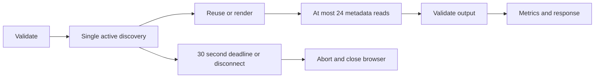
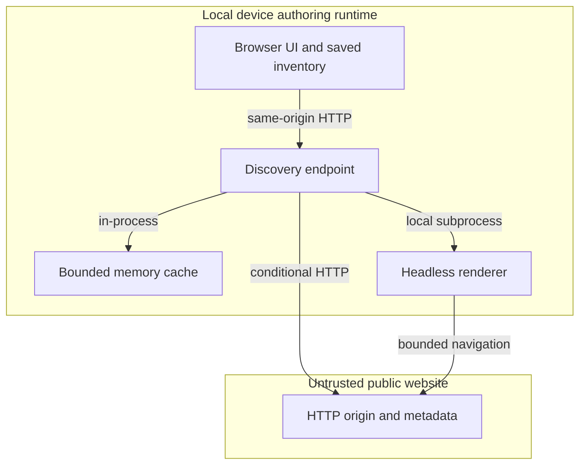

# Bounded website discovery refresh

## Continuity and scope

All five roles below join `GRAPH-WEBSITE-REFRESH-001@1.0.0`. This artifact owns refresh economy only.
The existing [document analysis and import contract](agentic-graph-document-analysis-prd-tad-adr-mvp-gtm.md)
retains ownership of discovery coverage, saved artifacts, selection, and shared overlays.
The requested [authoring guideline](https://github.com/huijoohwee/huijoohwee.github.io/blob/e3eba8ad2a8153747dd4c17f053f09d71e2c3f51/guidelines/prd-tad-adr-mvp-gtm-guidelines.md)
is version 3.3.0, inspected at source revision `e3eba8ad2a8153747dd4c17f053f09d71e2c3f51`.
Its content governs this artifact; the locator does not determine requirements.
User authorization is the current request to generate this artifact and implement the recommendations.
Scope intent: `/change #website-refresh-economy @codex`. Production boundary remains closed.

### Planning record — 2026-09-30

| PRD-TAD-ADR-MVP-GTM | CID | RAO | Updated Date |
|---|---|---|---|
| `GRAPH-WEBSITE-REFRESH-001@1.0.0` | C: discovery at source revision `895ed210bdd48ebf919584c9b0c63aefd6d3f736` launches a browser for every refresh · I: reduce repeated discovery work within explicit freshness bounds · D: Extend existing owners with bounded caching and cancellation; preserve scope safety, saved files and selection. | R: Website import maintainer · A: The maintainer implements bounded discovery refresh · O: Cold and warm refresh receipts expose time, bytes and cache reuse · check: focused discovery tests and native affected gate | 2026-09-30 |

## PRD — pain, outcome and acceptance

The operator asked, “refresh -> based on diff, or full?” and “is this time/resource/economy performant?”
Inspection found repeated browser startup and metadata downloads. This is direct evidence of a performance
concern, not measured willingness to pay. Baseline latency and total browser memory remain unmeasured.

Persona: a local workspace operator revisiting a public website's available pages before choosing an import.
Job: refresh the inventory promptly without repeatedly downloading unchanged content or losing selections.
Buyer and beneficiary may be the same operator; there is no validated payer or price.

### Journey

| Stage | Operator action | Friction / desired experience | Requirement |
|---|---|---|---|
| Trigger | Revisit website folder | Uncertainty about freshness | Explain bounded reuse in the contract |
| Discover | Open existing context toolbar | Avoid duplicated controls | Keep shared toolbar owner |
| Engage | Activate refresh | Repeated waiting and machine load | R1, R2 |
| Complete | Inspect discovered pages | Preserve source scope and selected pages | R3 |
| Return | Refresh again | Reuse recent work, observe current cost | R1, R4 |

### Must requirements and pain trace

| ID | Given / when / then | Hook → break → fix → close | Reuse / new delta | VCC |
|---|---|---|---|---|
| R1 | Given repeated discovery, when refreshed inside freshness bounds, then reuse recent rendered links and metadata; after expiry conditionally revalidate metadata. | Revisit → full repeated work → bounded cache → equivalent inventory with fewer transfers | Existing discovery and network policy; add one server cache owner | V1 |
| R2 | Given slow or overlapping requests, when refresh runs, then admit at most one discovery operation per server and cancel work at the overall deadline or disconnect. | Refresh → resource spikes / long wait → admission and deadline → explicit busy/error outcome | Existing crawler/context lifetime; add discovery-only media blocking and byte/request observation | V2 |
| R3 | Given untrusted URLs or failed refresh, when data is reused or fetched, then preserve public-target, origin/path and size checks; never overwrite saved files or fabricate freshness. | Select pages → stale or unsafe replacement → existing filters and fail-loud behavior → preserved inventory | Existing merge, parser, storage and filtering; no replacement UI | V3 |
| R4 | Given cold/warm refreshes, when validated, then surface duration, observed transfer bytes, cache hits and memory measurement scope. | Ask about economy → no evidence → counters and benchmark → falsifiable result | Existing HTTP response and deterministic tests; no telemetry service | V4 |

Should: retain useful cached metadata validators up to 24 hours, bounded by memory eviction.
Could: persistent validator storage if repeated process restarts prove costly.
Won't: complete whole-site crawling, guaranteed sitemap parity, content-diff imports, background polling,
paid services, domain rules, a new browser engine, or a second overlay.

“0” is the observed unmeasured repeated full refresh. “1” is an authoring-lane cold/warm proof for this
operator and this sprint: same discovered set; warm path avoids browser launch and reduces transferred bytes;
expired metadata observes a changed validator; deadlines and memory bounds pass deterministic checks.
Delivery to a review candidate is distinct from production use, repeat demand and collected revenue.

| Metric | Baseline | Target / observation window |
|---|---|---|
| Warm browser launches | 1 per refresh | 0 within 60 seconds, this sprint |
| Warm payload bytes | Unmeasured | Lower than cold; 0 for fresh positive cache entries |
| Refresh work duration | Navigation + waits + metadata deadlines | 30-second shared deadline; cleanup may add bounded browser shutdown time |
| Retained cache payload | None | ≤8 MiB accounted payload, ≤128 entries; overhead measured separately |
| TTV | Existing installation, no website configuration | Launch → Import URL → input website → discover; ≤4 actions and ≤35 seconds after input under responsive fixture conditions |
| Serving model tokens / provider fees | 0 / 0 | 0 / 0; local electricity, bandwidth and operator time remain unpriced |

Prioritization assumption: impact 4/5 × one observed operator / 0.5 estimated build-hours = ROI score 8,
excluding unknown operator and electricity cost. This is a ranking heuristic, not financial return.
All Must items share this small reused slice; persistent caching is lower priority until restart cost is measured.

## TAD — existing owners and contracts

### Codebase grounding — reference implementation

Grounded source revision: `895ed210bdd48ebf919584c9b0c63aefd6d3f736`, inspected before implementation.
The named implementation uses the repository's existing Node runtime and Playwright/Chromium dependency.
No external code is copied or dependency added. The requested guideline is advisory input to the native owners.

| Component / symbol | Consumer | Decision | Named verification |
|---|---|---|---|
| `websiteImportDiscovery.ts::handleWebsiteDiscovery` | Existing `/__website_import/discover` route | Extend owner: admission, deadline, metrics | `websiteImportSelection.test.ts` |
| `crawlerNetworkPolicy.ts::fetchCrawlerTextWithLimit` | Sitemap discovery and existing text requests | Extend optional response metadata / conditional headers; retain pinned public DNS policy | `websiteImportSafety.test.ts` |
| `websiteImportServerHelpers.ts::collectSitemapUrls` | Discovery and crawl jobs | Retain traversal; inject bounded cached reader only for discovery | `websiteImportSelection.test.ts` |
| `nativeWebsiteCrawler.ts::capture` | Discovery and full import | Extend discovery-only cancellation, media blocking and transfer observation | `websiteImportSelection.test.ts`, existing crawler checks |
| `websiteDiscoveryCache.ts` | Discovery endpoint only | Add single cache owner; no package extraction | Cache lifecycle tests in `websiteImportSelection.test.ts` |
| Existing selection session and shared toolbar | Source Files | Retain local ownership; no menu variant | Existing selection panel regression checks |

### Freshness, storage and resource policy

Metadata: positive response bodies only; default freshness 30 seconds, clamped down by upstream max-age, Age and Expires;
no-cache forces revalidation. ETag takes precedence, with Last-Modified available as fallback. A valid 304
reuses the prior body. No-store, private, cookies, unsupported Vary, and redirected responses are not retained.
Expired entries may supply validators for up to 24 hours; network errors do not silently return stale success.
Revalidate on restart because the cache is process-local. Existing browser inventory remains available offline.

Rendered links: retain the bounded navigation result for at most 60 seconds. This TTL does not assert that
client-side content is unchanged. Do not cache incomplete, aborted or non-cacheable captures. No HTML retained.
Cache keys include the private-network development policy; no cross-policy reuse.
Both entry types share an 8 MiB accounted payload and 128-entry LRU ceiling; object overhead is additional.

Discovery admits one active operation per server; overlapping requests receive a retryable busy response.
There is no background retry or queue. A 30-second controller covers browser and metadata stages, and client
disconnect cancels the operation. Browser media/images/fonts are blocked; scripts/styles remain for navigation.
At most 128 permitted browser requests and 32 MiB observed encoded/decoded response bounds stop excessive traffic;
already-in-flight chunks can overshoot before cancellation. Blocked media does not consume the request allowance.
Metadata retains its 24
requests / 8 MiB decoded-work / 2,000-URL limits. These are bounded coverage, not complete-site guarantees.

Response extends existing `{ok,rootUrl,pages,limited,limit}` with `metrics`: elapsed milliseconds, observed
browser/metadata transfer bytes, cache hits, 304 revalidations, browser launch count and rendered cache age.
Metrics contain no URL or source text. They describe this operation, not billed cost or a hard process-memory cap.
Endpoint responses remain no-store; only the bounded internal cache retains public discovery inputs.

### Invocation register

| Surface | Existing route / consumer | Effect and authority |
|---|---|---|
| Browser | Launch → Import URL; Source Files shared context toolbar → Refresh | User-triggered read-only discovery; selection unchanged |
| HTTP | POST `/__website_import/discover`, `{rootUrl,url}` | Same-origin caller, public target/path validation; bounded response |
| Agent invocation | `/change #website-refresh-economy @codex` | This scoped implementation only |
| MCP / WebMCP | Existing Import URL control reaches its native owner | No new discovery protocol or registry; direct discovery tool unsupported |

### Diagram register and journey mapping

All diagrams are version 1 at this joined revision. Each maps the Engage → Complete journey, R1–R4,
and the component inventory above. Topology storage is local memory or the existing browser inventory.

| Flow | Anchor | Notation |
|---|---|---|
| User journey | `#user-journey-flow` | flowchart |
| Workflow | `#workflow-flow` | sequenceDiagram |
| Data | `#data-flow` | flowchart |
| Orchestration | `#orchestration-flow` | flowchart |
| Topology | `#topology-flow` | flowchart |

### User journey flow


### Workflow flow

```mermaid
sequenceDiagram
  actor Operator
  participant UI as Shared toolbar
  participant Discovery
  participant Cache
  participant Origin as Public origin
  Operator->>UI: Refresh
  UI->>Discovery: Existing discovery request
  Discovery->>Cache: Read bounded entries
  alt Fresh entries
    Cache-->>Discovery: Recent navigation and metadata
  else Expired or missing
    Discovery->>Origin: Render or conditional metadata GET
    Origin-->>Discovery: Current content or 304
  end
  Discovery-->>UI: Scoped pages and metrics, or explicit error
  UI-->>Operator: Merge inventory; retain selections
```

### Data flow


### Orchestration flow



Deterministic orchestration, zero model calls. URL loop ≤2,000; metadata loop ≤24; redirects ≤5;
browser requests bounded separately. Circuit breaker: cancellation, deadline or byte limit. Busy is retryable;
invalid input is rejected; required-source failures mark partial or return error. Postcondition: no crawler
artifacts written, no orphan browser, no stale cache replacement after abort; inventory merge stays with UI owner.

### Topology flow



### VCC and evidence register

| ID / requirement | Independent check and constraint | Recorded result / surface |
|---|---|---|
| V1 / R1 | Cold/warm fixture returns identical pages; warm launches zero browsers and transfers fewer bytes; changed validator updates inventory | E1: passed; 102 identical pages, 1,625 ms cold / 13 ms warm / authoring |
| V2 / R2 | Cache eviction/expiry, cancellation, busy admission, media blocking and shared deadline tests pass; no saved artifacts written | E1: passed, including oversized browser responses and partial request-limit reporting / authoring |
| V3 / R3 | Existing public-network, sitemap scope, selection and artifact checks pass | E1: 21/21 focused tests passed / authoring; broader gate is E3 |
| V4 / R4 | Benchmark records cold/warm wall time, transfer counters and explicit peak-memory measurement scope | E1/E2 recorded below / authoring; no memory parity or low-memory claim |
| V5 / delivery | Native affected gate exits 0, scoped diff passes budgets, publisher emits exact review receipt | E3 is generated after document freeze; publication requires its green result; no production evidence |

## ADR — cache locally at the existing boundary

Constraints: no new dependency, generic behavior, preserve public URL safety, bounded resource use and explicit freshness.

| Alternative | Time / resource / cost argument | Decision |
|---|---|---|
| Direct reuse of current full refresh | Lowest edit cost; repeated browser startup and body transfer | Retain parser and endpoint, replace repeated work |
| Contract-only adapter around existing network and crawler owners | Smallest change with validators, shared memory ceiling and measurable savings; no service fee | Chosen |
| Retain purely local UI inventory without revalidation | Fast and offline; cannot discover change | Retain offline inventory only; not refresh semantics |
| Extract shared cache package / new crawling service | Packaging or operations cost; only one concrete consumer; provider cost not justified | Defer |

FOSS-first evaluation: existing runtime primitives and crawler versus an additional FOSS cache/database.
Existing dependencies win on installation, mobile host burden and one-owner simplicity. Managed and dedicated
server alternatives add operational or service costs and are outside the free local slice; no price is asserted.
Fresh short TTL outranks an unbounded cache; expired conditional GET outranks full body transfer; honest errors
outrank silently serving stale success. Accepted within the user's current scope, subject to V1–V5 checks.
No contested alternative requires a separate agent. Deterministic tests supply the independent evaluator.

## MVP — bounded delivery and demonstration

| Beat | Action | Observable outcome / bound |
|---|---|---|
| Hook | Revisit source folder | Existing toolbar, no extra entry point |
| Probe | Refresh cold fixture | Current scoped inventory and baseline metrics |
| Reveal | Refresh again | V1: same inventory, no second browser, reduced bytes |
| Domain action | Change fixture metadata validator; expire cache | V1/V3: new page appears after revalidation |
| Close | Inspect deadline, memory and CI receipts | V2/V4/V5; performance claims limited to measured environment |

| Phase | Reuse / delta | Owner / prerequisite | Exit / stop / recovery |
|---|---|---|---|
| 1: Specify | Existing import contract / this joined revision | Maintainer / grounded owners | Before code edits; correct traceability defects |
| 2: Implement | Existing owners / one cache module | Maintainer / admitted successor lane | Focused checks; ≤8 production modules, ≤30 KB added source, initial 30-minute estimate |
| 3: Validate | Existing gate / cold-warm fixture receipts | Deterministic evaluator / frozen diff | Green local affected gate; max three repair cycles, stop if two cycles make no progress |
| 4: Review delivery | Native publisher / scoped PR | Maintainer / exact green receipt | Candidate only; production stays closed |

Rollback: revert this feature's owner changes through the native lane and affected gate; restart the local
server to discard its ephemeral cache. Existing saved imports and browser inventory require no migration.
No new deployment, automatic crawl, telemetry, provider account or paid add-on is required.

## GTM — evidence and economics

Nearest value is reducing repeat operator wait on an already-built import workflow. Acceptance is repeatable
warm savings without missing pages or selection regressions. Adoption path: existing operator → refresh →
inspect inventory → return next session. Retention hypothesis: fewer repeated waits increases useful imports;
no usage analytics or willingness-to-pay experiment is added here.

First-dollar hypothesis: an operator might pay for a broader reliable local workspace. No quote, commitment,
recognized revenue or collected cash supports that hypothesis. Do not infer commercial validation from CI.
Next learning action: compare operator-observed repeat refresh latency and stale-content surprises over one week.

Financial projection at this revision: new provider fees $0, serving model tokens 0; electricity, bandwidth,
operator time, build token spend and guideline-load tokens unmeasured. Development wall/CPU/memory receipts
will be recorded below. Monthly and annual savings remain unknown until use frequency and unit costs exist.
No standalone deck, business plan or financial-model distribution is authorized. Their projection source is
this joined revision; audience-dependent claims stay deferred rather than fabricated.

### C01–C16 coverage register

Each row owns one disposition at `1.0.0`; “covered” means specified, not validated demand or production.

| Capability | Disposition / owner | Section / evidence or gap | Next check |
|---|---|---|---|
| C01 Purpose/customer/pain | Covered / Maintainer | PRD user quotes; one operator | Confirm repeat refresh outcome |
| C02 Market/timing | Covered / Product function | GTM; broader demand unknown | One-week operator observation |
| C03 Offer/alternatives | Covered / Product function | ADR and GTM; WTP unvalidated | Test offer only with later authority |
| C04 Product/experience | Covered / Maintainer | PRD journey and R1–R4 | V1–V3 |
| C05 Architecture/data | Covered / Maintainer | TAD owners/contracts/flows | V1–V3 |
| C06 Quality/security/AI | Covered / Maintainer | TAD budgets and public-target guards; no serving AI | V2/V3 |
| C07 Decisions | Covered / Maintainer | ADR alternatives and rationale | Scope diff review |
| C08 Smallest validated slice | Covered / Evaluator mechanism | MVP; proof pending | V1–V5 |
| C09 Acquisition/retention | Covered / Product function | GTM existing-operator path | Observe repeat use |
| C10 Operations | Covered / Maintainer | MVP rollback and closed deployment | V2/V5 |
| C11 Organization/obligations | Covered / Maintainer | Single owner; public requests; existing licenses retained | Dependency/diff check |
| C12 Financial viability | Covered / Product function | GTM zero new fees; unknown local TCO | Measure refresh receipts |
| C13 Capital/milestones | Deferred / Product function | No funding action; dependency is validated broader offer | Revisit before funding claim |
| C14 ADLC delivery | Covered / Maintainer | Native successor/check/publish workflow | V5 |
| C15 Audience projections | Deferred / Product function | No audience distribution; depends on demand/cost evidence | Revisit before deck/model publication |
| C16 Learning/roadmap | Covered / Product function | MVP phases and one-week observation | Record successor evidence |

Dispositioned: 16/16; covered applicable: 14/16; deferred: 2; not applicable: 0.
Deferrals block only dependent funding/audience effects, not this authorized local implementation.
Artifact-bearing roles linked: 5/5; canonical flow types: 5/5; requirement-to-VCC links: 4/4.
Alignment at specification: zero blocker findings; measurement gaps are explicit and prevent performance or
runtime-ready claims before proof. Missing economics metrics: development/guideline token cost and local TCO,
owner Maintainer/Product function, next check is available run receipts and later usage evidence.

## Implementation and receipts

Specification was generated before implementation. R1–R4 are implemented in the five grounded server owners:
conditional text requests, one bounded cache, discovery admission/deadline/metrics, discovery-only browser
resource control, and the existing sitemap reader seam. The affected-test contract now includes the cache.
No package, lockfile, frontend chunk, source-selection policy or overlay variant was added.

E1 — `TSX_TSCONFIG_PATH=canvas/tsconfig.json node --import tsx --test canvas/src/__tests__/websiteImportSelection.test.ts canvas/src/__tests__/websiteImportSafety.test.ts`:
exit 0, 21 tests passed, 14.574 seconds, authoring. Receipt: `/tmp/website-refresh-economy-focused.log`.
The cold fixture transferred 3,836 metadata-body bytes plus 375 browser encoded bytes; warm counters were 0/0,
with three cache hits and zero browser launches. Five optional metadata misses still made HTTP requests;
zero body bytes does not mean zero network packets. Node test-process peak RSS was 198,336 KiB (194 MiB),
excluding browser subprocesses. The controlled clock tests prove revalidation and eviction without real-time waits.

E2 — Runtime-only public validation URL supplied through `AG_TEST_VALIDATION_FORBID_HARDCODE_IN_REPO`, never
stored in repository fixtures. Receipt: `/tmp/website-refresh-economy-live-benchmark.json`.
The first live observation found 626 pages on both runs: 11.782 / 8.145 seconds wall, 87,913 metadata-body bytes
on each run, about 5.95 MB browser encoded bytes on each run, zero cache hits. Upstream private responses,
cookies and variant headers excluded reuse. Sampled RSS sum for the preview server and descendants peaked at
860,848 / 917,248 KiB; sampling was every 100 ms and shared pages may be counted multiple times.
This is a scope-limited observation, not proof of cache savings for that site. Request-limited partial results
remain explicit, and a later browser allowance correction excludes intentionally blocked media from its count.

E3 — Final effect authority is the native `npm run ci:affected` receipt, followed by `npm run release:common -- publish`.
The gate writes exact candidate evidence under the existing `.workspace/.artifacts` validation owner; the
operator-visible run log is `/tmp/website-refresh-economy-ci.log`. This artifact does not pre-assert its result.
The publisher must reject a stale or failed receipt. Delivery remains a review candidate, with production closed.

Resource ledger: five production modules, about 13 KB net added source before final freeze, each changed
production file below 600 lines. Initial estimate 30 minutes; actual authoring/CI wall time is finalized in the
run receipt and handoff. Serving tokens/provider fees remain zero; authoring tokens, guideline-loading tokens,
electricity, actual egress fees and operator labor remain unmeasured. No invented savings or revenue.

Local rung derives from E1/E2 as dev-proven. Delivered rung remains undocumented for runtime acceptance;
PR publication alone cannot promote it. Remaining: exact candidate gate/review, broad mobile-device memory
sampling, and one-week freshness feedback. Next bounded action: freeze this diff, run E3, publish for review,
and retain the active preview checkout. No production, revenue, or whole-site parity claim.
