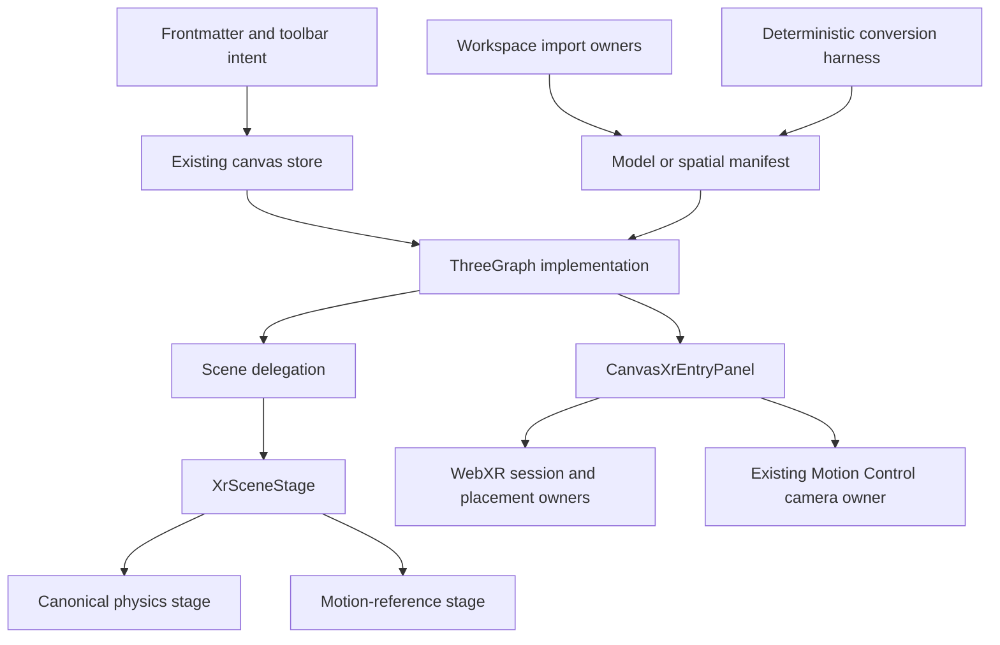

# agentic-graph XR Mode PRD-TAD-ADR-MVP-GTM

## Decision

XR Mode is the existing agentic-graph 3D canvas, workspace asset path, and
progressive WebXR entry—not a parallel immersive application or a second 3D
pipeline.

The current product:

- resolves `kgCanvasSurfaceMode: "xr"` to the existing 3D/XR store state;
- renders graphs and model manifests inline before an immersive session;
- imports GLB/GLTF model manifests and PLY/SPZ spatial-capture manifests through
  Markdown Workspace and Source Files;
- renders supported model and PLY-derived spatial data with the existing
  Three.js surface;
- recognizes SPZ sources but reports the standalone SPZ runtime as unsupported;
- provides deterministic FOSS PNG-to-SVG command orchestration and bounded
  plane-based GLB/GLTF compilers;
- publishes one five-mode XR capability snapshot;
- owns native WebXR sessions, placement, and teardown in the existing renderer;
  and
- offers an existing-owner camera route when a spatial-capture surface has no
  immersive WebXR support.

The companion capability contract is
`docs/documents/agentic-graph-ar-vr-xr-prd-tad-adr-mvp-gtm.md`. The focused acceptance
boundary is
`docs/documents/agentic-graph-xr-spatial-capture-fallback-readiness.md`.

## Part A — Product requirements

### Problem

Authors need to inspect graph, model, and spatial-capture content without moving
between unrelated renderers or asset managers. Immersive support cannot be
assumed, and deterministic asset conversion must not claim geometry it does not
produce.

### Product hypothesis

Reusing the current canvas, Markdown asset manifests, import path, renderer, and
camera owner delivers the highest XR value at the lowest TCO. Inline inspection
is useful immediately; immersive entry and camera capture remain progressive
enhancements.

### Personas

- Solo author: imports assets, inspects them inline, and optionally enters XR.
- Mobile user: needs an honest camera fallback when immersive WebXR is absent.
- AI orchestrator: needs typed, bounded, zero-token deterministic conversion
  contracts.
- Reviewer: needs source-backed requirements and explicit unsupported states.

### Journey

| Stage | Action | System response | Outcome |
|---|---|---|---|
| Import | Add GLB, GLTF, PLY, SPZ, SVG, or PNG | Existing import owner validates and creates or preserves the appropriate workspace representation | Asset remains in Source Files/Markdown ownership |
| Activate | Open an XR document or select XR Mode | Existing store resolves 3D/XR state and the shared renderer mounts | Inline inspection works without a headset |
| Inspect | Orbit, select, edit, or review supported content | Existing graph/model/spatial stage renders through one authority | No duplicate scene owner |
| Enter | Choose Enter XR on a capable browser | Existing WebXR owner requests and binds one immersive session | Progressive immersive presentation |
| Fall back | Open spatial capture without immersive support | Capability owner offers the camera route when available | Existing Motion Control owns permission and camera |
| Return | Exit XR or change documents | Session, placement, camera, and renderer owners clean up through their own lifecycles | No hidden competing runtime |

### In scope

- XR surface preset and store normalization.
- Inline graph and model inspection through the existing Three.js/R3F canvas.
- GLB/GLTF workspace manifests and renderer validation.
- PLY spatial-capture import, preview-first parsing, progressive presentation,
  and bounded cache/range behavior.
- SPZ recognition and explicit unsupported-state reporting.
- Existing canonical physics or motion-reference XR scene selection.
- Native AR/VR feature probes, session entry, reference-space handling,
  placement, and teardown.
- Spatial-capture camera fallback CTA routed to existing owners.
- Deterministic PNG-to-SVG harness with explicit fallback results.
- Deterministic SVG/PNG to GLB/GLTF plane compilation and inspect metrics.
- Zero-token cost log for deterministic conversion.

### Out of scope

- A parallel XR renderer, scene graph, physics engine, camera runtime, timeline,
  workspace, or asset manager.
- A general modeling, rigging, skinning, compositing, motion-solving, or
  sequencer engine defined only by document frontmatter.
- Vector-path extrusion or arbitrary 2D-to-3D geometry inference.
- Native SPZ decode/render support.
- Phone video depth, stereo synthesis, or spatial reconstruction.
- Automatic asset optimization or hosted conversion services.
- Multi-user XR collaboration.
- Production deployment or Cloudflare mutation from this work.

## Epics and acceptance

### KXR-E1 — XR surface and single renderer

As an author, I want XR to be a first-class canvas surface so I can inspect the
same document inline and immersively without changing data authority.

Acceptance:

1. Given XR frontmatter or a toolbar selection, when the preset applies, then
   `canvasRenderMode` is `3d` and `canvas3dMode` is `xr`.
2. Given graph data, when XR mounts, then one explicit XR authority selects the
   canonical physics or motion-reference stage.
3. Given a model document with no graph nodes, when XR mounts, then the shared
   model surface remains renderable.
4. Given the user exits or the renderer is replaced, when cleanup runs, then no
   prior immersive session remains bound.

Evidence owners: `canvas3dMode.test.ts`,
`canvasXrSharedSurfaceOwnership.test.ts`,
`xrPhysicsHomeSceneAuthorityContract.test.ts`, and
`canvasXrSessionPolicy.test.ts`.

### KXR-E2 — Workspace model and spatial asset ingest

As an author, I want model and point-cloud sources to remain ordinary workspace
documents so that XR does not create a second asset registry.

Acceptance:

1. Valid GLB/GLTF imports produce model manifests with source provenance,
   validation metadata, and XR surface intent.
2. GLTF external resources retain the correct source-relative base.
3. Standalone PLY/SPZ imports produce spatial-capture manifests with bounded
   source identities and cache keys; complete PLY-led filesets produce a
   manifest with an explicit role map.
4. Standalone SPZ remains recognized but explicitly unsupported at render time.
5. Invalid or oversized sources fail with typed status rather than pretending
   to render.

Evidence owners: workspace import tests, spatial-capture import tests,
`GlbAssetModel`, `spatialCaptureAssetRuntime.ts`, and `xrPanelModel.ts`.

### KXR-E3 — Deterministic FOSS conversion

As an author, I want bounded deterministic conversion for suitable PNG inputs so
that I can produce inspectable artifacts without paid services or token spend.

Acceptance:

1. The PNG-to-SVG harness validates source type, signature when bytes are
   supplied, input bytes, output bytes, and path count.
2. Color/auto mode selects VTracer; black-and-white mode preprocesses with
   ImageMagick and selects Potrace.
3. Command, read, validation, or budget failure returns `status: "fallback"`
   with a reason and zero-token cost log.
4. SVG compilation rejects unsafe markup and returns GLB or glTF containing a
   deterministic four-vertex, two-triangle, untextured plane sized from the SVG
   viewport.
5. PNG compilation validates the PNG signature and returns the same plane with
   the PNG embedded as its texture.
6. Inspect output reports bytes, one draw call, two triangles, four vertices,
   source dimensions/hash/format, and zero-token cost.

This compiler creates an inspectable plane. It does not extrude SVG paths,
classify photographic content, or synthesize volumetric geometry.

Evidence owner: `canvas/src/__tests__/xrAssetConversionHarness.test.ts`.

### KXR-E4 — Capability and fallback entry

As a mobile or headset user, I want the runtime to show only supported entry
paths so that inline, immersive, and camera experiences remain understandable.

Acceptance:

1. The entry owner publishes `agentic-graph-xr-capability-snapshot/v1`.
2. Recommendation order is `immersive-session`, spatial-capture `monocular-capture`,
   `inline-viewer`, `native-handoff`, then `unsupported`.
3. Immersive sessions are requested only from the explicit user action.
4. A qualifying spatial-capture fallback renders **Open camera capture**.
5. That action selects the existing `capture` primary mode and opens the
   existing Motion Control panel; it does not request permission by itself.
6. Browser proof remains limited to the rendered local fallback surface.

Evidence owners: `canvasXrSessionPolicy.test.ts`,
`xrSpatialCaptureFallbackBrowserSmokeContract.test.ts`, and
`xrSpatialCaptureFallbackReadiness.test.ts`.

### Success metrics

| Metric | Target | Evidence |
|---|---:|---|
| Inline XR availability | Works without an immersive session for supported graph/model/PLY documents | Focused unit/source tests |
| Capability determinism | One schema-valid recommended mode for every tested feature matrix | Session-policy suite |
| Fallback action visibility | CTA visible in the non-immersive camera-capable browser smoke | Local Chromium evidence |
| Default model/API cost | 0 tokens and $0 estimated cost | Conversion inspect/cost log |
| Ownership duplication | 0 competing renderer/camera/physics/timeline owners | Source ownership tests |
| Unsupported-state honesty | SPZ, physical-device, and Production limits remain explicit | Docs/source contracts |

### MoSCoW

| Priority | Capability |
|---|---|
| Must | Existing XR surface, inline viewer, one renderer owner, GLB/GLTF and PLY paths, capability snapshot, session teardown |
| Must | Honest camera fallback route through existing Motion Control |
| Must | Bounded conversion and zero-token inspect records |
| Should | Physical mobile/headset validation under a separate evidence gate |
| Could | Reviewed native asset handoff and standalone SPZ runtime |
| Won't in this increment | New reconstruction/modeling stack, second owners, hosted conversion, Production deployment |

## Part B — Technical architecture

### Ownership topology



### Component inventory

| Component | Responsibility | Source owner | Boundary |
|---|---|---|---|
| XR preset reader | Translate document intent into existing canvas modes | `canvas/src/features/parsers/canvasFrontmatterPreset.ts` | No renderer-local document state |
| XR surface ownership | Preserve one active surface/panel authority | `canvas/src/lib/canvas/canvasSurfaceOwnershipRuntime.ts` | No duplicate store |
| Renderer authority | Resolve graph/model/spatial XR content and common placement | `canvas/src/lib/three/ThreeGraph.impl.tsx` | One canvas/renderer |
| Scene delegate | Route XR once into the XR stage | `canvas/src/lib/three/Scene.impl.tsx` | No parallel XR branch |
| XR stage | Select canonical physics or motion-reference content | `canvas/src/features/three/XrSceneStage.tsx` | Exactly one selected world stage |
| Capability policy | Probe and resolve the five-mode snapshot | `canvas/src/lib/three/ThreeGraphXrSessionPolicy.ts` | Pure browser-feature policy |
| Entry owner | Render markers/actions and own session lifecycle | `canvas/src/lib/three/ThreeGraphXr.tsx` | User-owned permission/session |
| AR placement | Hit test, reticle, placement, and reposition | `canvas/src/features/three/xrArPlacementRuntime.ts` | Immersive AR only |
| Camera fallback | Open the existing local camera/pose surface | `motionControlSurfaceRuntime.ts` and `motionControlRuntime.ts` | No second camera stack |
| Model import | Create validated GLB/GLTF manifests | `workspaceImport/glbAsset.ts` | Markdown/Source Files authority |
| Spatial import | Create PLY/SPZ or fileset manifests | `workspaceImport/spatialCaptureFileset.ts` | SPZ may remain unsupported |
| Spatial runtime | Read/cache/parse supported point-cloud assets | `spatialCaptureAssetRuntime.ts` and `SpatialCaptureManifestStage.tsx` | Bounded local/URL source reads |
| Conversion | Orchestrate PNG tracing and compile source planes | `canvas/src/lib/xr/xrAssetConversion.ts` | Deterministic, zero-token |

### Surface activation flow

1. Frontmatter or UI supplies XR intent.
2. The preset owner resolves the existing store to 3D/XR.
3. `ThreeGraph.impl.tsx` resolves one XR scene authority.
4. `Scene.impl.tsx` delegates once to `XrSceneStage`.
5. The stage selects the canonical physics or motion-reference branch.
6. `CanvasXrEntryPanel` publishes capability state beside the same renderer.

Graph data and workspace documents remain unchanged by surface activation.

### Model and spatial import flow

1. Existing import logic validates filename, type, and source bytes/identity.
2. GLB/GLTF becomes a model manifest; PLY/SPZ becomes a spatial-capture
   manifest; a complete fileset records its role map.
3. Markdown Workspace and Source Files retain document ownership.
4. The shared renderer reads the manifest.
5. Supported sources render inline; recognized unsupported sources remain
   explicit rather than silently changing format.

### Conversion contracts

#### PNG to SVG harness

Input includes source name/type, input/output paths, optional bytes/length,
`auto | color | bw` mode, bounded budgets, and injected command/read adapters.

Output includes:

- `converted | fallback` status;
- selected `vtracer | potrace` tool or `null`;
- optional artifact path and SVG text;
- path count and fallback reason;
- exact command ledger; and
- zero-token cost log.

There is no hidden retry or quality classifier. A failed command or exceeded
budget returns fallback immediately.

#### SVG/PNG to GLB or glTF compiler

SVG input is `{ svgText, sourceName, targetMaxDimension? }`. PNG input is
`{ bytes, sourceName, targetMaxDimension? }`.

The deterministic result is a source-provenance plane plus inspect report.
SVG is currently untextured; PNG carries the source texture. This is a
presentation artifact, not reconstructed 3D geometry.

### Capability and session contract

The detailed schema and priority table live in
`agentic-graph-ar-vr-xr-prd-tad-adr-mvp-gtm.md`. XR Mode consumes that contract; it does not
rename the modes or infer platform tiers.

Session behavior follows current WebXR and Three.js boundaries:

- `isSessionSupported` is a capability check;
- immersive `requestSession` remains user-activated;
- `renderer.xr.setSession` binds the existing renderer;
- reference-space fallback is `local-floor` then `local`;
- AR-only optional features do not leak into VR; and
- pending and active sessions are released on cancellation, end, replacement,
  or unmount.

### Performance and data boundaries

- Point-cloud reads and caches are bounded.
- PLY preview/range paths prefer early usable content before full promotion.
- Geometry and GPU resources are disposed by the owning stage.
- Deterministic conversion uses bounded bytes and path counts.
- No model token or hosted inference cost is introduced.
- Browser smoke writes ignored local evidence only.

## Architectural decisions

### ADR-001 — Existing renderer is the XR renderer

Status: Accepted.

Reuse Three.js/R3F and the existing store. A second renderer would duplicate
scene, camera, physics, input, and cleanup ownership.

### ADR-002 — Markdown manifests remain the asset contract

Status: Accepted.

Keep model and spatial sources in Source Files/Markdown Workspace rather than a
new XR asset database.

### ADR-003 — Conversion reports what it actually creates

Status: Accepted.

The current compiler emits a plane. Documentation and inspect records must not
call it extrusion, modeling, reconstruction, or optimization.

### ADR-004 — Browser capabilities are progressive

Status: Accepted.

Inline viewing comes first. Immersive and camera paths appear only when their
feature probes and explicit user actions permit them.

### ADR-005 — Existing camera owner handles fallback

Status: Accepted.

Route the new CTA to Spatial Capture and Motion Control. Do not add another
camera lifecycle or request permission during capability detection.

### ADR-006 — Unsupported is a product state

Status: Accepted.

Recognized but unsupported sources and unproven physical-device paths remain
visible gaps. Compatibility aliases or silent format substitution are
forbidden.

## Traceability

| Requirement | Runtime owner | Focused condition |
|---|---|---|
| KXR-E1 surface state | Preset/store + renderer authority | XR mode and shared-surface tests pass |
| KXR-E1 single stage | `ThreeGraph.impl.tsx`, `Scene.impl.tsx`, `XrSceneStage.tsx` | Ownership tests find one branch |
| KXR-E2 GLB/GLTF | Model import and shared model surface | Import/render validation passes |
| KXR-E2 PLY/SPZ | Spatial import, asset runtime, panel profile | PLY renders; SPZ stays explicit unsupported |
| KXR-E3 trace harness | `xrAssetConversion.ts` | Bounds, tools, fallbacks, and zero cost pass |
| KXR-E3 plane compiler | `xrAssetConversion.ts` | GLB/glTF and inspect fixtures report 4 vertices/2 triangles |
| KXR-E4 capability | Session policy + entry owner | Five-mode matrix and DOM markers pass |
| KXR-E4 camera route | Entry owner + Motion Control route | CTA source binding and browser visibility pass |

## Focused proof and readiness

Run:

```sh
npm run xr-mode:source-runner:test
npm run xr-mode:source-ready
npm run xr-mode:runtime-ready
```

`npm run xr-mode:runtime-ready` is the root XR Mode enforcement boundary. It
must execute the complete E1-E4 source ledger and the fresh local-browser
fallback smoke. Individual renderer, asset, session, or fallback tests are
supporting evidence only and cannot independently promote XR Mode to
runtime-ready. The command remains provider-neutral and local-only; its
contract forbids deployment and documentation-update mutations. Canonical
fallback evidence wording and limitations remain in
`docs/documents/agentic-graph-xr-spatial-capture-fallback-readiness.md`.

The local browser proof covers one non-immersive, camera-API-capable Chromium
surface. It does not establish a physical camera, a physical headset, native
SPZ rendering, phone-video asset publication, Production, or Cloudflare.

## Validation checklist

- [x] Current runtime owners are named.
- [x] Capability modes match the source enum.
- [x] AR-first session and reference-space behavior match source.
- [x] Camera fallback routes to the existing owner.
- [x] Asset conversion matches the actual plane compiler.
- [x] Standalone SPZ is documented as recognized and unsupported.
- [x] The second renderer/camera/physics/timeline path is excluded.
- [x] Aggregate XR Mode readiness fails closed if any E1-E4 or browser stage
  fails or if the root command is narrowed.
- [x] Current XR Mode and fallback readiness guides remain below 600 lines; the XR v2 design is an immutable pin.
- [ ] Physical mobile and immersive-device evidence.
- [ ] Native SPZ runtime.
- [ ] Persisted phone-camera spatial asset contract.
- [ ] Protected integration and Production release.

## Planning revision — reference implementation

All five roles below consume `PLAN-AGENTIC-GRAPH-XR-MODE-PRD-TAD-ADR-MVP-GTM@0.6.3`. Existing source and runtime observations retain their original revisions and scope; this documentation update renews no deployment or demand evidence. The guideline is [v2.7.0](https://github.com/huijoohwee/huijoohwee.github.io/blob/e8d2a10a8d3e5735c43edf350a22523df05fdf91/guidelines/prd-tad-adr-mvp-gtm-guidelines.md); the shared maturity rubric loads on demand.

| Role | Owning content at this revision |
|---|---|
| PRD | [Part A — Product requirements](agentic-graph-xr-mode-prd-tad-adr-mvp-gtm.md#part-a--product-requirements) |
| TAD | [Part B — Technical architecture](agentic-graph-xr-mode-prd-tad-adr-mvp-gtm.md#part-b--technical-architecture) |
| ADR | [Architectural decisions](agentic-graph-xr-mode-prd-tad-adr-mvp-gtm.md#architectural-decisions) |
| MVP | [MVP — reference implementation](agentic-graph-xr-mode-prd-tad-adr-mvp-gtm.md#mvp--reference-implementation) |
| GTM | [GTM — reference implementation](agentic-graph-xr-mode-prd-tad-adr-mvp-gtm.md#gtm--reference-implementation) |

## MVP — reference implementation

Reuse the minimum scope, acceptance conditions and component owners identified above. The demonstration must follow the documented entry, permitted action, durable outcome and readback, including its stated failure/recovery path. Use `npm run xr-mode:runtime-ready` for its actual coverage and the named feature checks in the specification; attach exact source, command, result and authoring/mirror/delivery surface to each VCC before advancing readiness. A source locator or structural check alone proves no user outcome.

Record the observed steps and elapsed time against the existing TTV target. If no target or invocation is stated, the demonstration remains unverified until the document owner supplies it. All four experience criteria are **unassessed** in this authoring review: Core Requirements & Functionality, Innovation & Theme Alignment, Technical Execution & Integration, and Usefulness & Agentic Experience. No scored user observation is attached to this revision; the document owner must capture a timed pilot and criterion-specific evidence.

## GTM — reference implementation

Use the stated persona and pain hypothesis to test one priced pilot in the existing user environment. Keep the documented free/self-serve workflow as the comparison; additional hosting, channels or agent roles require an evidenced constraint or buyer need. Record the buyer’s workaround, frequency, accepted outcome, offered price, observed response and support minutes before ranking a commercial winner. Demand, collected payment and repeat use remain unvalidated by this documentation review; mechanism evidence keeps its narrower original scope. Measure tokens, cash expense and maintenance separately for each proposed deployment model. Feed actual pilot outcomes into a successor Context using the shared four-column planning record.

## Planning gaps — reference implementation

Source review is bounded to repository `7fb85741121d8c2886027e4a630d013ba91c1027`. Confirmed: these referenced artifacts exist at that revision: [`canvas/src/__tests__/xrAssetConversionHarness.test.ts`](https://github.com/huijoohwee/agentic-graph/blob/7fb85741121d8c2886027e4a630d013ba91c1027/canvas/src/__tests__/xrAssetConversionHarness.test.ts), [`canvas/src/features/parsers/canvasFrontmatterPreset.ts`](https://github.com/huijoohwee/agentic-graph/blob/7fb85741121d8c2886027e4a630d013ba91c1027/canvas/src/features/parsers/canvasFrontmatterPreset.ts), [`canvas/src/lib/canvas/canvasSurfaceOwnershipRuntime.ts`](https://github.com/huijoohwee/agentic-graph/blob/7fb85741121d8c2886027e4a630d013ba91c1027/canvas/src/lib/canvas/canvasSurfaceOwnershipRuntime.ts). Their existence does not confirm every behavior asserted by the specification.
Experience observations, current VCC execution and buyer/payment evidence are unverified here. This is a bounded planning update, not a full-guideline conformance verdict; historical conformance percentages above apply only to their recorded profile and revision.

## Sea journey increment — reference implementation

All five roles join the same continuity ID at **0.6.3**. This bounded increment is authorized by the
2026-09-21 request to enhance the existing XR panels and runtime-readiness demo with the supplied story.
Source baseline: `b242ab5d82c49155808a86b45565c797f8e04f61`; invocation: `/change #xr-sea-journey @huijoohwee`.
Prior evidence above retains its recorded revision; this increment claims no new delivered rung.

| Role | Increment and acceptance |
|---|---|
| PRD | An author needs recognizable cast/props and a complete reproducible story. SJ-1: sail, straw/stick collapse, brick resistance, chimney/soup, escape and reunion follow the supplied script. SJ-2: one Subjects & Props surface includes catalog and placed-instance controls with visual previews. SJ-3: pause, seek, frame-step, replay, camera and Motion Control retain the shared Timeline and selected-target owners. |
| TAD | Extend `xrMotionReferenceModel` marks with optional bounded presentation cues and camera captions; sample them deterministically in `xrStoryPresentation`. Reuse `XrSceneLibrarySubject`, native procedural geometry, Media cards, rehearsal status and the existing seed. No second clock, physics engine, camera owner, service or transport. |
| ADR | Keep seven existing camera beat times and the 28-second demo. Explicit asset IDs and authored cues drive new story visuals; old documents remain valid. Effects illustrate authored events rather than claiming physical structural simulation. Recovery is reverting this scoped source change and reapplying the prior Git-backed seed. |
| MVP | Existing Surface Mode → XR, Source Files seed apply, Animation, Motion Control, Camera, Media and Game Mode routes remain entry points. SJ-1/SJ-3: parsed-seed, cue sampling, serialization, backward seek and panel/runtime tests. SJ-2: rendered preview and filtered placed-instance checks. Run the repository affected planner and its selected checks; browser and protected integration results must be recorded separately. |
| GTM | First pain hypothesis: educators/story authors spend time translating a script into readable choreography. Closest built solution: this existing local rehearsal surface. Test a $1 optional authored-story pilot only after a user observes the complete loop; demand, willingness to pay and revenue remain unvalidated. The free local core remains available. |

Grounding: **confirmed** native shared transport, selectable subjects, Tropical Playground and procedural
houses at the source baseline; **absent** authored collapse/splash cues, explicit story assets and visual
catalog previews; **unverified** physical-device behavior and buyer demand. The pre-existing canonical
seed edit is preserved and is not adopted into this lane. Earlier integrated rehearsal source is reused.

Budget: 60 minutes for source/verification, at most 18 changed source files and 80 KB added bytes;
new dependencies, paid services, remote media and always-load guidance delta: zero. CI/provider waits
require an observed condition and recheck rather than an ETA. No deployment or production claim.

Local verification (2026-09-21): the affected planner selected five owner partitions and all passed;
nine registered journey/seed/Timeline/camera tests passed; seed authority and changed-file hygiene
passed. Browser checks exercised Surface Mode → XR, both Subjects & Props views, the opening
camera beat with all three pigs aboard the sailboat, caption projection and collapsed-house replay
in the native playground. This is local browser evidence, not device or production proof. The
28-second choreography retains nine visible speed sanity warnings for intentionally compressed
travel; no warning threshold was changed. Protected integration remains a separate provider gate.

### Playground selection and Timeline inspector follow-up

The 2026-09-21 browser comments authorize `/change #xr-playground-contract-ready @huijoohwee`.
PS-1: native cannons, landmarks, palms, rocks, treasure and simulated bodies select through the
existing shot-target owner without spawning authored copies. Hidden story geometry must not intercept
picking. PS-2: in-scene Subjects & Props reuse the environment card layout and native illustrations;
keyboard selection opens the same Timeline target. PS-3: authored name, asset, XYZ, rotation, scale,
color and path interpolation have one editor in BottomPanel Timeline. Environment and simulation
objects expose their ownership and position there; their existing runtime retains placement authority.

The implementation extends the existing scene catalog, shot-target resolver and rendered geometry;
there is no second scene, physics world, transport or persistence model. Native targets have no
animatable cast binding, so commands cannot fall through to a previously selected pig or wolf.
Cast edits and retiming preserve presentation cues. Regression coverage exercises all native targets,
no-copy/no-mutation selection, explicit command rejection, hidden geometry, rendered card accessibility,
Timeline transforms and cue preservation. The follow-up cap is 26 source/document files and 80 KB added bytes;
verification includes the seed's pinned-source and default-panel contracts, with provider waits reported separately.
The inventory validator now delegates to the existing XR runtime seed contract, removing contradictory
Animation/Motion Control defaults while retaining the inventory's explicit browser-proof claim boundary.


### Shared choreography and source references

`/change #xr-choreography-source-ready @huijoohwee` consolidates the existing XR authoring flow. All selected subjects, props, and native stage objects use one geometry-following yellow bounding box. FloatingPanel Animation owns path and character presets. BottomPanel Timeline owns mark easing, gait, position, timing, static transforms, selection and transport; Motion Control projects that same selected target, mark and assigned motion. No extra clock or scene is introduced.

The rehearsal body uses existing `{{key}}` references to frontmatter scene fields and camera captions. Dotted array paths resolve their current values in Markdown preview; source tokens remain editable references. Captions are authored once in frontmatter. This local pass is capped at 30 touched files and 80 KB of added source; existing generated/runtime-readiness and release boundaries remain in force.

### Viewer invocations and Timeline parameters

`/fix #viewer-edit-stability @huijoohwee` keeps the shared workspace status owner and Viewer edit notifier stable across renders. Inactive blocks must not replay their state when a parent callback changes. Indexing state changes and Viewer edits must not cancel and restart an unchanged document job; status destinations still rebind when their toast ID changes. Validate indexing completion, subsequent editing, and the mounted Viewer with XR present without nested-update warnings.

`/refactor #xr-viewer-shared-invocations @huijoohwee` projects the existing native XR catalog into Viewer reference chips and the shared searchable Variable commands menu. Stage and asset selections use the existing `/xr.stage @stage` and `/xr.transform @subject #transform asset=asset` builders and `control_local_xr_scene` controller, shared with MCP and WebMCP. There is no Viewer choice schema or independent frontmatter writer. Authored role labels, subject IDs, marks, cues and camera anchors remain stable. Nested caption references resolve catalog words with bounded cycle handling; read-only viewers display values without mutation controls.

Timeline remains the sole mark parameter editor (easing, gait, position and time); Animation keeps presets and mark summaries synchronized with Motion Control. Validation covers shared-menu keyboard selection, canonical invocation routing, persisted source, pending-editor rejection and read-only references. Budget: 30 minutes of implementation and local checks, at most 20 touched files and 60 KB of changes; CI waits are separate.

`/fix #viewer-reference-edit-parity @huijoohwee` keeps paragraph view and click-edit on the same rendered inline surface. Reference-only paragraphs edit their bound frontmatter strings through the existing section writer; body references, nested asset tokens and unrelated metadata survive save/cancel. Asset pills align with prose without adding punctuation spacing. Acceptance covers ordinary inline code, multiple caption references, source mutation, cancellation and repeat editing. Scope: 12 files, 35 KB; local checks precede protected integration.

`/fix #viewer-widget-invocation-parity @huijoohwee` reuses the Skills & Commands token renderer for recognized inline-code invocations in Viewer and Widget Cards. Command, binding and semantic tokens retain their catalog tone, source link and label; command-plus-target invocations retain their chips without invented source links when the catalog is deferred offline. Ordinary code remains code. Click-edit preserves the mounted token appearance and writes the original invocation text and backticks without executing it. Acceptance compares all three read surfaces plus edit/save/cancel. Scope: 8 files, 30 KB; existing MCP/WebMCP owners remain authoritative.

`/fix #shared-black-hover-tips @huijoohwee` reuses the existing Tooltip renderer and source theme tokens for black backgrounds and white text in every theme. One delegated, event-driven owner serves existing native title labels across mounted and dynamically added controls; catalog and inline invocation chips retain full command, binding and semantic descriptions. Existing explicit Tooltip instances remain single owners. Hovering or focusing must not execute commands, alter authored Markdown, intercept clicks, or add layout wrappers. Acceptance covers pointer/focus, dismissal, live title changes, removal, click-edit invocation spans, and light/dark token parity. Scope: 15 files, 40 KB; implementation exceeded the initial 20-minute target while reconciling existing theme ownership; affected validation and external review waits are separate. No new dependency, timer, polling, page traversal or per-chip React tooltip state.

### Shared invocation provenance and Widget media parity

`/fix #widget-media-source-parity @huijoohwee`

Reuse the black tooltip and canonical invocation catalog for descriptions and Source in Skills & Commands, Viewer, and Widget chips. Repair Widget media insertion through the shared Viewer edit surface, preserving authored text and existing media/runtime owners. Validate pointer selection, source persistence, edit/view parity, and affected source checks; no provider or production change.

The shared catalog supplies native subjects, props, and environments as canonical XR invocations; selecting an entry inserts source without executing it. Image, audio, and video share one embed builder and preserve their original markup through further editing. The shared media pill centers its thumbnail on the label in both view and edit. Local browser checks observed matching centers and black/white source tooltips; focused insertion, serializer, and invocation parity tests pass. Final scope is 22 files with existing owner extraction, under 50 KB of added source; exact candidate checks remain separate from publication or production proof.

`/fix #widget-media-source-preservation @huijoohwee` extends the same serializer check to HTML-encoded media URL query parameters. Match the rendered URL after entity decoding while retaining the original embed bytes; keep this repair within the serializer, regression test, and plan owners.
