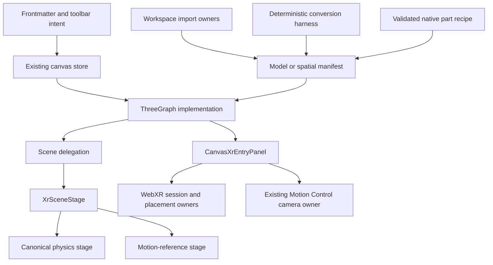

# agentic-graph XR Mode PRD-TAD-ADR-MVP-GTM

## Decision

XR Mode is the existing agentic-graph 3D canvas, workspace asset path, and
progressive WebXR entry—not a parallel immersive application or a second 3D
pipeline.

The current product:

- resolves `kgCanvasSurfaceMode: "xr"` to the existing 3D/XR store state;
- renders graphs and model manifests inline before an immersive session;
- imports GLB/GLTF model manifests and PLY/SPZ spatial-capture manifests through
  Markdown Workspace and Source Files;
- renders supported model and PLY-derived spatial data with the existing
  Three.js surface;
- recognizes SPZ sources but reports the standalone SPZ runtime as unsupported;
- provides deterministic FOSS PNG-to-SVG command orchestration and bounded
  plane-based GLB/GLTF compilers;
- publishes one five-mode XR capability snapshot;
- owns native WebXR sessions, placement, and teardown in the existing renderer;
  and
- offers an existing-owner camera route when a spatial-capture surface has no
  immersive WebXR support.

The companion capability contract is
`docs/documents/agentic-graph-ar-vr-xr-prd-tad-adr-mvp-gtm.md`. The focused acceptance
boundary is
`docs/documents/agentic-graph-xr-spatial-capture-fallback-readiness.md`.

## Part A — Product requirements

### Problem

Authors need to inspect graph, model, and spatial-capture content without moving
between unrelated renderers or asset managers. Immersive support cannot be
assumed, and deterministic asset conversion must not claim geometry it does not
produce.

### Product hypothesis

Reusing the current canvas, Markdown asset manifests, import path, renderer, and
camera owner delivers the highest XR value at the lowest TCO. Inline inspection
is useful immediately; immersive entry and camera capture remain progressive
enhancements.

### Personas

- Solo author: imports assets, inspects them inline, and optionally enters XR.
- Mobile user: needs an honest camera fallback when immersive WebXR is absent.
- AI orchestrator: needs typed, bounded, zero-token deterministic conversion
  contracts.
- Reviewer: needs source-backed requirements and explicit unsupported states.

### Journey

| Stage | Action | System response | Outcome |
|---|---|---|---|
| Import | Add GLB, GLTF, PLY, SPZ, SVG, or PNG | Existing import owner validates and creates or preserves the appropriate workspace representation | Asset remains in Source Files/Markdown ownership |
| Activate | Open an XR document or select XR Mode | Existing store resolves 3D/XR state and the shared renderer mounts | Inline inspection works without a headset |
| Inspect | Orbit, select, edit, or review supported content | Existing graph/model/spatial stage renders through one authority | No duplicate scene owner |
| Enter | Choose Enter XR on a capable browser | Existing WebXR owner requests and binds one immersive session | Progressive immersive presentation |
| Fall back | Open spatial capture without immersive support | Capability owner offers the camera route when available | Existing Motion Control owns permission and camera |
| Return | Exit XR or change documents | Session, placement, camera, and renderer owners clean up through their own lifecycles | No hidden competing runtime |

### In scope

- XR surface preset and store normalization.
- Inline graph and model inspection through the existing Three.js/R3F canvas.
- GLB/GLTF workspace manifests and renderer validation.
- PLY spatial-capture import, preview-first parsing, progressive presentation,
  and bounded cache/range behavior.
- SPZ recognition and explicit unsupported-state reporting.
- Existing canonical physics or motion-reference XR scene selection.
- Native AR/VR feature probes, session entry, reference-space handling,
  placement, and teardown.
- Spatial-capture camera fallback CTA routed to existing owners.
- Deterministic PNG-to-SVG harness with explicit fallback results.
- Deterministic SVG/PNG to GLB/GLTF plane compilation and inspect metrics.
- Zero-token cost log for deterministic conversion.
- Bounded native model/rig/animation, agent creation, procedural controls and
  faithful GLB/MP4 authoring specified by A01-A09/B01-B08 below; delivery is pending.

### Out of scope

- A parallel XR renderer, scene graph, physics engine, camera runtime, timeline,
  workspace, or asset manager.
- Arbitrary executable-source modeling, general skinning/morph deformation,
  motion solving, or a second compositing/sequencer engine.
- Vector-path extrusion or arbitrary 2D-to-3D geometry inference.
- Native SPZ decode/render support.
- Phone video depth, stereo synthesis, or spatial reconstruction.
- Automatic asset optimization or hosted conversion services.
- Multi-user XR collaboration.
- Production deployment or Cloudflare mutation from this work.

## Epics and acceptance

### KXR-E1 — XR surface and single renderer

As an author, I want XR to be a first-class canvas surface so I can inspect the
same document inline and immersively without changing data authority.

Acceptance:

1. Given XR frontmatter or a toolbar selection, when the preset applies, then
   `canvasRenderMode` is `3d` and `canvas3dMode` is `xr`.
2. Given graph data, when XR mounts, then one explicit XR authority selects the
   canonical physics or motion-reference stage.
3. Given a model document with no graph nodes, when XR mounts, then the shared
   model surface remains renderable.
4. Given the user exits or the renderer is replaced, when cleanup runs, then no
   prior immersive session remains bound.

Evidence owners: `canvas3dMode.test.ts`,
`canvasXrSharedSurfaceOwnership.test.ts`,
`xrPhysicsHomeSceneAuthorityContract.test.ts`, and
`canvasXrSessionPolicy.test.ts`.

### KXR-E2 — Workspace model and spatial asset ingest

As an author, I want model and point-cloud sources to remain ordinary workspace
documents so that XR does not create a second asset registry.

Acceptance:

1. Valid GLB/GLTF imports produce model manifests with source provenance,
   validation metadata, and XR surface intent.
2. GLTF external resources retain the correct source-relative base.
3. Standalone PLY/SPZ imports produce spatial-capture manifests with bounded
   source identities and cache keys; complete PLY-led filesets produce a
   manifest with an explicit role map.
4. Standalone SPZ remains recognized but explicitly unsupported at render time.
5. Invalid or oversized sources fail with typed status rather than pretending
   to render.

Evidence owners: workspace import tests, spatial-capture import tests,
`GlbAssetModel`, `spatialCaptureAssetRuntime.ts`, and `xrPanelModel.ts`.

### KXR-E3 — Deterministic FOSS conversion

As an author, I want bounded deterministic conversion for suitable PNG inputs so
that I can produce inspectable artifacts without paid services or token spend.

Acceptance:

1. The PNG-to-SVG harness validates source type, signature when bytes are
   supplied, input bytes, output bytes, and path count.
2. Color/auto mode selects VTracer; black-and-white mode preprocesses with
   ImageMagick and selects Potrace.
3. Command, read, validation, or budget failure returns `status: "fallback"`
   with a reason and zero-token cost log.
4. SVG compilation rejects unsafe markup and returns GLB or glTF containing a
   deterministic four-vertex, two-triangle, untextured plane sized from the SVG
   viewport.
5. PNG compilation validates the PNG signature and returns the same plane with
   the PNG embedded as its texture.
6. Inspect output reports bytes, one draw call, two triangles, four vertices,
   source dimensions/hash/format, and zero-token cost.

This compiler creates an inspectable plane. It does not extrude SVG paths,
classify photographic content, or synthesize volumetric geometry.

Evidence owner: `canvas/src/__tests__/xrAssetConversionHarness.test.ts`.

### KXR-E4 — Capability and fallback entry

As a mobile or headset user, I want the runtime to show only supported entry
paths so that inline, immersive, and camera experiences remain understandable.

Acceptance:

1. The entry owner publishes `agentic-graph-xr-capability-snapshot/v1`.
2. Recommendation order is `immersive-session`, spatial-capture `monocular-capture`,
   `inline-viewer`, `native-handoff`, then `unsupported`.
3. Immersive sessions are requested only from the explicit user action.
4. A qualifying spatial-capture fallback renders **Open camera capture**.
5. That action selects the existing `capture` primary mode and opens the
   existing Motion Control panel; it does not request permission by itself.
6. Browser proof remains limited to the rendered local fallback surface.

Evidence owners: `canvasXrSessionPolicy.test.ts`,
`xrSpatialCaptureFallbackBrowserSmokeContract.test.ts`, and
`xrSpatialCaptureFallbackReadiness.test.ts`.

### Success metrics

| Metric | Target | Evidence |
|---|---:|---|
| Inline XR availability | Works without an immersive session for supported graph/model/PLY documents | Focused unit/source tests |
| Capability determinism | One schema-valid recommended mode for every tested feature matrix | Session-policy suite |
| Fallback action visibility | CTA visible in the non-immersive camera-capable browser smoke | Local Chromium evidence |
| Default model/API cost | 0 tokens and $0 estimated cost | Conversion inspect/cost log |
| Ownership duplication | 0 competing renderer/camera/physics/timeline owners | Source ownership tests |
| Unsupported-state honesty | SPZ, physical-device, and Production limits remain explicit | Docs/source contracts |

### MoSCoW

| Priority | Capability |
|---|---|
| Must | Existing XR surface, inline viewer, one renderer owner, GLB/GLTF and PLY paths, capability snapshot, session teardown |
| Must | Honest camera fallback route through existing Motion Control |
| Must | Bounded conversion and zero-token inspect records |
| Must | A01-A09/B01-B08 native authoring; staged delivery retains every criterion |
| Should | Physical mobile/headset validation under a separate evidence gate |
| Could | Reviewed native asset handoff and standalone SPZ runtime |
| Won't in this increment | General reconstruction/deformation, second owners, hosted conversion, Production deployment |

## Part B — Technical architecture

### Ownership topology

### Component inventory

| Component | Responsibility | Source owner | Boundary |
|---|---|---|---|
| XR preset reader | Translate document intent into existing canvas modes | `canvas/src/features/parsers/canvasFrontmatterPreset.ts` | No renderer-local document state |
| XR surface ownership | Preserve one active surface/panel authority | `canvas/src/lib/canvas/canvasSurfaceOwnershipRuntime.ts` | No duplicate store |
| Renderer authority | Resolve graph/model/spatial XR content and common placement | `canvas/src/lib/three/ThreeGraph.impl.tsx` | One canvas/renderer |
| Scene delegate | Route XR once into the XR stage | `canvas/src/lib/three/Scene.impl.tsx` | No parallel XR branch |
| XR stage | Select canonical physics or motion-reference content | `canvas/src/features/three/XrSceneStage.tsx` | Exactly one selected world stage |
| Capability policy | Probe and resolve the five-mode snapshot | `canvas/src/lib/three/ThreeGraphXrSessionPolicy.ts` | Pure browser-feature policy |
| Entry owner | Render markers/actions and own session lifecycle | `canvas/src/lib/three/ThreeGraphXr.tsx` | User-owned permission/session |
| AR placement | Hit test, reticle, placement, and reposition | `canvas/src/features/three/xrArPlacementRuntime.ts` | Immersive AR only |
| Camera fallback | Open the existing local camera/pose surface | `motionControlSurfaceRuntime.ts` and `motionControlRuntime.ts` | No second camera stack |
| Model import | Create validated GLB/GLTF manifests | `workspaceImport/glbAsset.ts` | Markdown/Source Files authority |
| Spatial import | Create PLY/SPZ or fileset manifests | `workspaceImport/spatialCaptureFileset.ts` | SPZ may remain unsupported |
| Spatial runtime | Read/cache/parse supported point-cloud assets | `spatialCaptureAssetRuntime.ts` and `SpatialCaptureManifestStage.tsx` | Bounded local/URL source reads |
| Conversion | Orchestrate PNG tracing and compile source planes | `canvas/src/lib/xr/xrAssetConversion.ts` | Deterministic, zero-token |

### Surface activation flow

1. Frontmatter or UI supplies XR intent.
2. The preset owner resolves the existing store to 3D/XR.
3. `ThreeGraph.impl.tsx` resolves one XR scene authority.
4. `Scene.impl.tsx` delegates once to `XrSceneStage`.
5. The stage selects the canonical physics or motion-reference branch.
6. `CanvasXrEntryPanel` publishes capability state beside the same renderer.

Graph data and workspace documents remain unchanged by surface activation.

### Model and spatial import flow

1. Existing import logic validates filename, type, and source bytes/identity.
2. GLB/GLTF becomes a model manifest; PLY/SPZ becomes a spatial-capture
   manifest; a complete fileset records its role map.
3. Markdown Workspace and Source Files retain document ownership.
4. The shared renderer reads the manifest.
5. Supported sources render inline; recognized unsupported sources remain
   explicit rather than silently changing format.

### Conversion contracts

#### PNG to SVG harness

Input includes source name/type, input/output paths, optional bytes/length,
`auto | color | bw` mode, bounded budgets, and injected command/read adapters.

Output includes:

- `converted | fallback` status;
- selected `vtracer | potrace` tool or `null`;
- optional artifact path and SVG text;
- path count and fallback reason;
- exact command ledger; and
- zero-token cost log.

There is no hidden retry or quality classifier. A failed command or exceeded
budget returns fallback immediately.

#### SVG/PNG to GLB or glTF compiler

SVG input is `{ svgText, sourceName, targetMaxDimension? }`. PNG input is
`{ bytes, sourceName, targetMaxDimension? }`.

The deterministic result is a source-provenance plane plus inspect report.
SVG is currently untextured; PNG carries the source texture. This is a
presentation artifact, not reconstructed 3D geometry.

### Capability and session contract

The detailed schema and priority table live in
`agentic-graph-ar-vr-xr-prd-tad-adr-mvp-gtm.md`. XR Mode consumes that contract; it does not
rename the modes or infer platform tiers.

Session behavior follows current WebXR and Three.js boundaries:

- `isSessionSupported` is a capability check;
- immersive `requestSession` remains user-activated;
- `renderer.xr.setSession` binds the existing renderer;
- reference-space fallback is `local-floor` then `local`;
- AR-only optional features do not leak into VR; and
- pending and active sessions are released on cancellation, end, replacement,
  or unmount.

### Performance and data boundaries

- Point-cloud reads and caches are bounded.
- PLY preview/range paths prefer early usable content before full promotion.
- Geometry and GPU resources are disposed by the owning stage.
- Deterministic conversion uses bounded bytes and path counts.
- No model token or hosted inference cost is introduced.
- Browser smoke writes ignored local evidence only.

## Architectural decisions

### ADR-001 — Existing renderer is the XR renderer

Status: Accepted.

Reuse Three.js/R3F and the existing store. A second renderer would duplicate
scene, camera, physics, input, and cleanup ownership.

### ADR-002 — Markdown manifests remain the asset contract

Status: Accepted.

Keep model and spatial sources in Source Files/Markdown Workspace rather than a
new XR asset database.

### ADR-003 — Conversion reports what it actually creates

Status: Accepted.

The current compiler emits a plane. Documentation and inspect records must not
call it extrusion, modeling, reconstruction, or optimization.

### ADR-004 — Browser capabilities are progressive

Status: Accepted.

Inline viewing comes first. Immersive and camera paths appear only when their
feature probes and explicit user actions permit them.

### ADR-005 — Existing camera owner handles fallback

Status: Accepted.

Route the new CTA to Spatial Capture and Motion Control. Do not add another
camera lifecycle or request permission during capability detection.

### ADR-006 — Unsupported is a product state

Status: Accepted.

Recognized but unsupported sources and unproven physical-device paths remain
visible gaps. Compatibility aliases or silent format substitution are
forbidden.

## Traceability

| Requirement | Runtime owner | Focused condition |
|---|---|---|
| KXR-E1 surface state | Preset/store + renderer authority | XR mode and shared-surface tests pass |
| KXR-E1 single stage | `ThreeGraph.impl.tsx`, `Scene.impl.tsx`, `XrSceneStage.tsx` | Ownership tests find one branch |
| KXR-E2 GLB/GLTF | Model import and shared model surface | Import/render validation passes |
| KXR-E2 PLY/SPZ | Spatial import, asset runtime, panel profile | PLY renders; SPZ stays explicit unsupported |
| KXR-E3 trace harness | `xrAssetConversion.ts` | Bounds, tools, fallbacks, and zero cost pass |
| KXR-E3 plane compiler | `xrAssetConversion.ts` | GLB/glTF and inspect fixtures report 4 vertices/2 triangles |
| KXR-E4 capability | Session policy + entry owner | Five-mode matrix and DOM markers pass |
| KXR-E4 camera route | Entry owner + Motion Control route | CTA source binding and browser visibility pass |

Historical proof remains at the [unchanged evidence section](agentic-graph-xr-mode-increments.md#focused-proof-and-readiness).

## Native authoring increment — reference implementation

All five roles join `PLAN-AGENTIC-GRAPH-XR-MODE-PRD-TAD-ADR-MVP-GTM@0.7.0`.
PRD criteria below extend Part A; TAD consumes those exact criteria; ADR-007-009
bind the design; MVP and GTM consume all three. Historical E1-E4 proof and earlier
increments are preserved in the [evidence companion](agentic-graph-xr-mode-increments.md).
This revision records planned work, not completed runtime acceptance or production.

**Directive:** context is the source register below and the authorized 2026-09-21/22
native enhancement request. Intent is one editable character-to-export journey.
The authoring maintainer extends existing source owners; the outcome is all 17
criteria passing on the same saved scene. `/change #xr-character-authoring @huijoohwee`
binds this scope; the user's implementation and source-release grants remain valid.
Native admission and exact protected promotion proof remain separate requirements.

### PRD — authoring pain, journey and acceptance

The user-requested pain is repeated handoff between creating, rigging, animating
and exporting a character; buyer demand and measured time lost are unvalidated.
Hook: create an editable native subject. Break: a static mesh loses its controls
and articulation. Fix: connect existing recipes, source edits, panels and export.
Close: reopen and reimport the authored result. Reuse precedes new components.
Target users are solo scene creators and agents acting on their approved document.

Journey: Canvas View Mode → Surface Mode → XR → Media / Subjects & Props →
Model / Rig → Animation / BottomPanel Timeline → Camera → save/reopen → export.
Tropical Playground and the existing Motion Control/Game Mode routes share it.
Every row is Must. Listed checks are required evidence hosts, not passing results.

| Criterion | Given → when → then; constraint | Native owner and verification condition |
|---|---|---|
| A01 Model | Given a selected subject, when parts, dimensions, colors or transforms change, then stable subject/part IDs and edits survive source save/reparse. | Scene model, subject edits, persistence and `XrSceneLibrarySubject`; edit/save/reopen and geometry readback. |
| A02 Rig | Given articulated parts, when hierarchy, pivots or joint rotations change, then valid poses persist and cycles, dangling parents, non-finite values and unsupported topology reject before mutation. | Scene normalization and trusted part recipe; hierarchy/pose/invalid-input tests. Rigid articulation does not imply skinning. |
| A03 Agent | Given an authorized document, when Create with an agent or its animated example runs, then registered tools and manual editing produce the same persisted scene with typed errors and stale-document fencing. | Existing scene/animation WebMCP adapters and mutation owner; tool/manual parity and deterministic example checks. No new service. |
| A04 Animate | Given Model/Rig/Animate activities, when selection, frame, clips, keyframes or loops change, then subject, part, camera and source remain synchronized through BottomPanel Timeline. | Animation sampler, marks and shared transport; seek/frame/rate/loop/reparse tests. No second clock. |
| A05 Media | Given integrated catalog/terrain work, when Subjects & Props or Tropical Playground opens, then native visuals and selection use the existing consolidated surface. | Media cards, thumbnails and scene geometry; desktop/mobile visual and selection checks; preserve prior integrated work. |
| A06 Panels | Given Animation, Motion Control, Game Mode, Media and Camera, when switching, exiting or changing document, then each uses the same scene/target and releases capture/game resources while restoring authoring state. | Shared controls and lifecycle guards; switch/exit/document-change and resource checks. |
| A07 GLB | Given an authored character or scene, when exporting and reimporting GLB, then hierarchy, clips, colors, scale, duration and start/middle/end motion agree. | Native snapshot/export and trusted asset pipeline; real GLB parse/reimport and sampled motion assertions. Static GLB is insufficient. |
| A08 MP4 | Given browser MP4 support, when recording the authored scene/camera, then actual MP4 bytes, nonempty frames and duration are verified; unsupported browsers report a typed result while GLB remains available. | Native codec negotiation and recorder lifecycle; container/frame/teardown checks for cancel, error and document change. Never relabel WebM. |
| A09 Demo | Given the existing readiness seed, when adding the agent/model/rig/animate/export journey, then prior story source and physical-device boundaries remain intact. | `docs/workspace-seeds/agentic-graph-ar-vr-xr-runtime-readiness-demo.md`; seed-authority and browser walkthrough checks; split/reduce oversized source before growth. |
| B01 Text | Given text or an authorized agent recipe, when creating an asset, then typed native construction works without a fabricated image and unsupported intent exposes bounded capability. | `features/image-to-glb` trusted builder and existing dispatch; successful text, unsupported/missing capability and tool/manual parity. |
| B02 Editable | Given an asset, when editing and reopening, then intent, seed, stable parts, recipe, parameter schema/values and reviewable JS/TS persist and rebuild geometry/materials. | Same recipe/persistence owner; exact-input reproducibility and save/reopen tests. Arbitrary source never executes. |
| B03 Controls | Given typed numeric/color/enum/boolean controls, when keyboard/touch edits or reset occur, then declared targets/defaults/units/limits apply deterministically without model calls or lost animation bindings. | Existing property/media controls; geometry/material readback, invalid values and zero-request observation. |
| B04 Recovery | Given bounded generation, when input fails, work cancels or a result becomes stale, then last-valid asset and unapplied draft survive with temporary resources disposed. | Native admission/session lifecycle; topology/byte/mesh/material/triangle/time limits, rapid edits, document switches and late completion. |
| B05 Evidence | Given text-only construction, when validating, then intent, geometry, materials, hierarchy, controls and export have honest separate findings; image routes retain reference gates. | Existing evidence pipeline; reject invented image digests, silhouette/observed-surface claims or provider approval. |
| B06 Fidelity | Given exact edited recipe/source, when exporting, then GLB preserves names, transforms, PBR materials and supported clips and workspace companions retain editable recipe/source. | Trusted immutable export; compare parts, bounds, materials and samples after reimport; malformed/stale evidence blocks. GLB alone does not retain control logic. |
| B07 Surfaces | Given a generated asset, when moving Card/Widget/Rich Media → Subjects & Props → XR, then one identity preserves initiating input through edit/place/animate/save/reopen/export. | Existing surface projections and shared authoring owner; desktop/mobile end-to-end and offline parameter edits. |
| B08 Invocation | Given exact contract pins, when skill/preset, `/`, `@`, `#`, MCP or WebMCP resolves, then it uses the same native operation and stale pins fail closed. | OS dictionary, Canvas generated projection/preset, Graph dispatcher/tool owners; grammar, pin and execution parity. No duplicate gateway. |

### TAD — source grounding and dependency boundaries

| Source / observed revision | Disposition and permitted reuse |
|---|---|
| Graph baseline `620471f120ddb31c7aab6ffcc8296f7be6eb3144` | Confirmed source owners: shared scene/transport, procedural subjects, consolidated catalog and Tropical Playground. A01-A09/B01-B08 complete runtime acceptance is unverified. |
| Graph PR #1160, `776dbfb57f5d7eaea295fbba3645912cc5537b43` | Unmerged procedural builder/controls/export candidate, provider comparison base `620471f`; CI `35679076447` in progress at this observation. Focused predecessor evidence does not establish integrated availability. Consume only after exact protected integration; never add a second recipe. |
| OS PR #251, merge `139c46d8fe239c5a051a26729cb572fff6bd191a` | Confirmed completed source delivery of `/asset.create @text #procedural-asset`; dictionary metadata grants no execution. |
| Canvas PR #943, merge `1bfd18356c8a33ac763454b0dddfb68e88d4694d` | Confirmed completed skill/preset source delivery. Its admitted capability is native Card Run; Chat/MCP/WebMCP/XR execution and direct Canvas consumption remain separate work. |
| `design-token-integration`, `0da7c58ea4aa192f13ea36853d51847184a9ca98` | Active successor to design-review-bounds still owns registry, global tools and collaboration contract. B08/WebMCP/direct Canvas contract changes wait for actual ownership release/admission. |
| Native publication boundary | Publisher classifies the dependency change as authority-controlling and requires external promotion authority. User source-release grant persists; exact authenticated authority is unverified and separate from source/check evidence. |

The reviewed authoring guideline is v3.1.0 at the exact revision/digest in frontmatter;
OS `guides/PRD-TAD-ADR-MVP-GTM.md` is v1.4.3 at its recorded revision/digest.
These clean local source reads bind planning guidance, not full-guideline conformity.

| Component / criteria | Reuse or enhancement; interface and data boundary |
|---|---|
| Scene source / A01-A02,A06,B02,B04 | Extend `xrMotionReferenceModel`, subject edits, `xrSceneControlNormalization` and `xrScenePersistence`; one source-bound recipe identity, revision-fenced writes, recoverable drafts and prior valid document. |
| Trusted construction / A01-A02,A07,B01-B06 | Reuse the integrated `proceduralAssetContract/Builder/Session/RuntimeExport` candidate once available; original parts, pivots/sockets and bounded clips. Preserve `imageToGlbActionReadiness` and image-only reference validation. |
| Rendering/panels / A04-A06,B03,B07 | Extend `XrSceneLibrarySubject`, Animation, existing Media controls and Timeline projections; exactly one scene, selected target/part, camera and transport. |
| Tools / A03,B08 | Extend `xrSceneMcpRuntime`, `xrAnimationMcpRuntime` and their WebMCP adapters only in admitted scope; typed recipes share UI mutation/persistence and existing authorization. |
| Exports / A07-A08,B06 | Reuse `ThreeGraphSnapshots`, workspace GLB save, codec negotiation and `videoSequenceRecorderLifecycle`; immutable scene/clip snapshot, explicit unsupported status, capture teardown and restored transport. |
| Contracts/demo / A09,B08 | Consume exact OS grammar and protected Canvas authored sources through existing loaders; Graph seed remains authored authority; generated consumers follow owner integration. |

The data flow is intent/typed recipe → validation → staged construction → source commit →
shared projection → immutable export/readback. Failure retains original bytes and last-valid state.
The workflow is model/rig → key/clip → rehearse → save/reopen → export. The harness flow
routes UI or registered tools through one bounded operation, schema, cost record and typed failure.
The topology stays the existing renderer diagram with the admitted recipe feeding its manifest.

### ADR — authoring decisions

| Decision | Chosen approach, alternative, consequence and recovery |
|---|---|
| ADR-007 / A01-A03,B01-B05 | Reuse trusted typed native construction with rigid parts/pivots; reject arbitrary source evaluation and a parallel modeling engine. Bounded vocabulary is explicit, skinning/morphs unsupported. Preserve editable recipe/source and prior valid state; reviewed source revert retains authored assets. |
| ADR-008 / A04-A06,B03,B07-B08 | Extend existing scene/selection/Timeline and tool owners instead of another store, clock, control framework or gateway. UI and agent operations share validation; unavailable registration stays unavailable. Revert scoped integration while preserving documents and exact pins. |
| ADR-009 / A07-A09,B06 | Export the admitted hierarchy/clips with editable companions; negotiate actual MP4 support instead of format substitution. GLB stays available when recording is unsupported. Cancellation/failure restores transport and releases streams; retain valid exports/source for recovery. |

### MVP — phased implementation and proof

| Step / role-action-outcome | Prerequisite and bounded outcome | Cap / evidence gate |
|---|---|---|
| S1 Authoring maintainer integrates native model/rig | Exact protected procedural pipeline and admitted paths; editable parts, pivots, hierarchy and persistent controls, A01-A02/B01-B05. | First sprint: 45 active minutes, at most 12 implementation modules and 80 KB added source. Time is an estimate, not completion proof. |
| S2 Runtime maintainer integrates animation/export | A08 MP4 capture of an existing XR scene may proceed now from protected `620471f120ddb31c7aab6ffcc8296f7be6eb3144` in admitted disjoint scope, using its shared Timeline, camera and lifecycle; it does not require S1. Articulated animation/GLB work (A04/A06/A07/B06) requires valid saved S1 source. | Shared S2 budget across both paths: at most 45 active minutes, 12 modules and 80 KB; refresh estimates from each measured slice. |
| S3 Integration maintainer verifies agent/surface/demo parity | Tool/direct-Canvas ownership released and exact pins admitted; A03/A05/A09/B07-B08 plus all earlier criteria. | At most 45 active minutes, 12 modules and 80 KB per sprint; every criterion still required. |

Every source file stays below 600 lines and every chunk below 500 kB. New dependencies,
paid services, provider credentials and always-load bytes: zero. Reuse original native assets.
Default construction/controls/discovery/export make zero provider calls; optional connected-agent
work uses existing authorized free-tier capability, explicit finite call/token budgets and cancellation.
Unavailable capability does not trigger another service. Bound alignment to three cycles; refresh
scope/budgets on drift instead of silently dropping acceptance. Heavy checks serialize within shared caps.

Demo target (unmeasured): five minutes — Hook/open XR 30s; Probe/create and edit model/rig 60s;
Reveal/keyframe and inspect shared panels 90s; Export/save/reopen/GLB readback 90s; Close/MP4 or
unsupported/cancel recovery 30s. Desktop/mobile and offline checks must exercise real native surfaces.
Use affected model/rig, Timeline, serialization, lifecycle and GLB reimport checks, then the repository
selected owner checks and desktop/mobile browser journey. Preserve image regressions. The historical
`npm run xr-mode:runtime-ready` E1-E4 gate remains required for its coverage, not proof of new criteria.
Record exact candidate, command, result, evaluator, surface and evidence for each satisfied row.
All 17 authoring criteria remain open here; no new runtime checks were run for this planning update.
Core Functionality, Innovation, Technical Integration and Agentic Usefulness remain unassessed.

### GTM — first useful outcome and delivery boundaries

Nearest-built offer: one user-requested editable animated scene using the existing free local workflow.
Rank a proposed $1 assisted demo pilot before new hosting/team services; accepted price, demand,
measured savings, collected cash and repeat use remain unvalidated. Record workaround/frequency,
accepted artifact, buyer response, support minutes and actual payment before a first-dollar claim.
Measure active work, provider waits, validation CPU/RSS, tokens and cash separately from receipts;
unknown economics remain unmeasured. Local/offline FOSS core is required; hosted delivery is deferred.
User source-release authorization covers the accepted scope. RELEASE still needs exact green source
and authenticated owner evidence; integration, sync, cleanup and deployment are separate receipts.
Production stays closed until its existing exact-candidate human authorization and checks. Recheck
external dependencies on integrated source or released ownership, with no invented wait ETA.

### Coverage and remaining findings

Product maintainers own each disposition at this exact 0.7.0 revision. The checks
below revisit coverage before MVP acceptance and any buyer/audience handoff.

| Domain | Disposition / exact section join | Evidence gap and next check |
|---|---|---|
| C01 Purpose/customer/pain | Covered / PRD authoring pain | User request grounds the feature need; buyer demand awaits recorded pilot response. |
| C02 Market/timing | Deferred / GTM | No two-method market sizing; complete segment/timing research before audience offer. |
| C03 Offer/alternatives | Deferred / GTM and ADR | Free workflow and assisted pilot are hypotheses; record priced acceptance before ranking a commercial winner. |
| C04 Product/experience | Covered / PRD acceptance | A01-A09/B01-B08, mobile/offline reach and five-minute target; execute full demo and accessibility checks. |
| C05 Architecture/data | Covered / TAD | Native owners/flows and persistent recipes named; verify integrated pins and save/reopen/export. |
| C06 Quality/security/AI | Covered / TAD and MVP | Typed input, code-execution prohibition, limits and recovery specified; execute malformed/stale/cancel cases. |
| C07 Decisions/tradeoffs | Covered / ADR-007-009 | Reuse, alternatives and rollback named; revisit on failed fidelity or unsupported target requirement. |
| C08 Smallest validated slice | Covered / MVP | S1-S3 scope and evidence gates defined; actual runtime/pilot acceptance remains unverified. |
| C09 Acquisition/retention | Deferred / GTM | Pilot channel, conversion and repeat use lack observations; capture before an audience offer. |
| C10 Business operations | Deferred / GTM | Support/capacity and incident process need pilot evidence; record before a paid delivery commitment. |
| C11 Organization/obligations | Deferred / GTM | No entity/jurisdiction or hiring need established; review IP/data/contract obligations before paid delivery. |
| C12 Financial viability | Deferred / GTM | No sourced unit economics, linked statements or scenarios; measure pilot cost before projections. |
| C13 Capital/milestones | Deferred / GTM | Free local core needs no new service; funding/ask/contingency awaits a validated commercial case. |
| C14 ADLC execution | Covered / MVP and release boundaries | User scope and caps recorded; exact integration, cleanup and deployment each require their own evidence. |
| C15 Audience projections | Deferred / GTM | No deck/business plan/financial model is claimed; join projections only after their prerequisite evidence. |
| C16 Learning/next increment | Covered / MVP and GTM | Compare measured demo/pilot results to targets; retain gaps and successor through the existing planning owner. |

Disposition: 16/16 domains, eight covered of 16 applicable, eight deferred and zero
not-applicable. These counts concern planning, not complete guideline conformance
or satisfied runtime acceptance. Deferrals depend on the named pilot/evidence
work and reopen before the dependent priced offer, delivery commitment or audience handoff.
Existing declarations in the historical companion retain their original evidence subjects.
