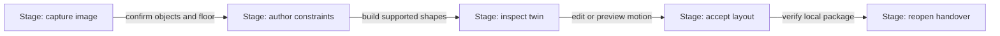
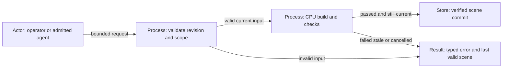
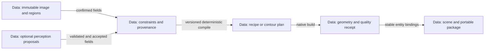
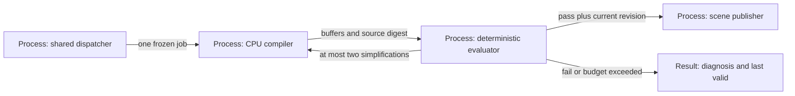
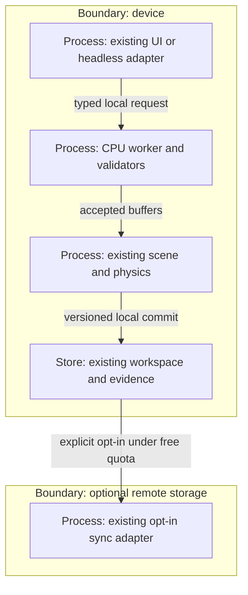

# Reference implementation — CPU procedural space twin

## Continuity and directive — reference implementation

This companion joins the [XR product owner](agentic-graph-xr-mode-prd-tad-adr-mvp-gtm.md) and [semantic-space owner](agentic-graph-xr-mode-semantic-space-prd-tad-adr-mvp-gtm.md) at the same continuity ID and revision 0.9.1. It owns D01–D10 and ADR-014–017; existing E/A/B/S criteria retain their scope. It introduces no second product, scene database, renderer, command catalog or commercial roadmap. The private audit identified the original gaps; its digest remains historical input, never a build/runtime dependency.

**CID:** Context is existing capture, procedural assets and physics with a missing evidence-to-world bridge. Intent is an editable spatial handover from an ordinary photograph. Directive is to connect those native owners with a deterministic CPU pipeline, no mandatory model, GPU compute, remote API or service. **RAO:** Product maintainer implements the smallest source-owned increment; outcome is a reviewable candidate and explicit acceptance gates, not a claim of full reconstruction or deployment.

Historical source `f16ad08ac920ed125072b6de81335e96c790e3f3` supplies procedural generation and physics; the still/manual semantic-space source was first inspected at candidate `020d4f33d322eb1ad4bd34218134d1b25edd4ebb`. The current successor adds a versioned twin extension to that native space document, CPU recipe binding, scene rendering, proxy-physics preview, package integrity and WebMCP operations. These historical revisions are not proof of the successor; its exact commit and checks belong to the new review receipt. No external conceptual code, assets, project identifiers or runtime dependencies are admitted.

## PRD — first useful outcome

An operator selects a room image or captures a still, confirms two objects and a floor, chooses supported shapes, adjusts dimensions, then inspects and edits a linked 3D arrangement. The same entities remain selectable through their photograph, graph nodes, scene and exported package. A useful **digital twin** here is an evidence-linked, editable approximation; it is neither a certified survey nor a continuously synchronized physical replica.

| Pain / status | Hook → break → fix → close | Priority / evidence needed |
|---|---|---|
| D-P1 Spatial handover loses editable object context; unvalidated | Photo → labels and geometry separate → bind confirmed entity to native recipe → reopen an editable inventory | First: near-built capture/recipes/export; observe one operator accepting two linked objects |
| D-P2 Layout trial requires specialist tooling; unvalidated | Select object → static image cannot show changes → edit procedural dimensions/placement → compare a proposed layout | Second: reuse controls and scene; record correction effort and whether approximate geometry is useful |
| D-P3 Device/network restrictions interrupt work; user constraint | Open local evidence → network/model dependency → CPU/manual path → edit/export disconnected | Mandatory feasibility gate; measure real phone behavior and cold offline reopen |
| D-P4 Generated shape hides uncertainty; source-observed risk | Plausible mesh → hidden surfaces or units appear measured → field-level provenance → inspect and correct assumptions | Mandatory trust gate; reviewer must find each unmeasured extent and physics default |

**Scope:** one room, one image first, explicit region/shape confirmation, floor/walls as authored planes or thin boxes, supported parametric furniture, optional isolated-contour volumes, local editing, bounded physics preview, animation-ready parts, semantic queries and portable recovery. Photo-only scale stays unknown. User dimensions establish authored units; a measured reference and compatible calibrated geometry are needed to label a result measured. Multiple photos may attach as evidence but do not automatically fuse into one coordinate frame.

The Launch local-file, image and URL routes share Source Files ingestion. For a single imported image, Media offers explicit next steps to view the evidence on the shared Canvas or create an editable storyboard; import alone does not claim that a 3D twin has been inferred. The URL selector labels its options as 2D Canvas layouts, leaving spatial reconstruction to the confirmed-evidence workflow.

**Non-goals:** automatic complete reconstruction of arbitrary rooms, photorealistic hidden surfaces, automatic metric accuracy, inferred physical material properties, full rigid-body angular dynamics, collision-certified navigation, general natural-language synthesis, continuous scanning, new inference service or required native app. Optional perception cannot be a prerequisite or change these claims.

| VCC | Observable condition / falsifier | Owner and proposed acceptance |
|---|---|---|
| D01 CPU independence | With network denied and model/GPU-compute adapters unavailable, image + confirmed constraints produces valid recipe, geometry buffers and export; 0 model/API calls | Generation owner; fresh-browser and headless geometry fixtures, explicit network/model call counters. Unsupported display retains 2D evidence + recipe export |
| D02 Evidence and units | Every generated entity/part resolves stable entity ID, observation region and field provenance; unknown scale cannot answer metres/clearance questions | Semantic owner; two-object linking, unit-changing correction and orphan/mismatched-frame rejection |
| D03 Deterministic edits | Same canonical input, compiler/template version and seed yields same canonical recipe/geometry digest on the same pinned runtime; edit changes only admitted fields | Procedural owner; repeat build, undo, failed draft, stable IDs and old-version restore. Cross-runtime numeric tolerance is explicit |
| D04 Geometry quality | Finite indexed geometry, valid normals/bounds, no degenerate generated triangles, budget compliance and correct part/control/pivot bindings; failed evidence cannot publish | Existing quality owner; invalid/over-budget/cancel/stale cases plus isolated-mask projection and furniture dimension fixtures |
| D05 Physics truthfulness | Reset restores authored layout; deterministic fixed-step preview respects accepted sphere/AABB proxies and static floor; unsupported rotation/shape reported | Native physics owner; floor/contact/sweep/sensor/replay fixtures. Mass/friction/restitution defaults remain authored assumptions |
| D06 Animation readiness | Part hierarchy is acyclic; pivot edits preserve intended attachment; supported clip endpoints survive export/reopen; one transform authority per body | Scene/animation owner; articulated fixture, pause/reset, zero dangling tracks. No simulation writes over source recipe |
| D07 Phone and offline | At 390 CSS px, accessible touch/keyboard capture/edit/select/export completes; committed room reopens after app close with network denied | Existing UI/offline owners; actual Safari and one desktop browser, camera grant/deny, storage eviction/quota and cold reopen. Current cold-shell blocker must be closed |
| D08 Invocation consistency | UI, slash/binding/semantic tokens and admitted agent adapters yield the same validated result, revision and typed failure | Invocation owner; real browser host and headless package tests. Catalog entries or in-process registry alone do not satisfy transport parity |
| D09 Recovery | Export/import preserves recipes, evidence, bindings, assumptions, quality receipts and optional simulation snapshot; corruption/stale writes retain previous valid scene | Existing persistence/export owners; fresh-store round trip, hash/decode/schema rejection, concurrent edit, cancelled commit and readback |
| D10 Resource/value | Two-object accepted export in ≤180 seconds of operator time after shell ready; one bounded generation job; caps below enforced | Product maintainer; five timed runs per named device, latency/memory/bytes/failures recorded. Targets are unmeasured, not current performance |

## TAD — existing owners and smallest changes — reference implementation

All protected rows bind the frontmatter source SHA; candidate rows explicitly bind its separate SHA. Relative links locate native owners, not proof of execution. Reuse dispositions are `retain-local` or `extend-owner`; no cross-repository runtime import is proposed.

| ID / exact owner and inspected export | Current capability and limit | Smallest delta / consumers / VCC |
|---|---|---|
| N01 Candidate [capture](../../canvas/src/features/three/semanticSpaceCameraRuntime.ts), `requestSemanticSpaceCamera`; [space core](../../canvas/src/features/xr-v2/semanticSpaceRuntime.ts), `applySpaceAction`; [store](../../canvas/src/features/xr-v2/semanticSpaceStore.ts), `runSemanticSpaceAction` | Still/manual evidence, confirmed regions/entities, revision-checked local package and graph linking; no full scene recipe bridge | Extend evidence → generation request → scene binding. Reuse existing IndexedDB bundles and camera lifecycle; D01/D02/D07/D09 |
| N02 [image analysis](../../canvas/src/features/image-to-glb/imageToGlbSceneFactory.ts), `analyzeImageToGlbReference`, `createReviewedImageToGlbScene`; [contour owner](../../canvas/src/features/image-to-glb/imageToGlbContourRebuild.ts), `deriveContourRebuildPlan` | CPU alpha/edge-palette mask, spans, inferred extrusion and generated source; URL loader downsamples to 192 px. Heuristic confidence is not calibrated accuracy; complex room backgrounds need manual isolation | Retain analysis for confirmed isolated regions; accept decoded local crop/mask, expose editable thickness and assumption provenance. Never feed whole-room masks as recognized objects; D01/D02/D04 |
| N03 [recipe contract](../../canvas/src/features/image-to-glb/proceduralAssetContract.ts), `parseProceduralAssetRecipe`; [text selector](../../canvas/src/features/image-to-glb/proceduralAssetTextRecipe.ts), `createProceduralAssetFromText` | Strict v1 primitives, controls, hierarchy, pivots, clips; bounded subject templates include chair/table. No image or physics fields; unsupported text fails | Compile confirmed object constraints to existing recipe; add room/furniture template parameters in owner. Keep contour plan in its existing owner rather than force it into primitive v1; D02/D03/D06 |
| N04 [builder](../../canvas/src/features/image-to-glb/proceduralAssetBuilder.ts), `buildProceduralAsset`; [session](../../canvas/src/features/image-to-glb/proceduralAssetSession.ts), `ProceduralAssetSession` | CPU geometry construction, source export never evaluated, one-second builder deadline, last-valid draft/revision lifecycle | Extend deterministic input compiler and worker boundary; use same build for UI/tools/export, retain session fence; D01/D03/D04 |
| N05 [quality](../../canvas/src/features/image-to-glb/imageToGlbQualityGate.ts), `evaluateImageToGlbQuality`, `assertImageToGlbQualityForExport` | CPU front projection, geometry/material/action budgets and stale-report export rejection. Current isolated-image thresholds are not room reconstruction proof | Reuse metrics through mode-specific policy: contour fidelity vs parametric dimensions vs room binding integrity. No duplicated gate or unconditional room-wide silhouette score; D04/D06 |
| N06 [workflow](../../canvas/src/features/image-to-glb/proceduralAssetWorkflow.ts), `runProceduralAssetWorkflow`; [workspace](../../canvas/src/features/image-to-glb/proceduralAssetWorkspace.ts), `saveProceduralAssetWorkspace`, `restoreProceduralAssetWorkspace` | Revision-fenced construction/publication and manifest-led recipe/source/model restore; [export](../../canvas/src/features/image-to-glb/proceduralAssetRuntimeExport.ts), `exportProceduralAsset`, verifies GLB container | Bind scene manifest to these versioned asset manifests, commit pointer last and read back; reject missing evidence. GLB alone does not preserve the complete editable twin; D03/D09 |
| N07 [scene semantics](../../canvas/src/features/three/xrSceneSemantic.ts), `projectXrStudioScene`, `queryXrStudioScene`; [persistence](../../canvas/src/features/three/xrScenePersistence.ts), `persistXrSceneToAuthoredSource` | Authored scene query and source save; separate captured entity IDs currently lack recipe/subject relation | Add stable entity ↔ subject ↔ asset/part bindings in owning scene document; existing canvas selection, scene editor and timeline consume them; D02/D06/D09 |
| N08 [native physics](../../canvas/src/features/physics/spatialPhysicsEngine.ts), `SpatialPhysicsEngine.advance`; [types](../../canvas/src/features/physics/spatialPhysicsTypes.ts); [adapter](../../canvas/src/features/three/xrSpatialPhysicsAdapter.ts) | CPU fixed steps, sphere/cuboid contacts, queries and snapshots; body state has translation/linear velocity, no angular state. XR adapter uses cuboids | Derive explicit sphere/AABB proxies from accepted world bounds, attach existing scene physics; show conservative proxy limits. No new physics library; D05/D06 |
| N09 [image-view contract](../../canvas/src/features/image-to-threejs/imageToThreeJsContract.ts); [workflow grammar](../../canvas/src/features/image-to-glb/proceduralAssetWorkflowContract.ts); [scene tools](../../canvas/src/features/three/xrSceneMcpRuntime.ts), `controlLocalXrScene` | Image view can be shape geometry/textured plane; asset creation and authored-scene actions execute independently. Candidate adds semantic-space tools | Connect these operations through existing validators and effect contexts; image plane alone is never reported as reconstructed room; D08 |
| N10 [offline policy](../../canvas/vitePwaRuntimeCachePolicy.ts), [installer](../../canvas/vitePythonLearningOffline.mjs), [controls](../../canvas/src/features/python-learning/LearningOfflineControls.tsx) | Existing cache/install/verify owners; an earlier uninstalled cold HTML navigation failed despite precached chunks. The successor passed the explicit verified Studio install and network-denied reopen on local Chromium | Retain revision consistency and recovery. Phone/Safari cold reopen remains a separate gate; D01/D07 |

Appearance controls reuse existing Settings, tokens, typography, icons and `xrSceneAppearanceAuthoring.ts`; no alternate Design panel, hard-coded brand palette or visual framework. This planning increment changes no appearance implementation. Future appearance work must bind the guideline's native design contract and inspected adapters in the same joined record.

### End-to-end generation contract

1. **Capture/decode:** user gesture opens existing camera owner or local file picker. Normalize EXIF/display orientation and mirroring once, retain immutable evidence hash plus processed dimensions/transform, decode under a pixel cap, stop streams on leave. Do not fetch remote images or run pose/depth models as a side effect.
2. **Confirm observations:** operator draws/corrects regions, labels objects, identifies floor and selects one supported shape family. Classical crop/mask/palette/contour suggestions assist isolated objects; low-contrast, cluttered, occluded or ambiguous input returns manual adjustment, never invented recognition.
3. **Author spatial constraints:** retain normalized image coordinates separately from world coordinates. Supply dimensions/placement directly, or use explicitly accepted camera/floor correspondences. Plane homography needs at least four non-collinear correspondences with known plane coordinates; camera-ray placement needs compatible intrinsics, pose and a plane. A 2D box alone does not define 3D extent, depth or room scale. Missing evidence gives arbitrary units and editable layout.
4. **Compile deterministically:** validate constraints, choose an existing parametric recipe or isolated-contour plan, derive stable part IDs from entity/template slots and record template/compiler version and seed. Generate primitives/extrusions through native owners, with hidden surfaces/thickness labelled authored or procedurally inferred. No LLM, neural mesh generation, `eval`, dynamic imported source or API request in this stage.
5. **Evaluate:** run existing geometry/action checks plus binding, unit and mode-specific constraints below. Failed drafts remain editable while the previous accepted geometry stays visible. At most two deterministic simplification retries; no unbounded agent loop or silent quality-threshold reduction.
6. **Bind and inspect:** publish only to the still-current scene revision. Select entity from graph, photo or 3D to reveal evidence, uncertainty, dimensions and supported controls. Observed arrangement and proposed layout remain separate revisions; edits do not rewrite raw evidence.
7. **Simulate/animate:** explicitly enable a bounded sandbox using accepted proxies and authored physics parameters. Existing animation owns kinematic targets; physics owns dynamic translation; source recipe owns rest pose. Pause on background; reset from authored state; no implicit persistence of simulated motion.
8. **Save/export/reopen:** persist evidence and asset artifacts through their existing owners, then atomically commit the owning scene manifest/reference. Verify readback, export self-contained versioned package and restore in a fresh local store. Model export is a derivative; the recipe + evidence + bindings package is the editable handover.

### Typed contracts and provenance

The table describes the complete target contract. The 0.9.1 source candidate implements a bounded nested `semantic-twin/v1` in the existing space document: entity/observation/hash binding, native v1 recipe, user-authored room/object dimensions and placement, revisioned actions, integrity-wrapped package and native GLB derivative. Per-field uncertainty, scene asset manifests, quality receipts, canonical cross-runtime geometry hashes and optional neural perception remain proposed. The local classical-perception successor is recorded below. Strict v1 asset recipes continue rejecting unknown keys; do not create another registry or silently mutate old schemas.

| Record | Required fields / ownership |
|---|---|
| Generation request | Existing document/space ID, expected revision, request ID, observation ID/hash, region/mask ref, entity ID, template ID/version, seed, constraints, unit/frame status, compiler version; existing action validation owns limits |
| Constraint evidence | Value + unit + provenance (`confirmed`, `authored`, `measured`, `procedurally-inferred`, `perception-proposed`) + observation/ref + uncertainty/reviewer state. Confidence without calibration stays a heuristic score |
| Optional perception input | Bounded boxes/masks/depth/camera estimates, shape/dimensions, coordinate convention, input hash/transform, provider/model/backend/version when present, raw confidence meaning and timestamp. No executable code or commands; reject mismatched frame/hash, nonfinite values or oversized tensors |
| Scene binding | Stable entity ID, observation refs, asset manifest/revision/hash, recipe or contour-plan identity, subject/part IDs, scene transform, scale status, collider proxy policy, clip refs and proposed-layout revision; owning scene manifest is authoritative |
| Quality receipt | Input/recipe/geometry digests, compiler/template/policy versions, per-gate metrics, failures, elapsed time, bytes and measured backend. Receipt is invalidated by any bound edit; non-cryptographic UI fingerprints are not package integrity hashes |
| Result | Operation/status, expected/resulting revision, accepted artifact refs, selected IDs, assumptions, typed errors and durable-readback status. Duplicate request ID returns its bound result; changed payload under that ID is rejected |

Use canonical key ordering, stable entity/part ordering and declared numeric quantization for deterministic hashes. Hash source bytes separately from normalized pixels. Freeze inputs before asynchronous work; cancellation, document switching, newer edits and import invalidate late publication. Persisting dependent artifacts first may leave recoverable orphans on failure; it must not expose a partially committed scene. Retain the previous valid manifest and let existing cleanup reclaim only unreferenced artifacts under its policy.

### Geometry, physics and animation quality

Mandatory generation and quality checks run on CPU over data/geometry buffers. Three.js geometry classes do not require a renderer for construction. The browser's interactive Three.js view still needs WebGL support and may use a GPU or a software driver; this plan does not promise hardware-free WebGL. If all GPU use is prohibited or rendering fails, retain CPU generation, 2D evidence/controls and export. A dedicated GPU and WebGPU compute are never required by the baseline.

| Gate | Accept / reject policy |
|---|---|
| Structural geometry | Finite positions/normals/transforms, valid indices, nondegenerate visible triangles, bounded world extents, positive volume for volumetric parts, declared thin planes, acyclic hierarchy; manifoldness only for export modes that require it |
| Reference fit | For a confirmed isolated mask, report the existing 64×64 front-projection metric and policy (current threshold 0.72) with its reference. This compares a normalized contour, not calibrated perspective or hidden geometry. Parametric room/furniture mode instead gates accepted constraints; future calibrated reprojection needs separate validated camera/occlusion tests |
| Materials | Reuse native colors/materials and existing material limits; no remote texture dependency. Existing image policy's color score 0.82 is specific to that mode; surface appearance and real physical friction remain different fields |
| Binding/scale | No dangling entity, part, asset, track or observation refs; unit/frame compatibility before composition. User-authored dimensions are not automatically sensor measurements; reject metric queries for unknown scale |
| Physics | Static floor/walls; explicit dynamic/kinematic choice; positive mass and bounded material values. Rotated/concave meshes use labelled conservative AABBs or disable interaction; no claim of angular/mesh collision fidelity. Reject initial unacceptable overlap; verify bounded sweep/contact fixtures |
| Animation | Reuse pivots, sockets and clip tracks; respect current parser's duration/key bounds and endpoint requirements. Dynamic bodies cannot simultaneously take animation translation. Articulation without supported collision treatment is visual-only, with physics disabled for that motion |
| Publication/export | Shared quality decision binds actual output digests and current source revision; stale reports, cancelled work or invalid data block new publication. Existing GLB validation remains mandatory; package hashes, schema and decoded evidence checked on restore |

### Resource, offline and invocation contract — reference implementation

Initial mobile target is one room with ≤20 generated entities, ≤96 visible mesh parts in aggregate, ≤30,000 triangles, ≤24 materials, ≤32 colliders and ≤2 concurrently playing clips. Existing asset recipe hard bounds remain ≤48 parts, 32 controls, 8 clips and 32 keys per track, 64 KiB recipe and 120,000 triangles; the smaller mobile aggregate limits win. Retain one last-valid result and one pending job. Target transient generation memory ≤64 MiB beyond shell; measure peak on devices and stop/reduce before public enablement. No measured memory guarantee exists today.

Use ≤192 px for existing contour analysis; a proposed local working image cap is 1,024 px on the longest side and 4 MiB RGBA. Decode source dimensions before expensive processing and reject unmanageable images; processing resize alone does not cap original decoder memory. Existing capture limits remain authoritative until a versioned change passes compatibility tests. Geometry work goes through an on-demand worker with transferable buffers; headless core has no DOM/camera dependency. Current builder's one-second budget remains; target total two-object generation ≤2 seconds p95 over five named-device runs, hard cancellation at five seconds and main-thread tasks <50 ms. These are proposed gates, not benchmark results.

Physics target is fixed 1/60-second steps, at most four substeps per rendered frame, ≤32 colliders and a ten-second user-started preview. Drop excess accumulated time with an explicit slow-device state; do not increase work to catch up indefinitely. Deterministic replay uses same initial snapshot, ordered inputs and tick count on a pinned runtime; cross-browser physics is tolerance-tested, not promised bit-identical. Pause when hidden, release buffers/geometry/materials on replacement, and expose cancellation.

Always-loaded model bytes and required inference/prompt/completion tokens are zero. No new required dependency, server, subscription, paid add-on or overflow path. All added feature code loads on demand; <600 lines/file and <500,000 bytes per delivered chunk. Portable data artifacts such as a GLB may exceed a code chunk: retain existing 8 MB GLB ceiling, segment optional package assets under the existing installer contract, and measure total package bytes separately. Do not disguise a model as a required data asset.

Optional local neural perception is disabled by default, independently license/integrity/budget-admitted, and removable without breaking D01–D10. It may propose typed masks/depth only; user validation or explicit policy must accept them before deterministic compilation. The image-to-geometry pipeline can therefore run entirely in this repository on the user's CPU, using authored regions/dimensions or independently admitted open-source on-device perception as input; neither Codex nor an external or paid generation service is required at runtime. No API-backed perception is part of this increment. A single picture still leaves hidden surfaces and metric scale unknown, so generated geometry is editable approximation unless calibrated measurements establish otherwise. Existing depth weights/offline closure and per-chunk limits remain unresolved in the semantic companion; do not enable that path by default. Classical multi-view reconstruction is deferred until a CPU correspondence/calibration/error experiment supports it; no identity-pose fusion.

Offline-first release requires shell + worker + templates + evidence + renderer/export assets verified at the same revision, then actual app-close/network-denied reopen. Reuse the existing installer/cache policy and recovery UI; the verified `studio-offline` route passed a local Chromium cold reload with an authored twin, while uninstalled ordinary navigation remains outside the guarantee. Local storage can be evicted: surface persistence/quota status and offer portable export, never guarantee indefinite retention. Optional sync may reuse the existing Cloudflare storage adapter only by opt-in; no new resource, automatic private-media upload or paid fallback. Free hosting is not itself FOSS.

| Surface / current status | Native integration decision |
|---|---|
| `/asset.create @text #procedural-asset` exists | Keep bounded native template or validated recipe construction; `@text` alone does not authorize generation |
| `/image.to-glb @image-to-glb #image-to-glb` and `/image.to-threejs @image-to-threejs #image-to-threejs` exist | Reuse image conversion routes and their explicit output types; a plane is not a volumetric twin. Resolve only local, admitted observation/crop assets in this path |
| Candidate `/space.find #category`, `/space.select @entity`, `/space.label @entity #category label="name"` | Retain query/selection/correction; schema-valid expected-revision mutations remain authoritative |
| Proposed `/space.build @entity #procedural-asset`, `/space.simulate`, `/space.reset` | Names are design proposals, not runnable commands. Extend existing catalog/dispatcher and scoped contracts together after collision/effect review; no new parser or grammar fork |
| Existing authored `/xr.place`, `/xr.transform`, `/xr.physics` and scene controls | Apply generated scene bindings through these native owners; preserve source/current-document/effect checks |
| WebMCP / MCP | Extend existing semantic-space/scene tools with inspect-capabilities and bounded generation operations; one core for UI and tools, ≤16 tools/32 KiB discovery. Browser host registration must be observed; fallback registry is not host proof. Headless package operations need explicit files/revision authority; camera requires an authorized page |

Agent nativeness means inspectable schemas, provenance, deterministic validation, bounded jobs, recoverable errors and replayable evidence. It does not require an LLM in the generation loop. Read-only inspection never starts capture/build/simulation. Mutation tokens do not bypass permission, scope, current-revision or effect checks. Text/OCR/image metadata remains untrusted data.

## TAD — five flows and diagram register — reference implementation

All diagrams are proposed at 0.9.0, one Mermaid fenced-body ingest each on the declared Flowchart 2D surface. Inventory and captions are the text fallback on phone/offline. Typed node roles are explicit in labels; projection is parse-only, with zero model calls/tokens. Static legibility and canvas rendering require their own receipts.

**Diagram PT-J** · Class: Journey stage map · Notation: flowchart LR · Version: 0.9.0
**Caption:** The operator reaches an editable handover through explicit confirmation.

| Inventory | Touchpoint / check |
|---|---|
| J1, J2, J3, J4, J5 | Capture, constraints, inspect, edit, reopen; operator uses existing canvas; D01/D02/D07/D09 |

**Diagram PT-W** · Class: User workflow · Notation: flowchart LR, substituted for sequence to retain node-link projection · Version: 0.9.0
**Caption:** Only current validated work replaces the accepted scene.

| Inventory | Happy / alternate / error |
|---|---|
| W1, W2, W3, W4, W5 | Request → validation → build → readback; unsupported input or stale/cancelled result retains last-valid state; D03/D04/D08/D09 |

**Diagram PT-D** · Class: Data flow · Notation: flowchart LR · Version: 0.9.0
**Caption:** Typed evidence produces recipes; geometry never becomes the evidence source.

| Inventory | Artifact owner |
|---|---|
| D1, D2, D6 | Existing evidence/scene schema; optional perception is isolated input, D02 |
| D3, D4, D5 | Existing procedural/contour, quality and scene/package owners; D03/D04/D09 |

**Diagram PT-H** · Class: Orchestration / harness flow · Notation: flowchart LR · Version: 0.9.0
**Caption:** A deterministic evaluator bounds retries and publishes evidence with the result.

| Inventory | Responsibility / cap |
|---|---|
| H1, H2, H3, H4, H5 | Dispatch, build, evaluate, publish, diagnose; one job, two retries, five-second cancellation; D01/D03/D04/D08 |

**Diagram PT-T** · Class: Runtime topology · Notation: flowchart TB · Version: 0.9.0
**Caption:** Local work is complete without the optional storage boundary.

| Inventory | Residency / trust |
|---|---|
| LOCAL; T1, T2, T3, T4 | Device boundary: untrusted input is validated before native build and commit; renderer optional for CPU artifact work |
| OPTIONAL; T5 | Remote boundary: optional existing storage only, no inference/generation service; D01/D07/D09 |

Register target: PT-J 5 nodes/4 edges; PT-W 5/5; PT-D 6/5; PT-H 5/5; PT-T 5/4 plus 2 clusters. Total 26 nodes, 23 edges, 2 clusters, 51 projected elements. Graph IDs are local to their fenced body. Each stays below 12 nodes/20 edges/depth 2; captions/inventories provide reading alternatives. Diagram source budget <5 KiB, model input/output tokens 0; named checker result belongs in the checkpoint below.

## ADR — selected approach

| Decision | Constraints → alternatives → outranking | Cost, reversibility and revisit |
|---|---|---|
| ADR-014 Deterministic spine | Mandatory CPU/no API/no generation ML/offline/manual fallback eliminate hosted or GPU/model-dependent generation. Rank existing primitive/contour owners first, hand-authored mesh second (higher effort); optional perception cannot outrank required constraints | No new service/dependency; modest bridge work. Replace individual templates through versions, never rewrite source evidence. Revisit after measured unsupported-object demand |
| ADR-015 Evidence-bound approximation | Single image cannot identify hidden geometry or metric scale. Choose manual constraints + labelled procedural hypotheses over unqualified automatic reconstruction. Keep optional perception proposals separate | More operator input, less opaque error. Corrections regenerate from recipe; measured/calibrated path may refine fields with provenance. Revisit after device calibration/error study |
| ADR-016 Existing recipe/scene/physics owners | Extend current asset and scene manifests; do not add another editable-world store, executable-code sandbox or physics engine. Native translation-only proxies precede richer dynamics | Limits shape/collision realism but minimizes migrations/dependencies. Explicit versioned contract-only adapter where necessary. Revisit angular/concave demand with a separate budgeted ADR |
| ADR-017 Local first and capability-aware display | Required generation/evaluation/persistence uses CPU/local data; the shared Canvas defaults to WebGL and 2D/export remains available. [WebGPU](https://www.w3.org/TR/webgpu/) is an optional device-renderer prototype for linked procedural spaces in ordinary 3D, never a generation prerequisite or new hosted service; optional sync uses the current adapter | WebGPU has no API usage fee or server charge by itself, but adds engineering/test time and device GPU, memory, energy and download cost. Current custom shaders still require a node/TSL port for [Three.js WebGPURenderer](https://threejs.org/manual/pages/webgpurenderer); unsupported scenes retain WebGL. The implementation checkpoint below distinguishes source checks from outstanding final visual, Safari and phone proof. No paid overflow, package addition or mandatory model download |

## MVP — bounded implementation and verification — reference implementation

Product maintainer owns all slices, sequentially; refresh exact source revisions and admission before implementation. These are active-work caps, not promised delivery dates. Required service spend and model tokens are zero; actual engineering time/device energy/CI cost remain unmeasured. Total first-increment ceiling: 12 active hours, ≤4 new production modules, ≤50,000 added source bytes, <600 lines/file and <500,000 bytes/chunk. At each cap, stop expansion and record the smallest remaining gap; do not claim parity. Prefer extending/extracting owners over wrappers or replacements. The current candidate completes the manual primitive-template path through the existing renderer, local store, GLB export and physics preview; full image-contour reconstruction and richer animation remain outside this increment. The successor below adds worker-isolated classical region proposals.

| Slice / active budget | Delta and dependencies | Exit evidence |
|---|---|---|
| M1 Constraints and bindings / 3 h, ≤1 new module, ≤14 kB | N01/N03/N07, two confirmed objects + authored floor, versioned scene binding; no automatic room inference | D02/D03/D09 core fixtures; existing entity IDs survive graph/scene edits and restore |
| M2 CPU compiler and quality / 4 h, ≤2 new modules, ≤22 kB | N02–N06, local region → primitive/contour recipe, shared CPU quality and worker/cancel; depends on M1 | D01/D03/D04 with network/model/GPU-compute disabled; invalid input, stale result and unsupported shape tests |
| M3 Interaction and invocation / 3 h, ≤1 new module, ≤10 kB | N07–N09, existing inspector/scene controls, explicit physics preview, bindings and scoped tools; depends on M2 | D05/D06/D08; fixed-step proxy fixtures, supported clip export, UI/tool same result; real host/headless gates remain separate |
| M4 Offline/device handover / 2 h, no new service/module, ≤4 kB | N10 existing policy change plus installer/restore checks; depends on M1–M3 and full shell closure | D07/D09/D10 on named phone/browser; cold airplane-mode reopen and timed two-object handover |

If the shell change cannot safely fit M4, keep cold-offline release blocked and readmit a separately budgeted owner fix; do not weaken the existing cache consistency policy. Optional neural perception and multi-view work are deferred, with no reserved spend/time until core acceptance or measured customer need justifies them.

Validation reuses existing suites: `proceduralAssetWorkflow.test.ts`, `proceduralAssetWorkspace.test.ts`, image-to-GLB quality tests, native spatial physics tests, XR source smoke, semantic-space capture/store tests and WebMCP lifecycle tests. Add only behavioral integration cases missing for D01–D10. Use the repository affected-check selector; a proposed VCC ID is not an executable test name. Build/typecheck/browser evidence binds exact candidate SHA and target device; prior source receipts do not establish this new pipeline.

Deploy boundary: this source successor grants no production effect. Source implementation uses the admitted native lane and scoped checks; protected integration requires exact green provider evidence; runtime publication requires existing explicit environment authority, device/offline gates and readback. Reuse [production contract](../production-core-runtime-release.md) and [rollback owner](../production-rollback-baseline.md). Retain prior scene/package reader and deployment artifact; rollback restores the last valid compatible version without deleting raw evidence. No runtime activation is part of this revision.

## GTM — nearest useful handover

Rank 1 remains the semantic companion's proposed **$1 operator-assisted inventory/handover**: two evidence-linked editable objects and an export the operator accepts. This increment tests whether editable geometry adds value; it does not create a second offer or revenue claim. Rank 2 is user-dimensioned layout preview after rank 1 demand; automated full-room reconstruction fails current feasibility constraints and stays deferred.

Pilot only through an authorized channel: observe first-use time, accepted/rejected approximation, number of corrections, failed exports and support minutes. Compare against the same operator's photograph-only handover. Ask for a second use within seven days; no accepted useful package after three attempts means revisit scope before perception work. Pain, market size, price acceptance, frequency, ROI and willingness to pay remain unvalidated. No outreach, payment collection or contract action is authorized here.

Marginal required inference/sync spend target is $0; separate existing hosting/domain cost, device energy, engineering and support. The $1 price is a hypothesis, not margin evidence. Optional hosting free quota never permits paid overflow. Retain the existing C01–C16 venture record: market sizing, jurisdiction/privacy/IP obligations before paid delivery, linked financial statements/scenarios and audience projections remain incomplete discovery work with Product maintainers accountable. No investment-ready or production-ready claim follows from a source prototype.

## Coverage, evidence and next checkpoint — reference implementation

C01/C03/C04/C08 map to D-P1–4, D01–10 and M1–M4; C05/C06/C07 map to N01–10, typed contracts, gates and ADR-014–017; C09/C10/C16 map to the shared handover experiment and stop rule. C02/C11/C12/C13/C15 retain the semantic companion's explicit commercial evidence gaps; C14 is the admitted documentation successor and separate release boundaries. This is a bounded alignment record, not a full conformance percentage or independent product assessment.

| Evidence | Current disposition / owner / next check |
|---|---|
| Protected source inspection | Native recipe/builder/export, renderer and translation-only physics verified at historical source SHA; it does not prove this successor |
| Candidate source inspection | Source candidate links image-confirmed entities to deterministic primitive recipes, authored floor/placement, the existing Three.js canvas, local proxy physics and package/GLB exports. Two-object fresh-store reopen, invalid geometry, package-tamper and structured/slash agent actions pass focused local tests. The local TypeScript check and CI-input regression suite pass; exact published SHA and provider check belong to the release receipt |
| Documentation checks | Current 0.9.1 joins, links, line caps and diagram validator must be rerun after this edit; the 0.9.0 receipts remain historical. Guideline/audit hashes remain historical authoring evidence; static visual proof is separate |
| Browser handover | Local Chromium, 390 × 844 CSS px: a runtime-supplied 2048 × 1152 PNG with a misleading `.jpeg` suffix imported both as a local file and from a same-origin URL, downscaled to 1280 × 720, then manually confirmed, built, linked to the shared 3D canvas, previewed with native physics, exported as a valid GLB and integrity-wrapped JSON, and restored in a fresh browser context. The input is a panorama, not a room; its single box and arbitrary floor are authored workflow probes, not a reconstruction-quality claim. No validation asset path or bytes are committed |
| Device and transport | Verified Offline Studio installed 858 files / 26.8 MiB in local Chromium, then reopened the saved image, entity and procedural model with the browser network disabled; offline GLB export retained a valid `glTF` header. Physical phone/Safari camera, real browser agent host and headless MCP parity remain unproven; recheck on named surfaces |
| Readiness | Development: bounded source candidate with local browser and cold-offline proof; Production Release: no authorized effect; Runtime: physical-device, source-file handoff and full acceptance remain unverified |

| Type / severity | Rule ID / rule text | Artifact / evidence | Remediation / accountable owner |
|---|---|---|---|
| `pain-point-not-validated` / major | `pain-point-to-feature-mapping#3`: retain unvalidated label without quote/ticket/behavior | D-P1/D-P2 and GTM lack operator observations | Product maintainer records accepted pilot outcome before commercial baseline |
| `render-proof-absent` / major | `dual-target-portability#6`: verify static legibility and projected counts | PT-J–PT-T static visual proof absent | Product maintainer reviews phone-width/static and canvas preview before render sign-off |
| `scenario-set-incomplete` / major | `venture-record-pitch-deck-business-plan--financial-model#5`: linked statements/scenarios or incomplete discovery sketch | Shared GTM has no observed unit economics | Financial modeling function supplies evidence before an audience business case |

Next checkpoint is exact source/CI review, Source Files and Media/Camera handoff, and a named-device two-object demonstration. The primitive path is bounded to 20 objects, 24 material parts, 30,000 triangles and authored floor/size/placement; it does not infer hidden surfaces, camera pose or metric scale. Local Chromium cold navigation has passed; physical phone/Safari and agent-host acceptance still wait on the named surfaces, with no promised external-wait ETA. Preserve these criteria and update this joined record at implementation/turn boundaries.

## Implementation successor — local pixel proposals, 2026-09-25

**Request and revision:** implement on-device perception feeding deterministic geometry; enhance the imported image view with actual editable Three.js volumes. Source predecessor is `3560d0a98c50e57f36babb9c0711fc608ad4529c` ([review #1257](https://github.com/huijoohwee/agentic-graph/pull/1257)); its green checks are historical. The `xr-local-perception` successor's containing Git commit and publication receipt bind this increment. Existing D01–D10 acceptance and deployment boundaries stay in force.

**PRD/MVP:** all existing single-image import routes offer **Analyze image locally** in Media. The operator reviews numbered visible regions, excludes unwanted groups and corrects labels, then selects **Build selected regions in 3D**. A local space commit retains the image hash, normalized region, user confirmation, proposal method, native box recipe, material colour and editable placement. Source Files receives the existing semantic-space JSON projection. **Edit or export built space** opens the existing semantic-space editor. The ordinary panorama view remains a separate explicit choice.

**TAD:** extracted the existing foreground-mask/palette analyzer from the image-to-GLB scene factory into its pure analysis owner; existing exports remain contract-compatible. An on-demand module worker performs bounded connected-component extraction over that same mask. The reviewed region compiler uses existing box recipes, controls and geometry gates. One atomic revision admits image, entities and bindings; CAS/readback and Source Files mirroring stay in the existing store. Shared entity-to-Canvas linking was extracted from the existing panel; generated rooms supply bounds to the existing camera-fit controls and use the shared framing settings. Linked 3D presentation shows the generated space instead of overlapping graph-node spheres; 2D retains graph entities. Unrelated documents do not activate the saved twin.

**ADR-015 refinement:** this is classical pixel grouping, not furniture recognition, depth inference or complete reconstruction. Region width/height and average colour come from pixels; image axes are mapped to a proposed floor layout. Every box uses explicitly disclosed thickness `0.4` in arbitrary units. Shape, unseen surfaces, labels and layout require review. A room already marked authored-metres rejects this uncalibrated compilation. Low-contrast/empty masks fail visibly and retain manual confirmation. A panorama may yield sky/land groups, not individual buildings or a measured city. Optional neural weights remain disabled; no external source code, service or new package is introduced.

**Resources:** one active analysis, ≤192×192 RGBA (147,456 input bytes), ≤12 proposals, ≤1,024-pixel saved evidence, five-second worker deadline, 15-second image-load deadline, cancellation on leaving/replacing the image. Original images over 16 megapixels are rejected after browser decode; pre-decode memory remains a gap. Generation retains 20 objects/24 material parts/30,000 triangles and local storage limits. The successor expands admission to seven new production modules (about 31 kB combined, including two extracted owners); no new always-loaded model bytes, inference tokens or runtime bill. The successful local production build emits a 2.65 kB worker, 3.57 kB client and 10.11 kB lazy review component before gzip. Existing unrelated oversized chunks remain baseline debt. The shared WebGL display may use the device GPU; analysis and generation need no GPU compute. Device energy, peak memory and phone latency are not measured.

**Invocations:** the existing semantic-space WebMCP control adds `operation=analyze` with a saved `observationId`, or `/space.analyze @observation-id #regions`. It returns bounded unconfirmed proposals, input evidence hash, space revision and uncertainty without persisting them or requesting camera access. Existing confirm/build/edit/query operations remain the mutation owners. A stale space rejects late analysis. Native headless MCP and physical Safari host parity remain separate gates.

**Checks and handoff:** three new focused Node tests pass for deterministic coordinates/colours, CPU geometry, atomic fresh-store/package round-trip, invalid/metric/capacity/stale rejection and invocation parsing (`node --import tsx --test canvas/src/features/xr-v2/__tests__/semanticImagePerception.test.ts`, with the canvas tsconfig). The existing image-to-GLB suite passes 33 cases. The semantic-space and WebMCP scope regression pass six cases with `npm -C canvas run test:ci:unit -- xr.semanticSpace agentReady.webMcpRuntime.scope`; a semantic-space-only filter selects zero because the legacy UI runner requires a UI/agent-ready hint. Final TypeScript and local Vite checks, source hygiene and the game source contract pass. The production build passes in 37.91 seconds after an initial `ENOSPC` failure; only failed task build output was removed, preserving source and shared caches. That local build precedes the final small store/UI guards; provider CI must bind the published candidate.

**Live receipt:** local Chromium at `127.0.0.1:4179`, local-file and URL import of a runtime-only image → two reviewed pixel regions → atomic local save → Source Files and fitted shared Three.js volumes. At 390 × 844 CSS px the review panel's client/scroll widths both measured 332 px, and action/text fields measured at least 44 px high. The existing editor opens with shape, colour, size, position, simulation and export controls; its GLB action reports successful export without console errors, while the automation download event was not delivered (download-file readback is not claimed). `/space.analyze @observation-id #regions` executed through the live browser tool host and returned two unconfirmed proposals with the saved evidence hash; subsequent inspection retained the same revision and entity count. XR discovery exposes 12 tools / 29,216 bytes, below the 32 KiB cap. No validation image or machine-specific path is in product code.

**Next bounded action:** publish this candidate for protected review and bind the exact provider result; no integration or deployment is inferred. Next device slice is capped at 45 active minutes, zero new production modules and no added model/download bytes: validate cold offline worker-cache closure, cancellation during decode/worker startup and a physical phone/Safari flow. These gates remain unverified; browser reload also clears the transient review draft while preserving the saved space. Production Release: no authorized effect. Runtime: local source prototype only; useful object recognition and measured geometry remain open. The next session must retain these gaps rather than claim full single-image reconstruction.

## Implementation successor — optional device renderer, 2026-09-25

**Request and authority:** implement optional WebGPU without a generation service or new infrastructure. Source predecessor is `0dc5584fcfa58c60358e473797e274da748a722f` ([review #1258](https://github.com/huijoohwee/agentic-graph/pull/1258)); its docs-contract and Integration Gate passed and remain historical proof. This `xr-webgpu-renderer` successor is bound by its containing commit and publication receipt. Publication is a review handoff, not permission to integrate or deploy. The existing commercial discovery and D01–D10 acceptance gaps remain open.

**PRD/MVP:** the existing Media panel adds **3D renderer** with WebGL as the compatible default and an explicit WebGPU option. The choice lasts for the browser session. A linked procedural space in ordinary 3D can use the device renderer; panorama/custom-shader, XR, gameplay, learning, map, imported-model and spatial-capture scenes use WebGL. The panel explains device/download costs and provides an explicit retry after fallback. Image analysis, review, deterministic geometry, evidence, local save and export retain their owners; selecting a renderer does not revise the space document.

**TAD/ADR-017 refinement:** use installed Three.js r170 with the existing Fiber 8 Canvas, Camera, materials and snapshot owners. A lazy adapter gates frames until asynchronous initialization succeeds, implements the narrow Fiber cleanup contract, fences stale request/Canvas status, releases a late device after unmount and remounts a fresh WebGL canvas after failure. Submission stops immediately; initialized renderer caches are released by Fiber after child material cleanup, preventing stale disposal listeners from accessing cleared caches. Ineligible WebGL scenes keep a stable Canvas key when a renderer preference changes. Module loading is bounded at ten seconds and GPU initialization at five seconds. Device loss and rendering errors stop GPU submission and surface fallback. GPU mode requests low-power preference and DPR 1; these are resource controls, not measured energy savings. Scene admission remains valid while the old Canvas clears its camera-fit state, avoiding a blank remount. Canonical aliases keep deep renderer imports and existing Three.js imports on the same installed classes in symlinked worktrees. The development optimizer includes both paths together; production chunks separate common code from optional GPU code without circular chunk dependencies.

**Invocability:** the existing semantic-space browser tool accepts `operation=renderer backend=webgpu|webgl`, or `/space.renderer @canvas #webgpu` and `/space.renderer @canvas #webgl`. Inspection reports requested and active backend, phase and reason. This is a browser-session preference, not a persisted scene mutation. No headless GPU session is promised. Live XR discovery measured 12 tools / 29,468 bytes, below the 32 KiB discovery cap.

**Economics and budgets:** no paid API, account, model download, new package or Cloudflare resource is required. Rendering uses the user's GPU, memory and battery; the feature still incurs development, testing, bandwidth and cache storage costs. Initial implementation estimate was 60 active minutes, five new production modules and 35 kB of source; verification required an additional compatibility/debugging pass. The five modules total approximately 10.6 kB. CPU generation retains its existing geometry limits. Optional GPU and adapter chunks are excluded from the initial PWA precache and use the existing script runtime cache after a successful request. First use requires those local application assets to be available; cold offline GPU availability is not guaranteed and missing assets retain WebGL. Device energy, peak memory, frame time and any speed advantage remain unmeasured.

**Automated receipt:** five focused renderer tests cover scene/capability gating, stale ownership, grammar, initialization, device-loss frame suppression, cleanup, timeout and late resolution/rejection. Ten existing renderer lifecycle tests pass. Six semantic-space/scope regression cases and four native XR session/scope cases pass. TypeScript and local Vite runtime checks pass. The final production build passes in 52.66 seconds with no circular chunk warning. Three.js chunks are 80,182–380,338 bytes (GPU 380,338; WebGL 333,585; shared core 291,227), below the 500 kB cap; the optional GPU/adapter files are absent from the generated precache. Existing unrelated oversized chunks remain baseline debt. Changed-file hygiene and diff whitespace checks pass; no validation image or machine-specific path is added to product code.

**Live receipt and limits:** local Chromium at `127.0.0.1:4179` retains revision 4 / eight confirmed entities while the browser tool and Media selector switch the shared Canvas between WebGPU and WebGL. Corrected lighting renders the same floor and procedural volumes under both backends; repeated switching after the final cleanup correction reports no new console errors. Shared Camera high-angle framing remains functional. At 390 × 844 CSS px the renderer region's client/scroll widths are both 340 px and its select is 44 px tall. The final production bundle boots its toolbar at the configured `/agentic-graph/` base without console errors; production GPU scene interaction is not claimed. Scene-ineligible WebGL fallback was observed earlier. A live five-second initialization timeout retained the visible WebGL scene; the explicit Retry WebGPU action subsequently reached ready without console errors. Unavailable adapters, device loss and late cleanup also have focused unit coverage. Real device-loss recovery, cold offline GPU cache closure, physical phone/Safari behavior and frame-time/memory/energy measurements remain unverified. This is an optional local prototype, not a certified device release.

**GTM and next gate:** there is no pricing change, paid-service requirement or measured commercial benefit from this optional renderer. Retain the CPU/WebGL default for the first spatial-handover workflow. The next device verification slice is capped at 30 active minutes and zero new modules: exercise production GPU interaction, unavailable/offline/device-loss fallback on a physical phone/Safari and record frame time/memory. Protected review and exact provider CI bind source publication; production release has no authorized effect.

## Implementation successor — image shape and appearance fidelity, 2026-09-25

**Context / PRD:** a source photo was reduced to flat-colour rectangular volumes; adding only a photograph to a box does not satisfy object geometry. This successor reuses the existing visible-contour reconstruction and procedural part builders. Source predecessor is `48bd4fbf5a8701c3658fa89248db06e7ab9416bc` ([review #1260](https://github.com/huijoohwee/agentic-graph/pull/1260)); this implementation is bound by its containing commit. Acceptance is a reviewed image region producing actual selectable Three.js geometry in the shared Canvas, with local persistence and the same geometry in GLB export. Commercial validation and the earlier C01–C16 coverage dispositions remain unchanged; no new sales or readiness claim is made.

**MVP behavior:** after any shared image import, **Analyze image locally** preserves each proposed component's bounded visible silhouette. Review offers **Visible outline → 3D volume** by default when available, or an explicitly chosen chair, table, sphere, cylinder or box. Contours generate bevelled `ExtrudeGeometry` components, including supported negative spaces; chair/table choices use the existing multi-part procedural recipes. These choices are author confirmations, not automatic category recognition. Contour and box depth start at 0.4 arbitrary units; other models use template proportions. Image crop aspect controls initial width/height. The existing editor owns size, placement, colour, selection, simulation and export. New silhouettes round-trip inside the existing versioned space document and Source Files projection. Earlier saved boxes remain intact; reanalyse an image to choose contour geometry.

**TAD / ADR-018:** `semanticTwinScene` is the shared construction, finite-bounds, triangle-budget and disposal owner for save validation, Canvas and selected GLB export. It delegates contour analysis/generation to the existing image-to-GLB modules, and ordinary shapes to the existing procedural asset builder. No second contour algorithm, renderer, import owner or external generator is introduced. The analysis worker records ordered disjoint crop-pixel runs (at most 192 × 192 and 2,048 runs per component); invalid/imported shape records fail validation. Generated plans must retain at least 90% of their accepted run area and pass the existing reconstruction budgets, then the shared 30,000-triangle scene gate. This internal retention check is not an object-recognition or photographic-fidelity score. Geometry failure rejects a new save before persistence. Contours share one material per entity and use authored colour; hidden geometry and depth remain approximations. The existing drop simulation still uses bounding cuboids, not contour collision meshes.

**Appearance and export:** box mode preserves the saved image crop on its front, with authored-colour hidden faces. The source crop fits edited proportions without stretching. Image decoding is local, sequential by evidence hash, bounded by five-second decode and ten-second preparation deadlines, and cancelled on scene cleanup. Photo appearance owns at most 4,194,304 atlas pixels across candidates (16 MiB raw RGBA, excluding decoded image and renderer overhead); each face is at most 1,024 pixels per axis. It adds no triangles or materials per box. Contour geometry is independent of photo textures. Selected GLB export now uses the same construction and appearance path, retains authored dimensions and rejects stale revisions; full space export retains world placement and evidence. Resource disposal covers scene geometry, materials and owned textures.

**AI / invocability:** analysis remains deterministic CPU perception, with no model download, account, token spend or generation API. `/space.analyze @observation #regions` uses the same worker and now returns bounded silhouette proposals. Existing WebMCP inspection, selection, edit, colour, simulation and reset act on saved contours through the same entity IDs. Contour creation is currently an explicit import-review action; the public `build` tool continues to accept its five existing procedural templates. Headless creation parity for contours is an explicit next gate, not implied by browser support.

**Economics / execution:** three new production modules total about 14 kB, with no new package, hosted resource or always-loaded model. Initial fidelity work was capped at 45 active minutes; the object-geometry clarification adds a 30-minute slice using the already installed builders. Existing scene limits remain 20 entities, 24 material parts and 30,000 triangles. Local generation is CPU-only; WebGL/WebGPU display still consumes device graphics resources. No billing change, measured energy saving or performance advantage is claimed. Existing saved evidence is bounded to 1,024 pixels, so this cannot restore detail already discarded during evidence capture.

**Validation and remaining gap:** focused geometry tests cover deterministic silhouettes, actual extruded meshes, empty leg gaps versus triangle hits, authored chair parts, malformed/overlapping runs, crop aspect, texture-pixel bounds, UV orientation, shared size, disposal and local package round-trip. Dense panoramic scenes can still yield connected sky/land groups instead of individual buildings. The feature does not reconstruct a complete room/city, recover occluded surfaces or establish metric depth from one photograph. User-selected templates are editable approximations. A useful next slice is improved manual object-region review on a physical mobile Safari device, capped at 30 active minutes, zero dependencies and one existing UI owner; automatic semantic recognition remains deferred pending a separately reviewed local perception path. No production effect is authorized by this source change.

**Verification receipt:** eight focused Node tests and six semantic-space/WebMCP scope regressions pass. TypeScript, local Vite runtime checks and changed-file hygiene pass. A production build passes in 41.12 seconds; emitted worker, shared twin scene and existing contour chunks are approximately 2.95, 9.23 and 25.29 kB, respectively, below 500 kB. That build precedes the final small editor event fixes; final provider CI must bind the published candidate. Local Chromium imported the runtime-only validation panorama through the shared image flow, saved two new contour entities, retained them after reload, and edited the selected contour's placement. The GLB action reports a validated export; downloaded-file readback is not claimed. Live testing also exposed and fixed React numeric-event lifetime errors and panel clicks selecting meshes behind the panel: values are now captured before state updates, and scene selection requires a Canvas-origin click. The editor is reachable after import without regenerating a scene. Existing source observations and older authored drafts are retained. Mobile Safari, cold offline closure and reconstruction of individual objects in clutter remain unverified.

**Release boundary:** predecessor review #1260's docs-contract passed but its Integration Gate failed during the build stage; the captured validation observation reports a 4,259,524,608-byte maximum single-process RSS and does not establish the failure cause. Its failure is not green proof for this successor. Current local build/check evidence is separate; publish for fresh protected provider evaluation, preserve this worktree until exact integration/cleanup eligibility exists, and claim no deployment.

## Implementation successor — focused image detail and outdoor shapes, 2026-09-25

**PRD / continuity:** the coarse connected regions in the prior live scene hid small objects and lost their visible appearance. This successor starts from `be2323167efa6b08671c03545de4c240e0dd018c` ([review #1261](https://github.com/huijoohwee/agentic-graph/pull/1261)) and is identified by its containing commit. Acceptance covers any supported shared image import: choose a smaller evidence area, review a shape, save editable geometry, retain appearance and export through the existing Canvas owner. No filename, location, validation photograph, embedded asset or image-specific recognition rule is a product input. Existing C01–C16 commercial evidence gaps and readiness dispositions remain unchanged.

**MVP / user choice:** **Refine image regions** adds pointer selection and keyboard-accessible percentage fields. **Analyze focus** spends the existing 192-pixel analysis budget on that area and maps proposals back to the full saved photograph. **Use focus as one region** supports continuous surfaces and failed foreground separation without pretending to detect an object. Its saved provenance is `user-selected-region-v1`; automatically proposed pixel groups retain `local-foreground-components-v1`. Both need a reviewed label and shape. Changing focus invalidates the pending review; request/revision checks continue to reject stale saves. Source Files, the Media flow, saved observations and local exports remain shared owners.

**Outdoor geometry:** building, tree, sea, river, sky, cloud, moon, sun and landscape join the existing procedural choices. Native part recipes create a facade with window strips/roof, trunk/canopy, shallow water with wave forms, a segmented river, a curved sky backdrop, cloud lobes, spherical celestial bodies and hill/peak assemblies. These are authored approximate meshes, not automatically recognized buildings, hydrology, atmospheric simulation or reconstructed celestial geometry. The user chooses the category and dimensions. Water starts shallow; sky/cloud/moon/sun start at an authored elevation of two arbitrary units. The existing editor now supports elevation from zero to ten; drop/reset uses the same placement. Metric scale, real altitude, hidden surfaces and true depth remain unknown from a single image.

**TAD / ADR-019 — bounded detail at existing owners:** the common reference-pixel reader accepts an optional normalized crop; no second import or pixel-reader implementation is introduced. The existing contour analysis/generator accepts an opt-in fine mode with at most 96 row bands and 96 outline points per component, plus smaller bevels for thin features. The twin constructor attempts fine detail and retains the standard path if its existing source/triangle/retention gates reject the finer plan. Other image-to-GLB callers keep their defaults. Contours still contain real extruded triangles and supported gaps. Shared photo appearance maps the evidence onto front caps across component coordinates, with authored swatches on unseen sides; it does not replace geometry with a picture plane. A contour entity shares one atlas and material. Canvas, save validation and selected GLB use the same construction path; full packages preserve source regions, recipe and placement.

**AI-native interface:** one dependency-light template list drives review/editor choices, structured MCP/WebMCP build schema and `/space.build @entity #procedural-asset template=... width=... height=... depth=... x=... z=...` (optional `elevation=...`). Structured `analyze` additionally accepts `region` and `useWholeRegion`; this only proposes evidence and never auto-confirms it. Contour creation remains a reviewed import action. Template selection is human/agent authorship, not semantic recognition. Generation and classical perception run locally on CPU with no model or API service. WebGL/WebGPU remains device rendering with its previously documented battery/memory costs.

**Budgets / GTM:** the slice is capped at 70 active minutes after the outdoor-shape scope addition, three new production modules and no new dependency, service, paid plan or model. New modules are the focus UI, a bounded native environment-part recipe helper and the shared template list. Existing limits remain 20 objects, 24 recipe material parts, 30,000 scene triangles, 2,048 silhouette runs and 4,194,304 atlas pixels (16 MiB raw RGBA before renderer/decode overhead). Larger assemblies can reach those limits sooner; failure requires a smaller selection, not unbounded resource allocation. No performance, revenue, measurement-accuracy or automatic full-scene reconstruction claim follows. The proposed operator-assisted handover experiment and unvalidated $1 price remain unchanged.

**Validation gate:** focused tests cover remapped crops across differing positions/aspects, unchanged source/silhouette coordinates, authored-region provenance, all new templates as finite CPU meshes, structured/slash choice parity, elevation/package round-trip, negative-elevation rejection, finer outline density and source/triangle budgets, and photo-front UVs with unchanged mesh topology. Existing contour, procedural recipe, semantic-space and WebMCP scope regression suites are required. Live browser, typecheck/build and publication receipts are recorded below. Physical mobile Safari, automatic object separation in clutter, scene-wide inferred depth and cold offline closure for this successor remain explicit open verification items. Source publication does not grant production deployment or cleanup of an unintegrated lane.

**Verification receipt:** 13 focused perception/appearance tests pass, including distinct crop positions/aspect ratios, all supported template meshes, source palette propagation to tree canopy/cloud parts and unchanged contour topology after photo projection. The 34 relevant existing contour/procedural/semantic-space/WebMCP regressions passed; the affected semantic-space/WebMCP subset was rerun after the final palette correction (six pass). Final TypeScript and changed-file hygiene pass. The full production pipeline passed earlier in the slice; a final Vite production bundle after all code corrections passes in 64 seconds. The review and contour chunks are approximately 14.52 and 25.56 kB; the worker remains approximately 2.95 kB. Three new production modules total 94 lines and 6,187 bytes. Baseline unrelated bundle warnings remain.

**Live evidence:** local Chromium used the shared Import Image action for the runtime-only validation photograph and Import local files for an unrelated generated image kept outside the repository. The latter yielded three independently reviewed building/tree/sun entities and actual multipart meshes. The photo workflow saved a manually focused cloud region with authored provenance/elevation and retained it after reload. Existing saved contours render their photograph on finer front-cap geometry in both WebGL and optional WebGPU; selected GLB export reports success with authored dimensions and available photo detail. Console error inspection was empty. Older saved recipes are retained unchanged; corrected palette propagation applies to newly generated recipes. Download-file readback, physical mobile Safari and cold offline closure are not claimed. This is a generic bounded image workflow, not semantic recognition or automatic full-scene reconstruction.

**Release disposition:** predecessor #1261 has successful docs-contract and Integration Gate observations but remains open/blocked at review. This successor requires its own exact candidate CI and release eligibility. Native publication requests review; native completion must preserve any lane without integration/cleanup proof. No production deployment is claimed.
