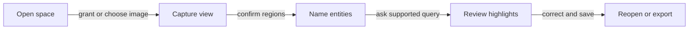
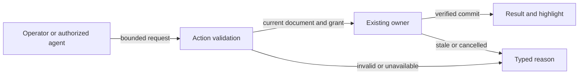
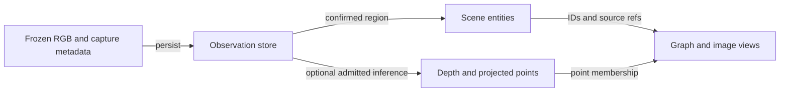
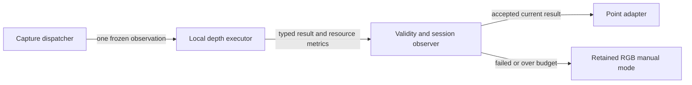
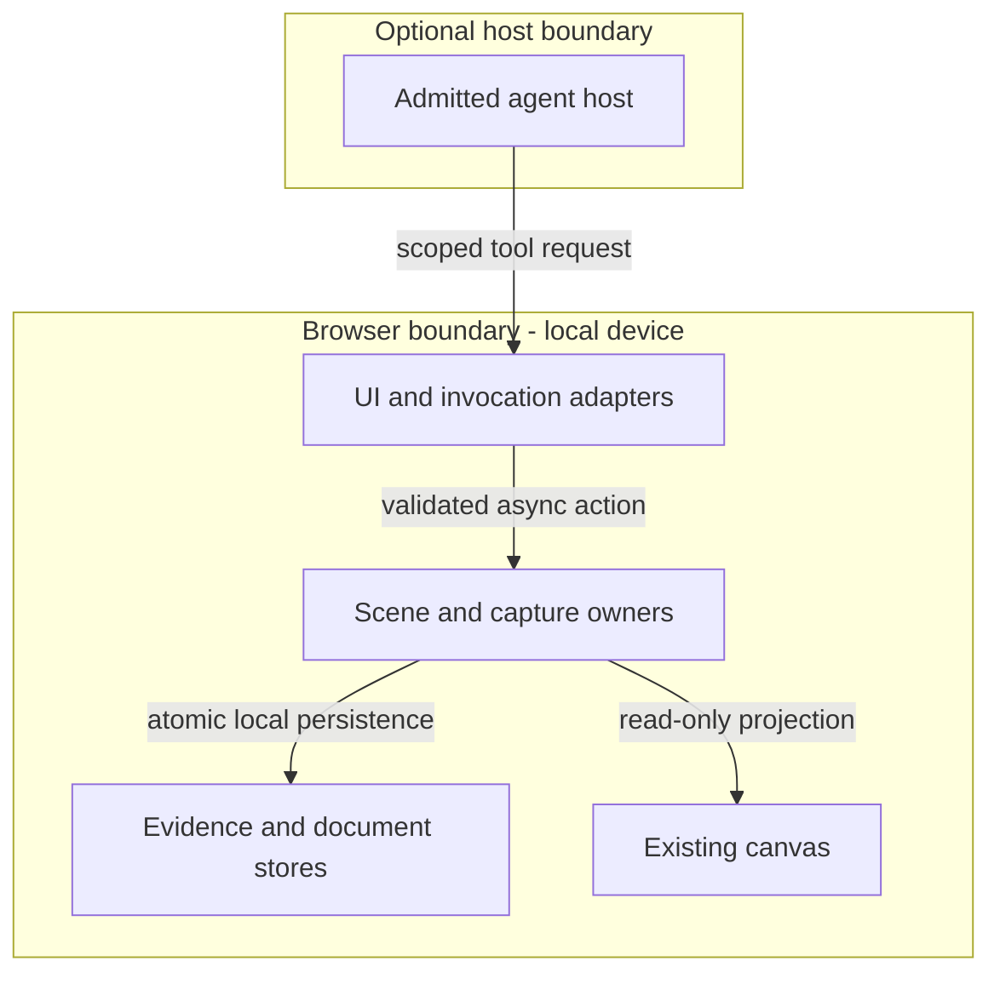
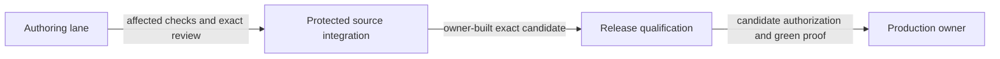

# Reference implementation — Native semantic space

## Continuity, scope and directive

This size-bounded companion extends the [existing XR Mode owner](agentic-graph-xr-mode-prd-tad-adr-mvp-gtm.md) at the same continuity ID and revision. PRD S01–S10 feed the TAD owners below, ADR-010–013 select the approach, and MVP/GTM consume those decisions. The audit's provisional MVP ID is absorbed into this existing product identity, not instantiated as another product or registry. Revision 0.8.2 records a corrected local implementation candidate; unverified criteria remain open.

Input is the private `SEMANTIC-SPACE-AUDIT-001@1.2.0`, with digest in frontmatter. It is authoring evidence only; the implementation, build, tests and runtime must not require that file. No external conceptual material, identifiers, assets, prose or code are carried into this specification or admitted as dependencies. Required local implementation claims are restated from native source evidence below.

**CID:** Context is the source-grounded camera/scene/action gaps and the user's 2026-09-24 request. Intent is a useful physical-space inventory inside the existing canvas, usable on a phone and offline. Directive: extend existing owners for evidence-backed capture, entity queries, correction and durable export; keep optional geometry honest and every invocation bounded. **RAO:** Product maintainer implements a native semantic-space slice; outcome is a source candidate with named local checks and explicit unverified device/transport gates. Integration and deployment retain their own gates.

## PRD — outcome, pain and scope

The domain object is a **space document** containing stable entities and dated observations. It is an approximate semantic record, not a certified survey or an automatically maintained replica. The operator captures an ordinary camera image, confirms objects, asks supported questions, corrects labels and reopens the same evidence locally. Estimated points may aid inspection without being required for first value.

| Pain / evidence | Hook → break → fix → close | Reuse / smallest missing piece |
|---|---|---|
| P01 Handover loses object context; `unvalidated` buyer hypothesis | Photograph a workspace → image labels cannot be queried or corrected as entities → connect observations to confirmed IDs → reopen/export a useful inventory | Camera/store/selection already exist; add the evidence-to-entity bridge. S01/S02/S05. |
| P02 Phone work depends on camera and network conditions; user-requested reach, frequency/cost unmeasured | Open on a phone → pose controls or missing assets interrupt capture → independent still/manual path with explicit readiness → finish offline | Extend camera lifecycle and verified installation; no new service. S01/S04/S06. |
| P03 Agents and people cannot act on the same captured evidence; source-confirmed integration gap, WTP unvalidated | Ask/find an object → authored-only queries and declared capture tokens lack the complete route → one validated action core → identical IDs and visible effect | Extend existing tool, grammar and scene owners. S02/S03/S07/S08. |
| P04 Depth visualization can imply unjustified precision; source-confirmed limitation | Inspect depth → display normalization looks like geometry → preserve projection assumptions/evidence → qualify or refuse spatial answers | Extend depth/points owners after the semantic loop. S09/S10. |

User: small workspace/shop operator; buyer: operator or team lead; beneficiary: next shift or recipient of the exported inventory. Developer and agent consumers use the same action contract. Product maintainer owns delivery/support; evidence stays on the user's device by default. No customer quote, paid demand, savings or repeat-use result is asserted.

**Stories:** As an operator, I capture and confirm two objects so I can hand over their evidence. As a phone user, I label/query/save without connectivity so interruptions do not discard work. As an authorized agent, I inspect and correct the same document so my actions are reviewable. As a reviewer, I see scale, time and source provenance so estimates do not become measurements.

| Priority | Scope / pain | Reuse-adjusted effort and ROI disposition |
|---|---|---|
| Must | Still RGB capture, manual confirmation, stable IDs, query/highlight, correction, local package round trip, mobile/offline recovery, shared actions and truthful host readiness; P01–P03 | First two 90-minute exploration slices; total delivery effort unknown. Highest reuse and nearest $1 inventory hypothesis. Numerical ROI withheld until frequency, impact and measured build hours exist. |
| Should | Optional local depth, evidence-linked points and calibrated-claim rejection; P04 | One 90-minute exploration slice plus separate model/device qualification. Cannot delay manual first value. |
| Could | Inventory CSV, proposed-layout variants, additional registered views | CSV follows complete native package export; variants must preserve original evidence. Rank after one successful handover. |
| Won't in this increment | Automatic full-room fusion, hidden surfaces, safety/clearance certification, automatic object tracking, new detector model, remote inference, payments, new hosting/database | Outside bounded evidence, zero-spend and minimum-change scope; retain as deferred demand-led work. |

### Acceptance criteria and VCCs

Each row is a VCC: verify the single end state by the stated check with its constraint. S01–S08 are Must; S09–S10 gate optional geometry. A focused source check can establish part of a row; it cannot substitute for phone, offline, real-host or headless parity proof. The status register below records that distinction.

| ID / pain | Given → when → then; observable end state | Stated check and constraint |
|---|---|---|
| S01 / P01,P02 | Given a phone rear camera or desktop webcam, when a still is accepted, then one timestamped observation persists with correct RGB dimensions/orientation and a stable ID. | Add `space.capture.still` to capture-runtime/store suites; real permission grant/deny, device switch, ended track and cancel smoke. No pose inference, audio or duplicate/stale commit. |
| S02 / P01,P03 | Given two confirmed regions, when category query or selection runs, then the same valid entity IDs highlight their image/graph evidence. | Add `space.entity.querySelection` beside semantic exercises; verify unknown IDs, empty results and two observations. No heuristic box counts as observed detection. |
| S03 / P03 | Given one source revision and authorized action, when UI, WebMCP, admitted MCP and grammar execute, then equivalent results reference the same resulting document revision. | Add `space.action.parity` to scene/invocation owner suites, with exact token/pin resolution. Unsupported transport returns typed failure; discovery never grants camera or write authority. |
| S04 / P02 | Given a verified app and saved space, when reopened offline, then capture/manual-label/query/correction/export work without network access. | Extend Offline Studio smoke with `space.offline.manual`; separately test missing optional models, quota, eviction and interrupted install. Retain last complete document. |
| S05 / P01 | Given an edited scene/evidence package, when exported and reimported, then IDs, revisions, source hashes and labels match. | Add `space.package.roundTrip` to capture-store/scene persistence suites; reject missing/corrupt blobs, unsupported schema and partial writes. Save receipt requires durable readback. |
| S06 / P02 | Given 360/390 CSS-pixel portrait and landscape views, when capture/query/edit uses touch and keyboard, then primary actions remain visible and usable. | Phone walkthrough `space.mobile.taskFlow`: primary targets ≥44 CSS px; readable text, safe areas, keyboard-open selection and background/resume. No hover/right-click prerequisite. |
| S07 / P03 | Given async host registration, when it rejects or the scope changes mid-flight, then readiness reflects the actual active registrations. | Extend WebMCP lifecycle checks with `space.host.asyncRegistration`; resolve/reject/abort/duplicate/no-host fixtures. A rejected promise must never emit host-installed. |
| S08 / P03 | Given unknown scale, stale revision, unavailable page or unsupported intent, when queried or mutated, then a typed result explains the unsupported operation without changing evidence. | Add `space.action.guards` to semantic/normalization suites; race and request-ID replay checks. No invented metric answer, automatic upload or arbitrary model-generated code. |
| S09 / P04 | Given the same frozen RGB and finite depth, when projected, then points/colors map to the source pixels within declared tolerance. | Add `space.projection.geometry` to spatial geometry tests: center ray, plane, near/far polarity, invalid values, rotation/crop/mirror. ≤20,000 visible points and no identity-transform frame fusion. |
| S10 / P04 | Given admitted local model/runtime assets, when the optional cloud is generated on a qualified device, then scene-dependent output and unknown scale/provenance survive reopen. | Extend XR adapter and browser smoke with `space.depth.offline`; real images and physical near/far target, explicit backend/fallback, complete offline closure. Mocks do not prove inference quality. |

| Criterion | Candidate status at 0.8.2 / next evidence |
|---|---|
| S01,S02,S05,S08 | Local source, fake IndexedDB and browser checks cover still metadata, linked entities, stable correction IDs, revision/replay guards, package readback and rejection of a hash-matching but undecodable image. The native composed canvas ID retains `properties.entityId`; browser add/repeat/correct selects and updates the same projected node. Physical camera permission/ended-track and canvas projection after reopen remain open. |
| S03 | UI and scoped WebMCP share the browser-local action store; `/space.find #category`, `/space.select @entity` and `/space.label @entity #category label="name"` resolve exact tokens. Headless MCP and capture dictionary dispatch remain open; no parity claim. |
| S04,S06 | Image choice and 44 px primary controls work in a 390 px Chromium viewport after raising the toolbar panel above the timeline. Capture/query/correction/export work after taking the open tab offline. An offline page reload fails because the current service worker intentionally excludes the HTML shell; S04 remains blocked pending existing installer-owner admission. Real Safari/phone, background/resume and quota remain open. |
| S07 | Async host resolve/reject/catalog-change/disposal fixtures pass locally. Real browser host qualification remains open. |
| S09,S10 | Relative float-depth projection enters the existing Three.js point geometry with assumed FOV, polarity, cap and unknown scale; synthetic center/color/invalid-depth checks pass. Camera rotation/crop, admitted model asset closure, physical near/far and device performance remain open. |

### Success metrics and assumptions

| Metric | Baseline | Target / observation window |
|---|---|---|
| TTV steps | Complete captured-semantic path absent in inspected owners | ≤5 task steps: open space, grant/select camera, capture, confirm, query; permission OS interactions recorded separately |
| TTV elapsed | Unmeasured | ≤120 seconds to a first evidence-backed query on prepared assets; clean-install download time measured separately before baseline sign-off |
| Retention/recovery | Separate durable primitives exist | Two entities survive all S05 round trips and one airplane-mode reopen; no accepted evidence lost in S04 failures |
| Token cost / month | No measurement for this proposed path | Required model-text input/output tokens 0; no remote language model in MVP. Optional agent usage is separately budgeted and excluded from this claim |
| Monthly incremental service TCO | Not an account-cost audit | $0 incremental inference/sync service spend; device energy, existing hosting/domain/account costs and engineering time remain unmeasured |
| ROI | Frequency, economic pain and completion effort unknown | Measure first pilot; do not manufacture a numeric ROI or savings claim |
| Local / delivered readiness | `spec-complete` / `undocumented` | Advance only from evidence satisfying these exact criteria; source tests are not production proof |

## TAD — source grounding and ownership — reference implementation

All rows bind Graph source `6d5a47d3e983ff02af2ceb1ae230f2808a80cf86`. Audit source `272862cc4d130616497a392605bcb4caf25c3a5a` is retained as history. The admission-time diff changed general design/theme UI; the camera/depth/semantic/lifecycle/offline owners listed below remain unchanged. Device/UI claims require fresh validation. Current OS and Canvas consumers remain independently pinned; this increment adds no cross-repository source import.

| ID / owner / inspected symbol | Current capability / gap | Decision, consumers, delta and check |
|---|---|---|
| T01 [camera lifecycle](../../canvas/src/features/three/motionControlRuntime.ts), `startMotionControl` | Real stream/cancellation/cleanup, front-facing default and pose coupling | `extend-owner`: capture and existing motion UI consume a neutral lifecycle; rear/webcam preference and still buffer. S01/S06, capture runtime tests. |
| T02 [capture runtime](../../canvas/src/features/xr-v2/xrV2SpatialCaptureRuntime.ts), `startXrV2SpatialCapture`; [artifact store](../../canvas/src/features/xr-v2/xrV2CaptureArtifactStore.ts) | Bounded media frames/IndexedDB; no complete observation intrinsics/pose record | `extend-owner`: one evidence store for capture and scene projections; add versioned observation metadata. S01/S04/S05. |
| T03 [semantics](../../canvas/src/features/three/xrSceneSemantic.ts), `projectXrStudioScene`, `queryXrStudioScene`; [persistence](../../canvas/src/features/three/xrScenePersistence.ts), `persistXrSceneToAuthoredSource` | Authored-plan category/nearest/radius and source save; no observed-entity bridge | `extend-owner`: observed entity records, shared selection/query and verified complete save. UI and agent consumers; S02/S05/S08. No second scene database. |
| T04 [scene tool runtime](../../canvas/src/features/three/xrSceneMcpRuntime.ts), `controlLocalXrScene`; [tool contract](../../canvas/src/features/agent-ready/agentic-graph-agent-ready-tool-contract.mjs) | Structured authored-scene mutations and normalization | `extend-owner`: bounded observed-space inspect/query/select/correct/save/export; UI/browser adapters call one core. S03/S08. Headless package use retains explicit source/effect authority. |
| T05 [WebMCP lifecycle](../../canvas/src/features/agent-ready/webMcpLifecycle.mjs), `createWebMcpLifecycleController`; [scoped exposure](../../canvas/src/features/agent-ready/webMcpToolExposure.mjs) | Document/navigator hosts, fallback and scoped discovery; async registration is not awaited | `extend-owner`: await/reconcile host results and partial failures; preserve core+one-group discovery, ≤16 tools / 32 KiB. S07/S03. No new transport framework. |
| T06 [Offline Studio controls](../../canvas/src/features/python-learning/LearningOfflineControls.tsx); [manifest/install owner](../../canvas/vitePythonLearningOffline.mjs); [PWA policy](../../canvas/vitePwaRuntimeCachePolicy.ts) | App install/verify/recover and separate model cache; verified closure excludes ONNX/Wasm | `extend-owner`: separate app/evidence/optional-perception receipts; admit optional assets in existing service worker. S04/S10. No duplicate installer or service worker. |
| T07 [depth adapter](../../canvas/src/features/xr-v2/xrV2DepthInferenceRuntime.ts), `createXrV2LocalDepthInferenceAdapter`; [point geometry](../../canvas/src/features/three/spatialCaptureGeometryRuntime.ts), `buildPointCloudGeometry` | Pinned local inference, normalized display depth, imported point rendering | `extend-owner`: retain float depth/convention, bounded pure projection and generated source adapter. Capture and existing point surface consume it; S09/S10. |
| T08 [XR registry](../../canvas/src/features/xr-v2/xrV2InvocationRegistry.ts); [scene grammar](../../canvas/src/features/three/xrSceneMcpContract.mjs); [local MCP contract](../../mcp/local-tool-contract.js) | Capture/author tokens declared, no capture dispatcher found; authored scene grammar executes; browser contract projected to stdio only for search/fetch | `retain-local` and `extend-owner`: reconcile exact dictionary bindings before effectful capture; use admitted page bridge or explicit package for headless actions. S03/S08; no automatic transport parity claim. |

Reuse benefit targets fewer repeated actions and zero diverging UI/tool mutation implementations. Current duplicated captured-space implementations: none found; the missing integration, not a measured duplication count, motivates reuse. Integration time, repeat failures and support savings are unmeasured. A generic shared package is deferred until two concrete cross-product consumers and an ADR justify extraction.

**0.8.2 source disposition:** [SemanticSpacePanel](../../canvas/src/features/xr-v2/SemanticSpacePanel.tsx) is mounted beside, and independent of, the older pose/temporal capture panel. The explicit camera request lives in the [camera runtime](../../canvas/src/features/three/semanticSpaceCameraRuntime.ts). [Action validation](../../canvas/src/features/xr-v2/semanticSpaceRuntime.ts) and [durable writes](../../canvas/src/features/xr-v2/semanticSpaceStore.ts) serve both the UI and [scoped WebMCP adapter](../../canvas/src/features/agent-ready/semanticSpaceWebMcpTools.ts). Space records reuse the existing XR IndexedDB `bundles` object store under a dedicated key, with atomic revision checks, decoded-image verification and readback; no schema upgrade or second scene database is introduced. “Add to canvas” projects the evidence hash and stable `entityId` into the active graph; the native composed graph ID may carry its source-layer prefix. The [point geometry owner](../../canvas/src/features/three/spatialCaptureGeometryRuntime.ts) accepts optional finite relative depth with assumed FOV and an unknown-scale tag; no model or metric claim is enabled.

The candidate stores compressed stills in a self-contained active local package and retains the previous package as a backup on import. It does not yet model multiple independent spaces, calibrated camera intrinsics, raw photo bytes separate from the package, pose, automatic semantics, or an offline depth asset closure. These deltas stay open under T02/T03/T06/T07 rather than being inferred from the source checks.

### Native data and action contracts

Proposed fields extend existing versioned owners; they are not a new independent registry. **Observation:** ID, capture time, RGB blob/hash, source/processed dimensions, orientation/mirroring, optional float-depth reference and convention, model/backend identity, intrinsics/source, projection parameters/revision, pose/scale status and quality flags. Capture time and inference-completion time remain separate. Raw observations are immutable; new evidence creates a new revision.

**Entity:** stable ID, label/category, observed/confirmed/authored/imported/measured provenance per field, observation-region references, optional visible-point membership and explicit coordinate frame. A box may include background and is never a complete object extent. Start with `observed-in`/`part-of`; `near`/`within` require compatible frame and scale. Correction preserves identity; proposed-layout transforms cannot overwrite observed geometry.

**Action:** schema version, operation, document/space ID, bounded observation/entity IDs, request ID and expected revision for mutation. **Result:** status, operation ID, resulting revision, valid selected IDs, evidence references, counts/truncation, warnings and typed error. Cap query results to the 50-entity MVP; do not disclose images/tensors in discovery. Status/cancel uses existing jobs; cancel/source switch fences late results. Request-ID replay returns the prior result rather than repeating a write. Durable readback distinguishes saved evidence from an in-memory update.

Reject unknown IDs, nonfinite inputs, unsupported schemas, stale revision, camera/page unavailable, permission required, missing assets and unsupported geometry with typed errors. UI and tools show the same reason. Physical labels/OCR are untrusted data and cannot supply commands. Generic imported geometry receives no automatic semantic or metric promotion. Local export packages contain a versioned manifest, source, entity records and content-addressed evidence with integrity checks; no arbitrary script execution or fetch-on-import.

### Invocation and developer experience

| Surface | Current route | Required extension / limit |
|---|---|---|
| UI | Existing scene controls and camera/media panel | Mobile capture/view plus entity bottom sheet; one selection/action core; camera permission stays browser-owned |
| WebMCP | `agentic-graph.inspect_local_xr_scene_assets`, `agentic-graph.control_local_xr_scene`; scoped discovery | Extend current contracts, await host registration; query/correction/state evidence. Fallback registry does not prove external host access |
| `/`, `@`, `#` | Executable authored `/xr.stage`, `/xr.place`, `/xr.transform`, `/xr.label`, `/xr.remove`, `/xr.physics`, `/xr.present`; existing subject/scene bindings and semantics | Reconcile proposed space/entity/observation bindings in the authoritative pinned catalog; unknown tokens fail closed |
| Capture grammar | `/xr.capture`, `/xr.author` declared as local/read registry entries | Implement and classify actual effects before advertising runnable capture/author routes; registry lookup alone is not execution |
| MCP / headless API | Graph/parser tools and source search/fetch exist | Explicit native package adapters may query/edit the shared pure core; live camera requires an authorized open page and admitted host bridge. No new required server |

Developer path: discover one bounded scope → inspect capability and exact document revision → rehearse read-only query → execute one validated action with explicit effect context → observe status/result → reconcile durable revision → export/reopen. Unsupported hosts retain the in-app UI. Token dictionary/source-pin drift blocks the dependent adapter, not local manual work. Version retirement preserves old package parsing or yields a typed migration result; no silent destructive migration. Existing runtime/stored observations provide support evidence without uploading private room media.

### Optional projection and resource contract

Freeze RGB once, infer from that buffer and retain float depth separately from display normalization. At processed width W and height H, assumed horizontal field of view θ gives `fx=W/(2*tan(θ/2))`; `fy=fx` assumes square pixels. Principal point `(W/2,H/2)` and an initial 60° preview FOV are declared assumptions. Intrinsics follow crop/resize/orientation; preserve the original frame separately from display fit.

For positive axial distance Z, back-project `X=(u+0.5-cx)*Z/fx`, `Y=(v+0.5-cy)*Z/fy`; render `[X,-Y,-Z]` in the existing camera convention. Relative/inverse-relative output needs an explicit stored positive mapping with verified near/far polarity; never treat byte/255 as metres. Pose remains unknown until registration is independently justified. Do not merge separate captures using an identity transform, fill hidden surfaces or answer metric/clearance questions from arbitrary units.

One inference in flight; ≤320-pixel depth input width, ≤20,000 visible points, ≤2 resident clouds, at most 24 saved observations and 50 entities. Positions plus float RGB at this point cap are 480,000 bytes; extra metadata is separate. Inference/model working memory is additional and must be measured. Process on deliberate capture, render on change, pause when backgrounded and reduce work on budget breaches. Existing temporal capture's 12-second/24-frame limits remain intact; live continuous depth is deferred.

Initial implementation cap: ≤6 new modules, <60 kB added source, <600 lines per authored file and <500,000 bytes per delivered chunk; zero new required services or models. All new perception, geometry and diagnostic modules load on demand; always-loaded model bytes = 0. Existing model plus Wasm totals 32,068,878 bytes, violating the per-chunk gate today. Extend existing asset admission/reassembly, reconcile its eight-entry cache and 16 MiB installer ceiling, and verify integrity/peak memory before public/offline depth enablement. Manual mode remains independent of this admission.

Model assets must remain immutable, same-origin and license-admitted under existing ownership. Test the exact backend/model combination; capability presence alone is insufficient. Keep WebGL rendering and explicit optional WebGPU/Wasm inference policy, with one bounded fallback to manual mode and no extra model download. Required text-model prompt/completion tokens = 0; cache-hit assumption is inapplicable. Cloud delivery/sync is optional through current adapters only, defers at free quota, and cannot enable paid overflow. Free hosting is not itself FOSS. No account-subscription or device-performance claim is inferred.

## TAD — five flows and diagram register — reference implementation

All diagrams are proposed at revision 0.8.0 on the declared Flowchart 2D surface, using one fenced body ingest each. Edges are explicit; inventory keys name all drawn nodes/clusters. Projection checks are parse-only and do not validate runtime behavior or visual legibility.

**Diagram SS-J** · Class: Journey stage map · Notation: flowchart LR · Version: 0.8.0
**Caption:** The operator reaches a reusable inventory before optional geometry.

| Inventory | Role / journey touchpoint |
|---|---|
| J1, J2, J3, J4, J5 | Open, capture, confirm, query and return stages; operator and existing canvas |

**Diagram SS-W** · Class: User workflow · Notation: flowchart LR, substituted for sequence notation to retain node-link projection · Version: 0.8.0
**Caption:** Accepted actions commit only to their current document revision.

| Inventory | Path / outcome |
|---|---|
| W1, W2, W3, W4, W5 | Actor, validator, domain executor, accepted result, error; failures leave evidence unchanged |

**Diagram SS-D** · Class: Data flow · Notation: flowchart LR · Version: 0.8.0
**Caption:** Observations remain the source evidence for derived entities and geometry.

| Inventory | Data owner / residency |
|---|---|
| D1, D2, D3, D4, D5 | Capture buffer, evidence store, scene document, derived geometry, projections; browser-local |

**Diagram SS-H** · Class: Orchestration / harness flow · Notation: flowchart LR · Version: 0.8.0
**Caption:** Optional depth has a bounded executor and explicit manual fallback.

| Inventory | Input → output / bound |
|---|---|
| H1, H2, H3, H4, H5 | Dispatcher, executor, observer, consumer, fallback; one inference, one backend fallback, no retry loop; zero remote text-model calls |

**Diagram SS-T** · Class: Runtime topology · Notation: flowchart TB with boundaries · Version: 0.8.0
**Caption:** Shared local domain owners serve UI and admitted agents without required cloud compute.

| Inventory | Type / lane / trust |
|---|---|
| TB1, TB2 | Browser/device and optional host boundaries; no implied upload authority |
| T1, T2, T3, T4, T5 | Adapter, domain functions, local stores, renderer and external caller; authoring runtime; only typed requests cross the host boundary |

**Diagram SS-L** · Class: Lane & deploy boundary · Notation: flowchart LR · Version: 0.8.0
**Caption:** A planning or integration result cannot authorize production activation.

| Inventory | Boundary condition |
|---|---|
| L1, L2, L3, L4 | Documentation/source lane, integration, candidate qualification and production; all downstream effects remain separate receipts |

Build/release dependency order is acyclic: contracts → domain validation/persistence → adapters → views → owner checks → exact release candidate. Runtime request/reply and selection subscriptions do not constitute an additional build dependency. No sibling repository source imports or new global controllers are introduced.

## ADR — decisions — reference implementation

| ID / criteria | Decision and alternatives / constraint disposition | Consequence, TCO and revisit/recovery |
|---|---|---|
| ADR-010 / S01–S06 | Choose native still/manual semantic loop. Existing owners + optional local depth: pass. A second scene engine: fail duplicate ownership. Required remote inference: fail offline/zero-spend. Manual photo/folder workaround: pass but cannot satisfy query/identity VCCs. | Lowest new machinery; automatic recognition deferred. Incremental required service spend $0 target; build/support cost unknown. Revisit only when captured pilot evidence shows manual confirmation is the limiting pain; preserve raw evidence. |
| ADR-011 / S03,S07,S08 | One domain action core, thin UI/MCP/WebMCP/grammar adapters. Separate transport-specific mutation logic: fail parity/ownership. Preserve pure validation below browser/session effects. | Fix existing async registration lifecycle; no parallel tool framework. Unknown host capability returns typed fallback. Revert adapters while retaining readable packages if host compatibility fails. |
| ADR-012 / S04,S05,S10 | Extend existing verified installation and stores; optional depth closure. Required cloud storage: fail offline scope. New service worker/store: fail duplicate ownership. | Free local operation remains useful with missing models; device storage eviction is possible. Separate app/evidence/model receipts and export; retain previous complete installation. Revisit on verified quota or asset-budget failure. |
| ADR-013 / S08–S10 | Relative monocular geometry is optional and carries assumed intrinsics/unknown scale. Treating normalized bytes as metric depth: fail truthful evidence. Full multi-view fusion now: fail bounded scope. | Sparse observed surfaces only; no hidden geometry or safe-navigation claim. Existing FOSS rendering/model owners remain; no new package/service cost. Disable optional geometry on failed polarity/backend/memory tests without disabling the semantic inventory. |

Constraints precede ranking. Native still/manual dominates a new engine on scope, existing ownership and incremental service cost; full reconstruction is incomparable on fidelity but excluded by current scope. No contested provider selection or new vendor adoption occurs. Documentation checks cannot independently certify this product ranking; a timed pilot reopens ADR-010 if the smallest slice fails to create value.

## MVP — bounded execution, evidence and handoff

**Demo skeleton:** Hook: identify an item during a room handover. Break: an image alone loses its label and context. Fix: capture two objects, confirm regions, query one category and correct a label through the shared action. Reveal: the same IDs and evidence reopen offline and survive export/import (S02/S04/S05). Optional geometry demonstrates S09/S10 separately. A canned authored scene cannot substitute for physical capture evidence.

| Step / RAO | Joined criteria / design / decision | Bound and completion condition |
|---|---|---|
| R1 Maintainer extends observation/entity actions | S02/S05/S08; T02–T04; ADR-010/011 | 90 minutes: one saved RGB observation and confirmed entity query with shared IDs; otherwise record precise missing seam |
| R2 Maintainer repairs host readiness | S07; T05; ADR-011 | 45 minutes: async reject/resolve/cancel checks report actual registration state; no unrelated transport rewrite |
| R3 Maintainer connects mobile capture and offline manual workflow | S01/S03/S04/S06; T01/T02/T04/T06/T08; ADR-010–012 | 90 minutes: rear-camera still, manual correction, package round trip and admitted invocation parity; actual device gate separate |
| R4 Maintainer adds optional projection | S09/S10; T07/T06; ADR-013 | 90 minutes: float-depth/pixel contract and bounded point adapter; never claim model/device proof from synthetic tests |
| R5 QA mechanism qualifies admitted modes | S01–S10 as applicable; all owners/ADRs | 90-minute measured session: phone/browser/offline/host and asset budgets; unmet cases remain unverified |

These are first investigation/work allocations, not a guarantee of completion in 6.75 hours. Re-estimate at each exit; no more than three alignment cycles, stop after two cycles without reducing the same blocker. This source candidate uses six new production modules and stays under the stated module cap; physical devices and external hosts have availability conditions and recheck triggers, not invented ETAs. R1/R2 and the source portion of R3/R4 have candidate code and focused local checks; R3 transport/device/offline parity and R5 qualification remain open. No paid action or deployment is performed here.

### Evidence register and checks — reference implementation

| Evidence | Result / source / surface | What it establishes |
|---|---|---|
| E01 Private native audit, exact digest in frontmatter | Audit 1.2.0 at its recorded source SHAs; authoring | Source gaps and prior component checks; this candidate's results are separate |
| E02 Registration-rejection fixture | Reproduced prior false installed state; updated `webMcpLifecycle` fixture now covers pending, rejection, resolve, catalog change and disposal | Focused local S07 repair proof; no real-host proof |
| E03 Earlier focused suites | Audit retains 73 component test/check cases; not rerun or promoted to current end-to-end acceptance | Existing primitive evidence only; physical camera, depth quality and product loop unverified |
| E04 Diagram projection | Workspace diagram canvas-render checker on this file: exit 0; 6 diagrams, 29 nodes, 18 edges, 2 clusters, zero findings; 0 prompt/completion tokens | Parse-only authoring proof; visual legibility and runtime behavior remain separate |
| E05 Previous document structure | Private validator and receipt remain pinned to specification 0.8.0; invoking it on 0.8.2 rejects the exact-version assertion | Historical structure proof only; 0.8.2 uses E11 below |
| E06 Local action and package | `node --import tsx` from `canvas`, executing `testSemanticSpaceRoundTripAndGuards` and `testSemanticSpaceWebMcpAndInvocation`: pass | Fake IndexedDB readback, linked IDs, package integrity, stale/replay guards and the shared UI/WebMCP action-store contract; not device/UI runtime parity |
| E07 Relative projection | `node --import tsx` executing `testSemanticSpaceRelativeDepthProjection`: pass | Synthetic center/color/polarity/point-cap/invalid-depth and native Three.js buffer path; not scene-dependent model quality |
| E08 XR source ownership | `npm --prefix canvas run test:smoke:xr-v2:source`: pass after moving camera request to its owner | Existing XR v2 adapter boundary remains enforced; not a live camera test |
| E09 WebMCP registry | Local contract inventory has two semantic-space tools, unique names; XR discovery 12 tools / 25,377 bytes; registry validation rejects an incomplete mutation | Within 16-tool/32-KiB project discovery budget; not an external-host or stdio MCP receipt |
| E10 Candidate build/offline shell | Direct `vite build --configLoader runner`: pass; generated service worker lists the XR space panel, store and tool chunks. Chromium offline reload: `ERR_INTERNET_DISCONNECTED` | Source chunks are precached but HTML navigation is excluded by the existing PWA policy. S04 is not satisfied; unrelated output chunks also exceed the `<500 kB/chunk` target |
| E11 Current document and size | 0.8.2 frontmatter/role joins, source links, <600 lines/file, six production modules / 41,743 added bytes: pass; diagram checker: 6 diagrams, 29 nodes, 18 edges, 2 clusters, no findings | Current structural and parse-only proof; prior pinned validator is not promoted to 0.8.2 |
| E12 Focused owner and baseline checks | Registered canvas suite: 6/6 relevant cases pass; XR v2 source smoke, changed-file hygiene, conflict source compliance and worktree policy pass. Full local TypeScript check reports the same 31 unrelated errors on protected checkout and this candidate | No changed-file type error observed; full typecheck is not green locally. CI must establish exact candidate health independently |
| E13 Browser semantic loop | Local Chromium at 390 × 844: choose valid image → confirm/select → link to composed canvas node → correct label → export; repeated add leaves one graph node. Open-tab offline correction/export and hash-matching undecodable-image rejection pass; no page errors | Source-candidate browser proof. No physical camera, Safari, cold offline reopen or protected runtime effect is inferred |

Existing validation entry points to extend/reuse: capture runtime/store tests under `canvas/src/features/xr-v2/__tests__`; registered `canvas.xrMode.studio.semanticExercises` and `canvas.xrMode.studio.agentSaveReopen`; `canvas/src/__tests__/webMcpLifecycle.test.ts`; `canvas/src/__tests__/pythonLearningOffline.test.ts`; `canvas/scripts/run_choreography_studio_offline_smoke.mjs`; XR adapter/browser smoke. Select exact cases through the repository affected-check owner at implementation time; do not invent an already-runnable S-prefixed suite. Retained stubs and synthetic frames cannot satisfy device acceptance.

Independent deterministic checks judge only surfaced outcomes; the author does not self-award runtime readiness. Experience rubric at this revision: Core Requirements & Functionality, Innovation & Theme Alignment, Technical Execution & Integration, and Usefulness & Agentic Experience are all **unassessed**. Product maintainer owns the next timed two-object device demonstration; no average score or demand inference follows from this spec.

### Deploy boundary and recovery — reference implementation

| Boundary | Current state / owner | Required evidence and recovery |
|---|---|---|
| Documentation → source candidate | Admitted successor implementation lane; native release owner | Exact diff, affected checks, current lease and protected review. This task has application/runtime edits but no protected merge receipt |
| Source integration → runtime candidate | Open only after protected source integration; existing build/release owner | Complete admitted device/host/offline acceptance and exact integrated revision; preserve previous artifacts and source rollback information |
| Candidate → production | Closed; existing production owner | Exact green candidate, explicit environment authorization and runtime readback under existing [release contract](../production-core-runtime-release.md) |
| Failed activation / asset migration | No activation performed | Retain exact predecessor and compatible document reader; use existing [rollback owner](../production-rollback-baseline.md). Never delete raw evidence or equate Git cleanup with runtime rollback |

## GTM — first dollar and learning

| Rank / offer | Constraints ↔ argumentation ↔ outranking | Evidence / next experiment |
|---|---|---|
| 1 Operator-assisted room inventory/handover, proposed $1 one-time pilot | Pass bounded native/offline scope; nearest reusable flow. Direct opt-in operator demonstration avoids new acquisition/payment infrastructure | Pain `unvalidated`, WTP unknown, mechanism unproven, demand not validated; one reachable operator must accept a useful export before price validation |
| 2 User-dimensioned layout with linked photos | Pass only with explicit authored dimensions; more input work than rank 1 | Defer until inventory user asks for layout changes; measure correction/support cost |
| 3 Automated whole-room reconstruction | Fail current scope/device-proof constraint | Demand-led later research; no price/performance promise |

The $1 amount is a hypothesis, not market evidence or an instruction to collect money. Geography, segment size and timing are unresolved; no TAM/SAM/SOM number is asserted. Before an audience/business case, compare reachable-operator bottom-up sizing with an independently sourced top-down estimate. No unsolicited outreach, checkout, contract or payment action is part of this task.

Acquisition → activation → retention experiment: recruit only through an authorized channel; observe one clean first-use session; record completed export, accepted price or refusal, task time, failure/retry counts and support minutes; ask for a second handover within seven days. Proposed stop rule: no accepted usable export after three observed attempts → revisit scope/ADR-010 before adding automation. Collected cash, recognized revenue, free demonstrations and willingness to pay are separate ledger fields.

Economics assumptions A1 `$1 pilot price`, A2 `zero incremental required service spend`, A3 `TTV ≤120 seconds`, A4 `24 observations/50 entities` are proposed on 2026-09-24, owned by Product maintainers. Record actual device time, tokens, CI minutes, provider fees and support from receipts; unknown values remain unmeasured. A priced offer requires unit costs and margin evidence. Linked statements/scenarios, capitalization, funding ask, legal/jurisdiction obligations and audience projections are deferred; this is an incomplete commercial discovery sketch, not an investment-ready business plan.

## Coverage, findings and next checkpoint

| Domain | Exact section decision / disposition |
|---|---|
| C01 Purpose/customer/pain | PRD: operator context and pain hypotheses; validation pending |
| C02 Market/timing | GTM: two-method sizing deferred before audience case |
| C03 Offer/alternatives | GTM ranks three offers; ADR-010 excludes infeasible mechanisms |
| C04 Product/experience | PRD S01–S10 and SS-J/SS-W; phone accessibility and TTV unverified |
| C05 Architecture/data | TAD T01–T08, contracts and SS-D/SS-T; one owner per capability |
| C06 Quality/security/AI | S04/S07–S10; provenance, races, quotas, asset licenses and local fallback |
| C07 Decisions | ADR-010–013 with costs, reversibility and revisit conditions |
| C08 Smallest slice | MVP candidate and local tests exist; physical two-object demonstration and complete runtime acceptance pending |
| C09 Acquisition/retention | GTM bounded authorized pilot; observations absent |
| C10 Operations | MVP support/recovery and GTM support-minute/capacity observations; no SLA promised |
| C11 Organization/obligations | Product maintainer accountable; data/IP/license review before asset admission, jurisdiction/contract work before paid delivery |
| C12 Financial viability | A1–A4 and receipt-led costs; statements/scenarios explicitly incomplete |
| C13 Capital/milestones | Local core adds no service/funding requirement; funding case deferred |
| C14 ADLC | R1–R5 and exact candidate/release boundaries; current lane is a source successor, not integrated or deployed |
| C15 Audience projections | No deck/business-plan/financial-model readiness claimed; join exact revision before use |
| C16 Learning | Pilot results create a successor context; preserve prior evidence and re-derive affected criteria |

Each finding uses the guideline's six fields: type, severity, Rule ID/text, artifact, evidence, remediation. This is a bounded review, not an exhaustive conformance ratio. No runtime-ready or commercial-baseline claim is made.

| Type / severity | Rule ID / rule text | Artifact | Evidence | Remediation / owner |
|---|---|---|---|---|
| `pain-point-not-validated` / major | `pain-point-to-feature-mapping#3`: label unvalidated until supported by quote/ticket/behavior | PRD P01–P04 | User request/source gap, no observed buyer impact or WTP | Product maintainer records a pilot observation before commercial baseline |
| `render-proof-absent` / major | `dual-target-portability#6`: verify static legibility and projected counts | SS-J–SS-L | Projection passes E04; static visual legibility unreviewed | Product maintainer reviews static preview before diagram alignment sign-off |
| `scenario-set-incomplete` / major | `venture-record-pitch-deck-business-plan--financial-model#5`: linked statements and scenarios or incomplete discovery sketch | GTM | No financial/market observations | Financial modeling function produces sourced projections before audience handoff |

Next bounded action: qualify the candidate on Safari/phone with camera grant/deny, touch and offline reopen; exercise a real WebMCP host, then resolve the headless MCP/grammar capture gap and optional depth asset closure before claiming S01–S10. Prerequisites are an exact integrated source revision, free/FOSS asset policy and a device/host test surface. Recheck each when available. Development = source candidate with focused local proof; Production Release = no candidate; Runtime = unverified. This checkpoint adds no required service or paid dependency.
