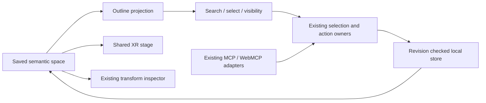

# XR spatial workspace — reference implementation

## Continuity and scope — reference implementation

All five roles below join `PLAN-XR-SPATIAL-WORKSPACE@0.2.8`. This bounded child of
the [XR product owner](agentic-graph-xr-mode-prd-tad-adr-mvp-gtm.md) owns W01–W06
and ADR-W01/W02/W03 plus the F01–F04 rendering and P01–P06 panel increments and S01–S03 source admission. It is separate because the existing procedural-twin companion is
near its 600-line limit. That companion continues to own evidence-to-geometry,
units, recipes and reconstruction limits; this document owns workspace navigation and solid-scene presentation.
The containing candidate commit binds implementation evidence; the frontmatter
source revision is the inspected predecessor, not proof of the changed candidate.

**Context:** the existing solid scene has independent selectable objects, but its
image-specific button list lacks search and visibility filtering. **Intent:** make
an existing XR scene inspectable and editable through the same UI and agent owners.
**Directive:** extend native presentation over saved entities; forbid a second
world store, renderer, action registry or remote runtime dependency.

**0 → 1:** the opportunity is the operator's observed navigation friction, with
buyer demand unvalidated. The target is one operator finding, selecting, hiding,
restoring and editing one of twenty saved objects within 60 seconds after the
scene is ready. Five timed trials constitute the acceptance study; timing is
currently unmeasured. Delivered product, payment and repeat demand are separate.

## PRD — useful scene navigation — reference implementation

User and beneficiary: an author reviewing a local scene. Buyer hypothesis: a solo
designer or small-team operator preparing a spatial handover. Today's workaround
is orbiting to find a small object or scrolling labels and reopening the inspector.
The user requested an integrated spatial workspace on 2026-09-25; this is pain
evidence, not willingness-to-pay evidence. No market-size or revenue claim follows.

| Journey / pain | Change | Priority | Acceptance / falsifier |
|---|---|---|---|
| Scene → many small objects → hard to find one | Search names, shapes and stable IDs in a scene outline | Must, W01 | Results belong only to displayed evidence; empty search restores every saved model |
| Outline → selection → disconnected editor | Reuse Canvas selection and Timeline inspector | Must, W02 | Row and Canvas select the same entity; selecting does not replace geometry |
| Overlapping solids → hard to inspect behind them | Hide/show and visible/hidden filtering | Must, W03 | Hidden object remains saved, can be restored, and keeps dimensions and placement |
| Delayed action → document changed | Fence the UI draft by space, revision and evidence | Must, W04 | Stale or replaced-space writes fail; another entity cannot receive the change |
| Narrow panel → clipped controls | Wrapping labels, bounded list, native form controls, ≥44 px targets | Must, W05 | Search/filter/select/restore usable by keyboard and in a 390 CSS px viewport |
| Operator → agent handover → state diverges | Keep existing inspect/control contracts | Must, W06 | No private outline store or second mutation path; transport parity remains separately tested |

Scope is saved evidence-linked models in **Surface Mode XR**, inline in an ordinary
browser. Opening a headset session or camera permission is unnecessary. Photo
comparison, source marking, geometry composition, export and Timeline stay in
their existing surfaces. Counts distinguish total and visible models; filter
results never claim that hidden models were deleted or that every photographed
object was recognized. The actual active observation bounds the outline.

**Deferred requirements:** viewport move/rotate/scale gizmos for semantic models;
opt-in object labels and configurable grid; asset search across all native scene kinds; one
reviewable agent proposal with before/after diff, explicit scope, revision fence
and recoverable application; deterministic overlap/clearance findings; attributed
history/undo shared across UI and tools. These are target requirements, not shipped
capabilities. A clearance result must declare authored units, collision proxy and
algorithm; it must never imply measured dimensions or building-code compliance.
No new autonomy approval rule is introduced: existing explicit grants still apply.

## TAD — codebase grounding — reference implementation

Source-level rows are verified against the frontmatter predecessor unless a
different exact revision is stated. `extend-owner` describes the candidate delta;
`retain-local` means consume without copying. A source read is not device proof.

| ID / owner | Inspected capability / limitation | Disposition / smallest delta / criterion |
|---|---|---|
| G01 `canvas/src/features/xr-v2/semanticSpaceRuntime.ts`, `semanticSpaceStore.ts` | Stable entities, observations, selected ID, expected-revision/request-ID actions; local verified readback and source mirror | retain-local; outline visibility uses `control-twin`, no schema change; W03–W04 |
| G02 `canvas/src/features/xr-v2/semanticSpaceCanvas.ts`, `semanticObjectView.ts` | Persisted XR view, evidence-scoped bindings, shared selection and Timeline activation | retain-local; list selection calls `selectSemanticObject`; W01–W02 |
| G03 `canvas/src/features/xr-v2/SemanticImagePerceptionChoice.tsx` | Existing image-owned saved-model list, composition and refinement controls | extend-owner; replace list with lazy `SemanticSceneOutline.tsx`; W01–W05 |
| G04 `canvas/src/features/xr-v2/SemanticTwinStage.tsx`, `semanticTwinScene.ts` | Shared solid scene, ray selection, camera fit and geometry resource disposal | extend-owner for F01–F04; visibility renders from the saved recipe; no new Canvas; W02–W03 |
| G05 `canvas/src/features/agent-ready/semanticSpaceAgentReadyContract.mjs`, `semanticSpaceWebMcpTools.ts` | Native inspect/control and strict invocation adapters; `control-twin` already owns visibility | retain-local; no extra tool count or discovery group; W06 |
| G06 `canvas/src/features/three/XrSubjectTransformEditor.tsx`, `xrSceneMcpRuntime.ts` | Authored native subjects have selection, transform cards and readiness fences | retain-local; semantic models keep their own existing inspector until an explicit adapter joins the contracts; no claim of identical transform types |
| G07 `canvas/src/features/xr-v2/semanticSceneOutlineProjection.ts` (candidate) | Pure, evidence-scoped outline projection and UI draft context guard | new leaf helper, no storage or renderer imports; W01/W04 |
| G08 `canvas/src/features/xr-v2/__tests__/semanticSceneOutline.test.ts` (candidate) | Synthetic independent checks of search, IDs, visibility, stale/foreign context and local recovery | candidate verification; W01–W04, not full W05/W06 proof |

### Related codebase boundaries — reference implementation

| Exact inspected source | Finding | Decision / remaining evidence |
|---|---|---|
| `agentic-os@8bd5c314c23e30bc16de9a0fbb0a4349c3273638`, `guides/TECH-STACK.md`, `docs/START-WORKFLOW.md`, `docs/RELEASE-WORKFLOW.md` | Composition and native lifecycle authority are upstream; publication is distinct from integration and deployment | retain-local by existing pin; no copied lifecycle or commercial controller |
| `agentic-canvas-os@5ea33c4f521d39e985a60c054db8ebd13d4db54c`, `agent-api/src/tool-search.js` | Re-exports bounded tool discovery from the upstream package | retain-local; Graph's existing browser scope remains owner of exposed XR tools; no new discovery service |
| `GameXR@81365d45a425c5aa58ef8454f9e47b33f2de4e26`, `package.json`, `vite.config.ts` | Consumes packaged shared/spatial artifacts and owns its browser build/base path | retain-local; no cross-repo source import, UI clone or device actuation; adoption needs its own package and device receipts |
| `huijoohwee.github.io@ae3e4091d8ebef554e0ed416d7c62a11e7efb0ed`, guideline and grounding companion | Owns authoring grammar and source-grounding procedure | reference exact upstream document; no copied rule catalog or checker |

These observations ground the affected seams, not an exhaustive cross-repository
audit. Protected source, unmerged candidate, installed package and deployed
artifact identities remain different. No related repository changes are required.

### Five flows and contracts — reference implementation

| Flow | Input → owner → outcome | Failure / recovery |
|---|---|---|
| Content/data | Saved space + displayed evidence hash → pure outline projection → matching rows/counts | No matches is explicit; filtering changes no document bytes |
| Control/interaction | Row click → existing selection owner → Canvas/Timeline selected entity | Read-only/preparing Canvas reports existing error; no optimistic selection write |
| State/lifecycle | Visibility click → fresh read + captured context check → existing action → atomic local save/readback → subscriber | Space/revision/evidence mismatch rejected; failed persistence retains saved state |
| Agent/invocation | Existing inspect/control tool or `/space.* @entity #…` → existing adapter/action owner → same document | Unsupported transport/capability reported; no DOM-only agent path or implied parity |
| Delivery/recovery | Source change → native candidate/checks/review → protected integration → separately authorized deploy | Source revert or next candidate; export/local backup retains evidence; no hidden production effect |

The outline stores only transient query/filter/busy/message state. It never
persists a duplicate entity collection, derived count or measurement. One pending
UI mutation is allowed at a time; a failed command is reported, not retried
automatically. Space/evidence changes remount the outline and clear its draft.
Raw images stay in existing local evidence storage. Search is an ≤80-character
local string over at most twenty models; it performs no network call or inference.
Room units remain `arbitrary` or explicitly authored metres; no measured claim.

### Budgets, security and fallback — reference implementation

Initial sprint estimate 45 minutes; at most six changed modules/files, two new
small production leaves, zero dependencies/services/model downloads/API fees.
No always-load module is added: the outline is reached by the existing lazy Media
path. Each changed file stays below 600 lines; the new lazy chunk stays below 500 kB. Retain
20 models, 160 recipe parts, 30,000 triangles and existing texture bounds; search
does not expand generation budgets. CPU, memory, battery and engineering time
are real costs even with no service bill; physical-device measurements are open.

Treat labels and evidence as text, never HTML or executable instructions. A
colliding entity ID in a replacement space must fail the UI context guard; the
store still arbitrates a concurrent write after preflight. Visibility is a
reversible saved control, not deletion. Storage/quota/source-mirror errors use
existing reporting and recovery. If 3D cannot start, retained source evidence,
outline and package export remain the intended recovery route; this increment
does not certify every GPU-loss or offline boot condition.

## ADR-W01 — extend native scene navigation — reference implementation

**Accepted for this candidate:** a lazy outline over the existing semantic-space
owner, using the current selection/control paths. Constraints eliminate paid or
remote inference, a second world database and an external runtime dependency.
Argumentation: the missing search/visibility surface is small, directly observed,
and can be verified without changing geometry or importing another UI system.

| Alternative | Tradeoff | Outranking |
|---|---|---|
| Extend existing Media list and Timeline | Least change, preserves IDs and revision fences; currently evidence-scoped | First: satisfies W01–W04 now |
| Keep the current list | No implementation cost; leaves observed navigation friction | Second only if the outline creates more operator effort |
| Introduce a new spatial workspace/store | Expands migrations, synchronization and device testing | Rejected: duplicate owner and excessive scope |

Consequence: native gameplay subjects and saved image models do not yet share one
asset/outliner type. Do not silently cast between their stores. Revisit after a
measured multi-scene workflow requires a contract adapter. Gizmos, proposals and
constraint analysis require separate source-grounded increments and acceptance.
Recovery: remove the leaf UI integration or publish a corrective candidate;
saved entities, recipes and package schema remain readable by the predecessor.

## MVP — bounded implementation and evidence — reference implementation

Must slice: W01–W06 for saved image models, with the proof boundary stated per row.
Demo skeleton: open the saved XR scene → search for an object → select it → inspect
Timeline → hide it → filter hidden objects → restore it → reload. An observed
result must match source identity; a screenshot of a different application or a
tool catalog cannot satisfy any acceptance criterion.

| Evidence / check | Scope and current result | Gap |
|---|---|---|
| `semanticSceneOutline.test.ts`, direct Node/tsx runner | 4 checks pass: evidence/query/ID projection, shared selection/control, stale/replaced-space fencing, local readback/replay/concurrent refusal | Synthetic fixtures; no photo classification accuracy claim |
| Canvas-local `npx tsc --noEmit`, root `npm run check`, production build | Pass; root check includes three local-browser launcher checks | No physical-device or delivery proof |
| Existing localhost scene, 18 saved objects | Live search/select/hide/filter/restore/reload and 390 CSS px keyboard checks pass | Desktop browser emulation; no physical phone claim |
| Existing MCP/WebMCP contract | Source reuse verified; no tool schema changed | Headless/browser-host end-to-end parity remains open |

The complete spatial-workspace target remains `spec-complete`; a working outline
does not advance every deferred requirement. Evidence below may prove the bounded
local increment only. No protected merge or production deployment is inferred.

## GTM — first useful paid handover — reference implementation

Offer hypothesis: a free local authoring tool plus an optional operator-assisted
scene-review/export service. First experiment: ask five qualified solo designers
to complete the 60-second navigation task and ask whether one reviewed handover
is worth a $1 pilot. No checkout, payment provider, subscription or outreach is
implemented or authorized by this plan. Demand, offer acceptance, collection,
fulfillment economics and repeat use are all **unvalidated**.

Constraints → argumentation → outranking: direct opt-in pilot uses the existing
local build and zero paid acquisition, giving the shortest path to feedback;
a shareable demo is second because acquisition remains unknown; hosted automated
generation is rejected by cost and scope. Prefer measured correction-time savings
over claims of reconstruction fidelity. No TAM/SAM/SOM estimate is invented.
Baseline against the prior list; record completion time, wrong selections,
recoveries, failures and willingness to pay. Continue if 4/5 finish within target
with no wrong-object write; revise if search adds effort; stop monetization claims
until actual payment/fulfillment evidence exists. Product maintainer owns follow-up.

Financial assumptions: no incremental service spend or revenue in this slice;
device resource use and development/support minutes are unmeasured inputs. Pilot
contribution = collected price minus measured fulfillment/support cost; it is not
assumed positive at $1. No funding ask, hiring or infrastructure expansion now.
Existing maintainers own delivery and incidents. Legal/IP/jurisdiction review is
deferred until actual commercial distribution terms and customer geography exist.

## Coverage and next checks — reference implementation

Disposition is not readiness. All 16 domains apply: 16/16 dispositioned, 11/16
covered, 5 deferred, 0 not applicable. Gaps below prevent full venture readiness.
Every row joins this document at `0.2.0`; Product maintainers are accountable.

| Domain | Disposition / source role | Evidence or gap / next check |
|---|---|---|
| C01 Purpose/customer/pain | Covered, PRD | Operator navigation request; validate buyer in pilot |
| C02 Market/timing | Deferred, GTM | No sizing/interviews; owner revisits after five qualified prospects |
| C03 Offer/alternatives | Covered, GTM + ADR-W01 | Explicit $1 hypothesis and ranked alternatives; seek offer acceptance |
| C04 Experience | Covered, PRD | W01–W06 and demo; run browser and timed trials |
| C05 Architecture/data | Covered, TAD | G01–G08 and five flows; exact candidate checks |
| C06 Quality/security/AI | Covered, TAD | Revision/privacy/budget boundaries; physical device and GPU loss remain open |
| C07 Tradeoffs | Covered, ADR-W01 | Existing-owner decision; revisit on measured workflow gap |
| C08 Smallest slice | Covered, MVP | Focused tests and bounded live receipt; no full target parity |
| C09 Acquisition/retention | Deferred, GTM | Opt-in pilot not run; owner records conversion/repeat use after invitation authority |
| C10 Operations | Covered, TAD + GTM | Native release/recovery and maintainer support; measure incident effort |
| C11 Obligations | Deferred, GTM | Customer/legal context absent; owner obtains review before commercial terms |
| C12 Financial viability | Deferred, GTM | No fulfillment cost/linked financial statements; owner revisits after pilot measurement |
| C13 Capital/milestones | Covered, GTM | Bootstrap, zero service spend; no ask until demand evidence |
| C14 ADLC | Covered, TAD + MVP | Scoped successor and source-owned release; exact CI/review/deploy receipts separate |
| C15 Audience projections | Deferred, GTM | Deck/business plan/financial model unnecessary for this code increment; owner revisits before buyer/investor handoff |
| C16 Learning | Covered, GTM | 4/5 completion threshold; new successor context records pilot outcomes |

Scoped authoring coverage: continuity, grounding, VCCs, five flows, budgets,
decision/alternatives, recovery, evidence separation, GTM experiment and C01–C16
are all linked above (10/10 selected artifact-bearing groups). This is not a
whole-guideline conformance ratio. Guidance on commercial sizing remains deferred;
no claim of zero findings or complete product/market validation is made.

## Prior outline validation receipt — reference implementation

Observed 2026-09-25 in the candidate worktree at `http://localhost:4179/`:

- Four focused tests pass, including IndexedDB readback, replay and concurrent refusal.
- Typecheck and root `check` pass; production build completes in 43.69 seconds.
  New outline chunk is 5.47 kB (2.36 kB gzip). Existing unrelated chunks exceed
  500 kB; this is not a whole-application bundle-budget pass.
- The saved scene shows 18 models. Combined name/shape search selects the matching
  row and the same Timeline entity. Enter-key selection works. No-match feedback
  is explicit. Hiding leaves 18 saved / 17 visible, survives reload, appears in the
  hidden filter, and restoring returns 18 visible. A concurrent change was visibly
  refused; a fresh retry succeeded. No hidden object was deleted.
- At 390 × 844 CSS px, the outline fits within the viewport and tested input,
  filter, selection and visibility controls are at least 44 × 44 px. The temporary
  viewport override was reset. Physical touch/headset acceptance remains open.
- A case-insensitive helper/component filename collision was fixed before browser
  acceptance; restarting the development server cleared its old resolver cache.
  Changed-file hygiene and source conflict checks pass.

The containing candidate identifies these source bytes. Native provider review,
protected integration and deployment require their own later receipts. This
increment adds no dependencies or service calls. Cross-transport parity, timed
buyer trials, cold offline boot, GPU loss and commercial validation remain open.

## Rendering fidelity increment — reference implementation

Revision `0.2.0` supersedes the initial `0.1.0` child for all five roles. The
previous outline receipt remains historical evidence. The inspected predecessor
is the exact frontmatter revision; the containing candidate binds this delta.

### PRD — depth and stable inspection — reference implementation

Observed pain on 2026-09-25: saved solid models appeared flat, and selecting an
object could turn a sharp scene blurry. The operator asked whether changing the
renderer default would solve fidelity. Target: retain readable edges throughout
selection while revealing contact and depth in the existing authored geometry.
This is presentation fidelity; automatic photo reconstruction is unchanged.

| Requirement | Acceptance / falsifier |
|---|---|
| F01 Grounded solids | Buildings/terrain cast shadows onto the floor and each other; directional lighting distinguishes faces; floor grid aids orientation |
| F02 Sharp inspection | Saved-object views render on demand; selection and idle inspection retain the configured pixel density; orbit/edit and bounded gravity preview continue to redraw |
| F03 Stable ownership | No new Canvas, evidence, geometry or camera owner; translated/scaled scene shadow bounds stay finite; floor/grid never intercept object selection |
| F04 Visibility and photo isolation | Hiding removes every assembly part and its shadow without deleting saved data; photo comparison omits presentation grid/lights/shadows from its evidence geometry |

### TAD — native renderer extension — reference implementation

`SemanticTwinStage.tsx` consumes a presentation-only leaf,
`semanticTwinPresentation.ts`, on the existing lazy stage path. It derives a
bounded floor and low-contrast grid from saved dimensions, aims key/rim lights at
the actual scene center, and uses one 1024 × 1024 directional shadow map. A
hemisphere fill preserves face readability. The floor remains at authored zero;
elevated objects do not silently acquire a new ground level. Theme changes
rebuild presentation resources through effect-owned cleanup.

The shadow camera follows the group’s display/AR scale; authored coordinates do
not change. `semanticTwinScene.ts` enables cast/receive on native meshes after
batching and applies object visibility to the entire assembly. Photo projection
disables those flags. Existing texture preparation, cancellation, disposal,
selection, entity IDs, export and persistence retain their owners.

`ThreeGraph.impl.tsx` uses demand rendering for saved-object views when immersive
media/gameplay does not own the viewport. Inspector/selection work therefore
cannot trigger the continuous XR frame budget’s resolution downgrade. React
changes, camera controls and the gravity preview invalidate frames as needed.
Continuous gameplay retains its existing adaptive budget. Both backends begin
with the same device-capped 1–2 DPR range; no unbounded supersampling is added.

The installed renderer is Three.js r170. This repository’s WebGPU eligibility
allows linked procedural **3D** views; XR uses WebGL because the optional backend
has no supported XR session implementation here. WebGL already enables
antialiasing, ACES tone mapping, sRGB output and PCF soft shadows. Merely switching
backends cannot reconstruct missing geometry or make a procedural model match
unknown hidden surfaces.

Budget: initial 35-minute implementation estimate, expanded from six to seven
changed files for the operator-reported selection blur, one new
small production leaf within the existing lazy stage, no dependency, texture,
service or model download. Existing 20-object/160-part/30,000-triangle limits
remain. One additional shadow pass and a two-draw floor/grid consume device GPU
work; demand rendering avoids drawing an unchanged saved scene continuously.
Physical-device frame-time and battery measurements remain open.

### ADR-W02 — correct presentation before changing backend — reference implementation

Accepted for this candidate: extend shared native materials/lighting and render
static inspection on demand. This directly addresses observed missing depth cues
and resolution loss without a renderer migration or a duplicate scene. Keep
WebGL as the XR default; retain optional WebGPU’s existing bounded eligibility
and failure reporting. A default switch ranks lower because it does not supply
missing geometry and this installed optional backend cannot host XR sessions.
Remote enhancement is excluded by the local/free-only boundary. Recovery is a
source revert of this rendering increment; saved documents need no migration.

### MVP and GTM — bounded proof — reference implementation

Demo: open the saved XR solid scene → inspect contact shadows/grid → select
several objects → orbit → drop/reset a model → compare the photo → return to
solids. Verify backing canvas dimensions before/after selection, not screenshots
alone. Synthetic checks cover transformed shadow-frustum containment, resource
cleanup, selection pass-through, authored floor level and hidden assemblies.
This strengthens the existing scene-review pilot; no additional buyer, revenue,
photorealism, phone or headset claim follows. Continue measuring wrong selections
and review time under the original GTM experiment.

Local receipt on 2026-09-25: the saved 18-object scene visibly renders contact
shadows, directional face shading and a floor grid at `http://localhost:4179/`.
Before the demand-rendering correction, the backing canvas was observed at
1125 px wide for a 1125 CSS px viewport. After the correction, selection and
subsequent inspection retained 2250 × 1924 backing pixels at 1125 × 962 CSS px.
The pre-correction sharp/blurry screenshots corroborate the operator's report.
The native WebGPU selector correctly reports XR ineligibility and retains WebGL;
this is not a WebGPU execution/parity receipt. No new renderer errors were
observed in the temporary verification tab. Physical-device, full replay and
gravity-preview visual checks remain separate acceptance gaps.
Ten focused tests pass (four presentation/policy, two solid-scene and four outline
checks). Root `npm run check` passes, including typechecking and three browser
launcher checks. The final production build completes in 1m 28s; the lazy stage
chunk is 13.36 kB (5.83 kB gzip), the geometry chunk 14.59 kB (5.41 kB gzip).
Changed-file hygiene and source conflict compliance pass; all seven changed
files remain below 600 lines. Existing unrelated bundles exceed 500 kB, so this
is not a whole-application bundle-budget pass.

Protected integration and deployment remain separate native lifecycle receipts.

## Workspace panels increment — reference implementation

### PRD — inspect scene work without rebuilding context

The 2026-09-25 request adds Assets, Outliner, Inspector and Agents to existing
XR Media, and Activity to BottomPanel. The operator needs to find an object,
inspect the same selection, and read recorded work without hunting across panels.
This increment changes navigation and observation; existing grants and mutation
owners remain authoritative. Buyer and $1 handover hypotheses are unchanged.

| ID | Requirement / acceptance | Owner and boundary |
|---|---|---|
| P01 | XR Media offers Assets, Outliner, Inspector and Agents; switching views does not replace the scene | Lazy `XrWorkspaceMediaPanel.tsx` via existing `FloatingPanelXrSceneViews.tsx`; transient view/search only |
| P02 | Outliner uses displayed saved-space evidence or the native XR subject/stage list | `SemanticSceneOutline.tsx` and compact `XrMediaLibraryPanel.tsx`; no schema casting between stores |
| P03 | Selected object opens its current transform editor in Media and Timeline | Shared `XrObjectInspector` composes existing `SemanticSpacePanel` or `XrSubjectTransformEditor`; draft fences retained |
| P04 | Agents displays the selected authorized run, shared selection and revocation | Existing `AgentMissionConsolePanel` and `AgentRunSpanViews`; explicit Open Agent Mission enters native run discovery |
| P05 | Activity displays retained workspace records and authorized Mission spans; source/filter/selection work | Existing `uiLogEntries` (250-record owner cap) and `agentRunInspectionStore`; no new event persistence |
| P06 | Hover text uses native controls; tool discovery reports current runtime state | `IconButton`/shared Tooltip unchanged; observe WebMCP runtime markers, never register or execute tools |

### TAD — presentation composition and committed events

Assets retains the current Media catalog, local image tools and projections.
Outliner chooses its owner from the selected Markdown's semantic-object target.
Saved-space reads are generation fenced and errors are visible; selection checks
space/evidence again before calling the existing selection action. Native subjects
retain their existing Remove and Motion Control actions; environment objects stay
under their simulation/environment owner. Saved models retain recoverable Hide/Show;
this increment does not add irreversible deletion to the semantic-space contract.
Inspector extracts composition from Timeline without duplicating transform controls.

Agents mounts the existing Console unchanged. It neither imports a private agent
registry nor starts a run. Mission expiry/revocation clears Activity and Console
through the same store. Browser tool names, scope and registration status come from
existing runtime markers observed on demand; discovery is not execution permission.
The selected Mission can own Canvas; Activity then mounts the same BottomPanel over
that surface. Closing run inspection returns through its existing restore path.

`kgBottomPanelTab: activity` is accepted by the native frontmatter parser and Canvas
router. Activity keeps workspace timestamps separate from Mission relative timing.
Unknown measurements and partial coverage remain explicit. It renders retained text,
not executable markup; source payloads absent from the span contract are disclosed as
unavailable. Full tool input/output auditing is deferred rather than fabricated.
`semanticSpaceStore.runSemanticSpaceAction` appends operation, committed revision and
selected label to the existing session log only after durable save and source-mirror
attempt. Idempotent no-ops and failed writes do not produce success records. Raw image
bytes and credentials are excluded. Source-mirror failure still uses the existing
status owner; a local commit is not proof of remote synchronization.

Budget: 45-minute initial sprint estimate, expanded to 13 changed files for the inherited Mission timeout assertion, two production leaf
modules, no new dependencies, services, models, renderers or persistent stores.
Both leaves load through existing lazy panel paths. Retain the existing scene and
record caps; each changed file remains below 600 lines and each new chunk below
500 kB. A 390 CSS px browser check covers wrapping/scrolling; physical touch and
headset resource measurements remain open. Global always-load code adds routing only.

### ADR-W03 — reuse native panel owners

Accepted for this candidate: grouped Media navigation and a read-only Activity
projection. Extending current owners ranks first because selection, edits, logs,
span hierarchy and revocation already exist. A separate workspace/store ranks lower
because it duplicates state and broadens migration risk. An entirely separate Agents
registry is rejected; the Mission observation is the single source of truth. No
changes to the concurrently owned Console file are required. Native hover components
are reused without alternate styles or labels for the same control.

Recovery: a corrective source candidate can remove the panel composition and Activity
route; saved scenes retain predecessor compatibility and session logs are ephemeral.
No data migration, remote effect or production deployment is part of this increment.

### MVP and GTM — bounded evidence

Demo: XR → Media → Outliner → select an object → Inspector → Activity/workspace
records → Agents → native Mission observation → Activity/Mission spans → close run
inspection and return to the scene. Empty and revoked observations must stay empty.
The native playground Outliner retains the existing authored-subject Remove action;
no user object is deleted for acceptance testing. Measure wrong-object writes and
navigation time in the existing five-author pilot; no new revenue claim is made.

Local validation on 2026-09-25 is recorded below at candidate completion. This does
not promote the deferred proposal/diff/undo/constraint-analysis requirements or
claim protected integration, production delivery, exact photo reconstruction,
physical-device parity or full raw tool-payload history.

Validation receipt, 2026-09-25:

- Eight focused Node/tsx checks pass: Activity projection/selection/revocation,
  browser discovery replacement, Media routing/source preservation, the existing
  Console, and four outline/storage concurrency checks. Typecheck and the three
  local browser-launcher contract checks pass.
- Affected XR/video source-runner, unit, compatibility and source-ready commands
  pass: 87 + 20 runner checks, 300 XR checks, 15 video checks and both selected
  compatibility/export checks. Mission ingress/lifecycle checks pass (8), and
  selected Mission/WebMCP projections pass (4). The inherited Mission timeout
  assertion now matches its already accepted 1,200,000 ms contract; no timeout
  budget is changed. Full automated browser suites remain protected-CI evidence,
  separate from the bounded live checks below.
- At `http://localhost:4179/`, Outliner lists the current 18 saved objects; selecting
  East island tower opens its existing Inspector. A subsequent Detail region 2
  selection appears in Activity as a committed saved-space revision. Workspace
  events remain separate from Mission spans. No object was removed in this check.
- Agents renders the existing authorized two-span Mission tree, with partial
  coverage and unknown timing retained. Activity renders the same observation
  while Mission owns Canvas. Expiry clears the retained handoff. Tool discovery
  reflects the native runtime's current exposed count and scope without execution.
- At 390 × 844 CSS px, navigation wraps inside the viewport. All five new Media
  navigation targets measure at least 44 × 44 px; selected text uses the existing
  accent-contrast token. The temporary viewport override is reset. Physical
  device/headset tests and full end-to-end transport parity remain open.
- The production build passes; new lazy chunks measure 21.94 kB / 5.86 kB
  gzip for Media composition and 5.52 kB / 2.10 kB gzip for Activity. Existing
  oversized application chunks are not newly certified. Changed-file hygiene,
  source conflict compliance and whitespace checks pass. No dependency changes.

Publication is a review handoff only. Exact protected CI, integration and deployment
require their own native receipts; local checks do not grant those effects.

## S01–S03 — source-owned XR entry — reference implementation

### PRD — remove implicit stage variants

Observed on 2026-09-25: selecting XR with the catalog `demo.md` rendered a
Singapore stage and paragraph actors. A loaded Markdown document had been treated
as scene authority. The author could not distinguish saved scene content from an
implicit fallback. This increment removes that fallback; it does not remove
intentionally authored motion scenes or redefine XR as a separate renderer.

| ID | Requirement / acceptance | Owner |
|---|---|---|
| S01 | Ordinary Markdown in XR opens the existing neutral world; surface selection alone does not create actors | `xrSceneDocumentReadiness.ts` and `ThreeGraph.impl.tsx` |
| S02 | Removing authored scene metadata clears retained dirty stage state and cast without writing Markdown | `XrMotionReferenceRuntimeBridge.tsx` |
| S03 | Timeline offers no synthetic stage/cast for unauthored documents; saved scene and explicit demo routes remain valid | `TimelineBottomPanelView.tsx` and shared admission resolver |

### TAD and ADR-W04 — distinguish loaded document from authored scene

The shared admission resolver accepts native ECS authoring, the explicit XR
run-ready identity, or persisted motion-reference content. Direct and nested
frontmatter metadata use the existing reader. A document name or selected surface
cannot grant stage authority. Document readiness remains separate so the existing
Media authoring actions can add a first object to a loaded document.

Canvas and Timeline consume that same decision. Imported models, saved semantic
objects, spatial capture, immersive media and explicit gameplay retain their
existing owners. The empty world reuses its current grid, origin and camera;
there is no second scene, hover treatment, renderer or fallback component.
The existing Controls instance resets when entering or leaving the empty world,
so a native follow camera cannot donate its close-distance baseline. The Canvas
renderer remains mounted across this handoff and ordinary object selection.

Hydration passes no graph nodes and an explicit neutral/subjects-only plan when
source authority is absent. An empty-scene identity fence prevents the runtime's
same-scene dirty merge from restoring a removed stage. Reopening persisted source
restores its authored plan. This changes transient runtime admission, not saved
schema or user source content. Authored motion-reference support remains necessary
for existing scene documents; deleting that owner would break valid saved work.

Decision: extend native source admission instead of adding another XR option or
changing WebGPU defaults. The reported conflict is source selection, not backend
capability. Rollback is a corrective source candidate reverting these admission
checks; no data migration or remote rollback is needed.

### MVP and GTM — bounded correction

Demonstration: open the catalog document → select XR → neutral grid and empty
Timeline; open the authored XR demo → its existing native scene; return to the
catalog → no retained stage. Automated coverage also removes metadata from the
same document after a dirty scene edit, ensuring no synthetic cast survives.

Initial sprint cap: 30 minutes, eight files, zero new production modules or
dependencies; each changed file stays below 600 lines. The 500 kB chunk cap adds no
new chunks here. Existing application-wide bundle debt is not newly certified.
The operator outcome is fewer wrong-scene entries; track this in the existing
five-author pilot. Buyer demand, $1 handover hypothesis and release boundaries
remain unchanged. No new commercial or reconstruction capability is claimed.

Validation receipt for S01–S03, 2026-09-25:

- 302 XR unit checks pass, including source admission and dirty scene removal;
  four selected motion/ownership/session contracts pass. Two inherited source
  assertions now follow the shared resolver and extracted renderer setup owner.
- Typecheck and three browser-launcher contracts pass. XR/video source-runner
  checks pass (87 + 20); video unit checks pass (15), compatibility/cleanup and
  both source-ready commands pass. The production build passes. No new chunks
  or dependencies are added; changed-file hygiene and source compliance pass.
- Live localhost entry with `demo.md` shows no automatic stage or paragraph cast.
  Selecting the authored XR demo renders the native playground and transform
  inspector; returning to the catalog clears that content and Timeline.
- One separate selected subject-draft test failed on the then-unchanged native
  `landscape` recipe: its bounds extend approximately 0.65 m below the ground
  origin. The subject editor persistence check passed. The correction below
  resolves this geometry admission failure without bypassing the check.
- Full automated XR/MP4 browser suites and protected CI remain separate evidence;
  no physical-device/headset parity, integration or deployment is claimed.
### Landscape ground correction — reference implementation, 2026-09-26
**PRD:** native landscape creation must pass XR ground admission and remain editable.
**TAD / ADR:** `proceduralEnvironmentParts.ts` places the root hill at Y = 0.65 m;
existing child offsets preserve the assembly profile. Ground validation and saved
recipes retain their exact-source contract; no silent migration or renderer offset.
**MVP evidence:** both selected XR subject tests pass, including every built-in
subject's ground bounds and added scene reload/source-preservation assertions.
Four procedural contract/recovery/source/GLB checks, Canvas typecheck and three
launcher contracts pass. The owned XR MP4 browser smoke passes desktop and mobile.
**GTM:** closes an authoring failure in the existing pilot; pricing and claims are
unchanged. Actual scope: three files, no new modules/dependencies/chunks; under the
20-minute/four-file sprint cap. Frozen Mission Control, XR and MP4 browser checks pass.
**CI closeout:** PR #1296 merged; exact-main Integration Gate and XR v2 browser gate pass at the reviewed revision.
Settings initializes its requested tab directly; the browser regression forbids inactive Help loading.
**Local XR entry:** live canonical review found a stale local D1 corpus containing the retired playground source.
Reuse direct D1 reconciliation with explicit `--local`, loopback-only target validation and complete content readback.
Local seeding cannot emit production evidence or publication plans. Existing protected production behavior is retained.
Four-file cap; zero new runtime modules/dependencies. SQLite limit diagnosis exceeded the 20-minute target; local imports use complete statements in ≤90 kB batches and fail loudly on partial failure. Native local readback passes for 31 documents/10 chunks, all 36 release-contract checks pass, and live Home XR renders the current source at :4179. Protected integration remains pending.
