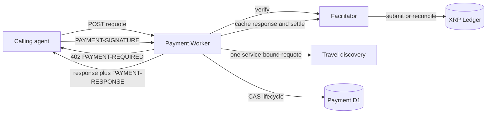

# Reference implementation: agentic-graph XRPL x402 Paid Travel Requote

## Status, Authority, and Scope

This document is the joined PRD, TAD, and ADR authority for Increment 1 of
`PRD-TAD-ADR-TOLLGATE-X402-XRPL`. It consumes the input artifact at the recorded digest and the
codebase at the recorded revision. Named type, behavior, protocol-discovery, Worker-runtime, and
dry-run evidence earns `dev-proven` for VCC-TOLL-02 through VCC-TOLL-07. Protected integration,
remote migration, deployment, testnet settlement, public verification, demand validation, and
revenue remain separate evidence.

Increment 1 adds one machine-payable, read-only travel requote to the existing payment Worker. It
does not add another Worker, store, marketplace billing model, custody path, points router, checkout
widget, or automatic deployment path.

## Shared CID, RAO, and SVO

```yaml
context: "The existing payment Worker, payment D1, and bounded travel requote route are confirmed at codebase revision c8ae522f37668ebb49b3a6c86e2d571c81729b6f; an XRPL paid-resource execution path is absent."
intent: "Let an autonomous caller buy one fresh travel requote without account provisioning or human checkout."
directive: "Extend the existing payment Worker with one fail-closed XRPL x402 adapter over the existing read-only travel requote."
role: "Agentic commerce paid-resource capability"
action: "Verify one signed payment, execute one bounded requote, settle or reconcile its exact transaction, and persist one recoverable result."
outcome: "A settled request receives one cached requote and concurrent or recovered retries cannot execute or charge twice."
subject: "Agentic commerce paid-resource capability"
verb: "fulfill"
object: "one XRPL-paid travel requote"
```

The three grammars carry one instruction. The role is the capability owner, the action implements
the directive, and the outcome is checked by VCC-TOLL-01 through VCC-TOLL-07.

## Codebase Grounding Record

Input revision: SHA-256
`9eac94e56d7d0e289a9a088f76d9f394788e4a433703b30ced6253c52416c338`.
Scoped codebase revision: `c8ae522f37668ebb49b3a6c86e2d571c81729b6f`.

| Material claim | Disposition | Evidence |
|---|---|---|
| One payment Worker owns payment routes and the `DB` binding | `confirmed` | `cloudflare/workers/agentic-graph-payment/index.ts` |
| The existing x402 route executes a paid business resource | `contradicted` | `agenticCommerceX402.ts` is an EVM-only readiness response |
| A bounded live flight requote already exists | `confirmed` | travel-discovery `POST /v1/requote`, 16 KiB input bound |
| A new Tollgate Worker and store are needed | `contradicted` | existing payment Worker, D1, and service-binding patterns are reusable |
| XRPL paid-resource lifecycle persistence exists | `absent` | no paid-resource table or XRPL lifecycle owner at the scoped revision |
| XRPL buyer/server packages are already installed | `absent` | `x402-xrpl` and `xrpl` are absent at the scoped revision |
| Receive-and-sweep is required | `contradicted` | direct `payTo` removes custody and merchant signing from the Worker |
| A transaction-hash-only retry implements the current wire contract | `contradicted` | the current scheme carries a presigned blob in `PAYMENT-SIGNATURE` |
| The target segment has supplied WTP evidence | `unverified` | no priced interview, commitment, external payment, or revenue receipt is recorded |
| Production facilitator, ledger, discovery, D1, and payee are ready | `unverified` | operator configuration and delivery evidence are absent |

No contradicted or unverified claim is used as implementation or readiness evidence.

## PRD

### Pain Point and Payer Hypothesis

| Field | Increment 1 record |
|---|---|
| Pain point | An autonomous agent needing one current premium travel requote must obtain account or subscription access before it can finish the task. |
| Hook | One request can quote its own machine-payable price. |
| Break | Provisioning and recurring commitment add delay and idle cost to a one-off data purchase. |
| Fix | A paid-resource route challenges, verifies, executes one existing read-only requote, settles, and returns the cached result. |
| Close | One signed payment yields one settled, replay-safe requote without merchant custody. |
| Reuse/build split | Reuse the payment Worker, payment D1, travel discovery, and x402 core; build only the XRPL adapter and paid-resource lifecycle. |
| Evidence status | `unvalidated`; this is a payer hypothesis, not observed demand. |

The initial segment is an agent developer whose workflow needs a fresh flight requote but does not
justify a subscription. The feature is `Must` only within this authorized increment. It cannot
outrank a WTP-evidenced backlog item until a priced customer signal exists.

### Product Contract

- Route: `POST /api/payments/commerce/x402/xrpl/travel-requote`.
- Resource identity: `agentic-commerce.travel-requote/v1`.
- Resource provider: existing `agent-flight` travel-discovery contract.
- First request: a valid bounded body without payment receives HTTP 402 and `PAYMENT-REQUIRED`.
- Paid retry: `PAYMENT-SIGNATURE` carries the accepted requirement and presigned transaction blob.
- Success: the caller receives the cached resource response and `PAYMENT-RESPONSE` only after
  successful settlement.
- Runtime AI cost: zero model calls and zero prompt or completion tokens.

### Acceptance Criteria

| ID | Given / When / Then |
|---|---|
| PRD-TOLL-01 | Given valid testnet configuration and a funded buyer, when the buyer completes the challenge, then one validated settlement returns one requote and D1 records its transaction hash. |
| PRD-TOLL-02 | Given a payment whose accepted requirement differs from the persisted requirement, when it is submitted, then the request fails before resource execution and settlement. |
| PRD-TOLL-03 | Given 32 concurrent identical paid retries, when they race, then at most one verify, resource call, and settle effect occurs. |
| PRD-TOLL-04 | Given an indeterminate settlement result, when the retry recovers, then it reconciles the deterministic transaction hash before any resubmission or response release. |
| PRD-TOLL-05 | Given malformed, oversized, structurally deep, or secret-bearing input, when the route or tooling handles it, then it fails closed without leaking credentials, seeds, signed blobs, or unbounded data. |
| PRD-TOLL-06 | Given anonymous traffic, repeated invalid verification, or stale records, when admission and retention run, then challenge and verify work stays bounded and cleanup removes only expired unpaid evidence. |
| PRD-TOLL-07 | Given a clean source candidate, when offline readiness runs, then document, migration, binding, import, configuration, tests, and Worker dry-run checks pass. |

### Five-Minute Demo

| Beat | Time | Observable action |
|---|---:|---|
| Hook | 0:00-0:30 | A valid cold requote receives HTTP 402. |
| Probe | 0:30-1:15 | Show resource, network, asset, amount, payee, invoice, source tag, and expiry. |
| Reveal | 1:15-2:45 | A testnet buyer signs the exact requirement; no seed leaves the Node process. |
| Sign and retry | 2:45-4:00 | The paid retry verifies, computes once, settles once, and releases the response. |
| Close | 4:00-5:00 | Show the matching D1 lifecycle and transaction hash, then replay the request without a second effect. |

### Scope and Roadmap

| Phase | Reuse | New work | Exit |
|---|---|---|---|
| Increment 1A | payment Worker, D1, travel discovery, x402 core | contracts, adapter, state machine, tests, offline tooling | VCC-TOLL-02 through VCC-TOLL-07 recorded |
| Increment 1B | exact protected Increment 1A candidate | testnet configuration and funded buyer smoke | VCC-TOLL-01 recorded; mechanism proven |
| Pilot | runtime-ready protected source | operator-authorized deployment and one external payer | delivery evidence and demand result recorded independently |
| Won't this increment | all Increment 1 capabilities | points routing, points-plus-cash pricing, widget, take-rate projection | reconsider only after mechanism and payer evidence |

## TAD

### Component Ownership

| Capability | Owner | Decision |
|---|---|---|
| Route and payment trust boundary | existing payment Worker | extend; no second Worker |
| Paid-resource contract and configuration | shared paid-resource SSOT | new, provider-neutral owner |
| Challenge, verification, resource, and settlement orchestration | paid-resource route owner | new bounded composition |
| Lifecycle rows and compare-and-set transitions | paid-resource persistence owner | new tables in existing payment D1 |
| Requote | existing travel-discovery service | reuse unchanged business capability |
| Buyer signing | Node smoke process | external caller responsibility; never Worker responsibility |
| Settlement verification and submission | configured facilitator | external protocol role behind a bounded client |

### Reference Implementation and Provider Boundary

The Worker uses the existing Cloudflare service and D1 bindings and `@x402/core` v2 codecs and
schemas. A bounded local facilitator client implements the standard verify, supported, and settle
wire calls. `x402-xrpl@0.3.2` and `xrpl@4.5.0` are exact-pinned Node smoke dependencies only; neither
may be reachable from Worker source. The buyer seed exists only in the smoke process environment.

### Request and State Flow



1. Require `POST`, JSON content type, and at most 16 KiB before challenge or egress.
2. Reuse an existing challenge without another readiness probe. For a new challenge, apply an
   atomic one-minute D1 admission window before provider egress and prune only expired unpaid rows.
3. Confirm facilitator support and discovery readiness without a model call.
4. Derive the request digest and collision-resistant invoice identity; persist the exact requirement,
   complete `PAYMENT-REQUIRED`, and a digest binding network, facilitator URL, and RPC URL.
5. Require `invoiceId` and `sourceTag`; allow an optional `destinationTag`.
6. Bound `PAYMENT-SIGNATURE` to 32 KiB characters and its decoded JSON to depth 32 and 2,048 nodes,
   then validate and compare its full accepted requirement with the persisted requirement.
7. Acquire the D1 claim by revision-aware compare-and-set and call verify once. Count claim winners
   and stop after eight verification attempts for the challenge.
8. Execute `POST /v1/requote` once through `TRAVEL_DISCOVERY_HARNESS`; require bounded 2xx JSON,
   exact request `agentId` and `legId`, and the shared verified quote/provenance contract, then
   cache the normalized paid response before settlement.
9. Settle once in the normal path. Release the cached response only when settlement succeeds.
   Bind the successful receipt to the exact accepted amount even when the facilitator omits that
   optional response field.
10. On an uncertain settlement with a nonempty transaction hash, enter `settlement_unknown`. Prove
    the configured RPC network ID, then reconcile the deterministic SHA-512Half hash of
    `0x54584E00 || signed transaction bytes` before any resubmission.
11. If reconciliation returns `txnNotFound`, reclaim only the exact stored payment and cached
    response for one resubmission. Two total settlement attempts are the hard bound; an unavailable
    RPC never triggers resubmission.
12. A definitive settlement rejection records the transaction in the bounded rejection set, clears
    its active binding, preserves the cached resource, and returns a standard fresh 402 before the
    deadline. A new valid payment reuses the cached resource without repeating provider execution.

### Lifecycle and Persistence

```text
challenged -> verifying -> executing -> settling -> fulfilled
      ^           |           |            |
      |           +-----------+------------+-> expired
      |                                    +-> settlement_unknown -> fulfilled
      +--------- definitive settlement rejection before deadline --------+
```

Persist the invoice, request digest, exact requirement and `PAYMENT-REQUIRED` JSON plus digests,
challenge-owned facilitator and RPC URLs plus their network-bound transport digest, state, revision,
bounded lease, verification and settlement attempt counts, signed-blob digest, deterministic
transaction hash, bounded cached response, settlement response, expiry, and timestamps. Enforce
unique invoice identity and unique `(network, transaction_hash)` when a hash exists. Do not persist
the buyer seed, private key, facilitator credential, or full signed transaction blob. Concurrent
losers read the winning lifecycle and never perform an effect.
One-minute hashed-source admission counters bound new anonymous challenges. Expired counters and
unpaid challenges are pruned deterministically; fulfilled and unresolved settlement evidence is
never selected by retention cleanup. Cleanup deletes at most 64 rows per class per admitted request.
Each challenge retains at most eight rejected transaction hashes until its payment window expires,
preventing alternating rejected envelopes from causing unbounded facilitator work.
Each challenge also admits at most eight CAS-winning verification attempts; retries after that bound
return `paid_resource_verification_exhausted` without another external call or D1 transition.

### Failure and Security Contract

- A mismatch in network, scheme, asset, amount, payee, invoice, source tag, destination tag,
  resource, request digest, or expiry fails before resource execution and settlement.
- A facilitator timeout, throw, `settlement_pending`, unvalidated result, or unavailable RPC becomes
  `settlement_unknown`; a definitive settlement rejection returns a fresh 402 while its window lives.
- Every `settlement_unknown` retry proves the RPC network and reconciles first. Only `txnNotFound`
  may resubmit the byte-identical, digest-bound signed blob, once, under a D1 claim.
- Reconciliation requires the RPC `server_info.network_id`, exact observed hash, `tesSUCCESS`,
  Payment destination, versioned `Amount` or `DeliverMax`, exact `meta.delivered_amount`, tags, and
  invoice evidence.
- A non-2xx facilitator failure releases a payment only when it explicitly reports
  `settlementAttempted: false` and is non-transient. A legacy 2xx rejection without that flag is
  definitive only with matching transaction and network. Any supplied transaction, network, or
  amount mismatch stays reconcile-only as `settlement_unknown`.
- The runtime and configure command accept only a checksum-valid XRPL classic payee address.
- The live smoke treats facilitator amount and payer fields as optional, rejects them when present
  and mismatched, and proves both independently from the signed transaction and validated ledger.
- A fulfilled replay recomputes response and settlement digests and binds receipt network and
  transaction before releasing the cached body.
- A failed resource response expires the attempt without settlement; its raw body is not persisted.
- A malformed, mismatched, or facilitator-invalid payment returns the stored live 402 contract after
  clearing any unverified transaction reservation until the eight-attempt bound; a deadline crossed
  during verification expires.
- CORS admits `PAYMENT-SIGNATURE` and exposes `PAYMENT-REQUIRED` and `PAYMENT-RESPONSE`.
- The paid-resource route emits no request, response, or payment-payload logs. Its persisted records
  contain the canonical bounded request, exact requirement, digests, and bounded reason codes,
  never a raw provider body, signed blob, seed, private key, credential, or auth header.
- The route, signed header, facilitator, discovery, and response readers have byte, structure, time,
  and retry bounds.
- Smoke HTTP deadlines abort both the initial challenge request and paid retry before reporting a
  timeout; live resource evidence must pass the same exact verified quote/provenance parser as runtime.
- ACP, UCP, MPP OpenAPI, Pages, and MCP inspection advertise the paid resource only when all visible
  runtime configuration fields pass the shared parser.

## Constraints, Outranking, and Argumentation

### Constraint Gate

Hard constraints are one payment owner and store, current x402 v2 wire compatibility, direct payee,
no server signing key, bounded edge dependencies and I/O, deterministic concurrency and recovery,
zero runtime model calls, a read-only resource, and a closed delivery boundary.

| Candidate | Disposition |
|---|---|
| Extend the payment Worker and D1 | `pass` |
| Add a Tollgate Worker or second store | `fail-duplicate-capability-owner` |
| Put settlement in travel discovery | `fail-payment-trust-boundary` |
| Core codecs plus bounded local facilitator client | `pass` |
| Import the full XRPL buyer SDK into Worker code | `fail-edge-bundle-bound` |
| Direct settlement to configured `payTo` | `pass` |
| Receive and auto-sweep through a merchant key | `fail-no-server-key` |

### Outranking Result

Extending the existing payment Worker with core codecs and direct `payTo` Pareto-outranks the other
admitted composition: it is no worse on protocol compatibility and strictly better on reuse,
time-to-value, infrastructure count, custody exposure, bundle size, and operating cost. Candidates
that failed a hard constraint were not scored. No pair remains incomparable.

### Argument Record

| ID | Claim | Relation | Disposition |
|---|---|---|---|
| A1 | Execute before settle avoids charging for a resource failure. | supports selected order | accepted |
| A2 | Execute before settle could give away the result. | attacks A1 | answered by caching and withholding until settle |
| A3 | D1 compare-and-set prevents concurrent duplicate execution. | supports A1 | accepted; VCC-TOLL-03 evaluates it |
| A4 | A settle timeout may hide a validated on-ledger transaction. | attacks simple retry | accepted risk |
| A5 | Deterministic-hash reconciliation resolves A4; only a stale pre-result lease may resubmit the identical signed transaction. | supports recovery | accepted; VCC-TOLL-04 evaluates it |

The deterministic VCC runner is the independent evaluator. Changed protocol or provider evidence
reopens only the affected constraint, relation, and ADR.

## ADR

### ADR-TOLL-01 — Extend the Existing Payment Boundary

Use the existing payment Worker and payment D1. This keeps one owner for payment routes, storage,
configuration, and delivery. The accepted cost is another bounded module in an already broad Worker.

### ADR-TOLL-02 — Use the Current XRPL x402 v2 Exchange

Use `PAYMENT-REQUIRED`, a presigned `PAYMENT-SIGNATURE`, facilitator verification and settlement,
and `PAYMENT-RESPONSE`. Do not accept a transaction hash as payment authority by itself.

### ADR-TOLL-03 — Settle Directly to the Payee

Set `payTo` to the operator-owned receiving address. The Worker does not receive, hold, sign, or
sweep funds. This removes a custody state machine and a production private-key secret.

### ADR-TOLL-04 — Verify, Execute, Settle, Then Release

Verify the signed payment, execute the bounded read-only resource once, cache the result, settle,
then release it. This avoids charging for a failed resource while withholding unpaid output.

### ADR-TOLL-05 — D1 Compare-and-Set with Unknown-Settlement Recovery

Persist one revisioned lifecycle per request and coalesce retries behind a bounded claim. Every
indeterminate settlement proves its RPC network and reconciles the deterministic transaction hash
before another action. Only `txnNotFound` can reclaim the exact payment and cached result for one
bounded, hash-idempotent resubmission.

### ADR-TOLL-06 — Keep Buyer Dependencies Outside the Worker

Use only core codecs and a bounded facilitator client on the Worker path. Keep the exact XRPL SDK
pins in the Node smoke path. Reconsider only when an isolated upstream server export fits the bound.

### ADR-TOLL-07 — Defer Increment 2

Points routing, blended pricing, and a checkout widget add new domain objects and assumptions. They
remain `Won't (this increment)` until Increment 1 has mechanism evidence and a payer signal.

## VCC and Evidence Register

| VCC | End state and named check | Current evidence |
|---|---|---|
| VCC-TOLL-01 | Testnet smoke returns one paid requote and matching transaction hash; `npm run payment:x402:xrpl:smoke` | pending funded buyer, deployed route, applied migration, provider credentials, and operator payee |
| VCC-TOLL-02 | All accepted-requirement mismatches fail before resource/settle; named Worker tests | pass: malformed and mismatched payments return the stored 402 with zero effects |
| VCC-TOLL-03 | 32 concurrent retries produce verify=1, resource=1, settle=1; named Worker tests | pass: exact concurrency and replay assertions |
| VCC-TOLL-04 | Crash and unknown settlement recover without a second charge; named Worker tests | pass: network-bound reconcile-first recovery and two-attempt settlement bound |
| VCC-TOLL-05 | Bounded I/O and structure, CORS, checksum, transport/receipt integrity, abort, retention, and log-secret negative tests pass | pass: strict types, deep-header, endpoint-corruption, unpaid/paid abort, Node Worker, and Worker-runtime suites |
| VCC-TOLL-06 | Anonymous challenge admission, eight-attempt verification cap, and expired-evidence cleanup preserve terminal receipts | pass: atomic admission, repeated invalid/transient verification, and selective-retention assertions |
| VCC-TOLL-07 | Document, discovery, source-template config, migration, dependency, import, disposable Pages build, and Worker dry-run checks pass; `npm run payment:x402:xrpl:source-check` | pass with a checksum-valid non-secret test payee injected only into ephemeral build configs; the committed operator payee remains deliberately blank |

The document is `dev-proven` from VCC-TOLL-02 through VCC-TOLL-07. VCC-TOLL-01, a live delivery
check, and explicit operator promotion authority remain required for delivered or
`production-verified` claims.

## Economics, WTP, and First Dollar

| Measure | Current value |
|---|---|
| Added Worker/store count | 0 / 0 |
| Runtime model calls and token cost | 0 / $0 by design |
| Incremental Cloudflare, facilitator, and ledger cost | unmeasured; do not blend into $0 |
| Mechanism proven | false until VCC-TOLL-01 |
| Demand validated | false; no priced payer evidence |
| Collected revenue | false |

The shortest first-dollar test is one priced pilot commitment from an external agent developer,
followed by one real paid requote. A local fixture, testnet XRP, hackathon demo, or stated list price
does not prove WTP or revenue.

## Delivery Boundary and Live Blockers

Source review can complete without live operator inputs. Testnet settlement and production remain
blocked until the applicable surface has:

- a funded buyer testnet seed supplied only to the Node smoke environment;
- an operator-owned `payTo`, network, drops amount, source tag, and optional destination tag;
- a facilitator URL, authentication decision, trust/SLA decision, and supported-schemes result;
- a bounded ledger RPC/WebSocket URL;
- a deployed, ready travel-discovery binding with provider credentials;
- an applied D1 migration and exact candidate-bound deployment receipt;
- for mainnet, accepted pricing, treasury, facilitator trust, and an external paying buyer.

The testnet smoke also requires `XRPL_X402_SMOKE_EXPECTED_PAY_TO_ADDRESS` as an independent payee
trust anchor and `XRPL_X402_BUYER_SEED` only in the live process environment.

No script in this increment may write a wallet seed, private key, or signed blob to source,
configuration, D1, logs, command arguments, or a generated artifact. Production deployment remains
closed until the protected environment records explicit human authorization for the exact candidate.

## Validation and Traceability

```text
PRD-TOLL-01..07
  <-> TAD route, lifecycle, binding, persistence, and security contracts
  <-> ADR-TOLL-01..07
  <-> VCC-TOLL-01..07
  <-> exact Evidence Reference -> derived readiness rung
```

Local validation owners are `payment:x402:xrpl:source-check`, focused payment Worker tests, the travel
discovery test, local D1 migration, Worker dry-run, and the repository `ci:integration` gate. The
alignment exit is zero blocker findings; major or minor findings remain explicitly owned rather
than hidden in a readiness claim.

`payment:x402:xrpl:check` remains the fail-closed runtime-readiness command. It validates the actual
operator configuration and therefore stays red while the committed payee placeholder is blank.
