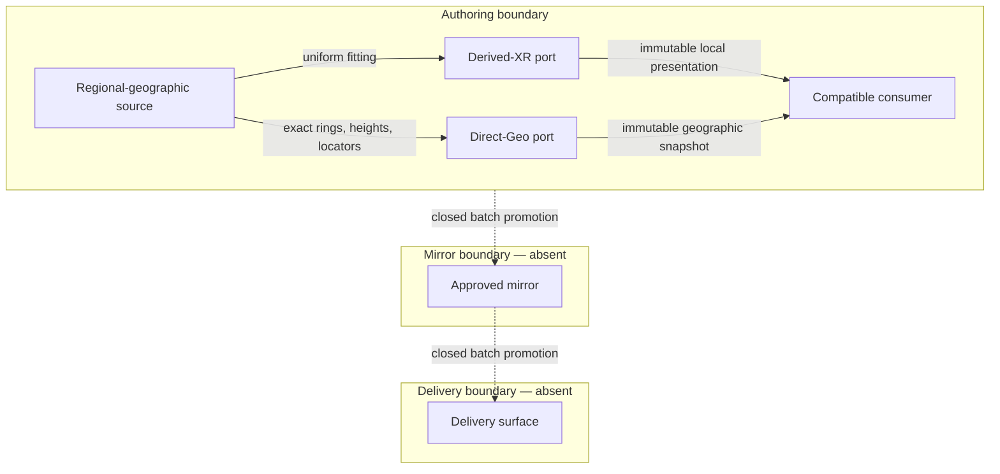

# Singapore ADM0 Environment Companion PRD/TAD/ADR

## 1. Authority and boundary

This companion is the sole document authority for the Singapore-specific environment contract consumed by reusable surface modes and compatible applications. It owns:

- ADM0 identity `SGP` and display identity `Singapore`;
- the local-stage geographic anchor and axis convention;
- the presentation center and viewport extent;
- planar and oblique initial camera policies;
- the selected Singapore terrain dimensions;
- the named major-POI roster and its deterministic XR presentation policy;
- regional geographic POI profile `adm0:SGP:major-pois/v1`, revision `2026-07-31.2`;
- the exact checked-in geographic rings, real-metre base/top heights, accuracy statements, OpenStreetMap snapshot provenance, official height context, attribution, and no-runtime-network policy for that profile; and
- the distinction among an ADM0 identity, presentation framing, a local stage
  footprint, and authoritative geographic boundaries.

The generic mode document owns surface composition, renderer and input arbitration, semantic media wrappers, overlay slots, lifecycle, and provider adapters. The City document owns POI-keyed zoning state, economy, advice, persistence, and City actions. Its records use the exact `RegionalPoiIdentity.id` values selected by this companion and own no geographic geometry or aerial data. Flight and other applications own their own simulation state. This companion supplies locale data to those owners and does not redefine, specialize, or alias their contracts.

No polygon in this companion is asserted to be an administrative, legal, surveyed, cadastral, navigational, or emergency-response boundary. The viewport extent frames a presentation. The dated regional profile is the sole POI geometry and height authority. Its exact OpenStreetMap rings and real-metre heights project directly to geographic consumers and derive a uniformly fitted, non-collidable presentation for the 32 by 24 metre XR stage. The XR projection is not a second source and is never projected back onto a basemap.

## 2. Readiness and lane statement

| Concern | Local rung | Delivered rung | Statement |
|---|---|---|---|
| Product and architecture contract | `spec-complete` | `undocumented` | Requirements, typed boundaries, decisions, and VCCs are stated. |
| Source implementation | `spec-complete` | `undocumented` | Source owners exist, but no result is attached to this revision. |
| Mirror lane | `undocumented` | `undocumented` | Closed: no mirror target is declared by this companion. |
| Delivery lane | `undocumented` | `undocumented` | Closed: no public environment artifact or release target is declared. |

The document makes no runtime-ready, integration, production, or deployment claim. A named command is a planned evaluator; it is not an Evidence Reference until its immutable result, revision, and environment are recorded.

## 3. PRD

### 3.1 Problem and outcome

Locale facts previously embedded in simulator or mode descriptions can drift, be mistaken for generic architecture, or turn a viewport rectangle into an accidental boundary claim. A single locale companion must make those facts reviewable while allowing the generic surface and each application to remain place-agnostic.

The outcome is one source-authored Singapore POI profile with exact rings, real-metre heights, accuracy, provenance, and stable identities. A conforming consumer either preserves that geography directly or derives a bounded local XR presentation from it through one typed projection. No consumer authors a second POI roster, maps local fixtures back into geography, or layers conflicting geometry, and this package gains no renderer, interaction, simulation, persistence, provider, or delivery ownership.

### 3.2 Personas

**Primary persona — environment data steward.** The steward changes a Singapore-specific anchor, camera policy, or geographic POI snapshot once and expects every conforming consumer projection to receive the correct typed revision.

**Secondary persona — reviewer.** The reviewer needs to prove that the ADM0 identity, viewport extent, stage footprint, and POI geometry are distinct concepts and that no generic mode or application contract is duplicated here.

**Tertiary persona — operator.** The operator selects the Singapore environment and expects a stable initial view with recognizable, aligned POIs in planar and volumetric presentations.

### 3.3 Primary journey

| Stage | Actor action | Locale owner response | Completion signal |
|---|---|---|---|
| Inspect | Review ADM0 identity and scope | Expose `SGP`, Singapore, and boundary disclaimers | No presentation rectangle is labelled as an ADM0 polygon |
| Select | Select Singapore context | Resolve one locale revision and one consumer projection | One exact profile identity across ports |
| Project | Enter local XR or geographic MapLibre presentation | Fit exact regional POIs into the bounded XR stage or preserve their rings and heights directly for Geo | No local-to-geographic POI remap or duplicate authority |
| Verify | Inspect the six named major POIs | Surface stable identities, explicit accuracy, provenance, and projection class | Twelve source surfaces and six derived identity locators remain exact |
| Exit | Leave or replace the environment | Release only locale data | Consumer lifecycle and prior surface remain consumer-owned |

### 3.4 User stories

- `PRD-SG-01` — As a steward, I can maintain the Singapore ADM0 identity in one locale contract so generic and application documents contain no copied facts.
- `PRD-SG-02` — As a reviewer, I can distinguish the presentation extent from an administrative boundary and the stage footprint from either.
- `PRD-SG-03` — As an operator, I receive a north-up planar initial view and an oblique volumetric initial view from one Singapore camera policy.
- `PRD-SG-04` — As a consumer, I can project local metres through one anchor and axis convention without a second geography or compatibility alias.
- `PRD-SG-05` — As an operator, I can identify Marina Bay Sands, Singapore Flyer, Gardens by the Bay, Esplanade — Theatres on the Bay, The Fullerton Hotel, and Raffles Hotel through stable semantic POI identities.
- `PRD-SG-06` — As a reviewer, I can verify that the twelve non-collidable XR presentation surfaces are derived from the same twelve regional geographic surfaces and that only the geographic source can enter a basemap projection.
- `PRD-SG-07` — As a maintainer, I can validate exact geographic rings, real-metre heights, dated provenance, and attribution locally without a model, token, account, runtime network call, remote asset, or new runtime dependency.
- `PRD-SG-08` — As a delivery owner, I can see that mirror and delivery lanes are closed until a separate authorized contract opens them.

### 3.5 Must, should, could, will not

| Priority | Scope |
|---|---|
| Must | One ADM0 identity; one anchor; one axis convention; one presentation center and extent; two camera-policy classes; one local XR stage; six POI identities; one twelve-surface geographic authority; deterministic local-XR derivation; one locator per POI; exact geographic rings; real-metre heights; dated geometry/height provenance; ODbL attribution; explicit accuracy and non-boundary disclaimers; VCC coverage. |
| Should | Human-readable labels, stable revisions, accessible inspection metadata, exact source-to-presentation equality checks, and failure on unknown POI identity. |
| Could | A future separately sourced official ADM0 polygon or additional Singapore profile variants, each admitted by a new requirement and VCC. |
| Will not | Own a generic mode, map provider, renderer, camera mechanism, application state, City logic, Flight logic, legal boundary, navigation product, hosted API, account, model, release lane, OS Status Surface, Agent Discovery Surface, or Gateway Federation Contract. |

### 3.6 Time to value, measures, and economics

| TTV dimension | Estimate | Ceiling | Validation |
|---|---:|---:|---|
| Manual actions | 1 environment selection | 1 | clean-source walk-through |
| Elapsed time after consumer readiness | 1 committed frame | 1 second | timed projection assertion |
| First value | stable regional context | — | identity, camera, and POI snapshot |

| Measure | Baseline | Target | Timeline |
|---|---:|---:|---|
| Select-to-stable initial environment projection | no candidate-bound observation | at most 1 committed presentation frame after the consumer is ready | first satisfying VCC run |
| Locale choices required after selecting Singapore | no candidate-bound observation | 0 | first satisfying VCC run |
| ADM0 identities in this package | unvalidated | exactly 1 | authoring gate |
| Geographic anchors | unvalidated | exactly 1 | authoring gate |
| Named major POIs | unvalidated | exactly 6 | authoring gate |
| Derived XR POI presentation surfaces | unvalidated | exactly 12 from the geographic profile | authoring gate |
| Regional geographic POI surfaces | unvalidated | exactly 12 | authoring gate |
| Regional geographic POI locators | unvalidated | exactly 6 topology-aware representative points derived from source surfaces | authoring gate |
| Runtime network calls for regional POI data | unvalidated | exactly 0 | every run |
| Required model or token calls | unvalidated | 0 | every run |
| Required remote locale or asset calls | unvalidated | 0 | every run |
| Added runtime dependencies | current repository baseline | 0 | integration gate |
| Locale-owned renderers, cameras, and persistence stores | unvalidated | 0 | every run |

The min-viable-max-value path is checked-in typed locale data plus the existing shared projection and presentation owners. Marginal runtime cost, model cost, token cost, locale storage operations, and locale delivery operations are zero. Provider transport and application costs remain outside this companion and must be attributed to their actual owners.

| Feature | Tier | Impact | Sessions/month | Build hours | Monthly TCO/token cost | ROI score |
|---|---|---:|---:|---:|---:|---:|
| ADM0 identity, framing, and camera policy | Must | 5 | 20 | 20 | $0 | 5.00 |
| Semantic POI roster and projection | Must | 4 | 12 | 24 | $0 | 2.00 |
| Official administrative polygon | Won't | 2 | 2 | 80 | $10 | 0.04 |

The Must threshold is `2.0`, using `(impact × sessions) / (build hours + monthly TCO + monthly token cost)`.

### 3.7 Given/When/Then acceptance criteria

**AC-SG-01 — Identity and boundary honesty.** Given the locale package, when a reviewer inspects its geographic values, then `SGP` is the only ADM0 code, Singapore is the display identity, the viewport rectangle is labelled presentation framing, and no local-stage ring is described as an administrative or legal boundary.

**AC-SG-02 — Deterministic local projection.** Given finite local coordinates, when they are projected, then positive local X moves east, negative local Z moves north, Y remains height in metres, and repeated equal inputs return equal coordinates. Non-finite inputs fail before projection.

**AC-SG-03 — Camera policy.** Given a planar view, when Singapore is framed, then bearing and pitch are zero. Given a volumetric view, when Singapore is framed, then the declared oblique bearing and pitch are used. Both policies use the same center and presentation extent and do not create a camera owner.

**AC-SG-04 — Major POIs.** Given Singapore context, when its profile resolves, then the roster is exactly Marina Bay Sands, Singapore Flyer, Gardens by the Bay, Esplanade — Theatres on the Bay, The Fullerton Hotel, and Raffles Hotel. The geographic profile retains twelve stable surfaces with complete exact Polygon ring sets, real-metre base/top heights, accuracy, and provenance. Every outer ring is simple and non-zero-area; every optional inner ring is simple, strictly contained, and non-overlapping. Its XR adapter derives twelve stable non-collidable presentation surfaces and their complete projected rings without a second geometry fixture.

**AC-SG-05 — Consumer projection.** Given the locale package and a conforming consumer, when local XR is requested, then the checked-in profile is uniformly fitted into the selected stage without changing identity or relative geography. When regional geographic context is requested, then the exact source rings and real-metre heights remain unchanged. City may attach read-only state directly to the six canonical POI identities but cannot author geometry, framing inputs, aerial data, or a derived local XR presentation.

**AC-SG-06 — Ownership and offline boundary.** Given environment selection, when the package is read and projected, then it mounts no renderer, owns no input or simulation state, persists nothing, and performs no model, token, account, remote-locale, remote-asset, or runtime geodata call. The checked-in OpenStreetMap snapshot retains attribution and ODbL identity.

## 4. Locale data contract

### 4.1 ADM0 identity and presentation reference

| Field | Normative value | Meaning |
|---|---|---|
| `adm0Code` | `SGP` | Country-level identity |
| `displayName` | `Singapore` | Human-readable locale identity |
| `localAnchor` | `[103.851959, 1.29027]` | Origin for authored local metres |
| `presentationCenter` | `[103.8198, 1.3521]` | Initial viewport center |
| `presentationSouthwest` | `[103.605, 1.158]` | Presentation framing only |
| `presentationNortheast` | `[104.09, 1.48]` | Presentation framing only |
| `stageSizeMeters` | `[32, 24]` | Authored local terrain width and depth |
| `axisConvention` | `+X east; -Z north; +Y up` | Local-to-geographic and height mapping |

Coordinates are ordered `[longitude, latitude]`. Local positions and sizes are metres. The longitude conversion uses latitude-adjusted metres per degree; the latitude conversion uses a fixed metres-per-degree approximation. This is a bounded presentation transform, not a geodetic-survey method.

### 4.2 Camera policies

| Policy | Applicable view classes | Bearing | Pitch | Zoom cap | Maximum pitch | Fit padding |
|---|---|---:|---:|---:|---:|---:|
| North-up | planar classic and planar modern | `0` | `0` | `12` | `60` | `32` |
| Oblique city | volumetric classic and volumetric modern | `-18` | `55` | `12.8` | `85` | `32` |

These values are initial presentation data. The generic surface retains camera mechanism, interaction, lifecycle, resize, and restoration ownership.

### 4.3 Derived local XR presentation

The 32 by 24 metre XR stage contains no separately authored POI positions, sizes, rings, or heights. Its adapter validates the regional profile, unwraps the minimum longitude arc, projects every complete ring to a latitude-adjusted local metre frame, uniformly fits their union within the stage padding, and derives each surface base/top height with the same scale. IDs, labels, parents, categories, surface order, complete topology, and relative geography remain source-derived.

All twelve derived surfaces are `kind=poi` and `collidable=false`. Category-to-material and landmark morphology are presentation policy only; they cannot modify source identity, rings, height, accuracy, or provenance. The derived local rings feed one shared XR extrusion boundary consumed by the standalone XR, Media preview, and Physics presentations. They are forbidden as input to MapLibre or any other geographic projection.

### 4.4 Regional geographic MapLibre POI profile

| Field | Normative value |
|---|---|
| Schema / profile / revision | `agenticgraph.regional-poi-profile/v1` / `adm0:SGP:major-pois/v1` / `2026-07-31.2` |
| Snapshot | `2026-07-31T00:00:00Z` |
| Policy | `storage=checked-in`; `runtimeNetwork=forbidden` |
| Attribution | `© OpenStreetMap contributors`; `https://www.openstreetmap.org/copyright`; `Open Data Commons Open Database License 1.0`; `https://opendatacommons.org/licenses/odbl/1-0/` |
| Presentation | one MapLibre `regional-context` band; City state styles the same canonical POI surfaces without adding geometry, while an independent Flight route or aircraft overlay remains separately owned; no active or visible Three.js/R3F presentation and no HTML marker |

`base` and `top` below are metres above the profile ground plane. For dated OpenStreetMap ways, the snapshot polygon and recorded heights are render authority; official references are accuracy context. The Flyer is the explicit exception only for height: OSM way `230082125` v19 is exact geometry authority, while the official source supplies its 165 metre top height. Its thin MapLibre fill extrusion is geographic massing, not wheel morphology or a podium footprint.

| Surface | Exact geometry authority | Base / top m | Footprint / height accuracy | Official context |
|---|---|---:|---|---|
| `marina-bay-sands:tower-1` | OSM way `116801004` v24 | `0 / 193` | `source-polygon / source-recorded` | Marina Bay Sands architecture: towers about 191 m; OSM remains render authority |
| `marina-bay-sands:tower-2` | OSM way `172307472` v20 | `0 / 193` | `source-polygon / source-recorded` | same |
| `marina-bay-sands:tower-3` | OSM way `172307471` v22 | `0 / 193` | `source-polygon / source-recorded` | same |
| `marina-bay-sands:skypark` | OSM way `116800998` v37 | `193 / 207` | `source-polygon / source-recorded` | Marina Bay Sands architecture: rooftop observation deck 200 m; OSM remains render authority |
| `singapore-flyer:wheel` | OSM way `230082125` v19 | `0 / 165` | `source-polygon / official-published` | Singapore Flyer official Fun Facts |
| `gardens-by-the-bay:supertree-681695804` | OSM way `681695804` v4 | `17 / 33` | `source-polygon / source-recorded` | Gardens by the Bay official 25–50 m range; OSM remains render authority |
| `gardens-by-the-bay:supertree-572839881` | OSM way `572839881` v6 | `0 / 46` | `source-polygon / source-recorded` | same |
| `gardens-by-the-bay:supertree-572839873` | OSM way `572839873` v6 | `33 / 36` | `source-polygon / source-recorded` | same |
| `gardens-by-the-bay:supertree-681695795` | OSM way `681695795` v4 | `27 / 33` | `source-polygon / source-recorded` | same |
| `esplanade-theatres-on-the-bay:main-building` | OSM way `97582570` v33 at `2024-04-14T16:45:20Z` | `0 / 13` | `source-polygon / source-recorded` | no separate context source |
| `the-fullerton-hotel:main-building` | OSM way `46595395` v27 at `2024-04-12T11:55:48Z` | `0 / 25` | `source-polygon / source-recorded` | explicit `height=25` is render authority; conflicting `building:height=37` is not substituted |
| `raffles-hotel:main-building` | OSM way `254815862` v8 at `2023-12-05T10:20:00Z` | `0 / 14` | `source-polygon / source-recorded` | no separate context source |

Exact closed outer rings are ordered `[longitude,latitude]`:

- `marina-bay-sands:tower-1`: `[[103.8605263,1.2827539],[103.8604802,1.2827859],[103.8601414,1.2830212],[103.8599199,1.2827024],[103.8598409,1.2825888],[103.8602258,1.2823215],[103.8605263,1.2827539]]`
- `marina-bay-sands:tower-2`: `[[103.8606018,1.2839324],[103.860369,1.2834367],[103.8607815,1.2832456],[103.8610143,1.2837414],[103.860892,1.2837988],[103.8606018,1.2839324]]`
- `marina-bay-sands:tower-3`: `[[103.8611752,1.2846907],[103.8611459,1.284699],[103.8610342,1.2847306],[103.8610137,1.2846581],[103.8609398,1.284679],[103.8608858,1.2846942],[103.8607721,1.2842924],[103.8610409,1.2842163],[103.8611752,1.2846907]]`
- `marina-bay-sands:skypark`: `[[103.8609826,1.2848989],[103.8610173,1.285036],[103.8610442,1.2850909],[103.8610808,1.2851351],[103.8611099,1.2851541],[103.8611359,1.2851574],[103.8611632,1.2851505],[103.8611939,1.2851262],[103.8612164,1.2850935],[103.8612318,1.2850442],[103.8612425,1.2849657],[103.8612569,1.2848545],[103.8612302,1.2846658],[103.8611969,1.2844555],[103.8611461,1.284261],[103.8610867,1.2840541],[103.8609999,1.2838001],[103.8608748,1.2835139],[103.8607372,1.2832315],[103.8605401,1.2829092],[103.8604051,1.2826851],[103.8600916,1.2822886],[103.859959,1.2823283],[103.8598747,1.2824039],[103.8598239,1.2825055],[103.8599698,1.282688],[103.8601815,1.2829848],[103.8602257,1.2830433],[103.8603308,1.2832159],[103.860497,1.2835257],[103.8606228,1.2838056],[103.8606844,1.2839598],[103.860746,1.2841248],[103.860846,1.2844417],[103.8609147,1.2847022],[103.8609826,1.2848989]]`
- `singapore-flyer:wheel`: `[[103.8625828,1.2890295],[103.8636235,1.2898476],[103.8636678,1.2897913],[103.8626271,1.2889732],[103.8625828,1.2890295]]`
- `gardens-by-the-bay:supertree-681695804`: `[[103.8634673,1.2819593],[103.8634522,1.2819617],[103.8634391,1.2819696],[103.8634299,1.2819818],[103.8634261,1.2819967],[103.8634281,1.2820119],[103.8634357,1.2820251],[103.863438,1.2820276],[103.8634508,1.2820359],[103.8634659,1.2820388],[103.8634809,1.2820359],[103.8634937,1.2820274],[103.8635023,1.2820147],[103.8635055,1.2819998],[103.8635029,1.2819847],[103.8634947,1.2819718],[103.8634822,1.2819628],[103.8634673,1.2819593]]`
- `gardens-by-the-bay:supertree-572839881`: `[[103.8640295,1.2818615],[103.8640131,1.2818452],[103.8639941,1.2818322],[103.863973,1.2818229],[103.8639505,1.2818176],[103.8639275,1.2818165],[103.8639046,1.2818197],[103.8638827,1.281827],[103.8638625,1.2818383],[103.8638447,1.281853],[103.86383,1.2818708],[103.8638188,1.2818909],[103.8638114,1.2819128],[103.8638083,1.2819357],[103.8638093,1.2819587],[103.8638146,1.2819812],[103.8638239,1.2820023],[103.863837,1.2820214],[103.8638533,1.2820377],[103.8638724,1.2820507],[103.8638935,1.2820601],[103.8639159,1.2820653],[103.863939,1.2820664],[103.8639619,1.2820632],[103.8639838,1.2820559],[103.8640039,1.2820446],[103.8640217,1.2820299],[103.8640365,1.2820121],[103.8640477,1.2819919],[103.864055,1.28197],[103.8640582,1.2819472],[103.8640571,1.2819242],[103.8640519,1.2819017],[103.8640425,1.2818806],[103.8640295,1.2818615]]`
- `gardens-by-the-bay:supertree-572839873`: `[[103.8642248,1.2823002],[103.8642124,1.2822805],[103.8641962,1.2822674],[103.8641768,1.2822599],[103.864156,1.2822587],[103.8641358,1.2822639],[103.8641182,1.282275],[103.8641049,1.282291],[103.8640971,1.2823103],[103.8640956,1.2823311],[103.8641006,1.2823513],[103.8641131,1.2823709],[103.8641316,1.282385],[103.8641537,1.282392],[103.864177,1.282391],[103.8641985,1.2823822],[103.8642157,1.2823665],[103.8642265,1.282346],[103.8642296,1.2823229],[103.8642248,1.2823002]]`
- `gardens-by-the-bay:supertree-681695795`: `[[103.8638425,1.2823918],[103.8638272,1.2823942],[103.8638139,1.2824022],[103.8638046,1.2824146],[103.8638008,1.2824296],[103.8638028,1.2824449],[103.8638106,1.2824583],[103.8638128,1.2824608],[103.8638258,1.2824692],[103.863841,1.2824722],[103.8638562,1.2824692],[103.8638691,1.2824606],[103.8638779,1.2824478],[103.8638811,1.2824327],[103.8638784,1.2824174],[103.8638701,1.2824044],[103.8638576,1.2823954],[103.8638425,1.2823918]]`
- `esplanade-theatres-on-the-bay:main-building`: `[[103.8563507,1.2892255],[103.8563712,1.2892234],[103.8563807,1.2894071],[103.856396,1.2897006],[103.8563981,1.2897383],[103.8564013,1.2897951],[103.8564262,1.2897979],[103.8564188,1.2898683],[103.8563899,1.289964],[103.8563511,1.2900244],[103.8563087,1.2900692],[103.8562842,1.2900885],[103.8562259,1.2901344],[103.8561394,1.2901713],[103.8561231,1.29014],[103.8560876,1.2901534],[103.8560365,1.2901727],[103.8559812,1.2901722],[103.855937,1.2903079],[103.8558132,1.2902671],[103.8558897,1.2899639],[103.8558885,1.2899067],[103.8558706,1.2898647],[103.8558452,1.2898379],[103.8557637,1.2897819],[103.8556784,1.289745],[103.8555778,1.2897246],[103.8554989,1.2897348],[103.8554428,1.2897705],[103.8554174,1.2898163],[103.8552459,1.2902159],[103.8551766,1.2901515],[103.8551064,1.2900765],[103.8550396,1.2899725],[103.8549994,1.2898938],[103.8549855,1.2898587],[103.8549508,1.2897439],[103.8549423,1.2895978],[103.8553728,1.2897017],[103.8554416,1.289703],[103.8554899,1.2896775],[103.8555409,1.2896101],[103.8555778,1.2895375],[103.8556135,1.2894217],[103.8556147,1.289358],[103.8555905,1.2892868],[103.8555511,1.2892422],[103.8553086,1.2891493],[103.855323,1.2891293],[103.8552845,1.2891011],[103.8553352,1.2890498],[103.8553654,1.2890802],[103.855401,1.2890545],[103.8554232,1.2890431],[103.8554516,1.2890317],[103.8554825,1.2890218],[103.8555134,1.289018],[103.8555515,1.2890191],[103.8555808,1.2890228],[103.8556079,1.2890284],[103.8556361,1.2890395],[103.8556602,1.2890505],[103.855677,1.2890606],[103.8556937,1.2890726],[103.8557276,1.2891073],[103.8557447,1.2891274],[103.8557599,1.2891485],[103.855772,1.2891759],[103.8557827,1.2892077],[103.855791,1.2892384],[103.8557952,1.2892752],[103.8558947,1.289269],[103.8559682,1.2893539],[103.8559501,1.2893648],[103.8559396,1.289375],[103.8559331,1.2893852],[103.8559268,1.2894001],[103.8559211,1.2894144],[103.855918,1.2894303],[103.8559193,1.2894503],[103.8559222,1.2894688],[103.8559298,1.2894878],[103.8559369,1.2895022],[103.855946,1.2895134],[103.8559551,1.2895227],[103.8559663,1.2895299],[103.8559789,1.2895374],[103.8559941,1.2895435],[103.8560124,1.289548],[103.8560285,1.2895488],[103.8560451,1.289546],[103.856061,1.2895424],[103.8560738,1.2895374],[103.8560877,1.2895289],[103.8561004,1.2895168],[103.8561101,1.2895052],[103.8561166,1.2894965],[103.856122,1.2894868],[103.8561271,1.2894717],[103.8561302,1.2894499],[103.8561307,1.2894367],[103.8561291,1.2894236],[103.8561239,1.2894029],[103.8561146,1.2893874],[103.8561007,1.289367],[103.8560845,1.2893537],[103.8560714,1.2893466],[103.8561369,1.2892427],[103.8563507,1.2892255]]`
- `the-fullerton-hotel:main-building`: `[[103.8527136,1.2862226],[103.8527127,1.2862881],[103.8527118,1.2863536],[103.8527497,1.2864132],[103.8528883,1.2866487],[103.8529382,1.2867335],[103.852989,1.2867908],[103.853154,1.2867855],[103.8532303,1.2867407],[103.8532314,1.2866979],[103.853254,1.286693],[103.8532611,1.2864877],[103.8533104,1.286488],[103.8533096,1.2864372],[103.8533837,1.2864362],[103.8534137,1.2863679],[103.8534236,1.2862849],[103.8534191,1.2861811],[103.853384,1.2860833],[103.8533059,1.2860838],[103.8533044,1.2860351],[103.8532499,1.2860352],[103.8532311,1.2857608],[103.853208,1.2857594],[103.8532041,1.2857133],[103.8531708,1.2857124],[103.8531787,1.2856683],[103.8530893,1.2856502],[103.8530004,1.2856321],[103.8529923,1.2856769],[103.8529561,1.2856689],[103.8529021,1.2857877],[103.8528783,1.2857767],[103.8527173,1.2861348],[103.8527517,1.2861548],[103.8527136,1.2862226]]`
- `raffles-hotel:main-building`: `[[103.8543832,1.2945481],[103.8546251,1.2943649],[103.8545623,1.2942821],[103.854507,1.2942091],[103.8542652,1.2943923],[103.8542779,1.2944091],[103.8543684,1.2945285],[103.8543832,1.2945481]]`

Official context references are `https://www.marinabaysands.com/guides/exceptional-experiences/marina-bay-sands-architecture.html`, `https://www.singaporeflyer.com/en/fun-facts`, and `https://www.gardensbythebay.com.sg/en/about-us/media-room/2007.html`, each recorded as accessed at the snapshot timestamp. They contextualize accuracy; only the source identified per surface is render authority.

## 5. TAD

### 5.1 Typed boundaries

| Type | Required fields | Invariants |
|---|---|---|
| `Adm0EnvironmentIdentity` | `adm0Code`, `displayName` | one immutable identity; no inferred filename identity |
| `PresentationReference` | `localAnchor`, `presentationCenter`, `presentationBounds`, `axisConvention` | finite coordinates; ordered longitude/latitude; bounds are not an ADM0 polygon |
| `EnvironmentCameraPolicy` | `viewClass`, `center`, `bounds`, `bearing`, `pitch`, `zoom`, `maxPitch`, `padding` | policy supplies values but owns no camera |
| `EnvironmentStage` | `id`, `label`, `kind`, `sizeMeters`, `structures`, optional regional profile | one Singapore terrain; positive finite dimensions; no second POI authority |
| `DerivedXrPoiSurface` | `id`, `poiId`, `label`, `presentation`, `position`, `size`, `color`, `collidable` | source-derived IDs and fitted dimensions; non-collidable; never geographic input |
| `RegionalPoiSourceReference` | `authority`, `sourceId`, `sourceUrl`, `sourceVersion`, `snapshotAt` | exact HTTPS source and UTC snapshot; no missing provenance |
| `RegionalPoiSurface` | `id`, `poiId`, `label`, `category`, geographic Polygon, base/top metres, accuracy, provenance | complete closed exact rings; simple non-zero-area outer ring; strictly contained, non-crossing, non-overlapping holes; top exceeds base; no local-stage coordinates |
| `RegionalPoiProfile` | schema, identity, region, revision, data policy, attribution, POIs, surfaces | checked-in; runtime network forbidden; exact six identities and twelve surfaces |
| `RegionalPoiLocator` | `poiId`, `label`, geographic point | exactly one immutable, surface-order-independent representative point per identity; antimeridian-aware area weighting with a deterministic point-on-surface fallback |
| `EnvironmentProjection` | `id`, `label`, `anchor`, `presentationBounds`, `stageFootprint`, `surfaces`, `revision` | regional POIs preserve exact rings/heights; local stage and subjects remain separately typed |

Unknown identities, orphan POIs, non-finite distances, non-positive dimensions, open, zero-area, self-intersecting, crossing, outside, overlapping, or nested geographic rings, missing provenance, duplicate surface IDs, unexpected network policy, unsupported presentation categories, or extra legacy properties fail closed. Geographic bounds retain one minimum circular-longitude span; representative points preserve a continuity-safe frame per polygon before combining latitude-adjusted net-area centroids through a circular target, including antimeridian-crossing and distributed profiles. Locators are reorder invariant and must remain on admitted source geometry through a deterministic fallback. No fallback alias, local-to-geographic POI remap, second geometry fixture, or remapped legacy locale identifier is admitted.

### 5.2 Workflow and data flow

| Step | Input | Owner action | Output | Failure |
|---|---|---|---|---|
| 1. Resolve | selected profile ID and consumer port | Resolve the exact geographic profile and compatible projection policy | one immutable typed profile | unknown identity fails |
| 2. Validate | identity, geographic values, provenance | Check exact shapes, parents, finiteness, uniqueness, rings, heights, policy, and attribution | admitted locale revision | malformed value fails |
| 3a. Project local XR | admitted geographic profile plus stage dimensions | Uniformly fit the geographic union into local stage metres | derived local presentation snapshot | unsupported category or invalid stage fails |
| 3b. Publish regional context | admitted geographic surfaces and locators | Preserve exact rings and real-metre heights; add one derived fixed-pixel identity locator and collision-aware label | regional-context snapshot | local-stage input is never accepted |
| 4. Present | typed snapshot plus consumer view class | Use the compatible renderer port without rewriting source values | one aligned presentation | no second surface or HTML marker is created |
| 5. Frame City | admitted regional profile | Let native MapLibre frame the six canonical POIs inside the visible aperture | one camera request over source-authoritative regional bounds | locale package and City own no camera |
| 6. Release | environment replacement or exit | Drop locale snapshot only | consumer-controlled restoration | no locale-owned cleanup side effect |

Data direction is one way:

`Singapore regional source -> validation -> exact geographic rings/heights/provenance -> regional-context MapLibre consumer`.

`Singapore regional source -> validation -> uniform local fitting -> immutable XR presentation consumer`.

Application state never flows back into the locale source. Flight Geo and City
may read the exact regional profile; standalone XR may read its derived local
presentation. No consumer may mutate anchor, rings, heights, provenance, camera
policy, revision, or stage geometry.

**Alternate path:** a consumer requests planar presentation; geographic height
remains in the snapshot while the MapLibre adapter uses its planar layer.

**Error path:** invalid identity, coordinate, dimension, parent, or revision
rejects the complete candidate and preserves the last admitted snapshot.

**Postconditions:** one exact typed snapshot is accepted by its compatible
port, or no locale state changes.

### 5.3 Deterministic orchestration/harness flow

**Topology pattern:** sequential
**Max iterations:** 1
**Circuit-breaker:** first validation or consumer-admission failure
**Token budget:** 0 prompt + 0 completion at 100% no-call rate = $0 per run

| Role | Component | Input schema | Output schema | Cost log | Fallback |
|---|---|---|---|---|---|
| Dispatcher | locale resolver | exact environment identity | authored candidate | — | typed unknown-identity error |
| Executor | validation and projection adapter | typed locale candidate | immutable environment snapshot | model `none`; all token/cost fields zero | retain last admitted snapshot |
| Observer | revision recorder | candidate and result | bounded diagnostic | — | report telemetry gap |
| Consumer | generic surface port | environment snapshot | accepted or rejected revision | — | unchanged composed surface |

### 5.4 Topology and lane boundaries

**Topology version note:** v1.2 removes the local-XR POI source and gives the
regional profile one exact authority with direct-Geo and derived-XR ports. A
later delta must version this topology rather than add a parallel geometry
fixture.

| Boundary | Inputs | Outputs | Prohibited ownership |
|---|---|---|---|
| Regional-geographic source | exact rings, real-metre heights, accuracy, provenance, attribution | immutable regional profile | camera, provider, runtime network, or second POI source |
| Derived-XR adapter | one regional profile plus local stage dimensions | uniformly fitted non-collidable presentation | geographic publication or independent geometry values |
| Direct-Geo adapter | one regional profile | exact surfaces plus identity locators | local-stage coordinates, ring scaling, or height scaling |
| Generic surface | compatible snapshot plus view class | visible planar or volumetric presentation | locale mutation |
| Application consumer | read-only environment snapshot | application overlay composed in its own slot | locale or generic-surface ownership |
| Mirror lane | none | none | implicit copy or generated authority |
| Delivery lane | none | none | deployment or public-readiness inference |

| Boundary | From | To | Evidence Reference | Operator instruction | Rollback statement | State |
|---|---|---|---|---|---|---|
| `SG-AUTHORING-TO-MIRROR` | Authoring | Mirror | none recorded | none | retain prior mirror and verify its manifest | closed |
| `SG-MIRROR-TO-DELIVERY` | Mirror | Delivery | none recorded | none | retain prior delivery and rerun its reachability check | closed |

### 5.5 Component inventory

| Component ID | Interface | Responsibility | Local rung | Delivered rung | VCCs |
|---|---|---|---|---|---|
| `TAD-SG-IDENTITY` | `readEnvironmentIdentity()` | Return the one ADM0 identity and presentation reference | spec-complete | undocumented | `VCC-SG-01` |
| `TAD-SG-CAMERA` | `readInitialCameraPolicy(viewClass)` | Return deterministic initial values for planar or volumetric presentation | spec-complete | undocumented | `VCC-SG-02` |
| `TAD-SG-STAGE` | `resolveEnvironmentStage(id)` | Resolve the 32 by 24 metre Singapore terrain | spec-complete | undocumented | `VCC-SG-03`, `VCC-SG-04` |
| `TAD-SG-POI` | `resolveMajorPoi(id)` | Resolve stable identities and the one regional-geographic surface source | spec-complete | undocumented | `VCC-SG-04` |
| `TAD-SG-PROJECT` | `projectLocalMeters(x,z)` | Apply the one anchor and axis mapping | spec-complete | undocumented | `VCC-SG-03` |
| `TAD-SG-REGIONAL` | `readRegionalPoiProfile(id)` | Return exact checked-in rings, heights, accuracy, provenance, attribution, and policy | spec-complete | undocumented | `VCC-SG-04`, `VCC-SG-05`, `VCC-SG-06` |
| `TAD-SG-XR-PROJECTION` | `createRegionalPoiXrPresentation(profile, stage)` | Derive a uniformly fitted local presentation without a second fixture | spec-complete | undocumented | `VCC-SG-03`, `VCC-SG-04`, `VCC-SG-06` |
| `TAD-SG-LOCATOR` | `deriveRegionalPoiLocators(profile)` | Produce one order-independent identity locator per POI | spec-complete | undocumented | `VCC-SG-04`, `VCC-SG-05` |
| `TAD-SG-GATE` | `checkSingaporeEnvironment()` | Reject drift, aliases, invalid data, network ownership, or copied locale facts | spec-complete | undocumented | `VCC-SG-01` through `VCC-SG-08` |

### 5.6 Quality attributes

| Attribute | Bound | Design response | VCC |
|---|---|---|---|
| Semantic honesty | zero boundary mislabelling | Separate identity, framing, stage, and official-boundary concepts | `VCC-SG-01` |
| Determinism | equal input gives byte-equal ordered projection | Immutable values and stable ordered revision | `VCC-SG-03`, `VCC-SG-05` |
| Visual alignment | no local/geographic remap; exact geographic rings and real-metre heights | One source profile, direct-Geo projection, derived-XR fitting, and MapLibre-owned composite framing | `VCC-SG-05` |
| Portability | consumer- and provider-agnostic data contract | Typed coordinates, rings, heights, accuracy, provenance, labels, and kinds | `VCC-SG-05` |
| Browser reach | compatible browser consumers can inspect the same typed profile | No document-tree, input, or provider assumption in the locale contract | `VCC-SG-05`, `VCC-SG-06` |
| Mobile reach | consumer layout and input remain external at every viewport | Local-metre geometry and semantic labels carry no viewport minimum | `VCC-SG-05`, `VCC-SG-06` |
| Offline behavior | zero required locale/asset/model/geodata calls | Checked-in source values and attribution only | `VCC-SG-06` |
| Performance | one projection per changed revision | Stable revision permits consumer memoization | `VCC-SG-05` |
| Accessibility | every POI has a readable label, parent, and visible geographic locator | Semantic labels survive projection; fixed-pixel locators remain distinguishable | `VCC-SG-04`, `VCC-SG-05` |
| Maintainability | one Singapore document and one source chain | Generic and application docs link without copying facts | `VCC-SG-07` |
| Delivery safety | no implicit mirror or release | Closed lanes and undocumented delivery rung | `VCC-SG-08` |

### 5.7 Failure and recovery

| Failure | Required behavior |
|---|---|
| Unknown environment or POI ID | Fail with an explicit local error; do not choose a fallback |
| Non-finite coordinate or dimension | Reject before projection; retain the last admitted snapshot |
| Non-positive stage or surface size | Reject; never emit a zero-area or inverted ring |
| Derived XR presentation supplied to the geographic port | Reject before presentation; only the source profile may enter Geo |
| Open ring, invalid base/top height, missing provenance, or attribution drift | Reject the complete regional profile; retain the prior map state |
| Duplicate or stale alias property | Reject exact-shape validation; remove the stale source rather than remap it |
| Consumer not ready | Retain the selected source; publish only after the consumer accepts a snapshot |
| Locale projection rejected | Leave generic surface and application state unchanged |
| Official-boundary requirement appears | Stop; create a sourced boundary requirement and provenance VCC before use |
| Mirror or delivery requested | Stop; require a separate owner, target, authorization, and Evidence Reference |

## 6. Architecture decisions

### ADR-SG-1: Keep one locale companion as the Singapore document authority

**Status:** Accepted
**Date:** 2026-07-31

**Context:** Repeating locale coordinates, camera values, or POI rosters in
generic mode and application documents creates drift and accidental coupling.

**Decision:** This companion owns Singapore-specific environment facts. Other
documents reference it and state only their consumer obligations.

**Alternatives:** duplicate values per consumer; derive facts from filenames;
or introduce compatibility aliases. All are rejected because they create
multiple authorities or hide identity drift.

**FOSS and 12-month TCO:**

| Variant | Cash TCO | Ops burden | Decision |
|---|---:|---:|---|
| One authored Markdown companion | $0 | 4 h/year | selected |
| FOSS docs duplicated per consumer | $0 | 20 h/year | rejected |
| Managed knowledge registry | at least $600 | 8 h/year | rejected |

**Consequences:** Locale changes are reviewed once and require downstream VCC
reruns. This companion must not absorb generic or application behavior.

### ADR-SG-2: Separate ADM0 identity, presentation framing, and local stage

**Status:** Accepted
**Date:** 2026-07-31

**Context:** A rectangular viewport and a local terrain ring can visually
resemble boundaries while having different semantics.

**Decision:** `SGP` is the ADM0 identity. The coordinate rectangle is viewport
framing. The local stage is a 32 by 24 metre authored scene. Neither geometry
is an official administrative boundary.

**Alternatives:** treat the rectangle as the boundary or silently import an
unsourced polygon. Both are rejected as inaccurate and unauditable.

**FOSS and 12-month TCO:**

| Variant | Cash TCO | Ops burden | Decision |
|---|---:|---:|---|
| Explicit typed semantic fields | $0 | 2 h/year | selected |
| FOSS unsourced polygon fixture | $0 | 12 h/year | rejected |
| Managed boundary service | at least $240 | 10 h/year | deferred pending provenance need |

**Consequences:** Boundary-dependent features remain blocked until a separately
sourced, licensed, versioned, and validated boundary artifact is admitted.

### ADR-SG-3: Keep one geographic POI authority with separate projection ports

**Status:** Accepted
**Date:** 2026-07-31

**Context:** Scaling a small local XR stage onto a basemap produces POIs at the
wrong location and scale. A schematic stage and a geographic footprint answer
different questions even when they share semantic POI identities.

**Decision:** The checked-in regional profile is the sole POI identity,
geometry, and height authority. MapLibre consumes its exact rings and metres.
Standalone XR derives bounded local positions, sizes, and heights through one
uniform fitting adapter. Derived XR values cannot flow back into geography.

**Alternatives:** retain a second hand-authored local POI roster, scale that
roster around an anchor, or hide conflicting layers by stacking order. All are
rejected because the duplicate geometry can drift or reappear in Geo.

**FOSS and 12-month TCO:**

| Variant | Cash TCO | Ops burden | Decision |
|---|---:|---:|---|
| One geographic source with direct-Geo and derived-XR adapters | $0 | 6 h/year | selected |
| Two independent typed POI source classes | $0 | 16 h/year | rejected |
| Scale one local fixture into geography | $0 | 18 h/year | rejected |
| Managed transformation service | at least $720 | 12 h/year | rejected |

**Consequences:** Geographic consumers retain real rings and heights, XR keeps
a bounded recognizable presentation derived from the same revision, and each
consumer remains responsible for its overlay and camera behavior.

### ADR-SG-4: Make POI accuracy and provenance representation-specific

**Status:** Accepted
**Date:** 2026-07-31

**Context:** Recognizable landmarks improve orientation, but presentation
morphology, dated OSM polygons, and official height context carry different
accuracy semantics.

**Decision:** Six named POIs keep stable semantic identities. Their twelve
regional surfaces carry per-surface footprint and height accuracy plus exact
geometry, height, context, version, and snapshot provenance. XR morphology is
explicitly presentation-only and non-collidable. Official values are render
authority only when the surface says `official-published`; otherwise they are
context and the dated OSM record remains render authority.

**Alternatives:** anonymous generic masses lose semantic value; remote or
opaque building assets add dependency and licensing risk; using them as
collision authority creates false physical accuracy. All are rejected.

**FOSS and 12-month TCO:**

| Variant | Cash TCO | Ops burden | Decision |
|---|---:|---:|---|
| Checked-in geographic surfaces plus derived presentation | $0 | 8 h/year | selected |
| FOSS procedural anonymous masses | $0 | 12 h/year | rejected |
| Managed high-detail building assets | at least $1,200 plus egress | 16 h/year | rejected |

**Consequences:** A consumer can display useful regional geometry without
claiming survey accuracy, collision authority, or official equivalence.

### ADR-SG-5: Prefer the zero-dependency FOSS-compatible data path

**Status:** Accepted
**Date:** 2026-07-31

**Context:** Locale presentation can be delivered as checked-in typed data, an
open-data ingestion pipeline, or a proprietary hosted environment service.

**Decision:** Use one checked-in dated OpenStreetMap-derived geographic
snapshot with ODbL attribution, derived local presentation data, official
height context, and existing shared open presentation capabilities. Add no
locale-specific runtime package, service, credential, token, model, asset
fetch, or runtime geodata request.

**FOSS and TCO comparison:**

| Variant | License/portability | 12-month cash TCO | Ops burden | Decision |
|---|---|---:|---:|---|
| Checked-in dated ODbL geographic snapshot plus local derivation | repository-auditable with attribution | $0 | low | selected |
| Runtime FOSS open-data request | portable when policy permits | $0 | medium | rejected for nondeterminism and offline failure |
| Proprietary hosted locale or building service | provider-coupled | at least $1,200 plus egress | medium | rejected |

**Consequences:** The current package is inspectable and offline. A refresh,
official boundary, or high-detail dataset requires a new version, source,
license, accuracy statement, and VCC rather than a hidden dependency.

## 7. VCC and Evidence Reference register

| VCC | Evaluator-checkable end state | Stated check | Constraint | Evidence Reference |
|---|---|---|---|---|
| `VCC-SG-01` | Exactly one `SGP` identity, one anchor, one center, and one presentation extent exist; framing and stage are never classified as an ADM0 polygon. | Focused locale-contract test plus terminology scan exits 0 and surfaces values. | No inferred filename identity or unsourced boundary. | none recorded |
| `VCC-SG-02` | Planar policy is north-up; volumetric policy uses the declared oblique values; both share center and extent. | Focused camera-policy test surfaces the four view-class results. | Locale owns values, not camera lifecycle. | none recorded |
| `VCC-SG-03` | Equal finite local inputs project equally with `+X east`, `-Z north`, `+Y up`; invalid inputs fail. | Focused projection test surfaces equal coordinate digests and rejection cases. | No second anchor or unit scale. | none recorded |
| `VCC-SG-04` | The exact six POIs retain twelve immutable regional-geographic surfaces, twelve source-derived XR presentation surfaces, and six topology-aware representative-point locators; every identity, complete Polygon ring set, base/top height, accuracy value, and provenance reference matches this companion. | Focused profile/source tests surface the unchanged geographic digest, valid topology and invalid-ring rejection, derived XR ring and identity equality, source-to-render completeness, locator invariance across concave, holed, disjoint, reordered, and antimeridian cases, and Geo rejection of local values. | No second POI geometry fixture, remote asset, or opaque POI geometry. | none recorded |
| `VCC-SG-05` | The regional profile projects through source `kg-geo-xr:regional-poi` and layers `kg-geo-xr:regional-poi:fill`, `kg-geo-xr:regional-poi:extrusion`, `kg-geo-xr:regional-poi:outline`, `kg-geo-xr:regional-poi:locator`, and `kg-geo-xr:regional-poi:label`; City state attaches one-to-one through the six exact `RegionalPoiIdentity.id` values, an independent Flight route or aircraft overlay remains separately owned, and MapLibre frames all six POIs while its live canvas remains the sole semantic selection owner. | Focused MapLibre and neutral browser checks compare twelve exact surfaces, complete ring/source-fact pass-through, six locators, five-layer order, direct canonical City identity joins, source-authoritative framing, direct canvas semantics, and a regional-feature union spanning at least 45% of one unobscured aperture axis. | City owns no geometry, dimensions, gaps, bearings, anchor, route, aircraft, derived XR presentation, active or visible Three.js/R3F presentation, HTML marker, generic selectable wrapper, or `aria-hidden`. | none recorded |
| `VCC-SG-06` | Locale selection and projection perform zero model, token, account, remote-locale, remote-asset, runtime-geodata, persistence, or new-dependency operations while retaining ODbL attribution. | Focused offline boundary and exact-property tests surface forbidden-call counts of zero. | Provider transport remains separately owned. | none recorded |
| `VCC-SG-07` | Generic Geo+XR and City documents contain no copied Singapore facts and reference this companion for locale data. | Document contract scan exits 0 and surfaces allowed references. | No compatibility alias or duplicate locale authority. | none recorded |
| `VCC-SG-08` | Mirror and delivery targets are absent and no source check is interpreted as delivery proof. | Lane contract check surfaces zero targets and `delivered_rung=undocumented`. | Promotion requires a separate authorized contract. | none recorded |

PRD-to-TAD-to-ADR traceability covers 8 of 8 in-scope PRD requirements
(`100%`).

> **Reference implementation: conformance profile.** The
> [selected split structural profile](./agenticgraph-prd-tad-adr-conformance-report.md#reference-implementation-2026-07-31-split-conformance)
> links 19 of 19 selected artifact-bearing rules (`100%`) and counts zero
> advisories. It is not a full guideline-set alignment claim and does not
> satisfy a VCC.

## 8. Readiness gap matrix

| Workstream | Local rung | Delivered rung | Gap | Priority | Exit criterion |
|---|---|---|---|---|---|
| ADM0 identity and semantic boundary | `spec-complete` | `undocumented` | no attached evaluator result | major | satisfying Evidence Reference for `VCC-SG-01` |
| Camera and local projection | `spec-complete` | `undocumented` | no attached evaluator result | major | satisfying Evidence References for `VCC-SG-02` and `VCC-SG-03` |
| Shared geographic POI profile, derived XR, and direct Geo locators | `spec-complete` | `undocumented` | no attached evaluator or browser result | major | satisfying Evidence References for `VCC-SG-04` and `VCC-SG-05` |
| Offline and ownership boundary | `spec-complete` | `undocumented` | no attached evaluator result | major | satisfying Evidence References for `VCC-SG-06` and `VCC-SG-07` |
| Mirror and delivery | `undocumented` | `undocumented` | lanes deliberately closed | none | separate owner, target, authorization, and VCC |

## 9. PRD to TAD to ADR traceability

| PRD requirement | TAD components | ADR | VCC |
|---|---|---|---|
| `PRD-SG-01` | `TAD-SG-IDENTITY`, `TAD-SG-GATE` | `ADR-SG-1` | `VCC-SG-01`, `VCC-SG-07` |
| `PRD-SG-02` | `TAD-SG-IDENTITY` | `ADR-SG-2` | `VCC-SG-01` |
| `PRD-SG-03` | `TAD-SG-CAMERA` | `ADR-SG-2` | `VCC-SG-02` |
| `PRD-SG-04` | `TAD-SG-PROJECT`, `TAD-SG-XR-PROJECTION` | `ADR-SG-2`, `ADR-SG-3` | `VCC-SG-03` |
| `PRD-SG-05` | `TAD-SG-POI`, `TAD-SG-STAGE`, `TAD-SG-REGIONAL` | `ADR-SG-3`, `ADR-SG-4` | `VCC-SG-04` |
| `PRD-SG-06` | `TAD-SG-POI`, `TAD-SG-REGIONAL`, `TAD-SG-XR-PROJECTION`, `TAD-SG-LOCATOR`, `TAD-SG-GATE` | `ADR-SG-3`, `ADR-SG-4` | `VCC-SG-04`, `VCC-SG-05` |
| `PRD-SG-07` | `TAD-SG-REGIONAL`, `TAD-SG-GATE` | `ADR-SG-5` | `VCC-SG-06` |
| `PRD-SG-08` | closed mirror and delivery boundaries | `ADR-SG-1` | `VCC-SG-08` |

## 10. Reference implementation: current source projection

This section names the current repository projection only. The contracts above
remain neutral and are not inferred from these paths.

| Contract concern | Current source module or document | Current symbol or role |
|---|---|---|
| ADM0 and address-derived Singapore metadata | `grph-shared/src/geospatial/sgpAdministrativeAreas.ts` | `deriveSgAdministrativeAreasFromAddress` preserves `SGP`; postal and planning-area derivation is below ADM0 and is not a boundary source |
| Anchor, center, presentation extent, and local projection | `grph-shared/src/geospatial/singaporeFlightGeo.ts` | `SINGAPORE_FLIGHT_GEO_REFERENCE`, `projectSingaporeLocalMeters` |
| MapLibre initial presentation policy | `gympgrph/src/features/geospatial/singaporeMapPolicy.ts` | north-up and oblique policies for the four current view modes |
| Singapore stage catalog | `canvas/src/features/three/xrSceneLibrary.ts` | stage ID `singapore`, 32 by 24 metre terrain, and the shared regional-profile identity |
| Shared Singapore POI identity roster | `grph-shared/src/geospatial/singaporeMajorPoiIdentity.ts` | `SINGAPORE_MAJOR_POI_IDENTITIES`, `SingaporeMajorPoiId` |
| Neutral regional POI contract and locators | `grph-shared/src/geospatial/regionalPoiGeo.ts` | `RegionalPoiProfile`, `RegionalPoiSurface`, `createRegionalPoiProfile`, `deriveRegionalPoiLocators` |
| Neutral Polygon topology, longitude span, and representative point | `grph-shared/src/geospatial/regionalPoiGeometry.ts` | ring admission, per-polygon continuity-safe longitude frames, circular area weighting, latitude-aware net-area centroids, and deterministic point-on-surface fallback shared by locators, XR, City, and Flight framing |
| Singapore regional geographic POI source | `grph-shared/src/geospatial/singaporeMajorPoiGeo.ts` | `SINGAPORE_MAJOR_POI_GEO_PROFILE` with this companion's exact rings, heights, accuracy, provenance, policy, and attribution |
| Derived local XR adapter | `canvas/src/features/three/regionalPoiXrPresentation.ts`, `canvas/src/features/three/xrSingaporeEnvironmentSource.ts` | uniformly fitted `XR_SINGAPORE_MAJOR_POIS` and `XR_SINGAPORE_MAJOR_POI_SURFACES`; no independent geometry values |
| React Three Fiber terrain presentation | `canvas/src/features/three/XrSingaporeTerrainGeometry.tsx` | consumes only the derived XR presentation |
| Exact Flight Geo environment projection | `canvas/src/features/game-flight-sim/flightSimGeoEnvironmentProjection.ts` | `projectXrEnvironmentToFlightGeo`; regional POIs bypass local-stage projection and retain exact rings/metres |
| Flight MapLibre environment projection | `gympgrph/src/flightGeoEnvironmentMapLibreProjection.ts`, `gympgrph/src/flightGeoEnvironmentMapLibre.ts` | exact full Polygon rings and typed accuracy/provenance plus independently typed local stage/subject features for Flight only |
| Regional profile admission | `canvas/src/features/geospatial/regionalPoiProfileCatalog.ts` | exact profile-id resolution; unknown identity fails |
| Regional MapLibre source projection | `gympgrph/src/regionalPoiMapLibreProjection.ts` | twelve exact Polygon features plus six derived Point locators |
| Regional MapLibre presentation | `gympgrph/src/regionalPoiMapLibre.ts` | source `kg-geo-xr:regional-poi`; surface fill, extrusion, outline, fixed-pixel locator, and collision-aware variable-anchor label layers |
| City state projection and framing | `canvas/src/features/game-city-sim/citySimGeospatialProjection.ts`, `gympgrph/src/cityGeoOverlayMapLibreController.ts` | exact canonical POI identity joins on the shared regional source; source-authoritative profile framing without City geometry or camera ownership |
| Existing focused POI proof source | `grph-shared/__tests__/regional-poi-geo.test.mjs`, `canvas/src/__tests__/flightSimSingaporePoiExtrusion.test.ts`, `canvas/src/__tests__/regionalPoiMapLibre.test.ts` | unchanged source digest, locator invariance, derived-XR identity, exact Flight Geo rings/heights, five-layer repair, and stale-property rejection |
| Generic mode authority | `docs/documents/agenticgraph-geo-xr-mode-prd-tad-ard.md` | shared surface, semantic wrapper, lifecycle, input, camera, and overlay ownership |
| City product authority | `docs/documents/agenticgraph-game-city-building-sim-prd-tad-ard.md` | POI-keyed zoning state, economy, advice, persistence, and City actions |

The current renderer libraries are implementation choices inside the generic
surface owner. This companion has no direct dependency on MapLibre, React,
React Three Fiber, Three.js, a provider SDK, or a hosted locale service.

## 11. Change policy

Any change to ADM0 identity, anchor, center, extent, camera values, stage size,
axis mapping, POI roster, XR derivation policy, geographic ring, locator policy,
base/top height, accuracy, provenance, attribution, snapshot, or data policy
increments this document's semantic version and reruns the mapped VCCs. A new
official boundary, data source, remote dependency, or opened mirror/delivery
lane requires its own ADR and evidence contract. Stale Singapore facts in
generic or application documents are removed at their source; they are never
retained through aliases, remapping, or compatibility prose.
