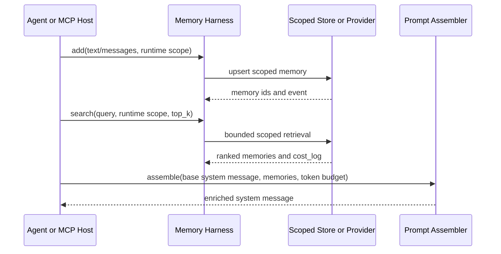

# AgenticGraph — AI Agents Universal Memory Layer PRD/TAD

SSOT upstream: [mem0ai/mem0](https://github.com/mem0ai/mem0) and [mem0ai/mem0-mcp](https://github.com/mem0ai/mem0-mcp).

## Overview

AgenticGraph now has two explicit Dev surfaces: the original provider-neutral add/search/prompt harness and a durable local persistent-memory runtime for agents. The durable runtime executes the canonical Agentic Canvas OS `/memory.write`, `/memory.compact`, `/memory.search`, `/session.search`, and `/user.profile` routes through exact revision-fenced `/`, `#`, and `@` tuples.

Persistent memory is independently implemented with built-in Node.js and existing AgenticGraph durability primitives. It has no external memory-runtime package, service, API, or execution dependency. State is exact-scope sharded, bounded, scanned before write, host-authorized, filesystem-fenced, atomically committed outside Git, revision-addressable, and zero-model by default.

Mem0 remains the reference external engine. Current Context7 docs confirm the core SDK/API primitives: `add`, `search`, `get`, `get_all`, `update`, `delete`, `delete_all`, and `history`; Platform uses `MemoryClient`, OSS uses `Memory`, and Mem0 MCP exposes `add_memory`, `search_memories`, `get_memories`, `get_memory`, `update_memory`, `delete_memory`, and `delete_all_memories`.

## PRD

### Problem

AgenticGraph agents otherwise start cold each session. Users repeat preferences, prompt tokens bloat, and long-running research or build workflows lose context.

### Personas

| Persona | Need | Success |
|---|---|---|
| Power user | Recall preferences across sessions | No repeated re-briefing for known facts |
| Agent pipeline developer | Standard memory primitive | Typed add/search/assemble harness callable from agents |
| Solo operator | Zero-TCO Dev path | Local-first runtime without committed secrets or paid calls |

### Must-Tier Stories

| Story | Acceptance |
|---|---|
| MEM-1-S1: recall cross-session preferences | Search with the same runtime scope returns a stored preference in a later session |
| MEM-1-S2: update changed preferences | Add with the same `memory_key` updates the record instead of stacking stale duplicates |
| MEM-2-S1: inject only relevant context | Prompt assembly includes top-ranked memories within `max_memory_tokens` |
| MEM-2-S2: keep retrieval bounded | Search is one bounded call; local Dev proof emits latency in `cost_log` |
| MEM-3-S1: FOSS/local-first path | Dev runtime works without Mem0 credentials, Qdrant, or Cloudflare deploy |
| MEM-4-S1: MCP-native access | Local MCP exposes memory add, search, and prompt assembly tools |
| MEM-5-S1: durable agent recall | A memory written through MCP remains available after the server process restarts |
| MEM-5-S2: concurrent writer safety | Filesystem locking, expected revisions, and idempotency receipts prevent lost or duplicate writes |
| MEM-6-S1: governed memory | Unauthorized, unsafe, inferred, overflowing, cross-scope, and silently compacting writes fail closed |
| MEM-6-S2: frozen prompt context | Search returns an `as_of_revision` snapshot that later writes cannot mutate; explicit hard redaction intentionally invalidates every snapshot containing the removed entry |
| MEM-7-S1: canonical invocation | Exact Agentic Canvas OS memory tuples resolve at one pinned docs revision and dispatch to the same direct MCP handlers |

### Out of Scope

- Browser-stored Mem0 credentials.
- Backfilling old chat artifacts into memory.
- Cloudflare/Prod deployment until explicitly requested.
- A second KGC or Canvas materialization path for memory.
- Custom memory extraction prompt tuning before the provider mode is selected.

## TAD

### Implemented Components

| Layer | Component | Owner | Status |
|---|---|---|---|
| Shared contract | Schemas, scope validation, token estimate, env names | `canvas/src/features/memory/aiAgentsMemoryLayerContract.mjs` | Implemented |
| Dev runtime | Local JSON add/search/assemble harness | `mcp/memory-layer-runtime.js` | Implemented |
| Persistent contract | Exact tools, limits, schemas, and executable tuples | `mcp/persistent-memory-contract.mjs` | Implemented |
| Durable store | External state-root resolution, checksummed manifest, lock, CAS, idempotency, atomic commit | `mcp/persistent-memory-store.js` | Implemented |
| Persistent policy/runtime | Host authorization, scan, allowlisted profiles, capacity, hard redaction, safe compaction, cited search, frozen revisions | `mcp/persistent-memory-authorization.js`, `mcp/persistent-memory-policy.js`, `mcp/persistent-memory-runtime.js` | Implemented |
| Invocation runtime | Revision-fenced Agentic Canvas OS tuple resolution and dispatch | `mcp/persistent-memory-invocation-runtime.js` | Implemented |
| Local MCP | Tool descriptors and server handlers | `mcp/local-tool-contract.js`, `mcp/server.js` | Implemented |
| Agent registry | `agenticgraph-memory-layer` vdeoxpln entry | `canvas/src/features/agent-ready/agenticgraphVdeoxplnContract.mjs` | Implemented |
| Chat invocation | `#memory.search`, `#memory.add`, `#memory.assemble` discovery and fail-closed external-runtime prompt | `canvas/src/features/chat/chatInvocationRegistry.ts`, `floatingPanelChatSubmitRequest.ts` | Implemented |
| Docs | PRD/TAD and MCP README | this file, `mcp/README.md` | Implemented |

### Local MCP Tools

| Tool | Mutation | Input |
|---|---|---|
| `agenticgraph.memory.add` | Local scoped write | `text` or `messages`, plus at least one of `user_id`, `agent_id`, `run_id`, `app_id` |
| `agenticgraph.memory.write` | Fenced local mutation | exact scope, memory action/evidence/operator, host authorization token, expected scope revision, idempotency key |
| `agenticgraph.memory.compact` | Fenced explicit compaction | exact scope, named memory entries with prior text, replacement, evidence, host authorization, and fences |
| `agenticgraph.memory.search` | Read-only | `query`, required exact four-part persistent scope, optional filters and `as_of_revision`; partial legacy scope is rejected |
| `agenticgraph.session.search` | Read-only | exact scope, query, optional session and snapshot revision |
| `agenticgraph.user.profile` | Read or fenced local mutation | inspect, or one allowlisted structured interaction preference plus evidence and host authorization |
| `agenticgraph.memory.invoke` | Route-dependent | exact source revision, complete canonical `/ # @` tuple, direct-tool arguments |
| `agenticgraph.memory.assemble_prompt` | Read-only | `base_system_message`, ranked `memories`, `max_memory_tokens` |

### Scope and Config

Persistent-memory scope requires exact `tenant_id`, `workspace_id`, `agent_id`, and `subject_id` values; omission never broadens a read. Each exact scope receives an opaque physical store with independent revisions, receipts, and quotas. The state root is configured by `AGENTICGRAPH_MEMORY_STATE_DIR`, or resolved beneath the host state directory using digests of the Git common directory and `AGENTICGRAPH_MEMORY_NAMESPACE`. Main and linked worktrees therefore share repository-scoped host state without writing into either checkout or returning a machine path.

Mutation arguments are not trusted approval evidence by themselves. The canonical local MCP runtime requires `AGENTICGRAPH_MEMORY_APPROVAL_HMAC_KEY` and verifies a short-lived HMAC token over the exact mutation tool and request. The host mints that token with `mintPersistentMemoryAuthorization`; the key remains outside agent-visible arguments. Missing, expired, future, wrong-host, wrong-tool, or request-drifted tokens fail before persistence.

The original harness remains separately configured by `AGENTICGRAPH_MEMORY_STORE_PATH`; its compatibility contract is not treated as the fenced persistent-memory runtime.

FloatingPanel Chat `#memory.*` directives select the canonical memory vdeoxpln and name the exact MCP tool for an external AI/LLM/agent runtime. The request system context requires explicit scope and permits execution only when that tool is present in the request tool set or connected MCP runtime; otherwise the model returns a tool handoff instead of claiming execution.

Provider-mode env names are documented in the shared contract:

| Env | Purpose |
|---|---|
| `AGENTICGRAPH_MEMORY_PROVIDER_MODE` | `local-json`, `mem0-platform`, `mem0-oss`, or `external-mcp` |
| `AGENTICGRAPH_MEMORY_STORE_PATH` | Local Dev JSON store path |
| `AGENTICGRAPH_MEMORY_STATE_DIR` | Optional persistent-memory state directory outside the repository |
| `AGENTICGRAPH_MEMORY_NAMESPACE` | Host-owned local storage partition |
| `AGENTICGRAPH_MEMORY_APPROVAL_HMAC_KEY` | Host-only secret of at least 32 bytes used to verify exact-request mutation authorizations |
| `MEM0_API_KEY` | Operator-owned Mem0 Platform key |
| `VECTOR_STORE_PROVIDER` | OSS vector provider such as Qdrant |
| `LLM_PROVIDER` | OSS extraction LLM provider |
| `EMBEDDER_PROVIDER` | OSS embedder provider |

### Data Flow



The persistent path resolves an exact Agentic Canvas OS tuple, verifies its source revision, scans and authorizes mutation input, acquires the repository-namespaced store lock, rechecks the expected revision, and atomically advances one checksummed manifest. Read-only search can use the returned store revision as an immutable session snapshot.

### Fallbacks

| Operation | Failure behavior |
|---|---|
| Add | Return structured MCP error; agent turn can continue without memory write |
| Write/profile | Reject with a typed scan, approval, duplicate, scope, capacity, idempotency, or stale-revision result; blocked input is not echoed or persisted |
| Compact | Leave the store unchanged unless every named entry and prior text matches and the explicit result reduces capacity |
| Search | Return structured MCP error or empty result at caller boundary; no agent loop retry |
| Invocation | Reject any unknown, incomplete, extra, mixed-case, cross-revision, or dictionary-drifted tuple before dispatch |
| Assemble | Inject no context when no memory fits budget |

### ADR-MEM-01: Provider Mode

Default Dev mode is `local-json` because it is deterministic, zero-TCO, and credential-free. Mem0 Platform and Mem0 OSS are provider modes behind the same contract once an operator supplies runtime config. The implementation does not add SDK dependencies or vendor credentials to the repo.

## Traceability

| Requirement | Runtime evidence |
|---|---|
| Explicit scope | `requireMemoryScope()` rejects missing `user_id`/`agent_id`/`run_id`/`app_id` |
| Add/update | `metadata.memory_key` produces update semantics in the local runtime |
| Persistent exact scope | Persistent calls require all four scope identities and compare their canonical digest exactly |
| Durable mutation | Store restart, concurrent idempotency, stale CAS, checksum corruption, and atomic-write tests |
| Governed writes | Host HMAC authorization, privacy/injection scan, allowlisted profiles, separate capacity, lifecycle, and exact-prior-text tests |
| Frozen snapshot and erasure | `as_of_revision` stays stable after ordinary writes/replacement/compaction; hard redaction scrubs entries, lifecycle events, old receipts, and affected snapshots |
| Search top-K | `agenticgraph.memory.search` returns deterministic bounded cited results with zero model calls |
| Prompt budget | `agenticgraph.memory.assemble_prompt` emits `injected_token_estimate` |
| MCP exposure | `buildAgenticGraphLocalMcpToolDefinitions()` includes the legacy and six persistent-memory tools in the shared stable order |
| `/ # @` execution | Invocation tests accept only the five exact canonical tuples and revision-bound dictionary rows |
| Process restart | Two sequential stdio MCP server processes write then retrieve from the same isolated state root |
| Clean-room boundary | Dependency, lockfile, import, endpoint, and runtime-identity scans remain empty |
| Registry discovery | `agenticgraph-memory-layer` is present in vdeoxpln output |

## Validation

Focused Dev checks:

```bash
npm run persistent-memory:check
npm -C canvas run test:ci:unit -- memory.layer.runtime
npm -C canvas run test:ci:unit -- mcp.server.localToolContract.sharedAndStable
npm -C canvas run test:ci:unit -- vdeoxpln.contract.registryProjection
npm run vdeoxpln:check
npm run hygiene:check
```

Known wider check status on 2026-06-13: `npm -C canvas run check` currently fails on unrelated pre-existing type errors in `src/lib/canvas/widgets/replayContract.ts`, `src/lib/config.ls.owners.ts`, and `cloudflare/workers/agenticgraph-storage/media.ts`.

## Anti-Pattern Guards

| Guard | Applied |
|---|---|
| No hardcoded identities | Scope is required at call time |
| No browser secrets | Env names only; no credential values in UI/docs/tests |
| No unbounded loops | Write/search/compact/invoke have fixed input, result, history, and retry bounds |
| No stale alias stack | New vdeoxpln id is canonical; no compatibility aliases |
| No external runtime dependency | Persistent memory uses only local code and existing AgenticGraph durability owners |
| No Git dirt | Default persistent state resolves outside the repository and returns only an opaque store id |
| No deploy side effects | Dev-only implementation; no Prod/Cloudflare deploy |

*Legacy provider-mode notes were synthesized from the cited provider documentation. The persistent-memory store, policy, lifecycle, invocation, and test design are independently authored AgenticGraph runtime work.*
