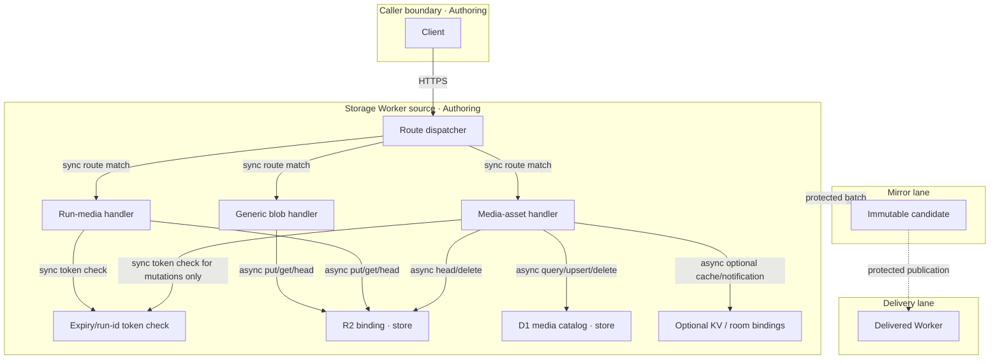

# Reference implementation: AgenticGraph Artifact and Media Storage Architecture

## Authority and readiness

This document owns only the implemented source contract for binary blob/media routes in the
AgenticGraph storage Worker. It does not make the storage Worker, bucket, endpoint, authentication
policy, provider ingest, or delivery surface production-ready.

The three route families are deliberately distinct:

- the generic blob route is workspace/path addressed, unauthenticated in the current handler, and
  overwriteable;
- the run media route is run/path addressed and checks an expiry/run-id token, but that token is
  currently only base64url JSON and is not a signed entitlement or a Durable Object lookup.
- the media-asset metadata route lists records for any caller-supplied workspace id without auth;
  its mutations use the same unsigned run token before D1/R2/KV/room operations.

Those gaps keep local readiness at `spec-complete`. Delivered readiness remains `undocumented`.

## Scope

In scope:

- R2 object-key construction and path validation;
- generic blob upload/read behavior;
- run-media upload/read behavior;
- media-asset list/persist/rename/delete behavior;
- current auth and overwrite semantics;
- replay URLs, metadata, limits, failures, VCCs, and delivery blockers.

Out of scope:

- model/provider generation and ephemeral URL download;
- payment entitlement;
- D1 document/sync schema;
- collaboration-room authorization;
- proof that any configured Worker or bucket is delivered.

## Invocation Register: Storage binary routes

| Route | Kind | Owner | Typed arguments | Trust boundary | Token cost |
|---|---|---|---|---|---|
| `/api/storage/blob/{workspaceId}/{canonicalPath}` | HTTP route | `cloudflare/workers/agenticgraph-storage/blob.ts` | path strings; body; content type; optional content hash; max bytes from environment | current handler has no authentication or entitlement check | 0 |
| `/api/storage/media/{namespace}/runs/{runId}/{stageId}/{shotId}.{ext}` | HTTP route | `cloudflare/workers/agenticgraph-storage/media.ts` | path strings; body; content type/hash; bearer or query token `{runId,expiresAt}` | run-id and expiry check only; token is not cryptographically verified | 0 |
| `/api/storage/media/assets` | HTTP route | `cloudflare/workers/agenticgraph-storage/mediaAssetSync.ts` | GET workspace/limit; POST typed artifact record; PATCH workspace/artifact/name; DELETE workspace/artifact | GET has no auth; mutations use the same unsigned run-id/expiry token | 0 |

This is the sole declaration site for these three route identities. Other documents may link to this
register but must not redefine their arguments or trust boundary.

## Topology: Binary storage v2 — 2026-07-30

| Node | Role | Type | Lane | Connects to | Connection | Data residency |
|---|---|---|---|---|---|---|
| Client | Producer/Consumer | browser/tool host | Authoring | Storage Worker | HTTPS | caller device |
| Storage Worker | Gateway | Worker source | Authoring | R2 binding | in-process binding call | configured Worker region |
| Generic blob handler | Router | function | Authoring | R2 binding | async put/get/head | request memory |
| Run-media handler | Router | function | Authoring | auth helper, R2 binding | sync token check + async put/get/head | request memory |
| Media-asset handler | Router | function | Authoring | auth helper, D1, R2, optional KV/room | sync token check for mutations + async binding calls | request memory |
| R2 bucket | Store | object store | Authoring until separately delivered | handlers | provider binding | configured bucket region |
| D1 media catalog | Store | relational records | Authoring until separately delivered | media-asset handler | provider binding | configured database region |
| Optional access/room stores | Store/Gateway | KV and room binding | Authoring until separately delivered | media-asset handler | provider binding/internal fetch | configured provider regions |
| Mirror artifact | Store | immutable release candidate | Mirror | Delivery | protected batch | mirror artifact store |
| Delivered Worker | Gateway | optional public runtime | Delivery | configured bucket | HTTPS + provider binding | declared delivery region |

**Version note**: v2.1 adds the previously omitted media-asset metadata route and records its
unauthenticated listing plus unsigned-token mutation boundary. v2 replaced the false claim that
binary routes use immutable, run-entitled objects verified against a RunManifest Durable Object.

## Data Flow: Generic blob

| Stage | Component | Input | Output | Persistence | Error handling |
|---|---|---|---|---|---|
| Ingest | route parser | workspace id + canonical path | normalized route | none | 400 on missing/traversal/control characters |
| Transform | key builder | normalized route | `workspaces/{encodedWorkspaceId}/{canonicalPath}` | none | fail before bucket access |
| Store | blob upload | body + metadata | R2 object/etag | overwriteable at same key | 400 size limit; 500 missing binding |
| Serve | blob read | same path | bytes/metadata | no-store response | 404 missing object |

`POST` writes with `bucket.put`. The optional content hash is metadata only: the current handler
does not compare it, deduplicate, reject overwrite, or make the object immutable.

## Data Flow: Run media

| Stage | Component | Input | Output | Persistence | Error handling |
|---|---|---|---|---|---|
| Ingest | route parser | namespace/run/stage/shot path | R2 key | none | 400 malformed key |
| Transform | media auth helper | bearer/query token + run id | allow/deny | none | 401 missing/invalid/expired; 403 run mismatch |
| Store | media write | bytes + optional hash metadata | R2 object/etag | overwriteable unless a higher owner forbids it | 500 missing binding |
| Serve | media read | authorized path | bytes/metadata | no-store response | 404 missing object |

The token payload is `{runId, expiresAt}` encoded as base64url JSON. It is not signed and is not
checked against D1, a Durable Object, a payment entitlement, or a session issuer. It must therefore
not be treated as delivery-grade authorization.

## Data Flow: Media-asset metadata

| Stage | Component | Input | Output | Persistence | Error handling |
|---|---|---|---|---|---|
| List | media-asset handler | GET workspace id + limit | artifact ids, object/public paths, run/stage/shot ids, hashes, provenance | D1 read | 400 missing workspace; no auth check |
| Persist | media-asset handler | typed record + unsigned run token | artifact record and binding statuses | D1; R2 must already contain object; optional KV/room | 401/403 token failure; 404 missing object; explicit optional-binding status |
| Rename | media-asset handler | workspace/artifact/name + unsigned run token | updated provenance | D1 | 401/403 token failure; 404 missing record |
| Delete | media-asset handler | workspace/artifact + unsigned run token | deletion status | D1 and R2 | 401/403 token failure; 404 missing record; missing binding surfaced |

GET accepts an arbitrary caller-supplied workspace id and returns metadata without authorization.
Mutations call the same run-id/expiry helper used by run-media; this does not make them
cryptographically authenticated.

## Interface contracts

| Interface | Input | Output | Invariants |
|---|---|---|---|
| Generic blob upload | POST body, workspace/path, optional hash, content type | JSON object key/path/etag/size | max-byte limit; normalized path; no auth claim |
| Generic blob read | GET/HEAD workspace/path | bytes or headers | same deterministic key; no-store |
| Run-media write | PUT/POST body, media path, token | JSON metadata | token expiry/run match before bucket access |
| Run-media read | GET/HEAD media path, token | bytes or headers | token expiry/run match before bucket access |
| Media-asset list | GET workspace id + limit | JSON artifact metadata | currently unauthenticated; no entitlement claim |
| Media-asset persist/rename/delete | typed JSON/query + token | JSON record/status | unsigned token check before mutation; D1/R2 and optional binding outcomes explicit |

## Component VCCs

| VCC | End state | Stated check | Constraint | Evidence Reference | Local rung | Delivered rung |
|---|---|---|---|---|---|---|
| VCC-M1 | generic blob positive/negative/key/limit/overwrite behavior is asserted | a future handler-level suite must exercise upload/read/head/overwrite; no invocable satisfying host exists | no auth or immutability claim added | none | `spec-complete` | `undocumented` |
| VCC-M2 | run-media route rejects missing/expired/mismatched token and accepts matching unexpired token | `node --test cloudflare/workers/agenticgraph-storage/__tests__/media.test.mjs` exits 0 | result is described as expiry/run-id validation, not entitlement | not recorded for this revision | `spec-complete` | `undocumented` |
| VCC-M3 | media-asset D1 records preserve workspace scope, version, content hash, and provenance | `node --test cloudflare/workers/agenticgraph-storage/__tests__/mediaArtifacts.test.mjs` exits 0 | database behavior alone does not prove HTTP-route auth | not recorded for this revision | `spec-complete` | `undocumented` |
| VCC-M4 | media-asset list and mutations match current D1/R2/KV/room and auth semantics | a future handler-level suite must exercise list/persist/rename/delete; no invocable satisfying host exists | GET remains documented unauthenticated; mutation token is not called signed auth | none | `spec-complete` | `undocumented` |
| VCC-M5 | delivery-grade media auth uses a signed/issuer-verified token or server-side workspace/run entitlement lookup | a future security suite must reject forged payloads and unauthorized workspace listing; no invocable satisfying host exists | zero unauthenticated metadata/byte reads or writes on a delivered route | none | `undocumented` | `undocumented` |
| VCC-M6 | delivery proof binds an exact Worker revision, stores, routes, auth policy, and rollback | protected live route/security check records exact result | no source test promotes delivered rung | not recorded | `spec-complete` | `undocumented` |

## Security and delivery blockers

- The generic blob route permits unauthenticated read and overwrite when the Worker is reachable.
- The run-media token is forgeable because no signature/issuer secret is verified.
- The media-asset GET route permits unauthenticated workspace metadata enumeration; its mutations
  rely on the same forgeable token.
- CORS permits `*`; this is not authorization.
- Content hashes are descriptive metadata, not integrity enforcement.
- Neither source presence nor local tests prove a private bucket or delivered route.
- A delivery plan must either harden these routes or keep them unreachable from untrusted callers.

## TCO comparison

| Model | Infra/month | 12-month estimate | Security/ops burden | Disposition |
|---|---:|---:|---|---|
| local fixture/file artifacts | $0 | $0 | low; operator custody | default authoring fallback |
| managed Worker + object store | $0–25 | $0–300 | medium; auth, retention, egress, rollback | optional after VCC-M3/M4 |
| FOSS self-hosted object service | $10–80 | $120–960 | high; patching/backups/auth | portability alternative |
| hybrid local + managed media | $0–35 | $0–420 | high boundary complexity | only with measured value |

All paths use zero LLM tokens for storage and replay.

## Lane and deploy boundaries

| Boundary | From lane | To lane | Evidence Reference | Operator instruction | Rollback statement/check | State |
|---|---|---|---|---|---|---|
| `STORAGE-SOURCE-TO-MIRROR` | Authoring | Mirror | security/unit candidate result `not recorded` | `none` | discard candidate; rerun VCC-M1–M5 checks | `closed` |
| `STORAGE-MIRROR-TO-DELIVERY` | Mirror | Delivery | exact live route/security result `not recorded` | `none` | restore prior Worker revision/config; rerun auth/read/write probes | `closed` |

The production Pages release does not deploy this Worker. Worker deployment requires a separate
operator instruction, evidence set, and rollback record.

## Reference implementation owners

- Dispatcher: `cloudflare/workers/agenticgraph-storage/index.ts`
- Generic blobs: `cloudflare/workers/agenticgraph-storage/blob.ts`
- Run media: `cloudflare/workers/agenticgraph-storage/media.ts`
- Media-asset catalog/sync: `cloudflare/workers/agenticgraph-storage/mediaAssetSync.ts`
- Media-asset D1 records: `cloudflare/workers/agenticgraph-storage/mediaArtifacts.ts`
- Current token check: `cloudflare/workers/agenticgraph-storage/mediaAuth.ts`
- Route constants/types: `cloudflare/workers/agenticgraph-storage/contract.ts`
- Tests: `cloudflare/workers/agenticgraph-storage/__tests__/mediaArtifacts.test.mjs` and
  `cloudflare/workers/agenticgraph-storage/__tests__/media.test.mjs`
- Wider storage contract: `docs/documents/agenticgraph-storage-sync-document.md`
