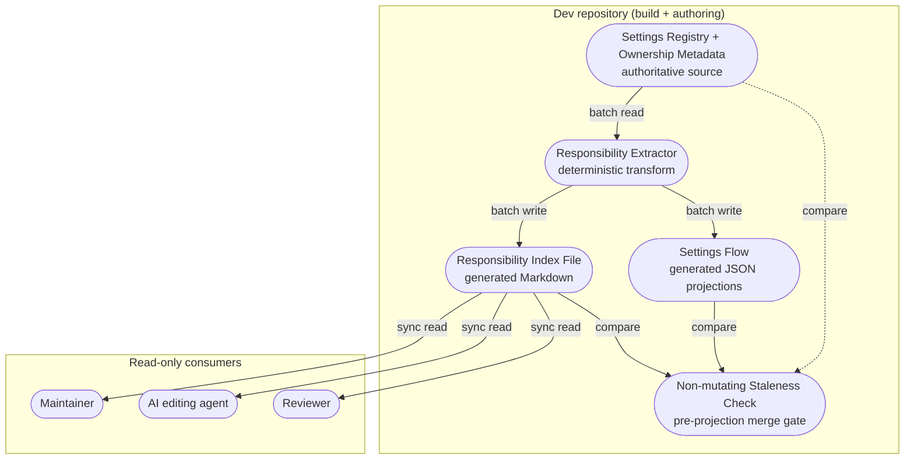

# Reference implementation: AgenticGraph Codebase Responsibility Flow PRD/TAD

## Executive Summary

The Codebase Responsibility Flow is a generated ownership index that maps every entry in the
agenticgraph canvas `settingsRegistry` to its source provenance. It does not claim coverage of
runtime flags or configuration outside that registry. Each row records a
concern **Area**, its **Responsibility**, the owning **Modules**, the **Functions/Methods** that
mutate it, the persisted **Key**, the backing mechanism (**Imports**), and the exact source
**Line Range**. The authoritative registry currently holds 593 unique settings, backed
predominantly by the Zustand store (405 rows) and browser `localStorage` (181 rows), with a small
number of build-time environment sources.

This document is the PRD/TAD for that artifact. It defines the artifact's user value (locate the
owner of any concern in one lookup), its generation and consumption contracts, and the
architecture that keeps it accurate. A compact Markdown index, bounded Markdown shards, and two
JSON projections are produced by deterministic local
extraction over the settings registry and code-owned metadata. Generation makes no model calls.
The artifact's agent-readiness value is as a **read-only ownership surface** that both the solo
developer and external AI agents consult before editing; an agent can still spend model tokens
when it ingests or reasons over that generated surface. Generated Markdown and JSON are outputs
only; the extractor never reads them back as ownership inputs.

The recommended tech-stack optimization keeps agenticgraph a **single browser-first, local-first SPA**
(JavaScript, TypeScript, Rust, WASM, WebGL, WebCPU, WebGPU) and adopts **Tailwind v4** as a
build-time styling backing. **HTMX is deferred** (Won't, this increment): its hypermedia model
requires a live server round-trip per interaction, which regresses offline-first and adds a second
runtime and deploy path — unnecessary complexity for a solo team with no present server-rendered
requirement. As Tailwind v4 lands, some appearance concerns move from `zustand`/`localStorage`
ownership to **Tailwind v4 CSS-first styling** (`@theme` tokens and utility classes); the
**Imports** column is the backing taxonomy that must attribute that owner so no concern becomes
owner-less or double-owned during the migration. This ties to the ownership and
overlap-elimination requirements in `.kiro/specs/tech-stack-optimization/requirements.md`. See
ADR-3 for the adopt-Tailwind / defer-HTMX decision and the trigger that would reopen it.

The Dev -> Prod -> Cloudflare rule holds: the index and this document are authored and validated
in `$GITHUB_ROOT/agenticgraph`. No deployment to the Prod mirror or Cloudflare occurs until the
repository owner explicitly instructs it.

## Directive Commitments

| Directive | Product rule | Technical rule |
|---|---|---|
| Source-owned | The index reflects the earliest shared owner of each concern, never a downstream copy. | Rows point at the registry/slice that owns the concern, with a verifiable line range. |
| Neutral | The index describes registered concerns using stable product taxonomy. | Area and Responsibility are deterministic taxonomy labels; Modules and Line Range are source provenance. Paths stay repo-relative. |
| Traceable | Every concern maps to exactly one owning module set and one persisted key. | `Area -> Key -> Modules -> Line Range` is a checkable chain. |
| TCO-zero | The index costs nothing to produce or host. | Deterministic static extraction; committed Markdown; zero egress; no paid backend. |
| Token-economical | Generating and reading the file locally requires no model service. | The deterministic generator makes no model calls; later agent ingestion is outside the generation budget and can consume model tokens. |
| Harness-first | Any future AI-assisted enrichment is typed, bounded, observable. | Enrichment, if added, runs behind a harness with a cost log and a fallback to the raw row. |
| Offline-first | The index is usable with no network. | Committed file in the repo; opens in any Markdown viewer offline. |

---

## PRD

## Feature: Codebase Responsibility Flow Index

### Problem Statement

In a large solo-maintained monorepo, a single user-facing behavior (for example "voxel mode" or
"graph hover preview") is spread across a settings registry entry, a Zustand store action, a
store-type definition, and a persisted storage key. Locating every owner of one concern by manual
search is slow, error-prone, and does not scale as concern count grows. The pain compounds for AI
agents, which otherwise scrape source or guess owners before making an edit. The opportunity is a
single lookup that resolves any concern to its complete ownership chain and exact line ranges.

### Personas

- **Solo maintainer** — edits a behavior and must find every source location that owns it before
  changing it, without introducing a second owner.
- **AI editing agent** — needs a machine-readable ownership map to target the correct module and
  avoid creating duplicate or orphaned implementations.
- **Reviewer / auditor** — verifies that a change touched the registered owner and did not leave a
  concern owner-less or double-owned.

### User Journey Stage

Addresses the **Engage** stage of the maintainer/agent journey: from "I know the behavior name" to
"I know exactly which source owns it" before any edit begins.

### Journey: Solo Maintainer — Locate the owner of a concern

| Stage    | Action                                   | Touchpoint                         | Pain Point                          | Opportunity                              |
|----------|------------------------------------------|------------------------------------|-------------------------------------|------------------------------------------|
| Trigger  | Decides to change a named behavior       | Editor / task intent               | Owner location unknown              | Named-concern lookup                     |
| Discover | Searches the responsibility index by Area or Key | `docs/agenticgraph-codebase-responsibility-flow.md` | Manual grep returns scattered hits  | One row resolves the full ownership chain |
| Engage   | Opens the listed modules at the line range | Source files                       | Guessing which file is the owner    | Deterministic module + line range        |
| Complete | Edits the single owner; no duplicate created | Source files                       | Risk of a second owner / drift      | Verifiable single-owner edit             |
| Return   | Regenerates the index after the change   | Extraction command                 | Stale index after refactors         | Idempotent regeneration on demand        |

### User Stories

**As a** solo maintainer **I want** to resolve a named concern to its owning modules, action, key,
and line range in one lookup **So that** I edit the correct owner without hunting across files.

**As an** AI editing agent **I want** a machine-readable ownership map **So that** I target the
registered owner and never create a duplicate or orphaned implementation.

**As a** reviewer **I want** to confirm a concern has exactly one owner **So that** I can reject
changes that leave a concern owner-less or double-owned.

### Acceptance Criteria

**PRD-CODE-01 — Given** a setting registered in `settingsRegistry`, **When** the index is generated, **Then** the index
contains exactly one row for that setting with a non-empty Area, Key, owning Modules, and Line
Range.

> **VCC-CODE-01**: `Verify the generated index contains exactly one row per settingsRegistry entry and no row has an empty Area, Key, Modules, or Line Range column`

**PRD-CODE-02 — Given** a persisted concern key, **When** a reader looks it up by Key, **Then** the row resolves
to the owning module paths and the source line range where the key is defined.

> **VCC-CODE-02**: `Verify every Key column value maps to at least one module path and one file:line reference, and each referenced file:line exists in the source tree`

**PRD-CODE-03 — Given** the source tree is unchanged, **When** the index is regenerated twice, **Then** the two
outputs are byte-identical.

> **VCC-CODE-03**: `Verify two consecutive generations over an unchanged tree produce byte-identical output (diff is empty)`

**PRD-CODE-04 — Given** any committed Markdown or JSON projection is stale, **When** CI invokes `--check`,
**Then** it exits non-zero before a generating build runs and leaves every projection unchanged.

> **VCC-CODE-04**: `Verify --check compares the exact owned artifact set, performs zero writes, and precedes every CI build step that can generate a projection`

**PRD-CODE-05 — Given** a concern that has been removed from source, **When** the index is regenerated, **Then**
the removed concern's row is absent.

> **VCC-CODE-05**: `Verify no index row references a file:line or Key that no longer exists in source`

**PRD-CODE-06 — Given** the index in a Markdown viewer, **When** a reader with no network access opens it,
**Then** the full table renders from the local file with zero network requests.

> **VCC-CODE-06**: `Verify the index file opens and renders offline with zero network requests`

**PRD-CODE-07 — Given** the Settings UI cannot import its generated responsibility projection, **When** the
view opens, **Then** settings remain editable, an unavailable status is visible, and Retry starts
a fresh import instead of reusing the rejected promise.

> **VCC-CODE-07**: `Verify a failed projection import returns an observable unavailable result and a later retry can recover`

**PRD-CODE-08 — Given** the backing taxonomy, **When** styling ownership is extracted, **Then**
`tailwindcss` is recognized and `htmx` remains absent in this increment.

> **VCC-CODE-08**: `Verify the typed backing taxonomy accepts tailwindcss and contains no htmx backing`

### Success Metrics

| Metric | Baseline | Target | Timeline |
|--------|----------|--------|----------|
| Concern rows indexed | 593 unique registry settings | 100% of `settingsRegistry` entries | Each regeneration |
| Markdown shard size | 597 lines in one table | ≤ 200 data rows and ≤ 600 lines per committed Markdown file | Each regeneration |
| Owner-lookup steps (name → owning file:line) | ~5 manual greps | ≤ 1 lookup | v1.0.0 |
| Time-to-value (TTV steps) | — | ≤ 2 steps (open file → find row) | v1.0.0 |
| Time-to-value (TTV elapsed) | — | ≤ 1 min on a clean checkout | v1.0.0 |
| Generator model-token cost / month | — | $0.00 (no model call in local generation) | Continuous |
| Monthly TCO | — | $0.00 (committed file; zero egress) | Continuous |
| ROI Score | — | High (impact × reach / build hours; zero TCO/token denominator) | v1.0.0 |

### MoSCoW Priority

- **Must** — deterministic extraction of Area/Responsibility/Modules/Functions/Key/Imports/Line
  Range; one row per concern; byte-identical regeneration. High ROI: eliminates repeated manual
  owner-hunting at zero recurring cost.
- **Must** — a non-mutating `--check` mode that fails when any committed projection is stale and
  runs in CI before any build step that can generate a projection.
- **Could** — grouped views (by backing mechanism, by Area) rendered from the same rows.
- **Won't (this increment)** — an LLM-summarized or natural-language query layer over the index;
  any hosted service; write-back from the index into source.

### Min-Viable Scope

The committed Markdown index and bounded shards with one row per `settingsRegistry` entry, each
carrying a non-empty Area, Key, owning Modules, and Line Range, produced by a deterministic
extractor and regenerable byte-identically. Excludes all Could/Won't items.

### Out of Scope

- Any AI/LLM generation of ownership rows or natural-language retrieval layer over the index.
- Runtime flags, storage keys, and configuration that are not declared by `settingsRegistry`.
- Mutating source from the index (the index is read-only intelligence).
- Deployment of the index or this document to the Prod mirror or Cloudflare (guardrailed until the
  repository owner instructs it).

### Dependencies

- The settings registry and code-owned ownership metadata across `canvas/src/` as the concern
  sources.
- The existing repo extraction/doc tooling and the `node --test` harness for the staleness check.

### Open Questions

- Should build-time env-sourced concerns (`window.__ENV__`, `import.meta.env`) be split into a
  separate section from `zustand`/`localStorage`-backed concerns?
- When appearance concerns move to Tailwind v4 `@theme`/utility classes, should those CSS-owned
  concerns be indexed in the same registry-driven table, or tracked in a sibling projection keyed
  by token rather than by `settingsRegistry` key?
- If the deferred HTMX decision is reopened for a server-rendered content shell, does its
  hx-attribute ownership belong in this app-scoped index at all, or in a separate shell-scoped
  index?

---

## TAD

## Architecture: Codebase Responsibility Flow Index

### Overview

**From source tree to ownership projections**: a deterministic extractor scans the settings
registry and deterministic taxonomy → resolves source-literal provenance → normalizes each
setting into a fixed-column row → emits a compact Markdown index, bounded Markdown shards, and
two JSON projections consumed read-only by the maintainer, Settings UI, AI agents,
and reviewers. No model call participates in local generation. Agent ingestion is a separate
consumer activity and can consume model tokens.

### Journey → System Mapping

| Journey Stage | Workflow | Data Flow | Orchestration/Harness Flow | Topology Node(s) | Component |
|---------------|----------|-----------|----------------------------|------------------|-----------|
| Discover | Look up concern by Area/Key | Read committed Markdown | None in generation; an agent reader may use its own model context | Responsibility Index (Projection) | Index File |
| Engage | Open owning modules at line range | Row → file:line resolution | None | Source Tree (Store) | Extractor mapping |
| Complete | Edit single owner | — | None | Source Tree | Source owner module |
| Return | Regenerate index | source → extract → emit | None | Extractor (Function) | Responsibility Extractor |

### Topology

**Version**: 1 — 2026-07-24
**Boundaries**: Dev repository build/authoring environment (browser-first runtime is a consumer,
not a producer, of the index).

| Node | Role | Type | Connects to | Connection type | Data residency |
|------|------|------|-------------|-----------------|----------------|
| Settings Registry + Ownership Metadata | Producer (authoritative concern source) | Source modules | Responsibility Extractor | Batch (file read) | Local (Dev repo) |
| Responsibility Extractor | Router / transform | Build-time function/script | Generated Markdown + JSON projections | Batch (file write) | Local (Dev repo) |
| Responsibility Index File | Generated projection | Committed Markdown | Maintainer, AI agent, Reviewer, Staleness Check | Sync (file read) | Local (Dev repo) |
| Settings Flow JSON | Generated projections | Committed JSON | Settings UI, Staleness Check | Sync (file read) | Local (Dev repo) |
| Staleness Check (`--check`) | Non-mutating consumer / gate | CI step | All projections, authoritative source | Batch | Local (Dev repo) |
| Maintainer / AI agent / Reviewer | Consumer | Human / agent | Responsibility Index File | Sync (read) | Local |

### Orchestration/Harness Flows

No AI-powered pipeline exists in the generation path. The extractor is a deterministic static
transform, so its model budget is **0 prompt + 0 completion = $0.00 per local generation**.
Opening or grepping the file locally also requires no model service. An AI agent that ingests the
file uses its own context and can consume model tokens; that consumer cost is not attributed to
generation. If a future increment adds optional LLM enrichment, it must run behind a harness with
typed input/output schemas, a per-call cost log, and a fallback that returns the raw deterministic
row unchanged.

### Component Specifications

**Component**: `TAD-CODE-EXTRACTOR` — Responsibility Extractor
**Responsibility**: Scan concern sources and emit one normalized row per concern.
**Interfaces**: `TAD-CODE-EXTRACTOR-GENERATE` and `TAD-CODE-EXTRACTOR-CHECK` — CLI/script entry
with generate and `--check` modes; input = authoritative source tree; outputs =
`docs/agenticgraph-codebase-responsibility-flow.md`, bounded parts under
`docs/agenticgraph-codebase-responsibility-flow/`,
`canvas/public/settings-flow.json`, and
`canvas/src/features/settings/settings-flow.schema.json`. Generate writes the exact owned set and
removes obsolete numbered parts; `--check` compares every expected artifact in memory, detects
unexpected numbered parts, performs no writes, and exits non-zero when any projection is stale.
**Dependencies**: Settings registry modules, code-owned metadata and source anchors, repo
extraction tooling.
**Configuration**: Column set (Area, Responsibility, Modules, Classes/Objects, Functions/Methods,
Key, Imports, Notes, Line Range); source globs. The **Imports** backing taxonomy currently
recognizes `zustand`, `localStorage`, `window.__ENV__`, `import.meta.env`, and `eslint`; it is
extended with `tailwindcss` (Tailwind v4 `@theme` tokens / utility classes) as styling concerns
migrate onto that owner. An `htmx` backing is **not** added in this increment; it would be
introduced only if the deferred HTMX decision is reopened (see ADR-3).
**FOSS / Vendor**: FOSS (Node + repo tooling); no proprietary dependency.
**VCC Conditions**:
- `VCC-CODE-01`, `VCC-CODE-05`: verify generation emits exactly the current registry rows, omits removed concerns, and has no empty required column.
- `VCC-CODE-03`: verify two generations over an unchanged tree are byte-identical.
- `VCC-CODE-04`: verify `--check` is non-mutating and detects every stale or obsolete owned projection.
- `VCC-CODE-08`: verify `tailwindcss` is an accepted backing and `htmx` is absent.

**Component**: `TAD-CODE-INDEX` — Responsibility Index File (`docs/agenticgraph-codebase-responsibility-flow.md`)
**Responsibility**: Serve as the read-only Markdown projection of setting → owner → key → line
range. The source registry and code-owned metadata remain authoritative.
**Interfaces**: `TAD-CODE-INDEX-LOOKUP` — compact Markdown index linking to deterministic 200-row shards; rows are
addressable by Area and by Key.
**Dependencies**: Output of the Responsibility Extractor.
**Configuration**: None at read time.
**FOSS / Vendor**: FOSS format (Markdown); zero-egress local file.
**VCC Conditions**:
- `VCC-CODE-02`: verify every Key maps to a module path and an existing file:line.
- `VCC-CODE-MAINTAINABILITY`: verify every Markdown artifact stays at or below 600 lines.
- `VCC-CODE-06`: verify the file renders offline with zero network requests.

**Component**: `TAD-CODE-LOADER` — Settings Flow Runtime Loader
**Responsibility**: Load the generated JSON projection without blocking setting reads or writes.
**Interfaces**: `TAD-CODE-LOADER-LOAD` — typed `ready | unavailable` result; successful imports are cached; rejected or
malformed imports clear the cache so the visible Retry action can start a new attempt.
**Dependencies**: Bundled `settings-flow.schema.json` projection.
**Configuration**: None.
**FOSS / Vendor**: Browser runtime only; no network service.
**VCC Conditions**:
- `VCC-CODE-07`: verify concurrent success shares one import and rejected imports remain observable and retryable.

**Component**: `TAD-CODE-GATE` — Staleness Check
**Responsibility**: Fail the merge gate when any committed projection no longer matches source,
without changing the worktree.
**Interfaces**: `TAD-CODE-GATE-CHECK` — CI invokes the extractor `--check` mode before any build step that can regenerate
or otherwise mutate an output.
**Dependencies**: Responsibility Extractor, all committed projections, authoritative source
tree.
**Configuration**: Bounded, terminating scan scope.
**FOSS / Vendor**: FOSS.
**VCC Conditions**:
- `VCC-CODE-04`, `VCC-CODE-05`: verify the check terminates, preserves hashes, and rejects stale or obsolete projections.

### Integration Contracts

**Interface**: Responsibility row | **Protocol**: file (Markdown table row) | **Format**:
`Area | Responsibility | Modules | Classes/Objects | Functions/Methods | Key | Imports | Notes | Line Range` |
**Errors**: missing required column ⇒ generation defect surfaced by the staleness check; dangling
`file:line` ⇒ reported as a stale-reference failure.

### Architectural Decisions

See ADR-1, ADR-2, and ADR-3.

## ADR-1: Deterministic static extraction, no LLM in the generation path

**Status**: Accepted
**Date**: 2026-07-24

### Context
The index must be trustworthy, cheap, and reproducible. An LLM-summarized index would be
non-deterministic, incur token cost, and risk hallucinated owners or line ranges.

### Decision
Generate the Markdown index and shards plus two JSON projections by deterministic static
extraction over the settings registry, taxonomy, and source provenance. No model call participates
in generation. Agent consumers may independently
spend tokens when they ingest the projections.

### Alternatives Considered
1. LLM-generated/summarized index: Pros — richer prose; Cons — non-deterministic, token cost,
   hallucination risk, cannot be byte-diff verified.
2. FOSS static extraction (chosen): Pros — deterministic, $0 token, diff-verifiable; Cons — prose
   is terse, structure-only.

### Rationale
Determinism and zero cost are prerequisites for using the index as a merge-gate reference. Static
extraction satisfies both; LLM enrichment fails the byte-identical regeneration criterion.

### TCO Impact

| Dimension | Chosen Option (static extraction, self-managed build step) | FOSS Alternative (LLM enrichment, managed/serverless model API) | Delta / 12 months |
|---|---|---|---|
| Infra cost | $0/mo (runs in existing build) | $0/mo idle (serverless) | $0 |
| Egress cost | $0/mo (local file) | metered per call | + metered |
| Generator token cost | $0/mo | prompt + completion per generation | + token spend |
| Ops burden | Low (one build step) | Low-Med (API keys, rate limits, retries) | — |
| Vendor risk | Low (FOSS) | Med (model provider) | — |

### Consequences
- **Positive**: reproducible, free, gate-usable, offline.
- **Negative**: descriptions are structural, not narrative.
- **Neutral**: enrichment remains possible later behind a harness with a raw-row fallback.

## ADR-2: Commit the index as a local Markdown file rather than a hosted/queryable service

**Status**: Accepted
**Date**: 2026-07-24

### Context
Consumers (maintainer, agents, reviewers) need the ownership map available instantly, offline, and
at zero cost, consistent with browser-first/local-first/offline-first and TCO-zero constraints.

### Decision
Persist the index as a committed Markdown file in `docs/`; consume it by direct file read.

### Alternatives Considered
1. Hosted query API (managed/serverless): Pros — programmatic queries; Cons — egress + availability
   cost, network dependency, breaks offline-first.
2. Provisioned/self-managed index service: Pros — richer queries at sustained load; Cons — fixed
   idle cost, patching/backup/failover ops burden, still network-dependent.
3. Hybrid/consolidated (index served by an existing dev server): Pros — amortizes an already-running
   runtime; Cons — still couples reads to a running process; unnecessary for a static table.
4. Committed Markdown file (chosen): Pros — $0, offline, diff-reviewable; Cons — no server-side query.

### Rationale
A committed file satisfies offline-first and TCO-zero with no server; grouped/queryable views can
be regenerated from the same rows without introducing a runtime dependency.

### TCO Impact

| Dimension | Committed file (local) | Managed/Serverless API | Provisioned/Self-Managed service | Hybrid/Consolidated (shared dev server) |
|---|---|---|---|---|
| Infra cost | $0/mo | $0 idle, per-request at load | fixed $/mo regardless of use | shared fixed $/mo divided across workloads |
| Egress cost | $0/mo | metered | metered | metered |
| Ops burden | Low | Low (provider-managed) | High (patch/backup/failover) | Med (one shared runtime) |
| Vendor risk | Low | Med | Low | Low |

### Consequences
- **Positive**: zero cost, offline, reviewable in normal diffs.
- **Negative**: no live server-side querying; readers grep or filter locally.
- **Neutral**: consolidation onto an existing dev server remains an option if live queries are ever
  justified by an ADR.

## ADR-3: Adopt Tailwind v4 as a styling backing; defer HTMX to keep a single-stack SPA

**Status**: Accepted
**Date**: 2026-07-26

### Context
The recommended tech-stack optimization lists HTMX and Tailwind v4 alongside the browser-first SPA
stack. HTMX is a hypermedia model: interactions fetch server-rendered HTML fragments, which makes a
live server round-trip the interaction primitive. agenticgraph is offline-first, local-first,
zero-infra, and mobile-first, with client-owned state (Zustand) and client compute
(WebGL/WebGPU/WASM). Adopting HTMX for the app would break offline operation and add a second
runtime, mental model, and deploy/verify path — ongoing tax for a solo team with no present
server-rendered requirement. Tailwind v4, by contrast, is build-time CSS with no runtime server and
no offline penalty. The index must still resolve exactly one owner per concern as styling migrates.

### Decision
- **Adopt Tailwind v4** as a build-time styling backing and add `tailwindcss` to the **Imports**
  taxonomy so `@theme`-token and utility-class ownership is attributable. Extraction stays a
  deterministic static scan; generation remains zero-token.
- **Defer HTMX** (Won't, this increment). Do not add it to the app or to the `Imports` taxonomy.
  Public/marketing/docs pages that want fast first paint and SEO are served by **static
  prerendering** on Cloudflare, not a live hypermedia server.
- **Reopen trigger**: revisit HTMX only if a concrete need for per-request, crawlable,
  server-rendered content appears (for example an auth-gated dynamic content shell). If reopened,
  scope it to a separate shell — never the offline app — and track its ownership in a shell-scoped
  index (see Open Questions).

### Alternatives Considered
1. Adopt both HTMX and Tailwind now: Pros — matches the raw stack list; Cons — two runtimes, breaks
   offline-first, premature for a solo team, no present requirement — overcomplication.
2. Adopt neither: Pros — zero change; Cons — forgoes Tailwind v4's low-cost styling and CSS-first
   token ownership that the migration wants.
3. Adopt Tailwind, defer HTMX behind a trigger (chosen): Pros — one stack, offline-first preserved,
   min-viable, still gains CSS-first styling ownership; Cons — the deferred option must be
   documented so it is a deliberate, reversible decision rather than an omission.

### Rationale
Min-viable-max-value: Tailwind v4 is a pure win (build-time, FOSS, offline-safe), while HTMX's only
payoff — server-rendered HTML — is not needed today and is achievable for public pages via static
prerendering at zero idle cost. Keeping one stack maximizes time-to-value and keeps the ownership
model (TypeScript orchestration, Rust/WASM compute, capability-based render/compute tiers) intact.

### TCO Impact

*Tailwind v4 is a FOSS, build-time library; its TCO is bundle-size and build cost, not egress or
per-request spend. HTMX's cost is the second runtime and per-interaction server round-trip it
introduces.*

| Dimension | Adopt Tailwind, defer HTMX (chosen) | Adopt both now | Adopt neither |
|---|---|---|---|
| Generator token cost | $0/mo (static scan) | $0/mo | $0/mo |
| Infra / egress cost | $0/mo (committed file; static-prerendered public pages) | + per-interaction server round-trips | $0/mo |
| Offline-first | Preserved | Broken by hypermedia interactions | Preserved |
| Ops burden | Low (one stack, one taxonomy) | High (second runtime + deploy/verify path) | Low |
| Vendor risk | Low (FOSS, no lock-in) | Low (FOSS) but higher coupling | Low |

### Consequences
- **Positive**: one stack; offline-first preserved; Tailwind-owned styling gets a correct single
  owner in the index at $0; time-to-value maximized for a solo team.
- **Negative**: the `Imports` set gains `tailwindcss`; scanners must recognize CSS-token/utility
  ownership.
- **Neutral**: HTMX remains a documented, reversible option gated behind an explicit reopen
  trigger; if adopted later it is shell-scoped and separately indexed.

### Quality Attributes

| Attribute | Scenario | Pattern | Validation |
|-----------|----------|---------|------------|
| Performance | 593 registered rows must open and be searchable on a mobile viewport | Compact static index plus bounded 200-row Markdown shards | Open on a 320px viewport; follow a local shard and find a row |
| Reproducibility | Same source must yield the same index | Deterministic extraction, stable ordering | Byte-identical diff across two generations |
| Traceability | Every concern resolves to an existing owner and line | Fixed-column contract; `file:line` references | Staleness check verifies references exist |
| Observability | Drift between source and any projection is detectable | Non-mutating `--check` mode runs before generating CI steps | Non-zero exit on stale output; output hashes unchanged |
| Token Cost | Local generation must not call a model | No LLM in generation | Generator model cost is zero; agent-consumer tokens are tracked separately |
| TCO | 12-month spend must stay at zero for offline-first use | FOSS extraction + committed file + zero egress | Monthly cost audit; ADR review |

### Deployment Strategy

Authoring and validation occur in the Dev repository under protected review. The projections are
regenerated on demand and committed; the non-mutating staleness check guards drift before any
generating build can mask it. Rollback is a normal file revert. Publishing to the Prod mirror or
deploying to Cloudflare requires separate owner authority.

| Lane | Function and residency | Mutation rights |
|---|---|---|
| Authoring | Dev repository; source, tests, and projections are local. | Full local authoring rights. |
| Mirror | Prod mirror; faithful copy of one approved authoring revision. | Publish-only from an approved authoring state. |
| Delivery | Cloudflare public surface. | Publish-only from an approved mirror state. |

### Deploy Boundary Register

| Boundary | From lane | To lane | Evidence Reference | Operator instruction | Rollback statement/check | State |
|---|---|---|---|---|---|---|
| `DB-CODE-AUTHORING-MIRROR` | Authoring | Mirror | `none recorded` | `none` | Restore the mirror checkout to its recorded prior revision; verify a clean checkout and `HEAD` equal that revision. | `closed` |
| `DB-CODE-MIRROR-DELIVERY` | Mirror | Delivery | `none recorded` | `none` | Redeploy the recorded prior Cloudflare Pages version; run `docs/agenticgraph-post-deploy-verification-checklist.md`. | `closed` |

### Architecture Diagrams

See the Topology `flowchart TB` above; the generation path is
`Source → Extractor → Markdown + JSON Projections → Consumers`, with `--check` comparing every
projection before a generating build.

### Component Inventory

| Layer | Component | File / Module | Local rung | Delivered rung |
|-------|-----------|---------------|---|---|
| Source | Settings Registry + Ownership Metadata | code-owned settings and provenance under `canvas/src/` | `spec-complete` | `undocumented` |
| Generation | Responsibility Extractor | repo extraction tooling (generate / `--check`) | `spec-complete` | `undocumented` |
| Styling Build | Tailwind v4 Vite plugin + CSS-first theme/source directives | `canvas/vite.config.ts`, `canvas/src/index.css` | `spec-complete` | `undocumented` |
| Backing Taxonomy | Typed source and styling backing metadata | `canvas/src/features/settings/types.ts`, `registry-ui.ui.ts` | `spec-complete` | `undocumented` |
| Artifacts | Responsibility Flow Projections | Markdown plus two JSON output paths defined above | `spec-complete` | `undocumented` |
| Runtime | Settings Flow Loader | `canvas/src/features/settings/flowDetailsRuntime.ts` | `spec-complete` | `undocumented` |
| Gate | Staleness Check | pre-projection CI step invoking `--check` | `spec-complete` | `undocumented` |
| Docs | This PRD/TAD | `docs/documents/agenticgraph-codebase-responsibility-flow-prd-tad.md` | `spec-complete` | `undocumented` |

---

## PRD ↔ TAD Traceability

| Requirement | TAD component | Interface | VCC |
|---|---|---|---|
| `PRD-CODE-01` | `TAD-CODE-EXTRACTOR` | `TAD-CODE-EXTRACTOR-GENERATE` | `VCC-CODE-01` |
| `PRD-CODE-02` | `TAD-CODE-INDEX` | `TAD-CODE-INDEX-LOOKUP` | `VCC-CODE-02` |
| `PRD-CODE-03` | `TAD-CODE-EXTRACTOR` | `TAD-CODE-EXTRACTOR-GENERATE` | `VCC-CODE-03` |
| `PRD-CODE-04` | `TAD-CODE-GATE` | `TAD-CODE-GATE-CHECK` | `VCC-CODE-04` |
| `PRD-CODE-05` | `TAD-CODE-EXTRACTOR` + `TAD-CODE-GATE` | `TAD-CODE-EXTRACTOR-GENERATE` + `TAD-CODE-GATE-CHECK` | `VCC-CODE-05` |
| `PRD-CODE-06` | `TAD-CODE-INDEX` | `TAD-CODE-INDEX-LOOKUP` | `VCC-CODE-06` |
| `PRD-CODE-07` | `TAD-CODE-LOADER` | `TAD-CODE-LOADER-LOAD` | `VCC-CODE-07` |
| `PRD-CODE-08` | `TAD-CODE-EXTRACTOR` | `TAD-CODE-EXTRACTOR-GENERATE` | `VCC-CODE-08` |

## Time-to-Value: Codebase Responsibility Flow Index

| Dimension | Estimate | Target ceiling | Validation method |
|-----------|----------|----------------|-------------------|
| TTV steps | 2 (open file → locate row) | ≤ 2 steps | Walk-through on clean checkout |
| TTV elapsed time | ~30 s | ≤ 1 min | Timed first lookup on clean checkout |
| First-value action | Resolve a named concern to its owning file:line | — | Row observed with Modules + Line Range |
| Persona | Solo maintainer / AI editing agent | — | Defined in PRD Personas |
