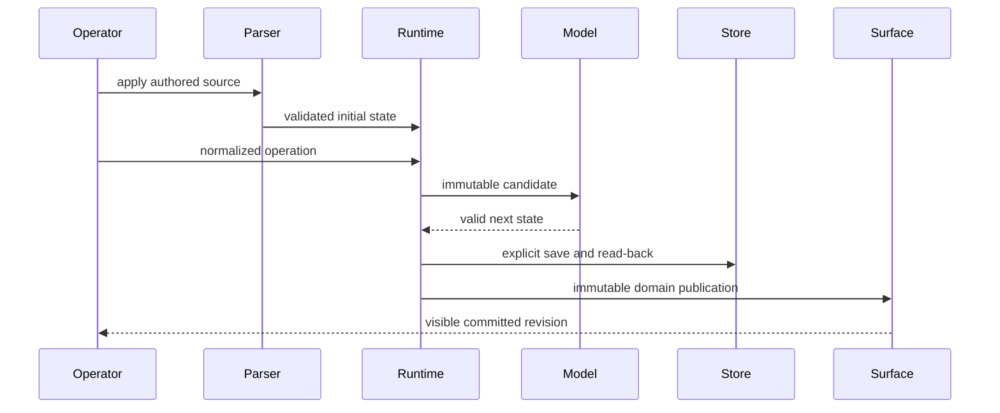
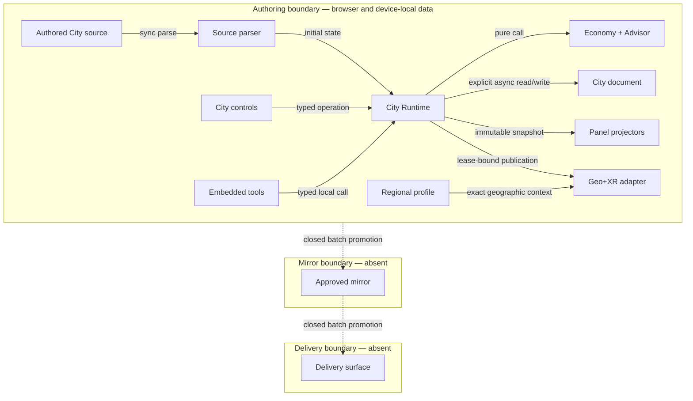

# Reference implementation: AgenticGraph City-Building Simulation PRD/TAD/ADR

## 1. Authority and contract boundaries

This document owns the locale-agnostic City simulation product contract: POI-keyed parcel state,
selection, zoning, deterministic ticks, economy, bounded advice, persistence,
City Builder interactions, and read-only projections into existing panels. The
normative requirements file owns detailed acceptance criteria. The evidence
companion owns VCC results, traceability, readiness gaps, and deploy boundaries.

The City simulation consumes, but does not redefine, the Geo+XR composition
contract. It selects one companion-owned regional-context profile and
publishes domain-state snapshots through the composed-surface
ports. It owns no geographic renderer, provider, camera, viewport gesture,
regional profile, or spatial-engine lifecycle. Regional identity, exact
geographic rings, real-metre heights, accuracy, provenance, framing inputs,
and landmark facts remain solely with the regional-profile companion.

The source document is the only initialization authority. Missing or malformed
authored state fails closed. No path alias, legacy identity remap, hardcoded
fixture, compatibility initializer, or downstream repair may substitute for
the source.

## 2. PRD problem, hypothesis, and outcome

Abstract graph operations are difficult to demonstrate as a visible causal
loop. A compact civic simulation makes a decision observable:

1. select a regional POI parcel;
2. assign a zone or request advice;
3. advance one deterministic tick;
4. observe population, land value, pollution, and treasury;
5. save and read back the exact state.

**Hypothesis:** a browser-local, source-backed simulation with a short,
deterministic loop makes state ownership and cause-and-effect easier to review
than a remote, model-driven, or visually separate game.

**Outcome:** a solo operator reaches a committed tick within two minutes,
replays it byte-identically, inspects the same revision through every City
projection, and exits without leaving a second state owner.

## 3. Personas and user journey

| Persona | Job to be done | Risk |
|---|---|---|
| Solo builder or presenter | Demonstrate an understandable local decision loop | Setup, network, or model cost obscures the feature |
| Reviewer | Trace one source to one runtime and one saved document | Preselected or duplicated state masquerades as proof |
| Accessibility and mobile operator | Use the same controls by pointer, keyboard, or touch | Visual-only or desktop-only interaction |

| Stage | Action | Touchpoint | Friction | Opportunity |
|---|---|---|---|---|
| Trigger | Apply an authored City source | Source Files | Stale state may prelaunch a demo | Admit one exact source identity |
| Discover | Inspect current metrics and POI zoning | City Builder | No POI may be selected yet | Explain the next valid action |
| Engage | Select, zone, advise, start, or stop | City Builder and geographic surface | Inputs can fork if each surface owns state | Normalize all inputs to one dispatcher |
| Complete | Observe and save a committed tick | Metrics and workspace document | A UI success can precede durable bytes | Read back and compare bytes plus semantics |
| Return | Switch panels or exit | Shared surface lifecycle | Hidden state may survive | Project one revision and restore exactly once |

## 4. PRD stories, criteria, and VCC translations

| ID | Story | Given / When / Then | VCC translation |
|---|---|---|---|
| `PRD-CITY-01` | As an operator, I want source activation to initialize one City so that stale state cannot choose the demo. | Given bootstrap-ready Source Files, when the authored source is applied, then one validated POI-zoning state and one regional-profile identity initialize the runtime. | Verify every parcel id exactly equals one identity in the selected profile, coverage is one-to-one, and malformed or incomplete input leaves City closed. |
| `PRD-CITY-02` | As an operator, I want deterministic lifecycle controls so that equal inputs replay equally. | Given equal admitted state and input frames, when Start advances ticks and Stop fences them, then serialized states are byte-identical. | Verify lifecycle/model cases exit 0 with equal state digests and no clock, random, network, or model input. |
| `PRD-CITY-03` | As a planner, I want parcel zoning and advice so that I can compare bounded proposals before committing. | Given a selected parcel or district, when advice runs, then at most two deterministic rounds return a proposal without mutating a zone. | Verify bounded rounds, clarify behavior, tie break, zero-token cost record, and no zone mutation. |
| `PRD-CITY-04` | As a reviewer, I want one canonical save so that runtime success is distinguishable from persistence. | Given valid state, when Save runs, then one canonical document is written, read back, byte-compared, parsed, and semantically compared. | Verify canonical path, stable ordering, malformed-byte preservation, and exact read-back. |
| `PRD-CITY-05` | As a multimodal operator, I want input parity so that pointer, keyboard, touch, and POI controls select the same parcel. | Given equivalent inputs, when selection or zoning is requested, then all paths dispatch one normalized POI identity and invalid input changes no revision. | Verify equivalent snapshots, exact profile membership, and typed rejection with unchanged state. |
| `PRD-CITY-06` | As a reviewer, I want one composed presentation so that City never creates a parallel world. | Given active Geo+XR, when City presents zoning, then it projects state directly onto companion-owned POI surfaces through the semantic media and lease contracts without taking host or geometry ownership. | Verify City authors no anchor, dimensions, gaps, bearing, height, route, or aircraft; the existing Flight overlay remains independent; and exit fully cleans up. |
| `PRD-CITY-07` | As an agent host, I want local inspect and explicit control surfaces so that read and mutation trust boundaries remain distinct. | Given the embedded catalog, when inspect or approved control is called, then both delegate to the same dispatcher and add no remote or delivery authority. | Verify exactly two catalogued local tools, one dispatcher, and zero remote surfaces. |
| `PRD-CITY-08` | As a mobile/offline operator, I want the core loop to remain usable so that loss of connectivity does not block first value. | Given a local source at 375 by 812, when I select, zone, tick, save, and exit, then the loop remains reachable with zero required network or model calls. | Verify responsive controls, no page overflow, local persistence, and zero paid calls. |

## 5. Scope, priority, economics, and time-to-value

| Capability | Tier | Impact | Sessions/month | Build hours | Monthly cash/token cost | ROI score | Rationale |
|---|---|---:|---:|---:|---:|---:|---|
| Deterministic POI zoning, lifecycle, and save | Must | 4 | 12 | 40 | $0 | 1.20 | Smallest complete observable loop |
| Local Advisor and shared projections | Must | 3 | 12 | 30 | $0 | 1.20 | Explains state without a model |
| Input and device parity | Should | 3 | 8 | 24 | $0 | 1.00 | Preserves reach without another state path |
| Model narration | Won't | 2 | 4 | 24 | $5 | 0.28 | Breaks deterministic zero-token scope |
| Multiplayer persistence | Won't | 2 | 2 | 160 | $25 | 0.02 | Outside the single-operator problem |

`ROI = (impact × sessions) / (build hours + monthly TCO + monthly token cost)`.
The Must threshold is `1.0`.

| Metric | Baseline | Target | Timeline |
|---|---:|---:|---|
| Manual actions to first committed tick | 5 estimated | at most 5 | first increment |
| Elapsed time to first committed tick | 2 minutes estimated | at most 2 minutes | first increment |
| Required model/network calls for core loop | 0 / 0 | 0 / 0 | continuous |
| Added runtime dependencies | 0 | 0 | continuous |
| Deterministic replay | unrecorded per candidate | byte-identical | every candidate |
| Canonical save targets | 1 | exactly 1 | continuous |
| Advisor rounds | 2 | at most 2 | continuous |
| Local / delivered rung | spec-complete / undocumented | runtime-ready / undocumented | after all local VCCs |

**Min-viable scope:** one authored POI-zoning state, three zone choices, integer economy,
fixed tick, bounded local advice, one canonical save/read-back, one City
Builder, read-only panel projections, one companion-selected regional-context
publication, and one Geo+XR domain publication.

**Out of scope:** traffic and pedestrian simulation, multiplayer, shared
cities, server persistence, procedural downloads, model enrichment, automatic
publication, and production delivery. OS Status Surface and Gateway Federation
Contract are excluded. Agent Discovery Surface is limited to the embedded
browser-local catalog and spends zero tokens before control.

### Twelve-month deployment-model TCO

| Deployment model | Infra | API, egress, tokens | Ops | 12-month cash TCO | Disposition |
|---|---:|---:|---:|---:|---|
| Browser-local existing FOSS application | $0 | $0 | 6 h/year | $0 | chosen |
| Managed/serverless static delivery | $0 estimated within existing allowance | $0 | 4 h/year | $0 estimated | not authorized |
| Provisioned/self-managed FOSS web server | $72/year | $0 | 18 h/year | $72 | rejected for idle capacity |
| Hybrid/consolidated existing host | $0 incremental | $0 | 8 h/year | $0 incremental | deferred |

No row authorizes promotion.

## 6. Workflow flow: source to committed city

**Trigger:** the operator applies an admitted City source.

**Actors:** source parser, City Runtime, City Builder, deterministic model,
Advisor, workspace adapter, composed-surface ports, and operator.

**Happy path:**

1. The parser validates source identity, the selected regional profile, and exact one-to-one POI parcel coverage.
2. The runtime opens with one immutable revision and projects it to City Builder.
3. Inputs normalize to one selection or operation.
4. Start commits fixed ticks; Stop fences later scheduled work.
5. Advice returns a proposal; only an explicit Zone operation commits it.
6. Save writes and verifies the canonical document.
7. Exit clears City publications and restores the prior surface state.

**Alternate path:** no persistence document exists; Open uses the admitted
source's initial POI zoning without writing it.

**Error path:** malformed source, invalid operation, unsafe integer, read-back
mismatch, or failed surface restoration returns a typed error and preserves the
last valid committed state.

**Postconditions:** one committed revision is visible across all projections,
or City is closed with prior workspace state restored.



## 7. Data flow and persistence

| Stage | Component | Input schema | Output schema | Persistence | Error handling |
|---|---|---|---|---|---|
| Ingest | City source parser | authored document | `CityInitialState` + `CityGeographicProfile` + regional-profile reference | none | reject missing, malformed, unknown, or conflicting identity |
| Transform | City Runtime | `CityOperation` + immutable state | committed `CitySnapshot` | volatile memory | validate candidate atomically |
| Transform | economy | ordered parcels + integer coefficients | next metrics and parcels | none | reject unsafe integer |
| Transform | Advisor | snapshot + scope | proposal or clarify result + zero cost log | none | at most two rounds |
| Store | workspace adapter | canonical serialized state | read-back bytes + parsed state | one device-local document | preserve malformed prior bytes |
| Serve | panel projectors | immutable snapshot | read-only view models | none | expose typed unavailable state |
| Serve | composed-surface adapter | snapshot + read-only regional profile | regional POI feature-state publication | volatile host state | clear only City state; never mutate regional geometry or Flight state |

The workspace document is explicit-save only. Runtime ticks never auto-save.
Open, Restart, and Reset have no initializer other than the admitted source.

## 8. Orchestration flow: bounded local Advisor

**Trigger:** an admitted `advise` operation
**Topology pattern:** bounded agentic-style loop without a model
**Max iterations:** 2
**Circuit-breaker:** valid winner, clarify result, or second-round tie break
**Token budget:** 0 prompt + 0 completion at 100% no-call rate = $0 per call

| Role | Component | Input schema | Output schema | Cost log | Fallback |
|---|---|---|---|---|---|
| Dispatcher | runtime operation validator | scope + committed snapshot | validated advice request | — | typed rejection before work |
| Executor | deterministic Advisor | proposal candidates | ranked proposals | model `none`; all token/cost fields zero | clarify result |
| Observer | cost/result recorder | round result | bounded cost record | required | typed logging gap |
| Consumer | City Builder or caller | proposal/clarify result | read-only recommendation | — | upstream typed error |

Advice never mutates a zone. A later explicit Zone operation is a separate
transaction.

## 9. TAD architecture and topology

| Node | Role | Type | Lane | Connects to | Connection type | Data residency |
|---|---|---|---|---|---|---|
| Authored City source | Source authority | document | Authoring | source parser | Source Files application | authored source bytes |
| Source parser | Producer | pure parser | Authoring | City Runtime | synchronous immutable projection | volatile user-device memory |
| City controls | Producer | UI + operation parser | Authoring | City Runtime | synchronous typed calls | volatile user-device memory |
| Embedded tools | Gateway | browser-local tools | Authoring | City Runtime | asynchronous typed calls | volatile user-device memory |
| City Runtime | Router | state owner | Authoring | model, store, projectors | synchronous calls; async save | volatile user-device memory |
| Economy + Advisor | Producer | pure functions | Authoring | City Runtime | synchronous return | volatile user-device memory |
| Workspace adapter | Store adapter | function | Authoring | City document | asynchronous read/write | user device |
| Panel projectors | Consumers | read-only adapters | Authoring | existing panels | immutable snapshot reads | volatile user-device memory |
| Regional profile adapter | Producer | read-only profile port | Authoring | Geo+XR adapter | immutable source projection | authored regional companion |
| Geo+XR adapter | Producer | domain publisher | Authoring | composed-surface ports | lease-bound immutable publication | volatile user-device memory |
| Approved mirror | Consumer | immutable package, absent | Mirror | delivery surface | batch publish, closed | none |
| Delivery surface | Consumer | browser application, absent | Delivery | user browser | secure fetch, closed | none |



**Version note:** v2 removes regional and generic Geo+XR ownership from the
City contract. City now owns only domain behavior and port-bound projections.

## 10. Component and integration contracts

| Component ID | Responsibility | Interface | Dependencies | Local rung | Delivered rung | VCCs |
|---|---|---|---|---|---|---|
| `TAD-CITY-SOURCE` | Parser validates the sole initialization document. | `parseCitySource` | source schema | spec-complete | undocumented | 01, 07 |
| `TAD-CITY-RUNTIME` | Runtime commits one valid operation atomically. | `dispatchCityOperation` | model, store, projectors | spec-complete | undocumented | 01, 02, 05, 07 |
| `TAD-CITY-MODEL` | Model derives deterministic economy and advice. | `advanceCityTick`, `adviseCityZoning` | integer coefficients | spec-complete | undocumented | 02, 03 |
| `TAD-CITY-PERSIST` | Adapter verifies one canonical document by read-back. | `saveCityGridToWorkspace` | workspace port | spec-complete | undocumented | 04 |
| `TAD-CITY-PANELS` | Projectors expose one immutable revision. | `projectCitySnapshot` | existing panels | spec-complete | undocumented | 05, 08 |
| `TAD-CITY-GEOXR` | Adapter publishes City data through neutral surface ports. | `publishCitySurfaceSnapshot` | Geo+XR contract | spec-complete | undocumented | 06 |
| `TAD-CITY-INVOKE` | Parser validates exact local operation grammar. | `executeCityInvocation` | runtime dispatcher | spec-complete | undocumented | 05, 07 |
| `TAD-CITY-TOOLS` | Embedded tools inspect or control the same dispatcher. | inspect/control schemas | runtime dispatcher | spec-complete | undocumented | 07 |

| Contract | Required fields | Failure rule |
|---|---|---|
| `CityInitialState` | schema id, regional-profile id, stable POI parcels, UI ordering, integer metrics | reject any parcel id outside the selected profile, duplicate, omission, alias, or ordering drift |
| `CityOperation` | operation plus only its typed arguments | reject unknown or repeated fields before mutation |
| `CitySnapshot` | revision, lifecycle, selection, ordered parcels, metrics | publish immutable complete snapshots only |
| `CityAdviceResult` | rounds, proposals, clarify flag, tie metadata, cost log | cap at two rounds and never auto-zone |
| `CityPersistenceDocument` | ordered metadata and canonical parcel table | one path, LF endings, one final newline |
| `CitySurfaceSnapshot` | regional-profile identity, directly keyed parcel state, owner lease | no copied geometry, dynamic subject, renderer, camera, gesture, Flight mutation, or regional mutation |

## 11. Domain rules and failure policy

Money and land value use cents; tax uses basis points; population and pollution
use whole safe integers. Each fixed tick visits parcels in selected-profile order.
Zone coefficients and treasury rules remain versioned in the normative
requirements and source schema, not duplicated as renderer configuration.

Direct manipulation is:

`select -> inspect -> choose zone -> validate -> commit -> observe next tick`.

Invalid source, parcel, zone, lifecycle action, advice scope, unsafe integer,
or save read-back leaves the committed revision unchanged. Malformed stored
bytes are never repaired or overwritten. Exit restoration failure replaces
provisional success with `surface-restoration-failed`. No error creates a
fallback initializer, second parcel state, alternate visual world, remote
Advisor, or hidden live overlay.

| Attribute | Bound | Pattern | VCC |
|---|---|---|---|
| Determinism | fixed tick; exactly one parcel per selected-profile POI | safe integers, profile order, atomic candidate | 01, 02 |
| Performance | one fixed tick commits within its interval | pure bounded functions | 02 |
| Security | mutation only through explicit typed control | strict parser and trust-separated tools | 05, 07 |
| Offline behavior | zero required network/model calls | local functions and workspace adapter | 02, 03, 04, 08 |
| Observability | typed result per operation; one zero-cost advice record | immutable snapshot and result log | 03 |
| Accessibility | pointer, keyboard, touch, and POI-control parity | normalized action boundary | 05, 08 |
| Visual ownership | City owns data publications only | Geo+XR port adapter | 06 |

## 12. ADR-1: source-authored initialization only

**Status:** Accepted
**Date:** 2026-07-31
**Decision:** initialize from one admitted source document and fail closed on
missing or malformed state.
**FOSS alternative:** an embedded browser database could seed state but would
be a second authority.
**TCO:** chosen path $0 cash + 6 h/year; alternative $0 cash + 16 h/year.
**Consequence:** no legacy fixtures, aliases, or persisted defaults can select
the demo.

## 13. ADR-2: integer deterministic economy

**Status:** Accepted
**Date:** 2026-07-31
**Decision:** use safe integers, stable parcel order, and atomic candidates.
**FOSS alternative:** an arbitrary-precision numeric library adds dependency
and serialization complexity without value at the bounded scale.
**TCO:** chosen $0 + 2 h/year; alternative $0 + 6 h/year.
**Consequence:** replay and serialized comparison remain straightforward.

## 14. ADR-3: one canonical document with explicit read-back

**Status:** Accepted
**Date:** 2026-07-31
**Decision:** serialize one human-readable document and verify bytes plus
semantics after every explicit Save.
**FOSS alternative:** an embedded local database improves query flexibility but
adds schema, migration, and inspection burden.
**TCO:** chosen $0 + 6 h/year; alternative $0 + 16 h/year.
**Consequence:** durable success is distinct from an in-memory commit.

## 15. ADR-4: deterministic local Advisor

**Status:** Accepted
**Date:** 2026-07-31
**Decision:** use a two-round local heuristic with clarify and stable tie-break
rules; add no enrichment branch.
**FOSS alternative:** a local model runtime adds power, model distribution, and
nondeterminism.
**TCO:** chosen $0 + 4 h/year and 0 tokens; alternative about $120 power +
24 h/year.
**Consequence:** advice remains explainable, offline, zero-token, and bounded.

## 16. ADR-5: consume the Geo+XR contract through ports

**Status:** Accepted
**Date:** 2026-07-31
**Decision:** select one companion-owned regional profile and publish City
state directly by canonical `RegionalPoiIdentity.id` through the shared
band/lease interfaces. Coverage is exactly one-to-one. Row and column, when
present, are UI order only. City owns no geometry, height, anchor, dimensions,
gaps, bearing, route, aircraft, regional fact, or visual host.
**FOSS alternative:** a standalone scene renderer duplicates world, camera, and
input ownership.
**TCO:** chosen $0 + 8 h/year; alternative $0 + 24 h/year.
**Consequence:** generic surface arbitration, locale data, and independent
Flight overlays can change without changing City mechanics or requiring an
alias/remap layer.

## 17. Evidence, readiness, and delivery delegation

The [City Simulation VCC and delivery register](./agenticgraph-game-city-building-sim-vcc-delivery.md)
is the sole owner of evidence results, PRD-to-TAD-to-VCC traceability,
readiness-gap rows, agent-platform disposition, and the authoring-to-mirror and
mirror-to-delivery boundary registers. It must match this document's version.

This document remains `spec-complete` and `undocumented` for delivery until the
companion records current satisfying evidence. A protected source merge,
browser observation, mirror, and public delivery are distinct surfaces.
The evidence companion traces all 8 of 8 current PRD requirements to current
components and VCCs. The
[split conformance inventory](./agenticgraph-prd-tad-adr-conformance-report.md#reference-implementation-2026-07-31-split-conformance)
links 18 of 18 artifact-bearing guideline rules (`100%`) and counts four
advisories separately.

## 18. Reference implementation: current source and invocation mapping

AgenticGraph realizes the contract through:

- City domain modules in `canvas/src/features/game-city-sim/`;
- shared `SemanticMediaFigure` as the semantic React wrapper around the
  retained MapLibre geographic host, with the native canvas referencing its
  caption, carrying the same direct accessible name, and owning the sole
  selection marker through the neutral MapLibre semantic-owner binding;
- City POI feature-state adapters in `gympgrph/src/cityGeo*.ts`;
- the regional geographic-context adapter named in the selected regional
  companion;
- the current City/Flight MapLibre publisher specialization in
  `canvas/src/features/geospatial/`;
- WorkspaceFs as the canonical device-local document adapter; and
- the [ADM0 Singapore companion](./agenticgraph-adm0-singapore-prd-tad-ard.companion.md)
  as the selected regional profile.

MapLibre remains the sole City geographic renderer, camera mechanism, and
viewport-gesture owner. City mounts no Three.js or React Three Fiber visual
world. A shared Three canvas that already existed before City activation may
remain mounted only as the same inactive, transparent, pointer-inert lifecycle
owner; City does not create it, activate it, or retain any R3F Flight visuals.
This preserves exact renderer identity across a Flight-to-City-to-Flight
handoff without admitting a second visible presentation. City projects no
selected Flight-local XR environment, local stage footprint, or derived local
POI presentation into geographic space. Instead, the selected regional
companion supplies the checked-in geographic authority with every admitted
Polygon surface, its complete ring sets, real-metre height, accuracy,
provenance, and one identity locator per POI.
City zoning is keyed directly to the selected profile's POI identities and
projects onto those exact companion-owned surfaces. MapLibre frames the
selected regional profile bounds. Any Flight route or aircraft shown above the
regional band remains independently owned; City supplies no aerial fields or
adapter. The composition activates no Three.js/R3F presentation and no
parallel HTML marker layer.

`SemanticMediaFigure` remains the semantic ancestor, and its live MapLibre
canvas remains the sole direct selection owner with the caption relationship
and City accessible name. No generic replacement wrapper or `aria-hidden`
decoration is admitted. Flight bootstrap, camera, gameplay, and readiness
remain outside City ownership.

The current native invocation grammar is:

```text
/game.city @canvas #civic operation=<operation>
```

Accepted structured fields are `operation`, `parcel`, `type`, and `scope`.
This section is their sole declaration site.

| Route | Kind | Owner | Typed arguments | Trust boundary | Token cost |
|---|---|---|---|---|---:|
| `/game.city` | Command | City invocation owner | operation plus its allowed arguments | browser-local; mutation explicit | 0 |
| `@canvas` | Binding | City invocation owner | — | read surface selection | 0 |
| `#civic` | Tag | City invocation owner | — | read context selection | 0 |
| `agenticgraph.inspect_local_city_sim` | Tool identity | City embedded-tool owner | empty object | browser-local read | 0 |
| `agenticgraph.control_local_city_sim` | Tool identity | City embedded-tool owner | native invocation or one structured operation | browser-local approval-gated mutation | 0 |

Both tool identities are catalogued in the embedded browser federation and
delegate to the same dispatcher. No remote catalog, proxy, transport parity,
deployment authority, or paid read path is implied.
