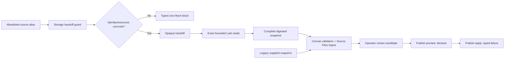
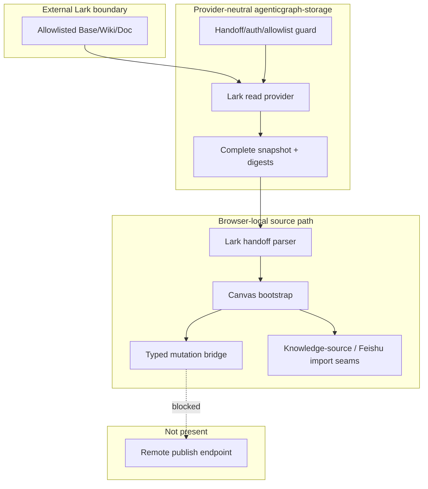

# Reference implementation: Lark Read-only Knowledge Source-to-Canvas Contract

## Reference implementation scope and readiness

This combined PRD/TAD describes source-present Lark handoff, server-only
read-only Base/Wiki/Doc ingestion, local source import, and blocked
publish-preview contracts. Provider access is owned by the provider-neutral
`agenticgraph-storage` boundary; Git-backed Markdown/frontmatter remains the
portable authored authority. Storage handoff issuance is authenticated and
membership-gated; the separate browser mutation bridge's identity-shaped fields
remain unverified. This document does not claim that placeholder configuration
can call Lark, that a Production issuer/caller exists, that a remote write
endpoint exists, or that any public route has been verified.

| Scope | Local rung | Delivered rung | Basis |
|---|---|---|---|
| Combined contract | `spec-complete` | `undocumented` | The read-only contract is implemented and deterministic VCC hosts are stated; concrete Lark identity/resources and delivery Evidence References are absent. |

The readiness ladder is `undocumented` → `spec-complete` → `dev-proven` →
`runtime-ready` → `production-verified`.

### Actual repository baseline

| Source owner | Source-present fact | Explicit limit |
|---|---|---|
| `grph-shared/src/search/larkAppMcpSsot.ts` | Owns Lark admin links, configuration labels, Canvas/import labels, and local preview guidance. | Its phase and endpoint-shaped strings are UI constants, not delivery evidence. |
| `canvas/src/features/panels/views/larkAppMcpApiDocs.ts` | Builds virtual MainPanel rows and remote-config text. | The browser does not become a Lark backend or verify route availability. |
| `canvas/src/features/canvas/larkAppCanvasHandoff.ts` | Builds/parses legacy query-based review/import payloads plus fragment-based `kgKnowledgeSourceHandoff`, then removes the consumed location state. | Legacy base64url is only encoding; the knowledge-source token is a five-minute scoped AEAD bearer capability, not a browser identity assertion. |
| `canvas/src/features/canvas/CanvasQueryBootstrapRuntime.tsx` | Consumes the handoff and installs local commands. | It is browser-local app behavior. |
| `canvas/src/features/canvas/larkAppRemoteMutationBridge.ts` | Defines typed import and publish-preview requests/results with idempotency, conflict, audit, and blocked-readiness fields. | Type fields do not perform authentication. |
| `canvas/src/features/canvas/larkAppRemoteMutationBridgeRuntime.ts` | Delegates `import-source-document` to the existing Feishu import command; returns a blocked preview for publish dry-runs; rejects non-dry-run publish. | No remote mutation transport or remote publish endpoint. |
| `cloudflare/workers/agenticgraph-storage/knowledge-source/` | Owns server identity, allowlist admission, exact Lark reads, complete snapshot digests, opaque handoff, and typed failures. | Read-only; no source acceptance, write-back, or deploy authority. |
| `canvas/src/features/source-files/knowledge-source/` | Bounded-streams the response, validates closed counts/schema, recomputes both canonical SHA-256 digests, sanitizes snapshots, and creates a new Source File. | No Lark credential, configured resource identifier/OpenAPI override, long-lived `VITE_*` bearer, overwrite behavior, or second persistence owner; approved primitive business links may remain. |
| Focused Lark/knowledge-source tests | Exercise authenticated issuance, old/new handoffs, local import delegation, zero-fetch blocks, exact Base/Wiki/Doc reads, stable totals/revisions, digests, redaction, blocked publish, and secret/override rejection. | Worker files are a standalone VCC not yet wired into `storage:relay:test`; the Canvas registry case is a separate critical-path VCC. Neither is live Lark, host, public-route, or Production proof. |

The exact remote MCP target must not be copied into this document. The sole
AgenticGraph Invocation Register and endpoint owner is
[the MCP installation contract](../agenticgraph-mcp-install-contract.md). The
source constant used by MainPanel must be reconciled with that owner before a
delivery claim.

## PRD

### Problem and outcome

A Lark-side workflow needs a safe way to read an exact Base, Wiki, or Doc into
AgenticGraph for review without leaking credentials/configured provider identifiers, accepting
arbitrary resource/endpoint overrides, or mistaking a browser bridge for source
authority or remote write. The first-value outcome is a complete, digested,
zero-model-token candidate delivered through an opaque Canvas handoff. Live
reads remain blocked until concrete server identity/resources exist, and remote
publishing remains blocked.

### Personas and user stories

| Persona | User story | Success signal |
|---|---|---|
| Lark operator | As an operator, I want the canonical MCP target referenced once so that setup cannot drift across provider documents. | This document links the install contract instead of repeating an endpoint. |
| Reviewer | As a reviewer, I want a scoped handoff and bounded client verification so that imported content remains user-mediated. | Authenticated membership gates issuance; only the five-minute AEAD capability crosses the URL fragment, never the initial request/referrer, and Canvas recomputes both digests before create-only import. |
| Knowledge operator | As an operator, I want Base/Wiki/Doc resources selected by a server allowlist so that browser input cannot redirect provider access. | A source alias resolves to one pinned resource and allowlist revision. |
| Importer | As an importer, I want a reviewed snapshot delegated to the existing source-file seam so that validation is not duplicated. | The local bridge invokes the Feishu import command. |
| Publisher | As a publisher, I want an honest preview when remote publish is unavailable so that no dry-run is mistaken for a write. | Preview says blocked; non-dry-run publish returns failure. |
| Auditor | As an auditor, I want authenticated storage issuance distinguished from unverified mutation-bridge fields and missing Production issuer evidence. | Read admission and write-side gaps are stated separately; no live/Production claim follows from source types. |

### User journey flow

| Stage | User action | Touchpoint | Friction | Required outcome |
|---|---|---|---|---|
| Trigger | Starts from a Lark admin/webpage/backend surface. | External Lark surface | Admin URLs can be mistaken for MCP endpoints. | Resolve target only through the canonical install contract. |
| Discover | Selects an allowlisted source alias. | Storage handoff route | Payload may contain secrets/resource overrides or unresolved placeholders. | Authenticate, resolve server config, and block with zero provider fetches or return an opaque token. |
| Engage | Reads and imports a Base/Wiki/Doc snapshot. | Storage read route + Canvas Source Files | A partial/provider-shaped snapshot may bypass validation. | Complete every page, digest the normalized envelope, and delegate only a sanitized snapshot. |
| Complete | Reviews a candidate or requests publish preview. | Canvas/browser-local bridge | Preview may be mistaken for source acceptance or remote mutation. | Preserve review-only status and return blocked publish metadata. |
| Return | Refreshes or attempts actual remote publish later. | Read-only storage/future write service | No write endpoint or authorization exists. | Read a new complete candidate; fail closed for writes. |

### Requirements and prioritization

| ID | Requirement | Priority |
|---|---|---|
| `PRD-LARK-01` | Keep AgenticGraph endpoint ownership solely in the canonical MCP installation contract. | Must |
| `PRD-LARK-02` | Reject secret-like material and endpoint overrides in handoff and mutation payloads. | Must |
| `PRD-LARK-03` | Reuse the existing Feishu source import command for local import. | Must |
| `PRD-LARK-04` | Require explicit idempotency key, conflict policy, audit reason, and target for bridge requests. | Must |
| `PRD-LARK-05` | Keep publish dry-runs preview-only and blocked; reject non-dry-run publish. | Must |
| `PRD-LARK-06` | Do not describe typed `authContext` fields as cryptographic authentication. | Must |
| `PRD-LARK-07` | Add a remote write service without a separate auth, conflict, audit, cost, and rollback ADR. | Won't in this increment |
| `PRD-LARK-08` | Own provider reads only in `agenticgraph-storage`; keep Git-backed Markdown/frontmatter authoritative. | Must |
| `PRD-LARK-09` | Resolve identity/resources only from `AGENTICGRAPH_STORAGE_LARK_*` and `agenticgraph-knowledge-source-allowlist/v1`. | Must |
| `PRD-LARK-10` | Execute only the exact allowlisted Base, Wiki-node-to-Doc, or direct Doc read set; for Base require approved visible fields, stable totals, minimum records, and matching pre/post table revision. | Must |
| `PRD-LARK-11` | Return stable typed zero-fetch blocks for placeholder/missing identity/resources, unknown aliases, and allowlist drift. | Must |
| `PRD-LARK-12` | Emit only complete `agenticgraph-knowledge-source-snapshot/v1` envelopes and require Canvas to bounded-stream, validate, and recompute content/envelope digests before mutation. | Must |
| `PRD-LARK-13` | Gate handoff issuance on authenticated workspace membership, then use `kgKnowledgeSourceHandoff` only for `sourceId` plus a five-minute AEAD bearer capability; use no `VITE_*` provider/long-lived storage bearer and import create-only. | Must |

### Acceptance criteria

| Requirement | Given / When / Then | VCC |
|---|---|---|
| `PRD-LARK-01` | Given this document, when an operator needs a AgenticGraph endpoint, then exactly one link resolves to the canonical register and no endpoint is duplicated here. | `VCC-LARK-01` |
| `PRD-LARK-02` | Given secret-like or endpoint-override fields, when a handoff/request is built, then construction fails before import. | `VCC-LARK-02` |
| `PRD-LARK-03` | Given a valid local import request, when the runtime command executes, then it delegates to `importSnapshot`. | `VCC-LARK-03` |
| `PRD-LARK-04` | Given missing identity, idempotency, conflict, audit, or target fields, when normalization runs, then it returns an error. | `VCC-LARK-04` |
| `PRD-LARK-05` | Given publish dry-run, when executed, then a blocked preview is returned; given non-dry-run publish, then failure is returned. | `VCC-LARK-05` |
| `PRD-LARK-06` | Given the current runtime, when auth behavior is inspected, then storage issuance's authenticated membership is not confused with the mutation bridge's unverified identity fields or remote publish authorization. | `VCC-LARK-06` |
| `PRD-LARK-07` | Given a proposed remote write service, when activation is reviewed, then it remains blocked without a separate auth, conflict, audit, cost, and rollback ADR. | `VCC-LARK-07` |
| `PRD-LARK-08` | Given a provider read, when ownership is traced, then only `agenticgraph-storage` contacts Lark and the result remains a candidate projection. | `VCC-LARK-08` |
| `PRD-LARK-09` | Given caller-supplied provider identity/resource fields, when admission runs, then they cannot override server configuration. | `VCC-LARK-09` |
| `PRD-LARK-10` | Given Base/Wiki/Doc fixtures, when a read runs, then only pinned resources are requested; Base pre/post revisions and totals match, approved fields are visible, minimum count holds, and Wiki identity matches before Doc fetch. | `VCC-LARK-10` |
| `PRD-LARK-11` | Given `<tenant-app\|user-oauth>` or placeholder resources, when handoff/read is requested, then a stable block code returns with provider fetch count zero. | `VCC-LARK-11` |
| `PRD-LARK-12` | Given success, when Canvas bounded-streams the envelope, then it validates counts/schema and independently recomputes both SHA-256 digests before Source Files mutation; incomplete/oversize work has no import. | `VCC-LARK-12` |
| `PRD-LARK-13` | Given a Canvas handoff, when issued/consumed, then authenticated membership precedes issuance, only alias plus five-minute AEAD capability cross the removed URL fragment, the capability is absent from the initial request/`Referer`, and a filename collision creates a suffix rather than overwriting. | `VCC-LARK-13` |

### Economics, TTV, and delivery reach

| Scope | Impact × reach | Build + TCO + token score | ROI score | Decision |
|---|---:|---:|---:|---|
| Local review/import handoff | `7 × 5` | `3 + 0 + 0` | `11.67` | Retain. |
| Allowlisted Base/Wiki/Doc read | `8 × 5` | `5 + 1 + 0` | `6.67` | Retain behind zero-fetch configuration and evidence gates. |
| Remote publish service | `5 × 3` | `9 + 7 + 4` | `0.75` | Reject until evidence and demand justify it. |

| Metric | Current fact | Gate |
|---|---|---|
| Time to first value | Not measured | At most 5 minutes from opaque handoff to reviewed local import after server setup; record clean-browser evidence. |
| Handoff/import model tokens | 0 | Remain 0; parsing and transformation are deterministic. |
| Publish-preview model tokens | 0 | Remain 0. |
| Runtime loops | Bounded provider page/byte/time traversal; no model loop | Preserve caps; any retry policy needs numeric attempt/time bounds. |
| Managed 12-month incremental AgenticGraph TCO | USD 0 for browser-local source path; Lark/Worker cost unmeasured | Measure provider/Worker request and egress cost before delivery. |
| Self-managed 12-month TCO | Not selected; unmeasured | Compare host compute, auth operations, maintenance, storage, and egress. |
| Hybrid 12-month TCO | Not selected; unmeasured | Compare separately. |

| Reach | Current source behavior |
|---|---|
| Browser | Legacy/new handoff parsing, complete-envelope validation, and local commands are source-present. |
| Mobile browser | No distinct evidence; large snapshot usability is unmeasured. |
| Offline | Local parsing/import can operate on supplied data; live Lark reads require the server/provider network. |

### Exact read-only Lark contract

The public API version is `agenticgraph-knowledge-source/v1` and the only AgenticGraph
routes are:

- `POST /api/storage/knowledge-source/handoff` to authenticate the AgenticGraph
  session, require active workspace membership, resolve the source/server
  configuration, and issue a five-minute AEAD bearer capability without
  fetching Lark content; and
- `POST /api/storage/knowledge-source/read` to redeem that scoped capability,
  revalidate its identity/allowlist binding, perform the bounded provider read,
  and return a complete snapshot envelope. Redemption does not accept a
  browser-supplied identity or long-lived `VITE_*` bearer.

The `agenticgraph-knowledge-source-allowlist/v1` resource variants and exact reads
are:

| Kind | Server-only pinned identifiers | Exact Lark reads |
|---|---|---|
| Base | `appToken`, `tableId`, `viewId`, 1–100 unique operator-approved `fieldNames`, `minimumRecordCount` 1–2000 | Pre/post `GET /open-apis/bitable/v1/apps/{app_token}/tables`; `GET /open-apis/bitable/v1/apps/{app_token}/tables/{table_id}/fields` with `view_id`; `POST /open-apis/bitable/v1/apps/{app_token}/tables/{table_id}/records/search?page_size=200[&page_token=...]` with `{ view_id, field_names, automatic_fields: false }` |
| Wiki | `spaceId`, `nodeToken`, `documentId` | `GET /open-apis/wiki/v2/spaces/get_node?token={node_token}`; require matching `space_id`, `node_token`, `obj_type: "docx"`, and `obj_token: documentId`, then read that pinned Doc's raw content |
| Doc | `documentId` | `GET /open-apis/docx/v1/documents/{document_id}/raw_content` for the pinned document |

Every Base page family must continue to completion with a stable safe-integer
`total` and exact final equality. Every approved field must be present and
non-hidden, the record count must meet `minimumRecordCount`, and the exact table
revision must match before/after. These guards prevent advanced permissions from
turning hidden fields or empty-looking success into an accepted snapshot. A Wiki
object mismatch fails as `source_config_drift` before document content is
fetched. No page/read error, truncation, cap breach, drift, or malformed response
may be represented as `complete: true`.

`tenant-app` uses server-held app ID/secret and
`POST /open-apis/auth/v3/tenant_access_token/internal`; its token acquisition is
bounded, request-local single-flight, cached, and self-refreshing before expiry.
`user-oauth` uses only an external broker/operator-managed server-held user access token plus
required absolute expiry, fails closed within five minutes of expiry, and treats
provider auth invalidation as terminal. It does not select `offline_access`,
store/rotate a refresh token, call `/open-apis/authen/v2/oauth/token`, or own the
provider's one-time refresh-token rotation or reauthorization lifecycle. A full
provider flow would require user-authorized `offline_access`, rotating each
refresh token, and reauthorization within the provider's 365-day limit; none is
selected here. Exact scopes/permissions remain an operator decision. The browser receives neither credentials, configured
Base/Wiki/Doc identifiers, nor OpenAPI endpoint overrides. Nested provider
ID/token/email/avatar/download/link/URL metadata, provider-shaped identifier
strings, and non-approved Base fields are removed within hard bounds. Authorized
primitive business content—including user-authored links—may remain and follows
the normal Markdown sanitization boundary. The literal supplied identity/resources are
placeholders, so live readiness remains blocked and the runtime must return a
typed zero-fetch result. The existing server-only
`AGENTICGRAPH_STORAGE_SIGNING_SECRET` seals each five-minute AES-GCM AEAD handoff. In
Cloudflare, the app secret, user access token, and signing secret must be secret
bindings rather than plaintext Worker variables or repository content.

Success uses `agenticgraph-knowledge-source-snapshot/v1` with `complete: true`,
provider/kind/source alias, identity mode, allowlist revision/digest, provider
revision when available, fetch time, counts, `contentDigest`, `envelopeDigest`,
sanitized snapshot, and warnings. Canvas receives only `sourceId` plus the
opaque capability under `kgKnowledgeSourceHandoff`, bounded-streams/cancels the
response, validates exact counts/schema, recomputes both canonical SHA-256
digests, and rejects any incomplete or invalid response before create-only
Source Files mutation.

The knowledge-source handoff uses the URL fragment, not the query string. The
fragment is excluded from the initial HTTP request and `Referer` header and is
removed immediately after Canvas consumes it. Legacy review/import handoffs
remain query-based and retain their existing base64url, non-secret behavior.

Cloudflare currently caps each Worker variable or secret at 5 KB, while the
allowlist parser admits at most 100 sources. Env JSON is therefore an MVP
small-set catalog, not a large centralized SSOT. Larger catalogs require D1, KV,
or generated configuration and their own versioned promotion digest.

## TAD

### Workflow flow

**Trigger:** a Lark-side/server actor selects an allowlisted source alias or
constructs a legacy review/import handoff.

1. The AgenticGraph target is selected from the canonical MCP installation
   contract.
2. The storage handoff route authenticates the session, requires active
   workspace membership, and resolves server-only identity, resource allowlist,
   and revision. A configuration blocker returns before any Lark fetch.
3. A valid source produces a five-minute AEAD bearer capability bound to the
   authenticated user/session and workspace/source/identity/allowlist; Canvas
   receives only `sourceId` plus capability through the
   fragment-based `kgKnowledgeSourceHandoff`.
4. Canvas removes the fragment and redeems the scoped capability at the storage
   read route; it supplies no separate identity or `VITE_*` bearer.
5. `agenticgraph-storage` revalidates the binding, performs exact bounded
   Base/Wiki/Doc reads, enforces Base revision/total/approved-field/minimum
   invariants, strips nested provider metadata, and digests a complete snapshot.
6. Canvas bounded-streams and validates the envelope, recomputes both digests,
   sanitizes the document, and delegates to create-only Source Files ingest.
7. A publish dry-run remains a blocked preview; non-dry-run publish fails.

**Alternate paths:** a review-only handoff opens Canvas without import; the
legacy supplied-snapshot handoff still delegates to the existing Feishu import
command without contacting Lark.

**Error path:** malformed/expired token, secret or endpoint/resource override,
unresolved identity/resources, unknown alias, allowlist drift, incomplete
provider response, unsupported action, missing required field, or non-dry-run
publish fails closed. Configuration blockers perform zero provider fetches.

**Postcondition:** local import may update app-owned candidate source state;
Lark and accepted Git-backed source remain unchanged, and no remote publish
occurs.

### Data flow

| Stage | Component | Input | Output | Persistence | Failure |
|---|---|---|---|---|---|
| Ingest | Storage handoff guard or legacy parser | Authenticated member/source alias, legacy query/JSON, or knowledge capability fragment | Five-minute AEAD capability or normalized legacy intent | Consumed legacy query or capability fragment removed | Typed zero-fetch/parse error |
| Acquire | Lark provider behind `agenticgraph-storage` | Allowlisted Base/Wiki/Doc plus Base fields/minimum | Stable-revision/total bounded pages/content | Request memory only | Entire read fails on incomplete, hidden/missing field, low count, or drift |
| Transform | Storage provenance + Canvas adapter | Complete provider response | Digested sanitized envelope, then Markdown document | None | Bounded stream or client-recomputed digest/schema/completeness rejection |
| Store | Existing Source Files/Feishu import seam | Sanitized document or supplied snapshot | Server snapshot creates a new candidate; collision gets a suffix | Existing app source-file owner | Import result/error; no server-snapshot overwrite |
| Serve | Browser-local bridge | Import or publish request | Applied local import, accepted dry-run, blocked preview, or failure | Last result may be reflected in app dataset | Explicit result variant |
| Consume | Canvas/operator | Candidate/result | Review state or next-step guidance | App/operator-owned; Git only after review | No remote-write or source-acceptance success shape |

### Orchestration and harness flow

All present steps are deterministic and zero-model-token. Authenticated
membership protects capability issuance; scoped AEAD redemption and allowlist
binding protect the read. The separate mutation bridge's `authContext` remains
structurally validated, not cryptographically verified.

### Topology flow

### Journey-to-system mapping

| Journey stage | Workflow | Data stage | Harness role | Owner |
|---|---|---|---|---|
| Trigger | Select canonical target/source alias | Ingest | External dispatcher | Install contract + Lark actor |
| Discover | Resolve config/opaque handoff | Ingest | Auth/allowlist guard | `agenticgraph-storage` knowledge-source runtime |
| Engage | Complete provider read/import | Acquire/transform/store | Provider executor + local importer | Lark provider + Canvas Source Files |
| Complete | Review candidate/preview publish | Serve | Operator + blocked observer | Canvas/browser-local bridge |
| Return | Refresh/attempt future publish | Consume | Read-only refresh/fail-closed write boundary | Storage runtime/future write owner |

### Component and integration contracts

| Component ID | Component | Interface IDs | VCC mappings | Invariant |
|---|---|---|---|---|
| `TAD-LARK-ENDPOINT` | MCP installation contract | `TAD-LARK-ENDPOINT-RESOLVE` (canonical Invocation Register link) | `VCC-LARK-01` | Provider docs link; they do not duplicate targets. |
| `TAD-LARK-HANDOFF` | Handoff parser | `TAD-LARK-HANDOFF-BUILD-PARSE` (handoff builders/parser) | `VCC-LARK-02` | Legacy base64url is encoding only; a knowledge-source AEAD token is a scoped bearer capability, not a browser identity assertion. |
| `TAD-LARK-BOOTSTRAP` | Canvas bootstrap | `TAD-LARK-BOOTSTRAP-CONSUME` | `VCC-LARK-02`, `VCC-LARK-03` | No parallel canvas/import stack. |
| `TAD-LARK-REQUEST` | Mutation request contract | `TAD-LARK-REQUEST-NORMALIZE` (`buildLarkAppRemoteMutationRequest`) | `VCC-LARK-02`, `VCC-LARK-04`, `VCC-LARK-06` | Structural validation only. |
| `TAD-LARK-BRIDGE` | Local bridge | `TAD-LARK-BRIDGE-EXECUTE` (`createLarkAppRemoteMutationBridgeCommand`) | `VCC-LARK-03`, `VCC-LARK-05` | No remote write side effect. |
| `TAD-LARK-IMPORT` | Feishu import command | `TAD-LARK-IMPORT-SNAPSHOT` (`importSnapshot`) | `VCC-LARK-03` | No Lark network fetch. |
| `TAD-LARK-STORAGE` | Provider-neutral knowledge-source runtime | `TAD-LARK-STORAGE-HANDOFF`; `TAD-LARK-STORAGE-READ` | `VCC-LARK-08`, `VCC-LARK-09`, `VCC-LARK-11`, `VCC-LARK-12` | Server-only identity/allowlist; read-only; candidate output only. |
| `TAD-LARK-PROVIDER` | Exact Lark Base/Wiki/Doc reader | `TAD-LARK-PROVIDER-READ` | `VCC-LARK-10`, `VCC-LARK-12` | Pinned resources; Base stable revision/totals/approved fields/minimum; bounded complete reads only. |
| `TAD-LARK-OPAQUE` | Knowledge-source handoff/read client | `TAD-LARK-OPAQUE-CONSUME` (`kgKnowledgeSourceHandoff`) | `VCC-LARK-13` | Membership-gated issuance, five-minute bearer redemption, bounded verification, and create-only import; no provider-shaped browser contract. |
| `TAD-LARK-REMOTE` | Remote write service (not implemented) | `TAD-LARK-REMOTE-PUBLISH` | `VCC-LARK-06`, `VCC-LARK-07` | Requires separately evidenced authentication and an accepted ADR. |

### PRD ↔ TAD traceability

| Requirement | TAD component | Interface | VCC |
|---|---|---|---|
| `PRD-LARK-01` | `TAD-LARK-ENDPOINT` | `TAD-LARK-ENDPOINT-RESOLVE` | `VCC-LARK-01` |
| `PRD-LARK-02` | `TAD-LARK-HANDOFF` + `TAD-LARK-REQUEST` | `TAD-LARK-HANDOFF-BUILD-PARSE` + `TAD-LARK-REQUEST-NORMALIZE` | `VCC-LARK-02` |
| `PRD-LARK-03` | `TAD-LARK-BRIDGE` + `TAD-LARK-IMPORT` | `TAD-LARK-BRIDGE-EXECUTE` + `TAD-LARK-IMPORT-SNAPSHOT` | `VCC-LARK-03` |
| `PRD-LARK-04` | `TAD-LARK-REQUEST` | `TAD-LARK-REQUEST-NORMALIZE` | `VCC-LARK-04` |
| `PRD-LARK-05` | `TAD-LARK-BRIDGE` | `TAD-LARK-BRIDGE-EXECUTE` | `VCC-LARK-05` |
| `PRD-LARK-06` | `TAD-LARK-REQUEST` + `TAD-LARK-REMOTE` | `TAD-LARK-REQUEST-NORMALIZE` + `TAD-LARK-REMOTE-PUBLISH` | `VCC-LARK-06` |
| `PRD-LARK-07` | `TAD-LARK-REMOTE` | `TAD-LARK-REMOTE-PUBLISH` | `VCC-LARK-07` |
| `PRD-LARK-08` | `TAD-LARK-STORAGE` | `TAD-LARK-STORAGE-READ` | `VCC-LARK-08` |
| `PRD-LARK-09` | `TAD-LARK-STORAGE` | `TAD-LARK-STORAGE-HANDOFF` | `VCC-LARK-09` |
| `PRD-LARK-10` | `TAD-LARK-PROVIDER` | `TAD-LARK-PROVIDER-READ` | `VCC-LARK-10` |
| `PRD-LARK-11` | `TAD-LARK-STORAGE` | `TAD-LARK-STORAGE-HANDOFF` + `TAD-LARK-STORAGE-READ` | `VCC-LARK-11` |
| `PRD-LARK-12` | `TAD-LARK-STORAGE` + `TAD-LARK-PROVIDER` | `TAD-LARK-STORAGE-READ` | `VCC-LARK-12` |
| `PRD-LARK-13` | `TAD-LARK-OPAQUE` | `TAD-LARK-OPAQUE-CONSUME` | `VCC-LARK-13` |

### Security and error contract

| Condition | Required outcome |
|---|---|
| Secret-like key/value in handoff | Reject before parsing into app state. |
| Endpoint override in handoff/request | Reject; use canonical route owner. |
| Claimed mutation-bridge actor/session fields | Treat as data until a write-host verifier proves them; do not confuse them with authenticated storage handoff issuance. |
| Lark identity/resource fields supplied by browser | Reject/ignore; resolve only server env plus allowlist. |
| Placeholder/missing identity/resources | Return a stable zero-fetch block before Lark content access. |
| Unknown alias or allowlist revision drift | Reject handoff/read; issue no successful snapshot. |
| Base revision/total changes, approved field is missing/hidden, minimum count fails, or Wiki/Doc read is partial/mismatched/over limit | Fail the whole candidate; never set `complete: true`. |
| Snapshot bounded-stream/count/digest/schema/completeness is invalid | Reject before Source Files mutation. |
| Nested provider metadata or a non-approved Base field is returned | Drop it; retain only approved primitive business content subject to sanitization. |
| Imported filename already exists | Create a suffixed Source File; never overwrite the existing file. |
| Duplicate/replayed remote request | Future service must enforce idempotency; browser type alone is insufficient. |
| Conflict | Use explicit reject/compare policy; no silent overwrite. |
| Non-dry-run publish | Return failure with no retryable success implication. |

### Architectural decision

Keep provider reads server-only in provider-neutral `agenticgraph-storage`; keep
review and both server/supplied-snapshot imports on existing Source Files
owners. Git-backed Markdown/frontmatter remains the authored authority, and a
Lark read remains a candidate projection. Keep remote publish absent until a
separate authenticated service and deployment evidence exist. This minimizes
first-value cost and prevents endpoint, persistence, or source-authority
duplication.

### Lane and deploy boundaries

| Lane | Allowed state | Promotion rule |
|---|---|---|
| Authoring | Source contracts, docs, deterministic tests | Current lane |
| Mirror | Separately authorized projection | `closed` without instruction, evidence, target, rollback |
| Delivery | Lark host, public MCP, or remote mutation service | `closed` without trusted Production issuer/caller evidence, concrete identity/resources/fields/minimum and scopes, live VCCs, rollback, and exact candidate-digest authorization |

No authoring-lane command in this document may mutate a mirror or delivery
surface. Production deployment is forbidden until the operator authorizes the
exact revalidated candidate digest.

### Deploy Boundary Register

| Boundary | From lane | To lane | Evidence Reference | Operator instruction | Rollback statement/check | State |
|---|---|---|---|---|---|---|
| `DB-LARK-AUTHORING-MIRROR` | Authoring | Mirror | `none recorded` | `none` | Restore the prior approved mirror revision; verify its digest matches the prior promotion record. | `closed` |
| `DB-LARK-MIRROR-DELIVERY` | Mirror | Delivery | `none recorded` | `none` | Restore the prior delivered revision; rerun the Lark handoff/import health check recorded by that prior promotion. | `closed` |

## VCC and evidence register

| VCC | Exact check | Expected end state | Constraint | Evidence Reference |
|---|---|---|---|---|
| `VCC-LARK-01` | From repository root: `node -e 'const fs=require("node:fs"); const files=process.argv.slice(1); const text=files.map(f=>fs.readFileSync(f,"utf8")).join("\n"); const copied=["https:/","/airvio.co"].join(""); if(text.includes(copied) \|\| !text.includes("../agenticgraph-mcp-install-contract.md") \|\| !fs.existsSync("docs/documents/agenticgraph-mcp-install-contract.md")) process.exit(1)' docs/documents/agenticgraph-mcp/agenticgraph-lark-app-mcp-prd-tad.md docs/documents/agenticgraph-mcp/agenticgraph-lark-app-mcp-prd-tad.companion.md` | No copied target appears and the install-contract link resolves. | Deterministic source check. | None recorded |
| `VCC-LARK-02` | From `canvas/`: `node --preserve-symlinks --preserve-symlinks-main ../node_modules/tsx/dist/cli.cjs src/tests/runExport.ts src/__tests__/larkAppCanvasHandoff.test.ts testLarkAppCanvasHandoffDoesNotAcceptSecretMaterial`; then `node --preserve-symlinks --preserve-symlinks-main ../node_modules/tsx/dist/cli.cjs src/tests/runExport.ts src/__tests__/larkAppRemoteMutationBridge.test.ts testLarkAppRemoteMutationBridgeRejectsEndpointOverride` | Both invocations print `OK`; forbidden inputs fail closed. | No external Lark call. | None recorded |
| `VCC-LARK-03` | From `canvas/`: `node --preserve-symlinks --preserve-symlinks-main ../node_modules/tsx/dist/cli.cjs src/tests/runExport.ts src/__tests__/larkAppRemoteMutationBridgeRuntime.test.ts testLarkAppRemoteMutationBridgeRuntimeImportsSourceDocumentThroughExistingSeam` | `runExport` prints `OK`; valid local import delegates to the existing command. | Browser-local only. | None recorded |
| `VCC-LARK-04` | From `canvas/`: `node --preserve-symlinks --preserve-symlinks-main ../node_modules/tsx/dist/cli.cjs src/tests/runExport.ts src/__tests__/larkAppRemoteMutationBridge.test.ts testLarkAppRemoteMutationBridgeBuildsTypedRequest` | `runExport` prints `OK`; required fields and supported values are enforced. | Structural auth only. | None recorded |
| `VCC-LARK-05` | From `canvas/`: `node --preserve-symlinks --preserve-symlinks-main ../node_modules/tsx/dist/cli.cjs src/tests/runExport.ts src/__tests__/larkAppRemoteMutationBridgeRuntime.test.ts testLarkAppRemoteMutationBridgeRuntimeRejectsLivePublishUntilEndpointExists` | `runExport` prints `OK`; dry-run is blocked preview and publish apply is rejected. | No remote endpoint. | None recorded |
| `VCC-LARK-06` | No invocable cryptographic-auth or remote-write VCC exists for the browser mutation bridge. | No mutation verifier or write transport is claimed; storage-route auth does not authorize publish. | Unsatisfied for write; no delivery readiness credit. | None recorded |
| `VCC-LARK-07` | No accepted remote-write ADR or invocable remote-publish VCC exists. | Remote write activation remains blocked until auth, conflict, audit, cost, and rollback decisions are accepted and evidenced. | Unsatisfied; no readiness credit. | None recorded |
| `VCC-LARK-08` | From repository root, standalone: `TSX_TSCONFIG_PATH=canvas/tsconfig.json node --import tsx --test --test-concurrency=1 cloudflare/workers/agenticgraph-storage/knowledge-source/*.test.ts` | Provider-neutral handoff/read ownership passes focused fixtures and no provider result becomes accepted source. | Mocked transport; not yet wired into `storage:relay:test`; no live/delivery claim. | None recorded |
| `VCC-LARK-09` | Run the focused knowledge-source suite in `VCC-LARK-08`. | Only server env plus `agenticgraph-knowledge-source-allowlist/v1` select identity/resources; caller overrides fail. | No secrets in fixtures/output. | None recorded |
| `VCC-LARK-10` | Run the focused knowledge-source suite in `VCC-LARK-08`. | Exact Base POST search body/query, stable fields/search totals, approved non-hidden fields, minimum records, matching pre/post revision, and pinned Wiki/Doc reads hold. | Mocked Lark responses; no live provider claim. | None recorded |
| `VCC-LARK-11` | Run the focused knowledge-source suite in `VCC-LARK-08`. | Placeholder/missing identity/resources, unknown alias, and config drift return stable codes with provider fetch count zero. | Current identity/resource inputs remain placeholders. | None recorded |
| `VCC-LARK-12` | Run the focused knowledge-source suite in `VCC-LARK-08`, then the Canvas suite in `VCC-LARK-13`. | Server signs only complete normalized snapshots; Canvas bounded-streams, validates counts, and recomputes both canonical digests before import. | Deterministic fixtures only. | None recorded |
| `VCC-LARK-13` | From repository root: `npm -C canvas run test:ci:unit -- knowledgeSource` | The registered critical-path case proves fragment-only capability placement/removal, no query placement, bounded validation, digest recomputation, sanitization, and create-only Source Files delegation. | Distinct from Worker tests; no live Lark or Production route. | None recorded |

See [the companion](agenticgraph-lark-app-mcp-prd-tad.companion.md) for file-level
ownership and gap detail. Passing deterministic VCCs can prove contract
readiness. The Worker files above are not yet wired into `storage:relay:test`,
and the Canvas registry case is a distinct critical-path proof. Live readiness
remains blocked until a trusted Production issuer/caller, concrete identity,
exact allowlisted Base/Wiki/Doc resources plus Base fields/minimum, selected
scopes/permissions, and live negative/positive VCCs exist. Production remains
deploy-forbidden until exact candidate-digest authorization.
