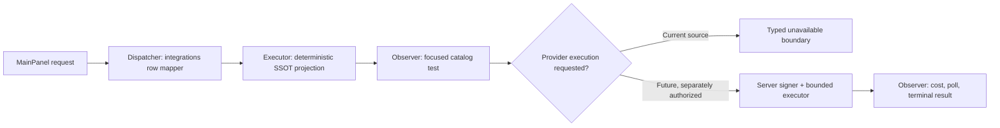
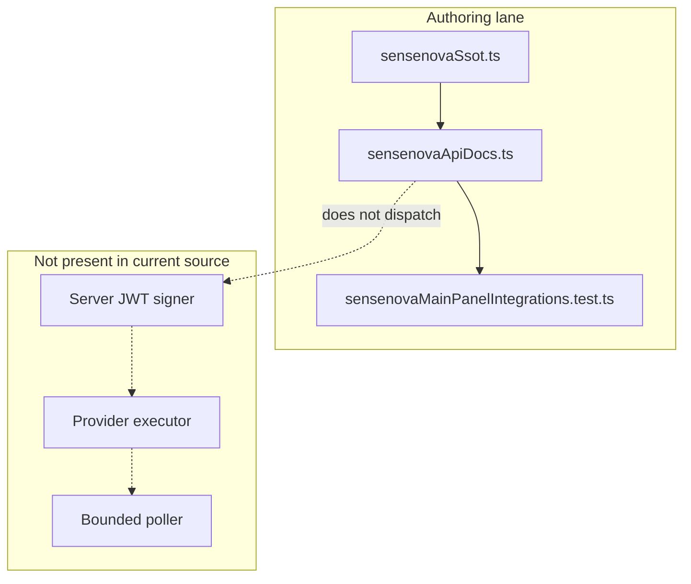

# Reference implementation: SenseNova API Documentation Contract

## Reference implementation scope and readiness

This combined PRD/TAD documents the SenseNova API rows present in the
repository. The rows are a reference catalog in MainPanel Integrations. They
are not a signer, provider client, proxy, job poller, or proof of an executed
text, image, or video request.

| Scope | Local rung | Delivered rung | Basis |
|---|---|---|---|
| Combined contract | `spec-complete` | `undocumented` | Source rows and acceptance criteria exist; no satisfying runtime or delivery Evidence Reference is attached. |

The readiness ladder is `undocumented` → `spec-complete` → `dev-proven` →
`runtime-ready` → `production-verified`.

### Actual repository baseline

| Owner | Source-present fact | Explicit gap |
|---|---|---|
| `canvas/src/features/integrations/sensenovaSsot.ts` | Defines 15 documentation rows, endpoint strings, model labels, credential variable name, auth description, poll constants, and a publish-packet schema. | No network client, signer, or credential resolver is defined here. |
| `canvas/src/features/panels/views/sensenovaApiDocs.ts` | Re-exports the row contract for MainPanel. | No execution adapter. |
| `canvas/src/features/panels/views/settingsMcpDocEntries.ts` and shared settings owners | Make the rows discoverable in the existing integrations view. | No provider call is triggered by rendering. |
| `canvas/src/__tests__/sensenovaMainPanelIntegrations.test.ts` | Checks the row catalog, ownership, secret guidance, and required document text. | Does not call the upstream service. |

The exact source-owned reference facts are:

- provider label `SenseNova AI API`
- base URL string `https://api.sensenova.cn`
- credential variable name `SENSENOVA_API_KEY`
- `Server Managed Key` posture
- `HMAC-SHA256 signed JWT` auth description
- `POST /v1/llm/chat-completions`
- `POST /v1/images/generations`
- `POST /v1/video/generations`
- a bounded async label of 36 polls × 10,000 ms

The auth description does not prove that a signer exists. Repository search
found no SenseNova request executor or proxy owner.

## PRD

### Problem and outcome

Operators need a truthful catalog for a multimodal provider without confusing
API reference rows with an executable integration. The first-value outcome is
discoverable, source-owned reference data that makes the missing execution and
secret boundaries explicit.

### Personas and user stories

| Persona | User story | Success signal |
|---|---|---|
| Operator | As an operator, I want endpoint and credential requirements in one view so that I can assess setup. | MainPanel shows source-owned labels only. |
| Workflow designer | As a designer, I want the intended multimodal sequence recorded so that a future harness has explicit handoffs. | The sequence and packet fields are specified without fabricated outputs. |
| Maintainer | As a maintainer, I want one row catalog so that UI and tests do not copy endpoint strings. | MainPanel entries derive from `sensenovaSsot.ts`. |
| Auditor | As an auditor, I want missing signer/executor evidence visible so that documentation rows cannot promote readiness. | Separate rungs and unsatisfied VCCs remain explicit. |

### User journey flow

| Stage | User action | Touchpoint | Friction | Required outcome |
|---|---|---|---|---|
| Trigger | Needs text, image, or video generation. | MainPanel Integrations | Catalog rows may look executable. | Identify them as reference data. |
| Discover | Reviews auth, endpoint, and model labels. | SenseNova row group | Credential names may be mistaken for values. | Show name only; keep values server-owned. |
| Engage | Chooses a future modality. | Future host harness | No request owner exists. | Stop with an explicit unavailable state. |
| Complete | Waits for provider output. | Future bounded poller | No poller exists despite constants. | Require a typed terminal result and loop bound. |
| Return | Hands an approved video to a media review flow. | Future cross-provider harness | IDs and URLs can be fabricated. | Accept only provider-returned values. |

### Requirements and prioritization

| ID | Requirement | Priority |
|---|---|---|
| `PRD-SN-01` | Keep the 15 documentation rows source-owned and renderable through the shared integrations surface. | Must |
| `PRD-SN-02` | Expose only the credential variable name and server-managed posture. | Must |
| `PRD-SN-03` | State that the signed-JWT label is a contract, not an existing signer. | Must |
| `PRD-SN-04` | Keep text, image, and video endpoint strings synchronized with the SSOT. | Must |
| `PRD-SN-05` | Never populate job ids, provider outputs, or media URLs from docs or fixtures. | Must |
| `PRD-SN-06` | Require an executor, auth test, bounded poll test, cost cap, and recorded evidence before runtime promotion. | Won't in this increment |

### Intended multimodal contract

`Text → Image → Video → VideoDB stream → local publish packet`

This is a specification sequence only. The current source row describes:

| Stage | Source input | Required future output | Current executor |
|---|---|---|---|
| Text | Prompt + model label | Provider-returned text | None found |
| Image | Approved text/prompt | Provider-returned image URL/base64 | None found |
| Video | Approved image/prompt | Provider job then returned video URL | None found |
| Media review | Approved video URL | Provider-returned stream URL | Separate VideoDB config/docs surface only |
| Publish packet | Approved returned values | Local packet fields | Schema label only |

### Acceptance criteria

| Requirement | Given / When / Then | VCC |
|---|---|---|
| `PRD-SN-01` | Given MainPanel Integrations, when rows are built, then all required SSOT keys are present once. | `VCC-SN-01` |
| `PRD-SN-02` | Given the credential row, when rendered, then it contains `SENSENOVA_API_KEY` and `Server Managed Key` but no credential value. | `VCC-SN-02` |
| `PRD-SN-03` | Given source ownership review, when auth code is searched, then no signer is claimed without an actual owner. | `VCC-SN-03` |
| `PRD-SN-04` | Given the source constants, when the document test runs, then all three exact method/path strings are present. | `VCC-SN-04` |
| `PRD-SN-05` | Given docs and fixtures, when checked, then provider job ids and output URLs are blank or absent until returned by an executor. | `VCC-SN-05` |
| `PRD-SN-06` | Given a proposed runtime promotion, when readiness is evaluated, then it remains blocked until executor, auth, poll-bound, cost-cap, and evidence checks are all present. | `VCC-SN-06` |

### Economics, TTV, and delivery reach

| Scope | Impact × reach | Build + TCO + token score | ROI score | Decision |
|---|---:|---:|---:|---|
| Documentation catalog | `5 × 4` | `2 + 0 + 0` | `10.0` | Retain as zero-token reference. |
| New browser provider client | `6 × 3` | `9 + 7 + 8` | `0.75` | Reject in this increment. |

| Metric | Current fact | Gate |
|---|---|---|
| Time to first value | Not measured | At most 3 minutes to find auth and endpoint reference; record a clean-client VCC. |
| Catalog tokens | 0 model tokens | Remain 0. |
| Generation tokens | No executor exists | Set numeric per-request input/output limits before activation. |
| Poll loop | Constants state 36 × 10 seconds; no executor enforces them | A future test must prove stop at or before iteration 36. |
| Managed 12-month incremental AgenticGraph TCO | USD 0 for docs rows; provider usage unmeasured | No nonzero budget without ADR approval. |
| Self-managed 12-month TCO | Not selected; unmeasured | Compare compute, maintenance, and egress before selection. |
| Hybrid 12-month TCO | Not selected; unmeasured | Compare separately before selection. |

| Reach | Current source behavior |
|---|---|
| Browser | Documentation rows can render. |
| Mobile browser | No distinct evidence. |
| Offline | Bundled rows remain readable; all provider operations are unavailable. |

The document does not own an MCP route or Invocation Register. Canonical
AgenticGraph MCP routes remain in
[the MCP installation contract](../agenticgraph-mcp-install-contract.md).

## TAD

### Workflow flow

**Trigger:** the integrations view requests SenseNova reference rows.

1. The settings view loads `SENSENOVA_DOC_ROWS`.
2. Each row maps to a virtual settings entry.
3. MainPanel renders provider, auth, endpoint, model, poll, and packet labels.
4. No provider request is dispatched.
5. A future execution request must fail unavailable until a server-owned
   signer and executor are present.

**Error path:** any credential value in browser state, fabricated output, or
unbounded poll must fail review.

**Postcondition:** the operator has reference data, not a generated asset.

### Data flow

| Stage | Component | Input | Output | Persistence | Failure |
|---|---|---|---|---|---|
| Ingest | SSOT module | Source constants | 15 row records | Bundled source | Compile/test failure |
| Transform | Row mapper | Row records | Virtual entries | None | Missing key is a focused-test failure |
| Store | Settings UI | Reference labels | Browser view state | No credential value authorized | Secret value is rejected |
| Serve | MainPanel Integrations | Virtual entries | Operator-readable catalog | None | Explicitly source-only |
| Consume | Future server harness | Approved request | Provider result | Owner-defined; absent now | Unavailable until owner exists |

### Orchestration and harness flow

The current harness performs no model call and no network call.

### Topology flow

### Journey-to-system mapping

| Journey stage | Workflow | Data stage | Harness role | Owner |
|---|---|---|---|---|
| Trigger | Open integrations | Ingest | Dispatcher | Shared settings view |
| Discover | Render catalog | Transform/serve | Deterministic executor | `sensenovaSsot.ts` |
| Engage | Request modality | Future consume | Missing executor | Future server owner |
| Complete | Poll terminal state | Future consume | Missing observer | Future poll owner |
| Return | Build approved packet | Future store | Guarded packet builder | Future workflow owner |

### Component and integration contracts

| Component ID | Component | Interface IDs | VCC mappings | Invariant |
|---|---|---|---|---|
| `TAD-SN-SSOT` | SSOT | `TAD-SN-SSOT-ROWS` (`SENSENOVA_DOC_ROWS`) | `VCC-SN-01`, `VCC-SN-02`, `VCC-SN-04` | No actual credential or output value. |
| `TAD-SN-MAINPANEL` | MainPanel mapper | `TAD-SN-MAINPANEL-MAP` (`SENSENOVA_API_DOC_ENTRIES`) | `VCC-SN-01` | Rendering has no provider side effect. |
| `TAD-SN-SIGNER` | Future signer (not implemented) | `TAD-SN-SIGNER-SIGN` | `VCC-SN-03`, `VCC-SN-06` | Raw signing material never reaches browser state. |
| `TAD-SN-EXECUTOR` | Future executor (not implemented) | `TAD-SN-EXECUTOR-DISPATCH` | `VCC-SN-05`, `VCC-SN-06` | No fabricated job or asset identifiers. |
| `TAD-SN-POLLER` | Future poller (not implemented) | `TAD-SN-POLLER-OBSERVE` | `VCC-SN-05`, `VCC-SN-06` | Maximum 36 iterations, explicit terminal failure. |

### PRD ↔ TAD traceability

| Requirement | TAD component | Interface | VCC |
|---|---|---|---|
| `PRD-SN-01` | `TAD-SN-SSOT` + `TAD-SN-MAINPANEL` | `TAD-SN-SSOT-ROWS` + `TAD-SN-MAINPANEL-MAP` | `VCC-SN-01` |
| `PRD-SN-02` | `TAD-SN-SSOT` | `TAD-SN-SSOT-ROWS` | `VCC-SN-02` |
| `PRD-SN-03` | `TAD-SN-SIGNER` | `TAD-SN-SIGNER-SIGN` | `VCC-SN-03` |
| `PRD-SN-04` | `TAD-SN-SSOT` | `TAD-SN-SSOT-ROWS` | `VCC-SN-04` |
| `PRD-SN-05` | `TAD-SN-EXECUTOR` + `TAD-SN-POLLER` | `TAD-SN-EXECUTOR-DISPATCH` + `TAD-SN-POLLER-OBSERVE` | `VCC-SN-05` |
| `PRD-SN-06` | `TAD-SN-SIGNER` + `TAD-SN-EXECUTOR` + `TAD-SN-POLLER` | `TAD-SN-SIGNER-SIGN` + `TAD-SN-EXECUTOR-DISPATCH` + `TAD-SN-POLLER-OBSERVE` | `VCC-SN-06` |

### Security, errors, and quality

| Condition | Required outcome |
|---|---|
| Missing signer/executor | Typed unavailable result; no readiness promotion. |
| Browser credential value | Reject and remove; retain variable name only. |
| Auth failure | Typed unauthorized failure; no retry loop without a renewed credential. |
| Poll bound reached | Typed timeout/failure; never fabricate a video URL. |
| Partial multimodal sequence | Preserve explicit partial state; do not emit a success packet. |
| Provider response enters app state | Validate schema and operator approval first. |

### Architectural decision

Retain the provider-specific row catalog as a reference implementation while
leaving execution absent. A browser signer or implicit proxy would expand the
secret and delivery surface without a proven first-value path.

### Lane and deploy boundaries

| Lane | Allowed state | Gate |
|---|---|---|
| Authoring | Source rows, specification, deterministic checks | Current lane |
| Mirror | Separately authorized copy | `closed` without operator instruction, evidence, target, and rollback |
| Delivery | Server executor or public app | `closed` without runtime VCCs and rollback |

This document authorizes no mirror or delivery mutation.

### Deploy Boundary Register

| Boundary | From lane | To lane | Evidence Reference | Operator instruction | Rollback statement/check | State |
|---|---|---|---|---|---|---|
| `DB-SN-AUTHORING-MIRROR` | Authoring | Mirror | `none recorded` | `none` | Restore the prior approved mirror revision; verify its digest matches the prior promotion record. | `closed` |
| `DB-SN-MIRROR-DELIVERY` | Mirror | Delivery | `none recorded` | `none` | Restore the prior delivered revision; rerun the signer/executor health check recorded by that prior promotion. | `closed` |

## VCC and evidence register

| VCC | Exact check | Expected end state | Constraint | Evidence Reference |
|---|---|---|---|---|
| `VCC-SN-01` | From `canvas/`: `node --preserve-symlinks --preserve-symlinks-main ../node_modules/tsx/dist/cli.cjs src/tests/runExport.ts src/__tests__/sensenovaMainPanelIntegrations.test.ts testSensenovaMainPanelIntegrationContractModuleLoads` | The module assertions complete and `runExport` prints `OK`; required rows map one-to-one. | Deterministic; no network. | None recorded |
| `VCC-SN-02` | Same exact `runExport` invocation as `VCC-SN-01` | Credential row exposes name and server-managed rule only. | No secret fixture. | None recorded |
| `VCC-SN-03` | No invocable signer/executor VCC exists. | No runtime owner is promoted without source. | Unsatisfied; source review is not delivery evidence. | None recorded |
| `VCC-SN-04` | Same exact `runExport` invocation as `VCC-SN-01` | Required provider label, base URL, auth text, sequence, and method/path strings remain present. | Source synchronization only. | None recorded |
| `VCC-SN-05` | No invocable provider-harness VCC exists. | Returned ids/URLs originate from typed provider responses and polling stops at 36. | Unsatisfied; no readiness credit. | None recorded |
| `VCC-SN-06` | No complete signer/executor/poller/cost evidence set exists. | Runtime promotion remains blocked until every required execution VCC has a satisfying Evidence Reference. | Unsatisfied; no readiness credit. | None recorded |

No recorded VCC result advances either readiness field.
