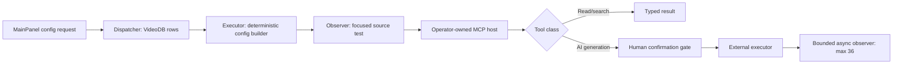
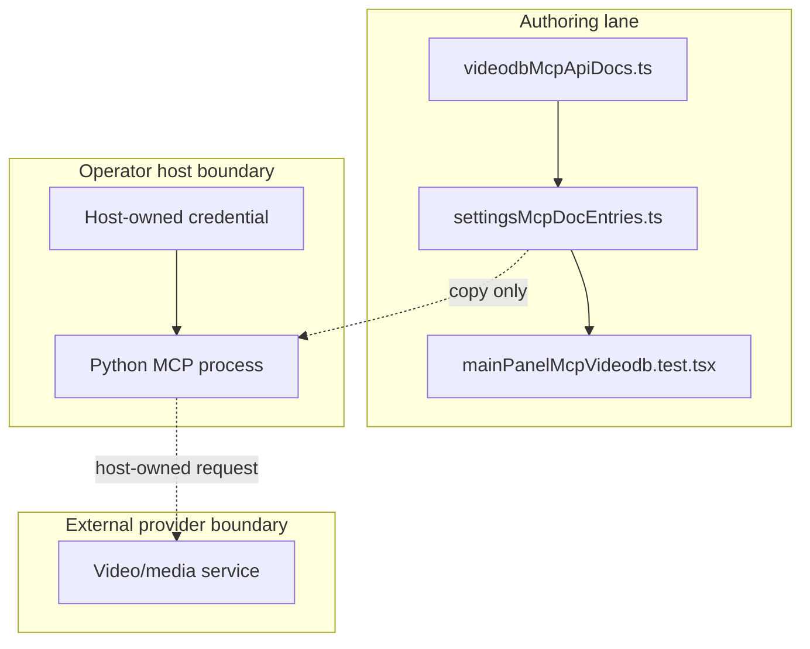

# Reference implementation: VideoDB MCP Configuration Contract

## Reference implementation scope and readiness

This combined PRD/TAD describes the repository's VideoDB Director MCP
configuration rows and deterministic config builders. It does not claim that
the browser starts the Python server, that a host has the package or
credential, that any provider tool ran, or that an output exists.

| Scope | Local rung | Delivered rung | Basis |
|---|---|---|---|
| Combined contract | `spec-complete` | `undocumented` | Source contracts and VCCs exist; no satisfying host, provider, or delivery Evidence Reference is attached. |

The readiness ladder is `undocumented` → `spec-complete` → `dev-proven` →
`runtime-ready` → `production-verified`.

### Actual repository baseline

| Source owner | Source-present fact | What it does not prove |
|---|---|---|
| `canvas/src/features/panels/views/videodbMcpApiDocs.ts` | Owns package/launcher labels, config builders, 18 tool names, 8 async names, confirmation default, and a 36 × 10,000 ms poll label. | Package installation, host connectivity, polling execution, or provider output. |
| `canvas/src/features/integrations/videodbSsot.ts` | Owns a separate REST API documentation catalog used for semantic alignment. | A repository-owned REST executor. |
| `canvas/src/features/panels/views/settingsMcpDocEntries.ts` | Adds the MCP rows to MainPanel. | An in-browser MCP host. |
| `canvas/src/__tests__/mainPanelMcpVideodb.test.tsx` | Checks rendering, placeholder-only configs, required rows, the poll constants, and confirmation default. | Provider or public-runtime verification. |

The 18 source tool identities are composed from:

- 6 core tools
- 3 search tools
- 2 index tools
- 1 stream tool
- 1 transcript tool
- 5 AI-generation tools

The 8 async names are `upload_video`, `index_video`, `index_scene`,
`generate_video`, `generate_audio`, `generate_text`, `dub_video`, and
`translate_video`. Source presence does not establish that any is executable
from AgenticGraph.

## PRD

### Problem and outcome

Operators need copyable host configuration and a truthful tool catalog without
placing a media-provider credential in browser storage. The first-value outcome
is deterministic config text containing the `VIDEODB_API_KEY` variable
placeholder, not a credential value. Media processing remains host-owned.

### Personas and user stories

| Persona | User story | Success signal |
|---|---|---|
| Operator | As an operator, I want `uvx` and `pipx` config choices so that I can configure my own MCP host. | MainPanel emits source-owned, placeholder-only text. |
| Media researcher | As a user, I want search/transcript tools distinguished from cost-bearing generation so that I can approve side effects. | Tool groups and confirmation default are visible. |
| Maintainer | As a maintainer, I want tool counts and async bounds sourced once so that docs and rows do not drift. | Focused tests consume the source constants. |
| Auditor | As an auditor, I want runtime values absent until returned by the provider so that docs cannot fabricate success. | No job id, video id, stream URL, or transcript result is prefilled. |

### User journey flow

| Stage | User action | Touchpoint | Friction | Required outcome |
|---|---|---|---|---|
| Trigger | Needs video upload, indexing, search, or generation. | MainPanel MCP | A catalog may look runnable. | Identify the external host boundary. |
| Discover | Reviews package, Python prerequisite, tools, and credential name. | VideoDB MCP rows | Credential placeholder may be confused with a value. | Render `${VIDEODB_API_KEY}` only. |
| Engage | Copies config to a host and approves a tool. | Operator MCP host | Paid/mutating operations can start unexpectedly. | Require explicit confirmation for AI-generation tools. |
| Complete | Host executes and polls if asynchronous. | External MCP process | Polling may never stop. | Stop at 36 iterations with 10,000 ms interval or earlier terminal state. |
| Return | Reviews provider-returned video, transcript, search, or stream data. | Host/app evidence path | Fixtures can masquerade as outputs. | Accept only typed returned values. |

### Requirements and prioritization

| ID | Requirement | Priority |
|---|---|---|
| `PRD-VDB-01` | Generate `uvx`, `pipx`, and Claude host text from source-owned constants. | Must |
| `PRD-VDB-02` | Emit only the credential variable placeholder; never a credential value. | Must |
| `PRD-VDB-03` | Keep the 18-tool catalog and 8-tool async subset exact and unique. | Must |
| `PRD-VDB-04` | Keep AI-generation confirmation enabled by default. | Must |
| `PRD-VDB-05` | Bound any future async observer to 36 iterations at 10,000 ms and return typed failure on exhaustion. | Must |
| `PRD-VDB-06` | Do not claim provider results, host readiness, or delivery from config/test presence. | Must |
| `PRD-VDB-07` | Add browser execution or credential ownership. | Won't in this increment |

### Acceptance criteria

| Requirement | Given / When / Then | VCC |
|---|---|---|
| `PRD-VDB-01` | Given default values, when builders run, then `uvx`, `pipx run`, and the package label appear in their exact structures. | `VCC-VDB-01` |
| `PRD-VDB-02` | Given generated text, when inspected, then it contains the environment-variable placeholder and no real-looking key or fabricated output. | `VCC-VDB-02` |
| `PRD-VDB-03` | Given the tool arrays, when composed, then 18 unique names exist and the async subset has 8 names. | `VCC-VDB-03` |
| `PRD-VDB-04` | Given the confirmation row, when rendered, then its default is `true`. | `VCC-VDB-04` |
| `PRD-VDB-05` | Given a future async job, when it remains nonterminal, then the harness stops no later than iteration 36. | `VCC-VDB-05` |
| `PRD-VDB-06` | Given source-only checks, when readiness is derived, then no runtime or delivery rung is promoted. | `VCC-VDB-06` |
| `PRD-VDB-07` | Given browser configuration, when credential and execution ownership is inspected, then no browser process runner or provider credential owner exists. | `VCC-VDB-07` |

### Economics, TTV, and delivery reach

| Scope | Impact × reach | Build + TCO + token score | ROI score | Decision |
|---|---:|---:|---:|---|
| Config/docs contract | `7 × 4` | `2 + 0 + 0` | `14.0` | Retain. |
| Browser-owned MCP runtime | `6 × 3` | `9 + 7 + 8` | `0.75` | Reject in this increment. |

| Metric | Current fact | Gate |
|---|---|---|
| Time to first value | Not measured | At most 5 minutes to find and copy host config; record clean-host evidence. |
| Config/render tokens | 0 model tokens | Remain 0. |
| Provider AI tokens/credits | No invocation owner in this source surface | Per-tool numeric cap and approval required before activation. |
| Async loop | Source label is 36 × 10,000 ms | Runtime test must prove the bound before promotion. |
| Managed 12-month incremental AgenticGraph TCO | USD 0 for config rows; provider charges unmeasured | Require provider budget and ADR before nonzero spend. |
| Self-managed 12-month TCO | Not selected; unmeasured | Compare Python host compute, maintenance, storage, and egress. |
| Hybrid 12-month TCO | Not selected; unmeasured | Compare separately. |

| Reach | Current source behavior |
|---|---|
| Browser | Config/docs rows render from bundled source. |
| Mobile browser | No distinct evidence. |
| Offline | Rows render; package installation and provider operations are unavailable. |

This document does not own a AgenticGraph Invocation Register. Canonical AgenticGraph
MCP endpoints remain in
[the MCP installation contract](../agenticgraph-mcp-install-contract.md).

## TAD

### Workflow flow

**Trigger:** an operator requests VideoDB MCP setup guidance.

1. MainPanel resolves the VideoDB virtual rows.
2. A deterministic builder selects `uvx` or `pipx`.
3. The builder emits the package name and `${VIDEODB_API_KEY}` placeholder.
4. The operator configures an external host.
5. The host obtains the secret and owns tool execution.
6. For an async tool, the host observes job state with a bounded loop.

**Alternate path:** search, transcript, health, or stream tools may return
synchronously according to the external server.

**Error path:** missing package, Python, credential, confirmation, or terminal
job state produces explicit failure; no output is fabricated.

**Postcondition:** config generation alone has no provider side effect.

### Data flow

| Stage | Component | Input | Output | Persistence | Failure |
|---|---|---|---|---|---|
| Ingest | MainPanel row mapper | Source constants | Virtual config rows | Bundled source | Compile/test failure |
| Transform | Config builder | Server key, launcher, package | JSON or command text | None | Deterministic fallback |
| Store | Operator host | Credential and host config | Host process state | Host-owned | Browser must not persist secret |
| Serve | External MCP server | Typed tool request | Result or job id | Provider-owned | Typed provider failure |
| Consume | Host observer | Job/result | Terminal media metadata | Host/app owner | Stop at loop bound |

### Orchestration and harness flow

Only the source-side dispatcher, builder, and observer are present in the
repository path documented here.

### Topology flow

### Journey-to-system mapping

| Journey stage | Workflow | Data stage | Harness role | Owner |
|---|---|---|---|---|
| Trigger | Open MCP view | Ingest | Dispatcher | Shared settings view |
| Discover | Render rows | Transform | Deterministic builder | `videodbMcpApiDocs.ts` |
| Engage | Configure/approve | Store | Host executor | Operator MCP host |
| Complete | Execute/poll | Serve | External executor + bounded observer | External host/provider |
| Return | Review result | Consume | App/host consumer | Explicit consumer owner |

### Component and integration contracts

| Component ID | Component | Interface IDs | VCC mappings | Invariant |
|---|---|---|---|---|
| `TAD-VDB-ROWS` | MCP row source | `TAD-VDB-ROWS-PROJECT` (`VIDEODB_MCP_DOC_ENTRIES`) | `VCC-VDB-03`, `VCC-VDB-04`, `VCC-VDB-06` | 18 all-tools names; 8 async names. |
| `TAD-VDB-CONFIG` | Config builders | `TAD-VDB-CONFIG-BUILD` (the three `buildVideodb*` builders) | `VCC-VDB-01`, `VCC-VDB-02` | Placeholder only; no actual key. |
| `TAD-VDB-MAINPANEL` | MainPanel aggregation | `TAD-VDB-MAINPANEL-ROWS` | `VCC-VDB-06`, `VCC-VDB-07` | No process launch. |
| `TAD-VDB-HOST` | External host | `TAD-VDB-HOST-CONFIRM-EXECUTE`; `TAD-VDB-HOST-OBSERVE` | `VCC-VDB-04`, `VCC-VDB-05`, `VCC-VDB-07` | No browser secret ownership. |
| `TAD-VDB-CONSUMER` | Future consumer (not implemented here) | `TAD-VDB-CONSUMER-INGEST` | `VCC-VDB-06` | No fabricated job ids or URLs. |

### PRD ↔ TAD traceability

| Requirement | TAD component | Interface | VCC |
|---|---|---|---|
| `PRD-VDB-01` | `TAD-VDB-CONFIG` | `TAD-VDB-CONFIG-BUILD` | `VCC-VDB-01` |
| `PRD-VDB-02` | `TAD-VDB-CONFIG` | `TAD-VDB-CONFIG-BUILD` | `VCC-VDB-02` |
| `PRD-VDB-03` | `TAD-VDB-ROWS` | `TAD-VDB-ROWS-PROJECT` | `VCC-VDB-03` |
| `PRD-VDB-04` | `TAD-VDB-ROWS` + `TAD-VDB-HOST` | `TAD-VDB-ROWS-PROJECT` + `TAD-VDB-HOST-CONFIRM-EXECUTE` | `VCC-VDB-04` |
| `PRD-VDB-05` | `TAD-VDB-HOST` | `TAD-VDB-HOST-OBSERVE` | `VCC-VDB-05` |
| `PRD-VDB-06` | `TAD-VDB-ROWS` + `TAD-VDB-MAINPANEL` + `TAD-VDB-CONSUMER` | `TAD-VDB-ROWS-PROJECT` + `TAD-VDB-MAINPANEL-ROWS` + `TAD-VDB-CONSUMER-INGEST` | `VCC-VDB-06` |
| `PRD-VDB-07` | `TAD-VDB-MAINPANEL` + `TAD-VDB-HOST` | `TAD-VDB-MAINPANEL-ROWS` + `TAD-VDB-HOST-CONFIRM-EXECUTE` | `VCC-VDB-07` |

### Security, error, and cost contract

| Condition | Required outcome |
|---|---|
| Missing `VIDEODB_API_KEY` | Host reports unavailable/unauthorized; browser does not request it. |
| AI-generation call lacks confirmation | Deny before execution. |
| Async job stays nonterminal | Stop at the bound and return typed timeout/failure. |
| Provider returns partial data | Preserve partial/error state; do not create a success packet. |
| Config contains a real-looking key or output URL | Fail the source test/review. |
| Spend cap is absent | Keep cost-bearing execution disabled. |

### Architectural decision

Use host-owned MCP configuration with placeholder-only copy text. Do not add a
browser process runner, credential store, or implicit provider fallback. This
keeps first value zero-token and keeps cost-bearing operations explicitly
outside the configuration surface.

### Lane and deploy boundaries

| Lane | Allowed state | Promotion rule |
|---|---|---|
| Authoring | Source rows, docs, deterministic tests | Current lane |
| Mirror | Separately authorized projection | `closed` without instruction, evidence, surface, and rollback |
| Delivery | Host/runtime publication | `closed` without clean-host and provider VCC evidence |

No command in this document authorizes a mirror, package installation, provider
call, or public delivery.

### Deploy Boundary Register

| Boundary | From lane | To lane | Evidence Reference | Operator instruction | Rollback statement/check | State |
|---|---|---|---|---|---|---|
| `DB-VDB-AUTHORING-MIRROR` | Authoring | Mirror | `none recorded` | `none` | Restore the prior approved mirror revision; verify its digest matches the prior promotion record. | `closed` |
| `DB-VDB-MIRROR-DELIVERY` | Mirror | Delivery | `none recorded` | `none` | Restore the prior delivered host/runtime revision; rerun the provider health check recorded by that prior promotion. | `closed` |

## VCC and evidence register

| VCC | Exact check | Expected end state | Constraint | Evidence Reference |
|---|---|---|---|---|
| `VCC-VDB-01` | From `canvas/`: `npm run test:ci:unit -- ui.mainPanel.mcpHub.videodbGeneratedConfigsPlaceholderOnly` | One registered case runs; config structures use exact launcher/package constants. | Require `SUMMARY total=1 ... failed=0`; no network. | None recorded |
| `VCC-VDB-02` | Same exact registered case as `VCC-VDB-01` | Config text has placeholder-only credential material and no fabricated runtime values. | No real key fixture. | None recorded |
| `VCC-VDB-03` | From `canvas/`: `npm run test:ci:unit -- ui.mainPanel.mcpHub.videodbSsotRowsAsyncConfirmation` | One registered case runs; counts are 18 and 8 with no duplicates. | Require `SUMMARY total=1 ... failed=0`. | None recorded |
| `VCC-VDB-04` | Same exact registered case as `VCC-VDB-03` | AI-generation confirmation default is `true`. | Source behavior only. | None recorded |
| `VCC-VDB-05` | No invocable host polling VCC exists. | Nonterminal polling stops at or before 36 iterations. | Unsatisfied; no readiness credit. | None recorded |
| `VCC-VDB-06` | Conformance review | Rungs do not exceed attached evidence. | Distinct evaluator required. | None recorded |
| `VCC-VDB-07` | Source review of MainPanel and host boundaries | Browser code exposes no process runner or VideoDB credential owner. | Source review only; no host readiness credit. | None recorded |

No VCC has a recorded result in this document, so readiness is unchanged.
